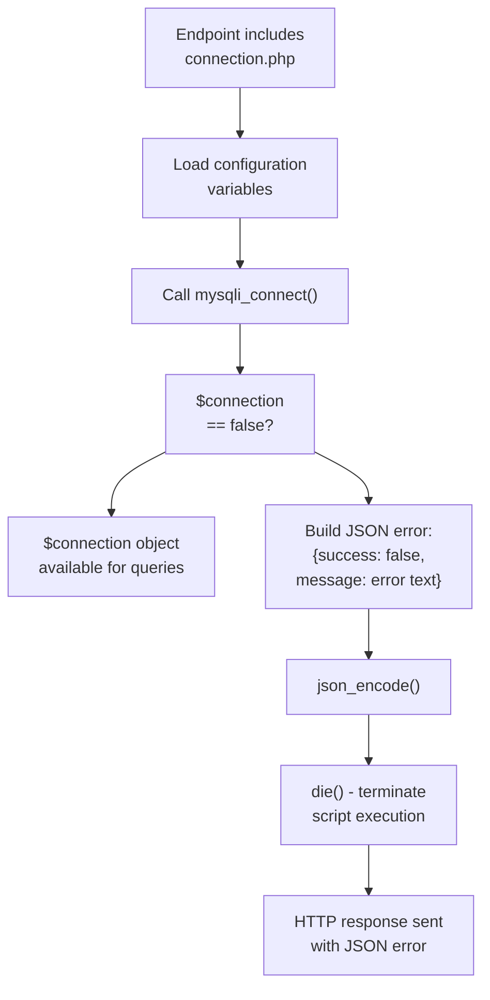
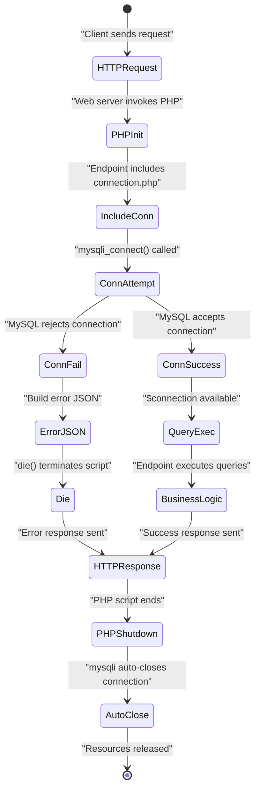
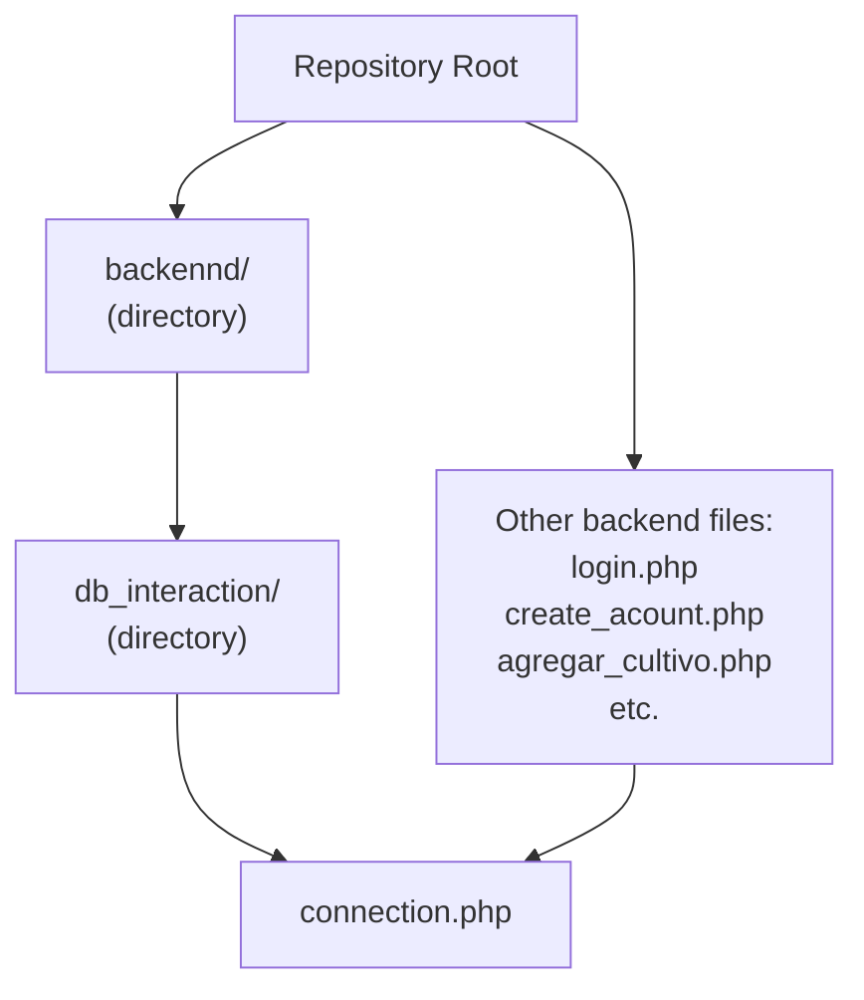

# Database Connection Layer

> **Relevant source files**
> * [backennd/db_interaction/connection.php](https://github.com/axchisan/CoopAgronet/blob/e8818744/backennd/db_interaction/connection.php)

## Purpose and Scope

The Database Connection Layer provides centralized database connectivity for all backend PHP endpoints in the CoopAgroNet system. This layer consists of a single file, `connection.php`, which establishes a mysqli connection to the MySQL database and exposes it as a global `$connection` variable for use by all API endpoints.

This document covers the configuration, connection establishment, error handling, and usage patterns of the database connection layer. For documentation on specific endpoints that consume this connection, see [User Authentication System](/axchisan/CoopAgronet/2.2-user-authentication-system), [Crop Management API](/axchisan/CoopAgronet/2.3-crop-management-api), and [Support Question System](/axchisan/CoopAgronet/2.4-support-question-system). For the overall database schema, see [Database Schema](/axchisan/CoopAgronet/1.3-database-schema).

---

## Architecture Overview

The connection layer implements a shared connection factory pattern where each backend endpoint includes or requires `connection.php` to obtain a database connection. This design centralizes configuration but creates a new connection for each HTTP request, as there is no connection pooling or persistent connection mechanism.

```

```

**Sources:** [backennd/db_interaction/connection.php L1-L15](https://github.com/axchisan/CoopAgronet/blob/e8818744/backennd/db_interaction/connection.php#L1-L15)

---

## Connection Configuration

The connection layer uses four configuration variables to establish the database connection. These variables are defined as global variables in the PHP script.

| Variable | Value | Purpose |
| --- | --- | --- |
| `$host` | `"localhost:3306"` | MySQL server hostname and port |
| `$user` | `"root"` | Database user account |
| `$password` | `""` (empty string) | Database user password |
| `$database` | `"CoopAgroNet"` | Target database name |

The configuration is hardcoded in [backennd/db_interaction/connection.php L5-L8](https://github.com/axchisan/CoopAgronet/blob/e8818744/backennd/db_interaction/connection.php#L5-L8)

 with the following definitions:

```

```

**Security Note:** The use of the `root` user with an empty password represents a significant security vulnerability. This configuration should never be used in production environments.

**Sources:** [backennd/db_interaction/connection.php L5-L8](https://github.com/axchisan/CoopAgronet/blob/e8818744/backennd/db_interaction/connection.php#L5-L8)

---

## Connection Establishment Process

The connection is established using PHP's procedural mysqli API through the `mysqli_connect()` function. The function is called with the four configuration parameters and returns either a mysqli connection object on success or `false` on failure.

```mermaid
sequenceDiagram
  participant PHP Endpoint
  participant (e.g., login.php)
  participant connection.php
  participant mysqli_connect()
  participant MySQL Server
  participant HTTP Response

  PHP Endpoint->>connection.php: "include/require connection.php"
  connection.php->>connection.php: "Read config variables
  connection.php->>mysqli_connect(): ($host, $user, $password, $database)"
  mysqli_connect()->>MySQL Server: "mysqli_connect($host, $user, $password, $database)"
  MySQL Server->>MySQL Server: "TCP connection to localhost:3306"
  MySQL Server->>MySQL Server: "Authenticate user 'root'"
  loop [Connection Successful]
    MySQL Server-->>mysqli_connect(): "Select database 'CoopAgroNet'"
    mysqli_connect()-->>connection.php: "Connection established"
    connection.php->>connection.php: "mysqli object"
    connection.php-->>PHP Endpoint: "$connection = mysqli object"
    PHP Endpoint->>PHP Endpoint: "Continue execution
    MySQL Server-->>mysqli_connect(): $connection available"
    mysqli_connect()-->>connection.php: "Execute database queries
    connection.php->>HTTP Response: using $connection"
    HTTP Response-->>PHP Endpoint: "Connection error"
  end
```

The connection object is stored in the global variable `$connection` at [backennd/db_interaction/connection.php L10](https://github.com/axchisan/CoopAgronet/blob/e8818744/backennd/db_interaction/connection.php#L10-L10)

:

```

```

Once created, the `$connection` variable is accessible to all code in the endpoint script that included `connection.php`. Endpoints use this object to execute SQL queries via mysqli functions such as `mysqli_query()`, `mysqli_prepare()`, `mysqli_fetch_assoc()`, etc.

**Sources:** [backennd/db_interaction/connection.php L10](https://github.com/axchisan/CoopAgronet/blob/e8818744/backennd/db_interaction/connection.php#L10-L10)

---

## Error Handling Mechanism

The connection layer implements a fail-fast error handling strategy. If the connection cannot be established, the script terminates immediately using PHP's `die()` function and outputs a JSON-formatted error message.

The error check is performed at [backennd/db_interaction/connection.php L12-L14](https://github.com/axchisan/CoopAgronet/blob/e8818744/backennd/db_interaction/connection.php#L12-L14)

:

```

```

### Error Response Format

When a connection failure occurs, the script outputs a JSON object with the following structure:

```

```

The error details are obtained from `mysqli_connect_error()`, which returns a string describing the last connection error.

### Error Flow Diagram



**Implications:**

* Connection failures prevent any endpoint logic from executing
* The JSON response format matches the success/error pattern used by other endpoints
* No retry mechanism or fallback connection exists
* The error message is in Spanish ("Error al conectar con la base de datos")

**Sources:** [backennd/db_interaction/connection.php L12-L14](https://github.com/axchisan/CoopAgronet/blob/e8818744/backennd/db_interaction/connection.php#L12-L14)

---

## Usage Pattern by Endpoints

All eight backend endpoints consume the connection layer by including or requiring `connection.php`. The table below shows each endpoint and how it incorporates the connection:

| Endpoint | Include Method | Connection Usage |
| --- | --- | --- |
| `login.php` | `include` | Queries `usuarios` table with prepared statements |
| `create_acount.php` | `require_once` | Inserts into `usuarios` table with prepared statements |
| `agregar_cultivo.php` | `require` | Inserts into `cultivos` table with direct SQL |
| `obtener_cultivos.php` | `require` | Queries `cultivos` table with direct SQL |
| `obtener_cultivo.php` | `require` | Queries single `cultivos` record with direct SQL |
| `editar_cultivo.php` | `require` | Updates `cultivos` table with direct SQL |
| `eliminar_cultivo.php` | `require` | Deletes from `cultivos` table with direct SQL |
| `enviar_pregunta.php` | `require` | Queries `usuarios` and inserts into `preguntas` with prepared statements |

### Typical Usage Example

Endpoints follow this pattern:

1. Include the connection file
2. Access the `$connection` global variable
3. Execute queries using mysqli functions
4. Return results to the client

The connection object provides access to mysqli functions including:

* `mysqli_query($connection, $sql)` - Execute direct SQL queries
* `mysqli_prepare($connection, $sql)` - Prepare parameterized statements
* `mysqli_fetch_assoc($result)` - Fetch associative array from result set
* `mysqli_num_rows($result)` - Get number of rows in result
* `mysqli_close($connection)` - Close the connection (rarely used, as PHP auto-closes)

**Sources:** [backennd/db_interaction/connection.php L10](https://github.com/axchisan/CoopAgronet/blob/e8818744/backennd/db_interaction/connection.php#L10-L10)

---

## Debug Configuration

The connection layer enables comprehensive error reporting for development purposes through PHP error configuration directives at [backennd/db_interaction/connection.php L2-L3](https://github.com/axchisan/CoopAgronet/blob/e8818744/backennd/db_interaction/connection.php#L2-L3)

:

```

```

These directives configure PHP to:

* Report all error types (`E_ALL` includes notices, warnings, errors, and deprecated features)
* Display errors directly in the HTTP response (`display_errors = 1`)

**Security Warning:** These debug settings expose internal error information to clients and should be disabled in production environments. Error details can reveal database structure, file paths, and other sensitive system information.

**Sources:** [backennd/db_interaction/connection.php L2-L3](https://github.com/axchisan/CoopAgronet/blob/e8818744/backennd/db_interaction/connection.php#L2-L3)

---

## Connection Lifecycle

The connection lifecycle follows PHP's request-response model with no connection persistence across HTTP requests.



**Key Characteristics:**

1. **Per-Request Creation:** A new connection is established for every HTTP request
2. **No Pooling:** No connection pool or reuse mechanism exists
3. **Automatic Cleanup:** PHP automatically closes the mysqli connection when the script terminates
4. **No Persistent Connections:** `mysqli_connect()` is used instead of `mysqli_pconnect()`

This design is simple but inefficient for high-traffic scenarios, as connection establishment overhead occurs on every request.

**Sources:** [backennd/db_interaction/connection.php L10-L14](https://github.com/axchisan/CoopAgronet/blob/e8818744/backennd/db_interaction/connection.php#L10-L14)

---

## Security Analysis

The database connection layer contains several critical security vulnerabilities:

### Critical Issues

| Vulnerability | Location | Risk Level | Description |
| --- | --- | --- | --- |
| Default Credentials | [backennd/db_interaction/connection.php L6-L7](https://github.com/axchisan/CoopAgronet/blob/e8818744/backennd/db_interaction/connection.php#L6-L7) | **Critical** | Uses `root` user with empty password |
| Debug Mode Enabled | [backennd/db_interaction/connection.php L2-L3](https://github.com/axchisan/CoopAgronet/blob/e8818744/backennd/db_interaction/connection.php#L2-L3) | **High** | Exposes error details to clients via `display_errors` |
| Hardcoded Configuration | [backennd/db_interaction/connection.php L5-L8](https://github.com/axchisan/CoopAgronet/blob/e8818744/backennd/db_interaction/connection.php#L5-L8) | **Medium** | No environment-based configuration |
| Exposed Port | [backennd/db_interaction/connection.php L5](https://github.com/axchisan/CoopAgronet/blob/e8818744/backennd/db_interaction/connection.php#L5-L5) | **Low** | Explicit port specification in connection string |

### Recommendations

1. **Credential Security:** * Create a dedicated database user with limited privileges * Use strong passwords stored in environment variables * Implement least-privilege access (SELECT, INSERT, UPDATE, DELETE on specific tables only)
2. **Error Handling:** * Disable `display_errors` in production * Log errors to file instead of displaying to clients * Use generic error messages in JSON responses
3. **Configuration Management:** * Move credentials to environment variables or configuration files outside web root * Use different configurations for development, staging, and production environments * Implement configuration validation on application startup
4. **Connection Security:** * Consider using SSL/TLS for database connections if database is on separate server * Implement connection timeout settings * Add connection pooling for improved performance

**Sources:** [backennd/db_interaction/connection.php L2-L8](https://github.com/axchisan/CoopAgronet/blob/e8818744/backennd/db_interaction/connection.php#L2-L8)

---

## File Structure Context

The connection file is located in the `backennd/db_interaction/` directory (note the typo "backennd" with double 'n'). This directory serves as the centralized location for database-related code, though currently it only contains the single connection file.



The separation of `connection.php` into a subdirectory suggests an intention to organize database interaction code, though this pattern is not fully realized as query logic remains embedded in individual endpoint files.

**Sources:** [backennd/db_interaction/connection.php L1](https://github.com/axchisan/CoopAgronet/blob/e8818744/backennd/db_interaction/connection.php#L1-L1)