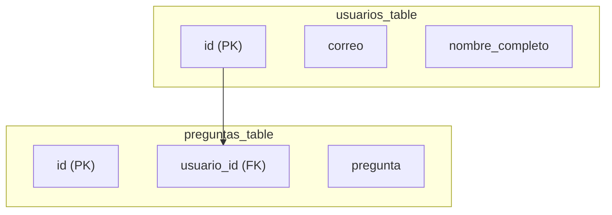
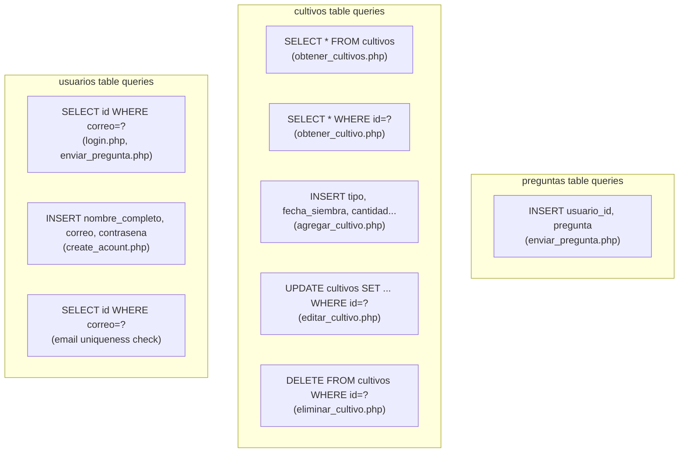
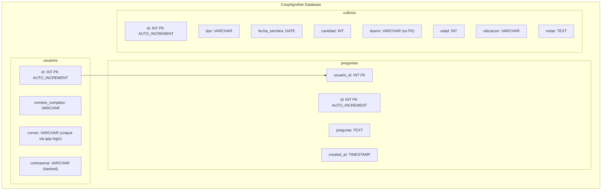

# Database Schema

> **Relevant source files**
> * [backennd/db_interaction/agregar_cultivo.php](https://github.com/axchisan/CoopAgronet/blob/e8818744/backennd/db_interaction/agregar_cultivo.php)
> * [backennd/db_interaction/connection.php](https://github.com/axchisan/CoopAgronet/blob/e8818744/backennd/db_interaction/connection.php)
> * [backennd/db_interaction/create_acount.php](https://github.com/axchisan/CoopAgronet/blob/e8818744/backennd/db_interaction/create_acount.php)
> * [backennd/db_interaction/enviar_pregunta.php](https://github.com/axchisan/CoopAgronet/blob/e8818744/backennd/db_interaction/enviar_pregunta.php)

## Purpose and Scope

This document provides a complete technical specification of the CoopAgroNet MySQL database schema. It covers the three main tables (`usuarios`, `cultivos`, `preguntas`), their column definitions, data types, constraints, and foreign key relationships. For information about how backend endpoints interact with this schema, see [Backend System](/axchisan/CoopAgronet/2-backend-system). For database connection configuration, see [Database Connection Layer](/axchisan/CoopAgronet/2.1-database-connection-layer).

---

## Database Overview

The CoopAgroNet system uses a MySQL database named `CoopAgroNet` hosted on `localhost:3306`. The schema consists of three tables that support user authentication, crop management, and customer support functionality:

| Table | Purpose | Primary Key | Foreign Keys |
| --- | --- | --- | --- |
| `usuarios` | Stores registered user accounts with authentication credentials | `id` | None |
| `cultivos` | Stores crop records with cultivation details | `id` | None |
| `preguntas` | Stores support questions linked to registered users | `id` | `usuario_id` → `usuarios.id` |

The database connection is managed through `connection.php` which establishes a mysqli connection using root credentials with no password.

**Sources:** [backennd/db_interaction/connection.php L5-L10](https://github.com/axchisan/CoopAgronet/blob/e8818744/backennd/db_interaction/connection.php#L5-L10)

---

## Entity Relationship Diagram

```

```

**Diagram: Database Entity Relationship Model**

This diagram shows that `usuarios` has a one-to-many relationship with `preguntas`, while `cultivos` operates as an independent entity with no foreign key constraints.

**Sources:** [backennd/db_interaction/create_acount.php L55-L57](https://github.com/axchisan/CoopAgronet/blob/e8818744/backennd/db_interaction/create_acount.php#L55-L57)

 [backennd/db_interaction/agregar_cultivo.php L16-L17](https://github.com/axchisan/CoopAgronet/blob/e8818744/backennd/db_interaction/agregar_cultivo.php#L16-L17)

 [backennd/db_interaction/enviar_pregunta.php L40-L42](https://github.com/axchisan/CoopAgronet/blob/e8818744/backennd/db_interaction/enviar_pregunta.php#L40-L42)

---

## Table Definitions

### usuarios Table

The `usuarios` table stores user account information for authentication and authorization. It enforces email uniqueness through application-level checks before insertion.

#### Column Specifications

| Column | Data Type | Constraints | Description |
| --- | --- | --- | --- |
| `id` | INT | PRIMARY KEY, AUTO_INCREMENT | Unique user identifier |
| `nombre_completo` | VARCHAR | NOT NULL | User's full name |
| `correo` | VARCHAR | NOT NULL, UNIQUE* | Email address for login |
| `contrasena` | VARCHAR(255) | NOT NULL | Password hash (bcrypt/argon2) |

*Email uniqueness is enforced at the application layer via `SELECT` query before insertion, not as a database-level UNIQUE constraint.

#### Password Storage

Passwords are hashed using PHP's `password_hash()` function with `PASSWORD_DEFAULT` algorithm (currently bcrypt). The hashed value is stored in the `contrasena` column, never plaintext.

```

```

**Sources:** [backennd/db_interaction/create_acount.php L38-L57](https://github.com/axchisan/CoopAgronet/blob/e8818744/backennd/db_interaction/create_acount.php#L38-L57)

---

### cultivos Table

The `cultivos` table stores crop cultivation records with agricultural metadata. This table has no foreign key relationships and operates independently of user accounts.

#### Column Specifications

| Column | Data Type | Constraints | Description |
| --- | --- | --- | --- |
| `id` | INT | PRIMARY KEY, AUTO_INCREMENT | Unique crop identifier |
| `tipo` | VARCHAR |  | Crop type/species (e.g., "Maíz", "Tomate") |
| `fecha_siembra` | DATE |  | Date when crop was planted |
| `cantidad` | INT |  | Quantity/number of plants or area |
| `dueno` | VARCHAR |  | Owner's name (not FK to usuarios) |
| `edad` | INT |  | Age of crop in days or months |
| `ubicacion` | VARCHAR |  | Geographic location or plot identifier |
| `notas` | TEXT |  | Freeform notes about the crop |

#### Notable Design Characteristics

1. **No User Association**: The `dueno` column stores a text name rather than referencing `usuarios.id`, meaning crops are not programmatically linked to user accounts.
2. **No Timestamps**: Missing `created_at` and `updated_at` audit columns.
3. **Flexible Quantity**: The `cantidad` field lacks a unit specification (could be plant count, hectares, etc.).
4. **SQL Injection Risk**: Crop endpoints use direct string interpolation rather than prepared statements.

```

```

**Sources:** [backennd/db_interaction/agregar_cultivo.php L8-L17](https://github.com/axchisan/CoopAgronet/blob/e8818744/backennd/db_interaction/agregar_cultivo.php#L8-L17)

---

### preguntas Table

The `preguntas` table stores customer support questions with a foreign key relationship to the `usuarios` table, ensuring questions are linked to registered accounts.

#### Column Specifications

| Column | Data Type | Constraints | Description |
| --- | --- | --- | --- |
| `id` | INT | PRIMARY KEY, AUTO_INCREMENT | Unique question identifier |
| `usuario_id` | INT | FOREIGN KEY → usuarios.id | Reference to user who submitted question |
| `pregunta` | TEXT | NOT NULL | Question text content |
| `created_at` | TIMESTAMP | DEFAULT CURRENT_TIMESTAMP | Submission timestamp |

#### Referential Integrity Enforcement

The `enviar_pregunta.php` endpoint enforces referential integrity at the application layer by validating that the submitted email exists in the `usuarios` table before inserting into `preguntas`:

```

```

This pattern prevents orphaned records but relies on application logic rather than database-level foreign key constraints.

**Sources:** [backennd/db_interaction/enviar_pregunta.php L19-L42](https://github.com/axchisan/CoopAgronet/blob/e8818744/backennd/db_interaction/enviar_pregunta.php#L19-L42)

---

## Relationships and Foreign Keys

### usuarios → preguntas (One-to-Many)



**Diagram: usuarios-preguntas Foreign Key Relationship**

The relationship flow:

1. User submits support form with email address
2. `enviar_pregunta.php` queries `usuarios` table to find matching `id` by `correo`
3. If user exists, `usuario_id` is extracted and used in INSERT to `preguntas`
4. If user doesn't exist, operation fails with error message

**Constraint Type**: Application-enforced foreign key (not database-level)

**Cascade Behavior**: Unknown - no ON DELETE or ON UPDATE clauses visible in application code

**Sources:** [backennd/db_interaction/enviar_pregunta.php L19-L48](https://github.com/axchisan/CoopAgronet/blob/e8818744/backennd/db_interaction/enviar_pregunta.php#L19-L48)

---

## Table Creation SQL

While the actual `CREATE TABLE` statements are not present in the codebase, they can be inferred from the INSERT and SELECT statements. Below are the reconstructed DDL statements:

```

```

**Note**: These are reconstructions based on code analysis. The actual column lengths and constraints may differ.

---

## Schema Access Patterns

### Query Patterns by Table



**Diagram: SQL Query Patterns Across Tables**

### Prepared Statement Usage

| Endpoint | Table | Prepared Statement? | Vulnerability |
| --- | --- | --- | --- |
| `create_acount.php` | usuarios | ✅ Yes | None |
| `login.php` | usuarios | ✅ Yes | None |
| `enviar_pregunta.php` | usuarios, preguntas | ✅ Yes | None |
| `agregar_cultivo.php` | cultivos | ❌ No | SQL Injection |
| `editar_cultivo.php` | cultivos | ❌ No | SQL Injection |
| `eliminar_cultivo.php` | cultivos | ❌ No | SQL Injection |
| `obtener_cultivo.php` | cultivos | ❌ No | SQL Injection |
| `obtener_cultivos.php` | cultivos | ❌ No | Minimal risk (no params) |

**Critical Finding**: All `cultivos` table operations except `obtener_cultivos.php` use unsafe string interpolation, creating SQL injection vulnerabilities. See [Security Considerations](/axchisan/CoopAgronet/4-security-considerations) for remediation recommendations.

**Sources:** [backennd/db_interaction/agregar_cultivo.php L16-L17](https://github.com/axchisan/CoopAgronet/blob/e8818744/backennd/db_interaction/agregar_cultivo.php#L16-L17)

 [backennd/db_interaction/create_acount.php L40-L42](https://github.com/axchisan/CoopAgronet/blob/e8818744/backennd/db_interaction/create_acount.php#L40-L42)

 [backennd/db_interaction/enviar_pregunta.php L19-L21](https://github.com/axchisan/CoopAgronet/blob/e8818744/backennd/db_interaction/enviar_pregunta.php#L19-L21)

---

## Complete Schema Summary



**Diagram: Complete Database Schema Structure**

### Total Schema Metrics

* **Total Tables**: 3
* **Total Columns**: 19 (4 + 8 + 4 + 3 auto-generated PKs)
* **Foreign Key Relationships**: 1 (usuarios → preguntas)
* **Tables with Timestamps**: 1 (preguntas only)
* **Tables with Audit Trail**: 0
* **Prepared Statement Coverage**: 33% (1 of 3 tables)

**Sources:** [backennd/db_interaction/connection.php L8](https://github.com/axchisan/CoopAgronet/blob/e8818744/backennd/db_interaction/connection.php#L8-L8)

 [backennd/db_interaction/create_acount.php L55-L57](https://github.com/axchisan/CoopAgronet/blob/e8818744/backennd/db_interaction/create_acount.php#L55-L57)

 [backennd/db_interaction/agregar_cultivo.php L16-L17](https://github.com/axchisan/CoopAgronet/blob/e8818744/backennd/db_interaction/agregar_cultivo.php#L16-L17)

 [backennd/db_interaction/enviar_pregunta.php L40-L42](https://github.com/axchisan/CoopAgronet/blob/e8818744/backennd/db_interaction/enviar_pregunta.php#L40-L42)