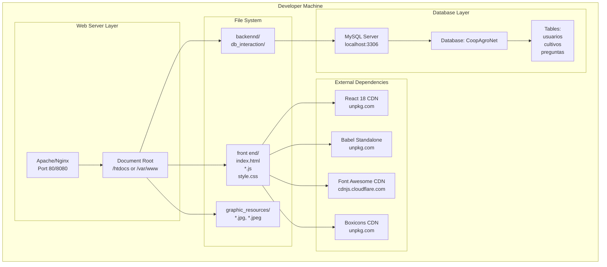
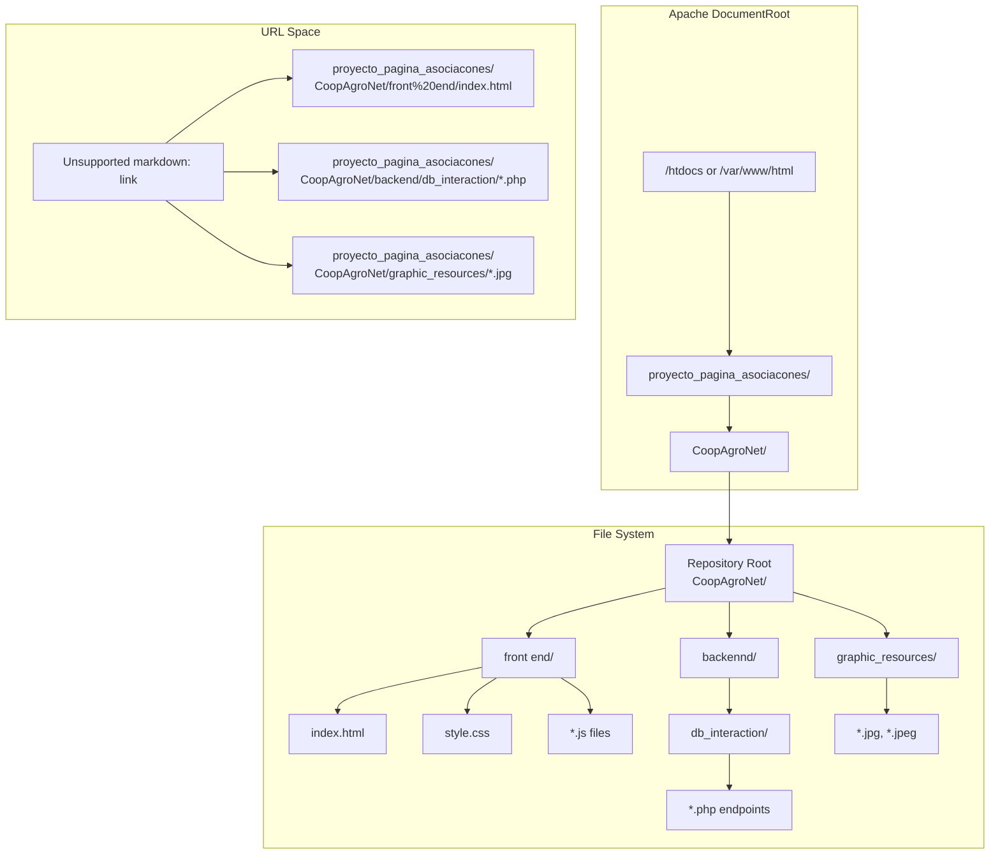
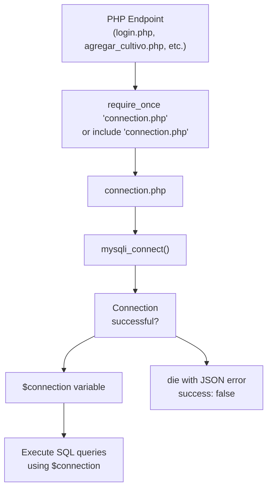
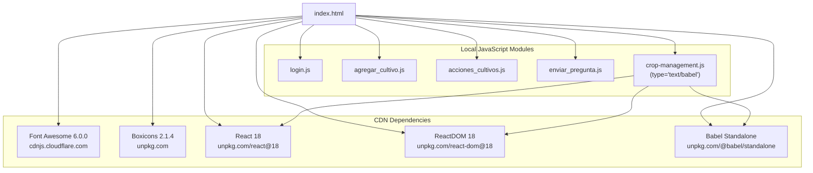
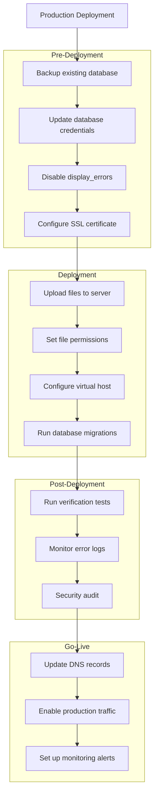

# Guía de desarrollo e implementación

> **Archivos fuente relevantes**
> * [backend/interacción_de_base_de_datos/conexión.php](https://github.com/axchisan/CoopAgronet/blob/e8818744/backennd/db_interaction/connection.php)
> * [backend/interacción_con_base_de_datos/crear_cuenta.php](https://github.com/axchisan/CoopAgronet/blob/e8818744/backennd/db_interaction/create_acount.php)
> * [frontend/index.html](https://github.com/axchisan/CoopAgronet/blob/e8818744/front end/index.html)

## Propósito y alcance

Este documento proporciona instrucciones para configurar un entorno de desarrollo local e implementar la aplicación CoopAgroNet. Abarca los prerrequisitos de software, la configuración de la base de datos, la configuración del servidor web y la organización de la estructura de archivos necesaria para ejecutar el sistema.

Para obtener información sobre la arquitectura general del sistema, consulte [Arquitectura del sistema](/axchisan/CoopAgronet/1.1-system-architecture) . Para obtener más información sobre los esquemas y las relaciones de las tablas de la base de datos, consulte [Esquema de la base de datos](/axchisan/CoopAgronet/1.3-database-schema) . Para conocer las consideraciones de seguridad antes de la implementación en producción, consulte [Consideraciones de seguridad](/axchisan/CoopAgronet/4-security-considerations) .

---

## Requisitos previos del software

El sistema CoopAgroNet requiere los siguientes componentes de software para funcionar:

| Componente | Versión/Detalles | Objetivo |
| --- | --- | --- |
| **PHP** | 7.4 o superior | Lenguaje de scripting de backend para puntos finales de API |
| **MySQL** | 5.7 o superior | Sistema de gestión de bases de datos relacionales |
| **Servidor web** | Apache 2.4+ o Nginx | Servidor HTTP para servir archivos estáticos y enrutar solicitudes PHP |
| **Extensión mysqli** | Habilitado en PHP | Capa de conectividad de base de datos utilizada en[connection.php L10](https://github.com/axchisan/CoopAgronet/blob/e8818744/backennd/db_interaction/connection.php#L10-L10) |
| **mod_rewrite** | Habilitado (Apache) | Enrutamiento de URL para rutas de puntos finales limpios |
| **Navegador** | Chrome 90+, Firefox 88+, Safari 14+ | Compatibilidad con JavaScript del lado del cliente y React 18 |

### Requisitos de configuración de PHP

Se deben habilitadas las siguientes extensiones y configuraciones de PHP:

* `mysqli`extensión para la conectividad de bases de datos
* `json`extensión para respuestas de API
* `session`Soporte para la gestión del estado de autenticación
* Informe de errores habilitado durante el desarrollo ([connection.php L2-L3](https://github.com/axchisan/CoopAgronet/blob/e8818744/backennd/db_interaction/connection.php#L2-L3) )

Fuentes:[connection.php L1-L15](https://github.com/axchisan/CoopAgronet/blob/e8818744/backennd/db_interaction/connection.php#L1-L15)

 [create_acount.php L1-L6](https://github.com/axchisan/CoopAgronet/blob/e8818744/backennd/db_interaction/create_acount.php#L1-L6)

---

## Configuración del entorno de desarrollo local

### Arquitectura del entorno de desarrollo



**Topología del entorno de desarrollo** : este diagrama muestra la configuración de desarrollo local donde el servidor web sirve archivos desde la raíz del documento, los scripts PHP del backend se conectan a una instancia MySQL local en el puerto 3306 y el frontend carga dependencias externas de los proveedores de CDN.

Fuentes:[connection.php L5-L8](https://github.com/axchisan/CoopAgronet/blob/e8818744/backennd/db_interaction/connection.php#L5-L8)

 [index.html L8-L11](https://github.com/axchisan/CoopAgronet/blob/e8818744/front end/index.html#L8-L11)

 [index.html L297-L300](https://github.com/axchisan/CoopAgronet/blob/e8818744/front end/index.html#L297-L300)

---

## Pasos de instalación

### Paso 1: Instalar el servidor web y PHP

#### Para Apache en Ubuntu/Debian:

```sql
sudo apt update
sudo apt install apache2 php libapache2-mod-php php-mysqli
sudo a2enmod rewrite
sudo systemctl restart apache2
```

#### Para Apache en Windows (XAMPP):

1. Descargue XAMPP desde apachefriends.org
2. Instalar en`C:\xampp`
3. Inicie Apache y MySQL desde el Panel de control de XAMPP

#### Para Nginx con PHP-FPM:

```
sudo apt install nginx php-fpm php-mysqli
sudo systemctl start nginx php-fpm
```

### Paso 2: Instalar MySQL

#### Ubuntu/Debian:

```
sudo apt install mysql-server
sudo systemctl start mysql
sudo mysql_secure_installation
```

#### Windows (a través de XAMPP):

MySQL se incluye con la instalación de XAMPP

### Step 3: Create Database and Tables

Connect to MySQL as root ([backennd/db_interaction/connection.php L6](https://github.com/axchisan/CoopAgronet/blob/e8818744/backennd/db_interaction/connection.php#L6-L6)

 uses root user by default):

```
mysql -u root -p
```

Execute the following SQL to create the database structure:

```sql
CREATE DATABASE CoopAgroNet;
USE CoopAgroNet;

-- Create usuarios table
CREATE TABLE usuarios (
    id INT AUTO_INCREMENT PRIMARY KEY,
    nombre_completo VARCHAR(255) NOT NULL,
    correo VARCHAR(255) UNIQUE NOT NULL,
    contrasena VARCHAR(255) NOT NULL
);

-- Create cultivos table
CREATE TABLE cultivos (
    id INT AUTO_INCREMENT PRIMARY KEY,
    tipo VARCHAR(100) NOT NULL,
    fecha_siembra DATE,
    cantidad INT,
    dueno VARCHAR(255),
    edad INT,
    ubicacion VARCHAR(255),
    notas TEXT
);

-- Create preguntas table
CREATE TABLE preguntas (
    id INT AUTO_INCREMENT PRIMARY KEY,
    usuario_id INT NOT NULL,
    pregunta TEXT NOT NULL,
    created_at TIMESTAMP DEFAULT CURRENT_TIMESTAMP,
    FOREIGN KEY (usuario_id) REFERENCES usuarios(id)
);
```

**Database Initialization Process**:

```sql
"CoopAgroNet Database""MySQL Serverlocalhost:3306""MySQL CLImysql -u root""Administrator""CoopAgroNet Database""MySQL Serverlocalhost:3306""MySQL CLImysql -u root""Administrator"#mermaid-6i5ngtq60rj{font-family:ui-sans-serif,-apple-system,system-ui,Segoe UI,Helvetica;font-size:16px;fill:#333;}@keyframes edge-animation-frame{from{stroke-dashoffset:0;}}@keyframes dash{to{stroke-dashoffset:0;}}#mermaid-6i5ngtq60rj .edge-animation-slow{stroke-dasharray:9,5!important;stroke-dashoffset:900;animation:dash 50s linear infinite;stroke-linecap:round;}#mermaid-6i5ngtq60rj .edge-animation-fast{stroke-dasharray:9,5!important;stroke-dashoffset:900;animation:dash 20s linear infinite;stroke-linecap:round;}#mermaid-6i5ngtq60rj .error-icon{fill:#dddddd;}#mermaid-6i5ngtq60rj .error-text{fill:#222222;stroke:#222222;}#mermaid-6i5ngtq60rj .edge-thickness-normal{stroke-width:1px;}#mermaid-6i5ngtq60rj .edge-thickness-thick{stroke-width:3.5px;}#mermaid-6i5ngtq60rj .edge-pattern-solid{stroke-dasharray:0;}#mermaid-6i5ngtq60rj .edge-thickness-invisible{stroke-width:0;fill:none;}#mermaid-6i5ngtq60rj .edge-pattern-dashed{stroke-dasharray:3;}#mermaid-6i5ngtq60rj .edge-pattern-dotted{stroke-dasharray:2;}#mermaid-6i5ngtq60rj .marker{fill:#999;stroke:#999;}#mermaid-6i5ngtq60rj .marker.cross{stroke:#999;}#mermaid-6i5ngtq60rj svg{font-family:ui-sans-serif,-apple-system,system-ui,Segoe UI,Helvetica;font-size:16px;}#mermaid-6i5ngtq60rj p{margin:0;}#mermaid-6i5ngtq60rj .actor{stroke:#cccccc;fill:#ffffff;}#mermaid-6i5ngtq60rj text.actor>tspan{fill:#333;stroke:none;}#mermaid-6i5ngtq60rj .actor-line{stroke:#cccccc;}#mermaid-6i5ngtq60rj .messageLine0{stroke-width:1.5;stroke-dasharray:none;stroke:#999999;}#mermaid-6i5ngtq60rj .messageLine1{stroke-width:1.5;stroke-dasharray:2,2;stroke:#999999;}#mermaid-6i5ngtq60rj #arrowhead path{fill:#999999;stroke:#999999;}#mermaid-6i5ngtq60rj .sequenceNumber{fill:#666666;}#mermaid-6i5ngtq60rj #sequencenumber{fill:#999999;}#mermaid-6i5ngtq60rj #crosshead path{fill:#999999;stroke:#999999;}#mermaid-6i5ngtq60rj .messageText{fill:#333333;stroke:none;}#mermaid-6i5ngtq60rj .labelBox{stroke:#dddddd;fill:#ffffff;}#mermaid-6i5ngtq60rj .labelText,#mermaid-6i5ngtq60rj .labelText>tspan{fill:#333;stroke:none;}#mermaid-6i5ngtq60rj .loopText,#mermaid-6i5ngtq60rj .loopText>tspan{fill:#333;stroke:none;}#mermaid-6i5ngtq60rj .loopLine{stroke-width:2px;stroke-dasharray:2,2;stroke:#dddddd;fill:#dddddd;}#mermaid-6i5ngtq60rj .note{stroke:#e6d280;fill:#fff5ad;}#mermaid-6i5ngtq60rj .noteText,#mermaid-6i5ngtq60rj .noteText>tspan{fill:#333;stroke:none;}#mermaid-6i5ngtq60rj .activation0{fill:hsl(-120, 0%, 91.7647058824%);stroke:hsl(-120, 0%, 81.7647058824%);}#mermaid-6i5ngtq60rj .activation1{fill:hsl(-120, 0%, 91.7647058824%);stroke:hsl(-120, 0%, 81.7647058824%);}#mermaid-6i5ngtq60rj .activation2{fill:hsl(-120, 0%, 91.7647058824%);stroke:hsl(-120, 0%, 81.7647058824%);}#mermaid-6i5ngtq60rj .actorPopupMenu{position:absolute;}#mermaid-6i5ngtq60rj .actorPopupMenuPanel{position:absolute;fill:#ffffff;box-shadow:0px 8px 16px 0px rgba(0,0,0,0.2);filter:drop-shadow(3px 5px 2px rgb(0 0 0 / 0.4));}#mermaid-6i5ngtq60rj .actor-man line{stroke:#cccccc;fill:#ffffff;}#mermaid-6i5ngtq60rj .actor-man circle,#mermaid-6i5ngtq60rj line{stroke:#cccccc;fill:#ffffff;stroke-width:2px;}#mermaid-6i5ngtq60rj :root{--mermaid-font-family:"trebuchet ms",verdana,arial,sans-serif;}Connect to MySQLAuthenticateConnection establishedCREATE DATABASE CoopAgroNetExecute DDLInitialize databaseUSE CoopAgroNetSwitch contextCREATE TABLE usuariosExecute DDLCreate table with columns:id, nombre_completo, correo, contrasenaCREATE TABLE cultivosExecute DDLCreate table with columns:id, tipo, fecha_siembra, cantidad,dueno, edad, ubicacion, notasCREATE TABLE preguntasExecute DDLCreate table with columns:id, usuario_id, pregunta, created_atFOREIGN KEY to usuarios(id)GRANT ALL PRIVILEGESSet permissionsSetup complete
```

Sources: [backennd/db_interaction/connection.php L8](https://github.com/axchisan/CoopAgronet/blob/e8818744/backennd/db_interaction/connection.php#L8-L8)

 [backennd/db_interaction/create_acount.php L55](https://github.com/axchisan/CoopAgronet/blob/e8818744/backennd/db_interaction/create_acount.php#L55-L55)

---

## File Structure and Deployment Mapping

### Directory Structure

The repository follows this file organization:

```sql
CoopAgroNet/
├── front end/
│   ├── index.html                    # Main SPA shell
│   ├── style.css                     # Global styles
│   ├── login.js                      # Authentication logic
│   ├── agregar_cultivo.js            # Crop creation/listing
│   ├── acciones_cultivos.js          # Crop edit/delete
│   ├── crop-management.js            # React component
│   └── enviar_pregunta.js            # Support form
├── backennd/
│   └── db_interaction/
│       ├── connection.php            # Database connection factory
│       ├── login.php                 # Login endpoint
│       ├── create_acount.php         # Registration endpoint
│       ├── agregar_cultivo.php       # Create crop endpoint
│       ├── obtener_cultivos.php      # Read all crops endpoint
│       ├── obtener_cultivo.php       # Read single crop endpoint
│       ├── editar_cultivo.php        # Update crop endpoint
│       ├── eliminar_cultivo.php      # Delete crop endpoint
│       └── enviar_pregunta.php       # Submit question endpoint
└── graphic_resources/
    ├── collage5.jpg
    ├── images.jpeg
    └── maxresdefault.jpg
```

### Web Server Document Root Configuration

**Deployment File Mapping**:



**Important Path Notes**:

1. The registration form action attribute uses absolute path: `/proyecto_pagina_asociacones/CoopAgroNet/backend/db_interaction/create_acount.php` ([front L215](https://github.com/axchisan/CoopAgronet/blob/e8818744/front end/index.html#L215-L215) )
2. Community post images reference: `/proyecto_pagina_asociacones/CoopAgroNet/graphic_resources/` ([front L113](https://github.com/axchisan/CoopAgronet/blob/e8818744/front end/index.html#L113-L113)  [front L119](https://github.com/axchisan/CoopAgronet/blob/e8818744/front end/index.html#L119-L119)  [front L125](https://github.com/axchisan/CoopAgronet/blob/e8818744/front end/index.html#L125-L125) )
3. The repository must be placed at `{DocumentRoot}/proyecto_pagina_asociacones/CoopAgroNet/` for absolute paths to resolve correctly

Sources: [front L113-L125](https://github.com/axchisan/CoopAgronet/blob/e8818744/front end/index.html#L113-L125)

 [front L215](https://github.com/axchisan/CoopAgronet/blob/e8818744/front end/index.html#L215-L215)

---

## Database Connection Configuration

### Connection Parameters

The database connection is configured in [backennd/db_interaction/connection.php L5-L10](https://github.com/axchisan/CoopAgronet/blob/e8818744/backennd/db_interaction/connection.php#L5-L10)

:

```
$host = "localhost:3306";
$user = "root";
$password = "";
$database = "CoopAgroNet";

$connection = mysqli_connect($host, $user, $password, $database);
```

### Connection Flow



**Connection Error Handling**: If the connection fails, [backennd/db_interaction/connection.php L12-L14](https://github.com/axchisan/CoopAgronet/blob/e8818744/backennd/db_interaction/connection.php#L12-L14)

 outputs a JSON response with `success: false` and terminates execution using `die()`.

### Environment-Specific Configuration

For different environments, modify [backennd/db_interaction/connection.php L5-L8](https://github.com/axchisan/CoopAgronet/blob/e8818744/backennd/db_interaction/connection.php#L5-L8)

:

| Environment | Host | User | Password | Database |
| --- | --- | --- | --- | --- |
| **Development** | `localhost:3306` | `root` | `` (empty) | `CoopAgroNet` |
| **Production** | Production DB host | Dedicated user | Strong password | `CoopAgroNet` |
| **Testing** | `localhost:3306` | Test user | Test password | `CoopAgroNet_test` |

**Security Warning**: The default configuration uses the `root` user with no password ([backennd/db_interaction/connection.php L6-L7](https://github.com/axchisan/CoopAgronet/blob/e8818744/backennd/db_interaction/connection.php#L6-L7)

), which is insecure for production. See [Security Considerations](/axchisan/CoopAgronet/4-security-considerations) for hardening recommendations.

Sources: [backennd/db_interaction/connection.php L1-L15](https://github.com/axchisan/CoopAgronet/blob/e8818744/backennd/db_interaction/connection.php#L1-L15)

 [backennd/db_interaction/create_acount.php L2](https://github.com/axchisan/CoopAgronet/blob/e8818744/backennd/db_interaction/create_acount.php#L2-L2)

---

## Web Server Configuration

### Apache Configuration

#### Virtual Host Setup

Create a virtual host configuration file `/etc/apache2/sites-available/coopagronet.conf`:

```xml
<VirtualHost *:80>
    ServerName localhost
    DocumentRoot /var/www/html
    
    <Directory /var/www/html/proyecto_pagina_asociacones/CoopAgroNet>
        Options Indexes FollowSymLinks
        AllowOverride All
        Require all granted
    </Directory>
    
    ErrorLog ${APACHE_LOG_DIR}/coopagronet_error.log
    CustomLog ${APACHE_LOG_DIR}/coopagronet_access.log combined
</VirtualHost>
```

Enable the site and restart Apache:

```
sudo a2ensite coopagronet.conf
sudo systemctl restart apache2
```

#### PHP Configuration

Ensure these PHP settings in `php.ini`:

```
display_errors = On              ; For development only
error_reporting = E_ALL          ; Match connection.php:2
mysqli.default_socket = /var/run/mysqld/mysqld.sock
post_max_size = 20M
upload_max_filesize = 20M
session.save_path = "/var/lib/php/sessions"
```

### Nginx Configuration

For Nginx with PHP-FPM, create `/etc/nginx/sites-available/coopagronet`:

```
server {
    listen 80;
    server_name localhost;
    root /var/www/html;
    index index.html;
    
    location ~ \.php$ {
        include snippets/fastcgi-php.conf;
        fastcgi_pass unix:/var/run/php/php7.4-fpm.sock;
        fastcgi_param SCRIPT_FILENAME $document_root$fastcgi_script_name;
    }
    
    location / {
        try_files $uri $uri/ =404;
    }
}
```

Sources: [backennd/db_interaction/connection.php L2-L3](https://github.com/axchisan/CoopAgronet/blob/e8818744/backennd/db_interaction/connection.php#L2-L3)

---

## Frontend Deployment Configuration

### CDN Dependencies

The frontend relies on external CDN resources loaded in [front L8-L11](https://github.com/axchisan/CoopAgronet/blob/e8818744/front end/index.html#L8-L11)

 and [front L297-L300](https://github.com/axchisan/CoopAgronet/blob/e8818744/front end/index.html#L297-L300)

:



**Script Loading Order**: The loading sequence in [front L292-L300](https://github.com/axchisan/CoopAgronet/blob/e8818744/front end/index.html#L292-L300)

 is critical:

1. Local JavaScript modules load first (`login.js`, `agregar_cultivo.js`, etc.)
2. React and ReactDOM load from CDN
3. Babel Standalone loads to transpile JSX
4. `crop-management.js` loads last with `type="text/babel"` attribute

### Offline Deployment Considerations

For deployments without internet access:

1. Download CDN dependencies locally: * Font Awesome from [front L8-L10](https://github.com/axchisan/CoopAgronet/blob/e8818744/front end/index.html#L8-L10) * Boxicons from [front L11](https://github.com/axchisan/CoopAgronet/blob/e8818744/front end/index.html#L11-L11) * React 18 from [front L297](https://github.com/axchisan/CoopAgronet/blob/e8818744/front end/index.html#L297-L297) * ReactDOM 18 from [front L298](https://github.com/axchisan/CoopAgronet/blob/e8818744/front end/index.html#L298-L298) * Babel Standalone from [front L299](https://github.com/axchisan/CoopAgronet/blob/e8818744/front end/index.html#L299-L299)
2. Update `<link>` and `<script>` tags to reference local copies
3. Serve these files from the web server document root

Sources: [front L8-L11](https://github.com/axchisan/CoopAgronet/blob/e8818744/front end/index.html#L8-L11)

 [front L292-L300](https://github.com/axchisan/CoopAgronet/blob/e8818744/front end/index.html#L292-L300)

---

## Testing the Installation

### Verification Checklist

After completing the installation, verify functionality with these tests:

| Test | URL/Action | Expected Result |
| --- | --- | --- |
| **Frontend Loads** | `http://localhost/proyecto_pagina_asociacones/CoopAgroNet/front%20end/index.html` | Homepage displays with navigation menu |
| **Database Connection** | Access any backend endpoint | No "Error al conectar con la base de datos" message |
| **User Registration** | Fill and submit register-form | JSON response with `success: true` |
| **User Login** | Fill and submit login-form | User profile displays, login form hides |
| **Crop Creation** | Fill and submit cropForm | New crop appears in crop table |
| **Crop Reading** | Page load | Crop table populates with existing records |
| **Crop Editing** | Click edit button on crop row | Form populates, button text changes to "Actualizar" |
| **Crop Deletion** | Click delete button, confirm | Crop removed from table, page reloads |
| **Support Question** | Fill and submit support-form | Success message displays for 5 seconds |

### Database Connection Test

Create a test file `test_connection.php` in the backend directory:

```php
<?php
require_once 'connection.php';

if ($connection) {
    echo "Database connection successful\n";
    echo "Host: " . $host . "\n";
    echo "Database: " . $database . "\n";
    
    $result = $connection->query("SHOW TABLES");
    echo "Tables:\n";
    while ($row = $result->fetch_array()) {
        echo "- " . $row[0] . "\n";
    }
} else {
    echo "Connection failed\n";
}
?>
```

Access via: `http://localhost/proyecto_pagina_asociacones/CoopAgroNet/backennd/db_interaction/test_connection.php`

Expected output:

```yaml
Database connection successful
Host: localhost:3306
Database: CoopAgroNet
Tables:
- cultivos
- preguntas
- usuarios
```

### Error Log Monitoring

Monitor PHP and Apache error logs during testing:

```markdown
# Apache error log
tail -f /var/log/apache2/error.log

# PHP-FPM error log (if using Nginx)
tail -f /var/log/php7.4-fpm.log
```

Common errors and solutions:

| Error | Cause | Solution |
| --- | --- | --- |
| "mysqli_connect(): (HY000/2002)" | MySQL not running | `sudo systemctl start mysql` |
| "Access denied for user 'root'" | Incorrect password | Update [backennd/db_interaction/connection.php L7](https://github.com/axchisan/CoopAgronet/blob/e8818744/backennd/db_interaction/connection.php#L7-L7) |
| "Unknown database 'CoopAgroNet'" | Database not created | Run database creation SQL |
| "404 Not Found" for PHP files | Incorrect path or DocumentRoot | Verify file placement and virtual host config |
| React not loading | CDN blocked | Check internet connection or use local copies |

Sources: [backennd/db_interaction/connection.php L12-L14](https://github.com/axchisan/CoopAgronet/blob/e8818744/backennd/db_interaction/connection.php#L12-L14)

---

## Production Deployment Considerations

### Security Hardening Required

Before deploying to production, address these critical security issues:

1. **Database Credentials**: Replace root user and empty password in [backennd/db_interaction/connection.php L6-L7](https://github.com/axchisan/CoopAgronet/blob/e8818744/backennd/db_interaction/connection.php#L6-L7)
2. **SQL Injection**: Use prepared statements in crop management endpoints (see [Security Considerations](/axchisan/CoopAgronet/4-security-considerations))
3. **Error Reporting**: Disable display_errors in production ([backennd/db_interaction/connection.php L2-L3](https://github.com/axchisan/CoopAgronet/blob/e8818744/backennd/db_interaction/connection.php#L2-L3) )
4. **HTTPS**: Enable SSL/TLS for encrypted communication
5. **Authorization**: Implement ownership checks for edit/delete operations

### Environment Configuration Pattern

Implement environment-specific configuration files:

```markdown
backennd/
├── db_interaction/
│   ├── connection.php           # Main connection loader
│   ├── config.dev.php          # Development configuration
│   ├── config.prod.php         # Production configuration
│   └── config.test.php         # Testing configuration
```

Modify [backennd/db_interaction/connection.php](https://github.com/axchisan/CoopAgronet/blob/e8818744/backennd/db_interaction/connection.php)

 to load environment-specific config:

```
$environment = getenv('APP_ENV') ?: 'dev';
require_once "config.{$environment}.php";

$connection = mysqli_connect($host, $user, $password, $database);
```

### Session Configuration

For production, configure session handling in PHP:

```
session.cookie_secure = On       ; Require HTTPS
session.cookie_httponly = On     ; Prevent JavaScript access
session.use_strict_mode = On     ; Reject uninitialized session IDs
session.cookie_samesite = "Lax"  ; CSRF protection
```

This prevents session hijacking in the authentication system that uses `$_SESSION["user"]` ([backennd/db_interaction/login.php](https://github.com/axchisan/CoopAgronet/blob/e8818744/backennd/db_interaction/login.php)

).

### File Permissions

Set appropriate permissions on the server:

```markdown
# PHP files (read-only for web server)
find backennd/ -type f -name "*.php" -exec chmod 644 {} \;

# Directories (executable for traversal)
find backennd/ -type d -exec chmod 755 {} \;

# Restrict connection.php (contains credentials)
chmod 600 backennd/db_interaction/connection.php
```

### Deployment Checklist



Sources: [backennd/db_interaction/connection.php L2-L3](https://github.com/axchisan/CoopAgronet/blob/e8818744/backennd/db_interaction/connection.php#L2-L3)

 [backennd/db_interaction/connection.php L6-L7](https://github.com/axchisan/CoopAgronet/blob/e8818744/backennd/db_interaction/connection.php#L6-L7)

---

## Troubleshooting Common Issues

### Database Connection Failures

**Symptom**: JSON error response "Error al conectar con la base de datos"

**Diagnostic Steps**:

1. Verify MySQL is running: `systemctl status mysql`
2. Test connection from command line: `mysql -u root -p -h localhost`
3. Check [backennd/db_interaction/connection.php L5-L8](https://github.com/axchisan/CoopAgronet/blob/e8818744/backennd/db_interaction/connection.php#L5-L8)  matches MySQL configuration
4. Review MySQL error log: `/var/log/mysql/error.log`

### PHP Parse Errors

**Symptom**: Blank page or HTTP 500 error

**Diagnostic Steps**:

1. Check Apache error log: `tail -f /var/log/apache2/error.log`
2. Verify PHP syntax: `php -l backennd/db_interaction/connection.php`
3. Ensure short tags are disabled (code uses `<?php` not `<?`)
4. Check [backennd/db_interaction/connection.php L2-L3](https://github.com/axchisan/CoopAgronet/blob/e8818744/backennd/db_interaction/connection.php#L2-L3)  for error reporting settings

### Path Resolution Issues

**Symptom**: 404 errors for backend endpoints or images

**Diagnostic Steps**:

1. Verify repository is placed at `{DocumentRoot}/proyecto_pagina_asociacones/CoopAgroNet/`
2. Check absolute paths in [front L215](https://github.com/axchisan/CoopAgronet/blob/e8818744/front end/index.html#L215-L215)  and [front L113-L125](https://github.com/axchisan/CoopAgronet/blob/e8818744/front end/index.html#L113-L125)
3. Confirm Apache DocumentRoot setting in virtual host configuration
4. Pruebe con rutas relativas si las rutas absolutas son problemáticas

### Errores de CORS

**Síntoma** : La consola del navegador muestra errores "Access-Control-Allow-Origin"

**Solución** : agregue encabezados CORS a los puntos finales de PHP:

```sql
header("Access-Control-Allow-Origin: *");
header("Access-Control-Allow-Methods: GET, POST, DELETE");
header("Access-Control-Allow-Headers: Content-Type");
```

O configure Apache para agregar encabezados:

```xml
<Directory /var/www/html/proyecto_pagina_asociacones/CoopAgroNet/backennd>
    Header set Access-Control-Allow-Origin "*"
</Directory>
```

### La sesión no persiste

**Síntoma** : El usuario cerró la sesión después de recargar la página

**Pasos de diagnóstico** :

1. Compruebe que el directorio de la sesión PHP existe y se puede escribir:`/var/lib/php/sessions`
2. Se llama a verificar `session_start()`en el punto final de inicio de sesión
3. Compruebe que las cookies del navegador estén habilitadas
4. Revisar la configuración de la sesión en`php.ini`

### El componente de React no se renderiza

**Síntoma** : El componente React de gestión de cultivos no aparece

**Pasos de diagnóstico** :

1. Abra la consola del navegador y verifique si hay errores de JavaScript
2. Verifique que Babel Standalone se haya cargado correctamente ([index.html L299](https://github.com/axchisan/CoopAgronet/blob/e8818744/front end/index.html#L299-L299) )
3. Confirmar `crop-management.js`tiene `type="text/babel"`atributo ([index.html L300](https://github.com/axchisan/CoopAgronet/blob/e8818744/front end/index.html#L300-L300) )
4. Compruebe React y ReactDOM cargados desde CDN ([index.html L297-L298](https://github.com/axchisan/CoopAgronet/blob/e8818744/front end/index.html#L297-L298) )
5. Prueba con el modo sin conexión deshabilitado para garantizar el acceso a la CDN

Fuentes:[connection.php L2-L3](https://github.com/axchisan/CoopAgronet/blob/e8818744/backennd/db_interaction/connection.php#L2-L3)

 [connection.php L12-L14](https://github.com/axchisan/CoopAgronet/blob/e8818744/backennd/db_interaction/connection.php#L12-L14)

 [index.html L215](https://github.com/axchisan/CoopAgronet/blob/e8818744/front end/index.html#L215-L215)

 [index.html L297-L300](https://github.com/axchisan/CoopAgronet/blob/e8818744/front end/index.html#L297-L300)