# Login Endpoint

> **Relevant source files**
> * [backennd/db_interaction/connection.php](https://github.com/axchisan/CoopAgronet/blob/e8818744/backennd/db_interaction/connection.php)
> * [backennd/db_interaction/login.php](https://github.com/axchisan/CoopAgronet/blob/e8818744/backennd/db_interaction/login.php)

## Purpose and Scope

This document details the `login.php` endpoint, which handles user authentication by verifying credentials against the `usuarios` table and establishing PHP session state. This endpoint processes POST requests containing email and password, performs secure password verification, and returns JSON responses indicating authentication success or failure.

For user registration functionality, see [Registration Endpoint](/axchisan/CoopAgronet/2.2.2-registration-endpoint). For the broader authentication system architecture, see [User Authentication System](/axchisan/CoopAgronet/2.2-user-authentication-system).

**Sources:** [backennd/db_interaction/login.php L1-L44](https://github.com/axchisan/CoopAgronet/blob/e8818744/backennd/db_interaction/login.php#L1-L44)

---

## Endpoint Specification

| Property | Value |
| --- | --- |
| **File Path** | `backennd/db_interaction/login.php` |
| **HTTP Method** | POST |
| **Content-Type** | `application/json` (response) |
| **Session Required** | No (establishes session on success) |
| **Authentication** | None (this endpoint creates authentication) |

### Request Parameters

All parameters are sent as POST form data (`$_POST`):

| Parameter | Type | Required | Description |
| --- | --- | --- | --- |
| `correo` | string | Yes | User's email address (used as username) |
| `contrasena` | string | Yes | User's plaintext password (verified against hashed value) |

### Response Format

All responses are JSON objects with a `success` boolean field:

**Success Response:**

```

```

**Error Responses:**

```

```

```

```

```

```

**Sources:** [backennd/db_interaction/login.php L7](https://github.com/axchisan/CoopAgronet/blob/e8818744/backennd/db_interaction/login.php#L7-L7)

 [backennd/db_interaction/login.php L16](https://github.com/axchisan/CoopAgronet/blob/e8818744/backennd/db_interaction/login.php#L16-L16)

 [backennd/db_interaction/login.php L30](https://github.com/axchisan/CoopAgronet/blob/e8818744/backennd/db_interaction/login.php#L30-L30)

 [backennd/db_interaction/login.php L32-L35](https://github.com/axchisan/CoopAgronet/blob/e8818744/backennd/db_interaction/login.php#L32-L35)

---

## Authentication Flow Diagram

```

```

**Sources:** [backennd/db_interaction/login.php L1-L44](https://github.com/axchisan/CoopAgronet/blob/e8818744/backennd/db_interaction/login.php#L1-L44)

---

## Implementation Details

### Session Initialization

The endpoint begins by initializing PHP session state at [backennd/db_interaction/login.php L2](https://github.com/axchisan/CoopAgronet/blob/e8818744/backennd/db_interaction/login.php#L2-L2)

:

```

```

This must occur before any output is sent to the client. On successful authentication, the session stores the user's full name in `$_SESSION["user"]` at [backennd/db_interaction/login.php L29](https://github.com/axchisan/CoopAgronet/blob/e8818744/backennd/db_interaction/login.php#L29-L29)

 which subsequent requests can check to verify authenticated state.

**Sources:** [backennd/db_interaction/login.php L2](https://github.com/axchisan/CoopAgronet/blob/e8818744/backennd/db_interaction/login.php#L2-L2)

 [backennd/db_interaction/login.php L29](https://github.com/axchisan/CoopAgronet/blob/e8818744/backennd/db_interaction/login.php#L29-L29)

### Database Connection

The endpoint includes the shared connection module at [backennd/db_interaction/login.php L3](https://github.com/axchisan/CoopAgronet/blob/e8818744/backennd/db_interaction/login.php#L3-L3)

:

```

```

This provides access to the `$connection` mysqli object configured to connect to the `CoopAgroNet` database. For details on the connection configuration, see [Database Connection Layer](/axchisan/CoopAgronet/2.1-database-connection-layer).

**Sources:** [backennd/db_interaction/login.php L3](https://github.com/axchisan/CoopAgronet/blob/e8818744/backennd/db_interaction/login.php#L3-L3)

 [backennd/db_interaction/connection.php L1-L14](https://github.com/axchisan/CoopAgronet/blob/e8818744/backennd/db_interaction/connection.php#L1-L14)

### Input Validation

The endpoint validates that both required fields are present and non-empty at [backennd/db_interaction/login.php L11-L18](https://github.com/axchisan/CoopAgronet/blob/e8818744/backennd/db_interaction/login.php#L11-L18)

:

```

```

The null coalescing operator (`??`) provides default empty strings if the POST parameters are missing, and `empty()` checks for null, empty string, or false values.

**Sources:** [backennd/db_interaction/login.php L11-L18](https://github.com/axchisan/CoopAgronet/blob/e8818744/backennd/db_interaction/login.php#L11-L18)

### Database Query with Prepared Statement

The endpoint uses a prepared statement to query the `usuarios` table at [backennd/db_interaction/login.php L21-L24](https://github.com/axchisan/CoopAgronet/blob/e8818744/backennd/db_interaction/login.php#L21-L24)

:

```

```

This pattern prevents SQL injection by parameterizing the email address. The `"s"` type specifier indicates a string parameter. The query retrieves both the user's full name (`nombre_completo`) and their hashed password (`contrasena`) for verification.

**Sources:** [backennd/db_interaction/login.php L21-L24](https://github.com/axchisan/CoopAgronet/blob/e8818744/backennd/db_interaction/login.php#L21-L24)

### User Verification Logic

The endpoint checks if exactly one user was found at [backennd/db_interaction/login.php L26-L36](https://github.com/axchisan/CoopAgronet/blob/e8818744/backennd/db_interaction/login.php#L26-L36)

:

#### Diagram: User Verification Decision Tree

```mermaid
flowchart TD

Query["$result->get_result()"]
CheckRows["$result->num_rows == 1?"]
NoUser["Return error:<br>'Usuario no encontrado'"]
FetchRow["$row = $result->fetch_assoc()"]
VerifyPwd["password_verify(contrasena,<br>row['contrasena'])?"]
PwdFail["Return error:<br>'Contraseña incorrecta'"]
Success["Set $_SESSION['user']<br>Return success with user name"]

Query --> CheckRows
CheckRows --> NoUser
CheckRows --> FetchRow
FetchRow --> VerifyPwd
VerifyPwd --> PwdFail
VerifyPwd --> Success
```



If `num_rows` is not exactly 1, the email doesn't exist in the database. If it equals 1, the row is fetched and password verification proceeds.

**Sources:** [backennd/db_interaction/login.php L26-L36](https://github.com/axchisan/CoopAgronet/blob/e8818744/backennd/db_interaction/login.php#L26-L36)

### Password Verification

The endpoint uses PHP's `password_verify()` function at [backennd/db_interaction/login.php L28](https://github.com/axchisan/CoopAgronet/blob/e8818744/backennd/db_interaction/login.php#L28-L28)

:

```

```

This function securely compares the plaintext password from the request against the hashed password stored in the database. The hash was created during registration using `password_hash()` with `PASSWORD_DEFAULT` algorithm (see [Registration Endpoint](/axchisan/CoopAgronet/2.2.2-registration-endpoint)).

The function:

* Returns `true` if the password matches the hash
* Returns `false` if it doesn't match
* Handles timing-safe comparison to prevent timing attacks
* Works with bcrypt and argon2 hashes automatically

**Sources:** [backennd/db_interaction/login.php L28](https://github.com/axchisan/CoopAgronet/blob/e8818744/backennd/db_interaction/login.php#L28-L28)

### Session Storage

On successful authentication, the endpoint stores the user's name in the PHP session at [backennd/db_interaction/login.php L29](https://github.com/axchisan/CoopAgronet/blob/e8818744/backennd/db_interaction/login.php#L29-L29)

:

```

```

This session variable persists across requests and is used by other endpoints to verify that a user is logged in. The session is stored server-side with only a session cookie sent to the client.

**Sources:** [backennd/db_interaction/login.php L29](https://github.com/axchisan/CoopAgronet/blob/e8818744/backennd/db_interaction/login.php#L29-L29)

### Resource Cleanup

The endpoint properly closes the prepared statement and database connection at [backennd/db_interaction/login.php L38-L43](https://github.com/axchisan/CoopAgronet/blob/e8818744/backennd/db_interaction/login.php#L38-L43)

:

```

```

This releases database resources regardless of whether authentication succeeded or failed.

**Sources:** [backennd/db_interaction/login.php L38-L43](https://github.com/axchisan/CoopAgronet/blob/e8818744/backennd/db_interaction/login.php#L38-L43)

---

## Code Entity Map

This diagram maps the natural language authentication concepts to specific code entities in `login.php`:


**Sources:** [backennd/db_interaction/login.php L1-L44](https://github.com/axchisan/CoopAgronet/blob/e8818744/backennd/db_interaction/login.php#L1-L44)

---

## Response Scenarios

### Success Scenario

When credentials are valid:

1. `num_rows == 1` (user exists)
2. `password_verify()` returns `true`
3. `$_SESSION["user"]` is set to the user's `nombre_completo`
4. Response: `{"success": true, "user": "Nombre Completo"}`

The client receives the user's name for display purposes and can make subsequent requests that rely on the authenticated session.

**Sources:** [backennd/db_interaction/login.php L26-L30](https://github.com/axchisan/CoopAgronet/blob/e8818744/backennd/db_interaction/login.php#L26-L30)

### Error Scenarios

| Scenario | Condition | Response Error Field | HTTP Status |
| --- | --- | --- | --- |
| Missing fields | `empty($correo)` or `empty($contrasena)` | `"Faltan datos"` | 200 |
| User not found | `$result->num_rows != 1` | `"Usuario no encontrado"` | 200 |
| Wrong password | `password_verify()` returns `false` | `"Contraseña incorrecta"` | 200 |
| Database error | `$connection->prepare()` fails | `"Error en la consulta"` | 200 |

Note that all responses return HTTP 200, with error indication in the JSON `success` field. This is a common pattern in JSON APIs but differs from RESTful best practices where HTTP status codes should reflect the operation outcome.

**Sources:** [backennd/db_interaction/login.php L16](https://github.com/axchisan/CoopAgronet/blob/e8818744/backennd/db_interaction/login.php#L16-L16)

 [backennd/db_interaction/login.php L32](https://github.com/axchisan/CoopAgronet/blob/e8818744/backennd/db_interaction/login.php#L32-L32)

 [backennd/db_interaction/login.php L35](https://github.com/axchisan/CoopAgronet/blob/e8818744/backennd/db_interaction/login.php#L35-L35)

 [backennd/db_interaction/login.php L40](https://github.com/axchisan/CoopAgronet/blob/e8818744/backennd/db_interaction/login.php#L40-L40)

---

## Security Analysis

### Secure Practices

1. **Prepared Statements**: The query at [backennd/db_interaction/login.php L21](https://github.com/axchisan/CoopAgronet/blob/e8818744/backennd/db_interaction/login.php#L21-L21)  uses parameterized queries to prevent SQL injection
2. **Password Hashing**: Uses `password_verify()` at [backennd/db_interaction/login.php L28](https://github.com/axchisan/CoopAgronet/blob/e8818744/backennd/db_interaction/login.php#L28-L28)  to securely compare hashed passwords
3. **No Password Exposure**: Passwords are never logged or returned in responses
4. **Input Validation**: Checks for empty fields before processing at [backennd/db_interaction/login.php L15](https://github.com/axchisan/CoopAgronet/blob/e8818744/backennd/db_interaction/login.php#L15-L15)

### Security Concerns

1. **No Rate Limiting**: The endpoint can be hammered with brute-force attempts with no throttling
2. **Generic Error Messages**: While secure (doesn't leak whether email exists), the "Usuario no encontrado" vs "Contraseña incorrecta" distinction allows email enumeration
3. **Session Without HTTPS**: No enforcement of secure cookie flags or HTTPS-only transmission
4. **No CSRF Protection**: POST endpoint lacks CSRF token validation
5. **Database Credentials**: The included `connection.php` uses root credentials with no password (see [Database Connection Layer](/axchisan/CoopAgronet/2.1-database-connection-layer))

**Sources:** [backennd/db_interaction/login.php L21-L41](https://github.com/axchisan/CoopAgronet/blob/e8818744/backennd/db_interaction/login.php#L21-L41)

---

## Integration Points

### Frontend Integration

The client-side `login.js` module calls this endpoint with FormData:

```

```

For details on the client-side authentication handling, see [Authentication Frontend](/axchisan/CoopAgronet/3.2-authentication-frontend).

### Session-Based Endpoints

After successful login, other endpoints can check authentication status:

```

```

However, none of the crop management endpoints currently implement this check, allowing unauthenticated access (see [Security Considerations](/axchisan/CoopAgronet/4-security-considerations)).

**Sources:** [backennd/db_interaction/login.php L29](https://github.com/axchisan/CoopAgronet/blob/e8818744/backennd/db_interaction/login.php#L29-L29)

---

## Data Flow Diagram


**Sources:** [backennd/db_interaction/login.php L1-L44](https://github.com/axchisan/CoopAgronet/blob/e8818744/backennd/db_interaction/login.php#L1-L44)