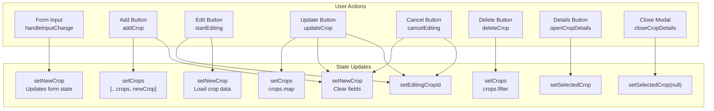
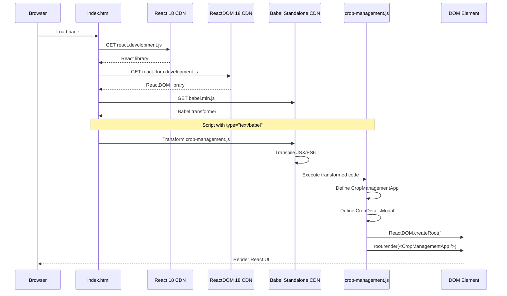
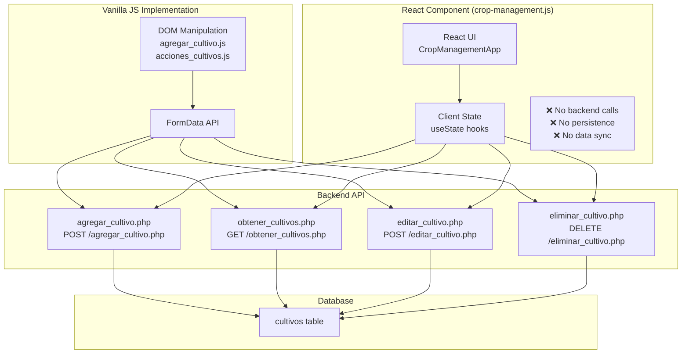

# React Crop Component

> **Relevant source files**
> * [front end/crop-management.js](https://github.com/axchisan/CoopAgronet/blob/e8818744/front end/crop-management.js)
> * [front end/index.html](https://github.com/axchisan/CoopAgronet/blob/e8818744/front end/index.html)

## Purpose and Scope

The React Crop Component (`crop-management.js`) provides an alternative React-based user interface for crop management functionality. This component operates entirely client-side with local state management, unlike the vanilla JavaScript implementations documented in pages [3.3.1](/axchisan/CoopAgronet/3.3.1-crop-creation-and-listing) and [3.3.2](/axchisan/CoopAgronet/3.3.2-crop-edit-and-delete-actions) which interact with backend PHP endpoints. The component demonstrates a modern React approach but is currently isolated from the application's backend API layer.

For information about the vanilla JavaScript crop management implementations that communicate with the backend, see [Crop Creation and Listing](/axchisan/CoopAgronet/3.3.1-crop-creation-and-listing) and [Crop Edit and Delete Actions](/axchisan/CoopAgronet/3.3.2-crop-edit-and-delete-actions).

**Sources:** [front L1-L165](https://github.com/axchisan/CoopAgronet/blob/e8818744/front end/crop-management.js#L1-L165)

 [front L297-L300](https://github.com/axchisan/CoopAgronet/blob/e8818744/front end/index.html#L297-L300)

## Component Architecture Overview

The React implementation consists of two functional components with clear separation of concerns:

**Component Hierarchy**

```

```

**Sources:** [front L1-L74](https://github.com/axchisan/CoopAgronet/blob/e8818744/front end/crop-management.js#L1-L74)

 [front L76-L93](https://github.com/axchisan/CoopAgronet/blob/e8818744/front end/crop-management.js#L76-L93)

 [front L164-L165](https://github.com/axchisan/CoopAgronet/blob/e8818744/front end/crop-management.js#L164-L165)

### CropManagementApp Component

The `CropManagementApp` function component serves as the primary container for crop management operations. Defined at [front L1-L74](https://github.com/axchisan/CoopAgronet/blob/e8818744/front end/crop-management.js#L1-L74)

 it manages all CRUD operations through local React state without backend persistence.

**State Structure:**

| State Variable | Type | Purpose |
| --- | --- | --- |
| `crops` | `Array<Crop>` | Collection of all crop records |
| `newCrop` | `Object` | Form data for create/edit operations |
| `editingCropId` | `number \| null` | ID of crop currently being edited |
| `selectedCrop` | `Crop \| null` | Crop data for details modal display |

The `newCrop` state object contains seven fields matching the database schema:

```

```

**Sources:** [front L2-L13](https://github.com/axchisan/CoopAgronet/blob/e8818744/front end/crop-management.js#L2-L13)

### CropDetailsModal Component

The `CropDetailsModal` function component renders a modal overlay displaying complete crop information. Defined at [front L76-L93](https://github.com/axchisan/CoopAgronet/blob/e8818744/front end/crop-management.js#L76-L93)

 it accepts two props:

| Prop | Type | Description |
| --- | --- | --- |
| `crop` | `Crop` | Crop object with all fields |
| `onClose` | `Function` | Callback to close modal |

The component uses `React.createElement` syntax rather than JSX, creating a modal with:

* Close button (`×` character) at [front L80](https://github.com/axchisan/CoopAgronet/blob/e8818744/front end/crop-management.js#L80-L80)
* Dynamic Unsplash image based on crop type at [front L82](https://github.com/axchisan/CoopAgronet/blob/e8818744/front end/crop-management.js#L82-L82)
* Seven data fields displayed as paragraphs at [front L83-L89](https://github.com/axchisan/CoopAgronet/blob/e8818744/front end/crop-management.js#L83-L89)

**Sources:** [front L76-L93](https://github.com/axchisan/CoopAgronet/blob/e8818744/front end/crop-management.js#L76-L93)

## CRUD Operations and State Flow

The component implements complete CRUD functionality through pure client-side state mutations:

**State Mutation Flow**



**Sources:** [front L15-L73](https://github.com/axchisan/CoopAgronet/blob/e8818744/front end/crop-management.js#L15-L73)

### Create Operation

The `addCrop` function at [front L20-L25](https://github.com/axchisan/CoopAgronet/blob/e8818744/front end/crop-management.js#L20-L25)

 performs client-side validation and appends a new crop to the state array:

1. Validates six required fields (all except `notes`) at line 21
2. Generates a unique ID using `Date.now()` at line 22
3. Appends to `crops` array using spread operator
4. Resets `newCrop` form state to empty values

**Note:** This differs from the backend implementation where IDs are auto-generated by MySQL's AUTO_INCREMENT. The `Date.now()` approach creates potential collision risks if two crops are added within the same millisecond.

**Sources:** [front L20-L25](https://github.com/axchisan/CoopAgronet/blob/e8818744/front end/crop-management.js#L20-L25)

### Read Operation

Unlike the vanilla JavaScript implementation which fetches from `obtener_cultivos.php`, the React component maintains crops entirely in memory. There is no equivalent to the backend's read endpoints. The `selectedCrop` state variable controls modal visibility for detail viewing.

The `openCropDetails` function at [front L66-L68](https://github.com/axchisan/CoopAgronet/blob/e8818744/front end/crop-management.js#L66-L68)

 and `closeCropDetails` at [front L70-L72](https://github.com/axchisan/CoopAgronet/blob/e8818744/front end/crop-management.js#L70-L72)

 manage modal display state.

**Sources:** [front L66-L72](https://github.com/axchisan/CoopAgronet/blob/e8818744/front end/crop-management.js#L66-L72)

### Update Operation

The edit workflow involves two phases:

**Phase 1: Editing Mode Activation** ([front L31-L42](https://github.com/axchisan/CoopAgronet/blob/e8818744/front end/crop-management.js#L31-L42)

)

```
startEditing(crop)
├─ setEditingCropId(crop.id)          // Track which crop is being edited
└─ setNewCrop({...crop fields})        // Populate form with existing data
```

**Phase 2: Update Execution** ([front L49-L64](https://github.com/axchisan/CoopAgronet/blob/e8818744/front end/crop-management.js#L49-L64)

)

```sql
updateCrop()
├─ setCrops(crops.map(...))            // Immutably update matching crop
│   └─ crop.id === editingCropId       // Conditional replacement
├─ setEditingCropId(null)              // Exit editing mode
└─ setNewCrop({empty})                 // Clear form
```

The `cancelEditing` function at [front L44-L47](https://github.com/axchisan/CoopAgronet/blob/e8818744/front end/crop-management.js#L44-L47)

 provides escape from editing mode without persisting changes.

**Sources:** [front L31-L64](https://github.com/axchisan/CoopAgronet/blob/e8818744/front end/crop-management.js#L31-L64)

### Delete Operation

The `deleteCrop` function at [front L27-L29](https://github.com/axchisan/CoopAgronet/blob/e8818744/front end/crop-management.js#L27-L29)

 performs immediate deletion using array filtering:

```

```

This differs from the vanilla JavaScript implementation which:

1. Shows a confirmation dialog
2. Sends DELETE request to `eliminar_cultivo.php`
3. Reloads the page on success

The React version has no confirmation dialog and operates entirely in memory.

**Sources:** [front L27-L29](https://github.com/axchisan/CoopAgronet/blob/e8818744/front end/crop-management.js#L27-L29)

## Application Integration

The React component integrates into the single-page application through a multi-step loading process:

**Library Loading and Component Rendering**



**Sources:** [front L297-L300](https://github.com/axchisan/CoopAgronet/blob/e8818744/front end/index.html#L297-L300)

 [front L164-L165](https://github.com/axchisan/CoopAgronet/blob/e8818744/front end/crop-management.js#L164-L165)

### CDN Dependencies

The application loads three external libraries from CDN before the React component can execute:

| Library | Version | Source | Purpose |
| --- | --- | --- | --- |
| React | 18 | unpkg.com | Core React library with hooks |
| ReactDOM | 18 | unpkg.com | DOM rendering layer |
| Babel Standalone | Latest | unpkg.com | Runtime JSX/ES6+ transpilation |

These are loaded at [front L297-L299](https://github.com/axchisan/CoopAgronet/blob/e8818744/front end/index.html#L297-L299)

 The `crossorigin` attribute enables CORS for error reporting.

**Sources:** [front L297-L299](https://github.com/axchisan/CoopAgronet/blob/e8818744/front end/index.html#L297-L299)

### Babel Transpilation

The `crop-management.js` file is loaded with `type="text/babel"` at [front L300](https://github.com/axchisan/CoopAgronet/blob/e8818744/front end/index.html#L300-L300)

 which triggers Babel's runtime transpilation. This process:

1. Intercepts script loading before execution
2. Transforms JSX syntax to `React.createElement()` calls
3. Converts ES6+ features to ES5-compatible JavaScript
4. Executes the transformed code

**Note:** The component already uses `React.createElement()` syntax rather than JSX (see [front L78-L91](https://github.com/axchisan/CoopAgronet/blob/e8818744/front end/crop-management.js#L78-L91)

), making Babel transpilation unnecessary for this file. This suggests the file was originally written in JSX or prepared for future JSX migration.

**Sources:** [front L300](https://github.com/axchisan/CoopAgronet/blob/e8818744/front end/index.html#L300-L300)

 [front L76-L93](https://github.com/axchisan/CoopAgronet/blob/e8818744/front end/crop-management.js#L76-L93)

### Render Target

The component renders into a DOM element with `id="crop-management-app"` as specified at [front L164](https://github.com/axchisan/CoopAgronet/blob/e8818744/front end/crop-management.js#L164-L164)

 However, this element **does not exist** in the provided `index.html` file, indicating either:

1. The element is dynamically created by another script
2. The React component is currently inactive/unused
3. The integration is incomplete

**Sources:** [front L164-L165](https://github.com/axchisan/CoopAgronet/blob/e8818744/front end/crop-management.js#L164-L165)

 [front L1-L331](https://github.com/axchisan/CoopAgronet/blob/e8818744/front end/index.html#L1-L331)

## Client-Side Operation Model

The React component operates in complete isolation from the backend API layer, creating a functional disconnect with the rest of the application:

**Architecture Comparison: React vs Vanilla JavaScript**



**Sources:** [front L1-L165](https://github.com/axchisan/CoopAgronet/blob/e8818744/front end/crop-management.js#L1-L165)

 [front end/agregar_cultivo.js](https://github.com/axchisan/CoopAgronet/blob/e8818744/front end/agregar_cultivo.js)

 [front end/acciones_cultivos.js](https://github.com/axchisan/CoopAgronet/blob/e8818744/front end/acciones_cultivos.js)

### Data Persistence Gap

The React component's crops exist only in browser memory and are lost on page refresh. Specific limitations:

| Operation | React Implementation | Vanilla JS Implementation |
| --- | --- | --- |
| **Create** | Appends to local array | POST to `agregar_cultivo.php` |
| **Read** | Uses local array | GET from `obtener_cultivos.php` |
| **Update** | Maps local array | POST to `editar_cultivo.php` |
| **Delete** | Filters local array | DELETE to `eliminar_cultivo.php` |
| **Persistence** | None (memory only) | MySQL database via PHP |
| **ID Generation** | `Date.now()` | AUTO_INCREMENT |

This architectural choice suggests the React component was created as:

* A proof-of-concept for React migration
* A UI prototype without backend integration
* An example component for demonstration purposes

**Sources:** [front L20-L64](https://github.com/axchisan/CoopAgronet/blob/e8818744/front end/crop-management.js#L20-L64)

### Field Name Mapping

The React component uses English field names while the backend expects Spanish:

| React Component | Backend Database | HTML Form |
| --- | --- | --- |
| `type` | `tipo` | `tipo` |
| `sowingDate` | `fecha_siembra` | `fecha_siembra` |
| `quantity` | `cantidad` | `cantidad` |
| `owner` | `dueno` | `dueno` |
| `age` | `edad` | `edad` |
| `location` | `ubicacion` | `ubicacion` |
| `notes` | `notas` | `notas` |

If backend integration were added, a field name translation layer would be required to convert between English React state and Spanish backend fields.

**Sources:** [front L3-L11](https://github.com/axchisan/CoopAgronet/blob/e8818744/front end/crop-management.js#L3-L11)

## Additional Script Content

The `crop-management.js` file contains non-React code that belongs to other system components, indicating improper file organization:

### Password Toggle Functionality

Lines [front L96-L112](https://github.com/axchisan/CoopAgronet/blob/e8818744/front end/crop-management.js#L96-L112)

 implement password visibility toggling for login/register forms. This code:

* Attaches click handlers to `.toggle-password` buttons
* Toggles between `password` and `text` input types
* Switches Font Awesome icons between `fa-eye` and `fa-eye-slash`

This functionality belongs in `login.js` or the inline script in `index.html`, not in the crop management component file.

### Registration Modal Activation

Lines [front L118-L125](https://github.com/axchisan/CoopAgronet/blob/e8818744/front end/crop-management.js#L118-L125)

 handle clicks on the `#activate-register` link to display the registration form. This relates to the support system's user verification message documented in page [2.4](/axchisan/CoopAgronet/2.4-support-question-system).

### Registration Form Handler

Lines [front L127-L159](https://github.com/axchisan/CoopAgronet/blob/e8818744/front end/crop-management.js#L127-L159)

 implement the registration form submission logic with:

* `FormData` construction
* Fetch to `/proyecto_pagina_asociacones/CoopAgroNet/backennd/db_interaction/create_acount.php`
* Success/error message display in `#message-box`
* Form reset on successful registration

This duplicates functionality that should be in `login.js` as documented in page [3.2](/axchisan/CoopAgronet/3.2-authentication-frontend).

**Architectural Issue:** This file mixing indicates poor module boundaries. The React component should be isolated in its own file, with authentication and password utilities in separate modules.

**Sources:** [front L96-L159](https://github.com/axchisan/CoopAgronet/blob/e8818744/front end/crop-management.js#L96-L159)

## Unsplash Image Integration

The `CropDetailsModal` component fetches crop images dynamically from Unsplash's Source API at [front L82](https://github.com/axchisan/CoopAgronet/blob/e8818744/front end/crop-management.js#L82-L82)

:

```

```

This constructs URLs like:

* `https://source.unsplash.com/400x200/?wheat` for wheat crops
* `https://source.unsplash.com/400x200/?corn` for corn crops

**Considerations:**

1. **Network Dependency:** Requires internet connectivity; fails in offline environments
2. **No Caching:** Each modal open triggers a new image fetch
3. **Relevance:** Search quality depends on crop type accuracy (Spanish vs English terms may affect results)
4. **No Fallback:** No placeholder image if Unsplash fails

**Sources:** [front L82](https://github.com/axchisan/CoopAgronet/blob/e8818744/front end/crop-management.js#L82-L82)

## Comparison with Vanilla JavaScript Implementation

The dual implementation represents two different architectural philosophies:

**React Approach:**

* Component-based architecture with functional components
* Declarative UI with React state driving rendering
* Immutable state updates using spread operators
* Client-side only with no persistence
* Modern ES6+ patterns (arrow functions, destructuring)

**Vanilla JS Approach (pages [3.3.1](/axchisan/CoopAgronet/3.3.1-crop-creation-and-listing) and [3.3.2](/axchisan/CoopAgronet/3.3.2-crop-edit-and-delete-actions)):**

* Imperative DOM manipulation with direct element access
* Procedural event handlers attached to form/button elements
* Backend integration with FormData and fetch API
* MySQL persistence through PHP endpoints
* Page reloads after mutations (`location.reload()`)

The React version demonstrates better code organization and state management patterns but lacks the critical backend integration that makes the vanilla implementation functional for production use.

**Sources:** [front L1-L165](https://github.com/axchisan/CoopAgronet/blob/e8818744/front end/crop-management.js#L1-L165)