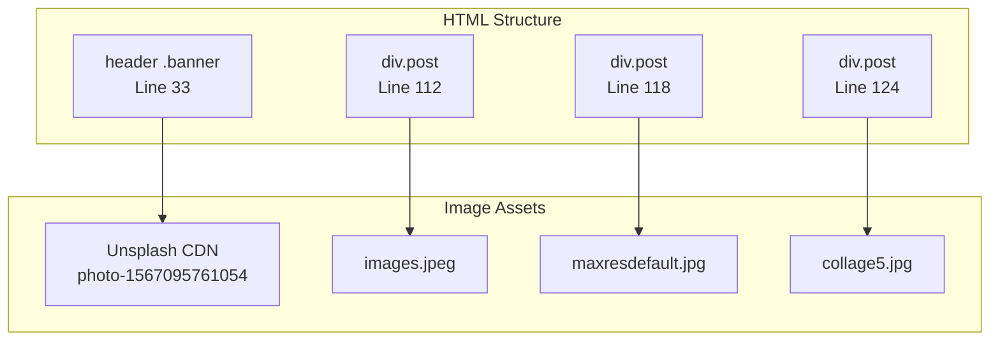
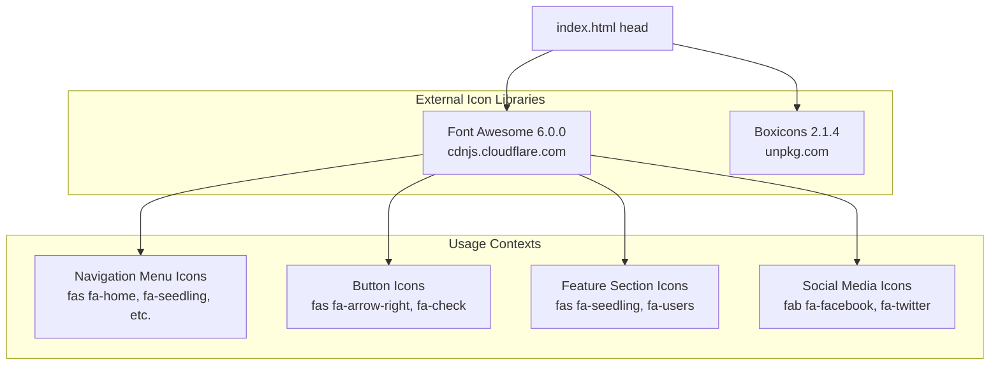
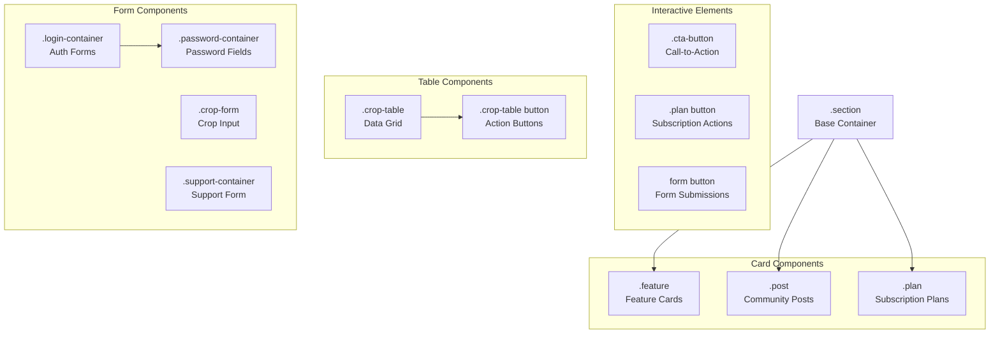
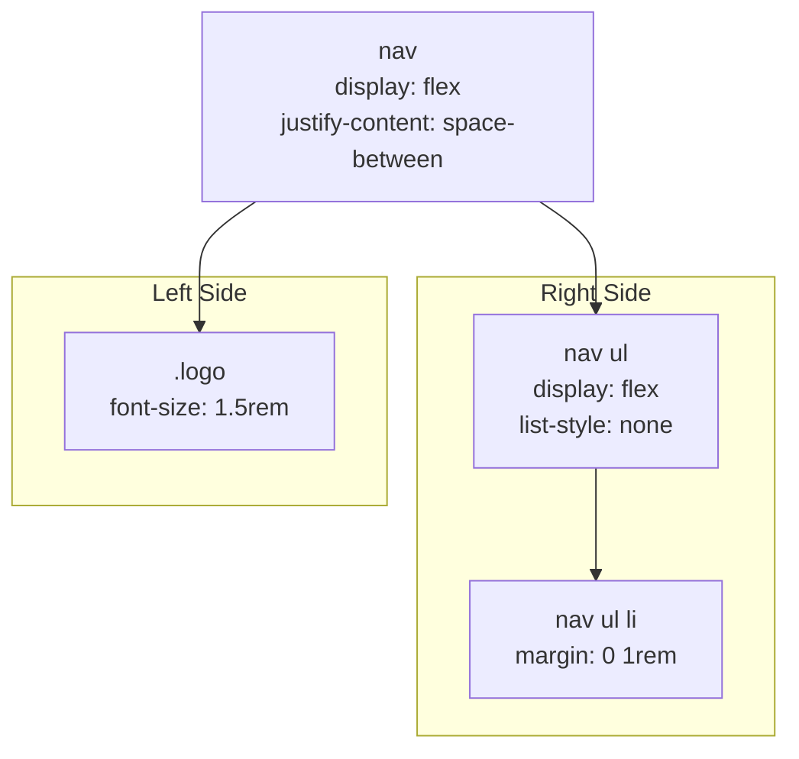
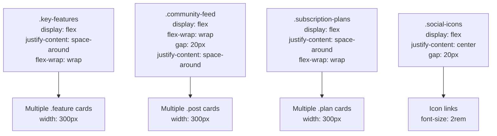
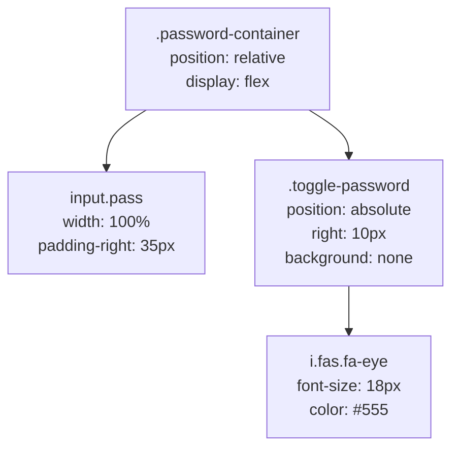

# Recursos visuales y estilo

> **Archivos fuente relevantes**
> * [frontend/index.html](https://github.com/axchisan/CoopAgronet/blob/e8818744/front end/index.html)
> * [frontend/style.css](https://github.com/axchisan/CoopAgronet/blob/e8818744/front end/style.css)
> * [recursos_gráficos/collage5.jpg](https://github.com/axchisan/CoopAgronet/blob/e8818744/graphic_resources/collage5.jpg)
> * [recursos_gráficos/imágenes.jpeg](https://github.com/axchisan/CoopAgronet/blob/e8818744/graphic_resources/images.jpeg)
> * [recursos_gráficos/maxresdefault.jpg](https://github.com/axchisan/CoopAgronet/blob/e8818744/graphic_resources/maxresdefault.jpg)

Este documento cataloga los recursos gráficos utilizados en la aplicación CoopAgroNet y explica el completo sistema de estilos CSS que define la capa de presentación visual. Abarca recursos de imagen, bibliotecas de iconos, organización de hojas de estilo, patrones de estilo de componentes y estrategias de diseño adaptable.

Para obtener información sobre la estructura HTML a la que se aplican estos estilos, consulte [Estructura de la interfaz de usuario](/axchisan/CoopAgronet/3.1-user-interface-structure) . Para el comportamiento de JavaScript en el frontend, consulte [Sistema frontend](/axchisan/CoopAgronet/3-frontend-system) .

---

## 1. Inventario de recursos gráficos

La aplicación utiliza tres archivos de imagen estáticos ubicados en el `graphic_resources`directorio, además de una imagen de banner externa. Estos recursos proporcionan contenido visual para la sección de noticias de la comunidad.

### 1.1 Registro de activos de imágenes

| Ruta del archivo | Ubicación de uso | Objetivo | Dimensiones |
| --- | --- | --- | --- |
| `graphic_resources/collage5.jpg` | Publicación n.° 3 de la sección de la comunidad | Taller visual de agricultura ecológica | Desconocido (JPEG) |
| `graphic_resources/images.jpeg` | Publicación n.° 1 de la sección de la comunidad | Ilustración del método de riego | Desconocido (JPEG) |
| `graphic_resources/maxresdefault.jpg` | Publicación n.° 2 de la sección de la comunidad | Foto de la época de la cosecha | Desconocido (JPEG) |
| Externo: CDN de Unsplash | Banner de encabezado | Fondo de campo agrícola | Responsivo (automático) |

**Fuentes:** [index.html L34-L36](https://github.com/axchisan/CoopAgronet/blob/e8818744/front end/index.html#L34-L36)

 [index.html L113-L129](https://github.com/axchisan/CoopAgronet/blob/e8818744/front end/index.html#L113-L129)

### 1.2 Referencias de imágenes en HTML



**Fuentes:** [index.html L34-L36](https://github.com/axchisan/CoopAgronet/blob/e8818744/front end/index.html#L34-L36)

 [index.html L113-L129](https://github.com/axchisan/CoopAgronet/blob/e8818744/front end/index.html#L113-L129)

---

## 2. Descripción general de la arquitectura CSS

El sistema de estilos se define en una única hoja de estilo monolítica `style.css`que contiene 678 líneas de reglas CSS. Esta hoja de estilo sigue un patrón de organización basado en componentes, donde los estilos se agrupan por áreas funcionales.

### 2.1 Estructura de la organización de la hoja de estilo

```

```

**Fuentes:** [style.css L1-L678](https://github.com/axchisan/CoopAgronet/blob/e8818744/front end/style.css#L1-L678)

### 2.2 Desglose de la estructura de archivos CSS

| Sección | Rango de línea | Objetivo |
| --- | --- | --- |
| Estilos globales | 1-7 | Cuerpo base, fuente, fondo, configuración de color |
| Encabezado y navegación | 9-61 | Barra de navegación principal y marca |
| Bandera | 62-104 | Sección de héroe con superposición de imagen de fondo |
| Contenido principal | 106-108 | Relleno del área de contenido |
| Secciones | 110-133 | Estilo de contenedor de sección genérica |
| Tarjetas de características | 134-159 | Cuadros de presentación de funciones de la página de inicio |
| Feed de la comunidad | 161-198 | Diseño de postales sociales |
| Planes de suscripción | 200-240 | Tarjetas con niveles de precios |
| Pie de página | 242-250 | Estilo de la barra de pie de página |
| Formularios de inicio de sesión | 256-354 | Componentes de la interfaz de usuario de autenticación |
| Alternar contraseña | 317-353 | Mostrar/ocultar el estilo del botón de contraseña |
| Cuadros de mensajes | 358-377 | Estilo de retroalimentación de éxito/error |
| Formas de cultivo | 389-431 | Diseño de formularios de gestión de cultivos |
| Tabla de cultivos | 434-476 | Data table for crop listings |
| Responsive Mobile | 481-572 | Media queries for mobile devices |
| Social Icons | 575-593 | Social media link styling |
| Support Form | 596-678 | Help/support form styling |

**Sources:** [front L1-L678](https://github.com/axchisan/CoopAgronet/blob/e8818744/front end/style.css#L1-L678)

---

## 3. Icon Library Integration

The application integrates two external icon libraries via CDN to provide visual glyphs throughout the interface.

### 3.1 Icon Library Configuration



**Sources:** [front L8-L11](https://github.com/axchisan/CoopAgronet/blob/e8818744/front end/index.html#L8-L11)

### 3.2 Icon Usage Mapping

| Icon Class | Library | Usage Location | Purpose |
| --- | --- | --- | --- |
| `fas fa-tractor` | Font Awesome | Logo (line 19) | Brand identity |
| `fas fa-home` | Font Awesome | Nav menu (line 23) | Home navigation |
| `fas fa-seedling` | Font Awesome | Nav menu (line 24) | Crop management link |
| `fas fa-users` | Font Awesome | Nav menu (line 25) | Community link |
| `fas fa-money-bill-wave` | Font Awesome | Nav menu (line 26) | Subscriptions link |
| `fas fa-sign-in-alt` | Font Awesome | Nav menu (line 27) | Login link |
| `fas fa-user-shield` | Font Awesome | Nav menu (line 28) | Admin link |
| `fas fa-share-alt` | Font Awesome | Nav menu (line 29) | Social media link |
| `fas fa-question-circle` | Font Awesome | Nav menu (line 30) | Support link |
| `fas fa-arrow-right` | Font Awesome | CTA button (line 40) | Call-to-action indicator |
| `fas fa-check` | Font Awesome | Subscription buttons (lines 146, 159) | Confirmation action |
| `fas fa-envelope` | Font Awesome | Contact button (line 172) | Email action |
| `fas fa-eye` | Font Awesome | Password toggle (lines 189, 226, 234) | Show password |
| `fas fa-paper-plane` | Font Awesome | Support form (line 279) | Send message |
| `fab fa-*` | Font Awesome | Social links (lines 262-266) | Social platform icons |

**Sources:** [front L19-L30](https://github.com/axchisan/CoopAgronet/blob/e8818744/front end/index.html#L19-L30)

 [front L40](https://github.com/axchisan/CoopAgronet/blob/e8818744/front end/index.html#L40-L40)

 [front L146-L172](https://github.com/axchisan/CoopAgronet/blob/e8818744/front end/index.html#L146-L172)

 [front L189-L279](https://github.com/axchisan/CoopAgronet/blob/e8818744/front end/index.html#L189-L279)

---

## 4. Color Scheme and Theme System

The application uses a nature-inspired color palette centered around agricultural green tones with high contrast dark/light backgrounds.

### 4.1 Primary Color Palette

```mermaid
flowchart TD

DarkBG["#333<br>Dark Background"]
LightBG["#f4f4f4<br>Light Background"]
White["#fff<br>White"]
TextDark["#333<br>Dark Text"]
PrimaryGreen["#5cb85c<br>Primary Green"]
SecondaryGreen["#449d44<br>Hover Green"]
GradientStart["#4CAF50<br>Gradient Start"]
GradientEnd["#8BC34A<br>Gradient End"]
Success["#d4edda<br>Success Background"]
SuccessText["#155724<br>Success Text"]
Error["#f8d7da<br>Error Background"]
ErrorText["#721c24<br>Error Text"]
Header["Header"]
Body["Body"]
Buttons["Buttons"]
ButtonHover["Button Hover"]
Borders["Gradient Borders"]
SuccessMsg["Success Messages"]
ErrorMsg["Error Messages"]

Header --> DarkBG
Body --> LightBG
Buttons --> PrimaryGreen
ButtonHover --> SecondaryGreen
Borders --> GradientStart
Borders --> GradientEnd
SuccessMsg --> Success
SuccessMsg --> SuccessText
ErrorMsg --> Error
ErrorMsg --> ErrorText

subgraph subGraph3 ["Usage Contexts"]
    Header
    Body
    Buttons
    ButtonHover
    Borders
    SuccessMsg
    ErrorMsg
end

subgraph subGraph2 ["Feedback Colors"]
    Success
    SuccessText
    Error
    ErrorText
end

subgraph subGraph1 ["Brand Colors"]
    PrimaryGreen
    SecondaryGreen
    GradientStart
    GradientEnd
end

subgraph subGraph0 ["Base Colors"]
    DarkBG
    LightBG
    White
    TextDark
end
```



**Sources:** [front L1-L7](https://github.com/axchisan/CoopAgronet/blob/e8818744/front end/style.css#L1-L7)

 [front L10](https://github.com/axchisan/CoopAgronet/blob/e8818744/front end/style.css#L10-L10)

 [front L86-L104](https://github.com/axchisan/CoopAgronet/blob/e8818744/front end/style.css#L86-L104)

 [front L222-L240](https://github.com/axchisan/CoopAgronet/blob/e8818744/front end/style.css#L222-L240)

 [front L367-L377](https://github.com/axchisan/CoopAgronet/blob/e8818744/front end/style.css#L367-L377)

### 4.2 Color Usage Table

| Color Value | CSS Variables/Usage | Applied To | Purpose |
| --- | --- | --- | --- |
| `#333` | Body text, header background | `body color`, `header background` | High contrast dark tone |
| `#f4f4f4` | Page background | `body background-color` | Neutral light background |
| `#fff` | Section backgrounds, text on dark | `.section background`, `nav a color` | Clean white surfaces |
| `#5cb85c` | Primary button color | `.cta-button`, `.plan button`, form buttons | Primary action color |
| `#449d44` | Hover state | `:hover` states | Interactive feedback |
| `#4CAF50` / `#8BC34A` | Gradient borders | `border-image: linear-gradient` | Accent gradients |
| `#d4edda` | Success message background | `.success-message` | Positive feedback |
| `#f8d7da` | Error message background | `.error-message` | Negative feedback |

**Sources:** [front L1-L7](https://github.com/axchisan/CoopAgronet/blob/e8818744/front end/style.css#L1-L7)

 [front L86-L104](https://github.com/axchisan/CoopAgronet/blob/e8818744/front end/style.css#L86-L104)

 [front L222-L240](https://github.com/axchisan/CoopAgronet/blob/e8818744/front end/style.css#L222-L240)

 [front L367-L377](https://github.com/axchisan/CoopAgronet/blob/e8818744/front end/style.css#L367-L377)

---

## 5. Component Styling System

The stylesheet defines cohesive visual patterns for reusable UI components. Each component has consistent spacing, borders, shadows, and hover effects.

### 5.1 Component Class Hierarchy



**Sources:** [front L110-L240](https://github.com/axchisan/CoopAgronet/blob/e8818744/front end/style.css#L110-L240)

 [front L256-L354](https://github.com/axchisan/CoopAgronet/blob/e8818744/front end/style.css#L256-L354)

 [front L389-L476](https://github.com/axchisan/CoopAgronet/blob/e8818744/front end/style.css#L389-L476)

### 5.2 Card Component Styling Pattern

All card-like components (`.feature`, `.post`, `.plan`) share a common visual pattern:

```css
/* Common Pattern */
{
  text-align: center;
  margin: 1rem;
  padding: 1rem;
  border: 1px solid #ddd;
  border-radius: 8px;
  width: 300px;
  transition: transform 0.3s ease, box-shadow 0.3s ease;
}

/* Hover Effect */
:hover {
  transform: translateY(-5px);
  box-shadow: 0 4px 8px rgba(0, 0, 0, 0.2);
}
```

**Sources:** [front L140-L153](https://github.com/axchisan/CoopAgronet/blob/e8818744/front end/style.css#L140-L153)

 [front L168-L179](https://github.com/axchisan/CoopAgronet/blob/e8818744/front end/style.css#L168-L179)

 [front L206-L219](https://github.com/axchisan/CoopAgronet/blob/e8818744/front end/style.css#L206-L219)

### 5.3 Form Styling Conventions

```

```

**Sources:** [front L256-L301](https://github.com/axchisan/CoopAgronet/blob/e8818744/front end/style.css#L256-L301)

 [front L389-L431](https://github.com/axchisan/CoopAgronet/blob/e8818744/front end/style.css#L389-L431)

 [front L596-L651](https://github.com/axchisan/CoopAgronet/blob/e8818744/front end/style.css#L596-L651)

---

## 6. Layout and Positioning Strategies

The stylesheet uses a combination of flexbox for navigation and content distribution, with absolute positioning for overlay elements.

### 6.1 Header and Navigation Layout



**Sources:** [front L19-L61](https://github.com/axchisan/CoopAgronet/blob/e8818744/front end/style.css#L19-L61)

### 6.2 Banner Overlay Positioning

The banner uses absolute positioning to overlay content on top of the background image:

```css
.banner {
  position: relative;  /* Establishes positioning context */
}

.banner img {
  width: 100%;
  max-height: 500px;
  object-fit: cover;  /* Crops image to fill space */
}

.banner-content {
  position: absolute;  /* Positioned relative to .banner */
  top: 50%;
  left: 50%;
  transform: translate(-50%, -50%);  /* Centers both axes */
  background-color: rgba(0, 0, 0, 0.5);  /* Semi-transparent overlay */
}
```

**Sources:** [front L62-L83](https://github.com/axchisan/CoopAgronet/blob/e8818744/front end/style.css#L62-L83)

### 6.3 Flexbox Content Distribution



**Sources:** [front L134-L159](https://github.com/axchisan/CoopAgronet/blob/e8818744/front end/style.css#L134-L159)

 [front L161-L198](https://github.com/axchisan/CoopAgronet/blob/e8818744/front end/style.css#L161-L198)

 [front L200-L240](https://github.com/axchisan/CoopAgronet/blob/e8818744/front end/style.css#L200-L240)

 [front L576-L593](https://github.com/axchisan/CoopAgronet/blob/e8818744/front end/style.css#L576-L593)

---

## 7. Responsive Design Strategy

The stylesheet implements mobile-first responsive design using media queries targeting screens below 768px width.

### 7.1 Responsive Breakpoints and Transformations

```

```

**Sources:** [front L481-L572](https://github.com/axchisan/CoopAgronet/blob/e8818744/front end/style.css#L481-L572)

### 7.2 Mobile-Specific CSS Rules

| Element | Desktop Behavior | Mobile Transformation | Lines |
| --- | --- | --- | --- |
| `nav` | Horizontal flex | `flex-direction: column` | 483-486 |
| `nav ul` | Horizontal flex | `flex-direction: column`, `margin-top: 1rem` | 488-491 |
| `nav ul li` | Inline items | `margin: 0.5rem 0` | 493-495 |
| `.feature` | 300px width | `width: 100%` | 502-504 |
| `.plan` | 300px width | `width: 100%` | 511-513 |
| `.crop-form` | Full padding | `padding: 15px`, reduced font | 518-528 |
| `.crop-table thead` | Visible headers | `display: none` | 538-540 |
| `.crop-table tr` | Table row | Block element with border | 549-556 |
| `.crop-table td` | Table cell | Elemento de bloque con `data-label`atributo | 557-571 |

**Fuentes:** [style.css L481-L572](https://github.com/axchisan/CoopAgronet/blob/e8818744/front end/style.css#L481-L572)

### 7.3 Patrón de respuesta de tabla

La tabla de recorte implementa una sofisticada transformación móvil donde los encabezados desaparecen y cada celda muestra su etiqueta usando el `data-label`atributo:

```python
@media (max-width: 768px) {
  .crop-table thead {
    display: none;  /* Hide header row */
  }
  
  .crop-table tr {
    display: block;  /* Each row becomes a card */
    margin-bottom: 15px;
    border: 1px solid #ddd;
    border-radius: 5px;
  }
  
  .crop-table td::before {
    content: attr(data-label);  /* Display label from attribute */
    font-weight: bold;
    display: block;
  }
}
```

**Fuentes:** [style.css L531-L572](https://github.com/axchisan/CoopAgronet/blob/e8818744/front end/style.css#L531-L572)

---

## 8. Estados interactivos y transiciones

La hoja de estilo define efectos de desplazamiento y transiciones consistentes en todos los elementos interactivos para brindar retroalimentación visual.

### 8.1 Propiedades de transición

```

```

**Fuentes:** [style.css L34-L43](https://github.com/axchisan/CoopAgronet/blob/e8818744/front end/style.css#L34-L43)

 [style.css L93-L104](https://github.com/axchisan/CoopAgronet/blob/e8818744/front end/style.css#L93-L104)

 [style.css L147-L153](https://github.com/axchisan/CoopAgronet/blob/e8818744/front end/style.css#L147-L153)

 [style.css L229-L240](https://github.com/axchisan/CoopAgronet/blob/e8818744/front end/style.css#L229-L240)

### 8.2 Patrones de efectos de desplazamiento

| Tipo de componente | Efecto de transformación | Cambio de color | Cambio de sombra |
| --- | --- | --- | --- |
| Elementos de navegación | `scale(1.1)` | `#4CAF50` | Ninguno |
| Botón CTA | `scale(1.05)` | `#449d44` | Ninguno |
| Tarjetas con características | `translateY(-5px)` | Ninguno | `0 4px 8px rgba(0,0,0,0.2)` |
| Postales | `translateY(-5px)` | Ninguno | `0 4px 8px rgba(0,0,0,0.2)` |
| Tarjetas de plan | `translateY(-5px)` | Ninguno | `0 4px 8px rgba(0,0,0,0.2)` |
| Botones de plan | `scale(1.05)` | `#449d44` | Ninguno |
| Botones de formulario | `scale(1.05)` | `#449d44` | Ninguno |
| Botones de tabla | Ninguno | `#0056b3` | Ninguno |
| Iconos sociales | `scale(1.2)` | `#449d44` | Ninguno |

**Fuentes:** [style.css L38-L43](https://github.com/axchisan/CoopAgronet/blob/e8818744/front end/style.css#L38-L43)

 [style.css L100-L104](https://github.com/axchisan/CoopAgronet/blob/e8818744/front end/style.css#L100-L104)

 [style.css L150-L153](https://github.com/axchisan/CoopAgronet/blob/e8818744/front end/style.css#L150-L153)

 [style.css L177-L179](https://github.com/axchisan/CoopAgronet/blob/e8818744/front end/style.css#L177-L179)

 [style.css L216-L219](https://github.com/axchisan/CoopAgronet/blob/e8818744/front end/style.css#L216-L219)

 [style.css L236-L240](https://github.com/axchisan/CoopAgronet/blob/e8818744/front end/style.css#L236-L240)

 [style.css L297-L301](https://github.com/axchisan/CoopAgronet/blob/e8818744/front end/style.css#L297-L301)

 [style.css L428-L431](https://github.com/axchisan/CoopAgronet/blob/e8818744/front end/style.css#L428-L431)

 [style.css L473-L476](https://github.com/axchisan/CoopAgronet/blob/e8818744/front end/style.css#L473-L476)

 [style.css L590-L593](https://github.com/axchisan/CoopAgronet/blob/e8818744/front end/style.css#L590-L593)

---

## 9. Características especiales y estilo personalizado

### 9.1 Activar o desactivar la visibilidad de la contraseña

Los campos de ingreso de contraseña incluyen botones de alternancia de estilo personalizado que utilizan posicionamiento absoluto dentro de un contenedor relativo:



**Fuentes:** [style.css L317-L353](https://github.com/axchisan/CoopAgronet/blob/e8818744/front end/style.css#L317-L353)

### 9.2 Estilo del cuadro de mensaje

Los mensajes de éxito y error utilizan colores de fondo distintos con codificación de color semántica:

```css
.success-message {
  color: #155724;
  background-color: #d4edda;
  border: 1px solid #c3e6cb;
}

.error-message {
  color: #721c24;
  background-color: #f8d7da;
  border: 1px solid #f5c6cb;
}

.success {
  color: green;
  font-weight: bold;
}

.error {
  color: red;
  font-weight: bold;
}
```

**Fuentes:** [style.css L367-L377](https://github.com/axchisan/CoopAgronet/blob/e8818744/front end/style.css#L367-L377)

 [style.css L664-L673](https://github.com/axchisan/CoopAgronet/blob/e8818744/front end/style.css#L664-L673)

### 9.3 Bordes degradados

El encabezado y el pie de página utilizan imágenes con bordes degradados para lograr un acento visual:

```css
header {
  border-bottom: 5px solid;
  border-image: linear-gradient(to right, #4CAF50, #8BC34A) 1;
}

footer {
  border-top: 5px solid;
  border-image: linear-gradient(to left, #4CAF50, #8BC34A) 1;
}

.section h2::before {
  content: '';
  position: absolute;
  top: 0;
  left: 0;
  width: 100%;
  height: 5px;
  background: linear-gradient(to right, #4CAF50, #8BC34A);
  border-radius: 5px;
}
```

**Fuentes:** [style.css L14-L17](https://github.com/axchisan/CoopAgronet/blob/e8818744/front end/style.css#L14-L17)

 [style.css L122-L132](https://github.com/axchisan/CoopAgronet/blob/e8818744/front end/style.css#L122-L132)

 [style.css L247-L250](https://github.com/axchisan/CoopAgronet/blob/e8818744/front end/style.css#L247-L250)

---

## 10. Mapeo de componentes CSS a HTML

Este diagrama muestra cómo las clases CSS se convierten `style.css`en elementos HTML en `index.html`:

```mermaid
flowchart TD

HeaderEl["header<br>Line 15"]
NavEl["nav<br>Line 16"]
BannerEl["div.banner<br>Line 33"]
SectionInicio["section#inicio.section<br>Line 46"]
KeyFeaturesDiv["div.key-features<br>Line 52"]
FeatureDiv["div.feature (x3)<br>Lines 53, 58, 63"]
SectionCultivos["section#gestion-cultivos.section<br>Line 71"]
CropFormDiv["div.crop-form<br>Line 73"]
CropFormEl["form#cropForm<br>Line 74"]
CropTableEl["table.crop-table<br>Line 89"]
SectionComunidad["section#comunidad.section<br>Line 109"]
CommunityFeedDiv["div.community-feed<br>Line 111"]
PostDiv["div.post (x3)<br>Lines 112, 118, 124"]
SectionSubs["section#suscripciones.section<br>Line 134"]
SubPlansDiv["div.subscription-plans<br>Line 136"]
PlanDiv["div.plan (x3)<br>Lines 137, 148, 161"]
SectionLogin["section#login.section<br>Line 177"]
LoginContainerDiv["div.login-container<br>Line 179"]
LoginFormEl["form#login-form<br>Line 182"]
RegisterFormEl["form#register-form<br>Line 214"]
SectionSoporte["section#soporte.section<br>Line 270"]
SupportContainerDiv["div.support-container<br>Line 272"]
SupportFormEl["form#support-form<br>Line 275"]
FooterEl["footer<br>Line 288"]
BodyStyle["body<br>Lines 1-7"]
HeaderStyle["header<br>Lines 9-17"]
NavStyle["nav<br>Lines 19-61"]
BannerStyle[".banner<br>Lines 62-83"]
SectionStyle[".section<br>Lines 110-133"]
KeyFeaturesStyle[".key-features<br>Lines 134-138"]
FeatureStyle[".feature<br>Lines 140-159"]
CropFormStyle[".crop-form<br>Lines 389-431"]
CropTableStyle[".crop-table<br>Lines 434-476"]
CommunityFeedStyle[".community-feed<br>Lines 161-166"]
PostStyle[".post<br>Lines 168-198"]
SubPlansStyle[".subscription-plans<br>Lines 200-204"]
PlanStyle[".plan<br>Lines 206-240"]
LoginContainerStyle[".login-container<br>Lines 256-315"]
SupportContainerStyle[".support-container<br>Lines 596-678"]
FooterStyle["footer<br>Lines 242-250"]

HeaderEl --> HeaderStyle
NavEl --> NavStyle
BannerEl --> BannerStyle
SectionInicio --> SectionStyle
SectionCultivos --> SectionStyle
SectionComunidad --> SectionStyle
SectionSubs --> SectionStyle
SectionLogin --> SectionStyle
SectionSoporte --> SectionStyle
KeyFeaturesDiv --> KeyFeaturesStyle
FeatureDiv --> FeatureStyle
CropFormDiv --> CropFormStyle
CropFormEl --> CropFormStyle
CropTableEl --> CropTableStyle
CommunityFeedDiv --> CommunityFeedStyle
PostDiv --> PostStyle
SubPlansDiv --> SubPlansStyle
PlanDiv --> PlanStyle
LoginContainerDiv --> LoginContainerStyle
LoginFormEl --> LoginContainerStyle
RegisterFormEl --> LoginContainerStyle
SupportContainerDiv --> SupportContainerStyle
SupportFormEl --> SupportContainerStyle
FooterEl --> FooterStyle

subgraph subGraph1 ["CSS Classes (style.css)"]
    BodyStyle
    HeaderStyle
    NavStyle
    BannerStyle
    SectionStyle
    KeyFeaturesStyle
    FeatureStyle
    CropFormStyle
    CropTableStyle
    CommunityFeedStyle
    PostStyle
    SubPlansStyle
    PlanStyle
    LoginContainerStyle
    SupportContainerStyle
    FooterStyle
end

subgraph subGraph0 ["HTML Elements (index.html)"]
    HeaderEl
    NavEl
    BannerEl
    SectionInicio
    KeyFeaturesDiv
    FeatureDiv
    SectionCultivos
    CropFormDiv
    CropFormEl
    CropTableEl
    SectionComunidad
    CommunityFeedDiv
    PostDiv
    SectionSubs
    SubPlansDiv
    PlanDiv
    SectionLogin
    LoginContainerDiv
    LoginFormEl
    RegisterFormEl
    SectionSoporte
    SupportContainerDiv
    SupportFormEl
    FooterEl
end
```



**Fuentes:** [index.html L1-L331](https://github.com/axchisan/CoopAgronet/blob/e8818744/front end/index.html#L1-L331)

 [style.css L1-L678](https://github.com/axchisan/CoopAgronet/blob/e8818744/front end/style.css#L1-L678)

---

## Resumen

La capa visual de CoopAgroNet consta de:

* **3 recursos de imágenes estáticas** en `graphic_resources/`el directorio para el contenido de la comunidad
* **1 imagen de banner externa** de Unsplash CDN
* **2 bibliotecas de iconos** (Font Awesome 6.0.0, Boxicons 2.1.4) que proporcionan más de 50 glifos
* **1 hoja de estilo completa** ( `style.css`678 líneas) organizada en 14 secciones funcionales
* **Esquema de colores inspirado en la naturaleza** centrado en `#5cb85c`el verde con fondos `#333`oscuros y claros.`#f4f4f4`
* **Diseños basados ​​en Flexbox** para navegación, distribución de contenido y organización de tarjetas
* **Diseño adaptable a dispositivos móviles** con punto de interrupción en 768 px que implementa diseños de pila y tablas transformadas
* **Patrones de interacción consistentes** que utilizan transiciones de facilidad de 0,3 s con transformaciones de escala/translación
* **Componentes personalizados** que incluyen conmutadores de visibilidad de contraseñas, bordes degradados y cuadros de mensajes semánticos

El sistema de estilo prioriza la consistencia visual, la accesibilidad a través de relaciones de alto contraste y la adaptabilidad responsiva al tiempo que mantiene un tema agrícola/natural cohesivo en toda la interfaz.

**Fuentes:** [index.html L1-L331](https://github.com/axchisan/CoopAgronet/blob/e8818744/front end/index.html#L1-L331)

 [style.css L1-L678](https://github.com/axchisan/CoopAgronet/blob/e8818744/front end/style.css#L1-L678)

 [collage5.jpg L1-L252468](https://github.com/axchisan/CoopAgronet/blob/e8818744/graphic_resources/collage5.jpg#L1-L252468)