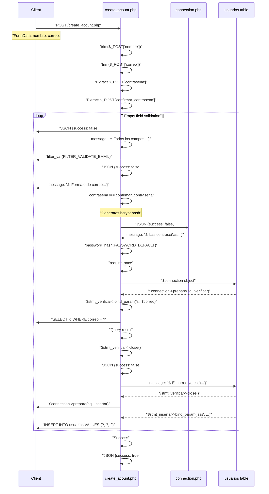
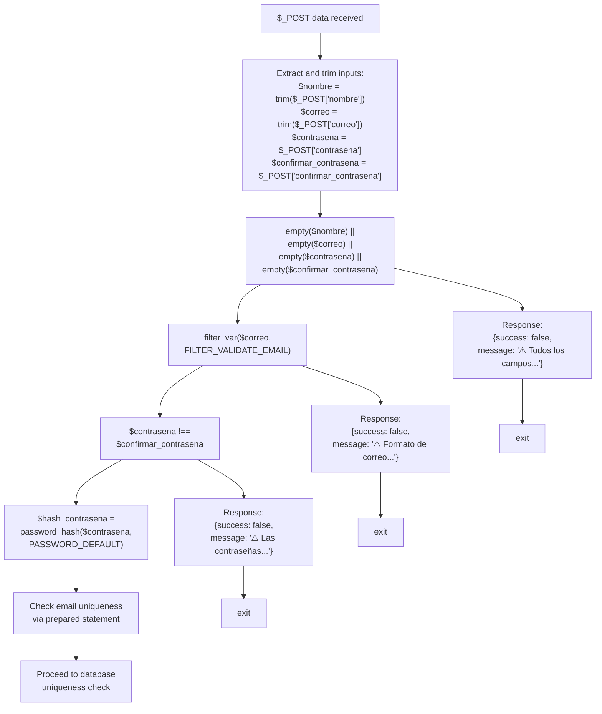
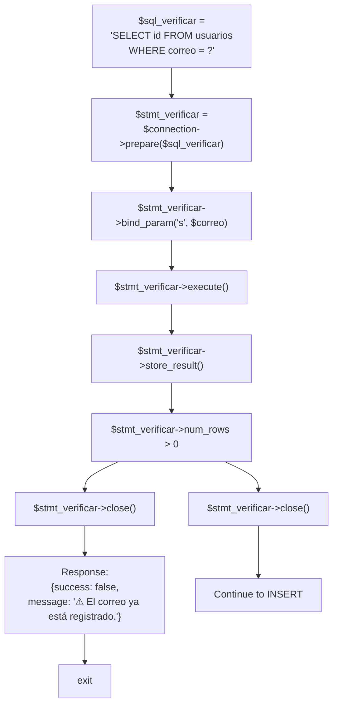
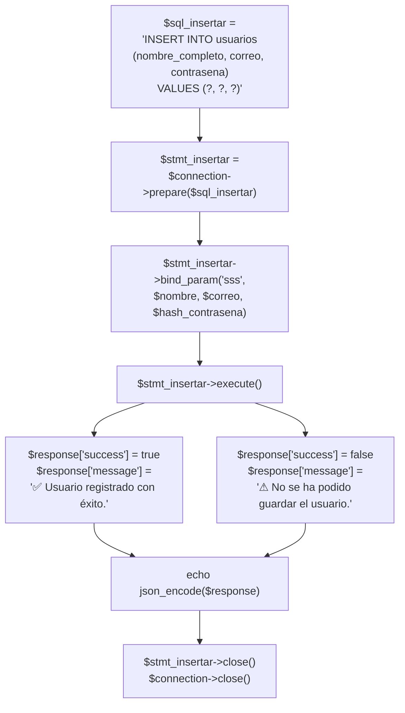
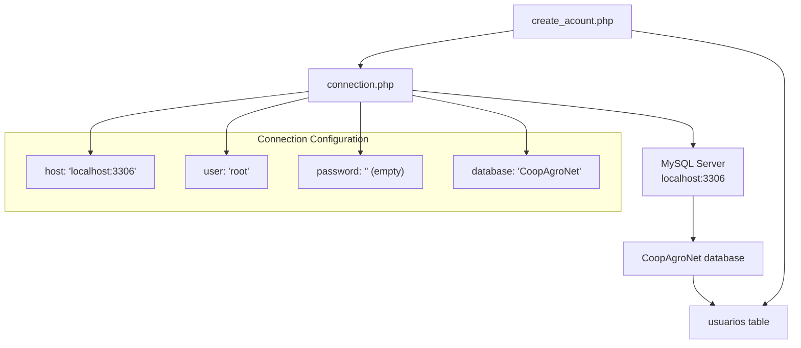

# Registration Endpoint

> **Relevant source files**
> * [backennd/db_interaction/connection.php](https://github.com/axchisan/CoopAgronet/blob/e8818744/backennd/db_interaction/connection.php)
> * [backennd/db_interaction/create_acount.php](https://github.com/axchisan/CoopAgronet/blob/e8818744/backennd/db_interaction/create_acount.php)

## Purpose and Scope

This document describes the `create_acount.php` endpoint, which handles new user registration for the CoopAgroNet platform. The endpoint validates user input, ensures email uniqueness, securely hashes passwords, and inserts new records into the `usuarios` table. For information about authenticating existing users, see [Login Endpoint](/axchisan/CoopAgronet/2.2.1-login-endpoint). For the broader authentication system architecture, see [User Authentication System](/axchisan/CoopAgronet/2.2-user-authentication-system).

**Sources:** [backennd/db_interaction/create_acount.php L1-L72](https://github.com/axchisan/CoopAgronet/blob/e8818744/backennd/db_interaction/create_acount.php#L1-L72)

---

## Endpoint Configuration

The registration endpoint is implemented as a standalone PHP script that processes HTTP POST requests.

| Property | Value |
| --- | --- |
| **File Path** | `backennd/db_interaction/create_acount.php` |
| **HTTP Method** | POST |
| **Content-Type** | `application/json` (response) |
| **Database Connection** | Via `require_once "connection.php"` |
| **Session Management** | None (stateless endpoint) |

The endpoint begins by requiring the shared database connection and configuring error reporting:

* [backennd/db_interaction/create_acount.php L2](https://github.com/axchisan/CoopAgronet/blob/e8818744/backennd/db_interaction/create_acount.php#L2-L2)  - Requires `connection.php` for `$connection` object
* [backennd/db_interaction/create_acount.php L4-L5](https://github.com/axchisan/CoopAgronet/blob/e8818744/backennd/db_interaction/create_acount.php#L4-L5)  - Enables full error reporting
* [backennd/db_interaction/create_acount.php L7](https://github.com/axchisan/CoopAgronet/blob/e8818744/backennd/db_interaction/create_acount.php#L7-L7)  - Sets JSON response header

**Sources:** [backennd/db_interaction/create_acount.php L1-L9](https://github.com/axchisan/CoopAgronet/blob/e8818744/backennd/db_interaction/create_acount.php#L1-L9)

---

## Request Processing Flow



**Diagram: Registration Request Processing Sequence**

This sequence diagram shows the complete flow from POST request receipt through database insertion. The endpoint processes requests only when `$_SERVER['REQUEST_METHOD'] == 'POST'` [backennd/db_interaction/create_acount.php L11](https://github.com/axchisan/CoopAgronet/blob/e8818744/backennd/db_interaction/create_acount.php#L11-L11)

 All validation failures result in immediate JSON responses with `exit` statements to terminate execution.

**Sources:** [backennd/db_interaction/create_acount.php L11-L71](https://github.com/axchisan/CoopAgronet/blob/e8818744/backennd/db_interaction/create_acount.php#L11-L71)

---

## Input Extraction and Validation Pipeline

The endpoint extracts four POST parameters and applies a multi-stage validation pipeline:



**Diagram: Input Validation Pipeline**

### Validation Stage Details

**Stage 1: Input Extraction** [backennd/db_interaction/create_acount.php L12-L15](https://github.com/axchisan/CoopAgronet/blob/e8818744/backennd/db_interaction/create_acount.php#L12-L15)

* `$nombre` and `$correo` are trimmed using `trim()` to remove whitespace
* `$contrasena` and `$confirmar_contrasena` are not trimmed (intentional - preserves password integrity)

**Stage 2: Empty Field Check** [backennd/db_interaction/create_acount.php L17-L22](https://github.com/axchisan/CoopAgronet/blob/e8818744/backennd/db_interaction/create_acount.php#L17-L22)

* Tests all four fields with `empty()` function
* Returns error message: "⚠ Todos los campos son obligatorios."
* Calls `exit` to terminate execution immediately

**Stage 3: Email Format Validation** [backennd/db_interaction/create_acount.php L24-L29](https://github.com/axchisan/CoopAgronet/blob/e8818744/backennd/db_interaction/create_acount.php#L24-L29)

* Uses PHP's built-in `filter_var()` with `FILTER_VALIDATE_EMAIL`
* Returns error message: "⚠ Formato de correo no válido."
* Does not check for email existence at this stage

**Stage 4: Password Confirmation Match** [backennd/db_interaction/create_acount.php L31-L36](https://github.com/axchisan/CoopAgronet/blob/e8818744/backennd/db_interaction/create_acount.php#L31-L36)

* Compares `$contrasena !== $confirmar_contrasena` using strict inequality
* Returns error message: "⚠ Las contraseñas no coinciden."
* Prevents user from creating account with mistyped password

**Sources:** [backennd/db_interaction/create_acount.php L12-L36](https://github.com/axchisan/CoopAgronet/blob/e8818744/backennd/db_interaction/create_acount.php#L12-L36)

---

## Password Hashing

After successful validation, the plaintext password is hashed using PHP's `password_hash()` function:

[backennd/db_interaction/create_acount.php L38](https://github.com/axchisan/CoopAgronet/blob/e8818744/backennd/db_interaction/create_acount.php#L38-L38)

```
$hash_contrasena = password_hash($contrasena, PASSWORD_DEFAULT);
```

| Aspect | Implementation |
| --- | --- |
| **Algorithm** | `PASSWORD_DEFAULT` (bcrypt as of PHP 7.x, may upgrade to argon2 in future PHP versions) |
| **Salt** | Automatically generated and embedded in hash |
| **Cost Factor** | PHP default (10 for bcrypt) |
| **Output Length** | 60 characters for bcrypt |
| **Storage Column** | `usuarios.contrasena` (VARCHAR, stores hash not plaintext) |

The hashed password is stored in `$hash_contrasena` variable and used in the INSERT statement. This approach ensures:

1. **Irreversibility**: Original password cannot be recovered from hash
2. **Rainbow Table Resistance**: Unique salt per password prevents precomputed attacks
3. **Future Compatibility**: `PASSWORD_DEFAULT` allows algorithm upgrades without code changes
4. **Verification Compatibility**: Hash can be verified using `password_verify()` in the login endpoint

**Sources:** [backennd/db_interaction/create_acount.php L38](https://github.com/axchisan/CoopAgronet/blob/e8818744/backennd/db_interaction/create_acount.php#L38-L38)

---

## Email Uniqueness Verification



**Diagram: Email Uniqueness Check Flow**

The endpoint queries the `usuarios` table to determine if the provided email already exists before attempting insertion.

### Prepared Statement Implementation

**SQL Query Definition** [backennd/db_interaction/create_acount.php L40](https://github.com/axchisan/CoopAgronet/blob/e8818744/backennd/db_interaction/create_acount.php#L40-L40)

```sql
SELECT id FROM usuarios WHERE correo = ?
```

This query uses a parameterized placeholder (`?`) for the email value, which is bound separately for security.

**Statement Preparation and Execution** [backennd/db_interaction/create_acount.php L41-L44](https://github.com/axchisan/CoopAgronet/blob/e8818744/backennd/db_interaction/create_acount.php#L41-L44)

| Step | Method | Purpose |
| --- | --- | --- |
| Prepare | `$connection->prepare($sql_verificar)` | Compiles SQL statement with placeholder |
| Bind | `$stmt_verificar->bind_param("s", $correo)` | Binds email string to `?` placeholder (`"s"` = string type) |
| Execute | `$stmt_verificar->execute()` | Runs parameterized query against database |
| Store | `$stmt_verificar->store_result()` | Buffers result set for `num_rows` access |

**Existence Check** [backennd/db_interaction/create_acount.php L46-L52](https://github.com/axchisan/CoopAgronet/blob/e8818744/backennd/db_interaction/create_acount.php#L46-L52)

The endpoint tests `$stmt_verificar->num_rows > 0`:

* **If true**: Email exists, returns JSON error and closes statement [backennd/db_interaction/create_acount.php L47-L50](https://github.com/axchisan/CoopAgronet/blob/e8818744/backennd/db_interaction/create_acount.php#L47-L50)
* **If false**: Email available, closes statement and proceeds [backennd/db_interaction/create_acount.php L53](https://github.com/axchisan/CoopAgronet/blob/e8818744/backennd/db_interaction/create_acount.php#L53-L53)

This check enforces email uniqueness at the application layer. The `usuarios` table may also have a UNIQUE constraint on the `correo` column (see [Database Schema](/axchisan/CoopAgronet/1.3-database-schema)).

**Sources:** [backennd/db_interaction/create_acount.php L40-L53](https://github.com/axchisan/CoopAgronet/blob/e8818744/backennd/db_interaction/create_acount.php#L40-L53)

---

## User Record Insertion

After successful validation and uniqueness verification, the endpoint inserts the new user record using a prepared statement:



**Diagram: Database Insertion Process**

### INSERT Statement Structure

**SQL Template** [backennd/db_interaction/create_acount.php L55](https://github.com/axchisan/CoopAgronet/blob/e8818744/backennd/db_interaction/create_acount.php#L55-L55)

```sql
INSERT INTO usuarios (nombre_completo, correo, contrasena) VALUES (?, ?, ?)
```

This statement inserts three columns into the `usuarios` table:

| Column | Placeholder Position | Bound Variable | Type |
| --- | --- | --- | --- |
| `nombre_completo` | 1st `?` | `$nombre` | string (`s`) |
| `correo` | 2nd `?` | `$correo` | string (`s`) |
| `contrasena` | 3rd `?` | `$hash_contrasena` | string (`s`) |

**Prepared Statement Execution** [backennd/db_interaction/create_acount.php L56-L57](https://github.com/axchisan/CoopAgronet/blob/e8818744/backennd/db_interaction/create_acount.php#L56-L57)

The three parameters are bound with type specifier `"sss"` (three strings):

```
$stmt_insertar->bind_param("sss", $nombre, $correo, $hash_contrasena);
```

### Success/Failure Handling

**Success Path** [backennd/db_interaction/create_acount.php L59-L61](https://github.com/axchisan/CoopAgronet/blob/e8818744/backennd/db_interaction/create_acount.php#L59-L61)

* Condition: `$stmt_insertar->execute()` returns `true`
* Sets `$response["success"] = true`
* Sets message: "✅ Usuario registrado con éxito."

**Failure Path** [backennd/db_interaction/create_acount.php L62-L65](https://github.com/axchisan/CoopAgronet/blob/e8818744/backennd/db_interaction/create_acount.php#L62-L65)

* Condition: `$stmt_insertar->execute()` returns `false`
* Sets `$response["success"] = false`
* Sets message: "⚠ No se ha podido guardar el usuario."
* Failure may occur due to database constraint violations or connection issues

### Resource Cleanup

[backennd/db_interaction/create_acount.php L69-L70](https://github.com/axchisan/CoopAgronet/blob/e8818744/backennd/db_interaction/create_acount.php#L69-L70)

```
$stmt_insertar->close();
$connection->close();
```

Both the prepared statement and database connection are explicitly closed to release resources. This occurs after the JSON response is echoed [backennd/db_interaction/create_acount.php L67](https://github.com/axchisan/CoopAgronet/blob/e8818744/backennd/db_interaction/create_acount.php#L67-L67)

**Sources:** [backennd/db_interaction/create_acount.php L55-L70](https://github.com/axchisan/CoopAgronet/blob/e8818744/backennd/db_interaction/create_acount.php#L55-L70)

---

## Response Format

All responses from the registration endpoint follow a consistent JSON structure:

### Response Schema

```
{
  "success": boolean,
  "message": string
}
```

### Response Examples

| Scenario | `success` | `message` | Exit Point |
| --- | --- | --- | --- |
| **Empty field** | `false` | "⚠ Todos los campos son obligatorios." | Line 20 |
| **Invalid email format** | `false` | "⚠ Formato de correo no válido." | Line 27 |
| **Password mismatch** | `false` | "⚠ Las contraseñas no coinciden." | Line 34 |
| **Email already exists** | `false` | "⚠ El correo ya está registrado." | Line 48 |
| **Database insert failure** | `false` | "⚠ No se ha podido guardar el usuario." | Line 64 |
| **Successful registration** | `true` | "✅ Usuario registrado con éxito." | Line 61 |

### Response Headers

[backennd/db_interaction/create_acount.php L7](https://github.com/axchisan/CoopAgronet/blob/e8818744/backennd/db_interaction/create_acount.php#L7-L7)

```
header("Content-Type: application/json");
```

The endpoint explicitly sets the `Content-Type` header to `application/json`, ensuring clients parse the response body as JSON.

### Response Encoding

[backennd/db_interaction/create_acount.php L20-L67](https://github.com/axchisan/CoopAgronet/blob/e8818744/backennd/db_interaction/create_acount.php#L20-L67)

```php
echo json_encode($response);
```

The `$response` associative array is encoded to JSON using `json_encode()` before being sent to the client. This occurs at five different exit points throughout the endpoint's execution flow.

**Sources:** [backennd/db_interaction/create_acount.php L7-L67](https://github.com/axchisan/CoopAgronet/blob/e8818744/backennd/db_interaction/create_acount.php#L7-L67)

---

## Database Connection Dependency

The registration endpoint depends on the shared database connection layer:



**Diagram: Database Connection Dependency Graph**

### Connection Object Usage

[backennd/db_interaction/create_acount.php L2](https://github.com/axchisan/CoopAgronet/blob/e8818744/backennd/db_interaction/create_acount.php#L2-L2)

```
require_once "connection.php";
```

This statement imports the connection script, which provides the `$connection` mysqli object. The endpoint uses this object for:

1. **Email uniqueness check**: `$connection->prepare($sql_verificar)` [backennd/db_interaction/create_acount.php L41](https://github.com/axchisan/CoopAgronet/blob/e8818744/backennd/db_interaction/create_acount.php#L41-L41)
2. **User insertion**: `$connection->prepare($sql_insertar)` [backennd/db_interaction/create_acount.php L56](https://github.com/axchisan/CoopAgronet/blob/e8818744/backennd/db_interaction/create_acount.php#L56-L56)
3. **Explicit closure**: `$connection->close()` [backennd/db_interaction/create_acount.php L70](https://github.com/axchisan/CoopAgronet/blob/e8818744/backennd/db_interaction/create_acount.php#L70-L70)

### Connection Configuration

The shared `connection.php` file establishes the mysqli connection:

[backennd/db_interaction/connection.php L5-L10](https://github.com/axchisan/CoopAgronet/blob/e8818744/backennd/db_interaction/connection.php#L5-L10)

```
$host = "localhost:3306";
$user = "root";
$password = "";
$database = "CoopAgroNet";

$connection = mysqli_connect($host, $user, $password, $database);
```

This configuration uses:

* **Host**: `localhost:3306` (local MySQL server on default port)
* **User**: `root` (administrative account with full privileges)
* **Password**: Empty string (no authentication)
* **Database**: `CoopAgroNet` (application database schema)

For more details on the connection layer, see [Database Connection Layer](/axchisan/CoopAgronet/2.1-database-connection-layer).

**Sources:** [backennd/db_interaction/create_acount.php L2](https://github.com/axchisan/CoopAgronet/blob/e8818744/backennd/db_interaction/create_acount.php#L2-L2)

 [backennd/db_interaction/connection.php L5-L10](https://github.com/axchisan/CoopAgronet/blob/e8818744/backennd/db_interaction/connection.php#L5-L10)

---

## Security Analysis

### Strengths

**Prepared Statements**

* Both SELECT and INSERT operations use parameterized queries [backennd/db_interaction/create_acount.php L41-L57](https://github.com/axchisan/CoopAgronet/blob/e8818744/backennd/db_interaction/create_acount.php#L41-L57)
* Parameters bound with `bind_param()` prevent SQL injection attacks
* Type specifiers (`"s"` for string) enforce parameter type safety

**Password Security**

* Passwords hashed with `password_hash(PASSWORD_DEFAULT)` [backennd/db_interaction/create_acount.php L38](https://github.com/axchisan/CoopAgronet/blob/e8818744/backennd/db_interaction/create_acount.php#L38-L38)
* Uses bcrypt algorithm with automatic salt generation
* Hash stored in database, never plaintext password
* Compatible with `password_verify()` used in login endpoint

**Input Validation**

* Multi-stage validation catches invalid inputs early [backennd/db_interaction/create_acount.php L17-L36](https://github.com/axchisan/CoopAgronet/blob/e8818744/backennd/db_interaction/create_acount.php#L17-L36)
* Email format validated with `filter_var(FILTER_VALIDATE_EMAIL)`
* Password confirmation prevents typos during registration
* Empty field checks prevent null/undefined database entries

### Vulnerabilities

**Database Credentials**

* Uses `root` user with empty password [backennd/db_interaction/connection.php L6-L7](https://github.com/axchisan/CoopAgronet/blob/e8818744/backennd/db_interaction/connection.php#L6-L7)
* Credentials hardcoded in `connection.php` (no environment variables)
* Full root privileges expose entire database to compromise

**No Rate Limiting**

* Endpoint accepts unlimited POST requests
* Vulnerable to brute-force email enumeration attacks
* No CAPTCHA or throttling mechanism

**Error Message Information Disclosure**

* Distinct error messages for "email exists" vs "registration failed" [backennd/db_interaction/create_acount.php L48-L64](https://github.com/axchisan/CoopAgronet/blob/e8818744/backennd/db_interaction/create_acount.php#L48-L64)
* Allows attackers to enumerate registered email addresses
* Should use generic error message for both cases

**No CSRF Protection**

* Endpoint accepts any POST request without token verification
* Cross-Site Request Forgery attacks possible if user is logged into application

For comprehensive security analysis across all endpoints, see [Security Considerations](/axchisan/CoopAgronet/4-security-considerations).

**Sources:** [backennd/db_interaction/create_acount.php L2-L65](https://github.com/axchisan/CoopAgronet/blob/e8818744/backennd/db_interaction/create_acount.php#L2-L65)

 [backennd/db_interaction/connection.php L6-L7](https://github.com/axchisan/CoopAgronet/blob/e8818744/backennd/db_interaction/connection.php#L6-L7)

---

## Integration with Frontend

The registration endpoint is consumed by client-side JavaScript that handles the registration form submission. While this document focuses on the backend endpoint, the typical client integration pattern involves:

1. **Form data collection**: JavaScript extracts values from HTML form inputs
2. **HTTP POST request**: Client sends FormData or JSON payload to `create_acount.php`
3. **Response handling**: Client parses JSON response and displays success/error messages
4. **UI updates**: On success, client may redirect to login form or auto-login user

For details on the client-side implementation, see [Authentication Frontend](/axchisan/CoopAgronet/3.2-authentication-frontend).

**Sources:** [backennd/db_interaction/create_acount.php L11-L67](https://github.com/axchisan/CoopAgronet/blob/e8818744/backennd/db_interaction/create_acount.php#L11-L67)