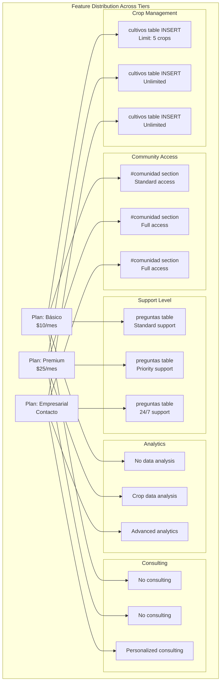
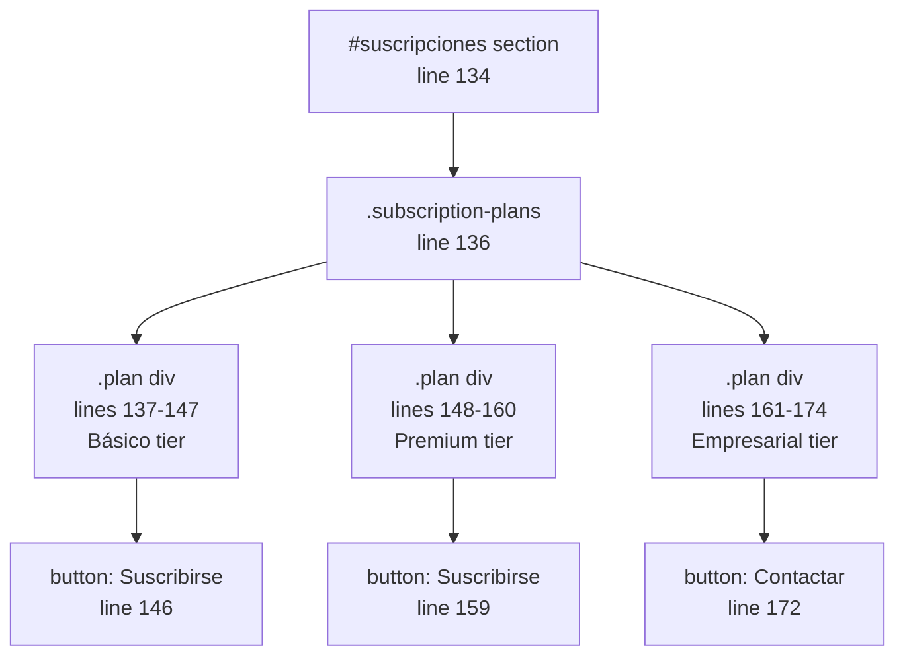
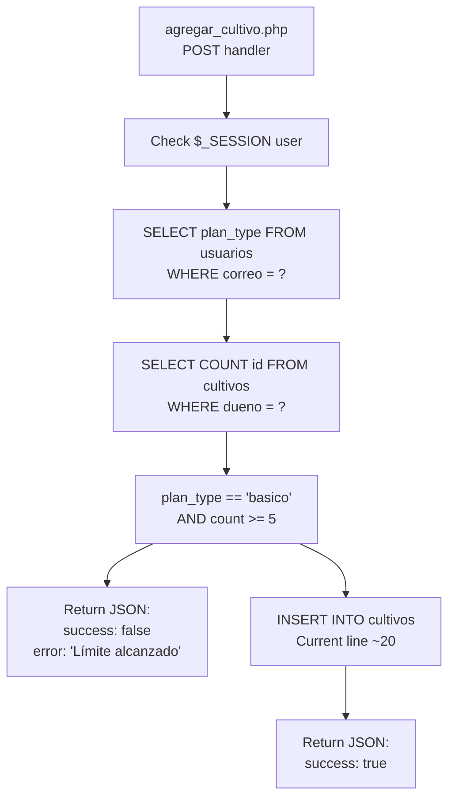
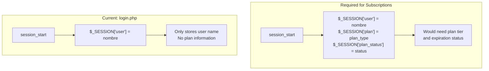
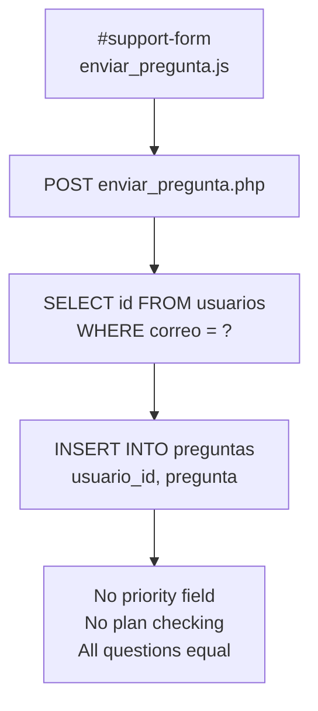
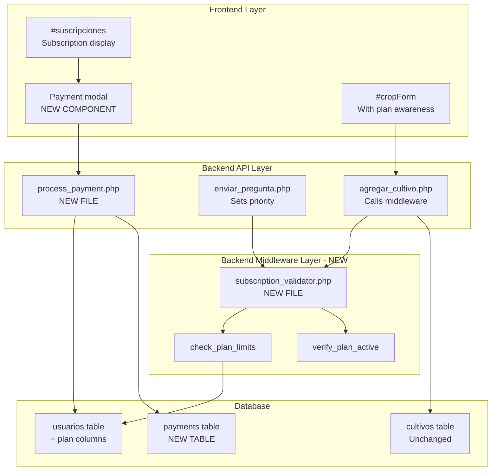

# Subscription and Feature Model

> **Relevant source files**
> * [front end/index.html](https://github.com/axchisan/CoopAgronet/blob/e8818744/front end/index.html)
> * [front end/style.css](https://github.com/axchisan/CoopAgronet/blob/e8818744/front end/style.css)

## Purpose and Scope

This document describes the subscription tier system presented in the CoopAgroNet platform's user interface. The system defines three subscription plans (Básico, Premium, Empresarial) with distinct feature sets and pricing structures.

**Important**: The subscription model is currently **presentation-only**. The tiers are displayed in the UI at [front L134-L175](https://github.com/axchisan/CoopAgronet/blob/e8818744/front end/index.html#L134-L175)

 but no backend enforcement, payment processing, or access control mechanisms are implemented in the codebase. This page documents both the intended model and the implementation gap.

For information about actual user authentication (which does not include plan validation), see [User Authentication System](/axchisan/CoopAgronet/2.2-user-authentication-system). For crop management operations (which currently have no subscription-based limits), see [Crop Management API](/axchisan/CoopAgronet/2.3-crop-management-api).

---

## Subscription Tiers Overview

The platform defines three subscription tiers with progressive feature access. Each tier is presented as a clickable card in the `#suscripciones` section of the single-page application.

### Tier Definitions

| Tier | Monthly Price | Target Audience | Primary Differentiator |
| --- | --- | --- | --- |
| **Básico** | $10/mes | Individual farmers | Limited crop management (max 5 crops) |
| **Premium** | $25/mes | Active producers | Unlimited crops + data analytics |
| **Empresarial** | Contact-based | Large associations | 24/7 support + personalized consulting |

**Sources**: [front L137-L174](https://github.com/axchisan/CoopAgronet/blob/e8818744/front end/index.html#L137-L174)

---

## Feature Comparison Matrix



**Detailed Feature Matrix**:

| Feature | Básico | Premium | Empresarial |
| --- | --- | --- | --- |
| **Crop Management** | Up to 5 crops | Unlimited | Unlimited |
| **Community Access** | Standard | Full | Full |
| **Support Type** | Standard | Priority | 24/7 |
| **Data Analytics** | ❌ | ✅ Basic | ✅ Advanced |
| **Personalized Consulting** | ❌ | ❌ | ✅ |
| **Action Button** | "Suscribirse" | "Suscribirse" | "Contactar" |

**Sources**: [front L141-L145](https://github.com/axchisan/CoopAgronet/blob/e8818744/front end/index.html#L141-L145)

 [front L152-L158](https://github.com/axchisan/CoopAgronet/blob/e8818744/front end/index.html#L152-L158)

 [front L165-L171](https://github.com/axchisan/CoopAgronet/blob/e8818744/front end/index.html#L165-L171)

---

## UI Presentation Layer

### HTML Structure

The subscription plans are rendered as three `.plan` divs within the `#suscripciones` section. Each plan card includes:

* **Title**: Tier name (`<h3>`)
* **Description**: One-line summary (`<p>`)
* **Pricing**: Monthly cost or "Contacto" (`<p>`)
* **Feature List**: Unordered list (`<ul>`) with specific features
* **Call-to-Action**: Button with tier-appropriate text



### CSS Styling

The `.plan` class provides hover effects and card styling:

* **Default State**: [front L206-L214](https://github.com/axchisan/CoopAgronet/blob/e8818744/front end/style.css#L206-L214)  - Border, padding, width constraints
* **Hover Effect**: [front L216-L219](https://github.com/axchisan/CoopAgronet/blob/e8818744/front end/style.css#L216-L219)  - Upward translation (`translateY(-5px)`) and shadow enhancement
* **Button Styling**: [front L221-L240](https://github.com/axchisan/CoopAgronet/blob/e8818744/front end/style.css#L221-L240)  - Green theme (`#5cb85c`) with border and scaling on hover

**Sources**: [front L134-L175](https://github.com/axchisan/CoopAgronet/blob/e8818744/front end/index.html#L134-L175)

 [front L200-L240](https://github.com/axchisan/CoopAgronet/blob/e8818744/front end/style.css#L200-L240)

---

## Implementation Status and Gaps

### Current State: Presentation Only

The subscription system exists **only in the UI layer**. No backend validation or enforcement is implemented. The following diagram illustrates the disconnect between what users see and what the system actually enforces:

```

```

### Missing Components

The following table identifies components that would need to exist for a functional subscription system:

| Component | Location | Current Status | Required For |
| --- | --- | --- | --- |
| **Plan Column** | `usuarios` table | ❌ Does not exist | Storing user's subscription tier |
| **Plan Validation** | `agregar_cultivo.php` | ❌ Does not exist | Enforcing crop limits |
| **Count Query** | `agregar_cultivo.php` | ❌ Does not exist | Checking existing crop count before insert |
| **Payment Integration** | Any backend file | ❌ Does not exist | Processing subscriptions |
| **Plan Upgrade Logic** | Any backend file | ❌ Does not exist | Allowing tier changes |
| **Button Event Handlers** | `index.html` inline or separate JS | ❌ Does not exist | Subscription flow initiation |

**Sources**: [backend/db_interaction/agregar_cultivo.php](https://github.com/axchisan/CoopAgronet/blob/e8818744/backend/db_interaction/agregar_cultivo.php)

 (entire file - no validation), [front L146](https://github.com/axchisan/CoopAgronet/blob/e8818744/front end/index.html#L146-L146)

 (button has no event handler)

---

## Theoretical Integration Points

This section documents where subscription enforcement **would** need to be implemented if the feature were to be activated.

### Database Schema Extensions

To support subscriptions, the `usuarios` table would require additional columns:

```sql
-- Theoretical schema additions (NOT IMPLEMENTED)
ALTER TABLE usuarios ADD COLUMN plan_type ENUM('basico', 'premium', 'empresarial') DEFAULT 'basico';
ALTER TABLE usuarios ADD COLUMN plan_start_date DATETIME;
ALTER TABLE usuarios ADD COLUMN plan_expiration_date DATETIME;
ALTER TABLE usuarios ADD COLUMN payment_status ENUM('active', 'expired', 'cancelled') DEFAULT 'active';
```

### Backend Enforcement Point: Crop Creation

The `agregar_cultivo.php` endpoint would need validation logic **before** the INSERT statement:



**Location**: Validation would be inserted at [backend/db_interaction/agregar_cultivo.php L15-L20](https://github.com/axchisan/CoopAgronet/blob/e8818744/backend/db_interaction/agregar_cultivo.php#L15-L20)

 (before current INSERT query)

### Frontend Enforcement Points

While frontend validation can be bypassed, user experience would benefit from client-side checks:

1. **Crop Form Submission** - `agregar_cultivo.js` could check crop count before POST
2. **Add Button State** - Disable "Añadir" button when limit reached (Básico users)
3. **Warning Message** - Display upgrade prompt when approaching limit

**Current Implementation**: [front end/agregar_cultivo.js](https://github.com/axchisan/CoopAgronet/blob/e8818744/front end/agregar_cultivo.js)

 has no plan awareness

---

## Session and User Context Gap

The subscription model assumes each user has an associated plan, but the current authentication system stores minimal user data in sessions:



**Current State**: [backend/db_interaction/login.php L30](https://github.com/axchisan/CoopAgronet/blob/e8818744/backend/db_interaction/login.php#L30-L30)

 only sets `$_SESSION["user"]` with the user's name

**Required**: Session would need to include:

* `plan_type` - Which tier the user has purchased
* `plan_status` - Whether the plan is active/expired
* `plan_expiration` - When the plan expires

**Sources**: [backend/db_interaction/login.php L28-L31](https://github.com/axchisan/CoopAgronet/blob/e8818744/backend/db_interaction/login.php#L28-L31)

---

## Support System Interaction

The support question system (`enviar_pregunta.php`) currently has no differentiation based on subscription tier. The intended model specifies:

* **Básico**: Standard support (no SLA)
* **Premium**: Priority support (faster response)
* **Empresarial**: 24/7 support (dedicated channel)

### Current Implementation



### Theoretical Enhancement

To implement tiered support, the `preguntas` table would need a priority column:

```sql
-- Theoretical addition
ALTER TABLE preguntas ADD COLUMN priority ENUM('standard', 'priority', '24/7') DEFAULT 'standard';
```

And `enviar_pregunta.php` would set priority based on user plan:

```sql
// Theoretical logic at line ~25
$plan_query = "SELECT plan_type FROM usuarios WHERE correo = ?";
$priority = ($plan_type == 'empresarial') ? '24/7' : 
            ($plan_type == 'premium') ? 'priority' : 'standard';
```

**Sources**: [backend/db_interaction/enviar_pregunta.php L23-L29](https://github.com/axchisan/CoopAgronet/blob/e8818744/backend/db_interaction/enviar_pregunta.php#L23-L29)

 [front L270-L285](https://github.com/axchisan/CoopAgronet/blob/e8818744/front end/index.html#L270-L285)

---

## Analytics and Advanced Features

Two subscription tiers mention analytics features:

* **Premium**: "Análisis de datos de cultivos" [front L157](https://github.com/axchisan/CoopAgronet/blob/e8818744/front end/index.html#L157-L157)
* **Empresarial**: "Análisis de datos avanzados" [front L169](https://github.com/axchisan/CoopAgronet/blob/e8818744/front end/index.html#L169-L169)

### Current State: No Analytics Exist

The codebase contains **no analytics functionality** for any tier:

* No data aggregation queries (e.g., total production by crop type)
* No visualization components
* No reporting endpoints
* No dashboard section in UI

### Where Analytics Would Integrate

If implemented, analytics would likely appear as:

1. **New Section**: `#analytics` in `index.html` navigation
2. **New Endpoint**: `backend/db_interaction/obtener_estadisticas.php`
3. **Query Examples**: * `SELECT tipo, SUM(cantidad) FROM cultivos GROUP BY tipo` * `SELECT AVG(edad) FROM cultivos WHERE dueno = ?`
4. **Plan Gating**: Return 403 if user plan not 'premium' or 'empresarial'

**Sources**: [front L157](https://github.com/axchisan/CoopAgronet/blob/e8818744/front end/index.html#L157-L157)

 [front L169](https://github.com/axchisan/CoopAgronet/blob/e8818744/front end/index.html#L169-L169)

---

## Payment Processing Gap

All three subscription tiers display pricing information, but no payment infrastructure exists:

| Component | Status |
| --- | --- |
| Payment Gateway Integration (Stripe, PayPal, etc.) | ❌ Not implemented |
| Webhook Handler for subscription updates | ❌ Not implemented |
| Invoice generation | ❌ Not implemented |
| Subscription renewal logic | ❌ Not implemented |
| Payment history tracking | ❌ Not implemented |

The "Suscribirse" and "Contactar" buttons at [front L146](https://github.com/axchisan/CoopAgronet/blob/e8818744/front end/index.html#L146-L146)

 [front L159](https://github.com/axchisan/CoopAgronet/blob/e8818744/front end/index.html#L159-L159)

 [front L172](https://github.com/axchisan/CoopAgronet/blob/e8818744/front end/index.html#L172-L172)

 have no click handlers.

**Sources**: [front L146-L172](https://github.com/axchisan/CoopAgronet/blob/e8818744/front end/index.html#L146-L172)

---

## Architecture Recommendations for Implementation

If subscription enforcement were to be implemented, the following architecture would maintain separation of concerns:



### Key Architectural Decisions

1. **Middleware Approach**: Create `subscription_validator.php` as a shared utility rather than duplicating validation logic across endpoints
2. **Database-First**: Store plan information in `usuarios` table, avoid client-side plan storage
3. **Graceful Degradation**: Return specific error codes (e.g., HTTP 403 with `error: 'plan_limit_exceeded'`) that frontend can display as upgrade prompts
4. **Webhook-Driven**: Use payment gateway webhooks to update `usuarios.payment_status` asynchronously

**Sources**: Architecture recommendation based on analysis of [backend/db_interaction/](https://github.com/axchisan/CoopAgronet/blob/e8818744/backend/db_interaction/)

 directory structure and existing endpoint patterns

---

## Summary: Presentation vs. Implementation

**What Exists**:

* UI presentation of three subscription tiers with feature lists
* Pricing information displayed to users
* Visual design for subscription cards with hover effects

**What Does NOT Exist**:

* Database columns for storing user subscription plans
* Backend validation of crop limits for Básico tier
* Payment processing infrastructure
* Plan upgrade/downgrade workflows
* Analytics features for Premium/Empresarial
* Priority support routing
* Session awareness of user plans
* Event handlers on subscription buttons

The subscription model is a **design specification** presented in the UI, not a functional system. All users currently have unrestricted access to all features regardless of which plan they might believe they have selected.

**Sources**: Entire analysis based on [front L134-L175](https://github.com/axchisan/CoopAgronet/blob/e8818744/front end/index.html#L134-L175)

 [backend/db_interaction/](https://github.com/axchisan/CoopAgronet/blob/e8818744/backend/db_interaction/)

 directory (all files examined for subscription logic - none found)