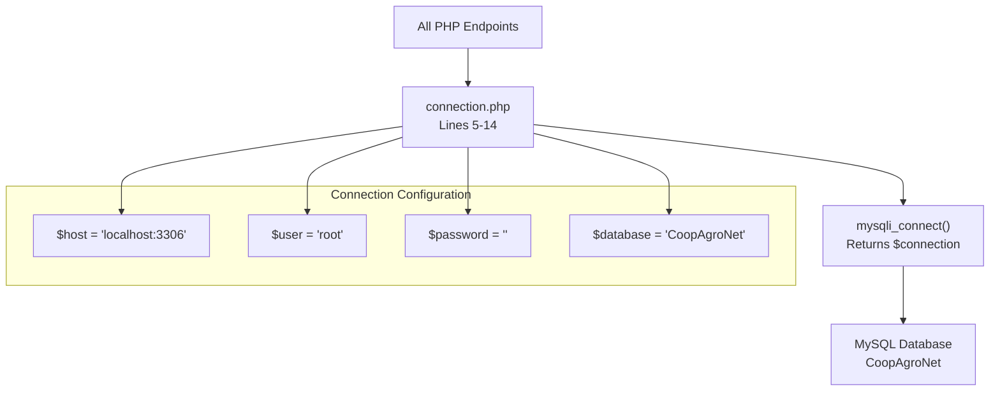
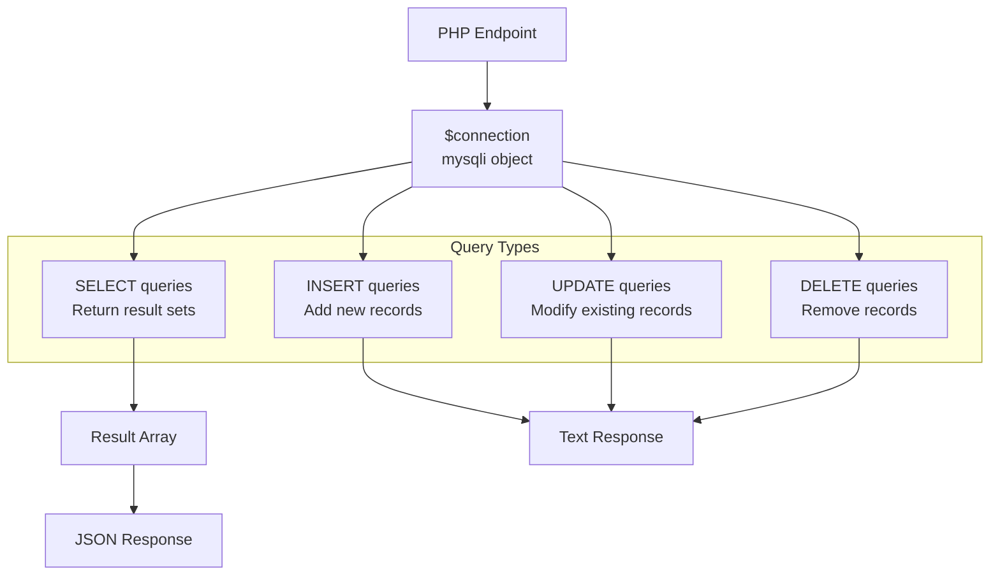
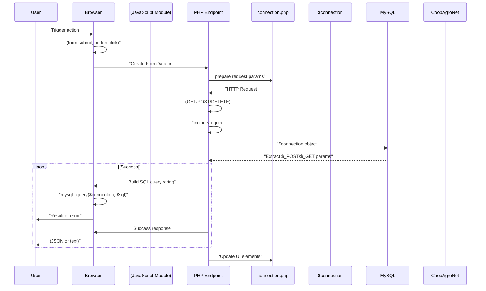

# System Architecture

> **Relevant source files**
> * [backennd/db_interaction/agregar_cultivo.php](https://github.com/axchisan/CoopAgronet/blob/e8818744/backennd/db_interaction/agregar_cultivo.php)
> * [backennd/db_interaction/connection.php](https://github.com/axchisan/CoopAgronet/blob/e8818744/backennd/db_interaction/connection.php)
> * [front end/agregar_cultivo.js](https://github.com/axchisan/CoopAgronet/blob/e8818744/front end/agregar_cultivo.js)
> * [front end/index.html](https://github.com/axchisan/CoopAgronet/blob/e8818744/front end/index.html)

## Purpose and Scope

This document describes the overall system architecture of CoopAgroNet, a web-based agricultural cooperative platform. It covers the three-tier architecture design, layer responsibilities, file organization, and common request flow patterns.

For specific technology choices and dependencies, see [Technology Stack](/axchisan/CoopAgronet/1.2-technology-stack). For database table schemas and relationships, see [Database Schema](/axchisan/CoopAgronet/1.3-database-schema). For implementation details of individual backend endpoints, see [Backend System](/axchisan/CoopAgronet/2-backend-system). For frontend component details, see [Frontend System](/axchisan/CoopAgronet/3-frontend-system).

## Architecture Overview

CoopAgroNet implements a classic three-tier web architecture with clear separation between presentation, application logic, and data persistence layers. The system consists of a browser-based client communicating with PHP backend endpoints that interact with a MySQL database.

### Three-Tier Architecture Diagram

```

```

**Sources**: [front L292-L295](https://github.com/axchisan/CoopAgronet/blob/e8818744/front end/index.html#L292-L295)

 [backennd/db_interaction/connection.php L1-L15](https://github.com/axchisan/CoopAgronet/blob/e8818744/backennd/db_interaction/connection.php#L1-L15)

## Presentation Layer

The presentation layer is implemented as a single-page application (SPA) within [front L1-L331](https://github.com/axchisan/CoopAgronet/blob/e8818744/front end/index.html#L1-L331)

 The file contains seven main sections accessed via hash-based navigation:

| Section ID | Purpose | Associated JavaScript |
| --- | --- | --- |
| `#inicio` | Welcome banner and key features | None (static) |
| `#gestion-cultivos` | Crop CRUD interface | `agregar_cultivo.js`, `acciones_cultivos.js` |
| `#comunidad` | Community posts display | None (static) |
| `#suscripciones` | Subscription plans | None (static) |
| `#login` | Authentication forms | `login.js` |
| `#admin` | Admin panel | Inline script |
| `#soporte` | Support form | `enviar_pregunta.js` |

### Key DOM Elements

The system relies on specific element IDs for JavaScript interaction:

* **Crop Management**: `cropForm` [front L74](https://github.com/axchisan/CoopAgronet/blob/e8818744/front end/index.html#L74-L74)  `cropTableBody` [front L102](https://github.com/axchisan/CoopAgronet/blob/e8818744/front end/index.html#L102-L102)  `message` [front L84](https://github.com/axchisan/CoopAgronet/blob/e8818744/front end/index.html#L84-L84)
* **Authentication**: `login-form` [front L182](https://github.com/axchisan/CoopAgronet/blob/e8818744/front end/index.html#L182-L182)  `register-form` [front L214](https://github.com/axchisan/CoopAgronet/blob/e8818744/front end/index.html#L214-L214)  `user-profile` [front L208](https://github.com/axchisan/CoopAgronet/blob/e8818744/front end/index.html#L208-L208)
* **Support**: `support-form` [front L275](https://github.com/axchisan/CoopAgronet/blob/e8818744/front end/index.html#L275-L275)  `mensaje-form` [front L281](https://github.com/axchisan/CoopAgronet/blob/e8818744/front end/index.html#L281-L281)

### Dual Frontend Strategy

The codebase implements two parallel approaches for crop management:

1. **Vanilla JavaScript**: [front L1-L77](https://github.com/axchisan/CoopAgronet/blob/e8818744/front end/agregar_cultivo.js#L1-L77)  and [front end/acciones_cultivos.js](https://github.com/axchisan/CoopAgronet/blob/e8818744/front end/acciones_cultivos.js)  manipulate the DOM directly
2. **React Component**: `crop-management.js` provides a component-based alternative (loaded via Babel transpilation at [front L297-L300](https://github.com/axchisan/CoopAgronet/blob/e8818744/front end/index.html#L297-L300) )

**Sources**: [front L1-L331](https://github.com/axchisan/CoopAgronet/blob/e8818744/front end/index.html#L1-L331)

 [front L1-L77](https://github.com/axchisan/CoopAgronet/blob/e8818744/front end/agregar_cultivo.js#L1-L77)

## Application Layer

The backend consists of procedural PHP scripts, each serving as an independent endpoint. There is no MVC framework, routing system, or ORM layer. Each endpoint file handles its own request processing, validation, and database interaction.

### Connection Factory Pattern

All database operations flow through a single connection factory:



The `connection.php` file [backennd/db_interaction/connection.php L5-L14](https://github.com/axchisan/CoopAgronet/blob/e8818744/backennd/db_interaction/connection.php#L5-L14)

 establishes a mysqli connection that is shared by all endpoints through file inclusion. Connection failures trigger JSON error responses [backennd/db_interaction/connection.php L12-L14](https://github.com/axchisan/CoopAgronet/blob/e8818744/backennd/db_interaction/connection.php#L12-L14)

### Endpoint Responsibilities

Each endpoint follows a consistent pattern:

1. Include `connection.php` to obtain `$connection` object
2. Extract request parameters (`$_POST`, `$_GET`, HTTP method)
3. Execute SQL query using `$connection`
4. Return response (JSON or text)
5. Close connection with `mysqli_close($connection)`

Example from [backennd/db_interaction/agregar_cultivo.php L2-L26](https://github.com/axchisan/CoopAgronet/blob/e8818744/backennd/db_interaction/agregar_cultivo.php#L2-L26)

:

```php
include "connection.php"              // Step 1
$tipo = $_POST["tipo"]                // Step 2
$sql = "INSERT INTO cultivos ..."     // Step 3
echo "Cultivo agregado con éxito"     // Step 4
mysqli_close($connection)             // Step 5
```

**Sources**: [backennd/db_interaction/connection.php L1-L15](https://github.com/axchisan/CoopAgronet/blob/e8818744/backennd/db_interaction/connection.php#L1-L15)

 [backennd/db_interaction/agregar_cultivo.php L1-L27](https://github.com/axchisan/CoopAgronet/blob/e8818744/backennd/db_interaction/agregar_cultivo.php#L1-L27)

## Data Layer

The data layer uses MySQL database `CoopAgroNet` with three main tables. The database is accessed directly via mysqli with no abstraction layer.

### Table Structure

| Table | Primary Key | Foreign Keys | Purpose |
| --- | --- | --- | --- |
| `usuarios` | `id` | None | User account storage with hashed passwords |
| `cultivos` | `id` | None | Crop records with ownership and metrics |
| `preguntas` | `id` | `usuario_id` → `usuarios.id` | Support questions linked to users |

### Data Access Pattern

All database interactions occur through direct SQL execution:



The system uses two query approaches:

1. **Direct String Interpolation**: Used by crop management endpoints [backennd/db_interaction/agregar_cultivo.php L16-L17](https://github.com/axchisan/CoopAgronet/blob/e8818744/backennd/db_interaction/agregar_cultivo.php#L16-L17)  - vulnerable to SQL injection
2. **Prepared Statements**: Used by authentication and support endpoints - secure against SQL injection

**Sources**: [backennd/db_interaction/connection.php L10](https://github.com/axchisan/CoopAgronet/blob/e8818744/backennd/db_interaction/connection.php#L10-L10)

 [backennd/db_interaction/agregar_cultivo.php L16-L17](https://github.com/axchisan/CoopAgronet/blob/e8818744/backennd/db_interaction/agregar_cultivo.php#L16-L17)

## Request Flow Patterns

### Typical CRUD Operation Flow



### State Management Strategy

CoopAgroNet uses three mechanisms for state management:

1. **PHP Sessions**: Authentication state stored in `$_SESSION["user"]` after successful login
2. **Page Reloads**: After mutations, JavaScript calls `location.reload()` to refresh data
3. **Direct DOM Manipulation**: JavaScript modules update table rows and form elements directly

Example from [front L7-L30](https://github.com/axchisan/CoopAgronet/blob/e8818744/front end/agregar_cultivo.js#L7-L30)

:

* `fetchCultivos()` retrieves all crops on page load
* Form submission POSTs data to `agregar_cultivo.php`
* Success callback calls `fetchCultivos()` again to refresh table
* No client-side state persistence between operations

**Sources**: [front L1-L77](https://github.com/axchisan/CoopAgronet/blob/e8818744/front end/agregar_cultivo.js#L1-L77)

 [backennd/db_interaction/agregar_cultivo.php L1-L27](https://github.com/axchisan/CoopAgronet/blob/e8818744/backennd/db_interaction/agregar_cultivo.php#L1-L27)

## File Organization

The codebase follows a two-directory structure:

```sql
CoopAgroNet/
├── backennd/db_interaction/     # Backend PHP endpoints
│   ├── connection.php           # Database connection factory
│   ├── login.php                # Authentication endpoint
│   ├── create_acount.php        # Registration endpoint
│   ├── agregar_cultivo.php      # Create crop
│   ├── obtener_cultivos.php     # Read all crops
│   ├── obtener_cultivo.php      # Read single crop
│   ├── editar_cultivo.php       # Update crop
│   ├── eliminar_cultivo.php     # Delete crop
│   └── enviar_pregunta.php      # Support questions
│
└── front end/                    # Frontend assets
    ├── index.html               # SPA shell
    ├── style.css                # Global styles
    ├── login.js                 # Authentication UI
    ├── agregar_cultivo.js       # Crop creation/listing
    ├── acciones_cultivos.js     # Crop edit/delete
    ├── crop-management.js       # React component
    └── enviar_pregunta.js       # Support form
```

JavaScript modules reference backend endpoints using absolute paths: `/proyecto_pagina_asociacones/CoopAgroNet/backennd/db_interaction/` [front L14](https://github.com/axchisan/CoopAgronet/blob/e8818744/front end/agregar_cultivo.js#L14-L14)

**Sources**: [front L292-L295](https://github.com/axchisan/CoopAgronet/blob/e8818744/front end/index.html#L292-L295)

 [front L14](https://github.com/axchisan/CoopAgronet/blob/e8818744/front end/agregar_cultivo.js#L14-L14)

 [backennd/db_interaction/agregar_cultivo.php L2](https://github.com/axchisan/CoopAgronet/blob/e8818744/backennd/db_interaction/agregar_cultivo.php#L2-L2)

## Key Architectural Patterns

### 1. Stateless Backend Operations

Each PHP endpoint is completely stateless (except for authentication session state). Every request carries full context via POST parameters or query strings. No backend caching or request state preservation occurs between calls.

### 2. Client-Driven Data Flow

The frontend is responsible for:

* Fetching data after mutations
* Maintaining temporary UI state
* Coordinating between multiple endpoints for complex operations

Example: Editing a crop requires three separate requests orchestrated by `acciones_cultivos.js`:

1. GET `obtener_cultivo.php?id=X` to fetch current data
2. User modifies form fields
3. POST to `editar_cultivo.php` with updated data

### 3. Direct Database Access

No repository pattern, data access layer, or ORM exists. Each endpoint constructs SQL queries directly and executes them through the shared `$connection` object [backennd/db_interaction/agregar_cultivo.php L16-L19](https://github.com/axchisan/CoopAgronet/blob/e8818744/backennd/db_interaction/agregar_cultivo.php#L16-L19)

### 4. Synchronous Request Processing

All operations are blocking and synchronous:

* PHP scripts execute sequentially from top to bottom
* JavaScript uses `.then()` promise chains (not async/await)
* No job queues, background tasks, or asynchronous processing

### 5. Optimistic UI Updates via Reload

Rather than implementing optimistic updates with rollback logic, the system:

1. Sends mutation request
2. Waits for success response
3. Calls `location.reload()` or re-fetches data to ensure UI matches database state

**Sources**: [backennd/db_interaction/agregar_cultivo.php L7-L26](https://github.com/axchisan/CoopAgronet/blob/e8818744/backennd/db_interaction/agregar_cultivo.php#L7-L26)

 [front L9-L40](https://github.com/axchisan/CoopAgronet/blob/e8818744/front end/agregar_cultivo.js#L9-L40)

## Architecture Limitations

The current architecture presents several constraints:

| Limitation | Impact | Example |
| --- | --- | --- |
| No authorization layer | Any user can modify/delete any crop | `eliminar_cultivo.php` has no ownership check |
| SQL injection vulnerabilities | Crop endpoints vulnerable to malicious input | Direct interpolation in [backennd/db_interaction/agregar_cultivo.php L16-L17](https://github.com/axchisan/CoopAgronet/blob/e8818744/backennd/db_interaction/agregar_cultivo.php#L16-L17) |
| No pagination | All crops loaded on page load | `obtener_cultivos.php` returns `SELECT * FROM cultivos` |
| Session-based auth | Does not scale horizontally | `$_SESSION` stored on single server |
| Full page reloads | Poor user experience on mutations | `location.reload()` after every CRUD operation |
| Mixed frontend patterns | Maintenance complexity | Vanilla JS + React in same codebase |

These limitations suggest the system is in MVP (Minimum Viable Product) stage and would require refactoring for production deployment at scale.

**Sources**: [backennd/db_interaction/agregar_cultivo.php L16-L17](https://github.com/axchisan/CoopAgronet/blob/e8818744/backennd/db_interaction/agregar_cultivo.php#L16-L17)

 [front L29](https://github.com/axchisan/CoopAgronet/blob/e8818744/front end/agregar_cultivo.js#L29-L29)