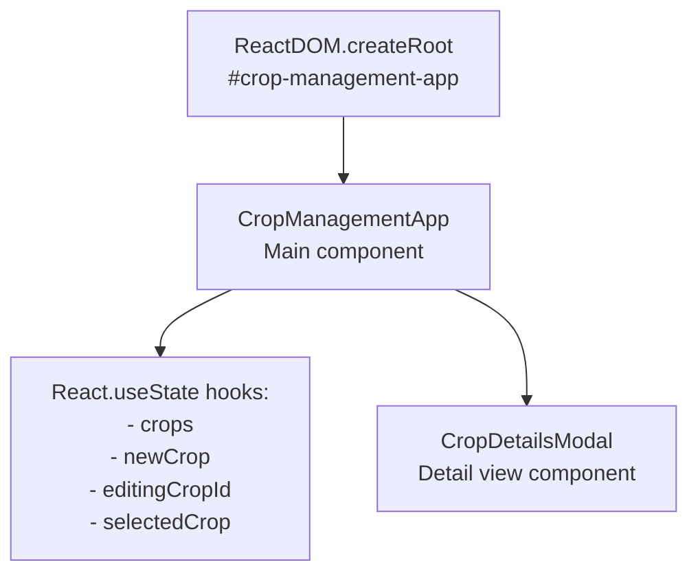
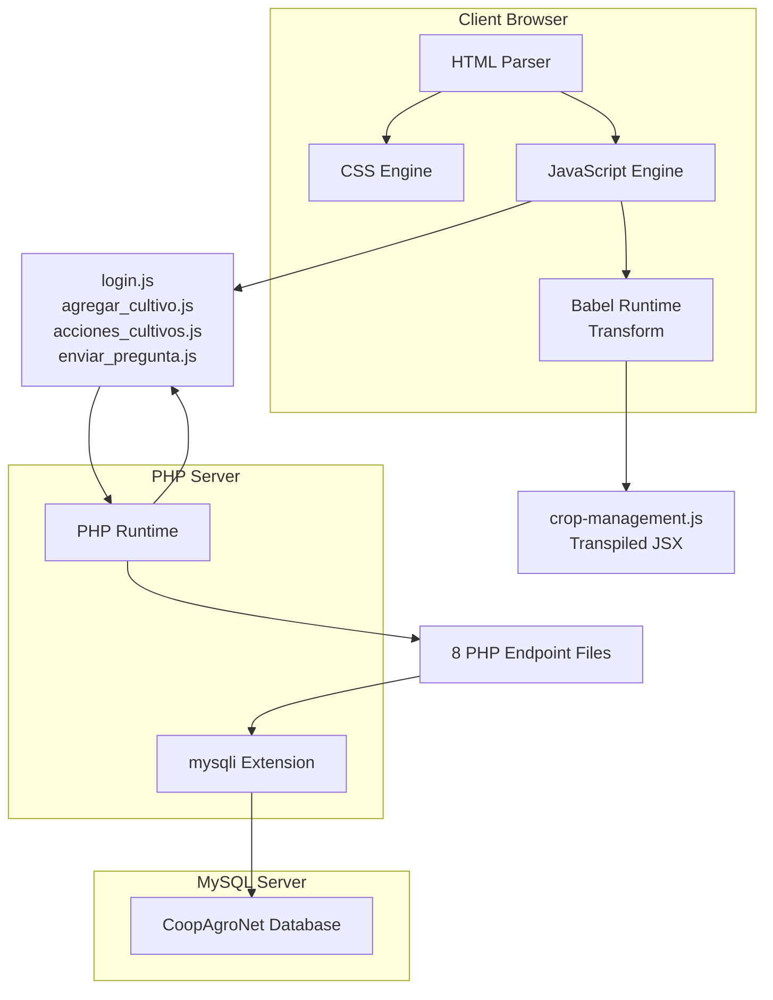

# Technology Stack

> **Relevant source files**
> * [backennd/db_interaction/connection.php](https://github.com/axchisan/CoopAgronet/blob/e8818744/backennd/db_interaction/connection.php)
> * [front end/crop-management.js](https://github.com/axchisan/CoopAgronet/blob/e8818744/front end/crop-management.js)
> * [front end/index.html](https://github.com/axchisan/CoopAgronet/blob/e8818744/front end/index.html)

## Purpose and Scope

This document catalogs the complete technology stack used in CoopAgroNet, including backend languages, database systems, frontend frameworks, external libraries, and development dependencies. It describes the specific versions, configuration patterns, and integration methods for each technology.

For architectural patterns and system design, see [System Architecture](/axchisan/CoopAgronet/1.1-system-architecture). For database table structures and relationships, see [Database Schema](/axchisan/CoopAgronet/1.3-database-schema).

---

## Technology Overview

CoopAgroNet uses a traditional LAMP-like stack without modern build tools or framework abstractions. The system operates as a hybrid application combining procedural PHP endpoints with a mixed JavaScript frontend.

| Layer | Technologies | Purpose |
| --- | --- | --- |
| **Backend** | PHP (procedural), mysqli | Server-side logic and database interaction |
| **Database** | MySQL 5.x+ | Data persistence |
| **Frontend Core** | HTML5, CSS3, Vanilla JavaScript | Base presentation layer |
| **Frontend Enhanced** | React 18, Babel Standalone | Modern component-based UI |
| **External Assets** | Font Awesome 6.0, Boxicons 2.1.4 | Icon libraries |
| **Development** | None (no build pipeline) | Direct file serving |

**Sources:** [front L1-L331](https://github.com/axchisan/CoopAgronet/blob/e8818744/front end/index.html#L1-L331)

 [backennd/db_interaction/connection.php L1-L15](https://github.com/axchisan/CoopAgronet/blob/e8818744/backennd/db_interaction/connection.php#L1-L15)

---

## Backend Technologies

### PHP Runtime

The backend uses **procedural PHP** without any framework (no Laravel, Symfony, or similar). All endpoints are individual PHP files that execute top-to-bottom when requested.

**Configuration:**

* Error reporting enabled: `error_reporting(E_ALL)` and `ini_set('display_errors', 1)` in connection layer
* Session management: Native PHP sessions via `session_start()`
* Password hashing: Built-in `password_hash()` and `password_verify()` functions

**Key PHP Files:**

```sql
backennd/db_interaction/
├── connection.php          # Database connection factory
├── login.php              # Authentication endpoint
├── create_acount.php      # Registration endpoint
├── agregar_cultivo.php    # Create crop endpoint
├── obtener_cultivos.php   # Read all crops endpoint
├── obtener_cultivo.php    # Read single crop endpoint
├── editar_cultivo.php     # Update crop endpoint
├── eliminar_cultivo.php   # Delete crop endpoint
└── enviar_pregunta.php    # Support question endpoint
```

**Sources:** [backennd/db_interaction/connection.php L2-L3](https://github.com/axchisan/CoopAgronet/blob/e8818744/backennd/db_interaction/connection.php#L2-L3)

### MySQL Database

**Database Configuration:**

* **Host:** `localhost:3306`
* **User:** `root`
* **Password:** Empty string (development default)
* **Database Name:** `CoopAgroNet`

The database connection is established via the mysqli extension in [backennd/db_interaction/connection.php L5-L10](https://github.com/axchisan/CoopAgronet/blob/e8818744/backennd/db_interaction/connection.php#L5-L10)

**Connection Pattern:**

```

```

All backend endpoints include `connection.php` to obtain the `$connection` object, which is then used for direct SQL queries.

**Sources:** [backennd/db_interaction/connection.php L5-L14](https://github.com/axchisan/CoopAgronet/blob/e8818744/backennd/db_interaction/connection.php#L5-L14)

### mysqli Extension

The system uses **mysqli procedural API** (not object-oriented) for all database operations. Key functions employed:

| Function | Usage | Example Files |
| --- | --- | --- |
| `mysqli_connect()` | Establish database connection | connection.php |
| `mysqli_query()` | Execute SQL statements | All CRUD endpoints |
| `mysqli_fetch_assoc()` | Fetch result rows | login.php, obtener_cultivos.php |
| `mysqli_real_escape_string()` | String escaping (inconsistently used) | Some endpoints |
| `mysqli_connect_error()` | Connection error messages | connection.php:13 |

**Security Note:** Most endpoints use string interpolation instead of prepared statements, creating SQL injection vulnerabilities (see [Security Considerations](/axchisan/CoopAgronet/4-security-considerations)).

**Sources:** [backennd/db_interaction/connection.php L10-L14](https://github.com/axchisan/CoopAgronet/blob/e8818744/backennd/db_interaction/connection.php#L10-L14)

---

## Frontend Technologies

### Technology Stack Diagram

```

```

**Sources:** [front L1-L331](https://github.com/axchisan/CoopAgronet/blob/e8818744/front end/index.html#L1-L331)

### HTML5 and CSS3

**HTML Structure:**

* Single-page application shell: [front L1-L331](https://github.com/axchisan/CoopAgronet/blob/e8818744/front end/index.html#L1-L331)
* Semantic HTML5 elements: `<header>`, `<nav>`, `<main>`, `<section>`, `<footer>`
* Seven main sections with ID-based navigation: * `#inicio` - Landing/welcome * `#gestion-cultivos` - Crop management interface * `#comunidad` - Community feed * `#suscripciones` - Subscription plans * `#login` - Authentication forms * `#admin` - Admin panel * `#soporte` - Support contact form

**CSS Approach:**

* Single stylesheet: `style.css` (referenced at [front L7](https://github.com/axchisan/CoopAgronet/blob/e8818744/front end/index.html#L7-L7) )
* No CSS preprocessors (SASS/LESS)
* No CSS frameworks (Bootstrap, Tailwind, etc.)

**Form Elements:**

* `#cropForm` - Crop data entry [front L74-L86](https://github.com/axchisan/CoopAgronet/blob/e8818744/front end/index.html#L74-L86)
* `#login-form` - User authentication [front L182-L205](https://github.com/axchisan/CoopAgronet/blob/e8818744/front end/index.html#L182-L205)
* `#register-form` - Account creation [front L214-L244](https://github.com/axchisan/CoopAgronet/blob/e8818744/front end/index.html#L214-L244)
* `#support-form` - Support questions [front L275-L280](https://github.com/axchisan/CoopAgronet/blob/e8818744/front end/index.html#L275-L280)

**Sources:** [front L1-L17](https://github.com/axchisan/CoopAgronet/blob/e8818744/front end/index.html#L1-L17)

 [front L46-L286](https://github.com/axchisan/CoopAgronet/blob/e8818744/front end/index.html#L46-L286)

### Vanilla JavaScript

Four separate JavaScript files handle different application concerns. Each file is loaded directly as a `<script>` tag without module bundling.

| File | Primary Responsibility | DOM Targets |
| --- | --- | --- |
| `login.js` | Authentication state management | `#login-form`, `#user-profile`, `#message` |
| `agregar_cultivo.js` | Crop creation and table population | `#cropForm`, `#cropTableBody` |
| `acciones_cultivos.js` | Crop editing and deletion | `#cropTableBody` (button listeners) |
| `enviar_pregunta.js` | Support form submission | `#support-form`, `#mensaje-form` |

**Common Patterns:**

* `fetch()` API for AJAX requests to PHP endpoints
* `FormData` objects for POST request payloads
* `addEventListener()` for event handling
* Direct DOM manipulation via `document.getElementById()`, `querySelector()`
* JSON response parsing from backend

**Script Loading Order:**

```

```

[front L292-L295](https://github.com/axchisan/CoopAgronet/blob/e8818744/front end/index.html#L292-L295)

**Sources:** [front L292-L295](https://github.com/axchisan/CoopAgronet/blob/e8818744/front end/index.html#L292-L295)

### React 18

React is loaded via CDN and used exclusively for an alternative crop management UI component in `crop-management.js`.

**CDN Resources:**

```

```

[front L297-L298](https://github.com/axchisan/CoopAgronet/blob/e8818744/front end/index.html#L297-L298)

**React Components:**



**Component Definitions:**

* `CropManagementApp()` - Main component with CRUD logic [front L1-L74](https://github.com/axchisan/CoopAgronet/blob/e8818744/front end/crop-management.js#L1-L74)
* `CropDetailsModal()` - Modal dialog for crop details [front L76-L93](https://github.com/axchisan/CoopAgronet/blob/e8818744/front end/crop-management.js#L76-L93)

**State Management:**

* Uses `React.useState` hooks for local state [front L2-L13](https://github.com/axchisan/CoopAgronet/blob/e8818744/front end/crop-management.js#L2-L13)
* No global state management (no Redux, Context API usage)
* State includes: `crops` array, `newCrop` form object, `editingCropId`, `selectedCrop`

**Important Note:** The React component appears to be a **prototype alternative UI** that does not integrate with the backend PHP endpoints. It uses in-memory state only (crops stored in React state with `Date.now()` IDs). The actual production functionality uses the vanilla JavaScript modules.

**Sources:** [front L297-L300](https://github.com/axchisan/CoopAgronet/blob/e8818744/front end/index.html#L297-L300)

 [front L1-L165](https://github.com/axchisan/CoopAgronet/blob/e8818744/front end/crop-management.js#L1-L165)

### Babel Standalone

Since React's JSX syntax cannot run natively in browsers, the system uses **Babel Standalone** for runtime JSX transformation.

**Configuration:**

```

```

[front L299-L300](https://github.com/axchisan/CoopAgronet/blob/e8818744/front end/index.html#L299-L300)

**Key Points:**

* **Runtime transformation:** JSX is transpiled in the browser at page load, not during build time
* **Performance impact:** This approach adds client-side processing overhead
* **Script type:** The `type="text/babel"` attribute triggers Babel processing for `crop-management.js`
* **No build pipeline:** This eliminates need for webpack/vite but is inefficient for production

The React component uses `React.createElement()` calls directly in the modal component [front L78-L92](https://github.com/axchisan/CoopAgronet/blob/e8818744/front end/crop-management.js#L78-L92)

 suggesting a mix of JSX (for the main component) and createElement API.

**Sources:** [front L299-L300](https://github.com/axchisan/CoopAgronet/blob/e8818744/front end/index.html#L299-L300)

 [front L78-L92](https://github.com/axchisan/CoopAgronet/blob/e8818744/front end/crop-management.js#L78-L92)

---

## External Dependencies

### Icon Libraries

Two separate icon libraries are loaded via CDN:

**Font Awesome 6.0.0:**

```

```

[front L8-L10](https://github.com/axchisan/CoopAgronet/blob/e8818744/front end/index.html#L8-L10)

**Usage:** Icons throughout the UI via `<i class="fas fa-*">` tags for navigation, buttons, and section headers.

**Boxicons 2.1.4:**

```

```

[front L11](https://github.com/axchisan/CoopAgronet/blob/e8818744/front end/index.html#L11-L11)

**Usage:** Supplementary icons, though specific usage is less prominent than Font Awesome.

**Sources:** [front L8-L11](https://github.com/axchisan/CoopAgronet/blob/e8818744/front end/index.html#L8-L11)

### Additional External Resources

**Unsplash API:**

* Used in React component for dynamic crop images: `https://source.unsplash.com/400x200/?${crop.type}` [front L82](https://github.com/axchisan/CoopAgronet/blob/e8818744/front end/crop-management.js#L82-L82)
* Banner image from Unsplash CDN [front L34-L36](https://github.com/axchisan/CoopAgronet/blob/e8818744/front end/index.html#L34-L36)

**Sources:** [front L34-L36](https://github.com/axchisan/CoopAgronet/blob/e8818744/front end/index.html#L34-L36)

 [front L82](https://github.com/axchisan/CoopAgronet/blob/e8818744/front end/crop-management.js#L82-L82)

---

## Technology Integration Map



**Sources:** [front L1-L331](https://github.com/axchisan/CoopAgronet/blob/e8818744/front end/index.html#L1-L331)

 [backennd/db_interaction/connection.php L1-L15](https://github.com/axchisan/CoopAgronet/blob/e8818744/backennd/db_interaction/connection.php#L1-L15)

---

## Development Environment Requirements

| Requirement | Specification | Notes |
| --- | --- | --- |
| **Web Server** | Apache 2.4+ or Nginx | Must support PHP execution |
| **PHP Version** | PHP 7.0+ (likely 7.4+) | Uses `password_hash()`, type declarations |
| **PHP Extensions** | `mysqli`, `session` | Core functionality dependencies |
| **MySQL Version** | MySQL 5.7+ or MariaDB 10.2+ | Standard SQL features required |
| **Browser** | Modern browsers (Chrome 90+, Firefox 88+, Safari 14+) | Requires ES6+, Fetch API, React 18 support |
| **Build Tools** | None | No npm, webpack, composer, or package managers used |

**Notable Absence:** No `package.json`, `composer.json`, `webpack.config.js`, or any build configuration files exist in the codebase.

**Sources:** [backennd/db_interaction/connection.php L1-L15](https://github.com/axchisan/CoopAgronet/blob/e8818744/backennd/db_interaction/connection.php#L1-L15)

 [front L297-L300](https://github.com/axchisan/CoopAgronet/blob/e8818744/front end/index.html#L297-L300)

---

## Technology Decision Analysis

### Architectural Choices

**Procedural PHP (No Framework):**

* ✅ Simple deployment: Copy files to web server
* ✅ Low learning curve for basic PHP developers
* ❌ No routing abstraction or middleware support
* ❌ Code duplication across endpoints (connection handling, error responses)
* ❌ Difficult to maintain as complexity grows

**Dual Frontend Approach (Vanilla JS + React):**

* ✅ Flexibility to test modern UI patterns (React) while maintaining working vanilla code
* ✅ No lock-in to specific framework
* ❌ Inconsistent patterns confuse maintenance
* ❌ Babel Standalone adds performance overhead
* ❌ React component is disconnected from backend, suggesting incomplete migration

**CDN Dependencies:**

* ✅ Zero build pipeline complexity
* ✅ Instant setup for new developers
* ❌ Network dependency prevents offline development
* ❌ Version control issues (external sources can change)
* ❌ Performance impact from multiple external requests

**mysqli Procedural API:**

* ✅ Available in all PHP installations
* ❌ Verbose compared to PDO or ORMs
* ❌ Encourages unsafe query patterns (string interpolation)
* ❌ No abstraction for different database engines

**Sources:** [backennd/db_interaction/connection.php L1-L15](https://github.com/axchisan/CoopAgronet/blob/e8818744/backennd/db_interaction/connection.php#L1-L15)

 [front L297-L300](https://github.com/axchisan/CoopAgronet/blob/e8818744/front end/index.html#L297-L300)

 [front L1-L165](https://github.com/axchisan/CoopAgronet/blob/e8818744/front end/crop-management.js#L1-L165)

---

## Version Summary Table

| Technology | Version | Source | Installation Method |
| --- | --- | --- | --- |
| PHP | 7.0+ (unspecified) | Server runtime | System package manager |
| MySQL | 5.7+ (unspecified) | Database server | System package manager |
| mysqli | Bundled with PHP | PHP extension | Enabled in php.ini |
| HTML | HTML5 | Browser standard | N/A |
| CSS | CSS3 | Browser standard | N/A |
| JavaScript | ES6+ | Browser standard | N/A |
| React | 18 (development build) | unpkg.com CDN | `<script>` tag |
| ReactDOM | 18 (development build) | unpkg.com CDN | `<script>` tag |
| Babel Standalone | Latest (via CDN) | unpkg.com CDN | `<script>` tag |
| Font Awesome | 6.0.0 | cdnjs.cloudflare.com | `<link>` tag |
| Boxicons | 2.1.4 | unpkg.com | `<link>` tag |

**Sources:** [front L8-L11](https://github.com/axchisan/CoopAgronet/blob/e8818744/front end/index.html#L8-L11)

 [front L297-L300](https://github.com/axchisan/CoopAgronet/blob/e8818744/front end/index.html#L297-L300)

 [backennd/db_interaction/connection.php L1-L15](https://github.com/axchisan/CoopAgronet/blob/e8818744/backennd/db_interaction/connection.php#L1-L15)