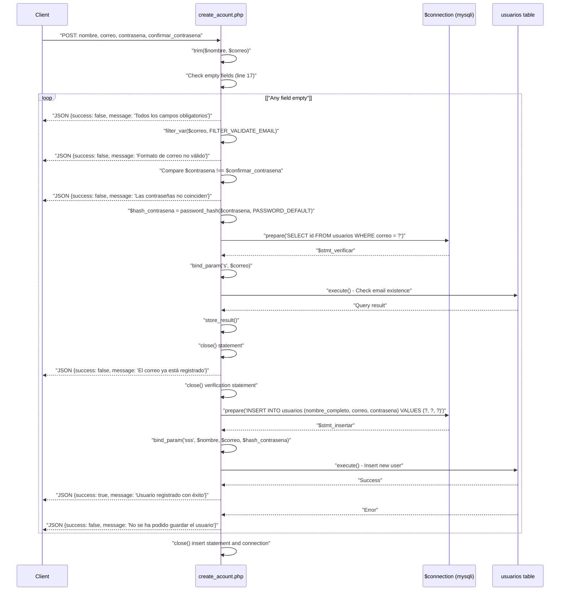
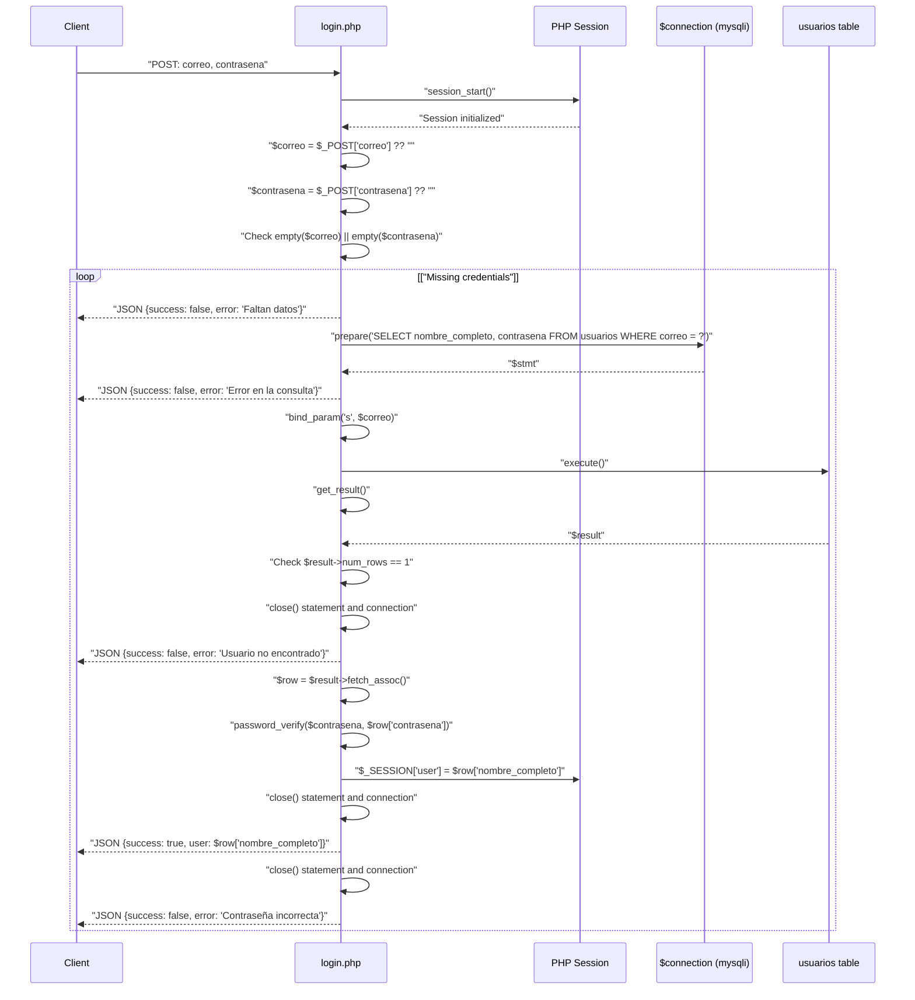

# User Authentication System

> **Relevant source files**
> * [backennd/db_interaction/connection.php](https://github.com/axchisan/CoopAgronet/blob/e8818744/backennd/db_interaction/connection.php)
> * [backennd/db_interaction/create_acount.php](https://github.com/axchisan/CoopAgronet/blob/e8818744/backennd/db_interaction/create_acount.php)
> * [backennd/db_interaction/login.php](https://github.com/axchisan/CoopAgronet/blob/e8818744/backennd/db_interaction/login.php)

## Purpose and Scope

This document describes the user authentication system in CoopAgroNet, which manages user registration and login operations. The system consists of two PHP endpoints that handle credential verification, password security, and session management. This system provides the foundation for user identity across the application.

For detailed documentation of individual endpoints, see:

* Login endpoint: [Login Endpoint](/axchisan/CoopAgronet/2.2.1-login-endpoint)
* Registration endpoint: [Registration Endpoint](/axchisan/CoopAgronet/2.2.2-registration-endpoint)

For information about how authentication integrates with other features, see [Support Question System](/axchisan/CoopAgronet/2.4-support-question-system) which requires authenticated users to submit questions.

---

## System Architecture Overview

The authentication system follows a stateless HTTP request-response pattern with server-side session persistence. Both registration and login endpoints share the same database connection infrastructure and return JSON-formatted responses.

### Authentication System Component Map

```

```

**Sources:** [backennd/db_interaction/login.php L1-L44](https://github.com/axchisan/CoopAgronet/blob/e8818744/backennd/db_interaction/login.php#L1-L44)

 [backennd/db_interaction/create_acount.php L1-L71](https://github.com/axchisan/CoopAgronet/blob/e8818744/backennd/db_interaction/create_acount.php#L1-L71)

 [backennd/db_interaction/connection.php L1-L14](https://github.com/axchisan/CoopAgronet/blob/e8818744/backennd/db_interaction/connection.php#L1-L14)

---

## Database Connection Infrastructure

Both authentication endpoints depend on `connection.php` for database connectivity. This file establishes a mysqli connection to the `CoopAgroNet` database.

| Configuration Parameter | Value |
| --- | --- |
| Host | `localhost:3306` |
| User | `root` |
| Password | (empty string) |
| Database | `CoopAgroNet` |
| Connection Variable | `$connection` |

The connection script includes error reporting configuration and returns a JSON error response if the connection fails [backennd/db_interaction/connection.php L12-L14](https://github.com/axchisan/CoopAgronet/blob/e8818744/backennd/db_interaction/connection.php#L12-L14)

**Sources:** [backennd/db_interaction/connection.php L1-L14](https://github.com/axchisan/CoopAgronet/blob/e8818744/backennd/db_interaction/connection.php#L1-L14)

---

## Registration Flow

The registration endpoint at `create_acount.php` handles new user account creation with comprehensive input validation and security measures.

### Registration Request Processing Sequence



### Registration Validation Rules

| Validation Stage | Check | Error Message |
| --- | --- | --- |
| Empty Fields | `empty($nombre) \|\| empty($correo) \|\| empty($contrasena) \|\| empty($confirmar_contrasena)` | ⚠ Todos los campos son obligatorios |
| Email Format | `!filter_var($correo, FILTER_VALIDATE_EMAIL)` | ⚠ Formato de correo no válido |
| Password Match | `$contrasena !== $confirmar_contrasena` | ⚠ Las contraseñas no coinciden |
| Email Uniqueness | `$stmt_verificar->num_rows > 0` | ⚠ El correo ya está registrado |
| Database Insert | `!$stmt_insertar->execute()` | ⚠ No se ha podido guardar el usuario |

The endpoint uses prepared statements with `bind_param("s", $correo)` for the uniqueness check and `bind_param("sss", $nombre, $correo, $hash_contrasena)` for the insertion, preventing SQL injection attacks [backennd/db_interaction/create_acount.php L41-L57](https://github.com/axchisan/CoopAgronet/blob/e8818744/backennd/db_interaction/create_acount.php#L41-L57)

**Sources:** [backennd/db_interaction/create_acount.php L1-L71](https://github.com/axchisan/CoopAgronet/blob/e8818744/backennd/db_interaction/create_acount.php#L1-L71)

---

## Login Flow

The login endpoint at `login.php` handles credential verification and session initialization.

### Login Request Processing Sequence



### Login Response Scenarios

| Scenario | Condition | Response JSON |
| --- | --- | --- |
| Success | Credentials valid | `{"success": true, "user": "User Name"}` |
| Missing Data | Empty correo or contrasena | `{"success": false, "error": "Faltan datos"}` |
| User Not Found | `$result->num_rows != 1` | `{"success": false, "error": "Usuario no encontrado"}` |
| Wrong Password | `!password_verify(...)` | `{"success": false, "error": "Contraseña incorrecta"}` |
| Query Error | Statement preparation fails | `{"success": false, "error": "Error en la consulta"}` |

**Sources:** [backennd/db_interaction/login.php L1-L44](https://github.com/axchisan/CoopAgronet/blob/e8818744/backennd/db_interaction/login.php#L1-L44)

---

## Session Management

The login endpoint initializes PHP sessions to maintain user authentication state across requests.

### Session Lifecycle

1. **Initialization**: `session_start()` called at [backennd/db_interaction/login.php L2](https://github.com/axchisan/CoopAgronet/blob/e8818744/backennd/db_interaction/login.php#L2-L2)  before any HTTP headers are sent
2. **User Storage**: On successful login, `$_SESSION["user"]` stores the `nombre_completo` field from the database [backennd/db_interaction/login.php L29](https://github.com/axchisan/CoopAgronet/blob/e8818744/backennd/db_interaction/login.php#L29-L29)
3. **Session Persistence**: The session cookie maintains user state across subsequent page requests
4. **Session Data**: Only the user's full name is stored in the session; no sensitive data like passwords or email addresses

The session variable `$_SESSION["user"]` is referenced by other parts of the system to verify authentication state and personalize the user experience.

**Sources:** [backennd/db_interaction/login.php L2](https://github.com/axchisan/CoopAgronet/blob/e8818744/backennd/db_interaction/login.php#L2-L2)

 [backennd/db_interaction/login.php L29](https://github.com/axchisan/CoopAgronet/blob/e8818744/backennd/db_interaction/login.php#L29-L29)

---

## Password Security Implementation

Both endpoints implement industry-standard password security practices.

### Password Hashing

The registration endpoint uses PHP's `password_hash()` function with `PASSWORD_DEFAULT` algorithm:

```

```

At [backennd/db_interaction/create_acount.php L38](https://github.com/axchisan/CoopAgronet/blob/e8818744/backennd/db_interaction/create_acount.php#L38-L38)

 this generates a bcrypt hash (or argon2 depending on PHP version) with automatic salt generation. The resulting hash is stored in the `usuarios.contrasena` column.

### Password Verification

The login endpoint uses `password_verify()` for constant-time comparison:

```

```

This function at [backennd/db_interaction/login.php L28](https://github.com/axchisan/CoopAgronet/blob/e8818744/backennd/db_interaction/login.php#L28-L28)

 securely compares the plain-text input against the stored hash without exposing timing attack vulnerabilities.

### Security Features

| Security Feature | Implementation | Location |
| --- | --- | --- |
| Password Hashing | `password_hash($contrasena, PASSWORD_DEFAULT)` | create_acount.php:38 |
| Hash Verification | `password_verify($contrasena, $row["contrasena"])` | login.php:28 |
| SQL Injection Prevention | Prepared statements with `bind_param()` | Both endpoints |
| Email Validation | `filter_var($correo, FILTER_VALIDATE_EMAIL)` | create_acount.php:24 |
| Input Sanitization | `trim()` on text inputs | create_acount.php:12-13 |

**Sources:** [backennd/db_interaction/create_acount.php L38](https://github.com/axchisan/CoopAgronet/blob/e8818744/backennd/db_interaction/create_acount.php#L38-L38)

 [backennd/db_interaction/login.php L28](https://github.com/axchisan/CoopAgronet/blob/e8818744/backennd/db_interaction/login.php#L28-L28)

---

## Database Schema Interaction

Both endpoints interact with the `usuarios` table in the `CoopAgroNet` database.

### Table Structure

```css
#mermaid-ks4bugdp6i{font-family:ui-sans-serif,-apple-system,system-ui,Segoe UI,Helvetica;font-size:16px;fill:#333;}@keyframes edge-animation-frame{from{stroke-dashoffset:0;}}@keyframes dash{to{stroke-dashoffset:0;}}#mermaid-ks4bugdp6i .edge-animation-slow{stroke-dasharray:9,5!important;stroke-dashoffset:900;animation:dash 50s linear infinite;stroke-linecap:round;}#mermaid-ks4bugdp6i .edge-animation-fast{stroke-dasharray:9,5!important;stroke-dashoffset:900;animation:dash 20s linear infinite;stroke-linecap:round;}#mermaid-ks4bugdp6i .error-icon{fill:#dddddd;}#mermaid-ks4bugdp6i .error-text{fill:#222222;stroke:#222222;}#mermaid-ks4bugdp6i .edge-thickness-normal{stroke-width:1px;}#mermaid-ks4bugdp6i .edge-thickness-thick{stroke-width:3.5px;}#mermaid-ks4bugdp6i .edge-pattern-solid{stroke-dasharray:0;}#mermaid-ks4bugdp6i .edge-thickness-invisible{stroke-width:0;fill:none;}#mermaid-ks4bugdp6i .edge-pattern-dashed{stroke-dasharray:3;}#mermaid-ks4bugdp6i .edge-pattern-dotted{stroke-dasharray:2;}#mermaid-ks4bugdp6i .marker{fill:#999;stroke:#999;}#mermaid-ks4bugdp6i .marker.cross{stroke:#999;}#mermaid-ks4bugdp6i svg{font-family:ui-sans-serif,-apple-system,system-ui,Segoe UI,Helvetica;font-size:16px;}#mermaid-ks4bugdp6i p{margin:0;}#mermaid-ks4bugdp6i .entityBox{fill:#ffffff;stroke:#dddddd;}#mermaid-ks4bugdp6i .relationshipLabelBox{fill:#dddddd;opacity:0.7;background-color:#dddddd;}#mermaid-ks4bugdp6i .relationshipLabelBox rect{opacity:0.5;}#mermaid-ks4bugdp6i .labelBkg{background-color:rgba(221, 221, 221, 0.5);}#mermaid-ks4bugdp6i .edgeLabel .label{fill:#dddddd;font-size:14px;}#mermaid-ks4bugdp6i .label{font-family:ui-sans-serif,-apple-system,system-ui,Segoe UI,Helvetica;color:#333;}#mermaid-ks4bugdp6i .edge-pattern-dashed{stroke-dasharray:8,8;}#mermaid-ks4bugdp6i .node rect,#mermaid-ks4bugdp6i .node circle,#mermaid-ks4bugdp6i .node ellipse,#mermaid-ks4bugdp6i .node polygon{fill:#ffffff;stroke:#dddddd;stroke-width:1px;}#mermaid-ks4bugdp6i .relationshipLine{stroke:#999;stroke-width:1;fill:none;}#mermaid-ks4bugdp6i .marker{fill:none!important;stroke:#999!important;stroke-width:1;}#mermaid-ks4bugdp6i :root{--mermaid-font-family:"trebuchet ms",verdana,arial,sans-serif;}usuariosINTidPKAUTO_INCREMENTVARCHARnombre_completoUser full nameVARCHARcorreoUKEmail address (unique)VARCHARcontrasenaBcrypt/Argon2 hash
```

### Query Patterns

**Registration Queries:**

1. Email existence check: `SELECT id FROM usuarios WHERE correo = ?` [backennd/db_interaction/create_acount.php L40](https://github.com/axchisan/CoopAgronet/blob/e8818744/backennd/db_interaction/create_acount.php#L40-L40)
2. User insertion: `INSERT INTO usuarios (nombre_completo, correo, contrasena) VALUES (?, ?, ?)` [backennd/db_interaction/create_acount.php L55](https://github.com/axchisan/CoopAgronet/blob/e8818744/backennd/db_interaction/create_acount.php#L55-L55)

**Login Query:**

1. Credential retrieval: `SELECT nombre_completo, contrasena FROM usuarios WHERE correo = ?` [backennd/db_interaction/login.php L21](https://github.com/axchisan/CoopAgronet/blob/e8818744/backennd/db_interaction/login.php#L21-L21)

### Field Mapping

| HTTP POST Parameter | Database Column | Processing |
| --- | --- | --- |
| `nombre` | `nombre_completo` | Trimmed, stored as-is |
| `correo` | `correo` | Trimmed, validated with FILTER_VALIDATE_EMAIL |
| `contrasena` | `contrasena` | Hashed with password_hash() |
| `confirmar_contrasena` | (not stored) | Used only for client-side validation |

**Sources:** [backennd/db_interaction/create_acount.php L40-L55](https://github.com/axchisan/CoopAgronet/blob/e8818744/backennd/db_interaction/create_acount.php#L40-L55)

 [backennd/db_interaction/login.php L21](https://github.com/axchisan/CoopAgronet/blob/e8818744/backennd/db_interaction/login.php#L21-L21)

---

## HTTP Request/Response Contract

Both endpoints follow consistent patterns for request handling and response formatting.

### Request Requirements

| Endpoint | HTTP Method | Required POST Parameters | Optional Parameters |
| --- | --- | --- | --- |
| `login.php` | POST | `correo`, `contrasena` | None |
| `create_acount.php` | POST | `nombre`, `correo`, `contrasena`, `confirmar_contrasena` | None |

### Response Format

Both endpoints set `Content-Type: application/json` header and return JSON objects with a consistent structure:

**Success Response:**

```

```

**Error Response:**

```

```

Note: The login endpoint uses `"error"` while registration uses `"message"` for error descriptions, representing an inconsistency in the API design [backennd/db_interaction/login.php L16](https://github.com/axchisan/CoopAgronet/blob/e8818744/backennd/db_interaction/login.php#L16-L16)

 vs [backennd/db_interaction/create_acount.php L19](https://github.com/axchisan/CoopAgronet/blob/e8818744/backennd/db_interaction/create_acount.php#L19-L19)

**Sources:** [backennd/db_interaction/login.php L7](https://github.com/axchisan/CoopAgronet/blob/e8818744/backennd/db_interaction/login.php#L7-L7)

 [backennd/db_interaction/create_acount.php L7](https://github.com/axchisan/CoopAgronet/blob/e8818744/backennd/db_interaction/create_acount.php#L7-L7)

---

## Error Handling

Both endpoints implement defensive error handling with specific error messages for different failure scenarios.

### Error Categories

**create_acount.php errors:**

* Input validation errors (empty fields, invalid email, mismatched passwords)
* Business logic errors (duplicate email)
* Database errors (insertion failure)

**login.php errors:**

* Input validation errors (missing credentials)
* Authentication errors (user not found, incorrect password)
* System errors (query preparation failure)

All database statements are properly closed with `$stmt->close()` and `$connection->close()` in both success and error paths, preventing resource leaks [backennd/db_interaction/create_acount.php L50-L70](https://github.com/axchisan/CoopAgronet/blob/e8818744/backennd/db_interaction/create_acount.php#L50-L70)

 [backennd/db_interaction/login.php L38-L43](https://github.com/axchisan/CoopAgronet/blob/e8818744/backennd/db_interaction/login.php#L38-L43)

**Sources:** [backennd/db_interaction/create_acount.php L17-L65](https://github.com/axchisan/CoopAgronet/blob/e8818744/backennd/db_interaction/create_acount.php#L17-L65)

 [backennd/db_interaction/login.php L15-L41](https://github.com/axchisan/CoopAgronet/blob/e8818744/backennd/db_interaction/login.php#L15-L41)

---

## Security Considerations

While the authentication system implements several security best practices, there are notable concerns:

### Implemented Security Measures

* ✅ Password hashing with `PASSWORD_DEFAULT` (bcrypt/argon2)
* ✅ Prepared statements prevent SQL injection
* ✅ Email format validation
* ✅ Password verification uses constant-time comparison
* ✅ Input sanitization with `trim()`

### Security Limitations

* ⚠️ Database uses root user with empty password [backennd/db_interaction/connection.php L6-L7](https://github.com/axchisan/CoopAgronet/blob/e8818744/backennd/db_interaction/connection.php#L6-L7)
* ⚠️ No rate limiting on login attempts (brute force vulnerability)
* ⚠️ No password complexity requirements enforced server-side
* ⚠️ Session fixation not prevented (no session regeneration after login)
* ⚠️ No HTTPS enforcement in code (relies on server configuration)
* ⚠️ Error messages distinguish between "user not found" and "wrong password" (username enumeration vulnerability)

For comprehensive security analysis, see [Security Considerations](/axchisan/CoopAgronet/4-security-considerations).

**Sources:** [backennd/db_interaction/connection.php L6-L7](https://github.com/axchisan/CoopAgronet/blob/e8818744/backennd/db_interaction/connection.php#L6-L7)

 [backennd/db_interaction/login.php L32-L35](https://github.com/axchisan/CoopAgronet/blob/e8818744/backennd/db_interaction/login.php#L32-L35)