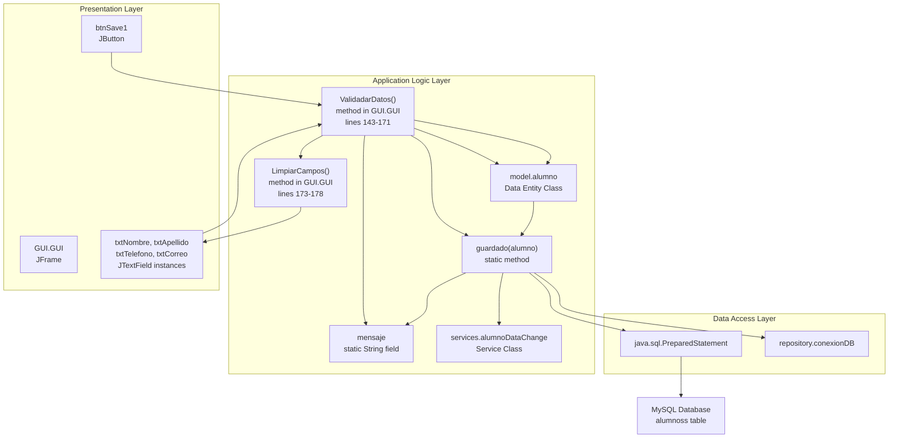
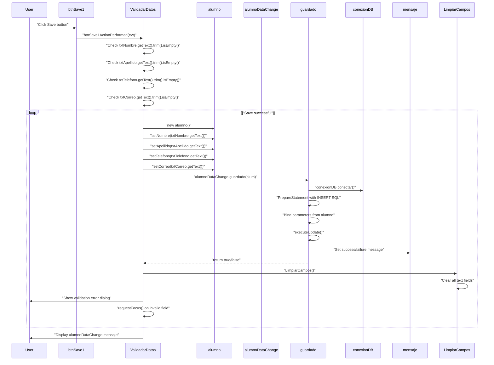
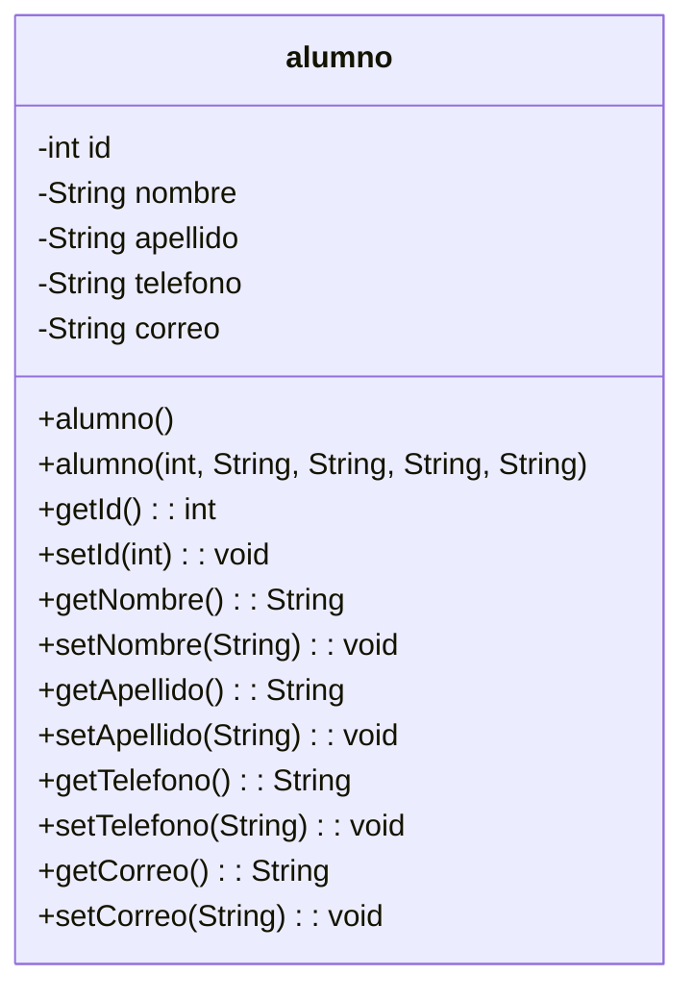
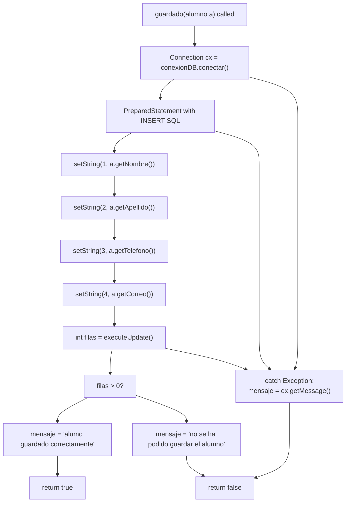
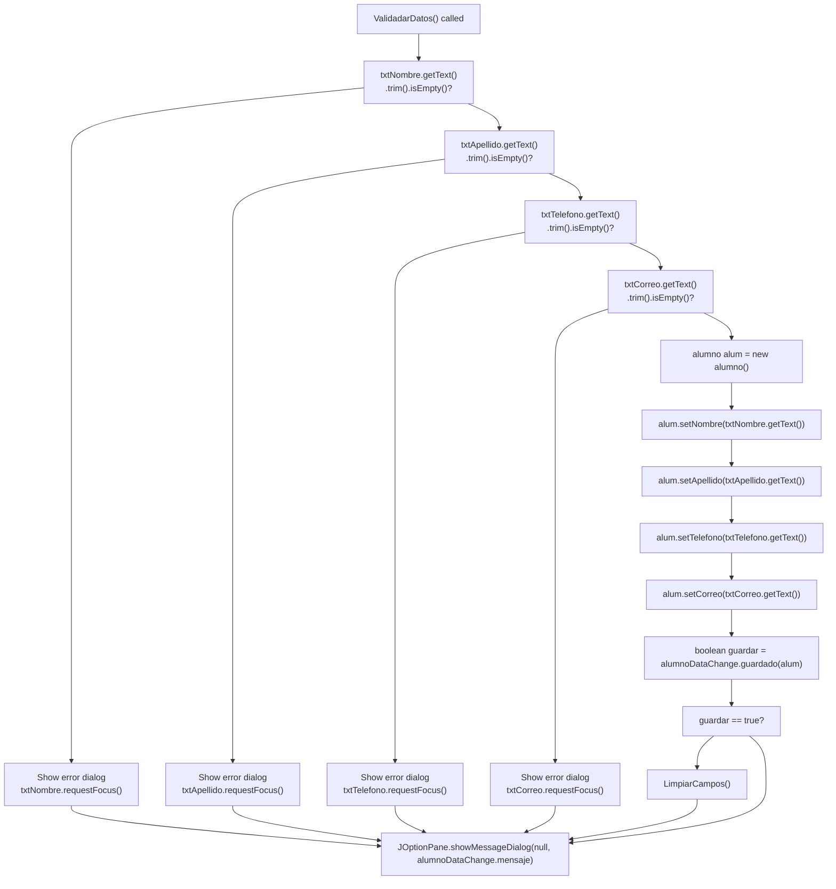
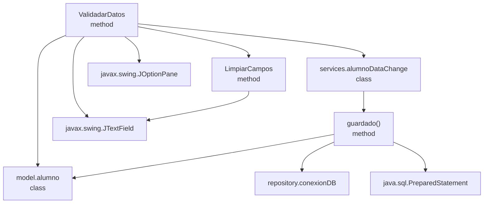

# Application Logic Layer

> **Relevant source files**
> * [build/classes/services/alumnoDataChange.class](https://github.com/axchisan/Crud-MUUUy-simple-en-java-de-hace-a-os/blob/7ec3bd78/build/classes/services/alumnoDataChange.class)
> * [src/GUI/GUI.java](https://github.com/axchisan/Crud-MUUUy-simple-en-java-de-hace-a-os/blob/7ec3bd78/src/GUI/GUI.java)
> * [src/model/alumno.java](https://github.com/axchisan/Crud-MUUUy-simple-en-java-de-hace-a-os/blob/7ec3bd78/src/model/alumno.java)

## Purpose and Scope

This page documents the Application Logic Layer of the crud3 student management system. This layer contains the business logic, data models, validation rules, and service operations that mediate between the User Interface Layer and the Data Access Layer.

The Application Logic Layer consists of four primary components:

* **Data Model**: The `alumno` class that represents student entities
* **Service Layer**: The `alumnoDataChange` class that orchestrates data persistence operations
* **Input Validation**: The `ValidadarDatos` method that ensures data integrity before persistence
* **Field Management**: The `LimpiarCampos` method that handles form field state

For detailed information about the User Interface components that invoke this logic, see [User Interface Layer](/axchisan/Crud-MUUUy-simple-en-java-de-hace-a-os/4-user-interface-layer). For database connectivity and persistence mechanisms, see [Data Access Layer](/axchisan/Crud-MUUUy-simple-en-java-de-hace-a-os/6-data-access-layer).

**Sources**: src/model/alumno.java, src/GUI/GUI.java, build/classes/services/alumnoDataChange.class

---

## Application Logic Components

The application logic is distributed across three Java packages and one GUI helper method set:

| Component | Package/Class | Primary Responsibility |
| --- | --- | --- |
| Data Model | `model.alumno` | Represents student entity with fields and accessors |
| Service Layer | `services.alumnoDataChange` | Handles business logic and persistence coordination |
| Validation Logic | `GUI.GUI.ValidadarDatos()` | Validates user input before processing |
| Field Management | `GUI.GUI.LimpiarCampos()` | Manages form state and field clearing |

**Sources**: src/model/alumno.java, src/GUI/GUI.java:143-178

---

## Component Architecture

The following diagram illustrates how the application logic components interact with each other and with adjacent architectural layers:



**Sources**: src/GUI/GUI.java:143-178, src/model/alumno.java, build/classes/services/alumnoDataChange.class

---

## Data Flow Through Application Logic

This sequence diagram shows the complete flow of data through the application logic layer when saving a student record:



**Sources**: src/GUI/GUI.java:87-93, src/GUI/GUI.java:143-171, src/GUI/GUI.java:173-178, build/classes/services/alumnoDataChange.class

---

## Student Data Model (alumno)

The `alumno` class in [src/model/alumno.java](https://github.com/axchisan/Crud-MUUUy-simple-en-java-de-hace-a-os/blob/7ec3bd78/src/model/alumno.java)

 serves as the primary data entity for representing student information. It is a plain Java object (POJO) with five fields and corresponding accessor methods.

### alumno Class Structure



### Field Definitions

| Field | Type | Description |
| --- | --- | --- |
| `id` | `int` | Primary key identifier (not set by GUI, auto-generated by database) |
| `nombre` | `String` | Student's first name |
| `apellido` | `String` | Student's last name |
| `telefono` | `String` | Student's phone number |
| `correo` | `String` | Student's email address |

The class provides two constructors:

* **Default constructor** [alumno.java L11-L12](https://github.com/axchisan/Crud-MUUUy-simple-en-java-de-hace-a-os/blob/7ec3bd78/alumno.java#L11-L12) : Creates an empty `alumno` instance
* **Parameterized constructor** [alumno.java L14-L20](https://github.com/axchisan/Crud-MUUUy-simple-en-java-de-hace-a-os/blob/7ec3bd78/alumno.java#L14-L20) : Initializes all fields with provided values

All fields have standard getter and setter methods following JavaBean conventions.

For complete details on the `alumno` class implementation, see [Student Model (alumno)](/axchisan/Crud-MUUUy-simple-en-java-de-hace-a-os/5.1-student-model-(alumno)).

**Sources**: src/model/alumno.java:1-63

---

## Service Layer (alumnoDataChange)

The `alumnoDataChange` class in the `services` package provides the business logic for persisting student data. It acts as an intermediary between the presentation layer and the data access layer.

### Key Components

| Component | Type | Purpose |
| --- | --- | --- |
| `guardado(alumno)` | `static boolean` method | Persists an `alumno` object to the database |
| `mensaje` | `static String` field | Stores success/failure message for display to user |

### guardado Method Logic

The `guardado` method performs the following operations:

1. Obtains a database connection via `conexionDB.conectar()`
2. Creates a `PreparedStatement` with SQL: `INSERT INTO alumnoss (nombre, apellido, telefono, correo) VALUES (?, ?, ?, ?)`
3. Binds parameters from the `alumno` object using getter methods
4. Executes the statement with `executeUpdate()`
5. Sets `mensaje` field based on success/failure
6. Returns `true` if successful, `false` otherwise



For detailed documentation of the `alumnoDataChange` service, see [Data Change Service (alumnoDataChange)](/axchisan/Crud-MUUUy-simple-en-java-de-hace-a-os/5.2-data-change-service-(alumnodatachange)).

**Sources**: build/classes/services/alumnoDataChange.class

---

## Input Validation (ValidadarDatos)

The `ValidadarDatos` method in [src/GUI/GUI.java L143-L171](https://github.com/axchisan/Crud-MUUUy-simple-en-java-de-hace-a-os/blob/7ec3bd78/src/GUI/GUI.java#L143-L171)

 implements client-side validation logic to ensure data integrity before attempting database persistence.

### Validation Rules

The method validates each required field in sequence:

| Field | Validation | Error Message | Action on Failure |
| --- | --- | --- | --- |
| `txtNombre` | Not empty after trim | "por favor complete el campo del nombre" | Focus on field |
| `txtApellido` | Not empty after trim | "por favor complete el campo del apellido" | Focus on field |
| `txtTelefono` | Not empty after trim | "por favor complete el campo del telefono" | Focus on field |
| `txtCorreo` | Not empty after trim | "por favor complete el campo del correo" | Focus on field |

### Validation Flow



### Usage

The `ValidadarDatos` method is invoked by the Save button's `ActionListener`:

```java
private void btnSave1ActionPerformed(java.awt.event.ActionEvent evt) {
    ValidadarDatos();
}
```

Location: [src/GUI/GUI.java L87-L89](https://github.com/axchisan/Crud-MUUUy-simple-en-java-de-hace-a-os/blob/7ec3bd78/src/GUI/GUI.java#L87-L89)

For complete validation logic documentation, see [Input Validation (ValidadarDatos)](/axchisan/Crud-MUUUy-simple-en-java-de-hace-a-os/5.3-input-validation-(validadardatos)).

**Sources**: src/GUI/GUI.java:143-171, src/GUI/GUI.java:87-89

---

## Field Management (LimpiarCampos)

The `LimpiarCampos` method in [src/GUI/GUI.java L173-L178](https://github.com/axchisan/Crud-MUUUy-simple-en-java-de-hace-a-os/blob/7ec3bd78/src/GUI/GUI.java#L173-L178)

 provides field clearing functionality to reset the form state.

### Implementation

The method clears all four input text fields by setting their text to empty strings:

```
public void LimpiarCampos() {
    txtNombre.setText("");
    txtApellido.setText("");
    txtTelefono.setText("");
    txtCorreo.setText("");
}
```

### Usage Contexts

The `LimpiarCampos` method is invoked in two scenarios:

| Trigger | Invocation Point | Purpose |
| --- | --- | --- |
| **Clean Button Click** | [GUI.java L91-L93](https://github.com/axchisan/Crud-MUUUy-simple-en-java-de-hace-a-os/blob/7ec3bd78/GUI.java#L91-L93) | User explicitly requests form reset |
| **Successful Save** | [GUI.java L164](https://github.com/axchisan/Crud-MUUUy-simple-en-java-de-hace-a-os/blob/7ec3bd78/GUI.java#L164-L164) | Automatic cleanup after successful persistence |

The Clean button's `ActionListener` directly invokes the method:

```java
private void btnCleanActionPerformed(java.awt.event.ActionEvent evt) {
    LimpiarCampos();
}
```

For detailed field management documentation, see [Field Management (LimpiarCampos)](/axchisan/Crud-MUUUy-simple-en-java-de-hace-a-os/5.4-field-management-(limpiarcampos)).

**Sources**: src/GUI/GUI.java:173-178, src/GUI/GUI.java:91-93, src/GUI/GUI.java:164

---

## Error Handling and User Feedback

The application logic layer implements error handling through exception catching and user feedback via the `mensaje` static field:

### Error Message Sources

| Component | Error Type | Message Storage |
| --- | --- | --- |
| `ValidadarDatos` | Validation failures | Direct `JOptionPane` dialog |
| `alumnoDataChange.guardado` | Database errors | `alumnoDataChange.mensaje` static field |
| `alumnoDataChange.guardado` | Success confirmation | `alumnoDataChange.mensaje` static field |

### Message Display

All messages are displayed to the user via `JOptionPane.showMessageDialog` at [GUI.java L168](https://github.com/axchisan/Crud-MUUUy-simple-en-java-de-hace-a-os/blob/7ec3bd78/GUI.java#L168-L168)

:

```
JOptionPane.showMessageDialog(null, alumnoDataChange.mensaje);
```

This ensures consistent user feedback regardless of whether the operation succeeded or failed.

**Sources**: src/GUI/GUI.java:168, build/classes/services/alumnoDataChange.class

---

## Component Dependencies

The application logic layer has the following dependencies:



**Sources**: src/GUI/GUI.java, src/model/alumno.java, build/classes/services/alumnoDataChange.class

---

## Related Documentation

For detailed information on each component of the Application Logic Layer:

* [Student Model (alumno)](/axchisan/Crud-MUUUy-simple-en-java-de-hace-a-os/5.1-student-model-(alumno)) - Complete documentation of the `alumno` data entity
* [Data Change Service (alumnoDataChange)](/axchisan/Crud-MUUUy-simple-en-java-de-hace-a-os/5.2-data-change-service-(alumnodatachange)) - Detailed service layer implementation
* [Input Validation (ValidadarDatos)](/axchisan/Crud-MUUUy-simple-en-java-de-hace-a-os/5.3-input-validation-(validadardatos)) - Complete validation logic documentation
* [Field Management (LimpiarCampos)](/axchisan/Crud-MUUUy-simple-en-java-de-hace-a-os/5.4-field-management-(limpiarcampos)) - Field clearing functionality details

For information on adjacent architectural layers:

* [User Interface Layer](/axchisan/Crud-MUUUy-simple-en-java-de-hace-a-os/4-user-interface-layer) - GUI components that invoke application logic
* [Data Access Layer](/axchisan/Crud-MUUUy-simple-en-java-de-hace-a-os/6-data-access-layer) - Database connectivity and persistence mechanisms