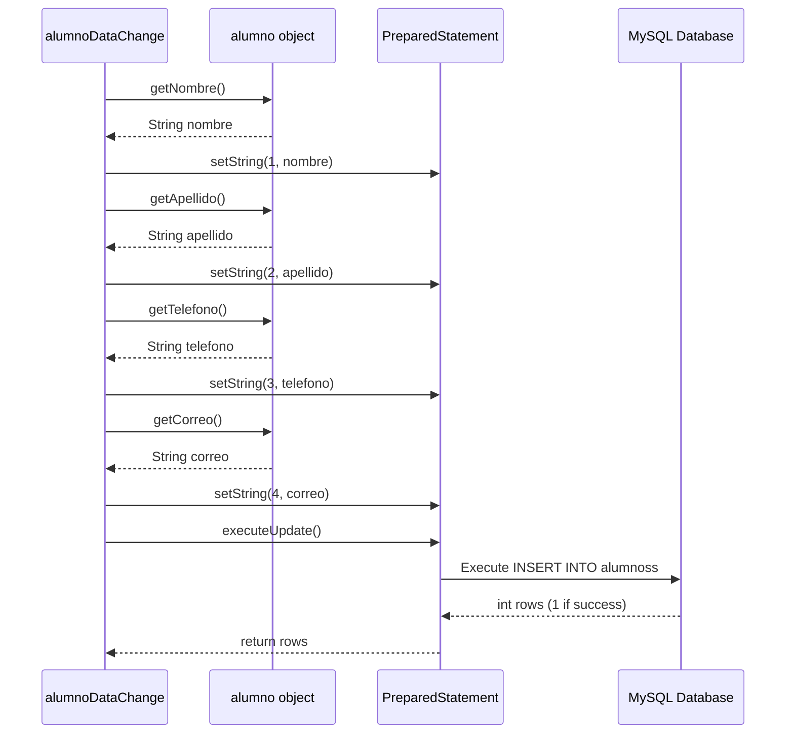
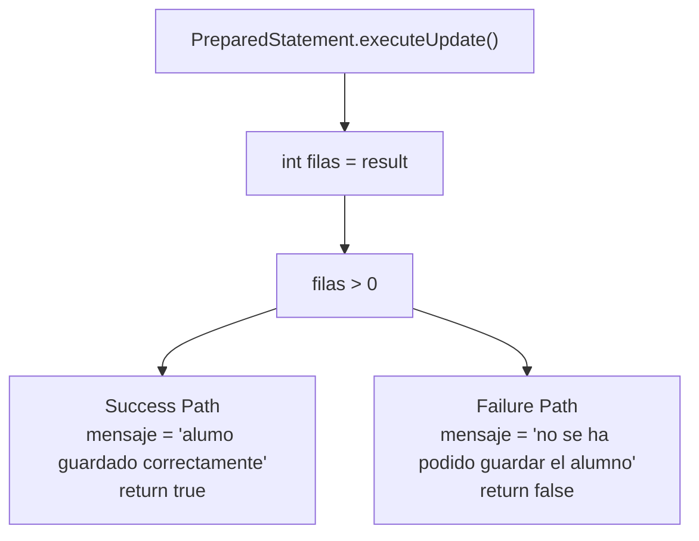
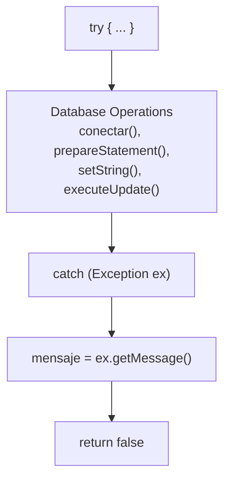
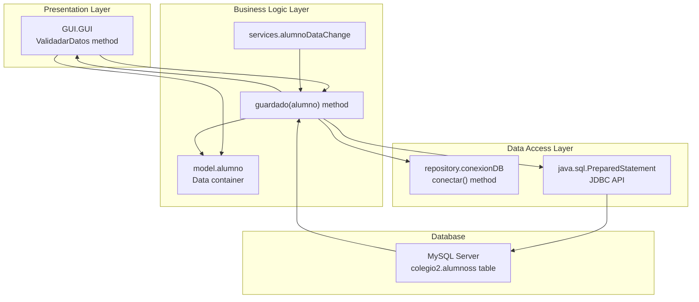

# CRUD Operations

> **Relevant source files**
> * [build/classes/services/alumnoDataChange.class](https://github.com/axchisan/Crud-MUUUy-simple-en-java-de-hace-a-os/blob/7ec3bd78/build/classes/services/alumnoDataChange.class)
> * [src/model/alumno.java](https://github.com/axchisan/Crud-MUUUy-simple-en-java-de-hace-a-os/blob/7ec3bd78/src/model/alumno.java)

## Purpose and Scope

This document details the CRUD (Create, Read, Update, Delete) operations implemented in the crud3 application's Data Access Layer. Specifically, it focuses on the **Create** operation for persisting student records to the database. Currently, the application implements only the **Create** functionality through the `guardado` method in the `alumnoDataChange` service class.

For information about the database connection management used by these operations, see [Database Connection (conexionDB)](/axchisan/Crud-MUUUy-simple-en-java-de-hace-a-os/6.1-database-connection-(conexiondb)). For details about the target database schema, see [Database Schema](/axchisan/Crud-MUUUy-simple-en-java-de-hace-a-os/6.2-database-schema). For the business logic that invokes these operations, see [Data Change Service (alumnoDataChange)](/axchisan/Crud-MUUUy-simple-en-java-de-hace-a-os/5.2-data-change-service-(alumnodatachange)).

---

## Overview

The crud3 application implements database persistence using JDBC `PreparedStatement` objects to execute parameterized SQL queries. The CRUD functionality is centralized in the `services.alumnoDataChange` class, which provides a single public method for inserting student records into the `alumnoss` table.

### Current Implementation Status

| Operation | Status | Method | SQL Operation |
| --- | --- | --- | --- |
| **Create** | ✓ Implemented | `guardado(alumno)` | `INSERT INTO alumnoss` |
| **Read** | ✗ Not Implemented | N/A | N/A |
| **Update** | ✗ Not Implemented | N/A | N/A |
| **Delete** | ✗ Not Implemented | N/A | N/A |

**Sources:** [build/classes/services/alumnoDataChange.class L1-L13](https://github.com/axchisan/Crud-MUUUy-simple-en-java-de-hace-a-os/blob/7ec3bd78/build/classes/services/alumnoDataChange.class#L1-L13)

---

## The guardado Method

### Diagram: Create Operation Data Flow

```

```

**Sources:** [build/classes/services/alumnoDataChange.class L2-L12](https://github.com/axchisan/Crud-MUUUy-simple-en-java-de-hace-a-os/blob/7ec3bd78/build/classes/services/alumnoDataChange.class#L2-L12)

 [src/model/alumno.java L1-L62](https://github.com/axchisan/Crud-MUUUy-simple-en-java-de-hace-a-os/blob/7ec3bd78/src/model/alumno.java#L1-L62)

### Method Signature and Contract

The `guardado` method accepts an `alumno` object and returns a boolean indicating success or failure:

```
public boolean guardado(model.alumno a)
```

**Parameters:**

* `a` - An `alumno` object containing student data to persist

**Returns:**

* `true` - Record successfully inserted into database
* `false` - Insert operation failed (validation failure or database error)

**Side Effects:**

* Sets the static field `alumnoDataChange.mensaje` with status or error information

**Sources:** [build/classes/services/alumnoDataChange.class L9-L12](https://github.com/axchisan/Crud-MUUUy-simple-en-java-de-hace-a-os/blob/7ec3bd78/build/classes/services/alumnoDataChange.class#L9-L12)

---

## SQL Statement Construction

### Insert Statement

The Create operation uses a parameterized SQL `INSERT` statement with placeholders for safe parameter binding:

```

```

**Key Characteristics:**

| Aspect | Implementation |
| --- | --- |
| Table | `alumnoss` |
| Columns | `nombre`, `apellido`, `telefono`, `correo` |
| Parameter Placeholders | 4 positional parameters (?) |
| SQL Injection Protection | ✓ Uses PreparedStatement with binding |
| Auto-increment ID | Not specified in INSERT (database auto-generates) |

Note that the `id` field from the `alumno` model [src/model/alumno.java L5](https://github.com/axchisan/Crud-MUUUy-simple-en-java-de-hace-a-os/blob/7ec3bd78/src/model/alumno.java#L5-L5)

 is **not** included in the INSERT statement, as it is auto-generated by the database.

**Sources:** [build/classes/services/alumnoDataChange.class L2](https://github.com/axchisan/Crud-MUUUy-simple-en-java-de-hace-a-os/blob/7ec3bd78/build/classes/services/alumnoDataChange.class#L2-L2)

 [src/model/alumno.java L5-L9](https://github.com/axchisan/Crud-MUUUy-simple-en-java-de-hace-a-os/blob/7ec3bd78/src/model/alumno.java#L5-L9)

---

## Parameter Binding Process

### Diagram: Parameter Binding Sequence



**Sources:** [build/classes/services/alumnoDataChange.class L4-L9](https://github.com/axchisan/Crud-MUUUy-simple-en-java-de-hace-a-os/blob/7ec3bd78/build/classes/services/alumnoDataChange.class#L4-L9)

 [src/model/alumno.java L30-L59](https://github.com/axchisan/Crud-MUUUy-simple-en-java-de-hace-a-os/blob/7ec3bd78/src/model/alumno.java#L30-L59)

### Parameter Mapping

The parameter binding follows this strict sequence:

| Position | SQL Column | Java Method | Model Field |
| --- | --- | --- | --- |
| 1 | `nombre` | `alumno.getNombre()` | `String nombre` |
| 2 | `apellido` | `alumno.getApellido()` | `String apellido` |
| 3 | `telefono` | `alumno.getTelefono()` | `String telefono` |
| 4 | `correo` | `alumno.getCorreo()` | `String correo` |

Each parameter is bound using `PreparedStatement.setString(int parameterIndex, String value)`, where:

* `parameterIndex` is 1-based (first parameter is 1, not 0)
* `value` is retrieved from the corresponding getter method on the `alumno` object

**Sources:** [build/classes/services/alumnoDataChange.class L4-L9](https://github.com/axchisan/Crud-MUUUy-simple-en-java-de-hace-a-os/blob/7ec3bd78/build/classes/services/alumnoDataChange.class#L4-L9)

 [src/model/alumno.java L30-L59](https://github.com/axchisan/Crud-MUUUy-simple-en-java-de-hace-a-os/blob/7ec3bd78/src/model/alumno.java#L30-L59)

---

## Execution and Row Verification

After parameter binding, the statement is executed and the result is verified:

### Execution Flow



**Sources:** [build/classes/services/alumnoDataChange.class L9-L10](https://github.com/axchisan/Crud-MUUUy-simple-en-java-de-hace-a-os/blob/7ec3bd78/build/classes/services/alumnoDataChange.class#L9-L10)

### Return Value Logic

The method uses the row count returned by `executeUpdate()` to determine success:

| Condition | Interpretation | Return Value | Message Set |
| --- | --- | --- | --- |
| `filas > 0` | Insert successful (at least one row affected) | `true` | "alumo guardado correctamente" |
| `filas == 0` | Insert failed (no rows affected) | `false` | "no se ha podido guardar el alumno" |

**Sources:** [build/classes/services/alumnoDataChange.class L9-L10](https://github.com/axchisan/Crud-MUUUy-simple-en-java-de-hace-a-os/blob/7ec3bd78/build/classes/services/alumnoDataChange.class#L9-L10)

---

## Error Handling

### Exception Management

The `guardado` method implements exception handling to catch and report database errors:



**Sources:** [build/classes/services/alumnoDataChange.class L11-L12](https://github.com/axchisan/Crud-MUUUy-simple-en-java-de-hace-a-os/blob/7ec3bd78/build/classes/services/alumnoDataChange.class#L11-L12)

### Error Scenarios

| Error Type | Cause | Exception Caught | Result |
| --- | --- | --- | --- |
| Connection failure | Database unavailable, credentials invalid | `SQLException` or subclass | `mensaje` set to exception message, returns `false` |
| SQL syntax error | Malformed SQL (unlikely with hardcoded SQL) | `SQLException` | `mensaje` set to exception message, returns `false` |
| Constraint violation | Duplicate key, foreign key violation | `SQLException` | `mensaje` set to exception message, returns `false` |
| Parameter binding error | Type mismatch, null values | `SQLException` | `mensaje` set to exception message, returns `false` |

The method uses a generic `Exception` catch block [build/classes/services/alumnoDataChange.class L11](https://github.com/axchisan/Crud-MUUUy-simple-en-java-de-hace-a-os/blob/7ec3bd78/build/classes/services/alumnoDataChange.class#L11-L11)

 which captures all checked and unchecked exceptions. The exception message is stored in the static `mensaje` field and the method returns `false` to indicate failure.

**Sources:** [build/classes/services/alumnoDataChange.class L11-L12](https://github.com/axchisan/Crud-MUUUy-simple-en-java-de-hace-a-os/blob/7ec3bd78/build/classes/services/alumnoDataChange.class#L11-L12)

---

## Integration with Application Layers

### Layer Interaction Diagram



**Sources:** [build/classes/services/alumnoDataChange.class L1-L13](https://github.com/axchisan/Crud-MUUUy-simple-en-java-de-hace-a-os/blob/7ec3bd78/build/classes/services/alumnoDataChange.class#L1-L13)

 [src/model/alumno.java L1-L62](https://github.com/axchisan/Crud-MUUUy-simple-en-java-de-hace-a-os/blob/7ec3bd78/src/model/alumno.java#L1-L62)

### Invocation Pattern

The typical invocation sequence for a Create operation is:

1. **GUI Layer** - User enters data in text fields [related to page 4.1]
2. **Validation** - `ValidadarDatos` method validates input [related to page 5.3]
3. **Model Creation** - New `alumno` object instantiated with data [src/model/alumno.java L11-L12](https://github.com/axchisan/Crud-MUUUy-simple-en-java-de-hace-a-os/blob/7ec3bd78/src/model/alumno.java#L11-L12)
4. **Service Call** - `alumnoDataChange.guardado(alumno)` invoked
5. **Connection Acquisition** - Service calls `conexionDB.conectar()` [related to page 6.1]
6. **Statement Preparation** - `PreparedStatement` created with SQL
7. **Parameter Binding** - Values bound to statement placeholders
8. **Execution** - `executeUpdate()` performs database INSERT
9. **Result Verification** - Row count checked for success
10. **Return** - Boolean result returned to caller
11. **UI Feedback** - Success/failure message displayed via `JOptionPane` [related to page 4.4]

**Sources:** [build/classes/services/alumnoDataChange.class L1-L13](https://github.com/axchisan/Crud-MUUUy-simple-en-java-de-hace-a-os/blob/7ec3bd78/build/classes/services/alumnoDataChange.class#L1-L13)

---

## Status Message Field

The `alumnoDataChange` class maintains a static `mensaje` field that stores status information:

### Field Characteristics

| Property | Value |
| --- | --- |
| Type | `String` |
| Scope | `static` |
| Visibility | Package-private (default) |
| Purpose | Store success/error messages for UI display |

### Possible Message Values

| Message | Condition |
| --- | --- |
| `"alumo guardado correctamente"` | Insert successful (rows affected > 0) |
| `"no se ha podido guardar el alumno"` | Insert failed (rows affected == 0) |
| `[Exception message]` | Exception thrown during operation |

Note: The success message contains a typo ("alumo" instead of "alumno") in the original implementation.

**Sources:** [build/classes/services/alumnoDataChange.class L8-L12](https://github.com/axchisan/Crud-MUUUy-simple-en-java-de-hace-a-os/blob/7ec3bd78/build/classes/services/alumnoDataChange.class#L8-L12)

---

## Summary

The CRUD operations in crud3 are implemented through:

* **Single Operation**: Only Create (INSERT) is implemented
* **Service Class**: `services.alumnoDataChange`
* **Primary Method**: `guardado(alumno)` returning `boolean`
* **SQL Approach**: Parameterized `PreparedStatement` with positional binding
* **Target Table**: `alumnoss` in `colegio2` database
* **Fields Inserted**: `nombre`, `apellido`, `telefono`, `correo` (4 fields)
* **Error Handling**: Generic exception catch with message capture
* **Return Contract**: `true` for success, `false` for failure
* **Side Effects**: Sets static `mensaje` field for UI feedback

The implementation prioritizes SQL injection protection through parameterized queries and provides basic error reporting through boolean return values and message capture.

**Sources:** [build/classes/services/alumnoDataChange.class L1-L13](https://github.com/axchisan/Crud-MUUUy-simple-en-java-de-hace-a-os/blob/7ec3bd78/build/classes/services/alumnoDataChange.class#L1-L13)

 [src/model/alumno.java L1-L62](https://github.com/axchisan/Crud-MUUUy-simple-en-java-de-hace-a-os/blob/7ec3bd78/src/model/alumno.java#L1-L62)