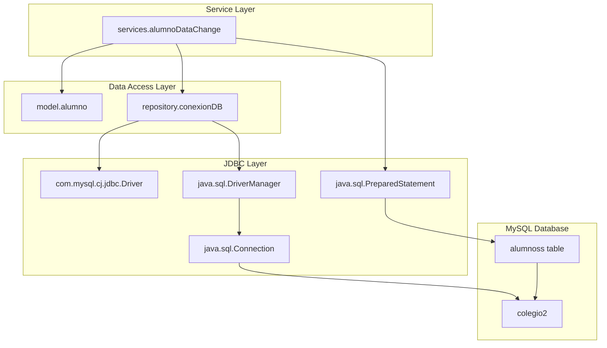
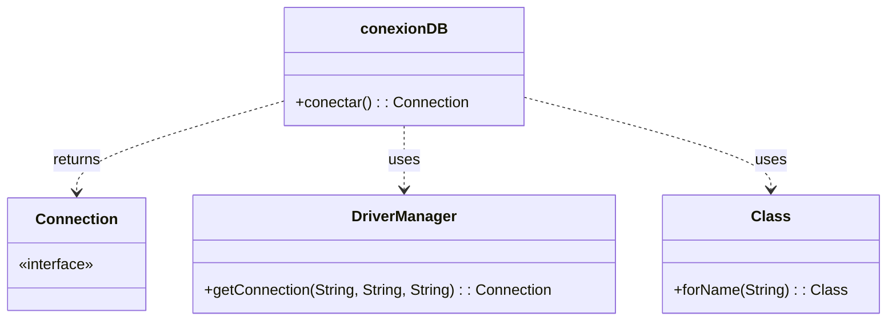
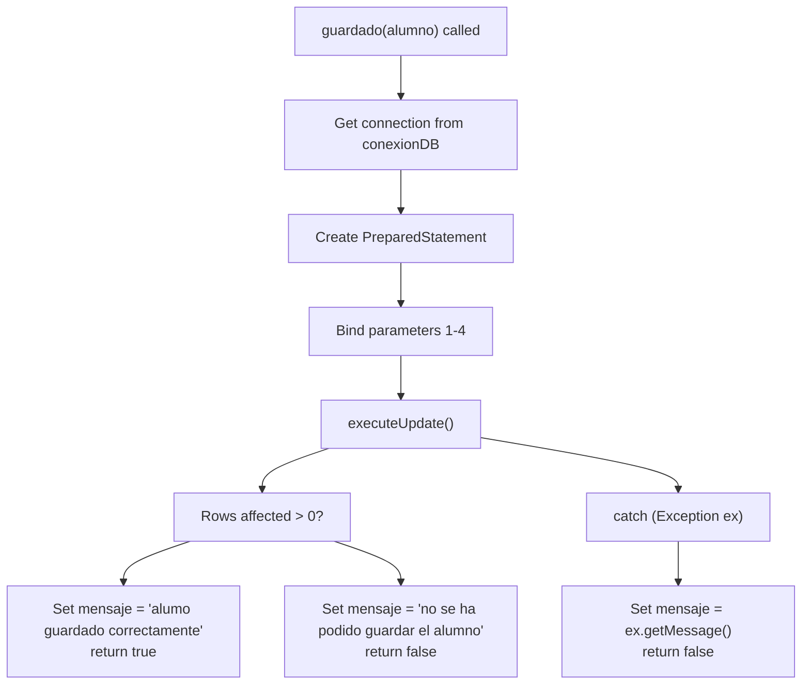
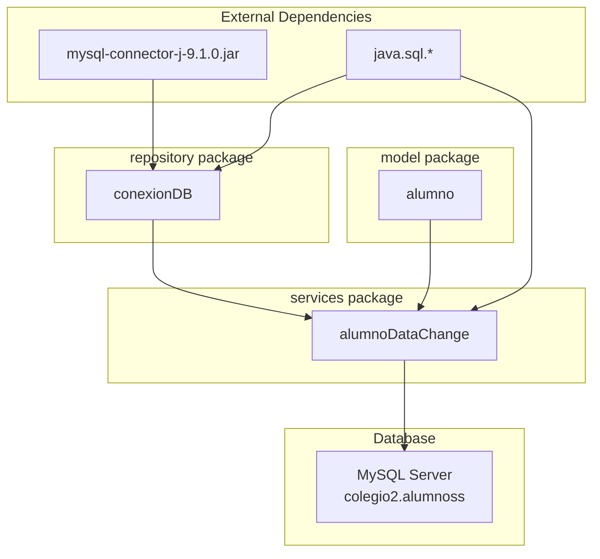

# Capa de acceso a datos

> **Archivos fuente relevantes**
> * [compilación/clases/repositorio/conexionDB.class](https://github.com/axchisan/Crud-MUUUy-simple-en-java-de-hace-a-os/blob/7ec3bd78/build/classes/repository/conexionDB.class)
> * [construir/clases/servicios/alumnoDataChange.class](https://github.com/axchisan/Crud-MUUUy-simple-en-java-de-hace-a-os/blob/7ec3bd78/build/classes/services/alumnoDataChange.class)
> * [nbproject/proyecto.propiedades](https://github.com/axchisan/Crud-MUUUy-simple-en-java-de-hace-a-os/blob/7ec3bd78/nbproject/project.properties)

## Propósito y alcance

La capa de acceso a datos es responsable de toda la conectividad de la base de datos, las operaciones de persistencia de datos y la recuperación de datos en la aplicación crud3. Esta capa consta del `repository.conexionDB`administrador de conexiones y la lógica de interacción con la base de datos dentro de la capa de servicio. Para obtener información sobre la lógica de negocio que utiliza esta capa, consulte [Capa de lógica de aplicación](/axchisan/Crud-MUUUy-simple-en-java-de-hace-a-os/5-application-logic-layer) . Para obtener más información sobre la arquitectura completa, consulte [Capas de aplicación](/axchisan/Crud-MUUUy-simple-en-java-de-hace-a-os/3.1-application-layers) .

Este documento cubre:

* Gestión de conexiones de bases de datos y configuración de JDBC
* Estructura del esquema de la base de datos MySQL
* Operaciones SQL para la persistencia de registros de estudiantes

---

## Descripción general

La capa de acceso a datos implementa un enfoque sencillo basado en JDBC para la conectividad de bases de datos MySQL. Esta capa separa la gestión de conexiones ( `repository.conexionDB`) de las operaciones de datos ( `services.alumnoDataChange`), lo que permite a la aplicación establecer conexiones a bases de datos y ejecutar sentencias SQL para la persistencia de los registros de los estudiantes.

### Arquitectura de componentes



**Fuentes:**

* [conexionDB.class L1-L7](https://github.com/axchisan/Crud-MUUUy-simple-en-java-de-hace-a-os/blob/7ec3bd78/build/classes/repository/conexionDB.class#L1-L7)
* [alumnoDataChange.class L1-L13](https://github.com/axchisan/Crud-MUUUy-simple-en-java-de-hace-a-os/blob/7ec3bd78/build/classes/services/alumnoDataChange.class#L1-L13)

---

## Gestión de conexiones

La `repository.conexionDB`clase proporciona una gestión centralizada de la conexión de base de datos para toda la aplicación.

### Clase conexionDB

La `conexionDB`clase contiene un único método público `conectar()`que establece y devuelve una conexión a la base de datos MySQL.

#### Firma del método de conexión



**Fuentes:**

* [conexionDB.class L1-L7](https://github.com/axchisan/Crud-MUUUy-simple-en-java-de-hace-a-os/blob/7ec3bd78/build/classes/repository/conexionDB.class#L1-L7)

### Flujo de establecimiento de conexión

El `conectar()`método sigue esta secuencia:

```mermaid
sequenceDiagram
  participant alumnoDataChange
  participant conexionDB
  participant Class.forName()
  participant DriverManager
  participant MySQL Server

  alumnoDataChange->>conexionDB: conectar()
  conexionDB->>Class.forName(): forName("com.mysql.cj.jdbc.Driver")
  Class.forName()-->>conexionDB: Driver class loaded
  conexionDB->>DriverManager: getConnection(url, user, password)
  note over conexionDB,DriverManager: URL: "jdbc:mysql://localhost:3306/colegio2"
  DriverManager->>MySQL Server: Establish connection
  MySQL Server-->>DriverManager: Connection established
  DriverManager-->>conexionDB: Connection object
  conexionDB-->>alumnoDataChange: Connection
```

**Fuentes:**

* [conexionDB.class L2-L6](https://github.com/axchisan/Crud-MUUUy-simple-en-java-de-hace-a-os/blob/7ec3bd78/build/classes/repository/conexionDB.class#L2-L6)

### Parámetros de conexión

| Parámetro | Valor | Descripción |
| --- | --- | --- |
| **Clase de conductor** | `com.mysql.cj.jdbc.Driver` | Controlador JDBC de MySQL Connector/J 9.1.0 |
| **URL de JDBC** | `jdbc:mysql://localhost:3306/colegio2` | Cadena de conexión dirigida al servidor MySQL local |
| **Base de datos** | `colegio2` | Esquema de la base de datos de destino |
| **Puerto** | `3306` | Puerto predeterminado de MySQL |
| **Nombre de usuario** | `root` | Usuario de base de datos con privilegios completos |
| **Contraseña** | *(cadena vacía)* | No hay contraseña configurada |

**Fuentes:**

* [conexionDB.class L2-L5](https://github.com/axchisan/Crud-MUUUy-simple-en-java-de-hace-a-os/blob/7ec3bd78/build/classes/repository/conexionDB.class#L2-L5)
* [project.properties L36](https://github.com/axchisan/Crud-MUUUy-simple-en-java-de-hace-a-os/blob/7ec3bd78/nbproject/project.properties#L36-L36)

### Manejo de excepciones

The `conectar()` method handles exceptions by catching `java.lang.Exception`. If driver loading or connection establishment fails, the method returns `null`. The calling service layer is responsible for checking for null connections and handling failures appropriately.

**Sources:**

* [build/classes/repository/conexionDB.class L5-L6](https://github.com/axchisan/Crud-MUUUy-simple-en-java-de-hace-a-os/blob/7ec3bd78/build/classes/repository/conexionDB.class#L5-L6)

---

## Database Schema

The application uses a MySQL database named `colegio2` with a single table `alumnoss` for storing student records.

### Database Structure

```css
#mermaid-n66yh9gzef{font-family:ui-sans-serif,-apple-system,system-ui,Segoe UI,Helvetica;font-size:16px;fill:#333;}@keyframes edge-animation-frame{from{stroke-dashoffset:0;}}@keyframes dash{to{stroke-dashoffset:0;}}#mermaid-n66yh9gzef .edge-animation-slow{stroke-dasharray:9,5!important;stroke-dashoffset:900;animation:dash 50s linear infinite;stroke-linecap:round;}#mermaid-n66yh9gzef .edge-animation-fast{stroke-dasharray:9,5!important;stroke-dashoffset:900;animation:dash 20s linear infinite;stroke-linecap:round;}#mermaid-n66yh9gzef .error-icon{fill:#dddddd;}#mermaid-n66yh9gzef .error-text{fill:#222222;stroke:#222222;}#mermaid-n66yh9gzef .edge-thickness-normal{stroke-width:1px;}#mermaid-n66yh9gzef .edge-thickness-thick{stroke-width:3.5px;}#mermaid-n66yh9gzef .edge-pattern-solid{stroke-dasharray:0;}#mermaid-n66yh9gzef .edge-thickness-invisible{stroke-width:0;fill:none;}#mermaid-n66yh9gzef .edge-pattern-dashed{stroke-dasharray:3;}#mermaid-n66yh9gzef .edge-pattern-dotted{stroke-dasharray:2;}#mermaid-n66yh9gzef .marker{fill:#999;stroke:#999;}#mermaid-n66yh9gzef .marker.cross{stroke:#999;}#mermaid-n66yh9gzef svg{font-family:ui-sans-serif,-apple-system,system-ui,Segoe UI,Helvetica;font-size:16px;}#mermaid-n66yh9gzef p{margin:0;}#mermaid-n66yh9gzef .entityBox{fill:#ffffff;stroke:#dddddd;}#mermaid-n66yh9gzef .relationshipLabelBox{fill:#dddddd;opacity:0.7;background-color:#dddddd;}#mermaid-n66yh9gzef .relationshipLabelBox rect{opacity:0.5;}#mermaid-n66yh9gzef .labelBkg{background-color:rgba(221, 221, 221, 0.5);}#mermaid-n66yh9gzef .edgeLabel .label{fill:#dddddd;font-size:14px;}#mermaid-n66yh9gzef .label{font-family:ui-sans-serif,-apple-system,system-ui,Segoe UI,Helvetica;color:#333;}#mermaid-n66yh9gzef .edge-pattern-dashed{stroke-dasharray:8,8;}#mermaid-n66yh9gzef .node rect,#mermaid-n66yh9gzef .node circle,#mermaid-n66yh9gzef .node ellipse,#mermaid-n66yh9gzef .node polygon{fill:#ffffff;stroke:#dddddd;stroke-width:1px;}#mermaid-n66yh9gzef .relationshipLine{stroke:#999;stroke-width:1;fill:none;}#mermaid-n66yh9gzef .marker{fill:none!important;stroke:#999!important;stroke-width:1;}#mermaid-n66yh9gzef :root{--mermaid-font-family:"trebuchet ms",verdana,arial,sans-serif;}containscolegio2alumnossintidPKAuto-increment primary keyvarcharnombreStudent first namevarcharapellidoStudent last namevarchartelefonoStudent phone numbervarcharcorreoStudent email address
```

**Sources:**

* [build/classes/services/alumnoDataChange.class L2](https://github.com/axchisan/Crud-MUUUy-simple-en-java-de-hace-a-os/blob/7ec3bd78/build/classes/services/alumnoDataChange.class#L2-L2)

### Table: alumnoss

The `alumnoss` table stores student information with the following structure:

| Column | Type | Constraints | Description |
| --- | --- | --- | --- |
| `id` | `INT` | PRIMARY KEY, AUTO_INCREMENT | Unique identifier for each student record |
| `nombre` | `VARCHAR` | NOT NULL (implied by validation) | Student's first name |
| `apellido` | `VARCHAR` | NOT NULL (implied by validation) | Student's last name |
| `telefono` | `VARCHAR` | NOT NULL (implied by validation) | Student's phone number |
| `correo` | `VARCHAR` | NOT NULL (implied by validation) | Student's email address |

**Note:** The `id` column is auto-generated by the database and is not included in INSERT operations. The application relies on client-side validation to ensure all other fields are populated before database operations.

**Sources:**

* [build/classes/services/alumnoDataChange.class L2-L8](https://github.com/axchisan/Crud-MUUUy-simple-en-java-de-hace-a-os/blob/7ec3bd78/build/classes/services/alumnoDataChange.class#L2-L8)

### Database Connection String

The full connection string used by the application:

```yaml
jdbc:mysql://localhost:3306/colegio2
```

This connection string targets:

* **Protocol:** JDBC for MySQL
* **Host:** `localhost` (local development environment)
* **Port:** `3306` (MySQL default)
* **Database:** `colegio2`

**Sources:**

* [build/classes/repository/conexionDB.class L4](https://github.com/axchisan/Crud-MUUUy-simple-en-java-de-hace-a-os/blob/7ec3bd78/build/classes/repository/conexionDB.class#L4-L4)

---

## CRUD Operations

The Data Access Layer currently implements only the **Create (INSERT)** operation through the `services.alumnoDataChange` class. While named as a "Data Change" service, it exclusively handles record insertion.

### SQL Insert Operation

The application uses a parameterized PreparedStatement to insert student records:

```sql
INSERT INTO alumnoss (nombre, apellido, telefono, correo) VALUES (?, ?, ?, ?)
```

**Sources:**

* [build/classes/services/alumnoDataChange.class L2-L3](https://github.com/axchisan/Crud-MUUUy-simple-en-java-de-hace-a-os/blob/7ec3bd78/build/classes/services/alumnoDataChange.class#L2-L3)

### Insert Operation Flow

```mermaid
sequenceDiagram
  participant GUI.GUI
  participant alumnoDataChange.guardado()
  participant alumno object
  participant conexionDB.conectar()
  participant Connection
  participant PreparedStatement
  participant alumnoss table

  GUI.GUI->>alumno object: Create with setters
  GUI.GUI->>alumnoDataChange.guardado(): guardado(alumno)
  alumnoDataChange.guardado()->>conexionDB.conectar(): conectar()
  conexionDB.conectar()-->>alumnoDataChange.guardado(): Connection
  alumnoDataChange.guardado()->>Connection: prepareStatement(sql)
  Connection-->>alumnoDataChange.guardado(): PreparedStatement
  alumnoDataChange.guardado()->>alumno object: getNombre()
  alumno object-->>alumnoDataChange.guardado(): nombre value
  alumnoDataChange.guardado()->>PreparedStatement: setString(1, nombre)
  alumnoDataChange.guardado()->>alumno object: getApellido()
  alumno object-->>alumnoDataChange.guardado(): apellido value
  alumnoDataChange.guardado()->>PreparedStatement: setString(2, apellido)
  alumnoDataChange.guardado()->>alumno object: getTelefono()
  alumno object-->>alumnoDataChange.guardado(): telefono value
  alumnoDataChange.guardado()->>PreparedStatement: setString(3, telefono)
  alumnoDataChange.guardado()->>alumno object: getCorreo()
  alumno object-->>alumnoDataChange.guardado(): correo value
  alumnoDataChange.guardado()->>PreparedStatement: setString(4, correo)
  alumnoDataChange.guardado()->>PreparedStatement: executeUpdate()
  PreparedStatement->>alumnoss table: Execute INSERT
  alumnoss table-->>PreparedStatement: Rows affected
  PreparedStatement-->>alumnoDataChange.guardado(): int filas
  loop [filas > 0]
    alumnoDataChange.guardado()->>alumnoDataChange.guardado(): Set mensaje = "alumo guardado correctamente"
    alumnoDataChange.guardado()-->>GUI.GUI: return true
    alumnoDataChange.guardado()->>alumnoDataChange.guardado(): Set mensaje = "no se ha podido guardar el alumno"
    alumnoDataChange.guardado()-->>GUI.GUI: return false
  end
```

**Sources:**

* [build/classes/services/alumnoDataChange.class L3-L12](https://github.com/axchisan/Crud-MUUUy-simple-en-java-de-hace-a-os/blob/7ec3bd78/build/classes/services/alumnoDataChange.class#L3-L12)

### Parameter Binding

The PreparedStatement parameters are bound in the following order:

| Position | Parameter | Source Method | Model Field |
| --- | --- | --- | --- |
| 1 | `nombre` | `alumno.getNombre()` | First name |
| 2 | `apellido` | `alumno.getApellido()` | Last name |
| 3 | `telefono` | `alumno.getTelefono()` | Phone number |
| 4 | `correo` | `alumno.getCorreo()` | Email address |

**Sources:**

* [build/classes/services/alumnoDataChange.class L5-L8](https://github.com/axchisan/Crud-MUUUy-simple-en-java-de-hace-a-os/blob/7ec3bd78/build/classes/services/alumnoDataChange.class#L5-L8)

### guardado() Method Details

The `guardado(alumno)` method in `services.alumnoDataChange` implements the complete insert operation:

**Method Signature:**

```
public boolean guardado(model.alumno a)
```

**Return Values:**

* `true` if `executeUpdate()` returns a value greater than 0 (successful insert)
* `false` if `executeUpdate()` returns 0 or an exception occurs

**Side Effects:**

* Sets the static field `alumnoDataChange.mensaje` to either: * `"alumo guardado correctamente"` on success * `"no se ha podido guardar el alumno"` on failure * Exception message string (`ex.getMessage()`) on exception

**Sources:**

* [build/classes/services/alumnoDataChange.class L10-L12](https://github.com/axchisan/Crud-MUUUy-simple-en-java-de-hace-a-os/blob/7ec3bd78/build/classes/services/alumnoDataChange.class#L10-L12)

### Error Handling

The data access layer implements try-catch error handling:



**Sources:**

* [build/classes/services/alumnoDataChange.class L8-L12](https://github.com/axchisan/Crud-MUUUy-simple-en-java-de-hace-a-os/blob/7ec3bd78/build/classes/services/alumnoDataChange.class#L8-L12)

### Message Field

The `alumnoDataChange` class maintains a static `String` field named `mensaje` that stores the result message of the last operation. This field is accessed by the GUI layer to display feedback to users via `JOptionPane` dialogs.

**Possible Values:**

* `"alumo guardado correctamente"` - Successful insertion (note: typo in "alumo" instead of "alumno")
* `"no se ha podido guardar el alumno"` - Failed insertion (zero rows affected)
* Exception message string - Any exception caught during the operation

**Sources:**

* [build/classes/services/alumnoDataChange.class L8-L12](https://github.com/axchisan/Crud-MUUUy-simple-en-java-de-hace-a-os/blob/7ec3bd78/build/classes/services/alumnoDataChange.class#L8-L12)

---

## JDBC Driver Configuration

El controlador JDBC de MySQL se configura como una dependencia del proyecto y debe estar disponible en la ruta de clases tanto en tiempo de compilación como en tiempo de ejecución.

### Dependencia del conductor

La biblioteca MySQL Connector/J se configura en las propiedades del proyecto:

| Propiedad | Valor |
| --- | --- |
| **Nombre de la biblioteca** | conector mysql-j-9.1.0.jar |
| **Ubicación** | `/home/axchisan/Downloads/mysql-connector-j-9.1.0/mysql-connector-j-9.1.0.jar` |
| **Clave de propiedad** | `file.reference.mysql-connector-j-9.1.0.jar` |

La biblioteca se incluye en las rutas de clases de compilación y tiempo de ejecución a través de la `javac.classpath`propiedad.

**Fuentes:**

* [project.properties L36](https://github.com/axchisan/Crud-MUUUy-simple-en-java-de-hace-a-os/blob/7ec3bd78/nbproject/project.properties#L36-L36)
* [project.properties L39-L41](https://github.com/axchisan/Crud-MUUUy-simple-en-java-de-hace-a-os/blob/7ec3bd78/nbproject/project.properties#L39-L41)

### Carga del controlador

El controlador se carga dinámicamente mediante la reflexión en el `conexionDB.conectar()`método:

```
Class.forName("com.mysql.cj.jdbc.Driver");
```

Esto hace que el controlador MySQL se registre con `java.sql.DriverManager`, lo que lo hace disponible para `getConnection()`llamadas posteriores.

**Fuentes:**

* [conexionDB.class L2-L3](https://github.com/axchisan/Crud-MUUUy-simple-en-java-de-hace-a-os/blob/7ec3bd78/build/classes/repository/conexionDB.class#L2-L3)

---

## Dependencias de la capa de acceso a datos

El siguiente diagrama muestra la estructura de dependencia completa de la capa de acceso a datos:



**Fuentes:**

* [project.properties L36-L41](https://github.com/axchisan/Crud-MUUUy-simple-en-java-de-hace-a-os/blob/7ec3bd78/nbproject/project.properties#L36-L41)
* [conexionDB.class L1-L7](https://github.com/axchisan/Crud-MUUUy-simple-en-java-de-hace-a-os/blob/7ec3bd78/build/classes/repository/conexionDB.class#L1-L7)
* [alumnoDataChange.class L1-L13](https://github.com/axchisan/Crud-MUUUy-simple-en-java-de-hace-a-os/blob/7ec3bd78/build/classes/services/alumnoDataChange.class#L1-L13)

---

## Limitaciones y notas de diseño

### Limitaciones actuales

1. **Operaciones de lectura:** La capa de acceso a datos no implementa consultas SELECT. No existe ninguna funcionalidad para recuperar ni mostrar los registros de estudiantes existentes.
2. **Operaciones de actualización:** No se implementan operaciones de actualización. Los registros existentes no se pueden modificar.
3. **Operaciones de eliminación:** No se implementan operaciones de eliminación. Los registros no se pueden eliminar una vez insertados.
4. **Agrupación de conexiones:** cada operación establece una nueva conexión sin agrupación ni reutilización, lo que puede afectar el rendimiento bajo carga.
5. **Gestión de transacciones:** No se admiten transacciones. Cada INSERT es una operación independiente sin posibilidad de reversión.
6. **Informe de errores:** Se proporcionan detalles limitados de los errores. Se detectan excepciones, pero no se distinguen errores SQL específicos.

### Consideraciones de seguridad

1. **Credenciales:** Las credenciales de la base de datos (nombre de usuario: "root", contraseña vacía) están codificadas en la `conexionDB`clase. Esta configuración solo es adecuada para entornos de desarrollo locales.
2. **Uso de PreparedStatement:** La aplicación utiliza correctamente `PreparedStatement`consultas parametrizadas, lo que proporciona protección contra ataques de inyección SQL.
3. **Cadena de conexión:** la cadena de conexión del host local asume acceso a la base de datos local y no está configurada para implementaciones remotas o de producción.

**Fuentes:**

* [conexionDB.class L4-L5](https://github.com/axchisan/Crud-MUUUy-simple-en-java-de-hace-a-os/blob/7ec3bd78/build/classes/repository/conexionDB.class#L4-L5)
* [alumnoDataChange.class L2-L3](https://github.com/axchisan/Crud-MUUUy-simple-en-java-de-hace-a-os/blob/7ec3bd78/build/classes/services/alumnoDataChange.class#L2-L3)