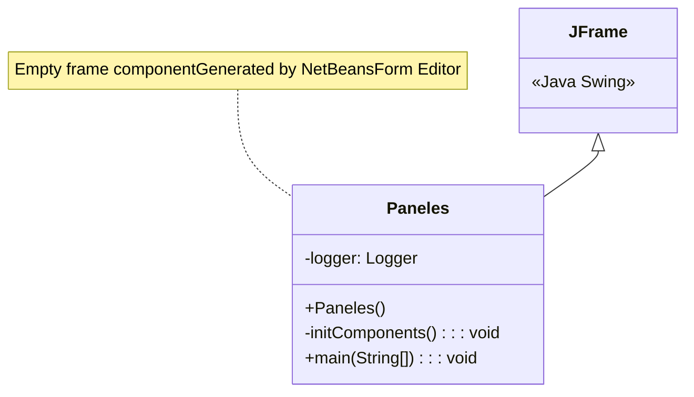
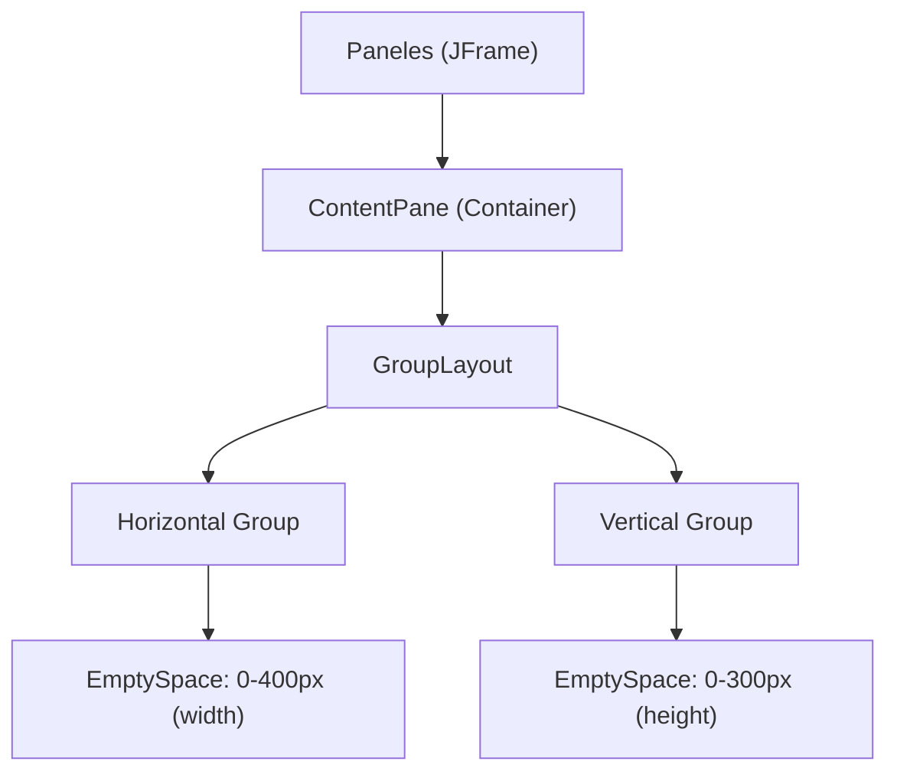
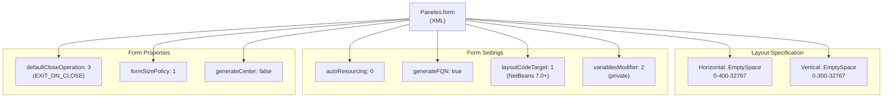
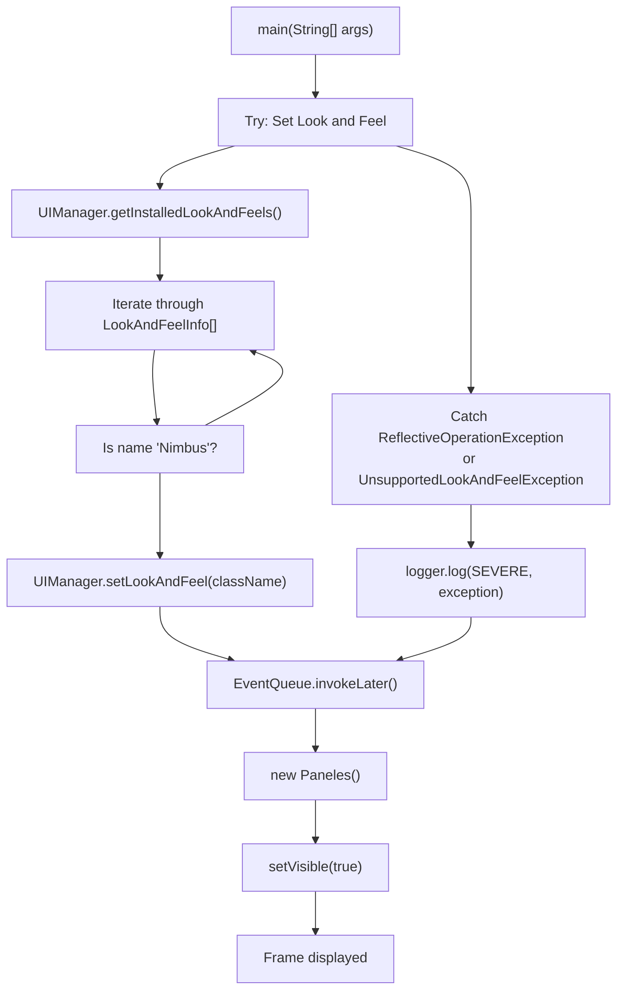
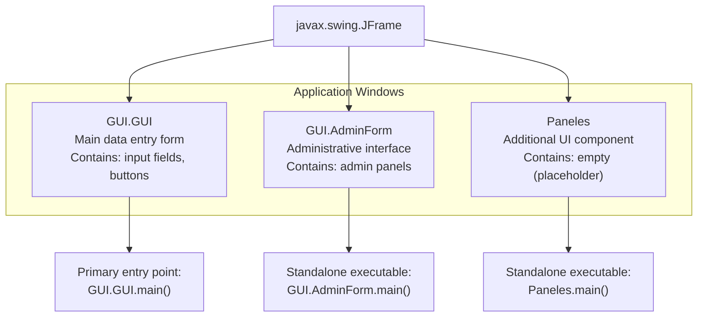

# Componente Paneles

> **Archivos fuente relevantes**
> * [construir/clases/Paneles.class](https://github.com/axchisan/Crud-MUUUy-simple-en-java-de-hace-a-os/blob/7ec3bd78/build/classes/Paneles.class)
> * [construir/clases/Paneles.form](https://github.com/axchisan/Crud-MUUUy-simple-en-java-de-hace-a-os/blob/7ec3bd78/build/classes/Paneles.form)
> * [src/Paneles.form](https://github.com/axchisan/Crud-MUUUy-simple-en-java-de-hace-a-os/blob/7ec3bd78/src/Paneles.form)
> * [src/Paneles.java](https://github.com/axchisan/Crud-MUUUy-simple-en-java-de-hace-a-os/blob/7ec3bd78/src/Paneles.java)

## Propósito y alcance

Este documento describe el `Paneles`componente, una ventana JFrame basada en Swing en la aplicación crud3. La `Paneles`clase representa un componente adicional de interfaz de usuario que actualmente se implementa como un marcador de posición de marco vacío. Esta página abarca la estructura de la clase, la definición del formulario y el comportamiento de inicialización del componente Paneles.

Para obtener información sobre la interfaz principal de entrada de datos, consulte [Formulario principal de entrada de datos](/axchisan/Crud-MUUUy-simple-en-java-de-hace-a-os/4.1-main-data-entry-form-(gui.gui)) . Para conocer la funcionalidad administrativa, consulte [Formulario de administración](/axchisan/Crud-MUUUy-simple-en-java-de-hace-a-os/4.2-admin-form) . Para conocer la arquitectura general de la interfaz gráfica de usuario y la jerarquía de componentes, consulte [Capa de interfaz de usuario](/axchisan/Crud-MUUUy-simple-en-java-de-hace-a-os/4-user-interface-layer) .

**Fuentes:** [src/Paneles.java L1-L74](https://github.com/axchisan/Crud-MUUUy-simple-en-java-de-hace-a-os/blob/7ec3bd78/src/Paneles.java#L1-L74)

---

## Descripción general de la clase

La `Paneles`clase es un componente de ventana de nivel superior que extiende `javax.swing.JFrame`. Se genera y administra mediante el Constructor de GUI de NetBeans (Editor de Formularios), como lo indican el encabezado de la plantilla y los marcadores de código generados automáticamente.

### Estructura de clases



**Diagrama: Jerarquía de clases de los paneles**

**Fuentes:** [src/Paneles.java L10-L19](https://github.com/axchisan/Crud-MUUUy-simple-en-java-de-hace-a-os/blob/7ec3bd78/src/Paneles.java#L10-L19)

### Miembros de la clase

| Miembro | Tipo | Visibilidad | Descripción |
| --- | --- | --- | --- |
| `logger` | `java.util.logging.Logger` | `private static final` | Instancia de registrador para el registro de errores en el método principal |
| `Paneles()` | Constructor | `public` | Inicializa el formulario llamando`initComponents()` |
| `initComponents()` | Método | `private` | Método generado automáticamente que configura los componentes de la interfaz de usuario |
| `main(String[])` | Método | `public static` | Punto de entrada para ejecución independiente |

**Fuentes:** [src/Paneles.java L12](https://github.com/axchisan/Crud-MUUUy-simple-en-java-de-hace-a-os/blob/7ec3bd78/src/Paneles.java#L12-L12)

 [src/Paneles.java L17-L19](https://github.com/axchisan/Crud-MUUUy-simple-en-java-de-hace-a-os/blob/7ec3bd78/src/Paneles.java#L17-L19)

 [src/Paneles.java L28-L44](https://github.com/axchisan/Crud-MUUUy-simple-en-java-de-hace-a-os/blob/7ec3bd78/src/Paneles.java#L28-L44)

 [src/Paneles.java L49-L69](https://github.com/axchisan/Crud-MUUUy-simple-en-java-de-hace-a-os/blob/7ec3bd78/src/Paneles.java#L49-L69)

---

## Flujo de inicialización de componentes

El proceso de inicialización sigue el patrón estándar del editor de formularios de NetBeans:

```sql
ContentPaneGroupLayoutWindowConstants"initComponents()""Paneles()"ContentPaneGroupLayoutWindowConstants"initComponents()""Paneles()"#mermaid-85333i4omrs{font-family:ui-sans-serif,-apple-system,system-ui,Segoe UI,Helvetica;font-size:16px;fill:#333;}@keyframes edge-animation-frame{from{stroke-dashoffset:0;}}@keyframes dash{to{stroke-dashoffset:0;}}#mermaid-85333i4omrs .edge-animation-slow{stroke-dasharray:9,5!important;stroke-dashoffset:900;animation:dash 50s linear infinite;stroke-linecap:round;}#mermaid-85333i4omrs .edge-animation-fast{stroke-dasharray:9,5!important;stroke-dashoffset:900;animation:dash 20s linear infinite;stroke-linecap:round;}#mermaid-85333i4omrs .error-icon{fill:#dddddd;}#mermaid-85333i4omrs .error-text{fill:#222222;stroke:#222222;}#mermaid-85333i4omrs .edge-thickness-normal{stroke-width:1px;}#mermaid-85333i4omrs .edge-thickness-thick{stroke-width:3.5px;}#mermaid-85333i4omrs .edge-pattern-solid{stroke-dasharray:0;}#mermaid-85333i4omrs .edge-thickness-invisible{stroke-width:0;fill:none;}#mermaid-85333i4omrs .edge-pattern-dashed{stroke-dasharray:3;}#mermaid-85333i4omrs .edge-pattern-dotted{stroke-dasharray:2;}#mermaid-85333i4omrs .marker{fill:#999;stroke:#999;}#mermaid-85333i4omrs .marker.cross{stroke:#999;}#mermaid-85333i4omrs svg{font-family:ui-sans-serif,-apple-system,system-ui,Segoe UI,Helvetica;font-size:16px;}#mermaid-85333i4omrs p{margin:0;}#mermaid-85333i4omrs .actor{stroke:#cccccc;fill:#ffffff;}#mermaid-85333i4omrs text.actor>tspan{fill:#333;stroke:none;}#mermaid-85333i4omrs .actor-line{stroke:#cccccc;}#mermaid-85333i4omrs .messageLine0{stroke-width:1.5;stroke-dasharray:none;stroke:#999999;}#mermaid-85333i4omrs .messageLine1{stroke-width:1.5;stroke-dasharray:2,2;stroke:#999999;}#mermaid-85333i4omrs #arrowhead path{fill:#999999;stroke:#999999;}#mermaid-85333i4omrs .sequenceNumber{fill:#666666;}#mermaid-85333i4omrs #sequencenumber{fill:#999999;}#mermaid-85333i4omrs #crosshead path{fill:#999999;stroke:#999999;}#mermaid-85333i4omrs .messageText{fill:#333333;stroke:none;}#mermaid-85333i4omrs .labelBox{stroke:#dddddd;fill:#ffffff;}#mermaid-85333i4omrs .labelText,#mermaid-85333i4omrs .labelText>tspan{fill:#333;stroke:none;}#mermaid-85333i4omrs .loopText,#mermaid-85333i4omrs .loopText>tspan{fill:#333;stroke:none;}#mermaid-85333i4omrs .loopLine{stroke-width:2px;stroke-dasharray:2,2;stroke:#dddddd;fill:#dddddd;}#mermaid-85333i4omrs .note{stroke:#e6d280;fill:#fff5ad;}#mermaid-85333i4omrs .noteText,#mermaid-85333i4omrs .noteText>tspan{fill:#333;stroke:none;}#mermaid-85333i4omrs .activation0{fill:hsl(-120, 0%, 91.7647058824%);stroke:hsl(-120, 0%, 81.7647058824%);}#mermaid-85333i4omrs .activation1{fill:hsl(-120, 0%, 91.7647058824%);stroke:hsl(-120, 0%, 81.7647058824%);}#mermaid-85333i4omrs .activation2{fill:hsl(-120, 0%, 91.7647058824%);stroke:hsl(-120, 0%, 81.7647058824%);}#mermaid-85333i4omrs .actorPopupMenu{position:absolute;}#mermaid-85333i4omrs .actorPopupMenuPanel{position:absolute;fill:#ffffff;box-shadow:0px 8px 16px 0px rgba(0,0,0,0.2);filter:drop-shadow(3px 5px 2px rgb(0 0 0 / 0.4));}#mermaid-85333i4omrs .actor-man line{stroke:#cccccc;fill:#ffffff;}#mermaid-85333i4omrs .actor-man circle,#mermaid-85333i4omrs line{stroke:#cccccc;fill:#ffffff;stroke-width:2px;}#mermaid-85333i4omrs :root{--mermaid-font-family:"trebuchet ms",verdana,arial,sans-serif;}"Empty space: 0-400px""Empty space: 0-300px""1. Call initComponents()""2. setDefaultCloseOperation(EXIT_ON_CLOSE)""3. getContentPane()""4. new GroupLayout(contentPane)""5. setLayout(layout)""6. setHorizontalGroup()""7. setVerticalGroup()""8. pack()"
```

**Diagrama: Secuencia de inicialización de paneles**

**Fuentes:** [src/Paneles.java L17-L19](https://github.com/axchisan/Crud-MUUUy-simple-en-java-de-hace-a-os/blob/7ec3bd78/src/Paneles.java#L17-L19)

 [src/Paneles.java L28-L44](https://github.com/axchisan/Crud-MUUUy-simple-en-java-de-hace-a-os/blob/7ec3bd78/src/Paneles.java#L28-L44)

### Operación de cierre predeterminada

El marco está configurado con `EXIT_ON_CLOSE`la operación, lo que significa que cuando se cierra la ventana, la aplicación finalizará:

```
setDefaultCloseOperation(javax.swing.WindowConstants.EXIT_ON_CLOSE);
```

**Fuentes:** [src/Paneles.java L30](https://github.com/axchisan/Crud-MUUUy-simple-en-java-de-hace-a-os/blob/7ec3bd78/src/Paneles.java#L30-L30)

---

## Configuración de diseño

El `Paneles`componente utiliza `GroupLayout`como gestor de diseño, el valor predeterminado para los formularios generados por NetBeans. Actualmente, el diseño no contiene componentes secundarios, solo definiciones de espacios vacíos.

### Estructura del diseño



**Diagrama: Estructura de diseño de paneles**

**Fuentes:** [src/Paneles.java L32-L43](https://github.com/axchisan/Crud-MUUUy-simple-en-java-de-hace-a-os/blob/7ec3bd78/src/Paneles.java#L32-L43)

### Dimensiones del diseño

| Dimensión | Tamaño mínimo | Tamaño preferido | Tamaño máximo |
| --- | --- | --- | --- |
| Horizontal | 0 píxeles | 400 píxeles | Corto.MAX_VALUE (32767) |
| Vertical | 0 píxeles | 300 píxeles | Corto.MAX_VALUE (32767) |

The `pack()` method is called at the end of initialization, which sizes the frame to fit its preferred size (400x300 pixels).

**Sources:** [src/Paneles.java L34-L41](https://github.com/axchisan/Crud-MUUUy-simple-en-java-de-hace-a-os/blob/7ec3bd78/src/Paneles.java#L34-L41)

 [src/Paneles.java L43](https://github.com/axchisan/Crud-MUUUy-simple-en-java-de-hace-a-os/blob/7ec3bd78/src/Paneles.java#L43-L43)

---

## Form Definition

The NetBeans Form Editor stores the visual design in an XML file with the `.form` extension. This file is used by the IDE to regenerate the `initComponents()` method.

### Form Properties



**Diagram: Form Definition Structure**

**Sources:** [src/Paneles.form L4-L6](https://github.com/axchisan/Crud-MUUUy-simple-en-java-de-hace-a-os/blob/7ec3bd78/src/Paneles.form#L4-L6)

 [src/Paneles.form L8-L10](https://github.com/axchisan/Crud-MUUUy-simple-en-java-de-hace-a-os/blob/7ec3bd78/src/Paneles.form#L8-L10)

 [src/Paneles.form L12-L20](https://github.com/axchisan/Crud-MUUUy-simple-en-java-de-hace-a-os/blob/7ec3bd78/src/Paneles.form#L12-L20)

 [src/Paneles.form L24-L33](https://github.com/axchisan/Crud-MUUUy-simple-en-java-de-hace-a-os/blob/7ec3bd78/src/Paneles.form#L24-L33)

### Form Settings Configuration

| Setting | Value | Description |
| --- | --- | --- |
| `autoResourcing` | 0 | No automatic resource bundle |
| `autoSetComponentName` | false | Component names not auto-assigned |
| `generateFQN` | true | Fully qualified names in generated code |
| `generateMnemonicsCode` | false | No mnemonic key generation |
| `i18nAutoMode` | false | No automatic internationalization |
| `layoutCodeTarget` | 1 | Target NetBeans 7.0+ code generation |
| `listenerGenerationStyle` | 0 | Standard listener generation |
| `variablesLocal` | false | Variables declared as fields, not local |
| `variablesModifier` | 2 | Private visibility for component fields |

**Sources:** [src/Paneles.form L12-L20](https://github.com/axchisan/Crud-MUUUy-simple-en-java-de-hace-a-os/blob/7ec3bd78/src/Paneles.form#L12-L20)

---

## Standalone Execution

The `Paneles` class includes a `main` method, allowing it to be executed as a standalone application independently from the main crud3 entry point (`GUI.GUI`).

### Main Method Workflow



**Diagram: Standalone Execution Flow**

**Sources:** [src/Paneles.java L49-L69](https://github.com/axchisan/Crud-MUUUy-simple-en-java-de-hace-a-os/blob/7ec3bd78/src/Paneles.java#L49-L69)

### Look and Feel Configuration

The main method attempts to set the Nimbus look and feel, which is a cross-platform appearance introduced in Java SE 6. If Nimbus is not available or an exception occurs, the default system look and feel is used.

**Sources:** [src/Paneles.java L55-L64](https://github.com/axchisan/Crud-MUUUy-simple-en-java-de-hace-a-os/blob/7ec3bd78/src/Paneles.java#L55-L64)

### Event Dispatch Thread

The frame creation and display occurs on the Event Dispatch Thread (EDT) via `EventQueue.invokeLater()`, which is the correct pattern for Swing applications:

```
java.awt.EventQueue.invokeLater(() -> new Paneles().setVisible(true));
```

**Sources:** [src/Paneles.java L68](https://github.com/axchisan/Crud-MUUUy-simple-en-java-de-hace-a-os/blob/7ec3bd78/src/Paneles.java#L68-L68)

---

## Relationship to Other GUI Components

The `Paneles` component is one of three top-level window components in the crud3 application, alongside `GUI.GUI` and `GUI.AdminForm`.



**Diagram: GUI Components Relationship**

**Sources:** [src/Paneles.java L10](https://github.com/axchisan/Crud-MUUUy-simple-en-java-de-hace-a-os/blob/7ec3bd78/src/Paneles.java#L10-L10)

### Comparison with Other GUI Components

| Component | Package | Purpose | State | Contains |
| --- | --- | --- | --- | --- |
| `GUI.GUI` | `GUI` | Main data entry form | Active | Input fields, Save/Clean buttons, validation logic |
| `GUI.AdminForm` | `GUI` | Administrative interface | Active | Admin-specific panels and controls |
| `Paneles` | (default package) | Additional UI component | Empty placeholder | No components currently |

**Sources:** [src/Paneles.java L10](https://github.com/axchisan/Crud-MUUUy-simple-en-java-de-hace-a-os/blob/7ec3bd78/src/Paneles.java#L10-L10)

---

## Current Implementation State

The `Paneles` component is currently implemented as an **empty placeholder**. Key characteristics of its current state:

### Component Inventory

The "Variables declaration" section in the source code is empty, indicating no UI components have been added:

```
// Variables declaration - do not modify//GEN-BEGIN:variables
// End of variables declaration//GEN-END:variables
```

**Sources:** [src/Paneles.java L71-L72](https://github.com/axchisan/Crud-MUUUy-simple-en-java-de-hace-a-os/blob/7ec3bd78/src/Paneles.java#L71-L72)

### Visual Appearance

When executed, the `Paneles` window displays as:

* An empty frame with no visible components
* Default window decorations (title bar, close button)
* Size: 400 pixels wide × 300 pixels tall
* Background: Default system panel background color

### Potential Use Cases

Given its placeholder status, this component could be extended to serve various purposes, such as:

* Secondary data display panels
* Report viewing interface
* Settings or configuration dialog
* Help or documentation viewer
* Additional CRUD operations interface

However, no functional implementation currently exists beyond the basic frame structure.

**Sources:** [src/Paneles.java L1-L74](https://github.com/axchisan/Crud-MUUUy-simple-en-java-de-hace-a-os/blob/7ec3bd78/src/Paneles.java#L1-L74)

 [src/Paneles.form L1-L35](https://github.com/axchisan/Crud-MUUUy-simple-en-java-de-hace-a-os/blob/7ec3bd78/src/Paneles.form#L1-L35)

---

## Build Artifacts

El archivo compilado `Paneles.class`y la definición del formulario copiado se encuentran en el directorio de salida de la compilación, siguiendo el proceso de compilación estándar de Ant.

### Ubicaciones de archivos

| Archivo | Ubicación | Descripción |
| --- | --- | --- |
| Fuente | `src/Paneles.java` | Archivo fuente de Java |
| Definición de formulario | `src/Paneles.form` | Formulario XML de NetBeans |
| Clase compilada | `build/classes/Paneles.class` | Archivo de clase de código de bytes |
| Forma construida | `build/classes/Paneles.form` | Definición de formulario copiado |

**Fuentes:** [Paneles.class L1-L30](https://github.com/axchisan/Crud-MUUUy-simple-en-java-de-hace-a-os/blob/7ec3bd78/build/classes/Paneles.class#L1-L30)

 [Paneles.form L1-L35](https://github.com/axchisan/Crud-MUUUy-simple-en-java-de-hace-a-os/blob/7ec3bd78/build/classes/Paneles.form#L1-L35)

---

## Resumen

El `Paneles`componente es un JFrame generado por NetBeans que actualmente funciona como un contenedor vacío en la aplicación crud3. Incluye:

* Herencia estándar de JFrame con `EXIT_ON_CLOSE`comportamiento
* Administrador de diseño de grupo con dimensiones de 400×300 píxeles
* Capacidad de ejecución independiente con apariencia Nimbus
* Registrador para el manejo de errores en el método principal
* No hay componentes de interfaz de usuario activos ni lógica empresarial

El componente es totalmente ejecutable como aplicación independiente, pero actualmente no ofrece ninguna funcionalidad de cara al usuario. Representa una posible extensión para futuras funciones de interfaz de usuario.

**Fuentes:** [src/Paneles.java L1-L74](https://github.com/axchisan/Crud-MUUUy-simple-en-java-de-hace-a-os/blob/7ec3bd78/src/Paneles.java#L1-L74)

 [src/Paneles.form L1-L35](https://github.com/axchisan/Crud-MUUUy-simple-en-java-de-hace-a-os/blob/7ec3bd78/src/Paneles.form#L1-L35)