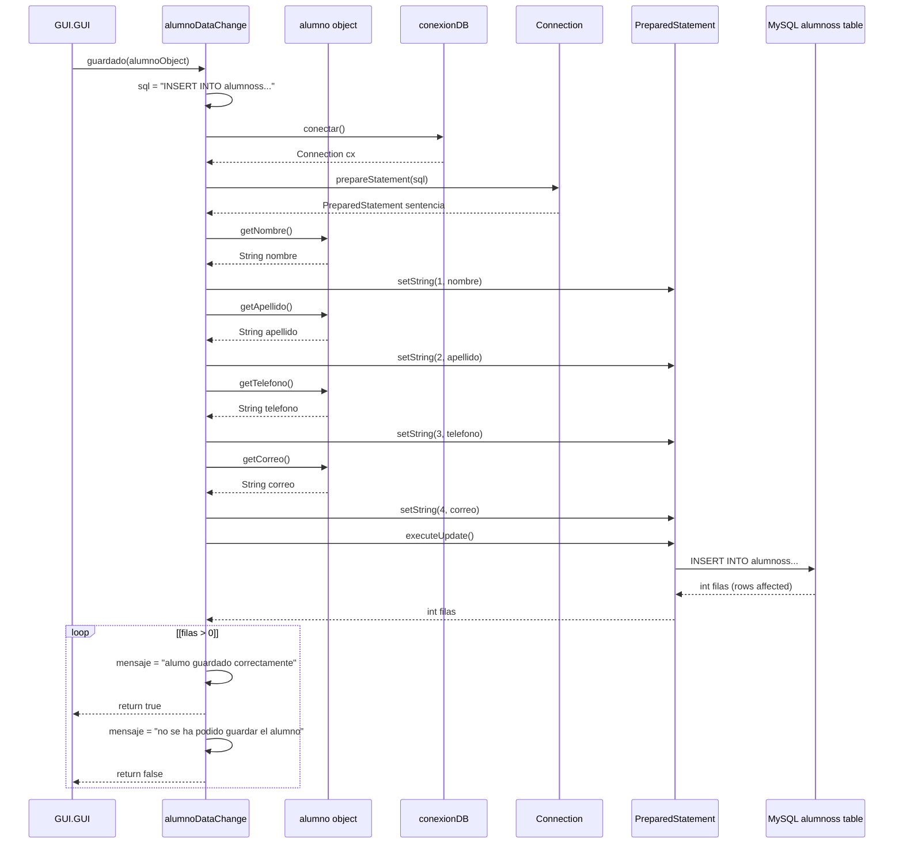
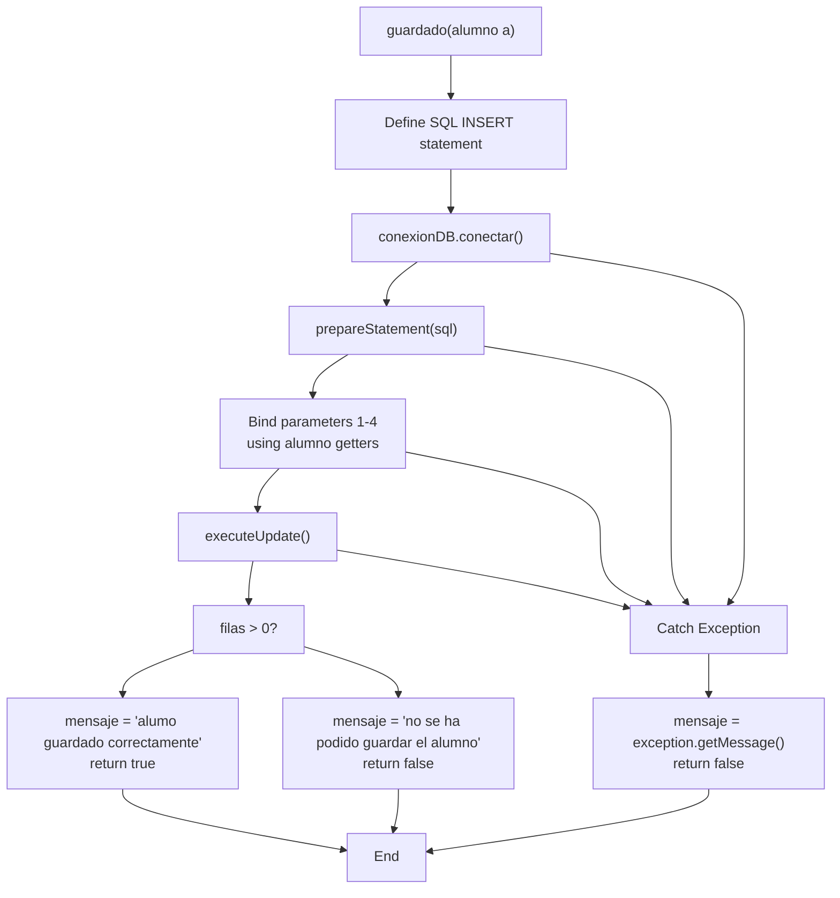
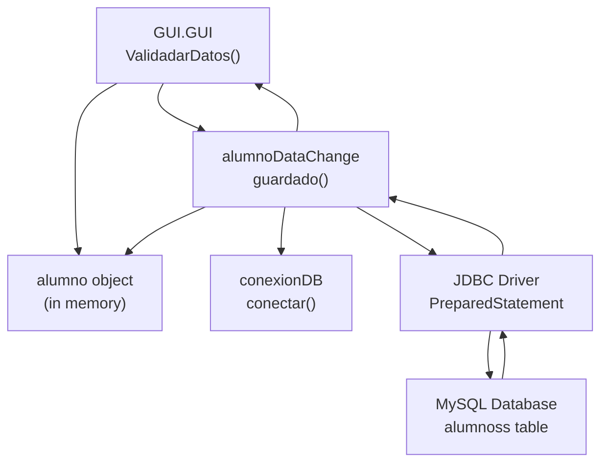

# Data Change Service (alumnoDataChange)

> **Relevant source files**
> * [build/classes/repository/conexionDB.class](https://github.com/axchisan/Crud-MUUUy-simple-en-java-de-hace-a-os/blob/7ec3bd78/build/classes/repository/conexionDB.class)
> * [build/classes/services/alumnoDataChange.class](https://github.com/axchisan/Crud-MUUUy-simple-en-java-de-hace-a-os/blob/7ec3bd78/build/classes/services/alumnoDataChange.class)
> * [src/model/alumno.java](https://github.com/axchisan/Crud-MUUUy-simple-en-java-de-hace-a-os/blob/7ec3bd78/src/model/alumno.java)

## Purpose and Scope

This page documents the `alumnoDataChange` service class, which serves as the business logic layer component responsible for persisting student data to the database. This service acts as an intermediary between the presentation layer (GUI) and the data access layer, implementing the Create operation of the application's CRUD functionality.

For information about the student data model, see [Student Model (alumno)](/axchisan/Crud-MUUUy-simple-en-java-de-hace-a-os/5.1-student-model-(alumno)). For details on database connectivity, see [Database Connection (conexionDB)](/axchisan/Crud-MUUUy-simple-en-java-de-hace-a-os/6.1-database-connection-(conexiondb)). For complete CRUD operation documentation, see [CRUD Operations](/axchisan/Crud-MUUUy-simple-en-java-de-hace-a-os/6.3-crud-operations).

---

## Service Overview

The `alumnoDataChange` class is located in the `services` package and provides a single public method, `guardado`, for saving student records to the MySQL database. The service coordinates between the `alumno` model object, the `conexionDB` connection manager, and the underlying MySQL database.

**Key Characteristics:**

* **Package**: `services`
* **Primary Method**: `guardado(alumno)`
* **Return Type**: `boolean` (success/failure indicator)
* **Dependencies**: `repository.conexionDB`, `model.alumno`
* **Database Operation**: INSERT INTO alumnoss table

**Sources:** [build/classes/services/alumnoDataChange.class L1-L13](https://github.com/axchisan/Crud-MUUUy-simple-en-java-de-hace-a-os/blob/7ec3bd78/build/classes/services/alumnoDataChange.class#L1-L13)

---

## Class Structure and Dependencies

```

```

**Diagram: Class relationships and dependencies of alumnoDataChange service**

**Sources:** [build/classes/services/alumnoDataChange.class L1-L13](https://github.com/axchisan/Crud-MUUUy-simple-en-java-de-hace-a-os/blob/7ec3bd78/build/classes/services/alumnoDataChange.class#L1-L13)

 [src/model/alumno.java L1-L63](https://github.com/axchisan/Crud-MUUUy-simple-en-java-de-hace-a-os/blob/7ec3bd78/src/model/alumno.java#L1-L63)

---

## The guardado Method

### Method Signature

```
public boolean guardado(alumno a)
```

| Parameter | Type | Description |
| --- | --- | --- |
| `a` | `alumno` | The student object containing data to be persisted |
| **Returns** | `boolean` | `true` if save successful, `false` if failed |

### Functionality

The `guardado` method performs the following operations:

1. **SQL Statement Definition**: Defines the INSERT statement for the `alumnoss` table
2. **Connection Acquisition**: Obtains a database connection via `conexionDB.conectar()`
3. **PreparedStatement Creation**: Creates a parameterized SQL statement
4. **Parameter Binding**: Binds student data from the `alumno` object to SQL parameters
5. **Execution**: Executes the INSERT operation
6. **Result Processing**: Checks affected rows and sets appropriate status message
7. **Exception Handling**: Catches and handles any database errors

**Sources:** [build/classes/services/alumnoDataChange.class L1-L13](https://github.com/axchisan/Crud-MUUUy-simple-en-java-de-hace-a-os/blob/7ec3bd78/build/classes/services/alumnoDataChange.class#L1-L13)

---

## Detailed Execution Flow



**Diagram: Detailed sequence of operations in the guardado method**

**Sources:** [build/classes/services/alumnoDataChange.class L1-L13](https://github.com/axchisan/Crud-MUUUy-simple-en-java-de-hace-a-os/blob/7ec3bd78/build/classes/services/alumnoDataChange.class#L1-L13)

---

## SQL Operation Details

### INSERT Statement

The service uses the following parameterized SQL INSERT statement:

```

```

### Parameter Mapping

| Parameter Index | Field | Source Method | Data Type |
| --- | --- | --- | --- |
| 1 | `nombre` | `alumno.getNombre()` | String |
| 2 | `apellido` | `alumno.getApellido()` | String |
| 3 | `telefono` | `alumno.getTelefono()` | String |
| 4 | `correo` | `alumno.getCorreo()` | String |

**Note:** The `id` field is not included in the INSERT statement, suggesting it is auto-generated by the database (likely an AUTO_INCREMENT primary key).

### PreparedStatement Usage

The service uses `PreparedStatement` for SQL execution, providing:

* **SQL Injection Protection**: Parameterized queries prevent SQL injection attacks
* **Type Safety**: Parameter binding ensures correct data types
* **Performance**: Statement can be precompiled by the database

**Sources:** [build/classes/services/alumnoDataChange.class L1-L13](https://github.com/axchisan/Crud-MUUUy-simple-en-java-de-hace-a-os/blob/7ec3bd78/build/classes/services/alumnoDataChange.class#L1-L13)

---

## Status Message Handling

### Static Message Field

The `alumnoDataChange` class maintains a static field:

```

```

This field stores status messages that can be accessed after the `guardado` method completes, allowing the GUI to display appropriate feedback to the user.

### Message Values

| Condition | Message | Language |
| --- | --- | --- |
| Success (rows affected > 0) | `"alumo guardado correctamente"` | Spanish |
| Failure (rows affected == 0) | `"no se ha podido guardar el alumno"` | Spanish |
| Exception | `exception.getMessage()` | Variable |

**Note:** There is a typo in the success message: "alumo" should be "alumno".

**Sources:** [build/classes/services/alumnoDataChange.class L1-L13](https://github.com/axchisan/Crud-MUUUy-simple-en-java-de-hace-a-os/blob/7ec3bd78/build/classes/services/alumnoDataChange.class#L1-L13)

---

## Error Handling Strategy



**Diagram: Error handling and control flow in guardado method**

### Exception Types Handled

The service catches all `Exception` types, which includes:

* `SQLException`: Database connection failures, constraint violations, syntax errors
* `NullPointerException`: If connection or alumno object is null
* Any other runtime exceptions during parameter binding or execution

### Recovery Strategy

The service follows a **fail-safe** strategy:

1. **Catch Broad Exception**: Catches all `Exception` types to prevent uncaught errors
2. **Store Error Message**: Stores the exception message in the static `mensaje` field
3. **Return Boolean**: Returns `false` to indicate failure
4. **No Retry Logic**: Does not attempt to retry failed operations
5. **No Resource Cleanup**: Does not explicitly close connection or statement (relying on garbage collection)

**Sources:** [build/classes/services/alumnoDataChange.class L1-L13](https://github.com/axchisan/Crud-MUUUy-simple-en-java-de-hace-a-os/blob/7ec3bd78/build/classes/services/alumnoDataChange.class#L1-L13)

---

## Integration Points

### Called By

The `guardado` method is invoked by the GUI layer:

* **Primary Caller**: [src/GUI/GUI.java](https://github.com/axchisan/Crud-MUUUy-simple-en-java-de-hace-a-os/blob/7ec3bd78/src/GUI/GUI.java)  in the `ValidadarDatos` method
* **Call Context**: After successful client-side validation of input fields
* **Usage Pattern**: Single transaction per user save action

### Dependencies

| Dependency | Type | Purpose |
| --- | --- | --- |
| `repository.conexionDB` | Connection Manager | Provides database connections |
| `model.alumno` | Data Model | Encapsulates student data |
| `java.sql.Connection` | JDBC Interface | Database connection |
| `java.sql.PreparedStatement` | JDBC Interface | SQL statement execution |

**Sources:** [build/classes/services/alumnoDataChange.class L1-L13](https://github.com/axchisan/Crud-MUUUy-simple-en-java-de-hace-a-os/blob/7ec3bd78/build/classes/services/alumnoDataChange.class#L1-L13)

 [build/classes/repository/conexionDB.class L1-L7](https://github.com/axchisan/Crud-MUUUy-simple-en-java-de-hace-a-os/blob/7ec3bd78/build/classes/repository/conexionDB.class#L1-L7)

---

## Data Flow Summary



**Diagram: End-to-end data flow through alumnoDataChange service**

**Sources:** [build/classes/services/alumnoDataChange.class L1-L13](https://github.com/axchisan/Crud-MUUUy-simple-en-java-de-hace-a-os/blob/7ec3bd78/build/classes/services/alumnoDataChange.class#L1-L13)

 [build/classes/repository/conexionDB.class L1-L7](https://github.com/axchisan/Crud-MUUUy-simple-en-java-de-hace-a-os/blob/7ec3bd78/build/classes/repository/conexionDB.class#L1-L7)

---

## Usage Example Pattern

Based on the service interface, the typical usage pattern from the GUI is:

```

```

**Sources:** [build/classes/services/alumnoDataChange.class L1-L13](https://github.com/axchisan/Crud-MUUUy-simple-en-java-de-hace-a-os/blob/7ec3bd78/build/classes/services/alumnoDataChange.class#L1-L13)

 [src/model/alumno.java L1-L63](https://github.com/axchisan/Crud-MUUUy-simple-en-java-de-hace-a-os/blob/7ec3bd78/src/model/alumno.java#L1-L63)

---

## Limitations and Considerations

### Current Limitations

1. **No Update/Delete**: Only implements Create (INSERT) operation
2. **No Validation**: Does not validate data; relies on GUI-side validation
3. **No Transaction Management**: No explicit transaction handling or rollback
4. **Single Record Only**: Cannot batch-insert multiple records
5. **No Connection Pooling**: Creates new connection for each operation
6. **Resource Management**: Does not explicitly close connections or statements
7. **Static Message Field**: Thread-unsafe for concurrent operations

### Design Considerations

* **Separation of Concerns**: Service layer properly separated from presentation and data access
* **PreparedStatement Usage**: Prevents SQL injection vulnerabilities
* **Return Boolean Pattern**: Simple success/failure indicator for caller
* **Exception Generality**: Catches broad `Exception` type rather than specific exceptions
* **Language Mixing**: Status messages in Spanish while code is primarily English

**Sources:** [build/classes/services/alumnoDataChange.class L1-L13](https://github.com/axchisan/Crud-MUUUy-simple-en-java-de-hace-a-os/blob/7ec3bd78/build/classes/services/alumnoDataChange.class#L1-L13)