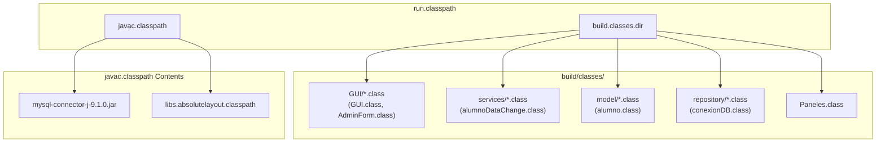
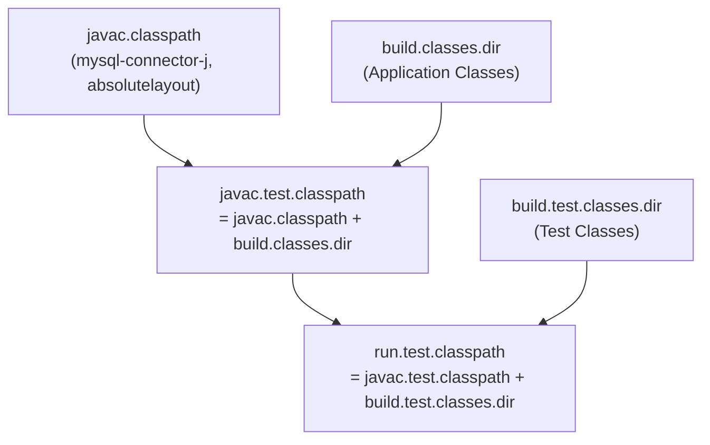
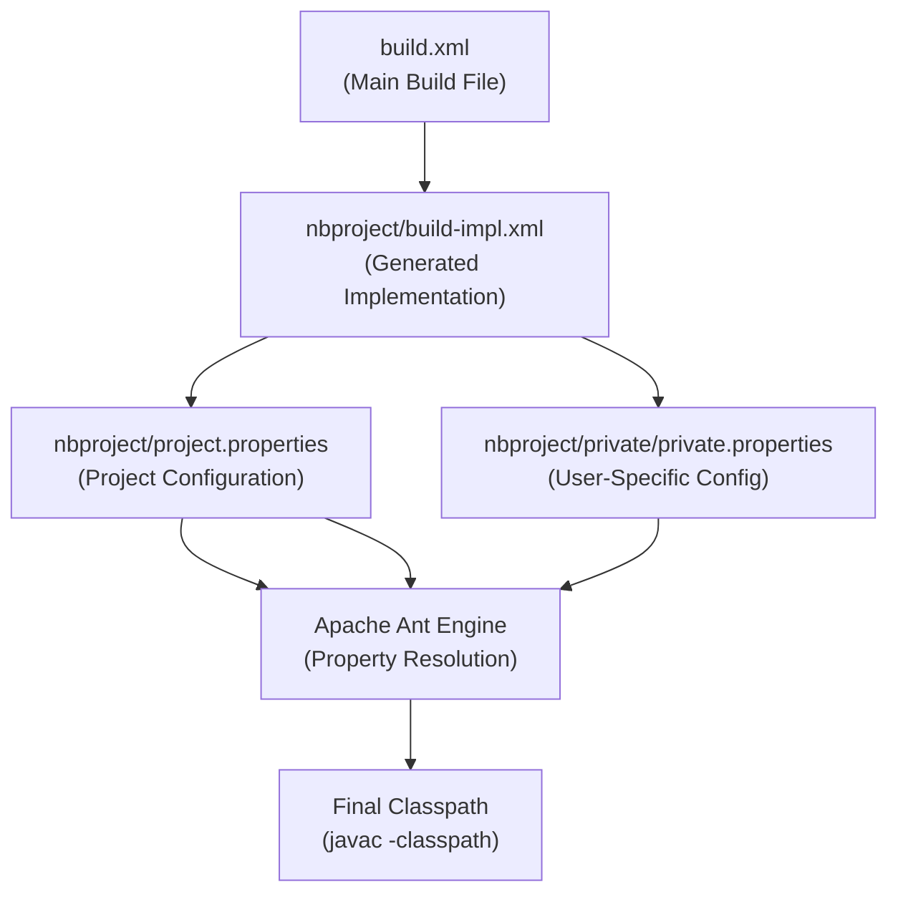

# Dependencies and Classpath

> **Relevant source files**
> * [build.xml](https://github.com/axchisan/Crud-MUUUy-simple-en-java-de-hace-a-os/blob/7ec3bd78/build.xml)
> * [nbproject/project.properties](https://github.com/axchisan/Crud-MUUUy-simple-en-java-de-hace-a-os/blob/7ec3bd78/nbproject/project.properties)

## Purpose and Scope

This page documents the external dependencies required by the crud3 application and how the classpath is configured for compilation, testing, and runtime execution. It covers the MySQL JDBC driver dependency, the NetBeans AbsoluteLayout library, and the various classpath configurations used throughout the build lifecycle.

For information about the overall build configuration and targets, see [Ant Build Configuration](/axchisan/Crud-MUUUy-simple-en-java-de-hace-a-os/7.1-ant-build-configuration). For details about JAR packaging and manifest configuration, see [JAR Packaging and Manifest](/axchisan/Crud-MUUUy-simple-en-java-de-hace-a-os/7.5-jar-packaging-and-manifest).

---

## External Dependencies

The crud3 application requires two external dependencies:

| Dependency | Version | Purpose | Configuration Location |
| --- | --- | --- | --- |
| MySQL Connector/J | 9.1.0 | JDBC driver for MySQL database connectivity | [nbproject/project.properties L36](https://github.com/axchisan/Crud-MUUUy-simple-en-java-de-hace-a-os/blob/7ec3bd78/nbproject/project.properties#L36-L36) |
| AbsoluteLayout | (NetBeans bundled) | GUI layout manager for Swing forms | [nbproject/project.properties L41](https://github.com/axchisan/Crud-MUUUy-simple-en-java-de-hace-a-os/blob/7ec3bd78/nbproject/project.properties#L41-L41) |

### MySQL Connector/J

The MySQL Connector/J library provides the JDBC driver implementation used by the `repository.conexionDB` class to establish database connections to the MySQL server.

**Configuration:**

```

```

This file reference points to the absolute path of the MySQL Connector JAR file on the developer's local filesystem. The driver class `com.mysql.cj.jdbc.Driver` is loaded at runtime by the connection manager.

**Related Code:**

* The `repository.conexionDB.conectar` method loads the MySQL driver using `Class.forName("com.mysql.cj.jdbc.Driver")`
* JDBC URL format: `jdbc:mysql://localhost:3306/colegio2`

**Sources:** [nbproject/project.properties L36](https://github.com/axchisan/Crud-MUUUy-simple-en-java-de-hace-a-os/blob/7ec3bd78/nbproject/project.properties#L36-L36)

### AbsoluteLayout Library

The AbsoluteLayout library is a NetBeans-bundled library used by the GUI Builder for positioning Swing components with absolute coordinates. It is referenced through NetBeans' library system.

**Configuration:**

```

```

This property resolves to the NetBeans library location for AbsoluteLayout, which is managed by the IDE's library infrastructure.

**Sources:** [nbproject/project.properties L41](https://github.com/axchisan/Crud-MUUUy-simple-en-java-de-hace-a-os/blob/7ec3bd78/nbproject/project.properties#L41-L41)

---

## Classpath Configuration Architecture

The following diagram illustrates how dependencies are resolved and included in various classpaths throughout the build and execution lifecycle:

**Diagram: Dependency and Classpath Resolution**

```

```

**Sources:** [nbproject/project.properties L36-L41](https://github.com/axchisan/Crud-MUUUy-simple-en-java-de-hace-a-os/blob/7ec3bd78/nbproject/project.properties#L36-L41)

 [nbproject/project.properties L52-L54](https://github.com/axchisan/Crud-MUUUy-simple-en-java-de-hace-a-os/blob/7ec3bd78/nbproject/project.properties#L52-L54)

 [nbproject/project.properties L82-L84](https://github.com/axchisan/Crud-MUUUy-simple-en-java-de-hace-a-os/blob/7ec3bd78/nbproject/project.properties#L82-L84)

 [nbproject/project.properties L91-L93](https://github.com/axchisan/Crud-MUUUy-simple-en-java-de-hace-a-os/blob/7ec3bd78/nbproject/project.properties#L91-L93)

---

## Compilation Classpath

The compilation classpath (`javac.classpath`) defines all dependencies required for compiling the application's Java source files. This classpath is used by the `javac` compiler during the compilation phase.

**Definition:**

```

```

**Components:**

| Component | Purpose | Resolution |
| --- | --- | --- |
| `${file.reference.mysql-connector-j-9.1.0.jar}` | MySQL JDBC driver | Absolute file path to JAR |
| `${libs.absolutelayout.classpath}` | NetBeans layout library | NetBeans library reference |

This classpath provides:

* Access to `com.mysql.cj.jdbc.*` classes for database connectivity
* Access to `org.netbeans.lib.awtextra.*` classes for GUI layout

**Build System Integration:**

The `javac.classpath` property is referenced by the Ant build system when executing the compile target. The generated [nbproject/build-impl.xml](https://github.com/axchisan/Crud-MUUUy-simple-en-java-de-hace-a-os/blob/7ec3bd78/nbproject/build-impl.xml)

 file includes this property in the `javac` task's `classpath` attribute.

**Sources:** [nbproject/project.properties L39-L41](https://github.com/axchisan/Crud-MUUUy-simple-en-java-de-hace-a-os/blob/7ec3bd78/nbproject/project.properties#L39-L41)

---

## Runtime Classpath

The runtime classpath (`run.classpath`) defines all classes and libraries required to execute the application. This extends the compilation classpath by adding the compiled application classes.

**Definition:**

```

```

**Diagram: Runtime Classpath Composition**



**Usage:**

The runtime classpath is used when:

* Executing the application via the `run` target
* Debugging the application via the `debug` target
* Running the application from NetBeans IDE

The main class `GUI.GUI` (specified in [nbproject/project.properties L77](https://github.com/axchisan/Crud-MUUUy-simple-en-java-de-hace-a-os/blob/7ec3bd78/nbproject/project.properties#L77-L77)

) is launched with this classpath, ensuring access to:

* All application classes in `build/classes/`
* MySQL JDBC driver for database operations
* AbsoluteLayout for GUI rendering

**Sources:** [nbproject/project.properties L82-L84](https://github.com/axchisan/Crud-MUUUy-simple-en-java-de-hace-a-os/blob/7ec3bd78/nbproject/project.properties#L82-L84)

 [nbproject/project.properties L7](https://github.com/axchisan/Crud-MUUUy-simple-en-java-de-hace-a-os/blob/7ec3bd78/nbproject/project.properties#L7-L7)

---

## Test Classpath Configuration

The test classpath configurations support compilation and execution of JUnit tests. Two separate classpaths are maintained for test compilation and test execution.

### Test Compilation Classpath

**Definition:**

```

```

This classpath is used when compiling test classes and provides access to:

* All production dependencies (MySQL Connector, AbsoluteLayout)
* Compiled application classes being tested
* JUnit framework classes (implicitly added by Ant)

### Test Execution Classpath

**Definition:**

```

```

This classpath extends the test compilation classpath by adding the compiled test classes from `build/test/classes/`, allowing JUnit to discover and execute test cases.

**Diagram: Test Classpath Hierarchy**



**Sources:** [nbproject/project.properties L52-L54](https://github.com/axchisan/Crud-MUUUy-simple-en-java-de-hace-a-os/blob/7ec3bd78/nbproject/project.properties#L52-L54)

 [nbproject/project.properties L91-L93](https://github.com/axchisan/Crud-MUUUy-simple-en-java-de-hace-a-os/blob/7ec3bd78/nbproject/project.properties#L91-L93)

---

## File Reference Mechanism

The crud3 project uses absolute file path references for external dependencies rather than a centralized dependency management system (e.g., Maven, Gradle). This approach is typical for NetBeans Ant-based projects.

### MySQL Connector File Reference

**Configuration:**

```

```

**Characteristics:**

| Aspect | Details |
| --- | --- |
| **Reference Type** | Absolute filesystem path |
| **Location** | Developer's Downloads directory |
| **Portability** | Not portable (requires manual configuration on different systems) |
| **Version Management** | Manual (filename includes version 9.1.0) |

**Portability Considerations:**

This file reference is machine-specific. To run the project on a different machine:

1. Download MySQL Connector/J JAR file
2. Update the file path in [nbproject/project.properties L36](https://github.com/axchisan/Crud-MUUUy-simple-en-java-de-hace-a-os/blob/7ec3bd78/nbproject/project.properties#L36-L36)
3. Rebuild the project

Alternatively, the JAR can be:

* Copied to a project-relative directory (e.g., `lib/`)
* Referenced using a relative path: `file.reference.mysql-connector-j-9.1.0.jar=lib/mysql-connector-j-9.1.0.jar`

### Library Reference Mechanism

The `${libs.absolutelayout.classpath}` property uses NetBeans' library management system, which resolves library locations based on IDE configuration. This provides better portability across NetBeans installations.

**Sources:** [nbproject/project.properties L36](https://github.com/axchisan/Crud-MUUUy-simple-en-java-de-hace-a-os/blob/7ec3bd78/nbproject/project.properties#L36-L36)

 [nbproject/project.properties L41](https://github.com/axchisan/Crud-MUUUy-simple-en-java-de-hace-a-os/blob/7ec3bd78/nbproject/project.properties#L41-L41)

---

## Build System Property Resolution

The Ant build system resolves classpath properties through a hierarchical property loading mechanism defined in [build.xml L12](https://github.com/axchisan/Crud-MUUUy-simple-en-java-de-hace-a-os/blob/7ec3bd78/build.xml#L12-L12)

 and the generated [nbproject/build-impl.xml](https://github.com/axchisan/Crud-MUUUy-simple-en-java-de-hace-a-os/blob/7ec3bd78/nbproject/build-impl.xml)

**Diagram: Property Resolution Flow**



**Resolution Order:**

1. Ant loads [build.xml](https://github.com/axchisan/Crud-MUUUy-simple-en-java-de-hace-a-os/blob/7ec3bd78/build.xml)
2. [build.xml L12](https://github.com/axchisan/Crud-MUUUy-simple-en-java-de-hace-a-os/blob/7ec3bd78/build.xml#L12-L12)  imports [nbproject/build-impl.xml](https://github.com/axchisan/Crud-MUUUy-simple-en-java-de-hace-a-os/blob/7ec3bd78/nbproject/build-impl.xml)
3. [nbproject/build-impl.xml](https://github.com/axchisan/Crud-MUUUy-simple-en-java-de-hace-a-os/blob/7ec3bd78/nbproject/build-impl.xml)  loads properties from: * [nbproject/project.properties](https://github.com/axchisan/Crud-MUUUy-simple-en-java-de-hace-a-os/blob/7ec3bd78/nbproject/project.properties)  (project-wide settings) * `nbproject/private/private.properties` (user-specific overrides)
4. Property references (e.g., `${file.reference.mysql-connector-j-9.1.0.jar}`) are resolved
5. Resolved classpath is passed to `javac` and `java` commands

**Sources:** [build.xml L12](https://github.com/axchisan/Crud-MUUUy-simple-en-java-de-hace-a-os/blob/7ec3bd78/build.xml#L12-L12)

 [nbproject/project.properties L39-L41](https://github.com/axchisan/Crud-MUUUy-simple-en-java-de-hace-a-os/blob/7ec3bd78/nbproject/project.properties#L39-L41)

---

## Classpath in JAR Distribution

When the application is packaged into a distributable JAR file (`dist/crud3.jar`), the classpath configuration affects how the JAR can be executed.

**Current Configuration:**

The project does not automatically bundle dependencies into the JAR file or configure a `Class-Path` manifest attribute. This means:

* The MySQL Connector JAR must be available on the classpath when executing `dist/crud3.jar`
* The JAR cannot be executed with `java -jar crud3.jar` without specifying the classpath

**Manual Execution:**

To run the distributed JAR:

```

```

**Alternative Approaches:**

To create a fully self-contained JAR:

1. **Bundle dependencies** by extracting JAR contents during the `-post-jar` target
2. **Configure manifest** with `Class-Path` attribute pointing to dependency JARs in `dist/lib/`
3. **Use a fat JAR plugin** to merge all dependencies into a single JAR

For more information on JAR packaging, see [JAR Packaging and Manifest](/axchisan/Crud-MUUUy-simple-en-java-de-hace-a-os/7.5-jar-packaging-and-manifest).

**Sources:** [nbproject/project.properties L31](https://github.com/axchisan/Crud-MUUUy-simple-en-java-de-hace-a-os/blob/7ec3bd78/nbproject/project.properties#L31-L31)

 [nbproject/project.properties L82-L84](https://github.com/axchisan/Crud-MUUUy-simple-en-java-de-hace-a-os/blob/7ec3bd78/nbproject/project.properties#L82-L84)

---

## Dependency Version Management

The crud3 project uses manual version management for external dependencies. Version information is embedded in file references rather than managed by a build tool.

### Current Dependency Versions

| Dependency | Version | Specified In |
| --- | --- | --- |
| MySQL Connector/J | 9.1.0 | Filename in [nbproject/project.properties L36](https://github.com/axchisan/Crud-MUUUy-simple-en-java-de-hace-a-os/blob/7ec3bd78/nbproject/project.properties#L36-L36) |
| AbsoluteLayout | (IDE-managed) | NetBeans library system |
| Java Platform | 21 | [nbproject/project.properties L50-L51](https://github.com/axchisan/Crud-MUUUy-simple-en-java-de-hace-a-os/blob/7ec3bd78/nbproject/project.properties#L50-L51) |

### Version Upgrade Process

To upgrade the MySQL Connector:

1. Download the new MySQL Connector JAR file
2. Update the file reference in [nbproject/project.properties L36](https://github.com/axchisan/Crud-MUUUy-simple-en-java-de-hace-a-os/blob/7ec3bd78/nbproject/project.properties#L36-L36)
3. Test database connectivity with the new driver
4. Rebuild and redeploy the application

**Example:**

```

```

**Sources:** [nbproject/project.properties L36](https://github.com/axchisan/Crud-MUUUy-simple-en-java-de-hace-a-os/blob/7ec3bd78/nbproject/project.properties#L36-L36)

 [nbproject/project.properties L39-L41](https://github.com/axchisan/Crud-MUUUy-simple-en-java-de-hace-a-os/blob/7ec3bd78/nbproject/project.properties#L39-L41)

 [nbproject/project.properties L50-L51](https://github.com/axchisan/Crud-MUUUy-simple-en-java-de-hace-a-os/blob/7ec3bd78/nbproject/project.properties#L50-L51)

---

## Summary

The crud3 application's dependency and classpath configuration demonstrates a traditional NetBeans Ant-based project structure:

* **External Dependencies**: MySQL Connector/J 9.1.0 and NetBeans AbsoluteLayout
* **File References**: Absolute paths for external JARs (portability limitation)
* **Classpath Hierarchy**: Compilation → Runtime → Test classpaths build upon each other
* **Build Integration**: Properties defined in [nbproject/project.properties](https://github.com/axchisan/Crud-MUUUy-simple-en-java-de-hace-a-os/blob/7ec3bd78/nbproject/project.properties)  and resolved by Ant
* **Distribution**: Requires manual classpath configuration when running the JAR

For information about how these dependencies are used at runtime, see [Database Connection (conexionDB)](/axchisan/Crud-MUUUy-simple-en-java-de-hace-a-os/6.1-database-connection-(conexiondb)). For details about the build targets that use these classpaths, see [Build Targets and Lifecycle](/axchisan/Crud-MUUUy-simple-en-java-de-hace-a-os/7.2-build-targets-and-lifecycle).

**Sources:** [nbproject/project.properties L36-L96](https://github.com/axchisan/Crud-MUUUy-simple-en-java-de-hace-a-os/blob/7ec3bd78/nbproject/project.properties#L36-L96)

 [build.xml L1-L74](https://github.com/axchisan/Crud-MUUUy-simple-en-java-de-hace-a-os/blob/7ec3bd78/build.xml#L1-L74)