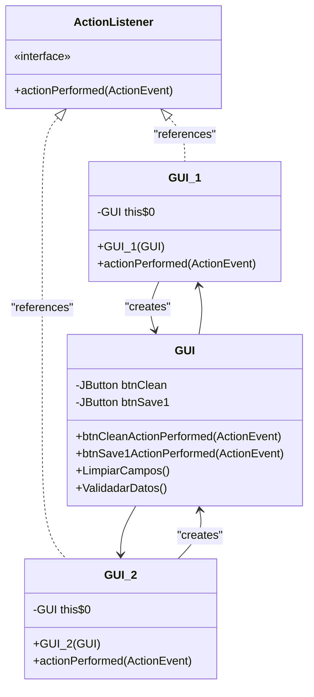
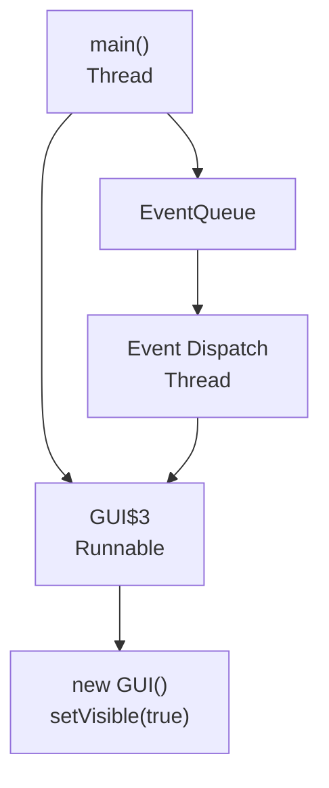

# Event Handling and Action Listeners

> **Relevant source files**
> * [build/classes/GUI/AdminForm$1.class](https://github.com/axchisan/Crud-MUUUy-simple-en-java-de-hace-a-os/blob/7ec3bd78/build/classes/GUI/AdminForm$1.class)
> * [build/classes/GUI/GUI$1.class](https://github.com/axchisan/Crud-MUUUy-simple-en-java-de-hace-a-os/blob/7ec3bd78/build/classes/GUI/GUI$1.class)
> * [build/classes/GUI/GUI$2.class](https://github.com/axchisan/Crud-MUUUy-simple-en-java-de-hace-a-os/blob/7ec3bd78/build/classes/GUI/GUI$2.class)
> * [build/classes/GUI/GUI$3.class](https://github.com/axchisan/Crud-MUUUy-simple-en-java-de-hace-a-os/blob/7ec3bd78/build/classes/GUI/GUI$3.class)
> * [src/GUI/GUI.java](https://github.com/axchisan/Crud-MUUUy-simple-en-java-de-hace-a-os/blob/7ec3bd78/src/GUI/GUI.java)

## Purpose and Scope

This document explains the event-driven architecture of the crud3 application, focusing on how user interactions with GUI components trigger application logic through Java Swing's event handling mechanism. It covers the implementation of `ActionListener` interfaces, the use of anonymous inner classes for event delegation, and the flow from user actions to business logic execution.

For detailed information about the GUI components that generate these events, see [Main Data Entry Form](/axchisan/Crud-MUUUy-simple-en-java-de-hace-a-os/4.1-main-data-entry-form-(gui.gui)). For the validation and field management logic invoked by event handlers, see [Input Validation](/axchisan/Crud-MUUUy-simple-en-java-de-hace-a-os/5.3-input-validation-(validadardatos)) and [Field Management](/axchisan/Crud-MUUUy-simple-en-java-de-hace-a-os/5.4-field-management-(limpiarcampos)). For technical details about the compiled anonymous inner class artifacts, see [Anonymous Inner Classes](/axchisan/Crud-MUUUy-simple-en-java-de-hace-a-os/8.3-anonymous-inner-classes).

---

## Event-Driven Architecture Overview

The crud3 application follows Java Swing's event-driven programming model, where user interactions with GUI components generate events that are processed by registered listeners.

```

```

**Sources:** [src/GUI/GUI.java L67-L93](https://github.com/axchisan/Crud-MUUUy-simple-en-java-de-hace-a-os/blob/7ec3bd78/src/GUI/GUI.java#L67-L93)

---

## ActionListener Registration

The `GUI` class registers `ActionListener` implementations for button components during initialization in the `initComponents()` method. Each button uses an anonymous inner class to implement the `ActionListener` interface.

### Clean Button Registration

[src/GUI/GUI.java L66-L72](https://github.com/axchisan/Crud-MUUUy-simple-en-java-de-hace-a-os/blob/7ec3bd78/src/GUI/GUI.java#L66-L72)

```

```

This creates an anonymous inner class (compiled as `GUI$1.class`) that implements `java.awt.event.ActionListener` and delegates to the `btnCleanActionPerformed()` method.

### Save Button Registration

[src/GUI/GUI.java L74-L80](https://github.com/axchisan/Crud-MUUUy-simple-en-java-de-hace-a-os/blob/7ec3bd78/src/GUI/GUI.java#L74-L80)

```

```

This creates a second anonymous inner class (compiled as `GUI$2.class`) that delegates to the `btnSave1ActionPerformed()` method.

**Sources:** [src/GUI/GUI.java L31-L85](https://github.com/axchisan/Crud-MUUUy-simple-en-java-de-hace-a-os/blob/7ec3bd78/src/GUI/GUI.java#L31-L85)

 [build/classes/GUI/GUI$1.class](https://github.com/axchisan/Crud-MUUUy-simple-en-java-de-hace-a-os/blob/7ec3bd78/build/classes/GUI/GUI$1.class)

 [build/classes/GUI/GUI$2.class](https://github.com/axchisan/Crud-MUUUy-simple-en-java-de-hace-a-os/blob/7ec3bd78/build/classes/GUI/GUI$2.class)

---

## Anonymous Inner Classes Structure

The anonymous inner classes generated by NetBeans follow a consistent pattern:

| Class Name | Purpose | Event Handler Method | Business Logic Method |
| --- | --- | --- | --- |
| `GUI$1` | Clean button listener | `btnCleanActionPerformed()` | `LimpiarCampos()` |
| `GUI$2` | Save button listener | `btnSave1ActionPerformed()` | `ValidadarDatos()` |
| `GUI$3` | Event dispatch thread runner | N/A | Creates and displays GUI |



Each anonymous inner class:

* Implements `java.awt.event.ActionListener`
* Holds a reference to the outer `GUI` class instance (`this$0`)
* Delegates `actionPerformed()` calls to the corresponding event handler method

**Sources:** [build/classes/GUI/GUI$1.class](https://github.com/axchisan/Crud-MUUUy-simple-en-java-de-hace-a-os/blob/7ec3bd78/build/classes/GUI/GUI$1.class)

 [build/classes/GUI/GUI$2.class](https://github.com/axchisan/Crud-MUUUy-simple-en-java-de-hace-a-os/blob/7ec3bd78/build/classes/GUI/GUI$2.class)

 [src/GUI/GUI.java L67-L80](https://github.com/axchisan/Crud-MUUUy-simple-en-java-de-hace-a-os/blob/7ec3bd78/src/GUI/GUI.java#L67-L80)

---

## Event Handler Methods

The `GUI` class defines two event handler methods that receive `ActionEvent` objects and execute business logic.

### btnCleanActionPerformed

[src/GUI/GUI.java L91-L93](https://github.com/axchisan/Crud-MUUUy-simple-en-java-de-hace-a-os/blob/7ec3bd78/src/GUI/GUI.java#L91-L93)

```

```

This handler is invoked when the Clean button is clicked. It delegates directly to `LimpiarCampos()`, which clears all text fields.

### btnSave1ActionPerformed

[src/GUI/GUI.java L87-L89](https://github.com/axchisan/Crud-MUUUy-simple-en-java-de-hace-a-os/blob/7ec3bd78/src/GUI/GUI.java#L87-L89)

```

```

This handler is invoked when the Save button is clicked. It delegates to `ValidadarDatos()`, which performs validation and database persistence.

**Sources:** [src/GUI/GUI.java L87-L93](https://github.com/axchisan/Crud-MUUUy-simple-en-java-de-hace-a-os/blob/7ec3bd78/src/GUI/GUI.java#L87-L93)

---

## Event Flow Sequence

The following diagram illustrates the complete event flow from user action to business logic execution:

```mermaid
sequenceDiagram
  participant User
  participant btnSave1
  participant (JButton)
  participant GUI$2
  participant (ActionListener)
  participant GUI
  participant btnSave1ActionPerformed
  participant ValidadarDatos
  participant alumnoDataChange

  User->>btnSave1: "Click Save"
  note over btnSave1,(JButton): "Button press generates
  btnSave1->>GUI$2: "actionPerformed(ActionEvent)"
  note over GUI$2,(ActionListener): "Anonymous inner class
  GUI$2->>btnSave1ActionPerformed: "Call event handler"
  btnSave1ActionPerformed->>ValidadarDatos: "Invoke validation"
  note over ValidadarDatos: "Validate input fields
  ValidadarDatos->>alumnoDataChange: "guardado(alumno)"
  alumnoDataChange-->>ValidadarDatos: "boolean result"
  ValidadarDatos->>GUI: "LimpiarCampos() if success"
  ValidadarDatos-->>User: "JOptionPane message"
```

**Key Steps:**

1. User clicks `btnSave1` button
2. Swing framework generates `ActionEvent` object
3. Event is dispatched to registered `GUI$2` listener
4. Listener's `actionPerformed()` method is called
5. Listener delegates to `btnSave1ActionPerformed()` handler
6. Handler invokes `ValidadarDatos()` validation method
7. Validation creates `alumno` object and calls `alumnoDataChange.guardado()`
8. On success, `LimpiarCampos()` is called to reset fields
9. User receives feedback via `JOptionPane` dialog

**Sources:** [src/GUI/GUI.java L87-L89](https://github.com/axchisan/Crud-MUUUy-simple-en-java-de-hace-a-os/blob/7ec3bd78/src/GUI/GUI.java#L87-L89)

 [src/GUI/GUI.java L143-L171](https://github.com/axchisan/Crud-MUUUy-simple-en-java-de-hace-a-os/blob/7ec3bd78/src/GUI/GUI.java#L143-L171)

---

## Event Dispatch Thread

The application uses the Event Dispatch Thread (EDT) for GUI initialization and display, following Swing's thread-safety requirements.

### Main Method EDT Usage

[src/GUI/GUI.java L123-L127](https://github.com/axchisan/Crud-MUUUy-simple-en-java-de-hace-a-os/blob/7ec3bd78/src/GUI/GUI.java#L123-L127)

```

```

This creates a third anonymous inner class (`GUI$3`) that implements `Runnable`. The `EventQueue.invokeLater()` method schedules the GUI creation and display on the EDT, ensuring thread-safe component initialization.



**Sources:** [src/GUI/GUI.java L98-L128](https://github.com/axchisan/Crud-MUUUy-simple-en-java-de-hace-a-os/blob/7ec3bd78/src/GUI/GUI.java#L98-L128)

 [build/classes/GUI/GUI$3.class](https://github.com/axchisan/Crud-MUUUy-simple-en-java-de-hace-a-os/blob/7ec3bd78/build/classes/GUI/GUI$3.class)

---

## AdminForm Event Handling

The `AdminForm` class follows the same event handling pattern as `GUI`, using an anonymous inner class for EDT initialization.

[build/classes/GUI/AdminForm$1.class](https://github.com/axchisan/Crud-MUUUy-simple-en-java-de-hace-a-os/blob/7ec3bd78/build/classes/GUI/AdminForm$1.class)

Similar to `GUI$3`, `AdminForm$1` is a `Runnable` implementation created for `EventQueue.invokeLater()` in the `AdminForm.main()` method, ensuring the administrative interface is created on the EDT.

**Sources:** [build/classes/GUI/AdminForm$1.class](https://github.com/axchisan/Crud-MUUUy-simple-en-java-de-hace-a-os/blob/7ec3bd78/build/classes/GUI/AdminForm$1.class)

---

## Event Handler to Business Logic Mapping

The following table summarizes the relationship between UI events, event handlers, and business logic methods:

| User Action | Button Component | Anonymous Class | Event Handler Method | Business Logic Method | Purpose |
| --- | --- | --- | --- | --- | --- |
| Click Save | `btnSave1` | `GUI$2` | `btnSave1ActionPerformed()` | `ValidadarDatos()` | Validate and persist student data |
| Click Clean | `btnClean` | `GUI$1` | `btnCleanActionPerformed()` | `LimpiarCampos()` | Clear all input fields |
| Launch GUI | N/A | `GUI$3` | N/A | `new GUI().setVisible(true)` | Initialize and display main form |
| Launch Admin | N/A | `AdminForm$1` | N/A | `new AdminForm().setVisible(true)` | Initialize and display admin form |

**Sources:** [src/GUI/GUI.java L67-L93](https://github.com/axchisan/Crud-MUUUy-simple-en-java-de-hace-a-os/blob/7ec3bd78/src/GUI/GUI.java#L67-L93)

 [src/GUI/GUI.java L143-L178](https://github.com/axchisan/Crud-MUUUy-simple-en-java-de-hace-a-os/blob/7ec3bd78/src/GUI/GUI.java#L143-L178)

---

## Event Handler Implementation Pattern

The event handling implementation follows a consistent pattern:

1. **Registration Phase** (in `initComponents()`): * Create anonymous `ActionListener` implementation * Register listener with component via `addActionListener()`
2. **Event Dispatch Phase** (runtime): * User interacts with component * Swing generates `ActionEvent` * Event delivered to registered listener
3. **Handler Execution Phase**: * Listener's `actionPerformed()` invoked * Delegate to named event handler method * Event handler invokes business logic
4. **Business Logic Phase**: * Validation, data manipulation, or service calls * UI updates (field clearing, focus management) * User feedback via `JOptionPane` dialogs

This separation of concerns keeps event registration, event handling, and business logic distinct, making the code maintainable and following Swing best practices.

**Sources:** [src/GUI/GUI.java L31-L93](https://github.com/axchisan/Crud-MUUUy-simple-en-java-de-hace-a-os/blob/7ec3bd78/src/GUI/GUI.java#L31-L93)

 [src/GUI/GUI.java L143-L178](https://github.com/axchisan/Crud-MUUUy-simple-en-java-de-hace-a-os/blob/7ec3bd78/src/GUI/GUI.java#L143-L178)