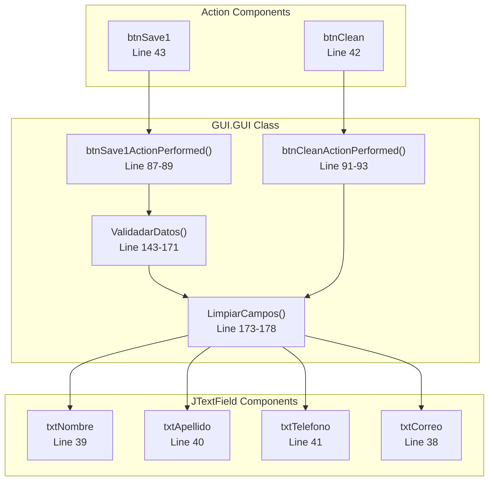
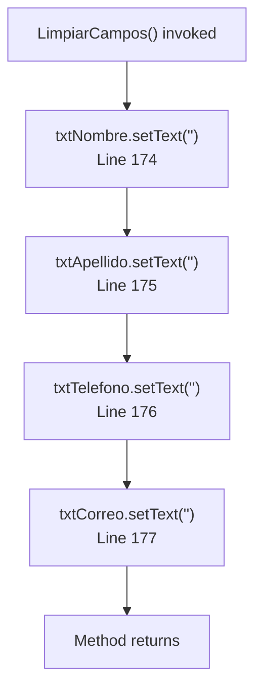
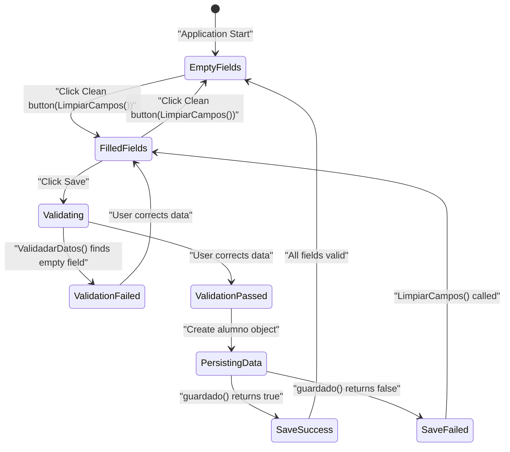
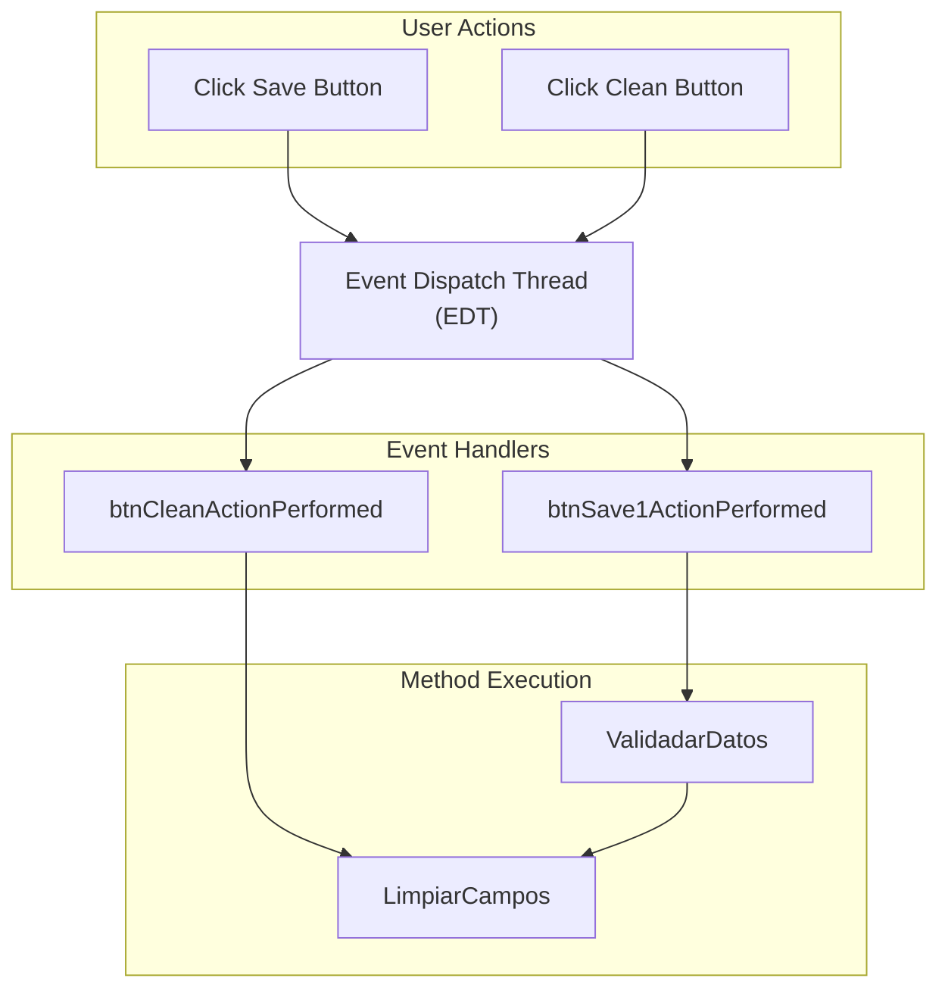

# Gestión de Campos (LimpiarCampos)

> **Archivos fuente relevantes**
> * [construir/clases/GUI/GUI.class](https://github.com/axchisan/Crud-MUUUy-simple-en-java-de-hace-a-os/blob/7ec3bd78/build/classes/GUI/GUI.class)
> * [src/GUI/GUI.java](https://github.com/axchisan/Crud-MUUUy-simple-en-java-de-hace-a-os/blob/7ec3bd78/src/GUI/GUI.java)

## Propósito y alcance

Esta página documenta la funcionalidad de vaciado de campos implementada por el `LimpiarCampos()`método en la `GUI.GUI`clase. Este método restablece todos los campos de entrada del formulario principal de entrada de datos a su estado vacío, proporcionando un borrón y cuenta nueva para nuevas operaciones de entrada de datos.

Para obtener información sobre la validación de entrada antes del envío de datos, consulte [Validación de Entrada (ValidadarDatos)](/axchisan/Crud-MUUUy-simple-en-java-de-hace-a-os/5.3-input-validation-(validadardatos)) . Para obtener más información sobre los componentes del formulario de entrada de datos, consulte [Formulario Principal de Entrada de Datos (GUI.GUI)](/axchisan/Crud-MUUUy-simple-en-java-de-hace-a-os/4.1-main-data-entry-form-(gui.gui)) .

**Fuentes:** [src/GUI/GUI.java L173-L178](https://github.com/axchisan/Crud-MUUUy-simple-en-java-de-hace-a-os/blob/7ec3bd78/src/GUI/GUI.java#L173-L178)

---

## Descripción general

El `LimpiarCampos()`método es una función de utilidad que borra los cuatro campos de entrada de datos del estudiante en el formulario principal de la interfaz gráfica de usuario. Tiene dos propósitos principales:

1. **Limpieza posterior al guardado** : borrado automático de campos después de una persistencia de datos exitosa
2. **Reinicio manual** : permite a los usuarios borrar explícitamente el formulario mediante el botón Limpiar

El método opera en los siguientes componentes del campo de texto:

* `txtNombre`(nombre del estudiante)
* `txtApellido`(apellido del estudiante)
* `txtTelefono`(número de teléfono)
* `txtCorreo`(dirección de correo electrónico)

**Fuentes:** [src/GUI/GUI.java L173-L178](https://github.com/axchisan/Crud-MUUUy-simple-en-java-de-hace-a-os/blob/7ec3bd78/src/GUI/GUI.java#L173-L178)

 [src/GUI/GUI.java L37-L41](https://github.com/axchisan/Crud-MUUUy-simple-en-java-de-hace-a-os/blob/7ec3bd78/src/GUI/GUI.java#L37-L41)

---

## Firma e implementación del método

### Declaración de método

```
public void LimpiarCampos()
```

El método se declara como público, sin parámetros ni valor de retorno. Manipula directamente el estado de los campos del componente GUI.

**Fuentes:** [src/GUI/GUI.java L173](https://github.com/axchisan/Crud-MUUUy-simple-en-java-de-hace-a-os/blob/7ec3bd78/src/GUI/GUI.java#L173-L173)

### Detalles de implementación

El método ejecuta cuatro `setText("")`operaciones secuenciales para borrar cada campo de texto:

| Variable de campo | Etiqueta de IU | Número de línea | Objetivo |
| --- | --- | --- | --- |
| `txtNombre` | nombre | 174 | Borra el nombre del estudiante |
| `txtApellido` | apellido | 175 | Borra el apellido del estudiante |
| `txtTelefono` | teléfono | 176 | Borra el número de teléfono |
| `txtCorreo` | Correo | 177 | Borra la dirección de correo electrónico |

La implementación del método es sencilla: establece `JTextField`la propiedad de texto de cada componente en una cadena vacía ( `""`), lo que elimina cualquier contenido existente y devuelve el campo a su estado vacío inicial.

**Fuentes:** [src/GUI/GUI.java L174-L177](https://github.com/axchisan/Crud-MUUUy-simple-en-java-de-hace-a-os/blob/7ec3bd78/src/GUI/GUI.java#L174-L177)

 [src/GUI/GUI.java L38-L41](https://github.com/axchisan/Crud-MUUUy-simple-en-java-de-hace-a-os/blob/7ec3bd78/src/GUI/GUI.java#L38-L41)

---

## Escenarios de uso

### Escenario 1: Borrado automático posterior al guardado

```mermaid
sequenceDiagram
  participant User
  participant btnSave1 Button
  participant ValidadarDatos()
  participant alumnoDataChange
  participant LimpiarCampos()
  participant Text Fields

  User->>btnSave1 Button: "Click Save"
  btnSave1 Button->>ValidadarDatos(): "btnSave1ActionPerformed(evt)"
  note over ValidadarDatos(): "Validation passes"
  ValidadarDatos()->>alumnoDataChange: "guardado(alum)"
  alumnoDataChange-->>ValidadarDatos(): "return true"
  ValidadarDatos()->>LimpiarCampos(): "Call method"
  LimpiarCampos()->>Text Fields: "setText("") on all fields"
  Text Fields-->>User: "Fields cleared"
```

Cuando los datos se guardan correctamente en la base de datos, `LimpiarCampos()`se invoca automáticamente desde el `ValidadarDatos()`método. Esto ocurre en[src/GUI/GUI.java L164](https://github.com/axchisan/Crud-MUUUy-simple-en-java-de-hace-a-os/blob/7ec3bd78/src/GUI/GUI.java#L164-L164)

 only when `alumnoDataChange.guardado(alum)` returns `true`, indicating successful persistence.

**Sources:** [src/GUI/GUI.java L162-L165](https://github.com/axchisan/Crud-MUUUy-simple-en-java-de-hace-a-os/blob/7ec3bd78/src/GUI/GUI.java#L162-L165)

### Scenario 2: Manual User-Initiated Clearing

```sql
"Text Fields""LimpiarCampos()""btnCleanActionPerformed(evt)""btnClean Button"User"Text Fields""LimpiarCampos()""btnCleanActionPerformed(evt)""btnClean Button"User#mermaid-09ljpkuxzc1c{font-family:ui-sans-serif,-apple-system,system-ui,Segoe UI,Helvetica;font-size:16px;fill:#333;}@keyframes edge-animation-frame{from{stroke-dashoffset:0;}}@keyframes dash{to{stroke-dashoffset:0;}}#mermaid-09ljpkuxzc1c .edge-animation-slow{stroke-dasharray:9,5!important;stroke-dashoffset:900;animation:dash 50s linear infinite;stroke-linecap:round;}#mermaid-09ljpkuxzc1c .edge-animation-fast{stroke-dasharray:9,5!important;stroke-dashoffset:900;animation:dash 20s linear infinite;stroke-linecap:round;}#mermaid-09ljpkuxzc1c .error-icon{fill:#dddddd;}#mermaid-09ljpkuxzc1c .error-text{fill:#222222;stroke:#222222;}#mermaid-09ljpkuxzc1c .edge-thickness-normal{stroke-width:1px;}#mermaid-09ljpkuxzc1c .edge-thickness-thick{stroke-width:3.5px;}#mermaid-09ljpkuxzc1c .edge-pattern-solid{stroke-dasharray:0;}#mermaid-09ljpkuxzc1c .edge-thickness-invisible{stroke-width:0;fill:none;}#mermaid-09ljpkuxzc1c .edge-pattern-dashed{stroke-dasharray:3;}#mermaid-09ljpkuxzc1c .edge-pattern-dotted{stroke-dasharray:2;}#mermaid-09ljpkuxzc1c .marker{fill:#999;stroke:#999;}#mermaid-09ljpkuxzc1c .marker.cross{stroke:#999;}#mermaid-09ljpkuxzc1c svg{font-family:ui-sans-serif,-apple-system,system-ui,Segoe UI,Helvetica;font-size:16px;}#mermaid-09ljpkuxzc1c p{margin:0;}#mermaid-09ljpkuxzc1c .actor{stroke:#cccccc;fill:#ffffff;}#mermaid-09ljpkuxzc1c text.actor>tspan{fill:#333;stroke:none;}#mermaid-09ljpkuxzc1c .actor-line{stroke:#cccccc;}#mermaid-09ljpkuxzc1c .messageLine0{stroke-width:1.5;stroke-dasharray:none;stroke:#999999;}#mermaid-09ljpkuxzc1c .messageLine1{stroke-width:1.5;stroke-dasharray:2,2;stroke:#999999;}#mermaid-09ljpkuxzc1c #arrowhead path{fill:#999999;stroke:#999999;}#mermaid-09ljpkuxzc1c .sequenceNumber{fill:#666666;}#mermaid-09ljpkuxzc1c #sequencenumber{fill:#999999;}#mermaid-09ljpkuxzc1c #crosshead path{fill:#999999;stroke:#999999;}#mermaid-09ljpkuxzc1c .messageText{fill:#333333;stroke:none;}#mermaid-09ljpkuxzc1c .labelBox{stroke:#dddddd;fill:#ffffff;}#mermaid-09ljpkuxzc1c .labelText,#mermaid-09ljpkuxzc1c .labelText>tspan{fill:#333;stroke:none;}#mermaid-09ljpkuxzc1c .loopText,#mermaid-09ljpkuxzc1c .loopText>tspan{fill:#333;stroke:none;}#mermaid-09ljpkuxzc1c .loopLine{stroke-width:2px;stroke-dasharray:2,2;stroke:#dddddd;fill:#dddddd;}#mermaid-09ljpkuxzc1c .note{stroke:#e6d280;fill:#fff5ad;}#mermaid-09ljpkuxzc1c .noteText,#mermaid-09ljpkuxzc1c .noteText>tspan{fill:#333;stroke:none;}#mermaid-09ljpkuxzc1c .activation0{fill:hsl(-120, 0%, 91.7647058824%);stroke:hsl(-120, 0%, 81.7647058824%);}#mermaid-09ljpkuxzc1c .activation1{fill:hsl(-120, 0%, 91.7647058824%);stroke:hsl(-120, 0%, 81.7647058824%);}#mermaid-09ljpkuxzc1c .activation2{fill:hsl(-120, 0%, 91.7647058824%);stroke:hsl(-120, 0%, 81.7647058824%);}#mermaid-09ljpkuxzc1c .actorPopupMenu{position:absolute;}#mermaid-09ljpkuxzc1c .actorPopupMenuPanel{position:absolute;fill:#ffffff;box-shadow:0px 8px 16px 0px rgba(0,0,0,0.2);filter:drop-shadow(3px 5px 2px rgb(0 0 0 / 0.4));}#mermaid-09ljpkuxzc1c .actor-man line{stroke:#cccccc;fill:#ffffff;}#mermaid-09ljpkuxzc1c .actor-man circle,#mermaid-09ljpkuxzc1c line{stroke:#cccccc;fill:#ffffff;stroke-width:2px;}#mermaid-09ljpkuxzc1c :root{--mermaid-font-family:"trebuchet ms",verdana,arial,sans-serif;}"Click Clean""ActionListener triggered""Direct invocation""setText("") on all fields""Fields cleared"
```

Users can explicitly clear all fields at any time by clicking the Clean button. This triggers the `btnCleanActionPerformed()` event handler at [src/GUI/GUI.java L91-L93](https://github.com/axchisan/Crud-MUUUy-simple-en-java-de-hace-a-os/blob/7ec3bd78/src/GUI/GUI.java#L91-L93)

 which directly invokes `LimpiarCampos()`.

**Sources:** [src/GUI/GUI.java L91-L93](https://github.com/axchisan/Crud-MUUUy-simple-en-java-de-hace-a-os/blob/7ec3bd78/src/GUI/GUI.java#L91-L93)

 [src/GUI/GUI.java L66-L72](https://github.com/axchisan/Crud-MUUUy-simple-en-java-de-hace-a-os/blob/7ec3bd78/src/GUI/GUI.java#L66-L72)

---

## Integration with GUI Components

### Field Management Architecture



The diagram illustrates how `LimpiarCampos()` serves as a central field management utility, invoked from two distinct entry points and affecting all four input text fields.

**Sources:** [src/GUI/GUI.java L87-L93](https://github.com/axchisan/Crud-MUUUy-simple-en-java-de-hace-a-os/blob/7ec3bd78/src/GUI/GUI.java#L87-L93)

 [src/GUI/GUI.java L143-L171](https://github.com/axchisan/Crud-MUUUy-simple-en-java-de-hace-a-os/blob/7ec3bd78/src/GUI/GUI.java#L143-L171)

 [src/GUI/GUI.java L173-L178](https://github.com/axchisan/Crud-MUUUy-simple-en-java-de-hace-a-os/blob/7ec3bd78/src/GUI/GUI.java#L173-L178)

---

## Field Clearing Operation Flow



The method executes sequentially, clearing each field in order. There is no error handling or conditional logic; all four fields are unconditionally cleared on every invocation.

**Sources:** [src/GUI/GUI.java L174-L177](https://github.com/axchisan/Crud-MUUUy-simple-en-java-de-hace-a-os/blob/7ec3bd78/src/GUI/GUI.java#L174-L177)

---

## Method Invocation Points

### Direct Invocation Table

| Invoking Method | Line Number | Context | Condition |
| --- | --- | --- | --- |
| `btnCleanActionPerformed(evt)` | 92 | User clicks Clean button | Unconditional |
| `ValidadarDatos()` | 164 | After data validation | Conditional: `if (guardar)` |

**Sources:** [src/GUI/GUI.java L92](https://github.com/axchisan/Crud-MUUUy-simple-en-java-de-hace-a-os/blob/7ec3bd78/src/GUI/GUI.java#L92-L92)

 [src/GUI/GUI.java L164](https://github.com/axchisan/Crud-MUUUy-simple-en-java-de-hace-a-os/blob/7ec3bd78/src/GUI/GUI.java#L164-L164)

---

## State Management Implications

### Pre-Clearing State

Before `LimpiarCampos()` executes:

* Text fields contain user-entered data or previous values
* GUI state reflects the last interaction (successful save or user input)

### Post-Clearing State

After `LimpiarCampos()` executes:

* All four text fields contain empty strings (`""`)
* No validation errors remain visible (cleared by field reset)
* Form is ready for new data entry
* No data is persisted or lost (clearing only affects UI state)

**Sources:** [src/GUI/GUI.java L173-L178](https://github.com/axchisan/Crud-MUUUy-simple-en-java-de-hace-a-os/blob/7ec3bd78/src/GUI/GUI.java#L173-L178)

---

## Relationship to Validation Workflow



The state diagram shows that `LimpiarCampos()` serves as the state transition mechanism from "Filled Fields" to "Empty Fields" state, occurring either after successful save or via explicit user action.

**Sources:** [src/GUI/GUI.java L143-L171](https://github.com/axchisan/Crud-MUUUy-simple-en-java-de-hace-a-os/blob/7ec3bd78/src/GUI/GUI.java#L143-L171)

 [src/GUI/GUI.java L91-L93](https://github.com/axchisan/Crud-MUUUy-simple-en-java-de-hace-a-os/blob/7ec3bd78/src/GUI/GUI.java#L91-L93)

 [src/GUI/GUI.java L173-L178](https://github.com/axchisan/Crud-MUUUy-simple-en-java-de-hace-a-os/blob/7ec3bd78/src/GUI/GUI.java#L173-L178)

---

## Code Location Reference

### Primary Implementation

* **Method Definition**: [src/GUI/GUI.java L173-L178](https://github.com/axchisan/Crud-MUUUy-simple-en-java-de-hace-a-os/blob/7ec3bd78/src/GUI/GUI.java#L173-L178)
* **Class**: `GUI.GUI`
* **Package**: `GUI`
* **Access Modifier**: `public`
* **Return Type**: `void`

### Invocation Locations

* **Manual Clear Handler**: [src/GUI/GUI.java L91-L93](https://github.com/axchisan/Crud-MUUUy-simple-en-java-de-hace-a-os/blob/7ec3bd78/src/GUI/GUI.java#L91-L93)
* **Post-Save Clear**: [src/GUI/GUI.java L164](https://github.com/axchisan/Crud-MUUUy-simple-en-java-de-hace-a-os/blob/7ec3bd78/src/GUI/GUI.java#L164-L164)

### Related Components

* **Text Field Declarations**: [src/GUI/GUI.java L138-L141](https://github.com/axchisan/Crud-MUUUy-simple-en-java-de-hace-a-os/blob/7ec3bd78/src/GUI/GUI.java#L138-L141)
* **Button Declarations**: [src/GUI/GUI.java L131-L132](https://github.com/axchisan/Crud-MUUUy-simple-en-java-de-hace-a-os/blob/7ec3bd78/src/GUI/GUI.java#L131-L132)
* **Validation Method**: [src/GUI/GUI.java L143-L171](https://github.com/axchisan/Crud-MUUUy-simple-en-java-de-hace-a-os/blob/7ec3bd78/src/GUI/GUI.java#L143-L171)

**Sources:** [src/GUI/GUI.java L1-L180](https://github.com/axchisan/Crud-MUUUy-simple-en-java-de-hace-a-os/blob/7ec3bd78/src/GUI/GUI.java#L1-L180)

---

## Design Characteristics

### Method Properties

| Property | Value | Explanation |
| --- | --- | --- |
| **Complexity** | O(1) | Four constant-time operations |
| **Side Effects** | Yes | Modifies GUI component state |
| **Dependencies** | Zero | No external service calls |
| **Exception Handling** | None | No try-catch blocks |
| **Synchronization** | Not required | Executes on EDT thread |

### Design Rationale

The `LimpiarCampos()` method follows several design principles:

1. **Single Responsibility**: Method has one clear purpose—clearing form fields
2. **No Business Logic**: Pure UI state manipulation without validation or persistence concerns
3. **Reusability**: Shared between automatic (post-save) and manual (button click) clearing scenarios
4. **Simplicidad** : Implementación sencilla sin lógica condicional

**Fuentes:** [src/GUI/GUI.java L173-L178](https://github.com/axchisan/Crud-MUUUy-simple-en-java-de-hace-a-os/blob/7ec3bd78/src/GUI/GUI.java#L173-L178)

---

## Modelo de subprocesamiento de eventos



Todas las invocaciones `LimpiarCampos()`ocurren en el hilo de despacho de eventos (EDT), lo que garantiza una manipulación de componentes GUI segura para subprocesos según lo requiere el modelo de subprocesos de Swing.

**Fuentes:** [src/GUI/GUI.java L67-L79](https://github.com/axchisan/Crud-MUUUy-simple-en-java-de-hace-a-os/blob/7ec3bd78/src/GUI/GUI.java#L67-L79)

 [src/GUI/GUI.java L87-L93](https://github.com/axchisan/Crud-MUUUy-simple-en-java-de-hace-a-os/blob/7ec3bd78/src/GUI/GUI.java#L87-L93)

---

## Comparación con funcionalidades relacionadas

| Aspecto | `LimpiarCampos()` | `ValidadarDatos()` |
| --- | --- | --- |
| **Objetivo** | Borrar campos de formulario | Validar y conservar datos |
| **Interacción de campo** | Escribe (establece en "") | Lee (obtiene texto) |
| **Comentarios de los usuarios** | Ninguno (funcionamiento silencioso) | Mensajes de JOptionPane |
| **Lógica de negocios** | No | Sí (validación + persistencia) |
| **Valor de retorno** | vacío | booleano |
| **Líneas de código** | 6 | 29 |

**Fuentes:** [src/GUI/GUI.java L143-L171](https://github.com/axchisan/Crud-MUUUy-simple-en-java-de-hace-a-os/blob/7ec3bd78/src/GUI/GUI.java#L143-L171)

 [src/GUI/GUI.java L173-L178](https://github.com/axchisan/Crud-MUUUy-simple-en-java-de-hace-a-os/blob/7ec3bd78/src/GUI/GUI.java#L173-L178)