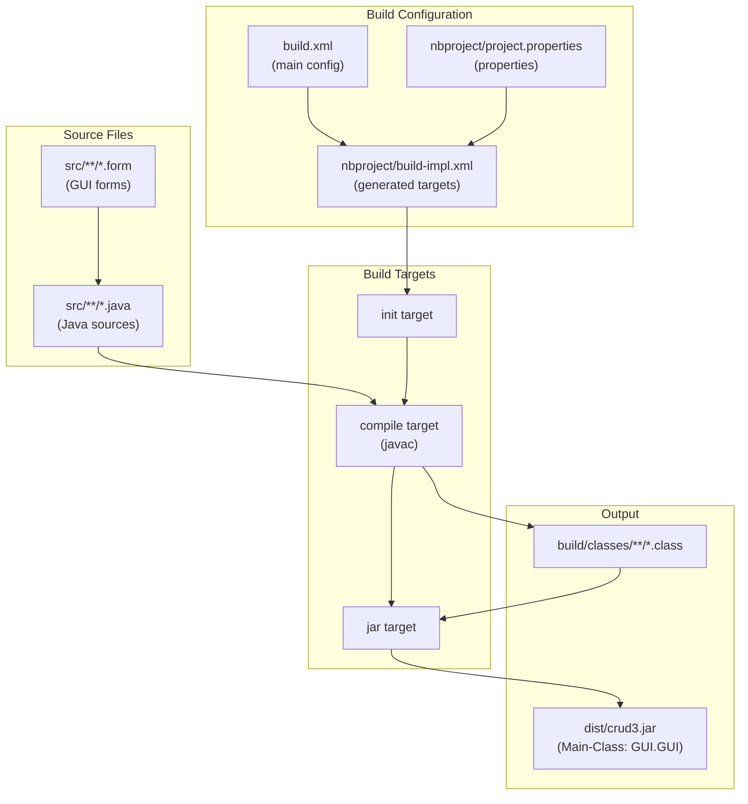

# Getting Started

> **Relevant source files**
> * [build.xml](https://github.com/axchisan/Crud-MUUUy-simple-en-java-de-hace-a-os/blob/7ec3bd78/build.xml)
> * [build/classes/repository/conexionDB.class](https://github.com/axchisan/Crud-MUUUy-simple-en-java-de-hace-a-os/blob/7ec3bd78/build/classes/repository/conexionDB.class)
> * [nbproject/project.properties](https://github.com/axchisan/Crud-MUUUy-simple-en-java-de-hace-a-os/blob/7ec3bd78/nbproject/project.properties)

This document provides practical instructions for setting up, building, and running the crud3 student management application. It covers the prerequisite software, database configuration, build process using Apache Ant, and application execution.

For detailed information about specific setup components, see [Prerequisites and Setup](/axchisan/Crud-MUUUy-simple-en-java-de-hace-a-os/2.1-prerequisites-and-setup). For comprehensive build system documentation, see [Build System](/axchisan/Crud-MUUUy-simple-en-java-de-hace-a-os/7-build-system). For architecture details, see [Architecture](/axchisan/Crud-MUUUy-simple-en-java-de-hace-a-os/3-architecture).

---

## Overview

The crud3 application is a Java Swing-based desktop application that requires:

* Java Development Kit (JDK) 21
* MySQL database server
* MySQL Connector/J JDBC driver
* Apache Ant build tool (or NetBeans IDE)

The application connects to a MySQL database named `colegio2` and provides a graphical interface for managing student records in the `alumnoss` table.

**Sources:**

* nbproject/project.properties:50-51, 77
* build/classes/repository/conexionDB.class:4-5

---

## Setup Workflow

```

```

**Sources:**

* nbproject/project.properties:36, 50-51, 77
* build.xml:10-12
* build/classes/repository/conexionDB.class:4-5

---

## Prerequisites

### Required Software

| Component | Version | Purpose |
| --- | --- | --- |
| JDK | 21 | Java compilation and runtime (`javac.source` and `javac.target`) |
| MySQL Server | 5.7+ | Database backend for `colegio2` database |
| MySQL Connector/J | 9.1.0 | JDBC driver for database connectivity |
| Apache Ant | 1.9+ | Build automation (alternative: NetBeans IDE) |

The Java version is specified in [nbproject/project.properties L50-L51](https://github.com/axchisan/Crud-MUUUy-simple-en-java-de-hace-a-os/blob/7ec3bd78/nbproject/project.properties#L50-L51)

**Sources:**

* nbproject/project.properties:50-51, 36

### Project Dependencies

The application requires the MySQL Connector/J library. The library path is configured as a file reference:

```
file.reference.mysql-connector-j-9.1.0.jar=/home/axchisan/Downloads/mysql-connector-j-9.1.0/mysql-connector-j-9.1.0.jar
```

You must update this path in [nbproject/project.properties L36](https://github.com/axchisan/Crud-MUUUy-simple-en-java-de-hace-a-os/blob/7ec3bd78/nbproject/project.properties#L36-L36)

 to match your local installation.

For detailed prerequisites and setup instructions, see [Prerequisites and Setup](/axchisan/Crud-MUUUy-simple-en-java-de-hace-a-os/2.1-prerequisites-and-setup).

**Sources:**

* nbproject/project.properties:36, 39-41

---

## Database Configuration

### Database Schema

The application requires a MySQL database named `colegio2` with an `alumnoss` table. The database connection parameters are hardcoded in the `repository.conexionDB` class:

* **JDBC URL:** `jdbc:mysql://localhost:3306/colegio2`
* **Username:** `root`
* **Password:** (empty string)
* **Driver:** `com.mysql.cj.jdbc.Driver`

These values are visible in the compiled class file [build/classes/repository/conexionDB.class L4-L5](https://github.com/axchisan/Crud-MUUUy-simple-en-java-de-hace-a-os/blob/7ec3bd78/build/classes/repository/conexionDB.class#L4-L5)

### Table Structure

The `alumnoss` table should contain the following columns:

* `id` - Primary key (auto-increment)
* `nombre` - Student first name (VARCHAR)
* `apellido` - Student last name (VARCHAR)
* `telefono` - Phone number (VARCHAR)
* `correo` - Email address (VARCHAR)

For complete database schema documentation, see [Database Schema](/axchisan/Crud-MUUUy-simple-en-java-de-hace-a-os/6.2-database-schema).

**Sources:**

* build/classes/repository/conexionDB.class:4-5

---

## Building the Application

### Using Apache Ant

The project uses Ant as its build system. The main build configuration is in [build.xml L10-L12](https://github.com/axchisan/Crud-MUUUy-simple-en-java-de-hace-a-os/blob/7ec3bd78/build.xml#L10-L12)

 which imports the generated NetBeans build implementation.

#### Build Commands

```

```

The build process produces:

* Compiled classes in `build/classes/`
* Distributable JAR in `dist/crud3.jar`

#### Build Process Flow



**Sources:**

* build.xml:10-12
* nbproject/project.properties:7, 10, 30-31

### Using NetBeans IDE

If using NetBeans, simply open the project and select:

* **Build Project (F11)** - Compiles and packages the JAR
* **Clean and Build** - Removes old artifacts and rebuilds
* **Run Project (F6)** - Builds and executes the application

For detailed build system documentation, see [Building the Project](/axchisan/Crud-MUUUy-simple-en-java-de-hace-a-os/2.2-building-the-project) and [Build System](/axchisan/Crud-MUUUy-simple-en-java-de-hace-a-os/7-build-system).

**Sources:**

* build.xml:1-12

---

## Running the Application

### Command-Line Execution

After building the JAR, execute the application:

```

```

The main class `GUI.GUI` is specified in the JAR manifest and will launch automatically.

### Execution Flow

```

```

**Sources:**

* nbproject/project.properties:77
* build/classes/repository/conexionDB.class:2-5

### Main Class Configuration

The main class is configured in [nbproject/project.properties L77](https://github.com/axchisan/Crud-MUUUy-simple-en-java-de-hace-a-os/blob/7ec3bd78/nbproject/project.properties#L77-L77)

:

```
main.class=GUI.GUI
```

This property is used by Ant to generate the JAR manifest with the correct `Main-Class` entry.

For detailed execution instructions, see [Running the Application](/axchisan/Crud-MUUUy-simple-en-java-de-hace-a-os/2.3-running-the-application).

**Sources:**

* nbproject/project.properties:77, 82-84

---

## Verification

### Confirming Successful Setup

After launching the application, verify the setup:

1. **GUI Launch**: The main window should display with input fields for: * `txtNombre` (nombre field) * `txtApellido` (apellido field) * `txtTelefono` (telefono field) * `txtCorreo` (Correo field)
2. **Database Connectivity**: Enter test data and click the save button. If the database connection is successful, you should see a success message dialog.
3. **Data Persistence**: Verify data is saved by querying the MySQL database: ``` ```

### Troubleshooting Common Issues

| Issue | Possible Cause | Solution |
| --- | --- | --- |
| ClassNotFoundException: com.mysql.cj.jdbc.Driver | MySQL Connector/J not in classpath | Update `file.reference` in project.properties and rebuild |
| Cannot connect to database | MySQL not running or wrong credentials | Verify MySQL server is running on localhost:3306 |
| Main class not found | Incorrect build or corrupted JAR | Run `ant clean jar` to rebuild |
| Java version mismatch | Wrong JDK version | Ensure JDK 21 is installed and JAVA_HOME is set correctly |

**Sources:**

* nbproject/project.properties:36, 50-51, 77
* build/classes/repository/conexionDB.class:4-5

---

## Next Steps

After successfully setting up and running the application:

* Review [Architecture](/axchisan/Crud-MUUUy-simple-en-java-de-hace-a-os/3-architecture) to understand the system design
* Explore [User Interface Layer](/axchisan/Crud-MUUUy-simple-en-java-de-hace-a-os/4-user-interface-layer) to learn about GUI components
* Study [Data Access Layer](/axchisan/Crud-MUUUy-simple-en-java-de-hace-a-os/6-data-access-layer) for database operations
* Examine [Build System](/axchisan/Crud-MUUUy-simple-en-java-de-hace-a-os/7-build-system) for advanced build configuration

For step-by-step setup details, proceed to [Prerequisites and Setup](/axchisan/Crud-MUUUy-simple-en-java-de-hace-a-os/2.1-prerequisites-and-setup).

**Sources:**

* build.xml:1-12
* nbproject/project.properties:36, 50-51, 77