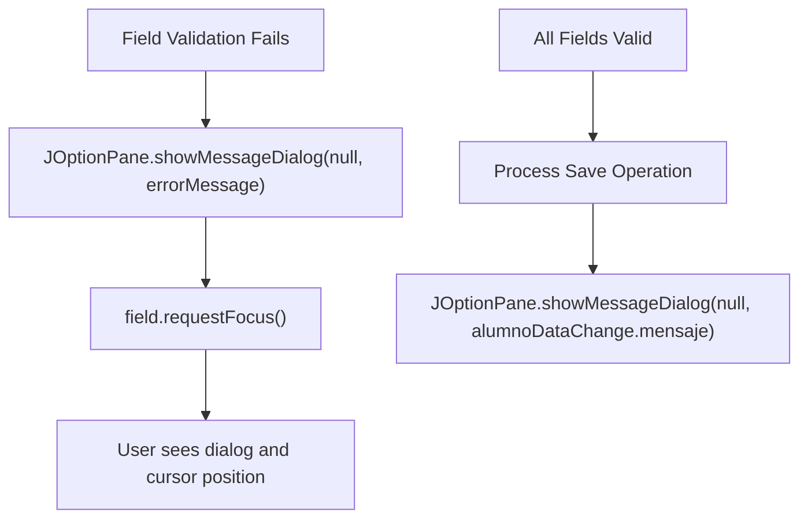
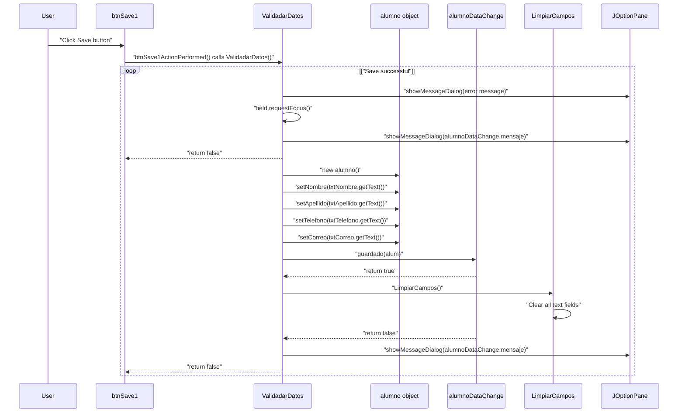
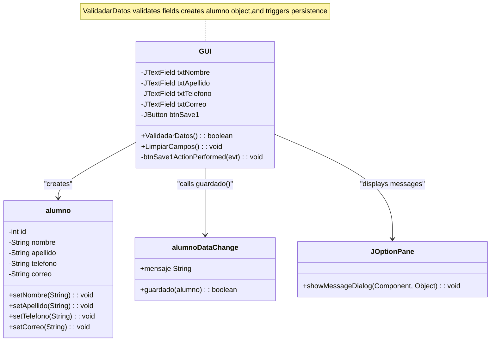

# Input Validation (ValidadarDatos)

> **Relevant source files**
> * [build/classes/GUI/GUI.class](https://github.com/axchisan/Crud-MUUUy-simple-en-java-de-hace-a-os/blob/7ec3bd78/build/classes/GUI/GUI.class)
> * [src/GUI/GUI.java](https://github.com/axchisan/Crud-MUUUy-simple-en-java-de-hace-a-os/blob/7ec3bd78/src/GUI/GUI.java)

## Purpose and Scope

This page documents the client-side input validation logic implemented in the `ValidadarDatos` method within the main GUI form. This validation ensures that all required student data fields are populated before attempting to persist data to the database. The validation logic is triggered when the user clicks the Save button.

For information about the actual data persistence after validation passes, see [Data Change Service (alumnoDataChange)](/axchisan/Crud-MUUUy-simple-en-java-de-hace-a-os/5.2-data-change-service-(alumnodatachange)). For field clearing functionality, see [Field Management (LimpiarCampos)](/axchisan/Crud-MUUUy-simple-en-java-de-hace-a-os/5.4-field-management-(limpiarcampos)).

**Sources:** [src/GUI/GUI.java L143-L171](https://github.com/axchisan/Crud-MUUUy-simple-en-java-de-hace-a-os/blob/7ec3bd78/src/GUI/GUI.java#L143-L171)

---

## Method Overview

The `ValidadarDatos` method is a public boolean method defined in the `GUI.GUI` class that performs sequential validation of all input fields before creating and persisting a student record.

| Property | Value |
| --- | --- |
| **Method Name** | `ValidadarDatos` |
| **Return Type** | `boolean` |
| **Access Modifier** | `public` |
| **Location** | `GUI.GUI` class |
| **Invoked By** | `btnSave1ActionPerformed` event handler |

**Note:** The method currently always returns `false` regardless of validation success or failure. This appears to be a design oversight, as the return value is not used by the calling code.

**Sources:** [src/GUI/GUI.java L143](https://github.com/axchisan/Crud-MUUUy-simple-en-java-de-hace-a-os/blob/7ec3bd78/src/GUI/GUI.java#L143-L143)

 [src/GUI/GUI.java L87-L89](https://github.com/axchisan/Crud-MUUUy-simple-en-java-de-hace-a-os/blob/7ec3bd78/src/GUI/GUI.java#L87-L89)

---

## Validation Flow

The validation process follows a sequential check pattern where each field is validated in order. If a field fails validation, the process stops and provides immediate feedback to the user.

```

```

**Sources:** [src/GUI/GUI.java L143-L171](https://github.com/axchisan/Crud-MUUUy-simple-en-java-de-hace-a-os/blob/7ec3bd78/src/GUI/GUI.java#L143-L171)

---

## Field Validation Rules

The validation applies a consistent rule across all four input fields: each field must contain at least one non-whitespace character. The validation uses `String.trim().isEmpty()` to check for empty or whitespace-only input.

| Field Name | GUI Component | Validation Rule | Error Message (Spanish) | Focus Behavior |
| --- | --- | --- | --- | --- |
| **Nombre** | `txtNombre` | Must not be empty after trimming | "por favor complete el campo del nombre" | Focus returns to `txtNombre` |
| **Apellido** | `txtApellido` | Must not be empty after trimming | "por favor complete el campo del apellido" | Focus returns to `txtApellido` |
| **Telefono** | `txtTelefono` | Must not be empty after trimming | "por favor complete el campo del telefono" | Focus returns to `txtTelefono` |
| **Correo** | `txtCorreo` | Must not be empty after trimming | "por favor complete el campo del correo" | Focus returns to `txtCorreo` |

### Validation Order

The fields are validated in this specific order:

1. `txtNombre` (lines 144-146)
2. `txtApellido` (lines 147-149)
3. `txtTelefono` (lines 150-152)
4. `txtCorreo` (lines 153-155)

This sequential validation means that if the first field is empty, subsequent fields are not checked until the user corrects the first error.

**Sources:** [src/GUI/GUI.java L144-L155](https://github.com/axchisan/Crud-MUUUy-simple-en-java-de-hace-a-os/blob/7ec3bd78/src/GUI/GUI.java#L144-L155)

---

## Error Handling and User Feedback

The validation method provides immediate user feedback through two mechanisms: modal dialogs and keyboard focus management.



### Dialog Display Mechanism

All user feedback is displayed using `JOptionPane.showMessageDialog`:

```
JOptionPane.showMessageDialog(null, message)
```

The first parameter (`null`) indicates the dialog has no parent window, making it modal to the entire application. The second parameter is the message string.

### Focus Management

When a validation error occurs, the system automatically sets keyboard focus to the problematic field using `requestFocus()`:

```
txtNombre.requestFocus()
```

This allows the user to immediately begin correcting the error without using the mouse.

### Final Status Message

Regardless of validation outcome, the method always displays `alumnoDataChange.mensaje` at line 168. This message is set by the `alumnoDataChange.guardado` method and contains either:

* A success message if the data was persisted
* An error message if the database operation failed
* The previous message content if validation failed before reaching the save operation

**Sources:** [src/GUI/GUI.java L145](https://github.com/axchisan/Crud-MUUUy-simple-en-java-de-hace-a-os/blob/7ec3bd78/src/GUI/GUI.java#L145-L145)

 [src/GUI/GUI.java L146](https://github.com/axchisan/Crud-MUUUy-simple-en-java-de-hace-a-os/blob/7ec3bd78/src/GUI/GUI.java#L146-L146)

 [src/GUI/GUI.java L168](https://github.com/axchisan/Crud-MUUUy-simple-en-java-de-hace-a-os/blob/7ec3bd78/src/GUI/GUI.java#L168-L168)

---

## Integration with Save Workflow

The validation method serves as a gateway in the complete save workflow, bridging the UI layer and the business logic layer.



### Event Handler Trigger

The validation is invoked by the Save button's action listener:

```

```

The return value from `ValidadarDatos` is not used by the event handler.

**Sources:** [src/GUI/GUI.java L87-L89](https://github.com/axchisan/Crud-MUUUy-simple-en-java-de-hace-a-os/blob/7ec3bd78/src/GUI/GUI.java#L87-L89)

 [src/GUI/GUI.java L143-L171](https://github.com/axchisan/Crud-MUUUy-simple-en-java-de-hace-a-os/blob/7ec3bd78/src/GUI/GUI.java#L143-L171)

---

## Implementation Details

### Data Model Creation

When validation passes, the method creates an `alumno` object and populates it with data from the text fields:

| Line | Operation | Description |
| --- | --- | --- |
| 157 | `alumno alum = new alumno()` | Instantiate new student model |
| 158 | `alum.setNombre(txtNombre.getText())` | Set nombre property |
| 159 | `alum.setApellido(txtApellido.getText())` | Set apellido property |
| 160 | `alum.setTelefono(txtTelefono.getText())` | Set telefono property |
| 161 | `alum.setCorreo(txtCorreo.getText())` | Set correo property |

Note that the raw text from `getText()` is used (not trimmed) when populating the model, even though trimmed values are checked during validation.

### Persistence Call

Line 162 invokes the business logic layer to persist the data:

```

```

The `guardar` boolean indicates whether the database operation succeeded. If `true`, the fields are cleared by calling `LimpiarCampos()` at line 164.

### Design Considerations

**Validation Granularity:** The validation only checks for empty fields. It does not validate:

* Format of email addresses (correo field)
* Format or length of phone numbers (telefono field)
* Character types or special characters in any field
* Maximum length constraints

**Language:** All error messages are in Spanish, matching the variable names (nombre, apellido, telefono, correo).

**Return Value:** The method always returns `false` at line 169, regardless of whether validation and save operations succeeded. This return value is not utilized by the calling code.

**Sources:** [src/GUI/GUI.java L157-L165](https://github.com/axchisan/Crud-MUUUy-simple-en-java-de-hace-a-os/blob/7ec3bd78/src/GUI/GUI.java#L157-L165)

 [src/GUI/GUI.java L169](https://github.com/axchisan/Crud-MUUUy-simple-en-java-de-hace-a-os/blob/7ec3bd78/src/GUI/GUI.java#L169-L169)

---

## Code Structure Summary



**Sources:** [src/GUI/GUI.java L15](https://github.com/axchisan/Crud-MUUUy-simple-en-java-de-hace-a-os/blob/7ec3bd78/src/GUI/GUI.java#L15-L15)

 [src/GUI/GUI.java L37-L42](https://github.com/axchisan/Crud-MUUUy-simple-en-java-de-hace-a-os/blob/7ec3bd78/src/GUI/GUI.java#L37-L42)

 [src/GUI/GUI.java L143-L171](https://github.com/axchisan/Crud-MUUUy-simple-en-java-de-hace-a-os/blob/7ec3bd78/src/GUI/GUI.java#L143-L171)