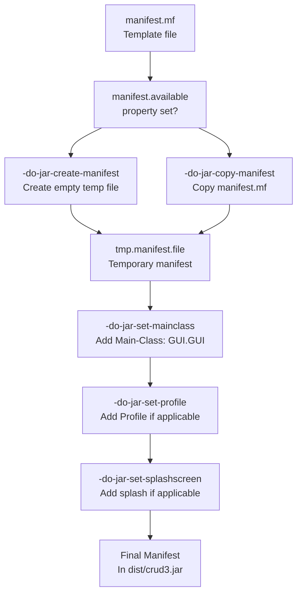
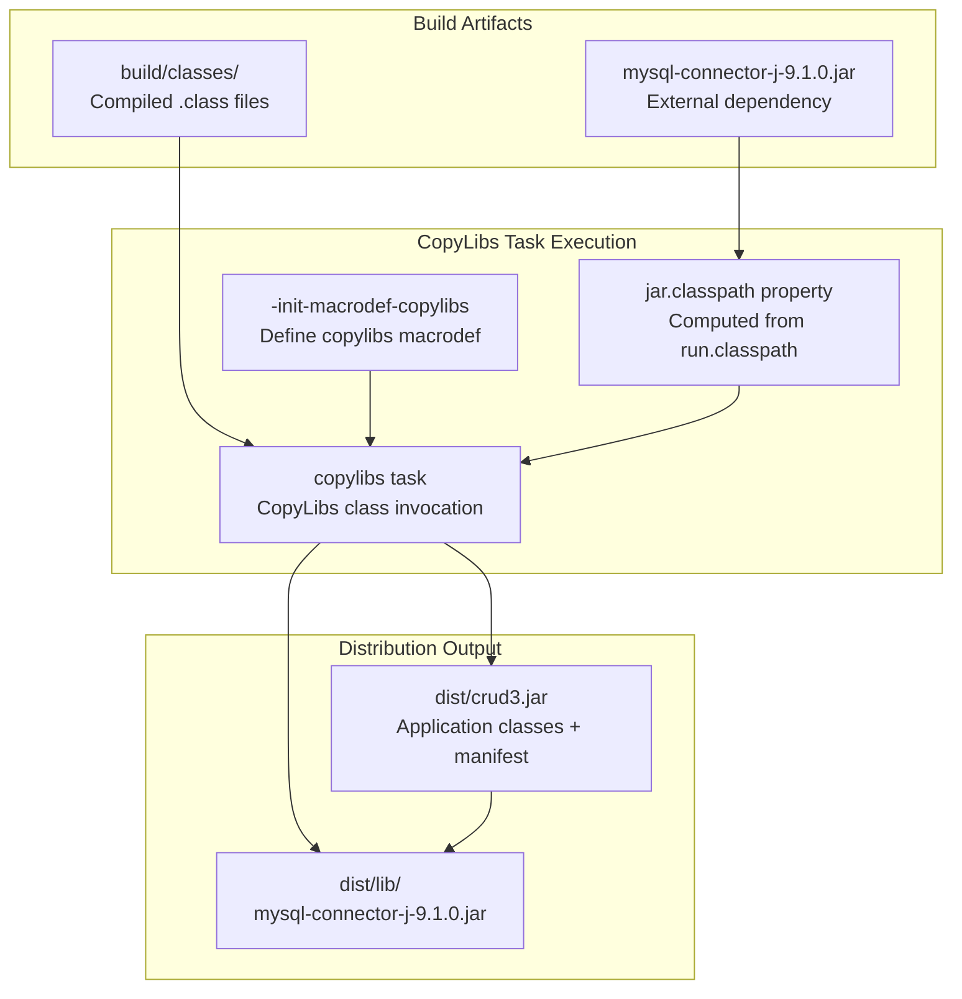
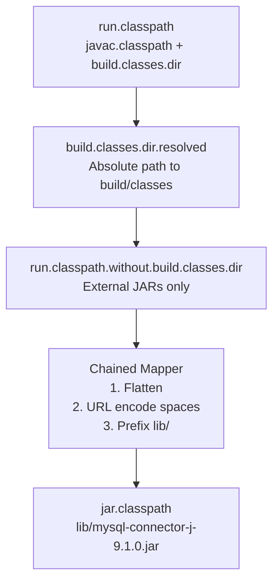

# JAR Packaging and Manifest

> **Relevant source files**
> * [manifest.mf](https://github.com/axchisan/Crud-MUUUy-simple-en-java-de-hace-a-os/blob/7ec3bd78/manifest.mf)
> * [nbproject/build-impl.xml](https://github.com/axchisan/Crud-MUUUy-simple-en-java-de-hace-a-os/blob/7ec3bd78/nbproject/build-impl.xml)
> * [nbproject/project.properties](https://github.com/axchisan/Crud-MUUUy-simple-en-java-de-hace-a-os/blob/7ec3bd78/nbproject/project.properties)

This page documents the JAR packaging process for the crud3 application, including manifest configuration, library bundling, and the creation of the executable distribution JAR. For information about the broader build system and targets, see [Ant Build Configuration](/axchisan/Crud-MUUUy-simple-en-java-de-hace-a-os/7.1-ant-build-configuration). For details on dependencies and classpath configuration, see [Dependencies and Classpath](/axchisan/Crud-MUUUy-simple-en-java-de-hace-a-os/7.4-dependencies-and-classpath).

## Overview

The crud3 application is packaged as an executable JAR file located at `dist/crud3.jar`. The packaging process involves manifest generation, class file collection, and library bundling using the NetBeans CopyLibs task. The manifest specifies `GUI.GUI` as the main entry point and includes a classpath reference to the bundled MySQL Connector/J library.

**Sources:** [manifest.mf L1-L4](https://github.com/axchisan/Crud-MUUUy-simple-en-java-de-hace-a-os/blob/7ec3bd78/manifest.mf#L1-L4)

 [nbproject/project.properties L31](https://github.com/axchisan/Crud-MUUUy-simple-en-java-de-hace-a-os/blob/7ec3bd78/nbproject/project.properties#L31-L31)

 [nbproject/project.properties L77](https://github.com/axchisan/Crud-MUUUy-simple-en-java-de-hace-a-os/blob/7ec3bd78/nbproject/project.properties#L77-L77)

## Manifest File Structure

The project includes a manifest template at the root level that serves as the basis for JAR manifest generation:

```
Manifest-Version: 1.0
X-COMMENT: Main-Class will be added automatically by build
```

The template is minimal by design. The `Main-Class` attribute and other runtime attributes are injected automatically during the build process by Ant targets.

**Sources:** [manifest.mf L1-L4](https://github.com/axchisan/Crud-MUUUy-simple-en-java-de-hace-a-os/blob/7ec3bd78/manifest.mf#L1-L4)

## JAR Build Target Sequence

```

```

The JAR packaging follows a multi-stage pipeline with conditional branching based on whether the CopyLibs task is available (which it is for this project). The `do.mkdist` property determines whether libraries are bundled with the JAR.

**Sources:** [nbproject/build-impl.xml L1131-L1258](https://github.com/axchisan/Crud-MUUUy-simple-en-java-de-hace-a-os/blob/7ec3bd78/nbproject/build-impl.xml#L1131-L1258)

## Manifest Generation Process



The manifest generation process checks for the existence of `manifest.mf` using the `manifest.available` property. If present, the file is copied to a temporary location; otherwise, an empty manifest is created. Subsequent targets progressively add attributes to the temporary manifest before it is embedded into the final JAR.

**Sources:** [nbproject/build-impl.xml L123](https://github.com/axchisan/Crud-MUUUy-simple-en-java-de-hace-a-os/blob/7ec3bd78/nbproject/build-impl.xml#L123-L123)

 [nbproject/build-impl.xml L1158-L1183](https://github.com/axchisan/Crud-MUUUy-simple-en-java-de-hace-a-os/blob/7ec3bd78/nbproject/build-impl.xml#L1158-L1183)

## Main Class Configuration

The `Main-Class` manifest attribute is set through a combination of property configuration and Ant target execution:

| Configuration Element | Value | Location |
| --- | --- | --- |
| Property definition | `main.class=GUI.GUI` | [nbproject/project.properties L77](https://github.com/axchisan/Crud-MUUUy-simple-en-java-de-hace-a-os/blob/7ec3bd78/nbproject/project.properties#L77-L77) |
| Manifest attribute injection | `-do-jar-set-mainclass` target | [nbproject/build-impl.xml L1166-L1170](https://github.com/axchisan/Crud-MUUUy-simple-en-java-de-hace-a-os/blob/7ec3bd78/nbproject/build-impl.xml#L1166-L1170) |
| Condition check | `do.archive+main.class.available` | [nbproject/build-impl.xml L163-L168](https://github.com/axchisan/Crud-MUUUy-simple-en-java-de-hace-a-os/blob/7ec3bd78/nbproject/build-impl.xml#L163-L168) |

The `-do-jar-set-mainclass` target uses the Ant `<manifest>` task to add the `Main-Class` attribute:

```

```

This configuration allows the JAR to be executed directly via `java -jar dist/crud3.jar`, which will invoke the `main` method of `GUI.GUI`.

**Sources:** [nbproject/project.properties L77](https://github.com/axchisan/Crud-MUUUy-simple-en-java-de-hace-a-os/blob/7ec3bd78/nbproject/project.properties#L77-L77)

 [nbproject/build-impl.xml L1166-L1170](https://github.com/axchisan/Crud-MUUUy-simple-en-java-de-hace-a-os/blob/7ec3bd78/nbproject/build-impl.xml#L1166-L1170)

 [nbproject/build-impl.xml L132-L139](https://github.com/axchisan/Crud-MUUUy-simple-en-java-de-hace-a-os/blob/7ec3bd78/nbproject/build-impl.xml#L132-L139)

## Library Bundling with CopyLibs

The crud3 application uses the NetBeans CopyLibs task to bundle the MySQL Connector/J library with the application JAR. This creates a self-contained distribution with dependencies in a `lib/` subdirectory.



The CopyLibs macrodef is defined in the `-init-macrodef-copylibs` target and invoked by the `-do-jar-copylibs` target when the `do.mkdist` condition is true.

**Sources:** [nbproject/build-impl.xml L987-L1016](https://github.com/axchisan/Crud-MUUUy-simple-en-java-de-hace-a-os/blob/7ec3bd78/nbproject/build-impl.xml#L987-L1016)

 [nbproject/build-impl.xml L1198-L1203](https://github.com/axchisan/Crud-MUUUy-simple-en-java-de-hace-a-os/blob/7ec3bd78/nbproject/build-impl.xml#L1198-L1203)

 [nbproject/build-impl.xml L1184-L1197](https://github.com/axchisan/Crud-MUUUy-simple-en-java-de-hace-a-os/blob/7ec3bd78/nbproject/build-impl.xml#L1184-L1197)

## CopyLibs Task Configuration

The `copylibs` macrodef configures several aspects of library bundling:

```

```

Key configuration properties:

| Property | Value | Purpose |
| --- | --- | --- |
| `jar.compress` | `false` | Disable JAR compression |
| `jar.index` | `false` | Disable JAR index creation |
| `copylibs.rebase` | `true` | Copy libraries to `lib/` subdirectory |
| `jar.classpath` | `lib/mysql-connector-j-9.1.0.jar` | Manifest Class-Path value |

The `jar.classpath` property is computed from `run.classpath` by extracting external JARs and prefixing them with `lib/`.

**Sources:** [nbproject/build-impl.xml L1008-L1014](https://github.com/axchisan/Crud-MUUUy-simple-en-java-de-hace-a-os/blob/7ec3bd78/nbproject/build-impl.xml#L1008-L1014)

 [nbproject/project.properties L38](https://github.com/axchisan/Crud-MUUUy-simple-en-java-de-hace-a-os/blob/7ec3bd78/nbproject/project.properties#L38-L38)

 [nbproject/build-impl.xml L259-L261](https://github.com/axchisan/Crud-MUUUy-simple-en-java-de-hace-a-os/blob/7ec3bd78/nbproject/build-impl.xml#L259-L261)

 [nbproject/build-impl.xml L997-L1006](https://github.com/axchisan/Crud-MUUUy-simple-en-java-de-hace-a-os/blob/7ec3bd78/nbproject/build-impl.xml#L997-L1006)

## Classpath Property Computation



The classpath computation removes the `build.classes.dir` from `run.classpath`, flattens the remaining paths (removing directory structure), URL-encodes spaces, and prefixes each entry with `lib/`. This produces the relative classpath value that is embedded in the manifest's `Class-Path` attribute.

**Sources:** [nbproject/build-impl.xml L992-L1006](https://github.com/axchisan/Crud-MUUUy-simple-en-java-de-hace-a-os/blob/7ec3bd78/nbproject/build-impl.xml#L992-L1006)

 [nbproject/project.properties L82-L84](https://github.com/axchisan/Crud-MUUUy-simple-en-java-de-hace-a-os/blob/7ec3bd78/nbproject/project.properties#L82-L84)

## Distribution JAR Structure

The final distribution JAR created at `dist/crud3.jar` has the following structure:

```
dist/
├── crud3.jar
│   ├── META-INF/
│   │   └── MANIFEST.MF (with Main-Class: GUI.GUI, Class-Path: lib/...)
│   ├── GUI/
│   │   ├── GUI.class
│   │   ├── GUI$1.class
│   │   ├── GUI$2.class
│   │   ├── AdminForm.class
│   │   └── ...
│   ├── model/
│   │   └── alumno.class
│   ├── services/
│   │   └── alumnoDataChange.class
│   ├── repository/
│   │   └── conexionDB.class
│   └── Paneles.class
└── lib/
    └── mysql-connector-j-9.1.0.jar
```

The JAR is executable via:

```

```

The JVM reads the `Main-Class` attribute from the manifest, loads `GUI.GUI`, and executes its `main` method. The `Class-Path` attribute ensures the MySQL connector is available on the runtime classpath.

**Sources:** [nbproject/project.properties L31](https://github.com/axchisan/Crud-MUUUy-simple-en-java-de-hace-a-os/blob/7ec3bd78/nbproject/project.properties#L31-L31)

 [nbproject/project.properties L77](https://github.com/axchisan/Crud-MUUUy-simple-en-java-de-hace-a-os/blob/7ec3bd78/nbproject/project.properties#L77-L77)

 [nbproject/build-impl.xml L1200-L1202](https://github.com/axchisan/Crud-MUUUy-simple-en-java-de-hace-a-os/blob/7ec3bd78/nbproject/build-impl.xml#L1200-L1202)

## Manifest Attributes Reference

The final manifest embedded in `dist/crud3.jar` contains the following attributes:

| Attribute | Value | Added By |
| --- | --- | --- |
| `Manifest-Version` | `1.0` | Template [manifest.mf L1](https://github.com/axchisan/Crud-MUUUy-simple-en-java-de-hace-a-os/blob/7ec3bd78/manifest.mf#L1-L1) |
| `Main-Class` | `GUI.GUI` | [nbproject/build-impl.xml L1168](https://github.com/axchisan/Crud-MUUUy-simple-en-java-de-hace-a-os/blob/7ec3bd78/nbproject/build-impl.xml#L1168-L1168) |
| `Class-Path` | `lib/mysql-connector-j-9.1.0.jar` | [nbproject/build-impl.xml L1011](https://github.com/axchisan/Crud-MUUUy-simple-en-java-de-hace-a-os/blob/7ec3bd78/nbproject/build-impl.xml#L1011-L1011) |

Optional attributes (not used by this project):

* `Profile` - Java SE profile specification (added if `javac.profile` is set)
* `SplashScreen-Image` - Splash screen image path (added if `application.splash` is set)

**Sources:** [manifest.mf L1-L4](https://github.com/axchisan/Crud-MUUUy-simple-en-java-de-hace-a-os/blob/7ec3bd78/manifest.mf#L1-L4)

 [nbproject/build-impl.xml L1166-L1183](https://github.com/axchisan/Crud-MUUUy-simple-en-java-de-hace-a-os/blob/7ec3bd78/nbproject/build-impl.xml#L1166-L1183)

 [nbproject/build-impl.xml L1011](https://github.com/axchisan/Crud-MUUUy-simple-en-java-de-hace-a-os/blob/7ec3bd78/nbproject/build-impl.xml#L1011-L1011)

## Build Property Reference

Key properties that control JAR packaging:

| Property | Default Value | Purpose |
| --- | --- | --- |
| `dist.jar` | `${dist.dir}/crud3.jar` | Output JAR path |
| `dist.dir` | `dist` | Distribution directory |
| `main.class` | `GUI.GUI` | Entry point class |
| `manifest.file` | `manifest.mf` | Manifest template path |
| `jar.compress` | `false` | Enable/disable JAR compression |
| `jar.index` | `false` | Enable/disable JAR index |
| `mkdist.disabled` | `false` | Disable CopyLibs bundling |

These properties can be customized in `nbproject/project.properties` or `nbproject/private/private.properties` to alter packaging behavior.

**Sources:** [nbproject/project.properties L30-L31](https://github.com/axchisan/Crud-MUUUy-simple-en-java-de-hace-a-os/blob/7ec3bd78/nbproject/project.properties#L30-L31)

 [nbproject/project.properties L77-L78](https://github.com/axchisan/Crud-MUUUy-simple-en-java-de-hace-a-os/blob/7ec3bd78/nbproject/project.properties#L77-L78)

 [nbproject/project.properties L38](https://github.com/axchisan/Crud-MUUUy-simple-en-java-de-hace-a-os/blob/7ec3bd78/nbproject/project.properties#L38-L38)

 [nbproject/project.properties L80](https://github.com/axchisan/Crud-MUUUy-simple-en-java-de-hace-a-os/blob/7ec3bd78/nbproject/project.properties#L80-L80)

## Command-Line Usage

After building the JAR via `ant jar`, the application can be executed without Ant:

```

```

The build system prints this usage information after successful JAR creation:

```python
To run this application from the command line without Ant, try:
java -jar "/path/to/crud3/dist/crud3.jar"
```

This message is generated by the `-do-jar-copylibs` target after the JAR is successfully packaged.

**Sources:** [nbproject/build-impl.xml L1200-L1202](https://github.com/axchisan/Crud-MUUUy-simple-en-java-de-hace-a-os/blob/7ec3bd78/nbproject/build-impl.xml#L1200-L1202)