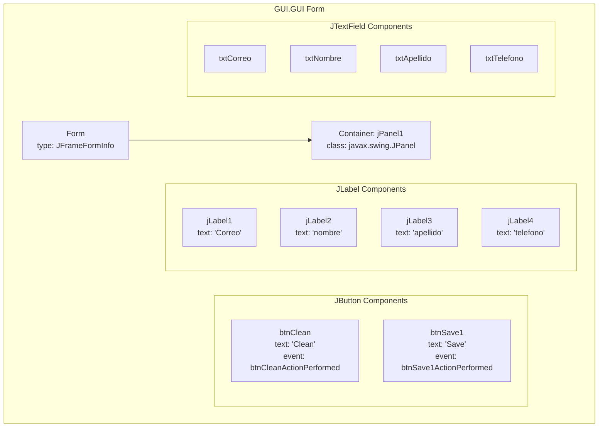
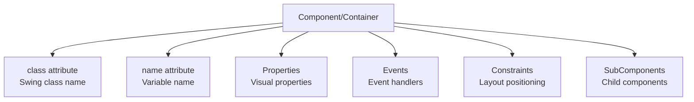
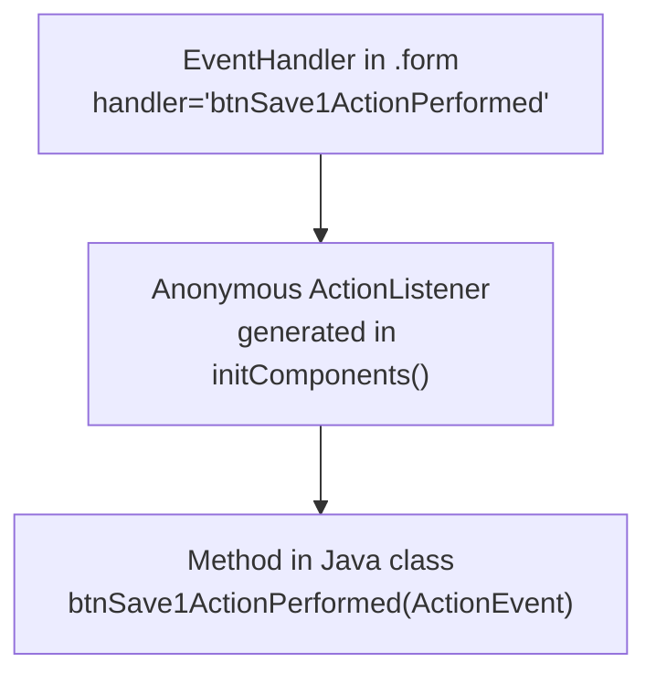
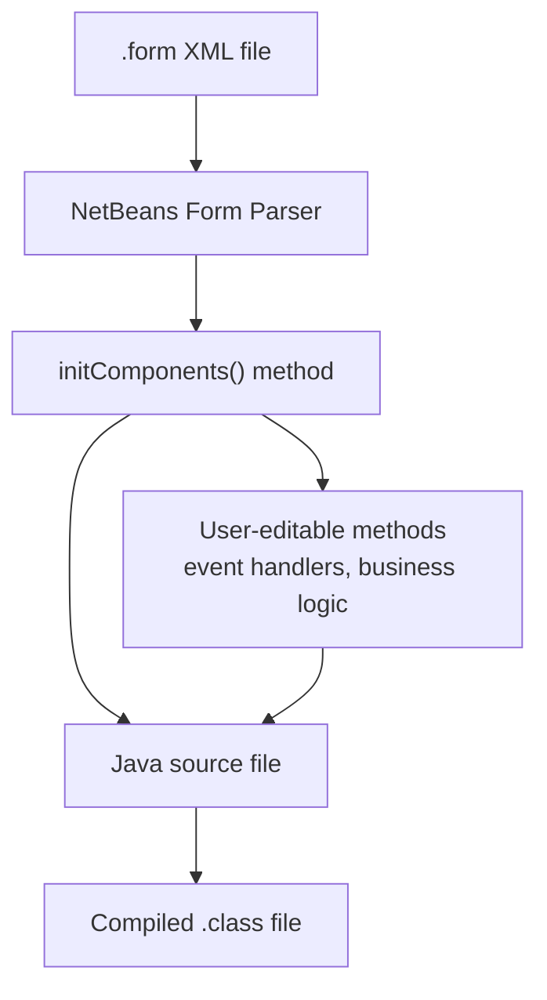
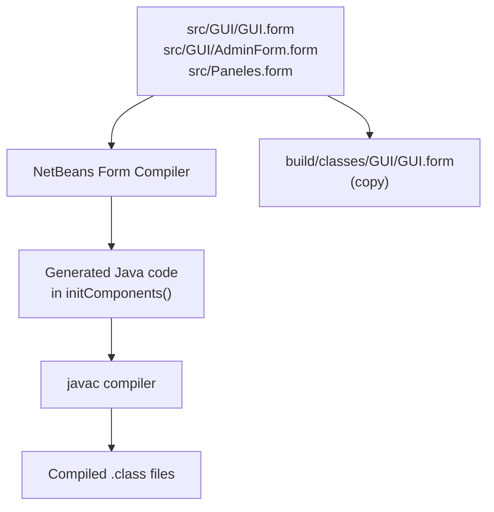

# NetBeans Form Definitions (.form files)

> **Relevant source files**
> * [build/classes/GUI/GUI.form](https://github.com/axchisan/Crud-MUUUy-simple-en-java-de-hace-a-os/blob/7ec3bd78/build/classes/GUI/GUI.form)
> * [src/GUI/AdminForm.form](https://github.com/axchisan/Crud-MUUUy-simple-en-java-de-hace-a-os/blob/7ec3bd78/src/GUI/AdminForm.form)
> * [src/GUI/GUI.form](https://github.com/axchisan/Crud-MUUUy-simple-en-java-de-hace-a-os/blob/7ec3bd78/src/GUI/GUI.form)
> * [src/Paneles.form](https://github.com/axchisan/Crud-MUUUy-simple-en-java-de-hace-a-os/blob/7ec3bd78/src/Paneles.form)

## Purpose and Scope

This document provides technical reference documentation for the NetBeans Form Definition files (`.form` files) used in the crud3 application. These XML-based files describe the visual design and properties of Swing GUI components created with the NetBeans GUI Builder. The NetBeans Form Editor reads these files to render the visual designer and generates corresponding Java code for GUI initialization.

This page covers the structure, elements, and configuration options within `.form` files. For information about the generated Java classes themselves, see [User Interface Layer](/axchisan/Crud-MUUUy-simple-en-java-de-hace-a-os/4-user-interface-layer). For details about how the build system processes these files, see [Build System](/axchisan/Crud-MUUUy-simple-en-java-de-hace-a-os/7-build-system).

---

## Overview

The crud3 application contains four `.form` files that define the visual structure of Swing JFrame windows:

| File Path | Associated Java Class | Purpose |
| --- | --- | --- |
| `src/GUI/GUI.form` | `GUI.GUI` | Main data entry form with input fields and buttons |
| `src/GUI/AdminForm.form` | `GUI.AdminForm` | Administrative interface (minimal layout) |
| `src/Paneles.form` | `Paneles` | Additional UI component (minimal layout) |
| `build/classes/GUI/GUI.form` | (compiled copy) | Build artifact of main form |

All `.form` files follow the NetBeans Form Definition schema, which is an XML format that describes component hierarchies, layout managers, properties, and event handlers.

**Sources:** [src/GUI/GUI.form L1-L137](https://github.com/axchisan/Crud-MUUUy-simple-en-java-de-hace-a-os/blob/7ec3bd78/src/GUI/GUI.form#L1-L137)

 [src/GUI/AdminForm.form L1-L36](https://github.com/axchisan/Crud-MUUUy-simple-en-java-de-hace-a-os/blob/7ec3bd78/src/GUI/AdminForm.form#L1-L36)

 [src/Paneles.form L1-L36](https://github.com/axchisan/Crud-MUUUy-simple-en-java-de-hace-a-os/blob/7ec3bd78/src/Paneles.form#L1-L36)

 [build/classes/GUI/GUI.form L1-L137](https://github.com/axchisan/Crud-MUUUy-simple-en-java-de-hace-a-os/blob/7ec3bd78/build/classes/GUI/GUI.form#L1-L137)

---

## Form File Structure

```mermaid
flowchart TD

FormRoot["Form (root element)"]
Properties["Properties<br>Component-level settings"]
SyntheticProps["SyntheticProperties<br>Form editor behavior"]
AuxValues["AuxValues<br>Code generation settings"]
Layout["Layout<br>Layout manager configuration"]
SubComponents["SubComponents<br>Child component tree"]
DefaultClose["defaultCloseOperation"]
FormSizePolicy["formSizePolicy"]
GenerateCenter["generateCenter"]
AutoResourcing["FormSettings_autoResourcing"]
ComponentName["FormSettings_autoSetComponentName"]
GenerateFQN["FormSettings_generateFQN"]
GenerateMnemonics["FormSettings_generateMnemonicsCode"]
I18nMode["FormSettings_i18nAutoMode"]
LayoutCodeTarget["FormSettings_layoutCodeTarget"]
ListenerStyle["FormSettings_listenerGenerationStyle"]
VariablesLocal["FormSettings_variablesLocal"]
VariablesModifier["FormSettings_variablesModifier"]
Container["Container components<br>JPanel, etc."]
Component["Leaf components<br>JButton, JTextField, etc."]

FormRoot --> Properties
FormRoot --> SyntheticProps
FormRoot --> AuxValues
FormRoot --> Layout
FormRoot --> SubComponents
Properties --> DefaultClose
SyntheticProps --> FormSizePolicy
SyntheticProps --> GenerateCenter
AuxValues --> AutoResourcing
AuxValues --> ComponentName
AuxValues --> GenerateFQN
AuxValues --> GenerateMnemonics
AuxValues --> I18nMode
AuxValues --> LayoutCodeTarget
AuxValues --> ListenerStyle
AuxValues --> VariablesLocal
AuxValues --> VariablesModifier
SubComponents --> Container
SubComponents --> Component
```



**Sources:** [src/GUI/GUI.form L3-L26](https://github.com/axchisan/Crud-MUUUy-simple-en-java-de-hace-a-os/blob/7ec3bd78/src/GUI/GUI.form#L3-L26)

 [src/GUI/AdminForm.form L3-L21](https://github.com/axchisan/Crud-MUUUy-simple-en-java-de-hace-a-os/blob/7ec3bd78/src/GUI/AdminForm.form#L3-L21)

---

## Root Form Element

The root `<Form>` element defines the form type and version compatibility:

```
<Form version="1.3" maxVersion="1.9" type="org.netbeans.modules.form.forminfo.JFrameFormInfo">
```

### Attributes

| Attribute | Value | Description |
| --- | --- | --- |
| `version` | `"1.3"` | Form definition schema version |
| `maxVersion` | `"1.9"` | Maximum compatible NetBeans version |
| `type` | `"org.netbeans.modules.form.forminfo.JFrameFormInfo"` | Form information class indicating this is a JFrame |

All forms in crud3 use `JFrameFormInfo`, indicating they are top-level windows.

**Sources:** [src/GUI/GUI.form L3](https://github.com/axchisan/Crud-MUUUy-simple-en-java-de-hace-a-os/blob/7ec3bd78/src/GUI/GUI.form#L3-L3)

 [src/GUI/AdminForm.form L3](https://github.com/axchisan/Crud-MUUUy-simple-en-java-de-hace-a-os/blob/7ec3bd78/src/GUI/AdminForm.form#L3-L3)

 [src/Paneles.form L3](https://github.com/axchisan/Crud-MUUUy-simple-en-java-de-hace-a-os/blob/7ec3bd78/src/Paneles.form#L3-L3)

---

## Properties Section

The `<Properties>` section defines component-level properties that are set during initialization:

```xml
<Properties>
  <Property name="defaultCloseOperation" type="int" value="3"/>
</Properties>
```

### defaultCloseOperation

The value `3` corresponds to `javax.swing.WindowConstants.EXIT_ON_CLOSE`, which causes the application to exit when the window is closed. This is generated as:

```
setDefaultCloseOperation(javax.swing.WindowConstants.EXIT_ON_CLOSE);
```

**Sources:** [src/GUI/GUI.form L4-L6](https://github.com/axchisan/Crud-MUUUy-simple-en-java-de-hace-a-os/blob/7ec3bd78/src/GUI/GUI.form#L4-L6)

 [src/GUI/AdminForm.form L4-L6](https://github.com/axchisan/Crud-MUUUy-simple-en-java-de-hace-a-os/blob/7ec3bd78/src/GUI/AdminForm.form#L4-L6)

---

## SyntheticProperties Section

Synthetic properties control form editor behavior and are not directly reflected in generated code:

```xml
<SyntheticProperties>
  <SyntheticProperty name="formSizePolicy" type="int" value="1"/>
  <SyntheticProperty name="generateCenter" type="boolean" value="false"/>
</SyntheticProperties>
```

| Property | Type | Value | Meaning |
| --- | --- | --- | --- |
| `formSizePolicy` | `int` | `1` | How the form's size is determined (1 = generate pack() call) |
| `generateCenter` | `boolean` | `false` | Whether to generate code to center the window on screen |

**Sources:** [src/GUI/GUI.form L7-L10](https://github.com/axchisan/Crud-MUUUy-simple-en-java-de-hace-a-os/blob/7ec3bd78/src/GUI/GUI.form#L7-L10)

 [src/GUI/AdminForm.form L7-L10](https://github.com/axchisan/Crud-MUUUy-simple-en-java-de-hace-a-os/blob/7ec3bd78/src/GUI/AdminForm.form#L7-L10)

---

## AuxValues (Code Generation Settings)

The `<AuxValues>` section contains `FormSettings_*` entries that control code generation behavior:

```xml
<AuxValues>
  <AuxValue name="FormSettings_autoResourcing" type="java.lang.Integer" value="0"/>
  <AuxValue name="FormSettings_autoSetComponentName" type="java.lang.Boolean" value="false"/>
  <AuxValue name="FormSettings_generateFQN" type="java.lang.Boolean" value="true"/>
  <AuxValue name="FormSettings_generateMnemonicsCode" type="java.lang.Boolean" value="false"/>
  <AuxValue name="FormSettings_i18nAutoMode" type="java.lang.Boolean" value="false"/>
  <AuxValue name="FormSettings_layoutCodeTarget" type="java.lang.Integer" value="1"/>
  <AuxValue name="FormSettings_listenerGenerationStyle" type="java.lang.Integer" value="0"/>
  <AuxValue name="FormSettings_variablesLocal" type="java.lang.Boolean" value="false"/>
  <AuxValue name="FormSettings_variablesModifier" type="java.lang.Integer" value="2"/>
</AuxValues>
```

### FormSettings Reference

| Setting | Value | Description |
| --- | --- | --- |
| `autoResourcing` | `0` | No automatic resource injection |
| `autoSetComponentName` | `false` | Do not automatically set component name properties |
| `generateFQN` | `true` | Use fully qualified names in generated code |
| `generateMnemonicsCode` | `false` | Do not generate mnemonic key bindings |
| `i18nAutoMode` | `false` | No automatic internationalization |
| `layoutCodeTarget` | `1` | Java 1.6+ layout code generation |
| `listenerGenerationStyle` | `0` | Use anonymous inner classes for event listeners |
| `variablesLocal` | `false` | Generate instance variables (not local variables) |
| `variablesModifier` | `2` | Private visibility for generated variables |

The `variablesModifier` value of `2` corresponds to `private` access, which is why all component fields in `GUI.GUI` are declared as `private`.

**Sources:** [src/GUI/GUI.form L11-L21](https://github.com/axchisan/Crud-MUUUy-simple-en-java-de-hace-a-os/blob/7ec3bd78/src/GUI/GUI.form#L11-L21)

 [src/GUI/AdminForm.form L11-L21](https://github.com/axchisan/Crud-MUUUy-simple-en-java-de-hace-a-os/blob/7ec3bd78/src/GUI/AdminForm.form#L11-L21)

---

## Layout Configuration

The `<Layout>` element specifies the layout manager used for the container. The main `GUI.GUI` form uses absolute positioning:

```xml
<Layout class="org.netbeans.modules.form.compat2.layouts.DesignAbsoluteLayout">
  <Property name="useNullLayout" type="boolean" value="false"/>
</Layout>
```

This generates code using `AbsoluteLayout` with explicit x, y, width, height coordinates for each component.

The `AdminForm` and `Paneles` forms use GroupLayout:

```xml
<Layout>
  <DimensionLayout dim="0">
    <Group type="103" groupAlignment="0" attributes="0">
      <EmptySpace min="0" pref="400" max="32767" attributes="0"/>
    </Group>
  </DimensionLayout>
  <DimensionLayout dim="1">
    <Group type="103" groupAlignment="0" attributes="0">
      <EmptySpace min="0" pref="300" max="32767" attributes="0"/>
    </Group>
  </DimensionLayout>
</Layout>
```

This creates a GroupLayout with horizontal (`dim="0"`) and vertical (`dim="1"`) dimension specifications. The empty forms use only empty space with preferred size of 400x300 pixels.

**Sources:** [src/GUI/GUI.form L24-L26](https://github.com/axchisan/Crud-MUUUy-simple-en-java-de-hace-a-os/blob/7ec3bd78/src/GUI/GUI.form#L24-L26)

 [src/GUI/AdminForm.form L23-L34](https://github.com/axchisan/Crud-MUUUy-simple-en-java-de-hace-a-os/blob/7ec3bd78/src/GUI/AdminForm.form#L23-L34)

---

## Component Hierarchy



The `GUI.GUI` form contains a single `JPanel` container (`jPanel1`) which holds all other components. Each component is defined in the `<SubComponents>` section with properties, constraints, and event handlers.

**Sources:** [src/GUI/GUI.form L27-L136](https://github.com/axchisan/Crud-MUUUy-simple-en-java-de-hace-a-os/blob/7ec3bd78/src/GUI/GUI.form#L27-L136)

---

## Component Definition Structure

Each component is defined with a specific structure:



**Sources:** [src/GUI/GUI.form L39-L132](https://github.com/axchisan/Crud-MUUUy-simple-en-java-de-hace-a-os/blob/7ec3bd78/src/GUI/GUI.form#L39-L132)

---

## Component Examples

### JLabel Definition

```xml
<Component class="javax.swing.JLabel" name="jLabel2">
  <Properties>
    <Property name="text" type="java.lang.String" value="nombre"/>
  </Properties>
  <Constraints>
    <Constraint layoutClass="org.netbeans.modules.form.compat2.layouts.DesignAbsoluteLayout" 
                value="org.netbeans.modules.form.compat2.layouts.DesignAbsoluteLayout$AbsoluteConstraintsDescription">
      <AbsoluteConstraints x="39" y="37" width="152" height="44"/>
    </Constraint>
  </Constraints>
</Component>
```

This generates:

```
jLabel2 = new javax.swing.JLabel();
jLabel2.setText("nombre");
jPanel1.add(jLabel2, new org.netbeans.lib.awtextra.AbsoluteConstraints(39, 37, 152, 44));
```

**Sources:** [src/GUI/GUI.form L49-L58](https://github.com/axchisan/Crud-MUUUy-simple-en-java-de-hace-a-os/blob/7ec3bd78/src/GUI/GUI.form#L49-L58)

### JTextField Definition

```xml
<Component class="javax.swing.JTextField" name="txtNombre">
  <Constraints>
    <Constraint layoutClass="org.netbeans.modules.form.compat2.layouts.DesignAbsoluteLayout" 
                value="org.netbeans.modules.form.compat2.layouts.DesignAbsoluteLayout$AbsoluteConstraintsDescription">
      <AbsoluteConstraints x="300" y="40" width="510" height="-1"/>
    </Constraint>
  </Constraints>
</Component>
```

The height value of `-1` indicates the component should use its preferred height. This generates:

```
txtNombre = new javax.swing.JTextField();
jPanel1.add(txtNombre, new org.netbeans.lib.awtextra.AbsoluteConstraints(300, 40, 510, -1));
```

**Sources:** [src/GUI/GUI.form L86-L92](https://github.com/axchisan/Crud-MUUUy-simple-en-java-de-hace-a-os/blob/7ec3bd78/src/GUI/GUI.form#L86-L92)

### JButton with Event Handler

```xml
<Component class="javax.swing.JButton" name="btnSave1">
  <Properties>
    <Property name="text" type="java.lang.String" value="Save"/>
  </Properties>
  <Events>
    <EventHandler event="actionPerformed" 
                  listener="java.awt.event.ActionListener" 
                  parameters="java.awt.event.ActionEvent" 
                  handler="btnSave1ActionPerformed"/>
  </Events>
  <Constraints>
    <Constraint layoutClass="org.netbeans.modules.form.compat2.layouts.DesignAbsoluteLayout" 
                value="org.netbeans.modules.form.compat2.layouts.DesignAbsoluteLayout$AbsoluteConstraintsDescription">
      <AbsoluteConstraints x="110" y="350" width="-1" height="80"/>
    </Constraint>
  </Constraints>
</Component>
```

This generates both the component initialization and event listener attachment:

```
btnSave1 = new javax.swing.JButton();
btnSave1.setText("Save");
btnSave1.addActionListener(new java.awt.event.ActionListener() {
    public void actionPerformed(java.awt.event.ActionEvent evt) {
        btnSave1ActionPerformed(evt);
    }
});
jPanel1.add(btnSave1, new org.netbeans.lib.awtextra.AbsoluteConstraints(110, 350, -1, 80));
```

The `handler` attribute specifies the method name that will be called when the event occurs. This method is defined in the user-editable section of the Java class.

**Sources:** [src/GUI/GUI.form L120-L132](https://github.com/axchisan/Crud-MUUUy-simple-en-java-de-hace-a-os/blob/7ec3bd78/src/GUI/GUI.form#L120-L132)

---

## Event Handler Mapping



The `.form` file's `<EventHandler>` element specifies:

* `event`: The event name (e.g., "actionPerformed")
* `listener`: The listener interface (e.g., "java.awt.event.ActionListener")
* `parameters`: The event parameter type (e.g., "java.awt.event.ActionEvent")
* `handler`: The method name to call (e.g., "btnSave1ActionPerformed")

NetBeans generates an anonymous inner class that implements the listener and delegates to the user-defined handler method. This approach is determined by `FormSettings_listenerGenerationStyle` with value `0`.

**Sources:** [src/GUI/GUI.form L111-L112](https://github.com/axchisan/Crud-MUUUy-simple-en-java-de-hace-a-os/blob/7ec3bd78/src/GUI/GUI.form#L111-L112)

 [src/GUI/GUI.form L124-L125](https://github.com/axchisan/Crud-MUUUy-simple-en-java-de-hace-a-os/blob/7ec3bd78/src/GUI/GUI.form#L124-L125)

---

## Container Definitions

Containers can hold child components:

```xml
<Container class="javax.swing.JPanel" name="jPanel1">
  <Constraints>
    <Constraint layoutClass="org.netbeans.modules.form.compat2.layouts.DesignAbsoluteLayout" 
                value="org.netbeans.modules.form.compat2.layouts.DesignAbsoluteLayout$AbsoluteConstraintsDescription">
      <AbsoluteConstraints x="0" y="0" width="860" height="480"/>
    </Constraint>
  </Constraints>

  <Layout class="org.netbeans.modules.form.compat2.layouts.DesignAbsoluteLayout">
    <Property name="useNullLayout" type="boolean" value="false"/>
  </Layout>
  
  <SubComponents>
    <!-- Child components defined here -->
  </SubComponents>
</Container>
```

The `jPanel1` container:

1. Is positioned at (0, 0) with size 860x480 pixels within the JFrame
2. Uses `AbsoluteLayout` for its own child components
3. Contains all the form's interactive components in its `<SubComponents>` section

**Sources:** [src/GUI/GUI.form L28-L134](https://github.com/axchisan/Crud-MUUUy-simple-en-java-de-hace-a-os/blob/7ec3bd78/src/GUI/GUI.form#L28-L134)

---

## Absolute Constraints Format

The `AbsoluteConstraints` element specifies exact positioning:

```
<AbsoluteConstraints x="300" y="40" width="510" height="-1"/>
```

| Attribute | Description | Special Values |
| --- | --- | --- |
| `x` | X-coordinate in pixels | - |
| `y` | Y-coordinate in pixels | - |
| `width` | Component width in pixels | `-1` = preferred width |
| `height` | Component height in pixels | `-1` = preferred height |

This maps directly to the `AbsoluteConstraints` constructor used in generated code:

```
new org.netbeans.lib.awtextra.AbsoluteConstraints(x, y, width, height)
```

**Sources:** [src/GUI/GUI.form L82](https://github.com/axchisan/Crud-MUUUy-simple-en-java-de-hace-a-os/blob/7ec3bd78/src/GUI/GUI.form#L82-L82)

 [src/GUI/GUI.form L89](https://github.com/axchisan/Crud-MUUUy-simple-en-java-de-hace-a-os/blob/7ec3bd78/src/GUI/GUI.form#L89-L89)

---

## Form-to-Code Generation Mapping



The NetBeans Form Editor:

1. Reads the `.form` file to render the visual designer
2. Generates the `initComponents()` method in the corresponding `.java` file
3. Creates anonymous inner classes for event listeners that call user-defined handlers
4. Protects the `initComponents()` method from user modifications with special comments

User-editable sections include:

* Class-level fields (outside generated region)
* Event handler methods (e.g., `btnSave1ActionPerformed`)
* Business logic methods (e.g., `ValidadarDatos`, `LimpiarCampos`)

**Sources:** [src/GUI/GUI.form L1-L137](https://github.com/axchisan/Crud-MUUUy-simple-en-java-de-hace-a-os/blob/7ec3bd78/src/GUI/GUI.form#L1-L137)

---

## Variable Declaration Generation

Based on `FormSettings_variablesModifier` value of `2` (private) and `FormSettings_variablesLocal` value of `false` (instance variables), the form components are declared as:

```java
// Variables declaration - do not modify
private javax.swing.JButton btnClean;
private javax.swing.JButton btnSave1;
private javax.swing.JLabel jLabel1;
private javax.swing.JLabel jLabel2;
private javax.swing.JLabel jLabel3;
private javax.swing.JLabel jLabel4;
private javax.swing.JPanel jPanel1;
private javax.swing.JTextField txtApellido;
private javax.swing.JTextField txtCorreo;
private javax.swing.JTextField txtNombre;
private javax.swing.JTextField txtTelefono;
// End of variables declaration
```

The variable names (`name` attribute in `.form` file) become field names in the generated Java class.

**Sources:** [src/GUI/GUI.form L20](https://github.com/axchisan/Crud-MUUUy-simple-en-java-de-hace-a-os/blob/7ec3bd78/src/GUI/GUI.form#L20-L20)

 [src/GUI/GUI.form L28-L132](https://github.com/axchisan/Crud-MUUUy-simple-en-java-de-hace-a-os/blob/7ec3bd78/src/GUI/GUI.form#L28-L132)

---

## Form Comparison: Complex vs. Minimal

### GUI.GUI.form (Complex Form)

* **Designer Size**: 867x482 pixels (specified in `designerSize` AuxValue)
* **Layout**: AbsoluteLayout with explicit positioning
* **Components**: 11 components (1 panel, 4 labels, 4 text fields, 2 buttons)
* **Event Handlers**: 2 ActionListener handlers
* **Complexity**: Full data entry interface with validation workflow

**Sources:** [src/GUI/GUI.form L21](https://github.com/axchisan/Crud-MUUUy-simple-en-java-de-hace-a-os/blob/7ec3bd78/src/GUI/GUI.form#L21-L21)

 [src/GUI/GUI.form L24-L136](https://github.com/axchisan/Crud-MUUUy-simple-en-java-de-hace-a-os/blob/7ec3bd78/src/GUI/GUI.form#L24-L136)

### AdminForm.form & Paneles.form (Minimal Forms)

* **Designer Size**: Not specified (uses GroupLayout defaults)
* **Layout**: GroupLayout with empty space definitions
* **Components**: 0 components
* **Event Handlers**: None
* **Complexity**: Placeholder forms with no functionality

These minimal forms demonstrate the structure of an empty NetBeans form, containing only the required metadata and layout definitions.

**Sources:** [src/GUI/AdminForm.form L23-L34](https://github.com/axchisan/Crud-MUUUy-simple-en-java-de-hace-a-os/blob/7ec3bd78/src/GUI/AdminForm.form#L23-L34)

 [src/Paneles.form L23-L34](https://github.com/axchisan/Crud-MUUUy-simple-en-java-de-hace-a-os/blob/7ec3bd78/src/Paneles.form#L23-L34)

---

## Build Process Integration



During the build process:

1. `.form` files in `src/` are processed by the NetBeans form compiler
2. The form compiler updates the `initComponents()` method in corresponding `.java` files
3. `.form` files are copied to `build/classes/` directory as resources
4. The modified `.java` files are compiled to `.class` files
5. Both `.class` and `.form` files are packaged in the final JAR

The `.form` files are included as resources to support runtime form editing or inspection if needed.

**Sources:** [src/GUI/GUI.form L1-L137](https://github.com/axchisan/Crud-MUUUy-simple-en-java-de-hace-a-os/blob/7ec3bd78/src/GUI/GUI.form#L1-L137)

 [build/classes/GUI/GUI.form L1-L137](https://github.com/axchisan/Crud-MUUUy-simple-en-java-de-hace-a-os/blob/7ec3bd78/build/classes/GUI/GUI.form#L1-L137)

---

## Summary Table: Form Files in crud3

| Aspect | GUI.GUI.form | AdminForm.form | Paneles.form |
| --- | --- | --- | --- |
| **Type** | JFrameFormInfo | JFrameFormInfo | JFrameFormInfo |
| **Layout** | AbsoluteLayout | GroupLayout | GroupLayout |
| **Components** | 11 (labels, fields, buttons) | 0 (empty) | 0 (empty) |
| **Event Handlers** | 2 (Save, Clean) | 0 | 0 |
| **Designer Size** | 867x482 px | 400x300 px | 400x300 px |
| **Purpose** | Main data entry form | Admin placeholder | Additional UI placeholder |
| **Complexity** | High | Minimal | Minimal |

**Sources:** [src/GUI/GUI.form L1-L137](https://github.com/axchisan/Crud-MUUUy-simple-en-java-de-hace-a-os/blob/7ec3bd78/src/GUI/GUI.form#L1-L137)

 [src/GUI/AdminForm.form L1-L36](https://github.com/axchisan/Crud-MUUUy-simple-en-java-de-hace-a-os/blob/7ec3bd78/src/GUI/AdminForm.form#L1-L36)

 [src/Paneles.form L1-L36](https://github.com/axchisan/Crud-MUUUy-simple-en-java-de-hace-a-os/blob/7ec3bd78/src/Paneles.form#L1-L36)