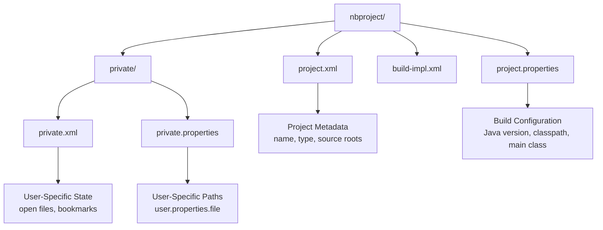
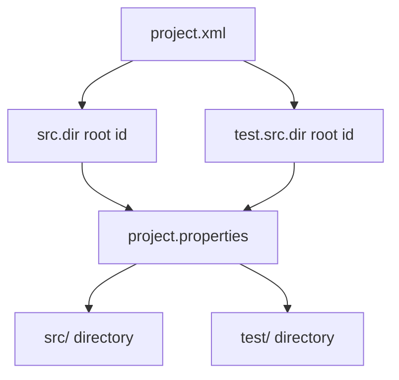
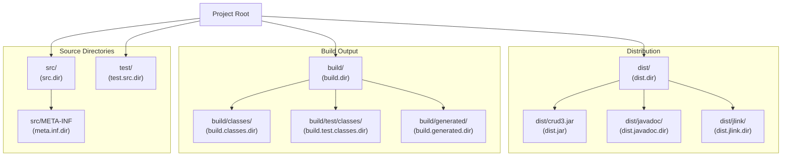
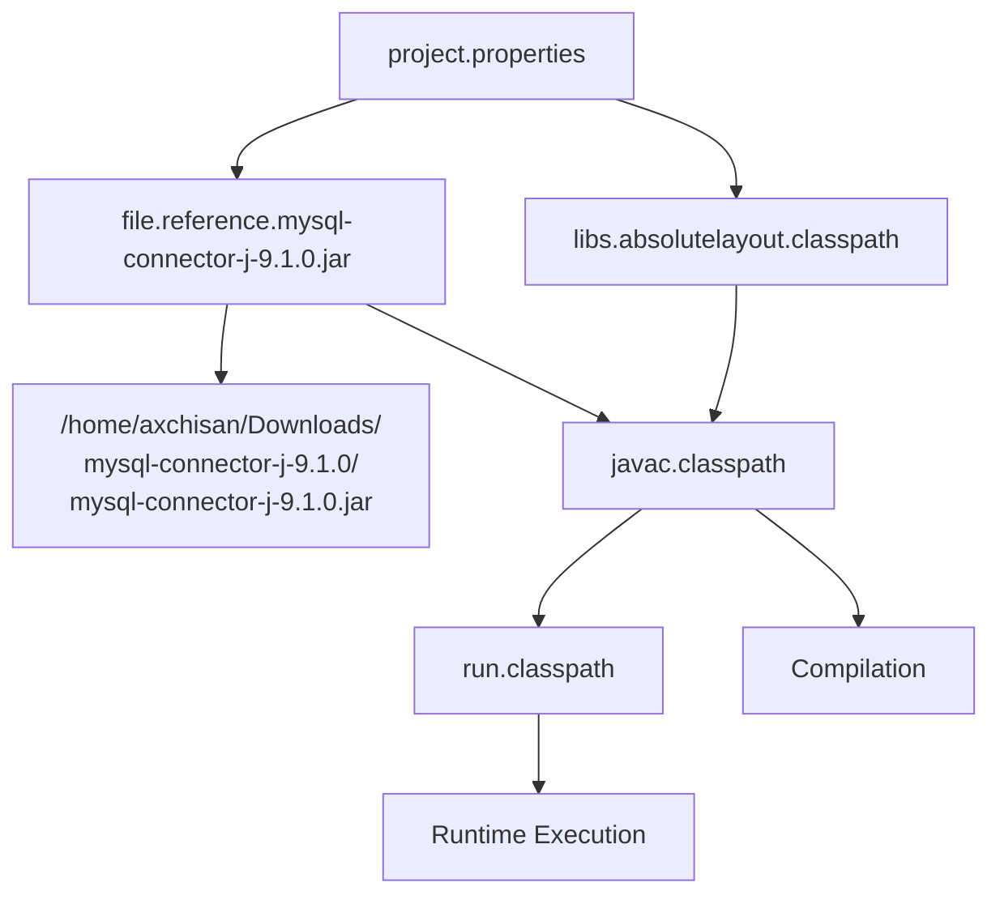
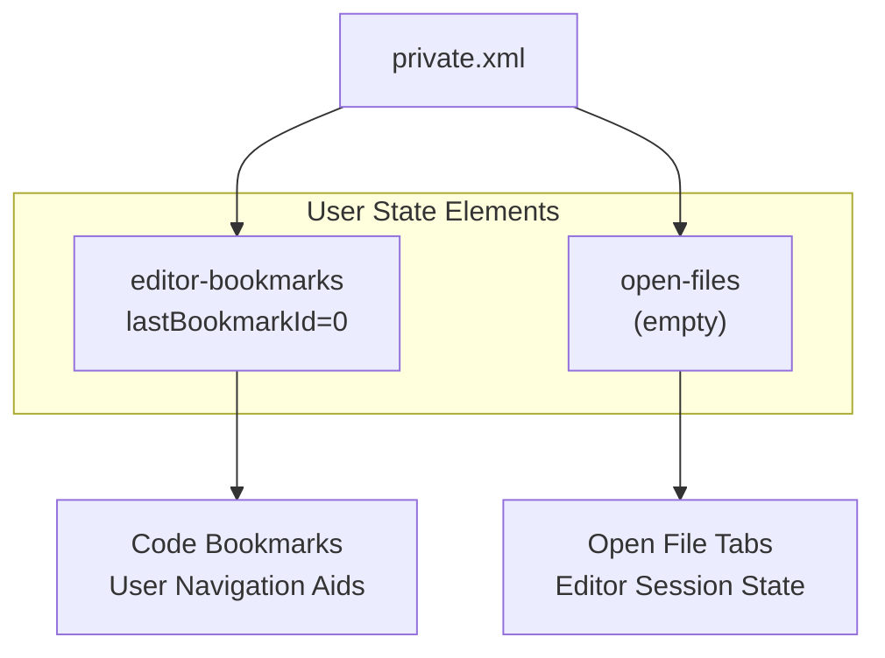
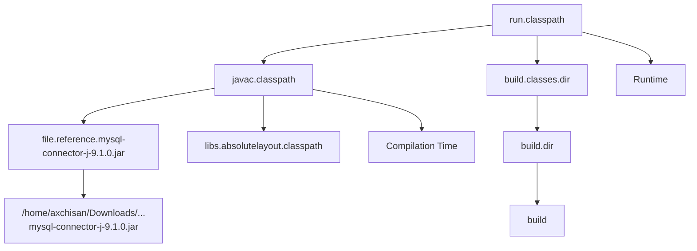
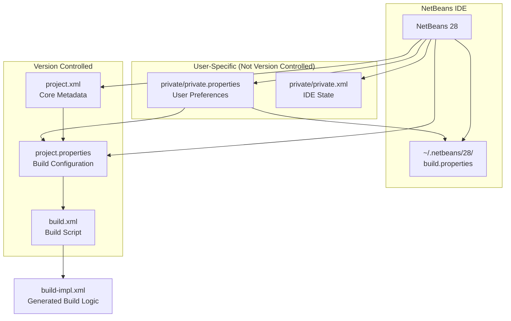
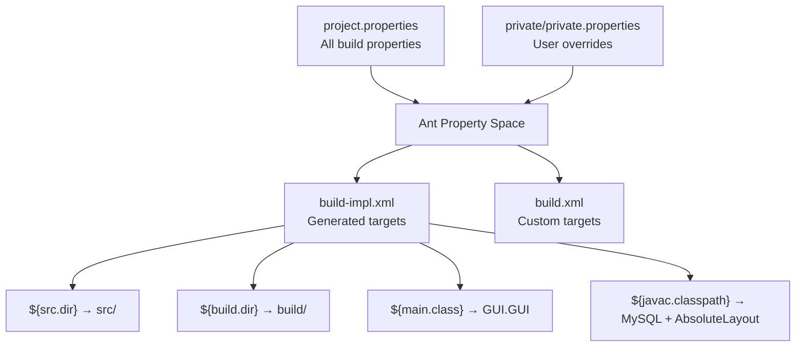

# NetBeans Project Structure

> **Relevant source files**
> * [nbproject/private/private.properties](https://github.com/axchisan/Crud-MUUUy-simple-en-java-de-hace-a-os/blob/7ec3bd78/nbproject/private/private.properties)
> * [nbproject/private/private.xml](https://github.com/axchisan/Crud-MUUUy-simple-en-java-de-hace-a-os/blob/7ec3bd78/nbproject/private/private.xml)
> * [nbproject/project.properties](https://github.com/axchisan/Crud-MUUUy-simple-en-java-de-hace-a-os/blob/7ec3bd78/nbproject/project.properties)
> * [nbproject/project.xml](https://github.com/axchisan/Crud-MUUUy-simple-en-java-de-hace-a-os/blob/7ec3bd78/nbproject/project.xml)

## Purpose and Scope

This document details the NetBeans IDE project configuration files in the `nbproject/` directory, including `project.xml` (core project metadata), `project.properties` (build and runtime configuration), and private configuration files. These files define how NetBeans manages, builds, and runs the crud3 application.

For information about the Ant build system that uses these configurations, see [7.1](/axchisan/Crud-MUUUy-simple-en-java-de-hace-a-os/7.1-ant-build-configuration). For dependency management and classpath configuration, see [7.4](/axchisan/Crud-MUUUy-simple-en-java-de-hace-a-os/7.4-dependencies-and-classpath).

## NetBeans Project Directory Structure

The NetBeans project configuration is organized in the `nbproject/` directory with the following structure:

**Sources:** nbproject/project.xml, nbproject/project.properties, nbproject/private/private.xml, nbproject/private/private.properties

## Core Project Configuration (project.xml)

The `project.xml` file defines the fundamental project metadata and type information. This file is version-controlled and shared across all developers.

### Project Metadata

[nbproject/project.xml L1-L15](https://github.com/axchisan/Crud-MUUUy-simple-en-java-de-hace-a-os/blob/7ec3bd78/nbproject/project.xml#L1-L15)

| Element | Value | Description |
| --- | --- | --- |
| `<type>` | `org.netbeans.modules.java.j2seproject` | Defines project as Java SE application |
| `<name>` | `crud3` | Project identifier used throughout NetBeans |
| `<source-roots>` | `src.dir` | References source directory root |
| `<test-roots>` | `test.src.dir` | References test directory root |

The project type `org.netbeans.modules.java.j2seproject` indicates this is a standard Java SE project using the J2SE project structure conventions.

### Source and Test Root Mapping

The root IDs (`src.dir` and `test.src.dir`) are symbolic references resolved through property substitution in `project.properties`.

**Sources:** nbproject/project.xml:5-12

## Project Properties Configuration (project.properties)

The `project.properties` file contains extensive build and runtime configuration. This 98-line file defines compilation settings, classpaths, output directories, and execution parameters.

### Java Compilation Settings

[nbproject/project.properties L1-L58](https://github.com/axchisan/Crud-MUUUy-simple-en-java-de-hace-a-os/blob/7ec3bd78/nbproject/project.properties#L1-L58)

| Property | Value | Description |
| --- | --- | --- |
| `javac.source` | `21` | Java source compatibility version |
| `javac.target` | `21` | Java bytecode target version |
| `javac.classpath` | MySQL Connector, AbsoluteLayout | Compilation classpath dependencies |
| `javac.modulepath` | (empty) | Module path for JPMS projects |
| `build.sysclasspath` | `ignore` | Ignores system classpath during build |

The application requires Java 21 and uses the MySQL Connector/J library referenced at [nbproject/project.properties L36-L41](https://github.com/axchisan/Crud-MUUUy-simple-en-java-de-hace-a-os/blob/7ec3bd78/nbproject/project.properties#L36-L41)

### Directory Structure Properties

**Sources:** nbproject/project.properties:7-34, 97-98

### Main Class and Execution Properties

[nbproject/project.properties L77-L95](https://github.com/axchisan/Crud-MUUUy-simple-en-java-de-hace-a-os/blob/7ec3bd78/nbproject/project.properties#L77-L95)

| Property | Value | Purpose |
| --- | --- | --- |
| `main.class` | `GUI.GUI` | Entry point class for application execution |
| `manifest.file` | `manifest.mf` | JAR manifest template location |
| `run.classpath` | `${javac.classpath}:${build.classes.dir}` | Runtime classpath composition |
| `run.jvmargs` | (empty) | JVM arguments for execution |
| `run.modulepath` | `${javac.modulepath}` | Runtime module path |

The `main.class` property defines `GUI.GUI` as the application entry point, which is written to the JAR manifest during packaging.

### Dependency Configuration

[nbproject/project.properties L36-L41](https://github.com/axchisan/Crud-MUUUy-simple-en-java-de-hace-a-os/blob/7ec3bd78/nbproject/project.properties#L36-L41)

The MySQL Connector/J library is referenced using a file-based reference with an absolute path specific to the developer's environment. The `libs.absolutelayout.classpath` is a NetBeans library reference for the AbsoluteLayout manager.

**Sources:** nbproject/project.properties:36-41, 82-84

### Build Exclusion and Encoding

[nbproject/project.properties L8-L9](https://github.com/axchisan/Crud-MUUUy-simple-en-java-de-hace-a-os/blob/7ec3bd78/nbproject/project.properties#L8-L9)

| Property | Value | Description |
| --- | --- | --- |
| `build.classes.excludes` | `**/*.java,**/*.form` | Excludes source and form files from JAR |
| `source.encoding` | `UTF-8` | Source file character encoding |

The `build.classes.excludes` property ensures that only compiled `.class` files are packaged into the distribution JAR, not the original `.java` source files or `.form` GUI definition files.

**Sources:** nbproject/project.properties:8, 96

### Javadoc Configuration

[nbproject/project.properties L59-L70](https://github.com/axchisan/Crud-MUUUy-simple-en-java-de-hace-a-os/blob/7ec3bd78/nbproject/project.properties#L59-L70)

| Property | Value | Purpose |
| --- | --- | --- |
| `javadoc.additionalparam` | (empty) | Additional javadoc command options |
| `javadoc.author` | `false` | Excludes @author tags from documentation |
| `javadoc.version` | `false` | Excludes @version tags from documentation |
| `javadoc.private` | `false` | Excludes private members from documentation |
| `javadoc.html5` | `false` | Uses HTML 4 output format |

These settings control the generation of API documentation in the `dist/javadoc/` directory.

**Sources:** nbproject/project.properties:59-70

## Private Configuration Files

The `nbproject/private/` directory contains user-specific and machine-specific configuration that should not be version-controlled. This directory is typically included in `.gitignore`.

### Private Properties (private.properties)

[nbproject/private/private.properties L1-L3](https://github.com/axchisan/Crud-MUUUy-simple-en-java-de-hace-a-os/blob/7ec3bd78/nbproject/private/private.properties#L1-L3)

| Property | Value | Description |
| --- | --- | --- |
| `compile.on.save` | `true` | Enables automatic compilation when files are saved |
| `user.properties.file` | `/home/axchisan/.netbeans/28/build.properties` | Path to user-level NetBeans configuration |

The `compile.on.save` feature provides immediate compilation feedback during development. The `user.properties.file` points to the NetBeans installation-specific configuration file containing user preferences and global library definitions.

**Sources:** nbproject/private/private.properties:1-2

### Private XML Configuration (private.xml)

[nbproject/private/private.xml L1-L8](https://github.com/axchisan/Crud-MUUUy-simple-en-java-de-hace-a-os/blob/7ec3bd78/nbproject/private/private.xml#L1-L8)

The `private.xml` file maintains IDE-specific user state:

* **editor-bookmarks**: Stores code bookmarks set by the developer for quick navigation
* **open-files**: Tracks which files were open in the editor when the project was last closed

The current configuration shows no bookmarks (`lastBookmarkId="0"`) and no open files (`<group/>`), indicating a clean state.

**Sources:** nbproject/private/private.xml:2-7

## Property Resolution and Substitution

NetBeans uses Ant-style property substitution throughout configuration files. Properties can reference other properties using the `${property.name}` syntax.

### Property Reference Chain Example

Example resolution of `run.classpath`:

1. `${javac.classpath}` → `/home/axchisan/Downloads/mysql-connector-j-9.1.0/mysql-connector-j-9.1.0.jar:${libs.absolutelayout.classpath}`
2. `${build.classes.dir}` → `${build.dir}/classes` → `build/classes`
3. Final: `/path/to/mysql.jar:/path/to/absolutelayout.jar:build/classes`

**Sources:** nbproject/project.properties:7, 39-41, 82-84

## Configuration File Relationships

**Key Relationships:**

| Source File | Target File | Relationship Type |
| --- | --- | --- |
| `project.xml` | `project.properties` | Defines source root references |
| `project.properties` | `build.xml` | Provides Ant properties |
| `private.properties` | `project.properties` | Overrides/supplements properties |
| `private.properties` | Global NetBeans config | References user-level settings |

**Sources:** nbproject/project.xml, nbproject/project.properties, nbproject/private/private.properties, nbproject/private/private.xml

## Integration with Build System

The NetBeans project configuration integrates with the Ant build system through property exposure and build script generation.

### Property Flow to Ant

[nbproject/project.properties L1-L98](https://github.com/axchisan/Crud-MUUUy-simple-en-java-de-hace-a-os/blob/7ec3bd78/nbproject/project.properties#L1-L98)

All properties defined in `project.properties` become available as Ant properties during build execution. The `build-impl.xml` file, which is auto-generated by NetBeans, consumes these properties to construct build targets.

**Sources:** nbproject/project.properties, build.xml, nbproject/build-impl.xml

## Summary Table: Configuration Files

| File | Purpose | Version Control | Key Contents |
| --- | --- | --- | --- |
| `project.xml` | Core project metadata | Yes | Project name, type, source roots |
| `project.properties` | Build configuration | Yes | Java version, classpath, main class, directories |
| `private/private.properties` | User preferences | No | compile.on.save, user.properties.file |
| `private/private.xml` | IDE session state | No | Open files, bookmarks, editor state |

**Sources:** nbproject/project.xml, nbproject/project.properties, nbproject/private/private.properties, nbproject/private/private.xml