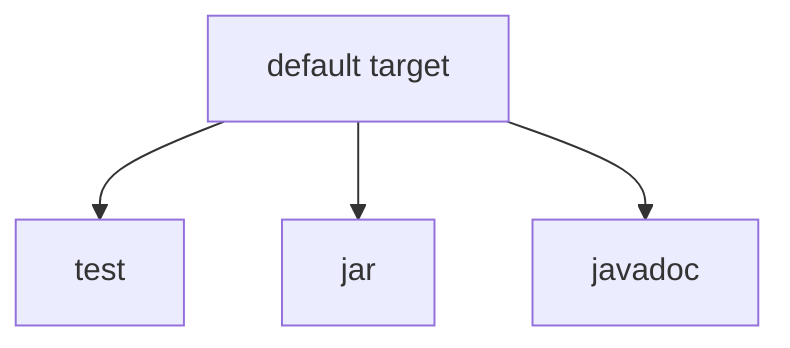
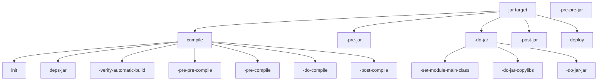
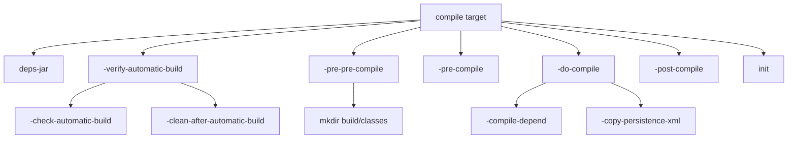
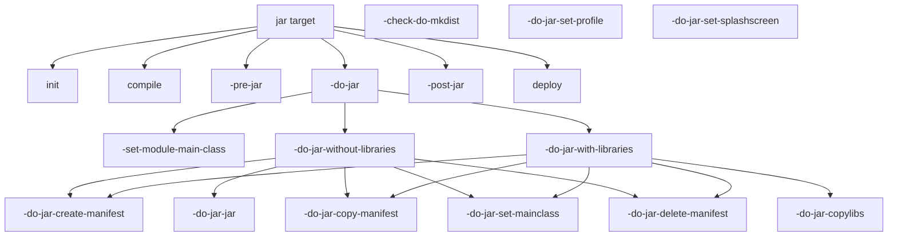
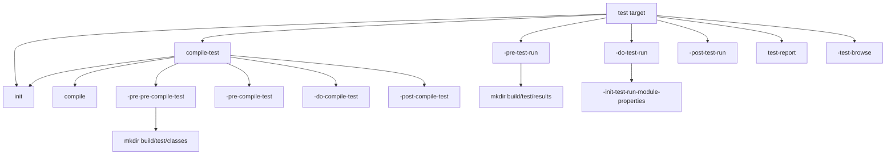
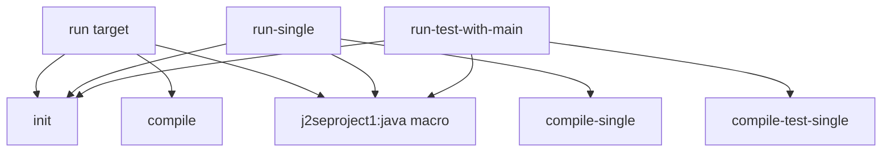
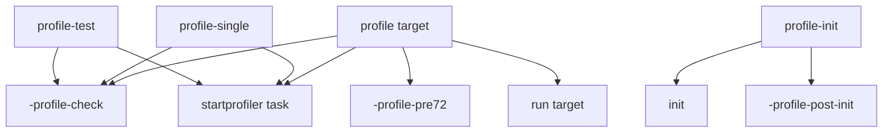
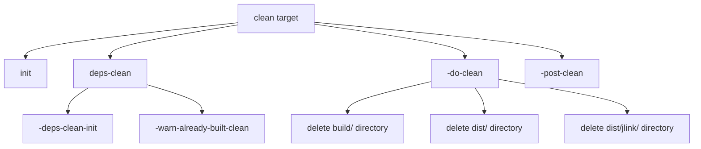

# Objetivos de compilación y ciclo de vida

> **Archivos fuente relevantes**
> * [compilación.xml](https://github.com/axchisan/Crud-MUUUy-simple-en-java-de-hace-a-os/blob/7ec3bd78/build.xml)
> * [nbproject/build-impl.xml](https://github.com/axchisan/Crud-MUUUy-simple-en-java-de-hace-a-os/blob/7ec3bd78/nbproject/build-impl.xml)

Este documento describe los objetivos de compilación de Ant disponibles en el proyecto crud3 y su ciclo de vida de ejecución. Abarca las cadenas de dependencia, las principales fases de compilación y cómo se organizan los objetivos durante las operaciones de compilación, empaquetado, pruebas e implementación.

Para obtener información sobre la estructura general de configuración de compilación de Ant, consulte [Configuración de compilación de Ant](/axchisan/Crud-MUUUy-simple-en-java-de-hace-a-os/7.1-ant-build-configuration) . Para obtener más información sobre la creación de JAR y la generación de manifiestos, consulte [Empaquetado y manifiesto de JAR](/axchisan/Crud-MUUUy-simple-en-java-de-hace-a-os/7.5-jar-packaging-and-manifest) .

## Descripción general

El sistema de compilación define un conjunto completo de objetivos organizados en fases lógicas. El script de compilación principal...[build.xml L10](https://github.com/axchisan/Crud-MUUUy-simple-en-java-de-hace-a-os/blob/7ec3bd78/build.xml#L10-L10)

importa la implementación generada[nbproject/build-impl.xml L22](https://github.com/axchisan/Crud-MUUUy-simple-en-java-de-hace-a-os/blob/7ec3bd78/nbproject/build-impl.xml#L22-L22)

Que contiene todas las definiciones de objetivos. El ciclo de vida de la compilación sigue una cadena de dependencias estructurada donde cada objetivo principal depende de objetivos prerrequisitos para garantizar una inicialización y un orden de compilación correctos.

**Fuentes:** [build.xml L1-L74](https://github.com/axchisan/Crud-MUUUy-simple-en-java-de-hace-a-os/blob/7ec3bd78/build.xml#L1-L74)

 [nbproject/build-impl.xml L1-L50](https://github.com/axchisan/Crud-MUUUy-simple-en-java-de-hace-a-os/blob/7ec3bd78/nbproject/build-impl.xml#L1-L50)

## Objetivo predeterminado y ciclo de vida principal

El `default`objetivo sirve como punto de entrada cuando no se especifica uno específico. Ejecuta un ciclo completo de compilación y prueba.



**Definición de objetivo predeterminada**

El objetivo predeterminado definido en[nbproject/build-impl.xml L30](https://github.com/axchisan/Crud-MUUUy-simple-en-java-de-hace-a-os/blob/7ec3bd78/nbproject/build-impl.xml#L30-L30)

depende de tres objetivos principales:

| Objetivo | Objetivo | Producción |
| --- | --- | --- |
| `test` | Compila y ejecuta pruebas JUnit/TestNG | Resultados de las pruebas en`build/test/results/` |
| `jar` | Crea el archivo JAR distribuible | `dist/crud3.jar` |
| `javadoc` | Genera documentación de API | Documentación en`dist/javadoc/` |

**Fuentes:** [nbproject/build-impl.xml L30](https://github.com/axchisan/Crud-MUUUy-simple-en-java-de-hace-a-os/blob/7ec3bd78/nbproject/build-impl.xml#L30-L30)

## Cadena de dependencia de destino

El siguiente diagrama ilustra la cadena de dependencia completa para el `jar`objetivo principal, mostrando cómo se desarrolla en cascada a través de las fases de inicialización, compilación y empaquetado:



**Fuentes:** [nbproject/build-impl.xml L1111](https://github.com/axchisan/Crud-MUUUy-simple-en-java-de-hace-a-os/blob/7ec3bd78/nbproject/build-impl.xml#L1111-L1111)

 [nbproject/build-impl.xml L1258](https://github.com/axchisan/Crud-MUUUy-simple-en-java-de-hace-a-os/blob/7ec3bd78/nbproject/build-impl.xml#L1258-L1258)

## Fase de inicialización

La fase de inicialización configura las propiedades, valida la configuración y define las macros utilizadas durante la compilación. Esta fase se ejecuta antes de cualquier compilación o empaquetado.

### Cadena de destino de inicialización

El `init`objetivo en[nbproject/build-impl.xml L1049](https://github.com/axchisan/Crud-MUUUy-simple-en-java-de-hace-a-os/blob/7ec3bd78/nbproject/build-impl.xml#L1049-L1049)

coordina una serie de objetivos de inicialización:

```mermaid
flowchart TD

init["init target"]
pre_init["-pre-init"]
init_private["-init-private"]
init_user["-init-user"]
init_project["-init-project"]
do_init["-do-init"]
post_init["-post-init"]
init_check["-init-check"]
init_macrodef_property["-init-macrodef-property"]
init_macrodef_javac["-init-macrodef-javac"]
init_macrodef_test["-init-macrodef-test"]
init_macrodef_debug["-init-macrodef-debug"]
init_macrodef_java["-init-macrodef-java"]
init_presetdef_jar["-init-presetdef-jar"]
init_ap_cmdline["-init-ap-cmdline"]

init --> pre_init
init --> init_private
init --> init_user
init --> init_project
init --> do_init
init --> post_init
init --> init_check
init --> init_macrodef_property
init --> init_macrodef_javac
init --> init_macrodef_test
init --> init_macrodef_debug
init --> init_macrodef_java
init --> init_presetdef_jar
init --> init_ap_cmdline
```



### Secuencia de carga de la propiedad

La fase de inicialización carga las propiedades en un orden específico para permitir una anulación adecuada:

1. **Configuración privada** [nbproject/build-impl.xml L40-L44](https://github.com/axchisan/Crud-MUUUy-simple-en-java-de-hace-a-os/blob/7ec3bd78/nbproject/build-impl.xml#L40-L44) :Cargas`nbproject/private/private.properties`
2. **Configuración de usuario** [nbproject/build-impl.xml L45-L51](https://github.com/axchisan/Crud-MUUUy-simple-en-java-de-hace-a-os/blob/7ec3bd78/nbproject/build-impl.xml#L45-L51) : Carga propiedades específicas del usuario
3. **Project configuration** [nbproject/build-impl.xml L52-L55](https://github.com/axchisan/Crud-MUUUy-simple-en-java-de-hace-a-os/blob/7ec3bd78/nbproject/build-impl.xml#L52-L55) : Loads `nbproject/project.properties`

### Validation Checks

The `-init-check` target [nbproject/build-impl.xml L290-L301](https://github.com/axchisan/Crud-MUUUy-simple-en-java-de-hace-a-os/blob/7ec3bd78/nbproject/build-impl.xml#L290-L301)

 validates required properties:

| Required Property | Purpose |
| --- | --- |
| `src.dir` | Source directory location |
| `test.src.dir` | Test source directory |
| `build.dir` | Build output directory |
| `dist.dir` | Distribution directory |
| `build.classes.dir` | Compiled classes directory |
| `dist.javadoc.dir` | Javadoc output directory |

**Sources:** [nbproject/build-impl.xml L36-L301](https://github.com/axchisan/Crud-MUUUy-simple-en-java-de-hace-a-os/blob/7ec3bd78/nbproject/build-impl.xml#L36-L301)

 [nbproject/build-impl.xml L1049](https://github.com/axchisan/Crud-MUUUy-simple-en-java-de-hace-a-os/blob/7ec3bd78/nbproject/build-impl.xml#L1049-L1049)

## Compilation Section

The compilation phase transforms Java source files into bytecode. It includes dependency tracking, annotation processing support, and resource copying.

### Compilation Target Structure



### Core Compilation Target

The `-do-compile` target [nbproject/build-impl.xml L1095-L1100](https://github.com/axchisan/Crud-MUUUy-simple-en-java-de-hace-a-os/blob/7ec3bd78/nbproject/build-impl.xml#L1095-L1100)

 performs the actual compilation:

1. Invokes the `j2seproject3:javac` macro with `gensrcdir="${build.generated.sources.dir}"`
2. Copies non-Java resources from `${src.dir}` to `${build.classes.dir}`
3. Excludes files matching `${build.classes.excludes}` and `${excludes}` patterns

The `javac` macro is defined at [nbproject/build-impl.xml L311-L456](https://github.com/axchisan/Crud-MUUUy-simple-en-java-de-hace-a-os/blob/7ec3bd78/nbproject/build-impl.xml#L311-L456)

 and supports:

* Module system (Java 9+) via `-init-macrodef-javac-with-module`
* Annotation processing via `-init-macrodef-javac-with-processors`
* Traditional compilation via `-init-macrodef-javac-without-processors`

**Sources:** [nbproject/build-impl.xml L1050-L1125](https://github.com/axchisan/Crud-MUUUy-simple-en-java-de-hace-a-os/blob/7ec3bd78/nbproject/build-impl.xml#L1050-L1125)

 [nbproject/build-impl.xml L311-L456](https://github.com/axchisan/Crud-MUUUy-simple-en-java-de-hace-a-os/blob/7ec3bd78/nbproject/build-impl.xml#L311-L456)

## JAR Building Section

The JAR building phase creates the distributable archive containing compiled classes, resources, and dependencies.

### JAR Target Dependency Flow



### JAR Creation Modes

The build system supports two JAR creation modes determined by the `-check-do-mkdist` target [nbproject/build-impl.xml L1184-L1197](https://github.com/axchisan/Crud-MUUUy-simple-en-java-de-hace-a-os/blob/7ec3bd78/nbproject/build-impl.xml#L1184-L1197)

:

| Mode | Target | Condition | Libraries |
| --- | --- | --- | --- |
| With Libraries | `-do-jar-copylibs` | `do.mkdist=true` and CopyLibs available | Copies dependencies to `dist/lib/` |
| Without Libraries | `-do-jar-jar` | Module system or `mkdist.disabled=true` | Dependencies not bundled |

### Manifest Configuration

The manifest is configured through a series of conditional targets [nbproject/build-impl.xml L1158-L1183](https://github.com/axchisan/Crud-MUUUy-simple-en-java-de-hace-a-os/blob/7ec3bd78/nbproject/build-impl.xml#L1158-L1183)

:

1. **Main-Class**: Set by `-do-jar-set-mainclass` to `${main.class}` (GUI.GUI)
2. **Profile**: Set by `-do-jar-set-profile` if `${javac.profile}` is defined
3. **SplashScreen-Image**: Set by `-do-jar-set-splashscreen` if splash screen configured

**Sources:** [nbproject/build-impl.xml L1126-L1258](https://github.com/axchisan/Crud-MUUUy-simple-en-java-de-hace-a-os/blob/7ec3bd78/nbproject/build-impl.xml#L1126-L1258)

 [nbproject/build-impl.xml L1158-L1252](https://github.com/axchisan/Crud-MUUUy-simple-en-java-de-hace-a-os/blob/7ec3bd78/nbproject/build-impl.xml#L1158-L1252)

## Test Compilation and Execution Section

The test phase compiles and executes unit tests using JUnit or TestNG frameworks.

### Test Lifecycle



### Test Compilation Target

The `-do-compile-test` target [nbproject/build-impl.xml L1597-L1606](https://github.com/axchisan/Crud-MUUUy-simple-en-java-de-hace-a-os/blob/7ec3bd78/nbproject/build-impl.xml#L1597-L1606)

 compiles test sources:

```
<j2seproject3:javac 
    apgeneratedsrcdir="${build.test.classes.dir}" 
    classpath="${javac.test.classpath}" 
    debug="true" 
    destdir="${build.test.classes.dir}" 
    modulepath="${javac.test.modulepath}" 
    processorpath="${javac.test.processorpath}" 
    sourcepath="${javac.test.sourcepath}" 
    srcdir="${test.src.dir}">
```

### Test Execution Targets

The system provides multiple test execution targets [nbproject/build-impl.xml L1649-L1669](https://github.com/axchisan/Crud-MUUUy-simple-en-java-de-hace-a-os/blob/7ec3bd78/nbproject/build-impl.xml#L1649-L1669)

:

| Target | Purpose | Scope |
| --- | --- | --- |
| `test` | Run all unit tests | All test classes matching `**/*Test.java` |
| `test-single` | Run selected test class | Single test file specified by `${test.includes}` |
| `test-single-method` | Run single test method | Specific method in `${test.class}` |
| `test-report` | Generate test report | HTML report generation |

### Framework Detection

The build system detects available testing frameworks at [nbproject/build-impl.xml L263-L280](https://github.com/axchisan/Crud-MUUUy-simple-en-java-de-hace-a-os/blob/7ec3bd78/nbproject/build-impl.xml#L263-L280)

:

* **JUnit**: Checks for `org.junit.Test` or `junit.framework.Test` classes
* **TestNG**: Checks for `org.testng.annotations.Test` class
* **Mixed Mode**: Uses both frameworks if both are available

**Sources:** [nbproject/build-impl.xml L1538-L1669](https://github.com/axchisan/Crud-MUUUy-simple-en-java-de-hace-a-os/blob/7ec3bd78/nbproject/build-impl.xml#L1538-L1669)

 [nbproject/build-impl.xml L263-L280](https://github.com/axchisan/Crud-MUUUy-simple-en-java-de-hace-a-os/blob/7ec3bd78/nbproject/build-impl.xml#L263-L280)

## Execution and Debugging Targets

The build system provides targets for running and debugging the application.

### Execution Targets



### Run Target Definition

The `run` target [nbproject/build-impl.xml L1329-L1335](https://github.com/axchisan/Crud-MUUUy-simple-en-java-de-hace-a-os/blob/7ec3bd78/nbproject/build-impl.xml#L1329-L1335)

 executes the main class:

```xml
<target depends="init,compile" description="Run a main class." name="run">
    <j2seproject1:java>
        <customize>
            <arg line="${application.args}"/>
        </customize>
    </j2seproject1:java>
</target>
```

The `java` macro is defined conditionally based on module system support:

* **With module**: [nbproject/build-impl.xml L892-L924](https://github.com/axchisan/Crud-MUUUy-simple-en-java-de-hace-a-os/blob/7ec3bd78/nbproject/build-impl.xml#L892-L924)  - Uses `-m ${module.name}` syntax
* **With unnamed module**: [nbproject/build-impl.xml L926-L957](https://github.com/axchisan/Crud-MUUUy-simple-en-java-de-hace-a-os/blob/7ec3bd78/nbproject/build-impl.xml#L926-L957)  - Uses classpath with modulepath
* **Without module**: [nbproject/build-impl.xml L959-L984](https://github.com/axchisan/Crud-MUUUy-simple-en-java-de-hace-a-os/blob/7ec3bd78/nbproject/build-impl.xml#L959-L984)  - Traditional classpath execution

### Debugging Targets

La infraestructura de depuración utiliza JPDA (Java Platform Debugger Architecture):

| Objetivo | Objetivo | Configuración del puerto |
| --- | --- | --- |
| `debug` | Depurar la aplicación principal | `${jpda.address}` |
| `debug-single` | Depurar un solo archivo | Archivo seleccionado mediante`${debug.class}` |
| `debug-test` | Prueba unitaria de depuración | Ruta de clase de prueba |
| `debug-fix` | Cambios en el código de intercambio en caliente | Recargar clases modificadas |

El `-init-macrodef-debug`objetivo[nbproject/build-impl.xml L875-L890](https://github.com/axchisan/Crud-MUUUy-simple-en-java-de-hace-a-os/blob/7ec3bd78/nbproject/build-impl.xml#L875-L890)

define la `debug`macro con la configuración del agente JDWP:

```
<jvmarg value="-agentlib:jdwp=transport=${debug-transport},address=${jpda.address}"/>
```

**Fuentes:** [nbproject/build-impl.xml L1329-L1387](https://github.com/axchisan/Crud-MUUUy-simple-en-java-de-hace-a-os/blob/7ec3bd78/nbproject/build-impl.xml#L1329-L1387)

 [nbproject/build-impl.xml L839-L890](https://github.com/axchisan/Crud-MUUUy-simple-en-java-de-hace-a-os/blob/7ec3bd78/nbproject/build-impl.xml#L839-L890)

 [nbproject/build-impl.xml L892-L984](https://github.com/axchisan/Crud-MUUUy-simple-en-java-de-hace-a-os/blob/7ec3bd78/nbproject/build-impl.xml#L892-L984)

## Sección de perfiles

El sistema de compilación incluye soporte de creación de perfiles para el análisis de rendimiento mediante NetBeans Profiler.

### Perfiles de objetivos



La integración del generador de perfiles admite dos modos:

1. **NetBeans 7.2+** : utiliza `startprofiler`tareas y `run.jvmargs.ide`configuración[nbproject/build-impl.xml L1458-L1461](https://github.com/axchisan/Crud-MUUUy-simple-en-java-de-hace-a-os/blob/7ec3bd78/nbproject/build-impl.xml#L1458-L1461)
2. **Pre-7.2** : utiliza la ruta del agente del generador de perfiles explícito y los argumentos de JVM[nbproject/build-impl.xml L1396-L1404](https://github.com/axchisan/Crud-MUUUy-simple-en-java-de-hace-a-os/blob/7ec3bd78/nbproject/build-impl.xml#L1396-L1404)

**Fuentes:** [nbproject/build-impl.xml L791-L835](https://github.com/axchisan/Crud-MUUUy-simple-en-java-de-hace-a-os/blob/7ec3bd78/nbproject/build-impl.xml#L791-L835)

 [nbproject/build-impl.xml L1393-L1482](https://github.com/axchisan/Crud-MUUUy-simple-en-java-de-hace-a-os/blob/7ec3bd78/nbproject/build-impl.xml#L1393-L1482)

## Sección de generación de Javadoc

El `javadoc`objetivo genera documentación de API a partir de comentarios del código fuente.

### Estructura de destino de Javadoc

El `-javadoc-build`objetivo[nbproject/build-impl.xml L1488-L1529](https://github.com/axchisan/Crud-MUUUy-simple-en-java-de-hace-a-os/blob/7ec3bd78/nbproject/build-impl.xml#L1488-L1529)

ejecuta la `javadoc`tarea con:

| Parámetro | Valor | Objetivo |
| --- | --- | --- |
| `destdir` | `${dist.javadoc.dir}` | Directorio de salida |
| `encoding` | `${javadoc.encoding.used}` | Codificación de fuente |
| `charset` | `UTF-8` | Juego de caracteres HTML |
| `source` | `${javac.source}` | Versión fuente de Java |
| `windowtitle` | `${javadoc.windowtitle}` | Título de la documentación |

La tarea incluye conjuntos de archivos de:

1. Directorio de fuentes principal:`${src.dir}` [nbproject/build-impl.xml L1511-L1513](https://github.com/axchisan/Crud-MUUUy-simple-en-java-de-hace-a-os/blob/7ec3bd78/nbproject/build-impl.xml#L1511-L1513)
2. Fuentes generadas:`${build.generated.sources.dir}` [nbproject/build-impl.xml L1514-L1517](https://github.com/axchisan/Crud-MUUUy-simple-en-java-de-hace-a-os/blob/7ec3bd78/nbproject/build-impl.xml#L1514-L1517)
3. Recursos de documentación:`**/doc-files/**` [nbproject/build-impl.xml L1521-L1528](https://github.com/axchisan/Crud-MUUUy-simple-en-java-de-hace-a-os/blob/7ec3bd78/nbproject/build-impl.xml#L1521-L1528)

**Fuentes:** [nbproject/build-impl.xml L1488-L1533](https://github.com/axchisan/Crud-MUUUy-simple-en-java-de-hace-a-os/blob/7ec3bd78/nbproject/build-impl.xml#L1488-L1533)

## Sección limpia

La fase de limpieza elimina los artefactos de compilación y restablece el proyecto al estado previo a la compilación.

### Cadena de objetivos limpia



### Implementación de objetivos limpios

El `-do-clean`objetivo[nbproject/build-impl.xml L1742-L1746](https://github.com/axchisan/Crud-MUUUy-simple-en-java-de-hace-a-os/blob/7ec3bd78/nbproject/build-impl.xml#L1742-L1746)

elimina:

1. **Directorio de compilación** : `${build.dir}`todas las clases compiladas y artefactos de compilación
2. **Directorio de distribución** : `${dist.dir}`- Archivo JAR y salida empaquetada
3. **Salida de JLink** : `${dist.jlink.output}`- Imágenes de tiempo de ejecución nativas (Java 9+)

El `deps-clean`objetivo[nbproject/build-impl.xml L1733-L1741](https://github.com/axchisan/Crud-MUUUy-simple-en-java-de-hace-a-os/blob/7ec3bd78/nbproject/build-impl.xml#L1733-L1741)

Gestiona el seguimiento de dependencias `built-clean.properties`para evitar la limpieza circular en compilaciones de múltiples proyectos.

**Fuentes:** [nbproject/build-impl.xml L1725-L1751](https://github.com/axchisan/Crud-MUUUy-simple-en-java-de-hace-a-os/blob/7ec3bd78/nbproject/build-impl.xml#L1725-L1751)

## Puntos de extensión para personalización

El sistema de compilación proporciona objetivos de marcador de posición vacíos que se pueden anular en[build.xml L1-L74](https://github.com/axchisan/Crud-MUUUy-simple-en-java-de-hace-a-os/blob/7ec3bd78/build.xml#L1-L74)

Para personalización.

### Puntos de extensión disponibles

| Punto de extensión | Ubicación | Fase de ejecución |
| --- | --- | --- |
| `-pre-init` | [nbproject/build-impl.xml L36-L39](https://github.com/axchisan/Crud-MUUUy-simple-en-java-de-hace-a-os/blob/7ec3bd78/nbproject/build-impl.xml#L36-L39) | Antes de la inicialización |
| `-post-init` | [nbproject/build-impl.xml L286-L289](https://github.com/axchisan/Crud-MUUUy-simple-en-java-de-hace-a-os/blob/7ec3bd78/nbproject/build-impl.xml#L286-L289) | Después de la inicialización |
| `-pre-compile` | [nbproject/build-impl.xml L1083-L1086](https://github.com/axchisan/Crud-MUUUy-simple-en-java-de-hace-a-os/blob/7ec3bd78/nbproject/build-impl.xml#L1083-L1086) | Antes de la compilación |
| `-post-compile` | [nbproject/build-impl.xml L1107-L1110](https://github.com/axchisan/Crud-MUUUy-simple-en-java-de-hace-a-os/blob/7ec3bd78/nbproject/build-impl.xml#L1107-L1110) | Después de la compilación |
| `-pre-jar` | [nbproject/build-impl.xml L1135-L1138](https://github.com/axchisan/Crud-MUUUy-simple-en-java-de-hace-a-os/blob/7ec3bd78/nbproject/build-impl.xml#L1135-L1138) | Antes de la creación del JAR |
| `-post-jar` | [nbproject/build-impl.xml L1253-L1256](https://github.com/axchisan/Crud-MUUUy-simple-en-java-de-hace-a-os/blob/7ec3bd78/nbproject/build-impl.xml#L1253-L1256) | Después de la creación del JAR |
| `-post-clean` | [nbproject/build-impl.xml L1747-L1750](https://github.com/axchisan/Crud-MUUUy-simple-en-java-de-hace-a-os/blob/7ec3bd78/nbproject/build-impl.xml#L1747-L1750) | Después de la limpieza |

### Ejemplo de personalización

El[build.xml L13-L72](https://github.com/axchisan/Crud-MUUUy-simple-en-java-de-hace-a-os/blob/7ec3bd78/build.xml#L13-L72)

Documentos de archivo sobre cómo personalizar los objetivos:

```xml
<target name="-post-compile">
    <obfuscate>
        <fileset dir="${build.classes.dir}"/>
    </obfuscate>
</target>
```

Este ejemplo muestra cómo insertar un ofuscador después de la compilación anulando el `-post-compile`objetivo.

**Fuentes:** [build.xml L13-L72](https://github.com/axchisan/Crud-MUUUy-simple-en-java-de-hace-a-os/blob/7ec3bd78/build.xml#L13-L72)

 [nbproject/build-impl.xml L36-L39](https://github.com/axchisan/Crud-MUUUy-simple-en-java-de-hace-a-os/blob/7ec3bd78/nbproject/build-impl.xml#L36-L39)

 [nbproject/build-impl.xml L286-L289](https://github.com/axchisan/Crud-MUUUy-simple-en-java-de-hace-a-os/blob/7ec3bd78/nbproject/build-impl.xml#L286-L289)

## Referencia completa de objetivos

La siguiente tabla enumera todos los objetivos principales disponibles en el sistema de compilación:

| Objetivo | Descripción | Dependencias |
| --- | --- | --- |
| `default` | Construir y probar todo el proyecto | `test`, `jar`,`javadoc` |
| `init` | Inicializar propiedades de compilación | Múltiples `-init-*`objetivos |
| `compile` | Compilar fuentes de Java | `init`, `deps-jar`,`-verify-automatic-build` |
| `compile-single` | Compilar un único archivo fuente | `init`, `deps-jar`,`-pre-pre-compile` |
| `jar` | Crear archivo JAR | `init`, `compile`, `-pre-jar`,`-do-jar` |
| `compile-test` | Compilar fuentes de prueba | `init`, `compile`,`-pre-pre-compile-test` |
| `test` | Ejecutar pruebas unitarias | `compile-test`, `-pre-test-run`,`-do-test-run` |
| `test-single` | Ejecutar una sola prueba | `compile-test-single`,`-do-test-run-single` |
| `run` | Ejecutar clase principal | `init`,`compile` |
| `debug` | Depurar aplicación | `init`, `compile`,`-debug-start-debugger` |
| `javadoc` | Generar documentación de API | `init`,`-javadoc-build` |
| `clean` | Eliminar productos de compilación | `init`, `deps-clean`,`-do-clean` |
| `deploy` | Implementar aplicación | `-do-jar`, `-pre-deploy`,`-do-deploy` |
| `profile` | Solicitud de perfil | `profile-init`, `compile`,`startprofiler` |

**Fuentes:** [nbproject/build-impl.xml L30](https://github.com/axchisan/Crud-MUUUy-simple-en-java-de-hace-a-os/blob/7ec3bd78/nbproject/build-impl.xml#L30-L30)

 [nbproject/build-impl.xml L1111](https://github.com/axchisan/Crud-MUUUy-simple-en-java-de-hace-a-os/blob/7ec3bd78/nbproject/build-impl.xml#L1111-L1111)

 [nbproject/build-impl.xml L1258](https://github.com/axchisan/Crud-MUUUy-simple-en-java-de-hace-a-os/blob/7ec3bd78/nbproject/build-impl.xml#L1258-L1258)

 [nbproject/build-impl.xml L1649](https://github.com/axchisan/Crud-MUUUy-simple-en-java-de-hace-a-os/blob/7ec3bd78/nbproject/build-impl.xml#L1649-L1649)

 [nbproject/build-impl.xml L1329](https://github.com/axchisan/Crud-MUUUy-simple-en-java-de-hace-a-os/blob/7ec3bd78/nbproject/build-impl.xml#L1329-L1329)

 [nbproject/build-impl.xml L1751](https://github.com/axchisan/Crud-MUUUy-simple-en-java-de-hace-a-os/blob/7ec3bd78/nbproject/build-impl.xml#L1751-L1751)