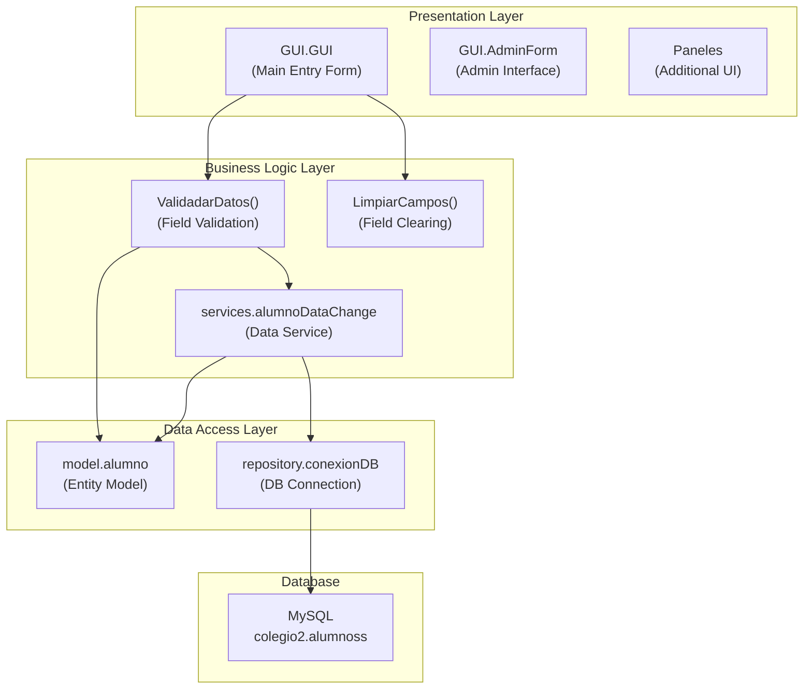
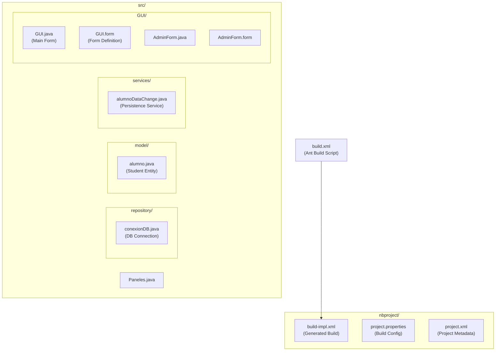

# Overview

> **Relevant source files**
> * [build.xml](https://github.com/axchisan/Crud-MUUUy-simple-en-java-de-hace-a-os/blob/7ec3bd78/build.xml)
> * [nbproject/project.properties](https://github.com/axchisan/Crud-MUUUy-simple-en-java-de-hace-a-os/blob/7ec3bd78/nbproject/project.properties)
> * [nbproject/project.xml](https://github.com/axchisan/Crud-MUUUy-simple-en-java-de-hace-a-os/blob/7ec3bd78/nbproject/project.xml)
> * [src/GUI/GUI.java](https://github.com/axchisan/Crud-MUUUy-simple-en-java-de-hace-a-os/blob/7ec3bd78/src/GUI/GUI.java)

This document provides a high-level introduction to the **crud3** application, explaining its purpose, architecture, key components, and technology stack. For detailed information about specific subsystems, refer to the subsequent sections of this wiki.

For setup and build instructions, see [Getting Started](/axchisan/Crud-MUUUy-simple-en-java-de-hace-a-os/2-getting-started). For in-depth architectural details, see [Architecture](/axchisan/Crud-MUUUy-simple-en-java-de-hace-a-os/3-architecture). For component-specific documentation, see [User Interface Layer](/axchisan/Crud-MUUUy-simple-en-java-de-hace-a-os/4-user-interface-layer), [Application Logic Layer](/axchisan/Crud-MUUUy-simple-en-java-de-hace-a-os/5-application-logic-layer), and [Data Access Layer](/axchisan/Crud-MUUUy-simple-en-java-de-hace-a-os/6-data-access-layer).

---

## System Purpose

The **crud3** application is a Java-based student management system that provides a graphical user interface for creating and storing student records in a MySQL database. The application manages four key attributes for each student:

| Field | Description |
| --- | --- |
| `nombre` | Student's first name |
| `apellido` | Student's last name |
| `telefono` | Student's phone number |
| `correo` | Student's email address |

The system follows a classic three-tier architecture pattern, separating presentation logic (Swing GUI), business logic (validation and data services), and data access (database connectivity) into distinct layers.

**Sources:** [src/GUI/GUI.java L1-L180](https://github.com/axchisan/Crud-MUUUy-simple-en-java-de-hace-a-os/blob/7ec3bd78/src/GUI/GUI.java#L1-L180)

 [src/model/alumno.java](https://github.com/axchisan/Crud-MUUUy-simple-en-java-de-hace-a-os/blob/7ec3bd78/src/model/alumno.java)

 [nbproject/project.xml L1-L16](https://github.com/axchisan/Crud-MUUUy-simple-en-java-de-hace-a-os/blob/7ec3bd78/nbproject/project.xml#L1-L16)

---

## High-Level Architecture

The crud3 application implements a three-tier architecture with clear separation of concerns:

### System Component Diagram



**Sources:** [src/GUI/GUI.java L1-L180](https://github.com/axchisan/Crud-MUUUy-simple-en-java-de-hace-a-os/blob/7ec3bd78/src/GUI/GUI.java#L1-L180)

 [src/services/alumnoDataChange.java](https://github.com/axchisan/Crud-MUUUy-simple-en-java-de-hace-a-os/blob/7ec3bd78/src/services/alumnoDataChange.java)

 [src/model/alumno.java](https://github.com/axchisan/Crud-MUUUy-simple-en-java-de-hace-a-os/blob/7ec3bd78/src/model/alumno.java)

 [src/repository/conexionDB.java](https://github.com/axchisan/Crud-MUUUy-simple-en-java-de-hace-a-os/blob/7ec3bd78/src/repository/conexionDB.java)

---

## Key Components

### Component File Structure



**Sources:** [build.xml L1-L74](https://github.com/axchisan/Crud-MUUUy-simple-en-java-de-hace-a-os/blob/7ec3bd78/build.xml#L1-L74)

 [nbproject/project.xml L1-L16](https://github.com/axchisan/Crud-MUUUy-simple-en-java-de-hace-a-os/blob/7ec3bd78/nbproject/project.xml#L1-L16)

 [nbproject/project.properties L1-L99](https://github.com/axchisan/Crud-MUUUy-simple-en-java-de-hace-a-os/blob/7ec3bd78/nbproject/project.properties#L1-L99)

### Component Descriptions

| Component | Package/Path | Role |
| --- | --- | --- |
| `GUI` | `GUI.GUI` | Main data entry form; handles user input and event coordination |
| `AdminForm` | `GUI.AdminForm` | Administrative interface for advanced operations |
| `Paneles` | (root package) | Additional UI component |
| `alumnoDataChange` | `services.alumnoDataChange` | Service layer for persisting student records to database |
| `alumno` | `model.alumno` | Data entity representing a student with getters/setters |
| `conexionDB` | `repository.conexionDB` | Database connection manager using JDBC |

**Sources:** [src/GUI/GUI.java L5-L15](https://github.com/axchisan/Crud-MUUUy-simple-en-java-de-hace-a-os/blob/7ec3bd78/src/GUI/GUI.java#L5-L15)

 [nbproject/project.properties L77](https://github.com/axchisan/Crud-MUUUy-simple-en-java-de-hace-a-os/blob/7ec3bd78/nbproject/project.properties#L77-L77)

---

## Technology Stack

The crud3 application is built using the following technologies:

### Core Technologies

| Technology | Version/Details | Purpose |
| --- | --- | --- |
| **Java** | Java 21 | Primary programming language |
| **Java Swing** | JFrame, JPanel, JTextField, JButton, JLabel | GUI framework for desktop interface |
| **MySQL** | Database: `colegio2`, Table: `alumnoss` | Relational database for data persistence |
| **JDBC** | MySQL Connector/J 9.1.0 | Database connectivity driver |
| **Apache Ant** | Build orchestration | Compilation, testing, and JAR packaging |
| **NetBeans IDE** | Project structure and GUI builder | Development environment with visual form designer |

### Build Configuration

The application is configured for Java 21 with the following compiler settings:

* **Source/Target Version**: Java 21 ([nbproject/project.properties L50-L51](https://github.com/axchisan/Crud-MUUUy-simple-en-java-de-hace-a-os/blob/7ec3bd78/nbproject/project.properties#L50-L51) )
* **Main Class**: `GUI.GUI` ([nbproject/project.properties L77](https://github.com/axchisan/Crud-MUUUy-simple-en-java-de-hace-a-os/blob/7ec3bd78/nbproject/project.properties#L77-L77) )
* **Output JAR**: `dist/crud3.jar` ([nbproject/project.properties L31](https://github.com/axchisan/Crud-MUUUy-simple-en-java-de-hace-a-os/blob/7ec3bd78/nbproject/project.properties#L31-L31) )
* **Dependencies**: MySQL Connector/J library ([nbproject/project.properties L36-L41](https://github.com/axchisan/Crud-MUUUy-simple-en-java-de-hace-a-os/blob/7ec3bd78/nbproject/project.properties#L36-L41) )

**Sources:** [nbproject/project.properties L1-L99](https://github.com/axchisan/Crud-MUUUy-simple-en-java-de-hace-a-os/blob/7ec3bd78/nbproject/project.properties#L1-L99)

 [build.xml L10-L12](https://github.com/axchisan/Crud-MUUUy-simple-en-java-de-hace-a-os/blob/7ec3bd78/build.xml#L10-L12)

---

## Application Features

The crud3 application provides the following core functionality:

### Data Entry and Validation

The main GUI form ([src/GUI/GUI.java L15-L179](https://github.com/axchisan/Crud-MUUUy-simple-en-java-de-hace-a-os/blob/7ec3bd78/src/GUI/GUI.java#L15-L179)

) provides:

* **Text input fields** for student attributes: * `txtNombre` - First name input * `txtApellido` - Last name input * `txtTelefono` - Phone number input * `txtCorreo` - Email address input
* **Action buttons**: * `btnSave1` - Triggers validation and save operation * `btnClean` - Clears all input fields
* **Client-side validation** via the `ValidadarDatos()` method ([src/GUI/GUI.java L143-L171](https://github.com/axchisan/Crud-MUUUy-simple-en-java-de-hace-a-os/blob/7ec3bd78/src/GUI/GUI.java#L143-L171) ) that ensures all fields are populated before saving

### Data Persistence

The `alumnoDataChange.guardado()` service method handles:

* Creating a database connection via `conexionDB.conectar()`
* Executing SQL INSERT statements using `PreparedStatement`
* Returning success/failure status with message feedback

**Sources:** [src/GUI/GUI.java L38-L93](https://github.com/axchisan/Crud-MUUUy-simple-en-java-de-hace-a-os/blob/7ec3bd78/src/GUI/GUI.java#L38-L93)

 [src/GUI/GUI.java L143-L171](https://github.com/axchisan/Crud-MUUUy-simple-en-java-de-hace-a-os/blob/7ec3bd78/src/GUI/GUI.java#L143-L171)

---

## Data Flow Overview

```mermaid
sequenceDiagram
  participant User
  participant GUI.GUI
  participant ValidadarDatos()
  participant alumno
  participant alumnoDataChange
  participant conexionDB
  participant MySQL
  participant colegio2.alumnoss

  User->>GUI.GUI: "Enter student data"
  User->>GUI.GUI: "Click btnSave1"
  GUI.GUI->>ValidadarDatos(): "btnSave1ActionPerformed()"
  loop ["All fields valid"]
    ValidadarDatos()->>alumno: "new alumno()"
    ValidadarDatos()->>alumno: "setNombre/setApellido/setTelefono/setCorreo"
    ValidadarDatos()->>alumnoDataChange: "guardado(alum)"
    alumnoDataChange->>conexionDB: "conectar()"
    conexionDB->>MySQL: "JDBC Connection"
    alumnoDataChange->>MySQL: "PreparedStatement INSERT"
    MySQL-->>alumnoDataChange: "Success/Failure"
    alumnoDataChange-->>ValidadarDatos(): "boolean result"
    ValidadarDatos()->>GUI.GUI: "LimpiarCampos()"
    ValidadarDatos()->>User: "JOptionPane message"
    ValidadarDatos()->>User: "JOptionPane error"
    ValidadarDatos()->>GUI.GUI: "requestFocus on invalid field"
  end
```

**Sources:** [src/GUI/GUI.java L87-L93](https://github.com/axchisan/Crud-MUUUy-simple-en-java-de-hace-a-os/blob/7ec3bd78/src/GUI/GUI.java#L87-L93)

 [src/GUI/GUI.java L143-L171](https://github.com/axchisan/Crud-MUUUy-simple-en-java-de-hace-a-os/blob/7ec3bd78/src/GUI/GUI.java#L143-L171)

---

## Project Structure

The project follows the standard NetBeans Java SE project layout:

### Directory Organization

```python
crud3/
├── build.xml                    # Ant build configuration
├── manifest.mf                  # JAR manifest template
├── nbproject/                   # NetBeans project files
│   ├── build-impl.xml          # Generated Ant implementation
│   ├── project.xml             # Project metadata
│   └── project.properties      # Build properties
├── src/                        # Source code root
│   ├── GUI/                    # Presentation layer
│   │   ├── GUI.java           # Main form (main class)
│   │   ├── GUI.form           # NetBeans form definition
│   │   ├── AdminForm.java     # Admin interface
│   │   └── AdminForm.form     # Admin form definition
│   ├── model/                  # Data model
│   │   └── alumno.java        # Student entity
│   ├── services/               # Business logic
│   │   └── alumnoDataChange.java
│   ├── repository/             # Data access
│   │   └── conexionDB.java    # DB connection manager
│   └── Paneles.java           # Additional UI component
├── build/                      # Compiled classes (generated)
│   └── classes/               # .class files
└── dist/                       # Distribution artifacts (generated)
    └── crud3.jar              # Executable JAR
```

### Build Artifacts

The Ant build system generates the following artifacts:

| Artifact | Location | Description |
| --- | --- | --- |
| Compiled classes | `build/classes/` | Java bytecode (.class files) |
| Executable JAR | `dist/crud3.jar` | Standalone application with manifest |
| JavaDoc | `dist/javadoc/` | Generated API documentation (optional) |

**Sources:** [build.xml L1-L74](https://github.com/axchisan/Crud-MUUUy-simple-en-java-de-hace-a-os/blob/7ec3bd78/build.xml#L1-L74)

 [nbproject/project.properties L7-L34](https://github.com/axchisan/Crud-MUUUy-simple-en-java-de-hace-a-os/blob/7ec3bd78/nbproject/project.properties#L7-L34)

---

## Database Configuration

The application connects to a MySQL database with the following configuration:

| Parameter | Value |
| --- | --- |
| **Database Name** | `colegio2` |
| **Table Name** | `alumnoss` |
| **Connection URL** | `jdbc:mysql://localhost:3306/colegio2` |
| **JDBC Driver** | `com.mysql.cj.jdbc.Driver` |

### Table Schema

The `alumnoss` table stores the following fields:

* `id` - Primary key (auto-increment)
* `nombre` - VARCHAR (first name)
* `apellido` - VARCHAR (last name)
* `telefono` - VARCHAR (phone number)
* `correo` - VARCHAR (email address)

For detailed database setup instructions, see [Prerequisites and Setup](/axchisan/Crud-MUUUy-simple-en-java-de-hace-a-os/2.1-prerequisites-and-setup). For connection management details, see [Database Connection (conexionDB)](/axchisan/Crud-MUUUy-simple-en-java-de-hace-a-os/6.1-database-connection-(conexiondb)). For schema documentation, see [Database Schema](/axchisan/Crud-MUUUy-simple-en-java-de-hace-a-os/6.2-database-schema).

**Sources:** Based on system architecture diagrams and [src/repository/conexionDB.java](https://github.com/axchisan/Crud-MUUUy-simple-en-java-de-hace-a-os/blob/7ec3bd78/src/repository/conexionDB.java)

---

## Development Environment

The crud3 project is designed for development in **NetBeans IDE** with the following characteristics:

* **Project Type**: Java SE Application (`org.netbeans.modules.java.j2seproject`)
* **Build System**: Apache Ant (managed by NetBeans)
* **Diseñador de GUI** : Editor de formularios NetBeans (genera `.form`archivos)
* **Codificación de origen** : UTF-8

La configuración del proyecto NetBeans se almacena en[project.xml L1-L16](https://github.com/axchisan/Crud-MUUUy-simple-en-java-de-hace-a-os/blob/7ec3bd78/nbproject/project.xml#L1-L16)

y define raíces de origen ( `src.dir`) y raíces de prueba ( `test.src.dir`).

Para obtener la documentación completa del sistema de compilación, consulte [Sistema de compilación](/axchisan/Crud-MUUUy-simple-en-java-de-hace-a-os/7-build-system) . Para obtener definiciones de formularios de la GUI, consulte [Definiciones de formularios de NetBeans (archivos .form)](/axchisan/Crud-MUUUy-simple-en-java-de-hace-a-os/8.1-netbeans-form-definitions-(.form-files)) .

**Fuentes:** [project.xml L1-L16](https://github.com/axchisan/Crud-MUUUy-simple-en-java-de-hace-a-os/blob/7ec3bd78/nbproject/project.xml#L1-L16)

 [project.properties L96-L98](https://github.com/axchisan/Crud-MUUUy-simple-en-java-de-hace-a-os/blob/7ec3bd78/nbproject/project.properties#L96-L98)