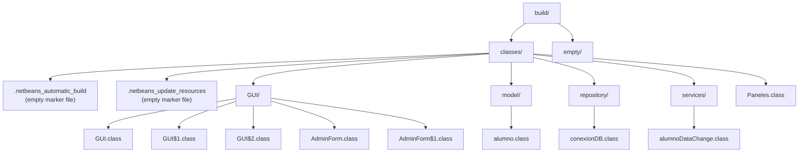
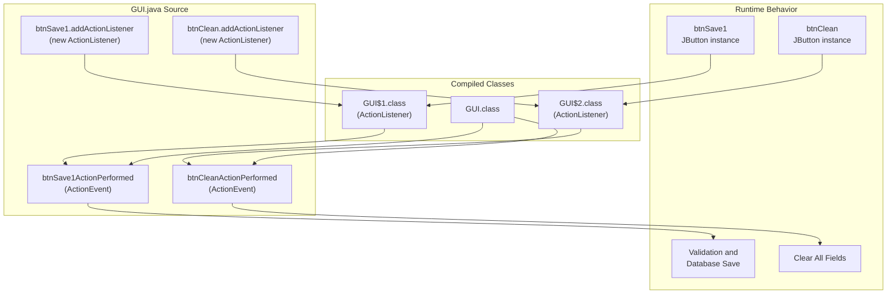

# Reference

> **Relevant source files**
> * [build/classes/.netbeans_automatic_build](https://github.com/axchisan/Crud-MUUUy-simple-en-java-de-hace-a-os/blob/7ec3bd78/build/classes/.netbeans_automatic_build)
> * [src/GUI/GUI.form](https://github.com/axchisan/Crud-MUUUy-simple-en-java-de-hace-a-os/blob/7ec3bd78/src/GUI/GUI.form)

This reference section provides detailed technical information about NetBeans-specific artifacts, build system outputs, and compiler-generated code constructs used throughout the crud3 application. It serves as a technical reference for developers who need to understand the internal structure of GUI form definitions, build markers, and anonymous inner classes.

For information about the GUI components and their functionality, see [User Interface Layer](/axchisan/Crud-MUUUy-simple-en-java-de-hace-a-os/4-user-interface-layer). For build system configuration and targets, see [Build System](/axchisan/Crud-MUUUy-simple-en-java-de-hace-a-os/7-build-system).

## NetBeans Form Definitions

The crud3 application uses NetBeans GUI Builder to design Swing forms. Each form component (e.g., `GUI.GUI`, `GUI.AdminForm`, `Paneles`) has a corresponding `.form` file that stores the visual layout and component metadata in XML format. These `.form` files are not compiled directly but are used by the NetBeans IDE to generate corresponding Java source code.

### Form File Structure

NetBeans `.form` files follow an XML schema with the following key elements:

| Element | Purpose | Example Values |
| --- | --- | --- |
| `<Form>` | Root element defining form version and type | `maxVersion="1.9"`, `type="org.netbeans.modules.form.forminfo.JFrameFormInfo"` |
| `<Properties>` | Form-level properties like close operation | `defaultCloseOperation="3"` (EXIT_ON_CLOSE) |
| `<SyntheticProperties>` | IDE-generated properties for form behavior | `formSizePolicy`, `generateCenter` |
| `<AuxValues>` | Code generation settings and IDE configuration | `FormSettings_generateFQN`, `FormSettings_autoSetComponentName` |
| `<Layout>` | Layout manager specification | `org.netbeans.modules.form.compat2.layouts.DesignAbsoluteLayout` |
| `<SubComponents>` | Child component definitions with properties and constraints | Containers, buttons, text fields, labels |

### Form Code Generation Settings

The `<AuxValues>` section in [src/GUI/GUI.form L11-L22](https://github.com/axchisan/Crud-MUUUy-simple-en-java-de-hace-a-os/blob/7ec3bd78/src/GUI/GUI.form#L11-L22)

 controls how NetBeans generates Java code from the form definition:

| Setting | Type | Value in GUI.form | Description |
| --- | --- | --- | --- |
| `FormSettings_autoResourcing` | Integer | 0 | Disables automatic resource management |
| `FormSettings_autoSetComponentName` | Boolean | false | Component names must be set manually |
| `FormSettings_generateFQN` | Boolean | true | Generates fully qualified class names |
| `FormSettings_generateMnemonicsCode` | Boolean | false | No automatic mnemonic generation |
| `FormSettings_i18nAutoMode` | Boolean | false | No automatic internationalization |
| `FormSettings_layoutCodeTarget` | Integer | 1 | Target Java version for layout code |
| `FormSettings_listenerGenerationStyle` | Integer | 0 | Uses separate methods for listeners |
| `FormSettings_variablesLocal` | Boolean | false | Component variables are instance fields |
| `FormSettings_variablesModifier` | Integer | 2 | Variables are `private` (modifier code 2) |

### GUI.form Component Hierarchy

The main data entry form [src/GUI/GUI.form L28-L134](https://github.com/axchisan/Crud-MUUUy-simple-en-java-de-hace-a-os/blob/7ec3bd78/src/GUI/GUI.form#L28-L134)

 defines the following component tree:

```

```

**Diagram: GUI.form Component Tree with Absolute Positioning**

The form uses `DesignAbsoluteLayout` which positions components at fixed (x, y, width, height) coordinates specified in `<AbsoluteConstraints>` elements.

**Sources:** [src/GUI/GUI.form L1-L137](https://github.com/axchisan/Crud-MUUUy-simple-en-java-de-hace-a-os/blob/7ec3bd78/src/GUI/GUI.form#L1-L137)

### Event Handler Declarations

Event handlers are declared in the `.form` file using `<EventHandler>` elements. For example, the Save button [src/GUI/GUI.form L124-L126](https://github.com/axchisan/Crud-MUUUy-simple-en-java-de-hace-a-os/blob/7ec3bd78/src/GUI/GUI.form#L124-L126)

:

```

```

This declaration causes NetBeans to generate:

1. A method stub `btnSave1ActionPerformed(ActionEvent evt)` in the Java source
2. An anonymous inner class that implements `ActionListener`
3. Code to register the listener: `btnSave1.addActionListener(new java.awt.event.ActionListener() {...})`

Similarly, the Clean button [src/GUI/GUI.form L111-L113](https://github.com/axchisan/Crud-MUUUy-simple-en-java-de-hace-a-os/blob/7ec3bd78/src/GUI/GUI.form#L111-L113)

 declares `btnCleanActionPerformed` as its action handler.

**Sources:** [src/GUI/GUI.form L107-L132](https://github.com/axchisan/Crud-MUUUy-simple-en-java-de-hace-a-os/blob/7ec3bd78/src/GUI/GUI.form#L107-L132)

## Build Artifacts and Generated Files

The Ant build system produces several categories of artifacts in the `build/` directory. Understanding these artifacts is essential for troubleshooting compilation issues and understanding the build process.

### Build Directory Structure



**Diagram: Build Directory Output Structure**

**Sources:** [build/classes/.netbeans_automatic_build L1](https://github.com/axchisan/Crud-MUUUy-simple-en-java-de-hace-a-os/blob/7ec3bd78/build/classes/.netbeans_automatic_build#L1-L1)

### NetBeans Build Markers

NetBeans IDE creates marker files in `build/classes/` to track build state:

| File | Purpose | Content | When Created |
| --- | --- | --- | --- |
| `.netbeans_automatic_build` | Indicates automatic build was performed | Empty | After IDE automatic compilation |
| `.netbeans_update_resources` | Indicates resources need update | Empty | When resources are copied to build output |

The file [build/classes/.netbeans_automatic_build L1](https://github.com/axchisan/Crud-MUUUy-simple-en-java-de-hace-a-os/blob/7ec3bd78/build/classes/.netbeans_automatic_build#L1-L1)

 is empty (contains only a newline). Its presence signals that NetBeans has completed an automatic build. The Ant build system checks for these markers to determine whether a clean build is necessary.

**Sources:** [build/classes/.netbeans_automatic_build L1](https://github.com/axchisan/Crud-MUUUy-simple-en-java-de-hace-a-os/blob/7ec3bd78/build/classes/.netbeans_automatic_build#L1-L1)

### Compiled Class Files

The build process compiles `.java` source files into `.class` bytecode files, organized by package structure:

| Package | Class Files | Purpose |
| --- | --- | --- |
| `GUI/` | `GUI.class`, `AdminForm.class`, `GUI$1.class`, `GUI$2.class`, `AdminForm$1.class` | GUI components and event handler inner classes |
| `model/` | `alumno.class` | Student data model |
| `repository/` | `conexionDB.class` | Database connection management |
| `services/` | `alumnoDataChange.class` | Business logic for data persistence |
| (default) | `Paneles.class` | Additional UI component in default package |

Note that for each GUI class with event handlers, additional `$1`, `$2`, etc. inner classes are generated (see next section).

**Sources:** Referenced from standard Ant compilation output structure

## Anonymous Inner Classes

The Java compiler generates anonymous inner classes for event handlers declared in Swing components. These inner classes implement the appropriate listener interfaces and are instantiated when components register their listeners.

### Naming Convention

Anonymous inner classes follow the naming pattern: `OuterClass$N.class` where:

* `OuterClass` is the enclosing class name (e.g., `GUI`, `AdminForm`)
* `$` is the separator character
* `N` is a sequential number starting from 1

### GUI Event Handler Inner Classes

For the `GUI.GUI` class, the following anonymous inner classes are generated:

| Class File | Listener Interface | Associated Component | Handler Method |
| --- | --- | --- | --- |
| `GUI$1.class` | `ActionListener` | `btnSave1` | `btnSave1ActionPerformed` |
| `GUI$2.class` | `ActionListener` | `btnClean` | `btnCleanActionPerformed` |

These classes are generated from code that follows this pattern (conceptual - actual code is in the generated GUI.java source):

```

```

The compiler assigns sequential numbers based on the order in which anonymous classes appear in the source file.

### Event Handler Mapping



**Diagram: Anonymous Inner Class Event Handler Chain**

**Sources:** [src/GUI/GUI.form L111-L113](https://github.com/axchisan/Crud-MUUUy-simple-en-java-de-hace-a-os/blob/7ec3bd78/src/GUI/GUI.form#L111-L113)

 [src/GUI/GUI.form L124-L126](https://github.com/axchisan/Crud-MUUUy-simple-en-java-de-hace-a-os/blob/7ec3bd78/src/GUI/GUI.form#L124-L126)

### AdminForm Inner Classes

Similarly, `GUI.AdminForm` generates `AdminForm$1.class` and potentially other numbered inner classes for its event handlers, following the same pattern of anonymous `ActionListener` implementations.

### Inner Class Access to Outer Class

Anonymous inner classes have implicit access to the outer class instance via an implicit `this$0` field. This allows the inner class to:

1. Call methods on the outer class (e.g., `btnSave1ActionPerformed`)
2. Access outer class fields (e.g., `txtNombre`, `txtApellido`)
3. Use the outer class type in method signatures

The compiler automatically generates a constructor for each inner class that accepts the outer class instance:

```
Synthetic constructor: GUI$1(GUI outerInstance)
```

This mechanism enables the event handler to invoke validation and service methods that operate on the GUI's text field components.

**Sources:** Standard Java inner class compilation behavior

## Form-to-Code Generation Mapping

The following table shows how `.form` file elements map to generated Java code constructs:

| Form Element | Generated Java Code | Example |
| --- | --- | --- |
| `<Component class="javax.swing.JTextField" name="txtNombre">` | `private javax.swing.JTextField txtNombre;` | Field declaration |
| `<Property name="text" value="Save"/>` | `btnSave1.setText("Save");` | Component initialization |
| `<Constraint ... AbsoluteConstraints x="300" y="40" ...>` | `jPanel1.add(txtNombre, new org.netbeans.lib.awtextra.AbsoluteConstraints(300, 40, 510, -1));` | Layout constraint |
| `<EventHandler event="actionPerformed" handler="btnSave1ActionPerformed"/>` | `btnSave1.addActionListener(new java.awt.event.ActionListener() {...})` | Event listener registration |
| `<Layout class="...DesignAbsoluteLayout">` | `jPanel1.setLayout(new org.netbeans.lib.awtextra.AbsoluteLayout());` | Layout manager instantiation |

NetBeans updates the Java source file whenever the `.form` file is modified, regenerating code within protected regions marked by `//GEN-BEGIN:initComponents` and `//GEN-END:initComponents` comments.

**Sources:** [src/GUI/GUI.form L1-L137](https://github.com/axchisan/Crud-MUUUy-simple-en-java-de-hace-a-os/blob/7ec3bd78/src/GUI/GUI.form#L1-L137)