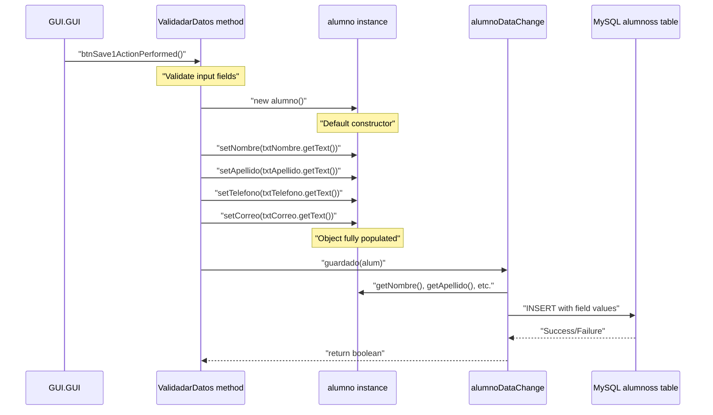
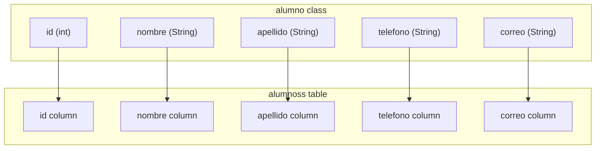

# Student Model (alumno)

> **Relevant source files**
> * [build/classes/model/alumno.class](https://github.com/axchisan/Crud-MUUUy-simple-en-java-de-hace-a-os/blob/7ec3bd78/build/classes/model/alumno.class)
> * [src/model/alumno.java](https://github.com/axchisan/Crud-MUUUy-simple-en-java-de-hace-a-os/blob/7ec3bd78/src/model/alumno.java)

## Purpose and Scope

This page documents the `alumno` class, which serves as the data model (entity) representing student records in the crud3 application. The `alumno` class is a Plain Old Java Object (POJO) that encapsulates five fields: student ID, name, last name, phone number, and email address. It provides constructors for object instantiation and standard getter/setter methods for field access.

For information about how this model is persisted to the database, see [Data Change Service (alumnoDataChange)](/axchisan/Crud-MUUUy-simple-en-java-de-hace-a-os/5.2-data-change-service-(alumnodatachange)). For details on database schema mapping, see [Database Schema](/axchisan/Crud-MUUUy-simple-en-java-de-hace-a-os/6.2-database-schema).

## Class Overview

The `alumno` class is located in the `model` package and serves as the domain model for student entities. It follows the JavaBean pattern with private/package-private fields and public accessor methods.

### Class Structure Diagram

```

```

**Sources:** [src/model/alumno.java L3-L62](https://github.com/axchisan/Crud-MUUUy-simple-en-java-de-hace-a-os/blob/7ec3bd78/src/model/alumno.java#L3-L62)

## Field Definitions

The `alumno` class contains five fields that map directly to columns in the `alumnoss` database table. All fields use package-private (default) visibility, which is unconventional but functional within the same package.

| Field Name | Java Type | Database Column | Description |
| --- | --- | --- | --- |
| `id` | `int` | `id` | Primary key identifier for the student record |
| `nombre` | `String` | `nombre` | Student's first name |
| `apellido` | `String` | `apellido` | Student's last name (surname) |
| `telefono` | `String` | `telefono` | Student's phone number |
| `correo` | `String` | `correo` | Student's email address |

### Field Declarations

[src/model/alumno.java L5-L9](https://github.com/axchisan/Crud-MUUUy-simple-en-java-de-hace-a-os/blob/7ec3bd78/src/model/alumno.java#L5-L9)

```

```

**Sources:** [src/model/alumno.java L5-L9](https://github.com/axchisan/Crud-MUUUy-simple-en-java-de-hace-a-os/blob/7ec3bd78/src/model/alumno.java#L5-L9)

## Constructors

The `alumno` class provides two constructors: a default no-argument constructor and a parameterized constructor for full initialization.

### Default Constructor

The default constructor creates an empty `alumno` instance with uninitialized fields. This constructor is used when creating objects before populating them with data from user input or database results.

[src/model/alumno.java L11-L12](https://github.com/axchisan/Crud-MUUUy-simple-en-java-de-hace-a-os/blob/7ec3bd78/src/model/alumno.java#L11-L12)

**Sources:** [src/model/alumno.java L11-L12](https://github.com/axchisan/Crud-MUUUy-simple-en-java-de-hace-a-os/blob/7ec3bd78/src/model/alumno.java#L11-L12)

### Parameterized Constructor

The parameterized constructor initializes all five fields during object creation. It accepts values for `id`, `nombre`, `apellido`, `telefono`, and `correo` as parameters.

[src/model/alumno.java L14-L20](https://github.com/axchisan/Crud-MUUUy-simple-en-java-de-hace-a-os/blob/7ec3bd78/src/model/alumno.java#L14-L20)

Constructor signature:

```

```

**Sources:** [src/model/alumno.java L14-L20](https://github.com/axchisan/Crud-MUUUy-simple-en-java-de-hace-a-os/blob/7ec3bd78/src/model/alumno.java#L14-L20)

## Getter and Setter Methods

The `alumno` class follows the JavaBean convention by providing getter and setter methods for all fields. These methods enable controlled access to the private/package-private fields.

### ID Accessor Methods

* `getId()` - Returns the student ID as an integer [src/model/alumno.java L22-L24](https://github.com/axchisan/Crud-MUUUy-simple-en-java-de-hace-a-os/blob/7ec3bd78/src/model/alumno.java#L22-L24)
* `setId(int id)` - Sets the student ID [src/model/alumno.java L26-L28](https://github.com/axchisan/Crud-MUUUy-simple-en-java-de-hace-a-os/blob/7ec3bd78/src/model/alumno.java#L26-L28)

### Nombre (First Name) Accessor Methods

* `getNombre()` - Returns the student's first name [src/model/alumno.java L30-L32](https://github.com/axchisan/Crud-MUUUy-simple-en-java-de-hace-a-os/blob/7ec3bd78/src/model/alumno.java#L30-L32)
* `setNombre(String nombre)` - Sets the student's first name [src/model/alumno.java L34-L36](https://github.com/axchisan/Crud-MUUUy-simple-en-java-de-hace-a-os/blob/7ec3bd78/src/model/alumno.java#L34-L36)

### Apellido (Last Name) Accessor Methods

* `getApellido()` - Returns the student's last name [src/model/alumno.java L38-L40](https://github.com/axchisan/Crud-MUUUy-simple-en-java-de-hace-a-os/blob/7ec3bd78/src/model/alumno.java#L38-L40)
* `setApellido(String apellido)` - Sets the student's last name [src/model/alumno.java L42-L44](https://github.com/axchisan/Crud-MUUUy-simple-en-java-de-hace-a-os/blob/7ec3bd78/src/model/alumno.java#L42-L44)

### Telefono (Phone) Accessor Methods

* `getTelefono()` - Returns the student's phone number [src/model/alumno.java L46-L48](https://github.com/axchisan/Crud-MUUUy-simple-en-java-de-hace-a-os/blob/7ec3bd78/src/model/alumno.java#L46-L48)
* `setTelefono(String telefono)` - Sets the student's phone number [src/model/alumno.java L50-L52](https://github.com/axchisan/Crud-MUUUy-simple-en-java-de-hace-a-os/blob/7ec3bd78/src/model/alumno.java#L50-L52)

### Correo (Email) Accessor Methods

* `getCorreo()` - Returns the student's email address [src/model/alumno.java L54-L56](https://github.com/axchisan/Crud-MUUUy-simple-en-java-de-hace-a-os/blob/7ec3bd78/src/model/alumno.java#L54-L56)
* `setCorreo(String correo)` - Sets the student's email address [src/model/alumno.java L58-L60](https://github.com/axchisan/Crud-MUUUy-simple-en-java-de-hace-a-os/blob/7ec3bd78/src/model/alumno.java#L58-L60)

**Sources:** [src/model/alumno.java L22-L60](https://github.com/axchisan/Crud-MUUUy-simple-en-java-de-hace-a-os/blob/7ec3bd78/src/model/alumno.java#L22-L60)

## Usage in Application Architecture

The `alumno` class serves as a data transfer object between the presentation layer, business logic layer, and data access layer. The following diagram illustrates how `alumno` instances are created and utilized throughout the application.

### alumno Object Lifecycle



**Sources:** [src/model/alumno.java L3-L62](https://github.com/axchisan/Crud-MUUUy-simple-en-java-de-hace-a-os/blob/7ec3bd78/src/model/alumno.java#L3-L62)

 [src/GUI/GUI.java L99-L129](https://github.com/axchisan/Crud-MUUUy-simple-en-java-de-hace-a-os/blob/7ec3bd78/src/GUI/GUI.java#L99-L129)

 [src/services/alumnoDataChange.java](https://github.com/axchisan/Crud-MUUUy-simple-en-java-de-hace-a-os/blob/7ec3bd78/src/services/alumnoDataChange.java)

## Integration Points

The `alumno` model integrates with multiple application layers:

### Integration with GUI Layer

The GUI layer (`GUI.GUI` class) creates `alumno` instances using the default constructor and populates them via setter methods with data from text fields:

* `txtNombre.getText()` → `setNombre()`
* `txtApellido.getText()` → `setApellido()`
* `txtTelefono.getText()` → `setTelefono()`
* `txtCorreo.getText()` → `setCorreo()`

Referenced in validation logic at [src/GUI/GUI.java L99-L129](https://github.com/axchisan/Crud-MUUUy-simple-en-java-de-hace-a-os/blob/7ec3bd78/src/GUI/GUI.java#L99-L129)

### Integration with Service Layer

The `alumnoDataChange.guardado()` method accepts an `alumno` parameter and extracts field values using getter methods to construct SQL INSERT statements:

* `alum.getNombre()` → SQL parameter 1
* `alum.getApellido()` → SQL parameter 2
* `alum.getTelefono()` → SQL parameter 3
* `alum.getCorreo()` → SQL parameter 4

Referenced in [Data Change Service](/axchisan/Crud-MUUUy-simple-en-java-de-hace-a-os/5.2-data-change-service-(alumnodatachange))

### Database Column Mapping



**Sources:** [src/model/alumno.java L5-L9](https://github.com/axchisan/Crud-MUUUy-simple-en-java-de-hace-a-os/blob/7ec3bd78/src/model/alumno.java#L5-L9)

 [Database Schema](/axchisan/Crud-MUUUy-simple-en-java-de-hace-a-os/6.2-database-schema)

## Design Patterns and Conventions

### JavaBean Pattern

The `alumno` class follows the JavaBean specification with:

* Default no-argument constructor
* Private/package-private fields
* Public getter/setter methods following naming conventions (`getFieldName()`, `setFieldName()`)

### Data Transfer Object (DTO) Pattern

The `alumno` class serves as a DTO that carries data between application layers without containing business logic. It is a simple container for student-related data.

### Naming Conventions

**Note:** The class name `alumno` violates Java naming conventions by using lowercase. Standard Java convention dictates that class names should begin with an uppercase letter (e.g., `Alumno`). However, the application uses `alumno` throughout, and this should be maintained for consistency with the existing codebase.

**Sources:** [src/model/alumno.java L3](https://github.com/axchisan/Crud-MUUUy-simple-en-java-de-hace-a-os/blob/7ec3bd78/src/model/alumno.java#L3-L3)

## Code Entity Reference

| Code Entity | Type | Location |
| --- | --- | --- |
| `model.alumno` | Class | [src/model/alumno.java L3](https://github.com/axchisan/Crud-MUUUy-simple-en-java-de-hace-a-os/blob/7ec3bd78/src/model/alumno.java#L3-L3) |
| `alumno()` | Constructor | [src/model/alumno.java L11-L12](https://github.com/axchisan/Crud-MUUUy-simple-en-java-de-hace-a-os/blob/7ec3bd78/src/model/alumno.java#L11-L12) |
| `alumno(int, String, String, String, String)` | Constructor | [src/model/alumno.java L14-L20](https://github.com/axchisan/Crud-MUUUy-simple-en-java-de-hace-a-os/blob/7ec3bd78/src/model/alumno.java#L14-L20) |
| `getId()` | Method | [src/model/alumno.java L22-L24](https://github.com/axchisan/Crud-MUUUy-simple-en-java-de-hace-a-os/blob/7ec3bd78/src/model/alumno.java#L22-L24) |
| `setId(int)` | Method | [src/model/alumno.java L26-L28](https://github.com/axchisan/Crud-MUUUy-simple-en-java-de-hace-a-os/blob/7ec3bd78/src/model/alumno.java#L26-L28) |
| `getNombre()` | Method | [src/model/alumno.java L30-L32](https://github.com/axchisan/Crud-MUUUy-simple-en-java-de-hace-a-os/blob/7ec3bd78/src/model/alumno.java#L30-L32) |
| `setNombre(String)` | Method | [src/model/alumno.java L34-L36](https://github.com/axchisan/Crud-MUUUy-simple-en-java-de-hace-a-os/blob/7ec3bd78/src/model/alumno.java#L34-L36) |
| `getApellido()` | Method | [src/model/alumno.java L38-L40](https://github.com/axchisan/Crud-MUUUy-simple-en-java-de-hace-a-os/blob/7ec3bd78/src/model/alumno.java#L38-L40) |
| `setApellido(String)` | Method | [src/model/alumno.java L42-L44](https://github.com/axchisan/Crud-MUUUy-simple-en-java-de-hace-a-os/blob/7ec3bd78/src/model/alumno.java#L42-L44) |
| `getTelefono()` | Method | [src/model/alumno.java L46-L48](https://github.com/axchisan/Crud-MUUUy-simple-en-java-de-hace-a-os/blob/7ec3bd78/src/model/alumno.java#L46-L48) |
| `setTelefono(String)` | Method | [src/model/alumno.java L50-L52](https://github.com/axchisan/Crud-MUUUy-simple-en-java-de-hace-a-os/blob/7ec3bd78/src/model/alumno.java#L50-L52) |
| `getCorreo()` | Method | [src/model/alumno.java L54-L56](https://github.com/axchisan/Crud-MUUUy-simple-en-java-de-hace-a-os/blob/7ec3bd78/src/model/alumno.java#L54-L56) |
| `setCorreo(String)` | Method | [src/model/alumno.java L58-L60](https://github.com/axchisan/Crud-MUUUy-simple-en-java-de-hace-a-os/blob/7ec3bd78/src/model/alumno.java#L58-L60) |

**Sources:** [src/model/alumno.java L3-L62](https://github.com/axchisan/Crud-MUUUy-simple-en-java-de-hace-a-os/blob/7ec3bd78/src/model/alumno.java#L3-L62)