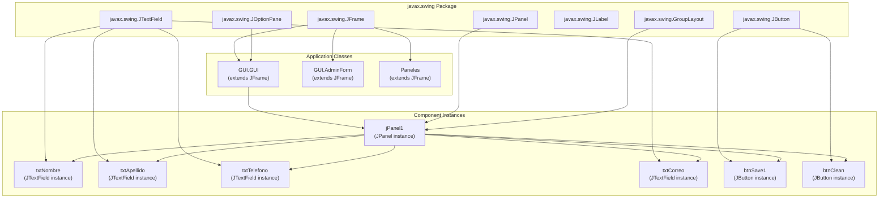
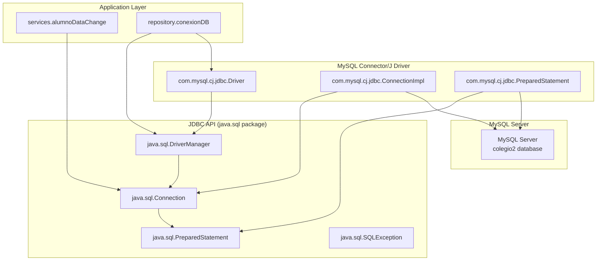
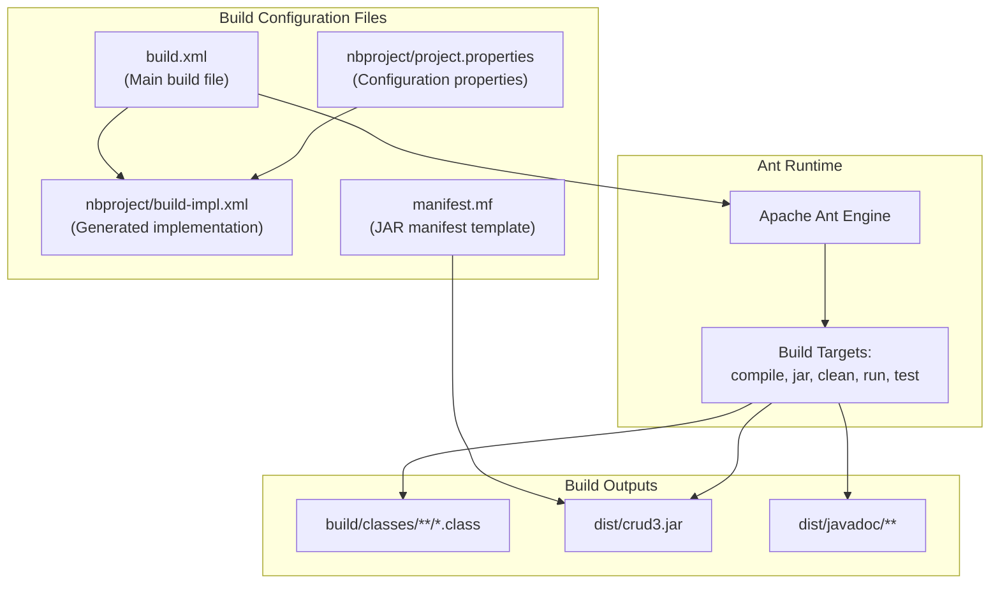
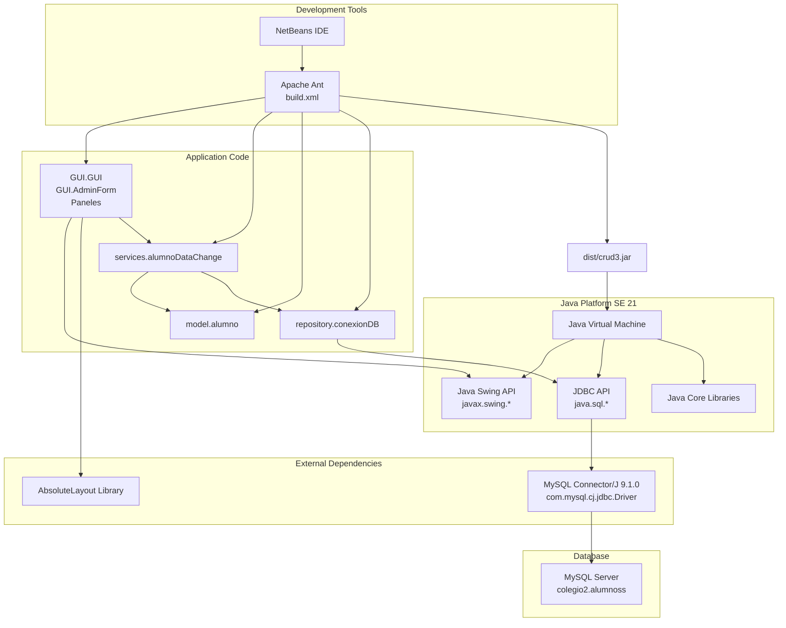

# Technology Stack

> **Relevant source files**
> * [build.xml](https://github.com/axchisan/Crud-MUUUy-simple-en-java-de-hace-a-os/blob/7ec3bd78/build.xml)
> * [build/classes/repository/conexionDB.class](https://github.com/axchisan/Crud-MUUUy-simple-en-java-de-hace-a-os/blob/7ec3bd78/build/classes/repository/conexionDB.class)
> * [nbproject/project.properties](https://github.com/axchisan/Crud-MUUUy-simple-en-java-de-hace-a-os/blob/7ec3bd78/nbproject/project.properties)

## Purpose and Scope

This document provides a comprehensive overview of the technologies and frameworks used in the crud3 application. It details the programming language, UI framework, database system, build tools, and external dependencies that comprise the technical foundation of the system. For information about how these technologies interact within the application's architecture, see [Architecture](/axchisan/Crud-MUUUy-simple-en-java-de-hace-a-os/3-architecture). For details on setting up these technologies, see [Prerequisites and Setup](/axchisan/Crud-MUUUy-simple-en-java-de-hace-a-os/2.1-prerequisites-and-setup).

## Technology Overview

The crud3 application is built on a traditional Java desktop application stack with the following core components:

| Technology | Version/Type | Role |
| --- | --- | --- |
| Java Platform | Java SE 21 | Core runtime and development platform |
| Java Swing | Bundled with Java SE | GUI framework for desktop interface |
| MySQL | 8.0+ | Relational database management system |
| JDBC | Bundled with Java SE | Database connectivity API |
| MySQL Connector/J | 9.1.0 | JDBC driver for MySQL |
| Apache Ant | NetBeans bundled | Build automation tool |
| NetBeans IDE | 12.0+ | Integrated development environment |

**Sources**: [nbproject/project.properties L50-L51](https://github.com/axchisan/Crud-MUUUy-simple-en-java-de-hace-a-os/blob/7ec3bd78/nbproject/project.properties#L50-L51)

 [nbproject/project.properties L36](https://github.com/axchisan/Crud-MUUUy-simple-en-java-de-hace-a-os/blob/7ec3bd78/nbproject/project.properties#L36-L36)

 [build.xml L10-L12](https://github.com/axchisan/Crud-MUUUy-simple-en-java-de-hace-a-os/blob/7ec3bd78/build.xml#L10-L12)

---

## Core Platform: Java SE 21

The application is built on Java Standard Edition 21, configured as both the source and target version.

### Configuration

```
javac.source=21
javac.target=21
```

This ensures that the application uses Java 21 language features and produces bytecode compatible with Java 21 and later JVMs. The Java runtime provides:

* Core language features (classes, objects, exceptions)
* Standard library APIs (collections, I/O, networking)
* Java Swing GUI components
* JDBC database connectivity APIs
* Multi-threading support for event-driven GUI operations

**Sources**: [nbproject/project.properties L50-L51](https://github.com/axchisan/Crud-MUUUy-simple-en-java-de-hace-a-os/blob/7ec3bd78/nbproject/project.properties#L50-L51)

---

## User Interface Framework: Java Swing

### Technology Description

The presentation layer is built entirely with Java Swing, a GUI widget toolkit that is part of Java Foundation Classes (JFC). Swing provides platform-independent components for building desktop applications.

### Diagram: Swing Technology Mapping



### Swing Components Used

| Component Type | Purpose | Instances |
| --- | --- | --- |
| `JFrame` | Top-level window containers | `GUI.GUI`, `GUI.AdminForm`, `Paneles` |
| `JPanel` | Container for organizing components | `jPanel1` and others |
| `JTextField` | Text input fields | `txtNombre`, `txtApellido`, `txtTelefono`, `txtCorreo` |
| `JButton` | Action buttons | `btnSave1`, `btnClean` |
| `JLabel` | Static text labels | `jLabel1`, `jLabel2`, `jLabel3`, `jLabel4` |
| `JOptionPane` | Modal dialogs for messages | Used in validation and feedback |
| `GroupLayout` | Layout manager | Used for component positioning |

### Event Handling

Swing's event-driven architecture is implemented using `ActionListener` interfaces attached to button components. The application uses anonymous inner classes for event handlers:

* `GUI$1.class` - First action listener (typically for btnSave1)
* `GUI$2.class` - Second action listener (typically for btnClean)

These are compiled as separate `.class` files in the build output.

**Sources**: [src/GUI/GUI.java](https://github.com/axchisan/Crud-MUUUy-simple-en-java-de-hace-a-os/blob/7ec3bd78/src/GUI/GUI.java)

 [src/GUI/AdminForm.java](https://github.com/axchisan/Crud-MUUUy-simple-en-java-de-hace-a-os/blob/7ec3bd78/src/GUI/AdminForm.java)

 [src/Paneles.java](https://github.com/axchisan/Crud-MUUUy-simple-en-java-de-hace-a-os/blob/7ec3bd78/src/Paneles.java)

---

## Database System: MySQL

### Technology Description

The application uses MySQL as its relational database management system (RDBMS) for persistent data storage.

### Connection Configuration

The database connection is configured with the following parameters embedded in the `conexionDB` class:

| Parameter | Value |
| --- | --- |
| JDBC URL | `jdbc:mysql://localhost:3306/colegio2` |
| Host | `localhost` |
| Port | `3306` (default MySQL port) |
| Database Name | `colegio2` |
| Username | `root` |
| Password | (empty string) |

### Database Schema

The application interacts with a single table:

**Table**: `alumnoss`

| Column | Type | Purpose |
| --- | --- | --- |
| `id` | Integer (auto-increment) | Primary key |
| `nombre` | VARCHAR | Student first name |
| `apellido` | VARCHAR | Student last name |
| `telefono` | VARCHAR | Student phone number |
| `correo` | VARCHAR | Student email address |

**Sources**: [build/classes/repository/conexionDB.class L1-L7](https://github.com/axchisan/Crud-MUUUy-simple-en-java-de-hace-a-os/blob/7ec3bd78/build/classes/repository/conexionDB.class#L1-L7)

---

## Database Connectivity: JDBC and MySQL Connector/J

### JDBC API

Java Database Connectivity (JDBC) is a Java API for connecting to and executing queries against databases. The application uses standard JDBC interfaces:

* `java.sql.Connection` - Database connection
* `java.sql.DriverManager` - Connection factory
* `java.sql.PreparedStatement` - Parameterized SQL execution

### MySQL Connector/J Driver

The application depends on MySQL Connector/J version 9.1.0, which provides the JDBC driver implementation for MySQL databases.

#### Diagram: JDBC Technology Stack



#### Driver Configuration

The MySQL Connector/J library is configured in the project classpath:

```
file.reference.mysql-connector-j-9.1.0.jar=/home/axchisan/Downloads/mysql-connector-j-9.1.0/mysql-connector-j-9.1.0.jar
```

And included in the compilation and runtime classpath:

```
javac.classpath=\
    ${file.reference.mysql-connector-j-9.1.0.jar}:\
    ${libs.absolutelayout.classpath}
```

#### Driver Loading

The application explicitly loads the MySQL JDBC driver using reflection:

```
Class.forName("com.mysql.cj.jdbc.Driver")
```

This registers the driver with the `DriverManager`, enabling the application to obtain database connections.

**Sources**: [nbproject/project.properties L36-L41](https://github.com/axchisan/Crud-MUUUy-simple-en-java-de-hace-a-os/blob/7ec3bd78/nbproject/project.properties#L36-L41)

 [build/classes/repository/conexionDB.class L2-L5](https://github.com/axchisan/Crud-MUUUy-simple-en-java-de-hace-a-os/blob/7ec3bd78/build/classes/repository/conexionDB.class#L2-L5)

---

## Build System: Apache Ant

### Technology Description

Apache Ant is an XML-based build automation tool used to compile, test, and package the application. The build system is managed by NetBeans but can be executed independently via command-line.

### Build Configuration Architecture



### Key Build Properties

| Property | Value | Purpose |
| --- | --- | --- |
| `project.name` | `crud3` | Project identifier |
| `main.class` | `GUI.GUI` | Entry point class for JAR execution |
| `build.dir` | `build` | Output directory for compiled classes |
| `dist.dir` | `dist` | Output directory for distributable JAR |
| `dist.jar` | `${dist.dir}/crud3.jar` | Final JAR file path |
| `src.dir` | `src` | Source code directory |
| `javac.source` | `21` | Java source version |
| `javac.target` | `21` | Java bytecode target version |

### Primary Build Targets

The build system provides several targets for different tasks:

| Target | Purpose |
| --- | --- |
| `compile` | Compiles Java source files to `.class` files |
| `jar` | Packages compiled classes into executable JAR |
| `clean` | Removes build artifacts (`build/` and `dist/` directories) |
| `run` | Executes the application (launches `GUI.GUI` main class) |
| `test` | Runs JUnit tests (if present) |
| `javadoc` | Generates API documentation |

### Build Lifecycle Hooks

The build system supports customization through lifecycle hooks:

* `-pre-init`, `-post-init` - Before/after property initialization
* `-pre-compile`, `-post-compile` - Before/after compilation
* `-pre-jar`, `-post-jar` - Before/after JAR creation
* `-post-clean` - After cleaning build artifacts

**Sources**: [build.xml L1-L74](https://github.com/axchisan/Crud-MUUUy-simple-en-java-de-hace-a-os/blob/7ec3bd78/build.xml#L1-L74)

 [nbproject/project.properties L1-L99](https://github.com/axchisan/Crud-MUUUy-simple-en-java-de-hace-a-os/blob/7ec3bd78/nbproject/project.properties#L1-L99)

---

## Development Environment: NetBeans IDE

### Technology Description

NetBeans is the primary integrated development environment (IDE) for this project. The project structure follows NetBeans conventions and includes IDE-specific configuration files.

### NetBeans-Specific Features

| Feature | Implementation |
| --- | --- |
| Visual GUI Builder | `.form` XML files (e.g., `GUI.form`, `AdminForm.form`) |
| Project Configuration | `nbproject/project.xml`, `nbproject/project.properties` |
| Private Settings | `nbproject/private/private.properties` |
| Ant Integration | Auto-generated `nbproject/build-impl.xml` |
| Library Management | `libs.absolutelayout.classpath` reference |

### GUI Builder

NetBeans GUI Builder (formerly Matisse) is used to design Swing interfaces visually. Each GUI class has an associated `.form` file that stores the visual layout in XML format. The GUI Builder generates the following code:

* Component initialization (`initComponents()` method)
* Layout management (GroupLayout configuration)
* Event handler stubs (ActionListener methods)

The `.form` files are not compiled directly but are used by NetBeans to regenerate GUI initialization code when the visual design is modified.

**Sources**: [nbproject/project.properties L1-L99](https://github.com/axchisan/Crud-MUUUy-simple-en-java-de-hace-a-os/blob/7ec3bd78/nbproject/project.properties#L1-L99)

 [build.xml L10-L12](https://github.com/axchisan/Crud-MUUUy-simple-en-java-de-hace-a-os/blob/7ec3bd78/build.xml#L10-L12)

---

## Technology Integration Summary

### Diagram: Complete Technology Stack with Code Mappings



### Classpath Configuration

The complete classpath for compilation and runtime includes:

1. **Application classes**: `${build.classes.dir}`
2. **MySQL Connector/J**: `${file.reference.mysql-connector-j-9.1.0.jar}`
3. **AbsoluteLayout library**: `${libs.absolutelayout.classpath}`

This classpath is configured in `project.properties` and used by both the Ant build system and the NetBeans IDE for compilation, execution, and debugging.

**Sources**: [nbproject/project.properties L39-L41](https://github.com/axchisan/Crud-MUUUy-simple-en-java-de-hace-a-os/blob/7ec3bd78/nbproject/project.properties#L39-L41)

 [nbproject/project.properties L82-L84](https://github.com/axchisan/Crud-MUUUy-simple-en-java-de-hace-a-os/blob/7ec3bd78/nbproject/project.properties#L82-L84)

 [build.xml L1-L74](https://github.com/axchisan/Crud-MUUUy-simple-en-java-de-hace-a-os/blob/7ec3bd78/build.xml#L1-L74)

---

## Technology Versions and Compatibility

| Component | Version | Compatibility Notes |
| --- | --- | --- |
| Java SE | 21 | Requires JDK 21 or later for compilation and execution |
| MySQL Connector/J | 9.1.0 | Compatible with MySQL 8.0+ |
| MySQL Server | 8.0+ (recommended) | Minimum version not specified, but 8.0+ recommended |
| Apache Ant | NetBeans bundled | Any Ant 1.9+ should work |
| NetBeans IDE | 12.0+ (recommended) | Earlier versions may work but not tested |

**Sources**: [nbproject/project.properties L50-L51](https://github.com/axchisan/Crud-MUUUy-simple-en-java-de-hace-a-os/blob/7ec3bd78/nbproject/project.properties#L50-L51)

 [nbproject/project.properties L36](https://github.com/axchisan/Crud-MUUUy-simple-en-java-de-hace-a-os/blob/7ec3bd78/nbproject/project.properties#L36-L36)