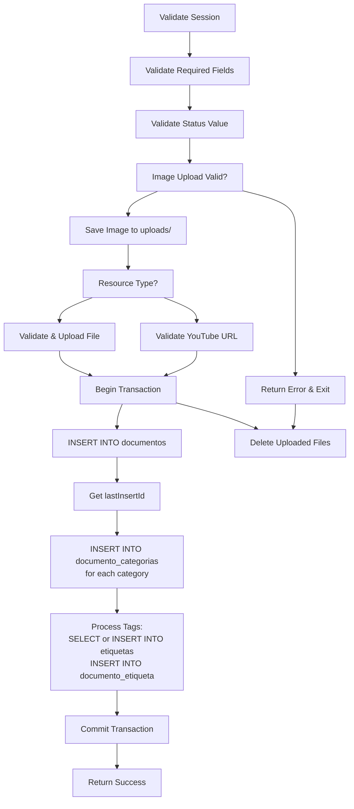
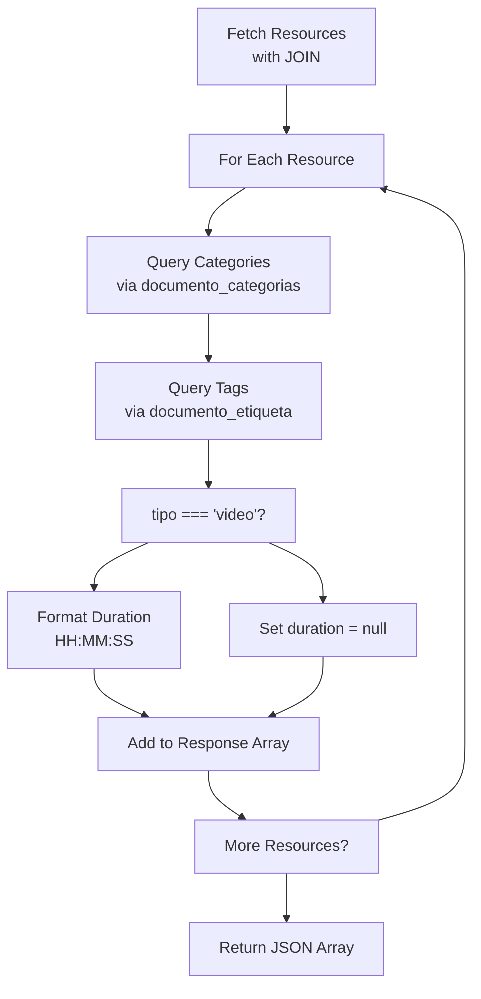
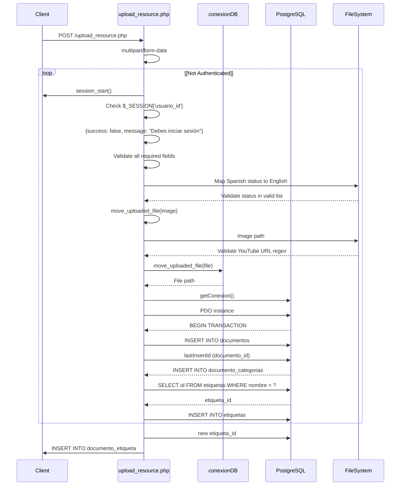
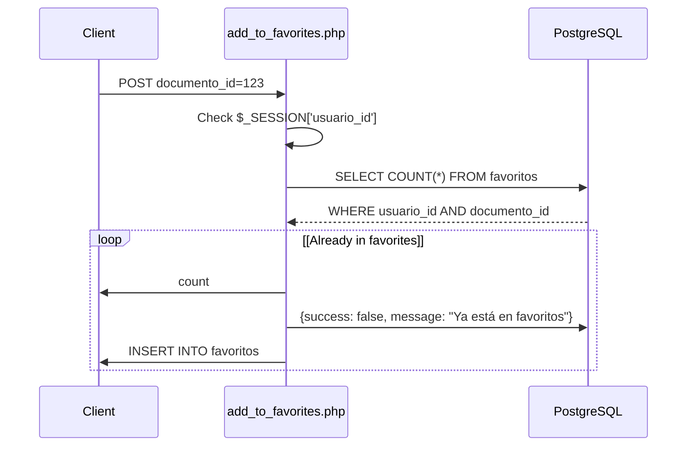

# API de gestión de recursos

> **Archivos fuente relevantes**
> * [src/backend/gestionRecursos/add_to_favorites.php](https://github.com/axchisan/El-rincon-de-ADSO/blob/3e310227/src/backend/gestionRecursos/add_to_favorites.php)
> * [src/backend/gestionRecursos/add_to_recently_viewed.php](https://github.com/axchisan/El-rincon-de-ADSO/blob/3e310227/src/backend/gestionRecursos/add_to_recently_viewed.php)
> * [src/backend/gestionRecursos/add_to_saved.php](https://github.com/axchisan/El-rincon-de-ADSO/blob/3e310227/src/backend/gestionRecursos/add_to_saved.php)
> * [src/backend/gestionRecursos/get_recent_resources.php](https://github.com/axchisan/El-rincon-de-ADSO/blob/3e310227/src/backend/gestionRecursos/get_recent_resources.php)
> * [src/backend/gestionRecursos/obtener_vistas_recientemente.php](https://github.com/axchisan/El-rincon-de-ADSO/blob/3e310227/src/backend/gestionRecursos/get_recently_viewed.php)
> * [src/backend/gestionRecursos/get_saved_resources.php](https://github.com/axchisan/El-rincon-de-ADSO/blob/3e310227/src/backend/gestionRecursos/get_saved_resources.php)
> * [src/backend/gestionRecursos/get_user_favorites.php](https://github.com/axchisan/El-rincon-de-ADSO/blob/3e310227/src/backend/gestionRecursos/get_user_favorites.php)
> * [src/backend/gestionRecursos/get_user_resources.php](https://github.com/axchisan/El-rincon-de-ADSO/blob/3e310227/src/backend/gestionRecursos/get_user_resources.php)
> * [src/backend/gestionRecursos/eliminar_de_favoritos.php](https://github.com/axchisan/El-rincon-de-ADSO/blob/3e310227/src/backend/gestionRecursos/remove_from_favorites.php)
> * [src/backend/gestionRecursos/eliminar_de_guardado.php](https://github.com/axchisan/El-rincon-de-ADSO/blob/3e310227/src/backend/gestionRecursos/remove_from_saved.php)
> * [src/backend/gestionRecursos/upload_resource.php](https://github.com/axchisan/El-rincon-de-ADSO/blob/3e310227/src/backend/gestionRecursos/upload_resource.php)

## Propósito y alcance

Este documento proporciona una referencia completa para todos los puntos finales de la API de backend relacionados con la gestión de recursos en El Rincón de ADSO. Estas API gestionan la creación, recuperación y organización de recursos educativos (libros, vídeos, documentos), así como colecciones específicas de cada usuario, como favoritos, recursos guardados e historial de visualizaciones.

Para obtener información sobre las páginas del visor de recursos y las interfaces de usuario, consulte [Visores de recursos](/axchisan/El-rincon-de-ADSO/5.2-resource-viewers) . Para obtener más información sobre los sistemas de categorías y etiquetas, consulte [Sistema de categorías y etiquetas](/axchisan/El-rincon-de-ADSO/5.5-categories-and-tags-system) . Para conocer las API relacionadas con redes sociales y comunidades (comentarios, foros), consulte [API de redes sociales y comunidades](/axchisan/El-rincon-de-ADSO/9.2-social-and-community-apis) .

Todas las API documentadas aquí se encuentran en[src/backend/gestionRecursos/](https://github.com/axchisan/El-rincon-de-ADSO/blob/3e310227/src/backend/gestionRecursos/)

y seguir patrones consistentes para la autenticación, el manejo de errores y el formato de respuesta.

---

## Descripción general del panorama de API

El sistema API de gestión de recursos consta de tres grupos funcionales principales: creación/recuperación de recursos, gestión de colecciones de usuarios y operaciones de recopilación.

```mermaid
flowchart TD

upload["upload_resource.php<br>POST multipart/form-data"]
getRecent["get_recent_resources.php<br>GET with filters"]
getUserRes["get_user_resources.php<br>GET user's uploads"]
getFav["get_user_favorites.php<br>GET favorites list"]
getSaved["get_saved_resources.php<br>GET saved list"]
getViewed["get_recently_viewed.php<br>GET viewing history"]
addFav["add_to_favorites.php<br>POST documento_id"]
addSaved["add_to_saved.php<br>POST documento_id"]
addViewed["add_to_recently_viewed.php<br>POST documento_id"]
removeFav["remove_from_favorites.php<br>POST documento_id"]
removeSaved["remove_from_saved.php<br>POST documento_id"]
documentos["documentos"]
favoritos["favoritos"]
guardados["guardados"]
recenteVistos["recientemente_vistos"]
docCat["documento_categorias"]
docEtiq["documento_etiqueta"]

upload --> documentos
upload --> docCat
upload --> docEtiq
getRecent --> documentos
getRecent --> docCat
getRecent --> docEtiq
getUserRes --> documentos
getUserRes --> docCat
getUserRes --> docEtiq
getFav --> favoritos
getFav --> documentos
getSaved --> guardados
getSaved --> documentos
getViewed --> recenteVistos
getViewed --> documentos
addFav --> favoritos
addSaved --> guardados
addViewed --> recenteVistos
removeFav --> favoritos
removeSaved --> guardados

subgraph subGraph3 ["Database Tables"]
    documentos
    favoritos
    guardados
    recenteVistos
    docCat
    docEtiq
end

subgraph subGraph2 ["Collection Management Operations"]
    addFav
    addSaved
    addViewed
    removeFav
    removeSaved
end

subgraph subGraph1 ["User Collection Retrieval"]
    getFav
    getSaved
    getViewed
end

subgraph subGraph0 ["Resource Creation & Retrieval"]
    upload
    getRecent
    getUserRes
end
```



**Fuentes:** [src/backend/gestionRecursos/upload_resource.php](https://github.com/axchisan/El-rincon-de-ADSO/blob/3e310227/src/backend/gestionRecursos/upload_resource.php)

 [src/backend/gestionRecursos/get_recent_resources.php](https://github.com/axchisan/El-rincon-de-ADSO/blob/3e310227/src/backend/gestionRecursos/get_recent_resources.php)

 [src/backend/gestionRecursos/get_user_resources.php](https://github.com/axchisan/El-rincon-de-ADSO/blob/3e310227/src/backend/gestionRecursos/get_user_resources.php)

 [src/backend/gestionRecursos/get_user_favorites.php](https://github.com/axchisan/El-rincon-de-ADSO/blob/3e310227/src/backend/gestionRecursos/get_user_favorites.php)

 [src/backend/gestionRecursos/get_saved_resources.php](https://github.com/axchisan/El-rincon-de-ADSO/blob/3e310227/src/backend/gestionRecursos/get_saved_resources.php)

 [src/backend/gestionRecursos/obtener_vistas_recientemente.php](https://github.com/axchisan/El-rincon-de-ADSO/blob/3e310227/src/backend/gestionRecursos/get_recently_viewed.php)

 [src/backend/gestionRecursos/add_to_favorites.php](https://github.com/axchisan/El-rincon-de-ADSO/blob/3e310227/src/backend/gestionRecursos/add_to_favorites.php)

 [src/backend/gestionRecursos/add_to_saved.php](https://github.com/axchisan/El-rincon-de-ADSO/blob/3e310227/src/backend/gestionRecursos/add_to_saved.php)

 [src/backend/gestionRecursos/add_to_recently_viewed.php](https://github.com/axchisan/El-rincon-de-ADSO/blob/3e310227/src/backend/gestionRecursos/add_to_recently_viewed.php)

 [src/backend/gestionRecursos/eliminar_de_favoritos.php](https://github.com/axchisan/El-rincon-de-ADSO/blob/3e310227/src/backend/gestionRecursos/remove_from_favorites.php)

 [src/backend/gestionRecursos/eliminar_de_guardado.php](https://github.com/axchisan/El-rincon-de-ADSO/blob/3e310227/src/backend/gestionRecursos/remove_from_saved.php)

---

## API de carga de recursos

### Punto final:upload_resource.php

**Método HTTP:** POST 
**Tipo de contenido:** multipart/form-data 
**Autenticación:** Obligatorio ( `$_SESSION['usuario_id']`)

This endpoint handles the complete resource creation workflow, including file uploads, metadata storage, and category/tag associations.

#### Request Parameters

| Parameter | Type | Required | Description |
| --- | --- | --- | --- |
| `title` | string | Yes | Resource title |
| `description` | string | No | Resource description |
| `author` | string | Yes | Author name |
| `type` | string | Yes | Resource type: `video`, `libro`, or `documento` |
| `video_url` | string | Conditional | YouTube URL (required if type is `video`) |
| `video_duration` | string | No | Video duration in format HH:MM:SS |
| `categories` | JSON array | Yes | Array of category IDs |
| `tags` | JSON array | No | Array of tag names (strings) |
| `publication_date` | date | No | Original publication date |
| `relevance` | string | Yes | One of: `Low`, `Medium`, `High` |
| `visibility` | string | Yes | One of: `Public`, `Private`, `Group` |
| `group_id` | integer | Conditional | Required if visibility is `Group` |
| `language` | string | Yes | Language code (default: `es`) |
| `license` | string | Yes | License type (default: `CC BY-SA`) |
| `status` | string | Yes | One of: `Draft`, `Pending Review`, `Published` |
| `image` | file | Yes | Cover image (JPEG, PNG, GIF, max 5MB) |
| `file` | file | Conditional | Resource file (required if type is not `video`, max 10MB) |

#### Status Value Mapping

The API accepts both English and Spanish status values, automatically mapping them:

```
Borrador -> Draft
Pendiente -> Pending Review
Publicado -> Published
```

**Sources:** [src/backend/gestionRecursos/upload_resource.php L34-L49](https://github.com/axchisan/El-rincon-de-ADSO/blob/3e310227/src/backend/gestionRecursos/upload_resource.php#L34-L49)

#### Validation Rules

1. **Session Validation:** User must be authenticated [src/backend/gestionRecursos/upload_resource.php L7-L10](https://github.com/axchisan/El-rincon-de-ADSO/blob/3e310227/src/backend/gestionRecursos/upload_resource.php#L7-L10)
2. **Status Validation:** Only valid status values accepted [src/backend/gestionRecursos/upload_resource.php L43-L49](https://github.com/axchisan/El-rincon-de-ADSO/blob/3e310227/src/backend/gestionRecursos/upload_resource.php#L43-L49)
3. **Required Fields:** All mandatory fields must be present [src/backend/gestionRecursos/upload_resource.php L51-L54](https://github.com/axchisan/El-rincon-de-ADSO/blob/3e310227/src/backend/gestionRecursos/upload_resource.php#L51-L54)
4. **Group Visibility:** If `visibility` is `Group`, `group_id` is required [src/backend/gestionRecursos/upload_resource.php L56-L59](https://github.com/axchisan/El-rincon-de-ADSO/blob/3e310227/src/backend/gestionRecursos/upload_resource.php#L56-L59)
5. **Image Requirements:** * Required for all uploads [src/backend/gestionRecursos/upload_resource.php L62-L65](https://github.com/axchisan/El-rincon-de-ADSO/blob/3e310227/src/backend/gestionRecursos/upload_resource.php#L62-L65) * Allowed types: JPEG, PNG, GIF [src/backend/gestionRecursos/upload_resource.php L67-L74](https://github.com/axchisan/El-rincon-de-ADSO/blob/3e310227/src/backend/gestionRecursos/upload_resource.php#L67-L74) * Maximum size: 5MB [src/backend/gestionRecursos/upload_resource.php L76-L79](https://github.com/axchisan/El-rincon-de-ADSO/blob/3e310227/src/backend/gestionRecursos/upload_resource.php#L76-L79)
6. **Video-Specific:** * `video_url` must be a valid YouTube URL [src/backend/gestionRecursos/upload_resource.php L104-L109](https://github.com/axchisan/El-rincon-de-ADSO/blob/3e310227/src/backend/gestionRecursos/upload_resource.php#L104-L109) * YouTube URL pattern: `^(https?://)?(www.)?(youtube.com|youtu.be)/(watch\?v=)?([a-zA-Z0-9_-]{11})` [src/backend/gestionRecursos/upload_resource.php L104](https://github.com/axchisan/El-rincon-de-ADSO/blob/3e310227/src/backend/gestionRecursos/upload_resource.php#L104-L104)
7. **File Requirements (non-video):** * Required for `libro` and `documento` types [src/backend/gestionRecursos/upload_resource.php L112-L116](https://github.com/axchisan/El-rincon-de-ADSO/blob/3e310227/src/backend/gestionRecursos/upload_resource.php#L112-L116) * Allowed types: PDF, DOC, DOCX, PPT, PPTX, JPEG, PNG, GIF [src/backend/gestionRecursos/upload_resource.php L118-L127](https://github.com/axchisan/El-rincon-de-ADSO/blob/3e310227/src/backend/gestionRecursos/upload_resource.php#L118-L127) * Maximum size: 10MB [src/backend/gestionRecursos/upload_resource.php L128](https://github.com/axchisan/El-rincon-de-ADSO/blob/3e310227/src/backend/gestionRecursos/upload_resource.php#L128-L128)

#### File Upload Process



**Sources:** [src/backend/gestionRecursos/upload_resource.php L156-L217](https://github.com/axchisan/El-rincon-de-ADSO/blob/3e310227/src/backend/gestionRecursos/upload_resource.php#L156-L217)

#### Database Transaction

The upload process uses a database transaction to ensure atomicity [src/backend/gestionRecursos/upload_resource.php L158](https://github.com/axchisan/El-rincon-de-ADSO/blob/3e310227/src/backend/gestionRecursos/upload_resource.php#L158-L158)

:

1. **Insert Resource:** Main resource data inserted into `documentos` table [src/backend/gestionRecursos/upload_resource.php L161-L180](https://github.com/axchisan/El-rincon-de-ADSO/blob/3e310227/src/backend/gestionRecursos/upload_resource.php#L161-L180)
2. **Link Categories:** For each category ID, insert into `documento_categorias` junction table [src/backend/gestionRecursos/upload_resource.php L184-L188](https://github.com/axchisan/El-rincon-de-ADSO/blob/3e310227/src/backend/gestionRecursos/upload_resource.php#L184-L188)
3. **Process Tags:** For each tag name: * Check if tag exists in `etiquetas` table [src/backend/gestionRecursos/upload_resource.php L191-L194](https://github.com/axchisan/El-rincon-de-ADSO/blob/3e310227/src/backend/gestionRecursos/upload_resource.php#L191-L194) * If not, create new tag [src/backend/gestionRecursos/upload_resource.php L199-L202](https://github.com/axchisan/El-rincon-de-ADSO/blob/3e310227/src/backend/gestionRecursos/upload_resource.php#L199-L202) * Link tag to document in `documento_etiqueta` table [src/backend/gestionRecursos/upload_resource.php L205-L207](https://github.com/axchisan/El-rincon-de-ADSO/blob/3e310227/src/backend/gestionRecursos/upload_resource.php#L205-L207)

#### Response Format

**Success Response:**

```json
{
  "success": true,
  "message": "Recurso subido exitosamente."
}
```

**Error Response:**

```json
{
  "success": false,
  "message": "Error description"
}
```

#### Error Scenarios

| Error | HTTP Status | Condition |
| --- | --- | --- |
| Not authenticated | 200 (JSON) | `$_SESSION['usuario_id']` not set [src/backend/gestionRecursos/upload_resource.php L7-L10](https://github.com/axchisan/El-rincon-de-ADSO/blob/3e310227/src/backend/gestionRecursos/upload_resource.php#L7-L10) |
| Method not allowed | 200 (JSON) | Request method is not POST [src/backend/gestionRecursos/upload_resource.php L12-L15](https://github.com/axchisan/El-rincon-de-ADSO/blob/3e310227/src/backend/gestionRecursos/upload_resource.php#L12-L15) |
| Invalid status | 200 (JSON) | Status not in valid list [src/backend/gestionRecursos/upload_resource.php L43-L49](https://github.com/axchisan/El-rincon-de-ADSO/blob/3e310227/src/backend/gestionRecursos/upload_resource.php#L43-L49) |
| Missing fields | 200 (JSON) | Required fields empty [src/backend/gestionRecursos/upload_resource.php L51-L54](https://github.com/axchisan/El-rincon-de-ADSO/blob/3e310227/src/backend/gestionRecursos/upload_resource.php#L51-L54) |
| Invalid image type | 200 (JSON) | Image not JPEG/PNG/GIF [src/backend/gestionRecursos/upload_resource.php L71-L74](https://github.com/axchisan/El-rincon-de-ADSO/blob/3e310227/src/backend/gestionRecursos/upload_resource.php#L71-L74) |
| Image too large | 200 (JSON) | Image exceeds 5MB [src/backend/gestionRecursos/upload_resource.php L76-L79](https://github.com/axchisan/El-rincon-de-ADSO/blob/3e310227/src/backend/gestionRecursos/upload_resource.php#L76-L79) |
| Invalid YouTube URL | 200 (JSON) | Video URL doesn't match pattern [src/backend/gestionRecursos/upload_resource.php L106-L109](https://github.com/axchisan/El-rincon-de-ADSO/blob/3e310227/src/backend/gestionRecursos/upload_resource.php#L106-L109) |
| Invalid file type | 200 (JSON) | File type not in allowed list [src/backend/gestionRecursos/upload_resource.php L131-L135](https://github.com/axchisan/El-rincon-de-ADSO/blob/3e310227/src/backend/gestionRecursos/upload_resource.php#L131-L135) |
| File too large | 200 (JSON) | File exceeds 10MB [src/backend/gestionRecursos/upload_resource.php L137-L141](https://github.com/axchisan/El-rincon-de-ADSO/blob/3e310227/src/backend/gestionRecursos/upload_resource.php#L137-L141) |
| Database error | 200 (JSON) | PDOException during transaction [src/backend/gestionRecursos/upload_resource.php L212-L216](https://github.com/axchisan/El-rincon-de-ADSO/blob/3e310227/src/backend/gestionRecursos/upload_resource.php#L212-L216) |

**Sources:** [src/backend/gestionRecursos/upload_resource.php](https://github.com/axchisan/El-rincon-de-ADSO/blob/3e310227/src/backend/gestionRecursos/upload_resource.php)

---

## Resource Retrieval APIs

### Endpoint: get_recent_resources.php

**HTTP Method:** GET
**Content-Type:** application/json
**Authentication:** Optional (affects visibility filtering)

Retrieves recently published resources with optional filtering by search terms, category, type, relevance, and language. Returns different results based on user authentication status and group membership.

#### Query Parameters

| Parameter | Type | Default | Description |
| --- | --- | --- | --- |
| `limit` | integer | 3 | Maximum number of resources to return |
| `search` | string | null | Search term for title, description, or author |
| `category` | integer | null | Filter by category ID |
| `type` | string | null | Filter by resource type (`video`, `libro`, `documento`) |
| `relevance` | string | null | Filter by relevance level |
| `language` | string | null | Filter by language code |

#### Visibility Logic

The API implements sophisticated visibility filtering based on authentication status [src/backend/gestionRecursos/get_recent_resources.php L44-L54](https://github.com/axchisan/El-rincon-de-ADSO/blob/3e310227/src/backend/gestionRecursos/get_recent_resources.php#L44-L54)

:

**For Authenticated Users:**

```
WHERE d.estado = 'Published'
  AND (
    d.visibilidad = 'Public'
    OR (d.visibilidad = 'Private' AND d.autor_id = :usuario_id)
    OR (d.visibilidad = 'Group' AND d.grupo_id = ANY(:grupos))
  )
```

**For Anonymous Users:**

```
WHERE d.estado = 'Published'
  AND d.visibilidad = 'Public'
```

User group membership is retrieved from `usuario_grupo` table [src/backend/gestionRecursos/get_recent_resources.php L12-L17](https://github.com/axchisan/El-rincon-de-ADSO/blob/3e310227/src/backend/gestionRecursos/get_recent_resources.php#L12-L17)

#### Response Format

Returns a JSON array of resource objects. Each resource includes aggregated categories and tags using PostgreSQL's `ARRAY_AGG` function [src/backend/gestionRecursos/get_recent_resources.php L30-L31](https://github.com/axchisan/El-rincon-de-ADSO/blob/3e310227/src/backend/gestionRecursos/get_recent_resources.php#L30-L31)

```json
[
  {
    "id": 123,
    "titulo": "Resource Title",
    "descripcion": "Description",
    "autor": "Author Name",
    "portada": "../../uploads/image.jpg",
    "tipo": "video",
    "url_archivo": "https://youtube.com/watch?v=...",
    "duracion": "01:23:45",
    "fecha_publicacion": "2024-01-15",
    "relevancia": "High",
    "visibilidad": "Public",
    "grupo_id": null,
    "idioma": "es",
    "licencia": "CC BY-SA",
    "estado": "Published",
    "autor_id": 456,
    "autor_nombre": "username",
    "categorias": ["Category1", "Category2"],
    "etiquetas": ["tag1", "tag2"],
    "es_favorito": true
  }
]
```

#### Favorite Status Enhancement

For authenticated users, the API adds an `es_favorito` boolean field indicating whether each resource is in the user's favorites [src/backend/gestionRecursos/get_recent_resources.php L108-L117](https://github.com/axchisan/El-rincon-de-ADSO/blob/3e310227/src/backend/gestionRecursos/get_recent_resources.php#L108-L117)

:

```sql
$query = "SELECT documento_id FROM favoritos WHERE usuario_id = :usuario_id";
// ... fetch favorites array
foreach ($resources as &$resource) {
    $resource['es_favorito'] = in_array($resource['id'], $favorites);
}
```

**Sources:** [src/backend/gestionRecursos/get_recent_resources.php](https://github.com/axchisan/El-rincon-de-ADSO/blob/3e310227/src/backend/gestionRecursos/get_recent_resources.php)

---

### Endpoint: get_user_resources.php

**HTTP Method:** GET
**Content-Type:** application/json
**Authentication:** Required

Retrieves all resources uploaded by the currently authenticated user, regardless of publication status or visibility settings.

#### Authorization

Only resources where `autor_id` matches `$_SESSION['usuario_id']` are returned [src/backend/gestionRecursos/get_user_resources.php L17-L22](https://github.com/axchisan/El-rincon-de-ADSO/blob/3e310227/src/backend/gestionRecursos/get_user_resources.php#L17-L22)

#### Query Logic

```sql
SELECT d.id, d.titulo, d.descripcion, d.autor, d.tipo, d.url_archivo, d.portada, 
       d.duracion, d.fecha_publicacion, d.relevancia, d.visibilidad, d.idioma, 
       d.licencia, d.estado
FROM documentos d
WHERE d.autor_id = :autor_id
ORDER BY d.fecha_publicacion DESC
```

#### Category and Tag Enrichment

Unlike `get_recent_resources.php`, this endpoint performs separate queries for categories and tags for each resource [src/backend/gestionRecursos/get_user_resources.php L27-L48](https://github.com/axchisan/El-rincon-de-ADSO/blob/3e310227/src/backend/gestionRecursos/get_user_resources.php#L27-L48)

:

1. **Categories:** Join through `documento_categorias` and `categorias` tables
2. **Tags:** Join through `documento_etiqueta` and `etiquetas` tables

This pattern is consistent across all user collection retrieval APIs.

#### Duration Formatting

For video resources, the API converts PostgreSQL's `interval` type to formatted duration [src/backend/gestionRecursos/get_user_resources.php L51-L67](https://github.com/axchisan/El-rincon-de-ADSO/blob/3e310227/src/backend/gestionRecursos/get_user_resources.php#L51-L67)

:

```c
if ($resource['tipo'] === 'video' && $resource['duracion']) {
    $interval = $resource['duracion']; // "16:12:00"
    $time = explode(':', $interval);
    $hours = (int)$time[0];
    $minutes = (int)$time[1];
    $seconds = (int)$time[2];
    $totalSeconds = $hours * 3600 + $minutes * 60 + $seconds;
    
    // Format as HH:MM:SS
    $hours = floor($totalSeconds / 3600);
    $minutes = floor(($totalSeconds % 3600) / 60);
    $seconds = $totalSeconds % 60;
    $resource['duracion'] = sprintf("%02d:%02d:%02d", $hours, $minutes, $seconds);
}
```

This same formatting logic is applied in all collection retrieval endpoints.

**Sources:** [src/backend/gestionRecursos/get_user_resources.php](https://github.com/axchisan/El-rincon-de-ADSO/blob/3e310227/src/backend/gestionRecursos/get_user_resources.php)

---

## User Collection Retrieval APIs

These three endpoints follow an identical structure, differing only in the junction table they query and the timestamp field they include.

### Collection API Comparison

| Endpoint | Junction Table | Timestamp Field | Order By | Limit |
| --- | --- | --- | --- | --- |
| `get_user_favorites.php` | `favoritos` | `fecha_agregado` | DESC | None |
| `get_saved_resources.php` | `guardados` | `fecha_guardado` | DESC | None |
| `get_recently_viewed.php` | `recientemente_vistos` | `fecha_vista` | DESC | 10 |

### Endpoint: get_user_favorites.php

**HTTP Method:** GET
**Authentication:** Required

Returns all resources the user has marked as favorites, ordered by the date they were added to favorites (most recent first).

**Query Pattern:**

```sql
SELECT d.*, f.fecha_agregado
FROM documentos d
JOIN favoritos f ON d.id = f.documento_id
WHERE f.usuario_id = :usuario_id
ORDER BY f.fecha_agregado DESC
```

**Sources:** [src/backend/gestionRecursos/get_user_favorites.php L17-L26](https://github.com/axchisan/El-rincon-de-ADSO/blob/3e310227/src/backend/gestionRecursos/get_user_favorites.php#L17-L26)

---

### Endpoint: get_saved_resources.php

**HTTP Method:** GET
**Authentication:** Required

Returns all resources the user has saved for later viewing, ordered by save date (most recent first).

**Query Pattern:**

```sql
SELECT d.*, s.fecha_guardado
FROM documentos d
JOIN guardados s ON d.id = s.documento_id
WHERE s.usuario_id = :usuario_id
ORDER BY s.fecha_guardado DESC
```

**Sources:** [src/backend/gestionRecursos/get_saved_resources.php L17-L26](https://github.com/axchisan/El-rincon-de-ADSO/blob/3e310227/src/backend/gestionRecursos/get_saved_resources.php#L17-L26)

---

### Endpoint: get_recently_viewed.php

**HTTP Method:** GET
**Authentication:** Required

Returns the 10 most recently viewed resources by the user, ordered by view timestamp (most recent first).

**Query Pattern:**

```sql
SELECT d.*, rv.fecha_vista
FROM documentos d
JOIN recientemente_vistos rv ON d.id = rv.documento_id
WHERE rv.usuario_id = :usuario_id
ORDER BY rv.fecha_vista DESC
LIMIT 10
```

**Sources:** [src/backend/gestionRecursos/get_recently_viewed.php L17-L27](https://github.com/axchisan/El-rincon-de-ADSO/blob/3e310227/src/backend/gestionRecursos/get_recently_viewed.php#L17-L27)

---

### Shared Data Enrichment Pattern

All three collection APIs use identical logic for enriching resource data with categories, tags, and formatted duration [src/backend/gestionRecursos/get_user_favorites.php L33-L74](https://github.com/axchisan/El-rincon-de-ADSO/blob/3e310227/src/backend/gestionRecursos/get_user_favorites.php#L33-L74)

 [src/backend/gestionRecursos/get_saved_resources.php L33-L74](https://github.com/axchisan/El-rincon-de-ADSO/blob/3e310227/src/backend/gestionRecursos/get_saved_resources.php#L33-L74)

 [src/backend/gestionRecursos/get_recently_viewed.php L34-L75](https://github.com/axchisan/El-rincon-de-ADSO/blob/3e310227/src/backend/gestionRecursos/get_recently_viewed.php#L34-L75)

:



**Sources:** [src/backend/gestionRecursos/get_user_favorites.php](https://github.com/axchisan/El-rincon-de-ADSO/blob/3e310227/src/backend/gestionRecursos/get_user_favorites.php)

 [src/backend/gestionRecursos/get_saved_resources.php](https://github.com/axchisan/El-rincon-de-ADSO/blob/3e310227/src/backend/gestionRecursos/get_saved_resources.php)

 [src/backend/gestionRecursos/get_recently_viewed.php](https://github.com/axchisan/El-rincon-de-ADSO/blob/3e310227/src/backend/gestionRecursos/get_recently_viewed.php)

---

## Collection Management APIs

These APIs handle adding and removing resources from user collections. They follow a consistent pattern with minimal logic complexity.

### Add to Collection APIs

#### Endpoint: add_to_favorites.php

**HTTP Method:** POST
**Content-Type:** application/x-www-form-urlencoded
**Authentication:** Required

**Parameters:**

* `documento_id` (integer, required): ID of resource to add

**Logic:**

1. Verify authentication [src/backend/gestionRecursos/add_to_favorites.php L7-L10](https://github.com/axchisan/El-rincon-de-ADSO/blob/3e310227/src/backend/gestionRecursos/add_to_favorites.php#L7-L10)
2. Check if already in favorites [src/backend/gestionRecursos/add_to_favorites.php L17-L23](https://github.com/axchisan/El-rincon-de-ADSO/blob/3e310227/src/backend/gestionRecursos/add_to_favorites.php#L17-L23)
3. Insert into `favoritos` table with `NOW()` timestamp [src/backend/gestionRecursos/add_to_favorites.php L26-L28](https://github.com/axchisan/El-rincon-de-ADSO/blob/3e310227/src/backend/gestionRecursos/add_to_favorites.php#L26-L28)

**Response:**

```json
{
  "success": true,
  "message": "Recurso añadido a favoritos"
}
```

**Sources:** [src/backend/gestionRecursos/add_to_favorites.php](https://github.com/axchisan/El-rincon-de-ADSO/blob/3e310227/src/backend/gestionRecursos/add_to_favorites.php)

---

#### Endpoint: add_to_saved.php

**HTTP Method:** POST
**Authentication:** Required

**Parameters:**

* `documento_id` (integer, required): ID of resource to save

**Logic:**

1. Verify authentication and parameters [src/backend/gestionRecursos/add_to_saved.php L7-L22](https://github.com/axchisan/El-rincon-de-ADSO/blob/3e310227/src/backend/gestionRecursos/add_to_saved.php#L7-L22)
2. Check if already saved [src/backend/gestionRecursos/add_to_saved.php L27-L35](https://github.com/axchisan/El-rincon-de-ADSO/blob/3e310227/src/backend/gestionRecursos/add_to_saved.php#L27-L35)
3. Insert into `guardados` table with `CURRENT_TIMESTAMP` [src/backend/gestionRecursos/add_to_saved.php L37-L40](https://github.com/axchisan/El-rincon-de-ADSO/blob/3e310227/src/backend/gestionRecursos/add_to_saved.php#L37-L40)

**Response:**

```json
{
  "success": true,
  "message": "Recurso guardado."
}
```

**Sources:** [src/backend/gestionRecursos/add_to_saved.php](https://github.com/axchisan/El-rincon-de-ADSO/blob/3e310227/src/backend/gestionRecursos/add_to_saved.php)

---

#### Endpoint: add_to_recently_viewed.php

**HTTP Method:** POST
**Authentication:** Required

**Parameters:**

* `documento_id` (integer, required): ID of resource viewed

**Logic:**
This endpoint implements **upsert logic** (update or insert) [src/backend/gestionRecursos/add_to_recently_viewed.php L28-L44](https://github.com/axchisan/El-rincon-de-ADSO/blob/3e310227/src/backend/gestionRecursos/add_to_recently_viewed.php#L28-L44)

:

1. Check if entry exists in `recientemente_vistos`
2. If exists: UPDATE `fecha_vista` to `CURRENT_TIMESTAMP`
3. If not exists: INSERT new record with `CURRENT_TIMESTAMP`

This ensures each resource appears only once in the recently viewed list, with the timestamp updated on each view.

```sql
if ($exists) {
    $query = "UPDATE recientemente_vistos 
              SET fecha_vista = CURRENT_TIMESTAMP 
              WHERE usuario_id = :usuario_id AND documento_id = :documento_id";
} else {
    $query = "INSERT INTO recientemente_vistos (usuario_id, documento_id, fecha_vista) 
              VALUES (:usuario_id, :documento_id, CURRENT_TIMESTAMP)";
}
```

**Response:**

```json
{
  "success": true,
  "message": "Vista registrada."
}
```

**Sources:** [src/backend/gestionRecursos/add_to_recently_viewed.php](https://github.com/axchisan/El-rincon-de-ADSO/blob/3e310227/src/backend/gestionRecursos/add_to_recently_viewed.php)

---

### Remove from Collection APIs

#### Endpoint: remove_from_favorites.php

**HTTP Method:** POST
**Authentication:** Required

**Parameters:**

* `documento_id` (integer, required): ID of resource to remove

**Logic:**

1. Verify authentication and parameters [src/backend/gestionRecursos/remove_from_favorites.php L7-L10](https://github.com/axchisan/El-rincon-de-ADSO/blob/3e310227/src/backend/gestionRecursos/remove_from_favorites.php#L7-L10)
2. Execute DELETE query [src/backend/gestionRecursos/remove_from_favorites.php L18-L20](https://github.com/axchisan/El-rincon-de-ADSO/blob/3e310227/src/backend/gestionRecursos/remove_from_favorites.php#L18-L20)
3. Check `rowCount()` to determine success [src/backend/gestionRecursos/remove_from_favorites.php L22-L26](https://github.com/axchisan/El-rincon-de-ADSO/blob/3e310227/src/backend/gestionRecursos/remove_from_favorites.php#L22-L26)

```sql
DELETE FROM favoritos 
WHERE usuario_id = :usuario_id AND documento_id = :documento_id
```

**Response:**

```json
{
  "success": true,
  "message": "Recurso eliminado de favoritos"
}
```

**Sources:** [src/backend/gestionRecursos/remove_from_favorites.php](https://github.com/axchisan/El-rincon-de-ADSO/blob/3e310227/src/backend/gestionRecursos/remove_from_favorites.php)

---

#### Endpoint: remove_from_saved.php

**HTTP Method:** POST
**Authentication:** Required

**Parameters:**

* `documento_id` (integer, required): ID of resource to remove

**Logic:**
Identical to `remove_from_favorites.php` but operates on `guardados` table [src/backend/gestionRecursos/remove_from_saved.php L18-L26](https://github.com/axchisan/El-rincon-de-ADSO/blob/3e310227/src/backend/gestionRecursos/remove_from_saved.php#L18-L26)

```sql
DELETE FROM guardados 
WHERE usuario_id = :usuario_id AND documento_id = :documento_id
```

**Response:**

```json
{
  "success": true,
  "message": "Recurso eliminado de guardados"
}
```

**Sources:** [src/backend/gestionRecursos/remove_from_saved.php](https://github.com/axchisan/El-rincon-de-ADSO/blob/3e310227/src/backend/gestionRecursos/remove_from_saved.php)

---

## Common Patterns and Conventions

### Session-Based Authentication

All APIs use PHP session-based authentication by checking for `$_SESSION['usuario_id']`. This pattern appears at the start of every endpoint:

```javascript
session_start();
require_once "../../database/conexionDB.php";

if (!isset($_SESSION['usuario_id'])) {
    echo json_encode(['success' => false, 'message' => 'Debes iniciar sesión...']);
    exit;
}
```

**Sources:** [src/backend/gestionRecursos/upload_resource.php L2-L10](https://github.com/axchisan/El-rincon-de-ADSO/blob/3e310227/src/backend/gestionRecursos/upload_resource.php#L2-L10)

 [src/backend/gestionRecursos/get_user_resources.php L2-L10](https://github.com/axchisan/El-rincon-de-ADSO/blob/3e310227/src/backend/gestionRecursos/get_user_resources.php#L2-L10)

 [src/backend/gestionRecursos/add_to_favorites.php L2-L10](https://github.com/axchisan/El-rincon-de-ADSO/blob/3e310227/src/backend/gestionRecursos/add_to_favorites.php#L2-L10)

---

### Database Connection Management

All APIs use the singleton pattern implemented in `conexionDB` class:

```
require_once "../../database/conexionDB.php";
// ...
$db = conexionDB::getConexion();
```

This ensures a single database connection is reused across all queries in a request. For details, see [Database Configuration](/axchisan/El-rincon-de-ADSO/2.1-database-configuration).

**Sources:** [src/backend/gestionRecursos/upload_resource.php L3-L157](https://github.com/axchisan/El-rincon-de-ADSO/blob/3e310227/src/backend/gestionRecursos/upload_resource.php#L3-L157)

 [src/backend/gestionRecursos/get_recent_resources.php L3-L8](https://github.com/axchisan/El-rincon-de-ADSO/blob/3e310227/src/backend/gestionRecursos/get_recent_resources.php#L3-L8)

---

### JSON Response Format

All APIs set the `Content-Type: application/json` header and return JSON-encoded responses:

```javascript
header('Content-Type: application/json');
// ...
echo json_encode(['success' => true, 'message' => '...']);
```

**Success Response Structure:**

* `success` (boolean): Operation success status
* `message` (string): Human-readable message
* Additional data fields as needed

**Error Response Structure:**

* `success` (boolean): Always `false`
* `message` (string): Error description
* Optional `error` field with technical details

**Sources:** [src/backend/gestionRecursos/upload_resource.php L5](https://github.com/axchisan/El-rincon-de-ADSO/blob/3e310227/src/backend/gestionRecursos/upload_resource.php#L5-L5)

 [src/backend/gestionRecursos/get_recent_resources.php L5](https://github.com/axchisan/El-rincon-de-ADSO/blob/3e310227/src/backend/gestionRecursos/get_recent_resources.php#L5-L5)

---

### Error Handling Pattern

Las API utilizan bloques try-catch con manejo de PDOException:

```javascript
try {
    $db = conexionDB::getConexion();
    // ... database operations
    echo json_encode(['success' => true, 'message' => '...']);
} catch (PDOException $e) {
    error_log("Error in get_user_resources.php: " . $e->getMessage());
    echo json_encode(['error' => $e->getMessage()]);
}
```

Las operaciones de carga también limpian los archivos cargados en caso de error[src/backend/gestionRecursos/upload_resource.php L213-L216](https://github.com/axchisan/El-rincon-de-ADSO/blob/3e310227/src/backend/gestionRecursos/upload_resource.php#L213-L216)

:

```javascript
$db->rollBack();
if (file_exists($image_path)) unlink($image_path);
if (isset($file_path) && file_exists($file_path)) unlink($file_path);
echo json_encode(['success' => false, 'message' => 'Error...' . $e->getMessage()]);
```

**Fuentes:** [src/backend/gestionRecursos/get_user_resources.php L71-L74](https://github.com/axchisan/El-rincon-de-ADSO/blob/3e310227/src/backend/gestionRecursos/get_user_resources.php#L71-L74)

 [src/backend/gestionRecursos/upload_resource.php L212-L216](https://github.com/axchisan/El-rincon-de-ADSO/blob/3e310227/src/backend/gestionRecursos/upload_resource.php#L212-L216)

---

### Declaraciones preparadas

Todas las consultas SQL utilizan sentencias preparadas PDO para evitar la inyección de SQL:

```javascript
$query = "SELECT * FROM documentos WHERE autor_id = :autor_id";
$stmt = $db->prepare($query);
$stmt->execute([':autor_id' => $usuario_id]);
$resources = $stmt->fetchAll(PDO::FETCH_ASSOC);
```

Para obtener más información sobre las prácticas de seguridad de SQL, consulte [Validación de datos y seguridad de SQL](/axchisan/El-rincon-de-ADSO/11.2-data-validation-and-sql-security) .

**Fuentes:** [src/backend/gestionRecursos/get_user_resources.php L23-L25](https://github.com/axchisan/El-rincon-de-ADSO/blob/3e310227/src/backend/gestionRecursos/get_user_resources.php#L23-L25)

 [src/backend/gestionRecursos/add_to_favorites.php L17-L19](https://github.com/axchisan/El-rincon-de-ADSO/blob/3e310227/src/backend/gestionRecursos/add_to_favorites.php#L17-L19)

---

## Diagramas de flujo de llamadas API

### Flujo completo de carga de recursos



**Fuentes:** [src/backend/gestionRecursos/upload_resource.php](https://github.com/axchisan/El-rincon-de-ADSO/blob/3e310227/src/backend/gestionRecursos/upload_resource.php)

---

### Flujo de gestión de cobros



**Fuentes:** [src/backend/gestionRecursos/add_to_favorites.php](https://github.com/axchisan/El-rincon-de-ADSO/blob/3e310227/src/backend/gestionRecursos/add_to_favorites.php)

---

## Contexto del esquema de base de datos

Las API de gestión de recursos interactúan con las siguientes tablas de bases de datos:

| Mesa | Objetivo | Campos clave |
| --- | --- | --- |
| `documentos` | Almacenamiento de recursos principales | `id`, `titulo`, `tipo`, `autor_id`, `visibilidad`, `estado`, `portada`,`url_archivo` |
| `favoritos` | Favoritos del usuario | `usuario_id`, `documento_id`,`fecha_agregado` |
| `guardados` | Guardado para más tarde | `usuario_id`, `documento_id`,`fecha_guardado` |
| `recientemente_vistos` | Historial de visualización | `usuario_id`, `documento_id`,`fecha_vista` |
| `documento_categorias` | Enlaces de categorías de recursos | `documento_id`,`categoria_id` |
| `documento_etiqueta` | Enlaces de etiquetas de recursos | `documento_id`,`etiqueta_id` |
| `categorias` | Definiciones de categorías | `id`,`nombre` |
| `etiquetas` | Definiciones de etiquetas | `id`,`nombre` |
| `usuario_grupo` | Membresía de grupos de usuarios | `usuario_id`,`grupo_id` |

Para obtener la documentación completa del esquema, consulte [Esquema de base de datos](/axchisan/El-rincon-de-ADSO/10-database-schema) y sus subsecciones [Tablas de recursos y contenido](/axchisan/El-rincon-de-ADSO/10.2-resource-and-content-tables) .

**Fuentes:** [src/backend/gestionRecursos/upload_resource.php](https://github.com/axchisan/El-rincon-de-ADSO/blob/3e310227/src/backend/gestionRecursos/upload_resource.php)

 [src/backend/gestionRecursos/get_recent_resources.php](https://github.com/axchisan/El-rincon-de-ADSO/blob/3e310227/src/backend/gestionRecursos/get_recent_resources.php)

 [src/backend/gestionRecursos/get_user_favorites.php](https://github.com/axchisan/El-rincon-de-ADSO/blob/3e310227/src/backend/gestionRecursos/get_user_favorites.php)