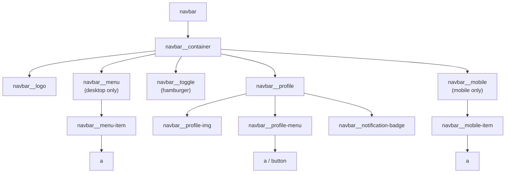
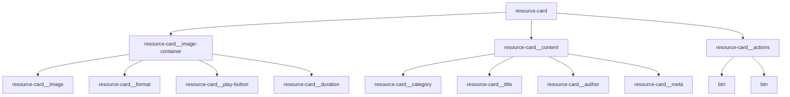
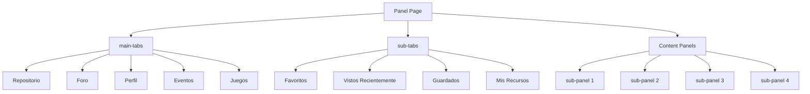
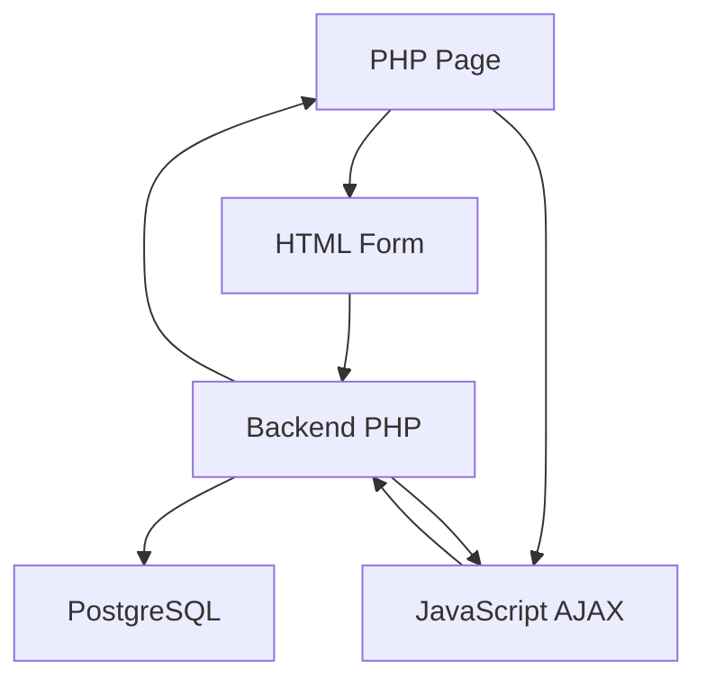

# Arquitectura de frontend

> **Archivos fuente relevantes**
> * [src/backend/gestionRecursos/get_categories.php](https://github.com/axchisan/El-rincon-de-ADSO/blob/3e310227/src/backend/gestionRecursos/get_categories.php)
> * [src/backend/gestionRecursos/get_user_groups.php](https://github.com/axchisan/El-rincon-de-ADSO/blob/3e310227/src/backend/gestionRecursos/get_user_groups.php)
> * [src/backend/perfil/uploads/perfil_6814422884f7d-465971915_519394657743559_5751152004256211003_n.jpg](https://github.com/axchisan/El-rincon-de-ADSO/blob/3e310227/src/backend/perfil/uploads/profile_6814422884f7d-465971915_519394657743559_5751152004256211003_n.jpg)
> * [src/frontend/amigos/css/style.css](https://github.com/axchisan/El-rincon-de-ADSO/blob/3e310227/src/frontend/friends/css/style.css)
> * [src/frontend/inicio/css/styles.css](https://github.com/axchisan/El-rincon-de-ADSO/blob/3e310227/src/frontend/inicio/css/styles.css)
> * [src/frontend/panel/css/styles-panel.css](https://github.com/axchisan/El-rincon-de-ADSO/blob/3e310227/src/frontend/panel/css/styles-panel.css)
> * [src/frontend/repositorio/css/repositorio.css](https://github.com/axchisan/El-rincon-de-ADSO/blob/3e310227/src/frontend/repositorio/css/repositorio.css)
> * [src/uploads/6805c8bb76358_cover.png](https://github.com/axchisan/El-rincon-de-ADSO/blob/3e310227/src/uploads/6805c8bb76358_cover.png)
> * [src/uploads/6805c8bb765ca.pdf](https://github.com/axchisan/El-rincon-de-ADSO/blob/3e310227/src/uploads/6805c8bb765ca.pdf)

## Propósito y alcance

Este documento describe la arquitectura frontend de El Rincón de ADSO, abarcando la organización de los recursos frontend, el sistema de diseño CSS, los componentes comunes de la interfaz de usuario, los patrones de diseño adaptables y las estructuras de estilo específicas de cada página. Para obtener información sobre la funcionalidad y la lógica de negocio de cada página, consulte las siguientes páginas:

* Contenido y características de la página de destino: [Página de destino y navegación](/axchisan/El-rincon-de-ADSO/8.3-landing-page-and-navigation)
* Detalles del sistema de diseño y estilo de los componentes: [Sistema de diseño y estilo](/axchisan/El-rincon-de-ADSO/8.1-design-system-and-styling)
* Implementación de diseño responsivo: [Diseño responsivo](/axchisan/El-rincon-de-ADSO/8.2-responsive-design)
* Interacciones de la API de backend: [Referencia de la API de backend](/axchisan/El-rincon-de-ADSO/9-backend-api-reference)

El frontend está construido utilizando páginas PHP tradicionales renderizadas en servidor con HTML/CSS/JavaScript básico, siguiendo una arquitectura CSS basada en componentes con un sistema de diseño consistente con temática de café.

**Fuentes:** [src/frontend/inicio/css/styles.css L1-L2719](https://github.com/axchisan/El-rincon-de-ADSO/blob/3e310227/src/frontend/inicio/css/styles.css#L1-L2719)

 [src/frontend/repositorio/css/repositorio.css L1-L1619](https://github.com/axchisan/El-rincon-de-ADSO/blob/3e310227/src/frontend/repositorio/css/repositorio.css#L1-L1619)

 [src/frontend/panel/css/styles-panel.css L1-L4115](https://github.com/axchisan/El-rincon-de-ADSO/blob/3e310227/src/frontend/panel/css/styles-panel.css#L1-L4115)

 [style.css L1-L619](https://github.com/axchisan/El-rincon-de-ADSO/blob/3e310227/src/frontend/friends/css/style.css#L1-L619)

---

## Estructura del directorio

La interfaz está organizada por función/página, y cada sección principal tiene su propio directorio que contiene CSS y recursos relacionados:

```markdown
src/frontend/
├── inicio/           # Landing page
│   └── css/
│       └── styles.css
├── repositorio/      # Resource repository browser
│   └── css/
│       └── repositorio.css
├── panel/            # User dashboard/panel
│   └── css/
│       └── styles-panel.css
├── friends/          # Friends management
│   └── css/
│       └── style.css
├── perfil/           # User profile
├── mensajes/         # Messaging
└── notificaciones/   # Notifications
```

Cada directorio sigue una estructura coherente con archivos CSS dedicados a esa sección. Las hojas de estilo específicas de cada página amplían el sistema de diseño base definido en los estilos raíz.

**Fuentes:** [src/frontend/inicio/css/styles.css L1](https://github.com/axchisan/El-rincon-de-ADSO/blob/3e310227/src/frontend/inicio/css/styles.css#L1-L1)

 [src/frontend/repositorio/css/repositorio.css L1](https://github.com/axchisan/El-rincon-de-ADSO/blob/3e310227/src/frontend/repositorio/css/repositorio.css#L1-L1)

 [src/frontend/panel/css/styles-panel.css L1](https://github.com/axchisan/El-rincon-de-ADSO/blob/3e310227/src/frontend/panel/css/styles-panel.css#L1-L1)

 [style.css L1](https://github.com/axchisan/El-rincon-de-ADSO/blob/3e310227/src/frontend/friends/css/style.css#L1-L1)

---

## Sistema de diseño y arquitectura CSS

### Propiedades personalizadas de CSS

The entire frontend uses CSS custom properties (CSS variables) defined at the `:root` level for consistency and maintainability. All stylesheets share a common design token system:

**Color System - Coffee Theme**

The application uses a sophisticated coffee-inspired color palette:

| Variable | Value | Usage |
| --- | --- | --- |
| `--color-coffee` | `#654321` | Primary brand color, buttons, headings |
| `--color-coffee-dark` | `#4a3219` | Hover states, emphasis |
| `--color-coffee-light` | `#8b7355` | Secondary elements, borders |
| `--color-latte` | `#e6d9cc` | Light backgrounds |
| `--color-cappuccino` | `#d8ccc0` | Alternating sections |
| `--color-mocha-light` | `#c8b6a6` | Footer, tertiary backgrounds |
| `--color-almond` | `#efe5dc` | Page backgrounds |

**Gray Scale**

A warm gray scale from `--color-gray-50` through `--color-gray-900` provides neutral tones that complement the coffee theme.

**Typography System**

```
--font-serif: "Georgia", "Times New Roman", serif;
--font-sans: "Poppins", Arial, sans-serif;
```

The base font is `var(--font-sans)` with `--font-serif` used sparingly for special emphasis.

**Shadows and Elevation**

```
--shadow-sm: 0 2px 4px 0 rgba(101, 67, 33, 0.08);
--shadow: 0 2px 5px 0 rgba(101, 67, 33, 0.15), ...;
--shadow-md: 0 5px 8px -1px rgba(101, 67, 33, 0.18), ...;
--shadow-lg: 0 12px 18px -3px rgba(101, 67, 33, 0.2), ...;
--shadow-xl: 0 22px 28px -5px rgba(101, 67, 33, 0.25), ...;
```

All shadows use the coffee color (`rgb(101, 67, 33)`) at various opacities for brand consistency.

**Border Radius Scale**

```
--border-radius-sm: 0.125rem;
--border-radius: 0.25rem;
--border-radius-md: 0.375rem;
--border-radius-lg: 0.5rem;
--border-radius-xl: 0.75rem;
--border-radius-2xl: 1rem;
--border-radius-full: 9999px;
```

**Sources:** [src/frontend/inicio/css/styles.css L1-L59](https://github.com/axchisan/El-rincon-de-ADSO/blob/3e310227/src/frontend/inicio/css/styles.css#L1-L59)

 [src/frontend/repositorio/css/repositorio.css L1-L42](https://github.com/axchisan/El-rincon-de-ADSO/blob/3e310227/src/frontend/repositorio/css/repositorio.css#L1-L42)

 [src/frontend/panel/css/styles-panel.css L1-L60](https://github.com/axchisan/El-rincon-de-ADSO/blob/3e310227/src/frontend/panel/css/styles-panel.css#L1-L60)

### Global Resets and Base Styles

All stylesheets apply consistent global resets:

```css
* {
  margin: 0;
  padding: 0;
  box-sizing: border-box;
}

html {
  font-size: 16px;
  scroll-behavior: smooth;
}

body {
  font-family: var(--font-sans);
  background-color: var(--color-almond);
  color: var(--color-gray-800);
  line-height: 1.5;
  -webkit-font-smoothing: antialiased;
  -moz-osx-font-smoothing: grayscale;
}
```

**Sources:** [src/frontend/inicio/css/styles.css L61-L103](https://github.com/axchisan/El-rincon-de-ADSO/blob/3e310227/src/frontend/inicio/css/styles.css#L61-L103)

 [src/frontend/repositorio/css/repositorio.css L44-L85](https://github.com/axchisan/El-rincon-de-ADSO/blob/3e310227/src/frontend/repositorio/css/repositorio.css#L44-L85)

---

## Layout System

### Container Pattern

A consistent container class provides centered, max-width content areas across all pages:

```css
.container {
  width: 100%;
  max-width: 1200px;
  margin: 0 auto;
  padding: 0 1rem;
}
```

**Maximum width:** 1200px ensures readability on large screens
**Horizontal padding:** 1rem provides breathing room on mobile devices

### Section Layouts

The system uses semantic section classes with predefined background colors:

```css
.section {
  padding: 4rem 0;
}

.section--white { background-color: var(--color-white); }
.section--latte { background-color: var(--color-latte); }
.section--cappuccino { background-color: var(--color-cappuccino); }
.section--mocha { background-color: var(--color-mocha-light); }
.section--dark { 
  background-color: var(--color-coffee);
  color: var(--color-white);
}
.section--gray { background-color: var(--color-gray-100); }
```

Sections alternate colors to provide visual hierarchy and separation.

**Sources:** [src/frontend/inicio/css/styles.css L104-L140](https://github.com/axchisan/El-rincon-de-ADSO/blob/3e310227/src/frontend/inicio/css/styles.css#L104-L140)

### Grid Systems

#### Resources Grid

A responsive grid system is used extensively for displaying resources (books, videos, documents):

```
.resources-grid {
  display: grid;
  grid-template-columns: 1fr;
  gap: 2rem;
}

@media (min-width: 640px) {
  .resources-grid {
    grid-template-columns: repeat(2, 1fr);
  }
}

@media (min-width: 1024px) {
  .resources-grid {
    grid-template-columns: repeat(3, 1fr);
  }
}
```

* **Mobile (< 640px):** Single column
* **Tablet (640px - 1023px):** Two columns
* **Desktop (≥ 1024px):** Three columns

**Sources:** [src/frontend/repositorio/css/repositorio.css L750-L778](https://github.com/axchisan/El-rincon-de-ADSO/blob/3e310227/src/frontend/repositorio/css/repositorio.css#L750-L778)

 [src/frontend/panel/css/styles-panel.css L655-L672](https://github.com/axchisan/El-rincon-de-ADSO/blob/3e310227/src/frontend/panel/css/styles-panel.css#L655-L672)

---

## Component Library

### Navbar Component

The navbar is a critical shared component appearing on every page. It features a sticky position, responsive menu, and profile dropdown.

#### Component Structure Diagram



**Sources:** [src/frontend/inicio/css/styles.css L272-L649](https://github.com/axchisan/El-rincon-de-ADSO/blob/3e310227/src/frontend/inicio/css/styles.css#L272-L649)

 [src/frontend/repositorio/css/repositorio.css L96-L415](https://github.com/axchisan/El-rincon-de-ADSO/blob/3e310227/src/frontend/repositorio/css/repositorio.css#L96-L415)

#### Navbar Styling

**Position and Hierarchy:**

```css
.navbar {
  position: sticky;
  top: 0;
  z-index: 100;
  background-color: var(--color-white);
  box-shadow: var(--shadow-md);
  border-bottom: 3px solid var(--color-coffee);
}
```

The navbar sticks to the top with `z-index: 100`, ensuring it stays above page content during scroll.

**Responsive Behavior:**

* **Mobile (< 768px):** Hamburger menu (`.navbar__toggle`) visible, main menu (`.navbar__menu`) hidden
* **Desktop (≥ 768px):** Main menu visible, hamburger hidden

```
@media (min-width: 768px) {
  .navbar__menu {
    display: flex;
  }
  .navbar__toggle {
    display: none;
  }
  .navbar__mobile {
    display: none !important;
  }
}
```

**Profile Dropdown:**

The profile section includes an avatar image with notification badge and dropdown menu:

```css
.navbar__profile-img {
  width: 40px;
  height: 40px;
  border-radius: 50%;
  object-fit: cover;
  cursor: pointer;
  border: 2px solid var(--color-coffee-light);
}

.navbar__notification-badge {
  position: absolute;
  top: -5px;
  right: -5px;
  background-color: #e74c3c;
  color: white;
  border-radius: 50%;
  width: 18px;
  height: 18px;
  display: flex;
  align-items: center;
  justify-content: center;
  font-size: 10px;
  font-weight: bold;
}
```

**Sources:** [src/frontend/inicio/css/styles.css L272-L649](https://github.com/axchisan/El-rincon-de-ADSO/blob/3e310227/src/frontend/inicio/css/styles.css#L272-L649)

 [src/frontend/panel/css/styles-panel.css L116-L272](https://github.com/axchisan/El-rincon-de-ADSO/blob/3e310227/src/frontend/panel/css/styles-panel.css#L116-L272)

### Button System

The application uses a comprehensive button system with multiple variants:

#### Button Base Class

```css
.btn {
  display: inline-block;
  padding: 0.75rem 1.5rem;
  font-weight: 500;
  text-align: center;
  border-radius: var(--border-radius-md);
  transition: all 0.3s ease;
  cursor: pointer;
  border: 2px solid transparent;
  letter-spacing: 0.5px;
}
```

#### Button Variants

| Class | Background | Border | Text | Usage |
| --- | --- | --- | --- | --- |
| `.btn--primary` | `--color-coffee` | `--color-coffee` | `--color-white` | Primary actions |
| `.btn--secondary` | `--color-white` | `--color-coffee` | `--color-coffee` | Secondary actions |
| `.btn--outline` | `white` | `--color-coffee` | `--color-coffee` | Tertiary actions |
| `.btn--gray` | `--color-gray-200` | transparent | `--color-gray-800` | Neutral actions |

#### Button Interactions

All buttons have sophisticated hover effects:

**Primary Button:**

```css
.btn--primary:hover {
  background-color: var(--color-coffee-dark);
  border-color: var(--color-coffee-dark);
  transform: translateY(-3px);
  box-shadow: 0 6px 12px rgba(101, 67, 33, 0.3);
}
```

**Secondary Button (with fill animation):**

```css
.btn--secondary::before {
  content: "";
  position: absolute;
  top: 0;
  left: 0;
  width: 100%;
  height: 100%;
  background: var(--color-coffee);
  transform: scaleX(0);
  transform-origin: right;
  transition: transform 0.4s ease-in-out;
  z-index: -1;
}

.btn--secondary:hover {
  color: var(--color-white);
  transform: translateY(-3px) scale(1.02);
}

.btn--secondary:hover::before {
  transform: scaleX(1);
  transform-origin: left;
}
```

The secondary button features a slide-in fill effect using a pseudo-element.

**Sources:** [src/frontend/inicio/css/styles.css L1107-L1241](https://github.com/axchisan/El-rincon-de-ADSO/blob/3e310227/src/frontend/inicio/css/styles.css#L1107-L1241)

 [src/frontend/repositorio/css/repositorio.css L1084-L1185](https://github.com/axchisan/El-rincon-de-ADSO/blob/3e310227/src/frontend/repositorio/css/repositorio.css#L1084-L1185)

### Card Components

Cards are the primary content container, used for books, videos, documents, forum posts, and more.

#### Resource Card Structure



**Sources:** [src/frontend/repositorio/css/repositorio.css L781-L924](https://github.com/axchisan/El-rincon-de-ADSO/blob/3e310227/src/frontend/repositorio/css/repositorio.css#L781-L924)

 [src/frontend/panel/css/styles-panel.css L675-L852](https://github.com/axchisan/El-rincon-de-ADSO/blob/3e310227/src/frontend/panel/css/styles-panel.css#L675-L852)

#### Card Base Styles

```css
.resource-card {
  background-color: var(--color-white);
  border-radius: var(--border-radius-lg);
  overflow: hidden;
  box-shadow: var(--shadow-md);
  transition: all 0.3s ease;
  border: 1px solid var(--color-gray-200);
  height: 100%;
  display: flex;
  flex-direction: column;
}

.resource-card:hover {
  transform: translateY(-10px);
  box-shadow: var(--shadow-xl);
  border-color: var(--color-coffee-light);
}
```

Cards use flexbox with `flex-direction: column` to ensure footer actions stay at the bottom even with varying content heights.

#### Image Container with Overlays

```css
.resource-card__image-container {
  position: relative;
  overflow: hidden;
  height: 200px;
}

.resource-card__format {
  position: absolute;
  top: 1rem;
  right: 1rem;
  background-color: var(--color-coffee);
  color: var(--color-white);
  padding: 0.25rem 0.75rem;
  border-radius: var(--border-radius-full);
  font-size: 0.75rem;
  font-weight: 600;
  z-index: 1;
}

.resource-card__play-button {
  position: absolute;
  top: 50%;
  left: 50%;
  transform: translate(-50%, -50%);
  width: 60px;
  height: 60px;
  background-color: rgba(101, 67, 33, 0.8);
  border-radius: 50%;
  display: flex;
  align-items: center;
  justify-content: center;
  color: var(--color-white);
  font-size: 1.5rem;
  opacity: 0;
  transition: all 0.3s ease;
}

.resource-card:hover .resource-card__play-button {
  opacity: 1;
  transform: translate(-50%, -50%) scale(1.1);
}
```

The play button appears only on hover for video resources, providing a clear affordance for video content.

**Sources:** [src/frontend/repositorio/css/repositorio.css L799-L862](https://github.com/axchisan/El-rincon-de-ADSO/blob/3e310227/src/frontend/repositorio/css/repositorio.css#L799-L862)

 [src/frontend/panel/css/styles-panel.css L714-L788](https://github.com/axchisan/El-rincon-de-ADSO/blob/3e310227/src/frontend/panel/css/styles-panel.css#L714-L788)

### Form Components

#### Search Forms

The application features prominent search interfaces on multiple pages:

```css
.search__form {
  margin-bottom: 1.5rem;
}

.search__main {
  display: flex;
  flex-direction: column;
  gap: 1rem;
  margin-bottom: 1.5rem;
}

.search__input-wrapper {
  position: relative;
  flex-grow: 1;
}

.search__icon {
  position: absolute;
  left: 1rem;
  top: 50%;
  transform: translateY(-50%);
  color: var(--color-gray-500);
}

.search__input {
  width: 100%;
  padding: 1rem 1rem 1rem 2.5rem;
  border: 2px solid var(--color-cappuccino);
  border-radius: var(--border-radius-md);
  font-size: 1rem;
  transition: all 0.3s ease;
}

.search__input:focus {
  outline: none;
  border-color: var(--color-coffee);
  box-shadow: 0 0 0 3px rgba(101, 67, 33, 0.15);
}
```

**Icon positioning:** The search icon is positioned absolutely inside the input with left padding on the input to accommodate it.

**Focus states:** Clear visual feedback with border color change and subtle box-shadow.

**Sources:** [src/frontend/inicio/css/styles.css L878-L923](https://github.com/axchisan/El-rincon-de-ADSO/blob/3e310227/src/frontend/inicio/css/styles.css#L878-L923)

 [src/frontend/repositorio/css/repositorio.css L569-L640](https://github.com/axchisan/El-rincon-de-ADSO/blob/3e310227/src/frontend/repositorio/css/repositorio.css#L569-L640)

#### Filter Selects

Custom-styled select dropdowns with arrow icons:

```css
.search__select {
  width: 100%;
  padding: 0.75rem 1rem;
  border: 1px solid var(--color-cappuccino);
  border-radius: var(--border-radius-md);
  background-color: var(--color-off-white);
  appearance: none;
  background-image: url("data:image/svg+xml,...");
  background-repeat: no-repeat;
  background-position: right 1rem center;
  cursor: pointer;
}
```

Native `appearance: none` removes default browser styling, replaced with a custom SVG arrow icon.

**Sources:** [src/frontend/inicio/css/styles.css L989-L1007](https://github.com/axchisan/El-rincon-de-ADSO/blob/3e310227/src/frontend/inicio/css/styles.css#L989-L1007)

### Tab Components

The user panel features a sophisticated multi-level tab system.

#### Main Tabs (Primary Navigation)

```css
.main-tabs {
  background-color: var(--color-white);
  border-bottom: 1px solid var(--color-gray-200);
  position: sticky;
  top: 70px;
  z-index: 90;
  box-shadow: 0 4px 6px -1px rgba(0, 0, 0, 0.05);
}

.main-tab {
  display: flex;
  align-items: center;
  padding: 1rem 1.5rem;
  border-radius: var(--border-radius-lg);
  background-color: var(--color-gray-50);
  color: var(--color-gray-700);
  transition: all 0.3s ease;
  min-width: 200px;
  gap: 1rem;
}

.main-tab.active {
  background: linear-gradient(135deg, 
    var(--color-coffee-light) 0%, 
    var(--color-coffee) 100%);
  color: var(--color-white);
  box-shadow: 0 6px 12px -2px rgba(101, 67, 33, 0.25);
}
```

Each tab contains an icon (`.main-tab__icon`) and content area (`.main-tab__content`) with title and description.

#### Sub Tabs (Secondary Navigation)

```css
.sub-tabs {
  display: flex;
  overflow-x: auto;
  gap: 0.75rem;
  margin-bottom: 2rem;
  border-bottom: 1px solid var(--color-gray-200);
  padding-bottom: 1rem;
}

.sub-tab {
  padding: 0.75rem 1.25rem;
  border-radius: var(--border-radius-full);
  background-color: var(--color-gray-100);
  color: var(--color-gray-700);
  font-weight: 500;
  transition: all 0.3s ease;
  white-space: nowrap;
}

.sub-tab.active {
  background: linear-gradient(135deg, 
    var(--color-coffee-light) 0%, 
    var(--color-coffee) 100%);
  color: var(--color-white);
}
```

Sub-tabs use pill-shaped buttons with horizontal scrolling on mobile.

**Sources:** [src/frontend/panel/css/styles-panel.css L442-L619](https://github.com/axchisan/El-rincon-de-ADSO/blob/3e310227/src/frontend/panel/css/styles-panel.css#L442-L619)

### Modal and Dropdown Patterns

Profile dropdown menu implementation:

```css
.navbar__profile-menu {
  display: none;
  position: absolute;
  top: 100%;
  right: 0;
  background-color: var(--color-white);
  box-shadow: var(--shadow-md);
  border-radius: var(--border-radius-md);
  z-index: 1000;
  min-width: 160px;
  margin-top: 0.5rem;
}

.navbar__profile-menu.active {
  display: block;
}
```

JavaScript toggles the `.active` class to show/hide the menu.

**Sources:** [src/frontend/inicio/css/styles.css L469-L504](https://github.com/axchisan/El-rincon-de-ADSO/blob/3e310227/src/frontend/inicio/css/styles.css#L469-L504)

---

## Page-Specific Architectures

### Landing Page (inicio)

#### Hero Section

The hero uses a gradient background with decorative patterns:

```css
.hero {
  background: linear-gradient(135deg, 
    var(--color-cappuccino), 
    var(--color-mocha-light));
  color: var(--color-gray-800);
  padding: 4rem 0;
  position: relative;
  overflow: hidden;
}

.hero::before {
  content: "";
  position: absolute;
  top: 0;
  left: 0;
  right: 0;
  bottom: 0;
  background-image: url("data:image/svg+xml,...");
  opacity: 0.2;
}
```

Pseudo-elements create layered decorative effects:

* `::before` adds a subtle pattern overlay
* `::after` creates a wave effect at the bottom

**Layout:** Flexbox layout switches from column (mobile) to row (desktop) at 768px breakpoint.

**Sources:** [src/frontend/inicio/css/styles.css L668-L821](https://github.com/axchisan/El-rincon-de-ADSO/blob/3e310227/src/frontend/inicio/css/styles.css#L668-L821)

#### Feature Cards Grid

```css
.features__grid {
  display: grid;
  grid-template-columns: 1fr;
  gap: 2rem;
}

@media (min-width: 768px) {
  .features__grid {
    grid-template-columns: repeat(3, 1fr);
  }
}

.feature-card {
  background-color: var(--color-white);
  border-radius: var(--border-radius-lg);
  padding: 2rem;
  box-shadow: var(--shadow-md);
  transition: all 0.3s ease;
  border-top: 4px solid var(--color-coffee);
}

.feature-card:hover {
  transform: translateY(-10px);
  box-shadow: var(--shadow-lg);
}
```

Feature cards include:

* Icon with circular background (`.feature-card__icon`)
* Title (`.feature-card__title`)
* Description (`.feature-card__description`)

The icon rotates 360° on hover for a playful effect.

**Sources:** [src/frontend/inicio/css/styles.css L1242-L1369](https://github.com/axchisan/El-rincon-de-ADSO/blob/3e310227/src/frontend/inicio/css/styles.css#L1242-L1369)

#### Book Showcase Section

```
.books__grid {
  display: grid;
  grid-template-columns: 1fr;
  gap: 2rem;
}

@media (min-width: 640px) {
  .books__grid {
    grid-template-columns: repeat(2, 1fr);
  }
}

@media (min-width: 1024px) {
  .books__grid {
    grid-template-columns: repeat(4, 1fr);
  }
}
```

Book cards on the landing page use 4 columns at desktop width for a more compact display.

**Sources:** [src/frontend/inicio/css/styles.css L1430-L1577](https://github.com/axchisan/El-rincon-de-ADSO/blob/3e310227/src/frontend/inicio/css/styles.css#L1430-L1577)

### Repository Browser (repositorio)

#### Repository Header

```css
.repo-header {
  background: linear-gradient(to right, 
    var(--color-cappuccino), 
    var(--color-cappuccino));
  color: var(--color-white);
  padding: 4rem 0;
  text-align: center;
  position: relative;
  overflow: hidden;
}

.repo-header::after {
  content: "";
  position: absolute;
  bottom: 0;
  left: 0;
  right: 0;
  height: 4px;
  background: linear-gradient(to right, 
    var(--color-latte), 
    var(--color-coffee-light), 
    var(--color-latte));
}
```

A decorative gradient bar at the bottom adds visual interest.

**Sources:** [src/frontend/repositorio/css/repositorio.css L503-L551](https://github.com/axchisan/El-rincon-de-ADSO/blob/3e310227/src/frontend/repositorio/css/repositorio.css#L503-L551)

#### Search Section

```css
.search-section {
  background-color: var(--color-white);
  padding: 2rem 0;
  box-shadow: var(--shadow);
  position: relative;
  z-index: 10;
}

.search-container {
  background-color: var(--color-white);
  border-radius: var(--border-radius-lg);
  padding: 1.5rem;
  box-shadow: var(--shadow-md);
}
```

The search section has elevated `z-index: 10` to appear above other content.

#### Tab Navigation

```css
.tabs-section {
  padding: 1rem 0;
  background-color: var(--color-white);
  border-bottom: 1px solid var(--color-gray-200);
}

.tabs {
  display: flex;
  overflow-x: auto;
  gap: 0.5rem;
  padding-bottom: 0.5rem;
}

.tab-button {
  padding: 0.75rem 1.25rem;
  background-color: var(--color-gray-100);
  color: var(--color-gray-700);
  border-radius: var(--border-radius-md);
  font-weight: 500;
  white-space: nowrap;
  display: flex;
  align-items: center;
  gap: 0.5rem;
}

.tab-button.active {
  background-color: #8b7355;
  color: var(--color-white);
}
```

Tabs for filtering by resource type (Books, Videos, Documents) use horizontal scrolling on mobile.

**Sources:** [src/frontend/repositorio/css/repositorio.css L553-L705](https://github.com/axchisan/El-rincon-de-ADSO/blob/3e310227/src/frontend/repositorio/css/repositorio.css#L553-L705)

### User Panel (panel-usuario)

#### Panel Header with User Info

```css
.panel-header {
  background-color: var(--color-white);
  padding: 3rem 0;
  border-bottom: 1px solid var(--color-gray-200);
  position: relative;
  overflow: hidden;
  text-align: center;
}

.user-welcome {
  display: flex;
  align-items: center;
  gap: 2rem;
  flex-direction: column;
  text-align: center;
}

@media (min-width: 640px) {
  .user-welcome {
    flex-direction: row;
    text-align: left;
    justify-content: center;
  }
}
```

The header displays:

* User avatar (`.avatar-img`) with decorative spinning border (`.avatar-decoration`)
* User name and greeting
* Online status indicator (`.user-status`)
* Badge preview (`.user-badges-preview`)

**Avatar Animation:**

```
.avatar-decoration {
  position: absolute;
  top: -15px;
  left: -15px;
  right: -15px;
  bottom: -15px;
  border: 2px dashed var(--color-coffee-light);
  border-radius: 50%;
  animation: spin 30s linear infinite;
}

@keyframes spin {
  0% { transform: rotate(0deg); }
  100% { transform: rotate(360deg); }
}
```

A subtle rotating dashed border around the avatar creates visual interest.

**Sources:** [src/frontend/panel/css/styles-panel.css L274-L440](https://github.com/axchisan/El-rincon-de-ADSO/blob/3e310227/src/frontend/panel/css/styles-panel.css#L274-L440)

#### Multi-Level Tab System



**JavaScript Control:**

* Clicking a `.main-tab` adds `.active` class to that tab
* Shows corresponding `.tab-section` by adding `.active` class
* Within each section, `.sub-tab` clicks control `.sub-panel` visibility

**Sources:** [src/frontend/panel/css/styles-panel.css L442-L619](https://github.com/axchisan/El-rincon-de-ADSO/blob/3e310227/src/frontend/panel/css/styles-panel.css#L442-L619)

#### Empty State Design

```css
.empty-state {
  text-align: center;
  padding: 4rem 1rem;
  background-color: var(--color-white);
  border-radius: var(--border-radius-lg);
  box-shadow: var(--shadow);
  position: relative;
  overflow: hidden;
}

.empty-state::before {
  content: "";
  position: absolute;
  top: 0;
  left: 0;
  right: 0;
  bottom: 0;
  background: linear-gradient(135deg, 
    var(--color-latte) 0%, 
    var(--color-white) 100%);
  opacity: 0.7;
  z-index: 0;
}

.empty-state__icon {
  font-size: 4rem;
  color: var(--color-coffee-light);
  margin-bottom: 1.5rem;
  position: relative;
  z-index: 1;
  opacity: 0.8;
}
```

Empty states appear when users have no favorites, saved items, etc. They include:

* Large icon
* Explanatory heading
* Descriptive text
* Call-to-action button

**Sources:** [src/frontend/panel/css/styles-panel.css L862-L926](https://github.com/axchisan/El-rincon-de-ADSO/blob/3e310227/src/frontend/panel/css/styles-panel.css#L862-L926)

### Friends Page (amigos)

#### Friend Search Form

```css
.friend-search {
  background-color: var(--color-white);
  border-radius: var(--border-radius-lg);
  padding: 1.5rem;
  box-shadow: var(--shadow-md);
  margin-bottom: 2rem;
}

.friend-search__form {
  display: flex;
  flex-wrap: wrap;
  gap: 1rem;
}

.friend-search__input-wrapper {
  flex: 1;
  position: relative;
  min-width: 200px;
}
```

**Sources:** [src/frontend/friends/css/style.css L332-L388](https://github.com/axchisan/El-rincon-de-ADSO/blob/3e310227/src/frontend/friends/css/style.css#L332-L388)

#### Friend/Request Cards

```css
.friend-card,
.request-card {
  background-color: var(--color-white);
  border-radius: var(--border-radius-lg);
  padding: 1.5rem;
  box-shadow: var(--shadow-md);
  display: flex;
  align-items: center;
  gap: 1.5rem;
  margin-bottom: 1rem;
  transition: all 0.3s ease;
}

.friend-card:hover,
.request-card:hover {
  transform: translateY(-5px);
  box-shadow: var(--shadow-lg);
  border: 1px solid var(--color-coffee-light);
}
```

Cards display:

* Avatar image (60px circular)
* User info (name, email)
* Action buttons (chat, remove, accept, reject)

**Responsive behavior:** Cards stack vertically on mobile (< 640px).

**Sources:** [src/frontend/friends/css/style.css L416-L536](https://github.com/axchisan/El-rincon-de-ADSO/blob/3e310227/src/frontend/friends/css/style.css#L416-L536)

---

## Responsive Design Strategy

### Breakpoint System

The application uses a consistent set of breakpoints across all pages:

| Breakpoint | Width | Description |
| --- | --- | --- |
| Mobile | < 640px | Single column layouts, stacked navigation |
| Tablet | 640px - 767px | 2-column grids, compact layouts |
| Desktop Small | 768px - 1023px | Full navigation, 2-3 column grids |
| Desktop Large | ≥ 1024px | Maximum width containers, 3-4 column grids |

### Mobile-First Approach

All stylesheets follow a mobile-first methodology:

1. Base styles target mobile devices
2. `@media (min-width: X)` queries progressively enhance for larger screens
3. No `max-width` queries are used

**Example from navbar:**

```
/* Mobile: hamburger menu visible */
.navbar__menu {
  display: none;
}

.navbar__toggle {
  display: block;
}

/* Desktop: full menu visible */
@media (min-width: 768px) {
  .navbar__menu {
    display: flex;
  }
  
  .navbar__toggle {
    display: none;
  }
}
```

**Sources:** [src/frontend/inicio/css/styles.css L600-L624](https://github.com/axchisan/El-rincon-de-ADSO/blob/3e310227/src/frontend/inicio/css/styles.css#L600-L624)

 [src/frontend/repositorio/css/repositorio.css L337-L415](https://github.com/axchisan/El-rincon-de-ADSO/blob/3e310227/src/frontend/repositorio/css/repositorio.css#L337-L415)

### Grid Responsiveness Patterns

#### Single → Double → Triple Column

Most resource grids follow this pattern:

```
.resources-grid {
  grid-template-columns: 1fr;           /* Mobile: 1 column */
}

@media (min-width: 640px) {
  .resources-grid {
    grid-template-columns: repeat(2, 1fr);  /* Tablet: 2 columns */
  }
}

@media (min-width: 1024px) {
  .resources-grid {
    grid-template-columns: repeat(3, 1fr);  /* Desktop: 3 columns */
  }
}
```

#### Single → Double → Quad Column

The landing page book section uses 4 columns at desktop:

```
@media (min-width: 1024px) {
  .books__grid {
    grid-template-columns: repeat(4, 1fr);
  }
}
```

**Sources:** [src/frontend/repositorio/css/repositorio.css L760-L778](https://github.com/axchisan/El-rincon-de-ADSO/blob/3e310227/src/frontend/repositorio/css/repositorio.css#L760-L778)

 [src/frontend/inicio/css/styles.css L1567-L1577](https://github.com/axchisan/El-rincon-de-ADSO/blob/3e310227/src/frontend/inicio/css/styles.css#L1567-L1577)

### Typography Scaling

Heading sizes increase at larger breakpoints:

```
h1 { font-size: 2.5rem; }
h2 { font-size: 2rem; }

@media (min-width: 768px) {
  h1 { font-size: 3rem; }
  h2 { font-size: 2.25rem; }
}
```

**Sources:** [src/frontend/inicio/css/styles.css L158-L205](https://github.com/axchisan/El-rincon-de-ADSO/blob/3e310227/src/frontend/inicio/css/styles.css#L158-L205)

### Component Adaptation

#### Cards: Stack to Row

Friend cards switch from column to row layout:

```
.friend-card {
  display: flex;
  align-items: center;
  gap: 1.5rem;
}

@media (max-width: 640px) {
  .friend-card {
    flex-direction: column;
    align-items: flex-start;
  }
  
  .friend-card__actions {
    width: 100%;
    flex-direction: column;
  }
}
```

**Sources:** [src/frontend/friends/css/style.css L518-L536](https://github.com/axchisan/El-rincon-de-ADSO/blob/3e310227/src/frontend/friends/css/style.css#L518-L536)

#### Hero: Column to Row

The hero section reflows from vertical to horizontal:

```
.hero__container {
  display: flex;
  flex-direction: column;
  align-items: center;
  gap: 2rem;
}

@media (min-width: 768px) {
  .hero__container {
    flex-direction: row;
    text-align: left;
    align-items: center;
  }
}
```

**Sources:** [src/frontend/inicio/css/styles.css L793-L821](https://github.com/axchisan/El-rincon-de-ADSO/blob/3e310227/src/frontend/inicio/css/styles.css#L793-L821)

---

## CSS Architecture Patterns

### BEM Naming Convention

The entire frontend uses BEM (Block Element Modifier) methodology:

**Block:** `.resource-card`
**Element:** `.resource-card__image`, `.resource-card__title`, `.resource-card__actions`
**Modifier:** `.resource-card--featured`, `.btn--primary`

**Benefits:**

* Clear component hierarchy
* No specificity conflicts
* Easy to understand relationship between classes
* Self-documenting code

### Composition and Reusability

#### Utility Classes

```css
.text-center { text-align: center; }
.text-coffee { color: var(--color-coffee); }
.text-white { color: var(--color-white); }
.font-bold { font-weight: 700; }
.uppercase { text-transform: uppercase; }
```

Utility classes provide quick styling without custom CSS.

**Sources:** [src/frontend/inicio/css/styles.css L207-L270](https://github.com/axchisan/El-rincon-de-ADSO/blob/3e310227/src/frontend/inicio/css/styles.css#L207-L270)

#### Component Composition

Cards can be composed with multiple modifiers:

```html
<div class="resource-card resource-card--video">
  <div class="resource-card__image-container">
    
    <div class="resource-card__format">VIDEO</div>
    <button class="resource-card__play-button">
      <i class="fas fa-play"></i>
    </button>
  </div>
  <div class="resource-card__content">
    <span class="resource-card__category">Matemáticas</span>
    <h3 class="resource-card__title">Title</h3>
    <div class="resource-card__actions">
      <button class="btn btn--primary">Ver</button>
    </div>
  </div>
</div>
```

### Animation and Transition Patterns

#### Consistent Transitions

All interactive elements use `transition: all 0.3s ease`:

```
.btn {
  transition: all 0.3s ease;
}

.resource-card {
  transition: all 0.3s ease;
}

.main-tab {
  transition: all 0.3s ease;
}
```

This creates a consistent feel across the application.

#### Hover Effects

Standard hover pattern: `translateY(-Npx)` combined with shadow increase:

```
.resource-card:hover {
  transform: translateY(-10px);
  box-shadow: var(--shadow-xl);
}
```

#### Keyframe Animations

```
@keyframes fadeInUp {
  0% {
    opacity: 0;
    transform: translateY(30px);
  }
  100% {
    opacity: 1;
    transform: translateY(0);
  }
}

.friend-card {
  animation: fadeInUp 0.5s ease forwards;
}
```

Cards fade in and slide up when loaded.

**Sources:** [src/frontend/friends/css/style.css L550-L564](https://github.com/axchisan/El-rincon-de-ADSO/blob/3e310227/src/frontend/friends/css/style.css#L550-L564)

 [src/frontend/panel/css/styles-panel.css L333-L340](https://github.com/axchisan/El-rincon-de-ADSO/blob/3e310227/src/frontend/panel/css/styles-panel.css#L333-L340)

### Pseudo-Elements for Decoration

Pseudo-elements (`::before`, `::after`) add decorative effects without extra markup:

#### Background Patterns

```
.section--community::before {
  content: "";
  position: absolute;
  top: 0;
  left: 0;
  right: 0;
  bottom: 0;
  background-image: url("data:image/svg+xml,...");
  z-index: -1;
}
```

#### Underline Decorations

```
.section-title::after {
  content: "";
  display: block;
  width: 60px;
  height: 3px;
  background: var(--color-coffee);
  margin-top: 0.5rem;
}
```

**Sources:** [src/frontend/inicio/css/styles.css L147-L156](https://github.com/axchisan/El-rincon-de-ADSO/blob/3e310227/src/frontend/inicio/css/styles.css#L147-L156)

 [src/frontend/repositorio/css/repositorio.css L708-L716](https://github.com/axchisan/El-rincon-de-ADSO/blob/3e310227/src/frontend/repositorio/css/repositorio.css#L708-L716)

---

## JavaScript Integration Points

While JavaScript files are not provided, the CSS reveals expected JavaScript behaviors:

### Toggle Classes

**Pattern:** JavaScript adds/removes `.active`, `.hidden` classes

```
.navbar__mobile.hidden {
  display: none;
}

.navbar__profile-menu.active {
  display: block;
}

.main-tab.active {
  background: linear-gradient(...);
}

.sub-tab.active {
  background: linear-gradient(...);
}
```

### State Management

Cards and buttons likely have JavaScript event handlers for:

* Adding to favorites
* Saving resources
* Viewing resources
* Friend actions (accept, reject, remove)
* Tab switching

### Dynamic Content Loading

The grid layouts support dynamically added content through:

* Consistent card heights with flexbox
* Grid auto-placement
* Fade-in animations on new elements

**Sources:** [src/frontend/panel/css/styles-panel.css L497-L506](https://github.com/axchisan/El-rincon-de-ADSO/blob/3e310227/src/frontend/panel/css/styles-panel.css#L497-L506)

 [src/frontend/inicio/css/styles.css L389-L392](https://github.com/axchisan/El-rincon-de-ADSO/blob/3e310227/src/frontend/inicio/css/styles.css#L389-L392)

---

## Performance Considerations

### CSS Optimizations

1. **No inline styles:** All styles in external stylesheets
2. **Minimal specificity:** BEM prevents specificity wars
3. **CSS custom properties:** Easier for browsers to optimize
4. **Hardware acceleration:** `transform` and `opacity` used for animations

### Asset Loading

SVG icons embedded as data URIs:

```
background-image: url("data:image/svg+xml,%3Csvg...");
```

This eliminates additional HTTP requests but increases CSS file size. Tradeoff favors fewer requests.

### Font Loading

Font families specified with fallbacks:

```
--font-sans: "Poppins", Arial, sans-serif;
--font-serif: "Georgia", "Times New Roman", serif;
```

System fonts (Arial, Georgia) provide immediate rendering while custom fonts load.

---

## Accessibility Features

### Focus States

All interactive elements have focus styles:

```css
.search__input:focus {
  outline: none;
  border-color: var(--color-coffee);
  box-shadow: 0 0 0 3px rgba(101, 67, 33, 0.15);
}

.btn:focus {
  /* Inherits hover styles */
  outline: 2px solid var(--color-coffee);
  outline-offset: 2px;
}
```

### Color Contrast

The coffee color scheme maintains WCAG AA contrast ratios:

* `--color-coffee` (#654321) on white: 8.59:1 ✓
* White text on `--color-coffee`: 8.59:1 ✓
* `--color-gray-700` (#50473f) on white: 9.32:1 ✓

### Semantic Spacing

Consistent spacing provides clear visual hierarchy and improves readability for users with cognitive disabilities.

---

## Frontend-Backend Integration Architecture

The frontend integrates with backend APIs through standard patterns:



**Form submissions:** Traditional POST requests to backend scripts
**Dynamic content:** JavaScript fetch/XMLHttpRequest to API endpoints
**Response format:** JSON for AJAX, HTML redirects for forms

**API Endpoints Referenced:**

* `get_user_groups.php` - Returns user's groups as JSON
* `get_categories.php` - Returns all categories as JSON
* `upload_resource.php` - Handles file uploads
* Various resource retrieval endpoints

**Sources:** [src/backend/gestionRecursos/get_user_groups.php L1-L28](https://github.com/axchisan/El-rincon-de-ADSO/blob/3e310227/src/backend/gestionRecursos/get_user_groups.php#L1-L28)

 [src/backend/gestionRecursos/get_categories.php L1-L15](https://github.com/axchisan/El-rincon-de-ADSO/blob/3e310227/src/backend/gestionRecursos/get_categories.php#L1-L15)

---

## Summary

The El Rincón de ADSO frontend architecture demonstrates a well-structured, component-based approach using vanilla HTML/CSS/JavaScript. Key architectural decisions include:

1. **Consistent Design System:** CSS custom properties enable theme-wide consistency
2. **BEM Methodology:** Clear naming conventions prevent specificity issues
3. **Mobile-First Responsive:** Progressive enhancement from mobile to desktop
4. **Component Reusability:** Shared components (navbar, cards, buttons) across pages
5. **Visual Hierarchy:** Coffee-themed color palette with clear contrast
6. **Performance-Focused:** Hardware-accelerated animations, optimized selectors
7. **Accessible:** Focus states, color contrast, semantic markup

La arquitectura respalda el propósito educativo de la aplicación a través de una jerarquía de información clara, una navegación fácil y una presentación de contenido visualmente atractiva.

**Fuentes:** Todos los archivos CSS referenciados en este documento.