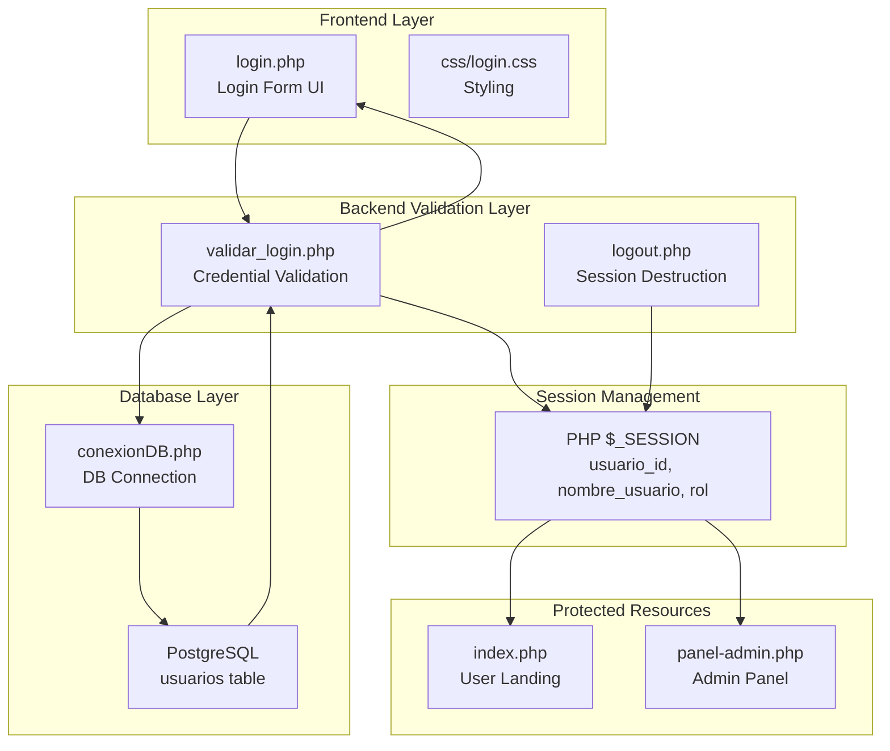
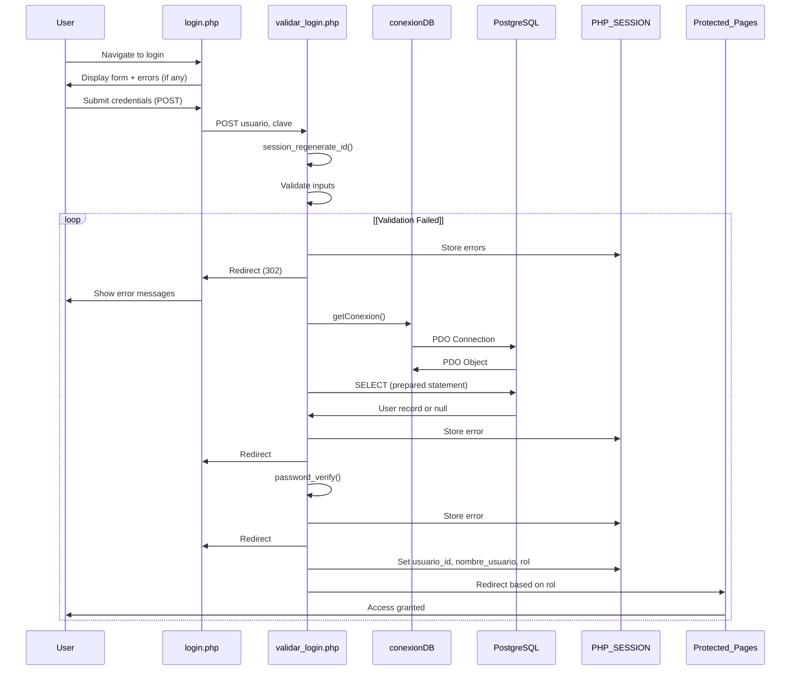
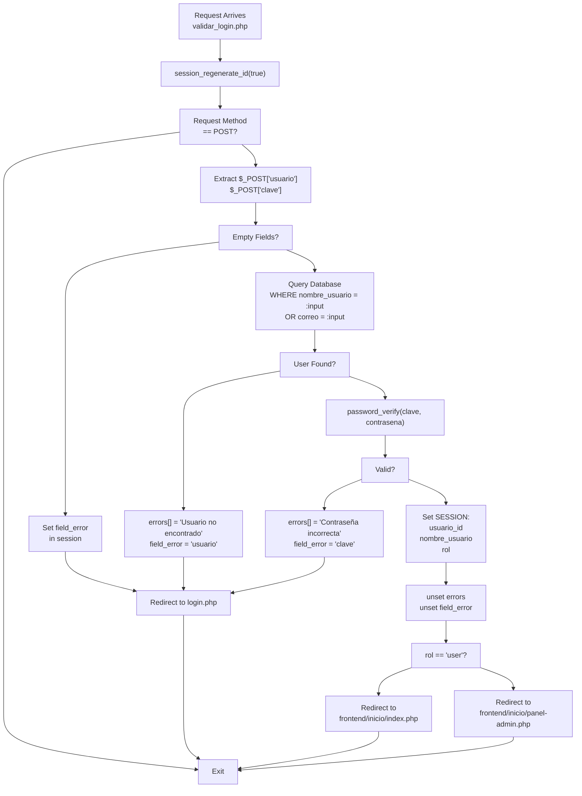
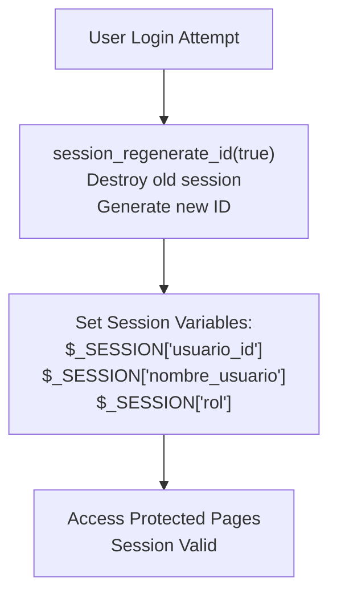
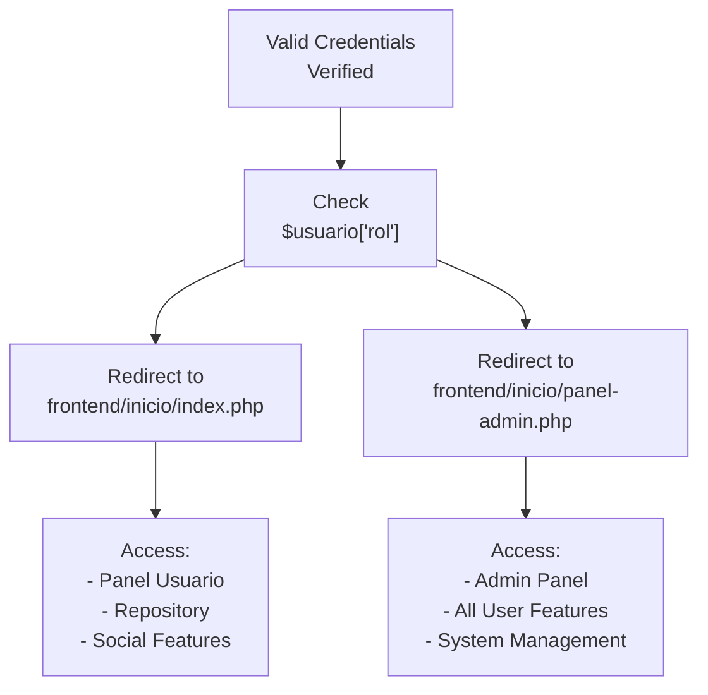
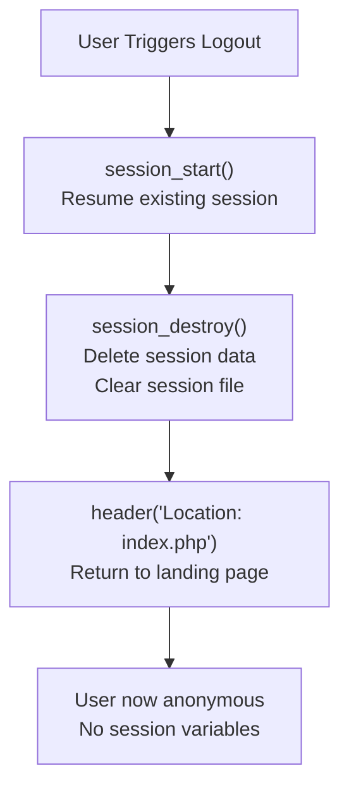

# Authentication System

> **Relevant source files**
> * [src/backend/loginValidation/validar_login.php](https://github.com/axchisan/El-rincon-de-ADSO/blob/3e310227/src/backend/loginValidation/validar_login.php)
> * [src/backend/logout.php](https://github.com/axchisan/El-rincon-de-ADSO/blob/3e310227/src/backend/logout.php)
> * [src/backend/perfil/uploads/681153ef10a8b-468520576_1147758583450948_1007574650848877107_n.jpg](https://github.com/axchisan/El-rincon-de-ADSO/blob/3e310227/src/backend/perfil/uploads/681153ef10a8b-468520576_1147758583450948_1007574650848877107_n.jpg)
> * [src/frontend/login/css/login.css](https://github.com/axchisan/El-rincon-de-ADSO/blob/3e310227/src/frontend/login/css/login.css)
> * [src/frontend/login/img/fondo.jpg](https://github.com/axchisan/El-rincon-de-ADSO/blob/3e310227/src/frontend/login/img/fondo.jpg)
> * [src/frontend/login/img/icono.png](https://github.com/axchisan/El-rincon-de-ADSO/blob/3e310227/src/frontend/login/img/icono.png)
> * [src/frontend/login/img/logo.png](https://github.com/axchisan/El-rincon-de-ADSO/blob/3e310227/src/frontend/login/img/logo.png)
> * [src/frontend/login/login.php](https://github.com/axchisan/El-rincon-de-ADSO/blob/3e310227/src/frontend/login/login.php)

## Purpose and Scope

This document describes the authentication system of El Rincón de ADSO, covering user login, session management, credential validation, role-based access control, and logout functionality. The authentication system serves as the gateway to all protected features of the platform.

For information about user registration and account creation, see [User Registration](/axchisan/El-rincon-de-ADSO/3.2-user-registration). For details about session-based access control throughout the application, see [Login and Session Management](/axchisan/El-rincon-de-ADSO/3.1-login-and-session-management).

## System Architecture

The authentication system follows a traditional separation between frontend presentation and backend validation, with PostgreSQL-backed credential storage and PHP session management.



**Sources:** [src/frontend/login/login.php L1-L68](https://github.com/axchisan/El-rincon-de-ADSO/blob/3e310227/src/frontend/login/login.php#L1-L68)

 [src/backend/loginValidation/validar_login.php L1-L65](https://github.com/axchisan/El-rincon-de-ADSO/blob/3e310227/src/backend/loginValidation/validar_login.php#L1-L65)

 [src/backend/logout.php L1-L6](https://github.com/axchisan/El-rincon-de-ADSO/blob/3e310227/src/backend/logout.php#L1-L6)

## Authentication Flow Overview

The complete authentication process involves multiple stages from user input to protected resource access:



**Sources:** [src/backend/loginValidation/validar_login.php L7-L64](https://github.com/axchisan/El-rincon-de-ADSO/blob/3e310227/src/backend/loginValidation/validar_login.php#L7-L64)

 [src/frontend/login/login.php L37-L46](https://github.com/axchisan/El-rincon-de-ADSO/blob/3e310227/src/frontend/login/login.php#L37-L46)

## Login Interface

The login page is implemented in `login.php` and provides a responsive UI with error feedback and navigation options.

### Key Components

| Component | Implementation | Line Reference |
| --- | --- | --- |
| Session initialization | `session_start()` at top of file | [login.php L2](https://github.com/axchisan/El-rincon-de-ADSO/blob/3e310227/login.php#L2-L2) |
| Error display | Conditional rendering from `$_SESSION['errors']` | [login.php L37-L45](https://github.com/axchisan/El-rincon-de-ADSO/blob/3e310227/login.php#L37-L45) |
| Form submission | POST to `validar_login.php` | [login.php L47](https://github.com/axchisan/El-rincon-de-ADSO/blob/3e310227/login.php#L47-L47) |
| Input fields | `usuario` (username/email) and `clave` (password) | [login.php L49-L52](https://github.com/axchisan/El-rincon-de-ADSO/blob/3e310227/login.php#L49-L52) |
| Field error highlighting | CSS class `input-error` applied conditionally | [login.php L49](https://github.com/axchisan/El-rincon-de-ADSO/blob/3e310227/login.php#L49-L49) |
| Registration link | Navigation to `registro.php` | [login.php L55](https://github.com/axchisan/El-rincon-de-ADSO/blob/3e310227/login.php#L55-L55) |
| Back button | Return to main page `index.php` | [login.php L60](https://github.com/axchisan/El-rincon-de-ADSO/blob/3e310227/login.php#L60-L60) |

### Form Structure

The login form accepts either username or email as the identifier:

```xml
<form action="../../backend/loginValidation/validar_login.php" method="POST" autocomplete="off">
    <input type="text" name="usuario" id="usuario" required>
    <input type="password" name="clave" id="clave" required>
    <input type="submit" value="Entrar">
</form>
```

### Error Feedback Mechanism

Errors are stored in `$_SESSION['errors']` as an array and displayed as an unordered list. After displaying, the session errors are cleared using `unset($_SESSION['errors'])` to prevent persistence across page reloads.

Field-specific errors are indicated through `$_SESSION['field_error']` which applies the `input-error` CSS class to highlight the problematic field.

**Sources:** [src/frontend/login/login.php L1-L68](https://github.com/axchisan/El-rincon-de-ADSO/blob/3e310227/src/frontend/login/login.php#L1-L68)

 [src/frontend/login/css/login.css L196-L213](https://github.com/axchisan/El-rincon-de-ADSO/blob/3e310227/src/frontend/login/css/login.css#L196-L213)

## Backend Validation Logic

The `validar_login.php` script handles credential validation, password verification, and session establishment.

### Validation Process



**Sources:** [src/backend/loginValidation/validar_login.php L1-L65](https://github.com/axchisan/El-rincon-de-ADSO/blob/3e310227/src/backend/loginValidation/validar_login.php#L1-L65)

### Input Validation

The validation script performs the following checks:

| Validation | Error Message | Session Variable |
| --- | --- | --- |
| Empty `usuario` field | "El campo usuario o correo es obligatorio." | `field_error = 'usuario'` |
| Empty `clave` field | "El campo contraseña es obligatorio." | `field_error = 'clave'` |
| User not found in DB | "Usuario o correo no encontrado." | `field_error = 'usuario'` |
| Password mismatch | "Contraseña incorrecta." | `field_error = 'clave'` |

**Implementation:** [src/backend/loginValidation/validar_login.php L13-L20](https://github.com/axchisan/El-rincon-de-ADSO/blob/3e310227/src/backend/loginValidation/validar_login.php#L13-L20)

### Database Query

The system queries the `usuarios` table using a prepared statement that accepts either username or email:

```sql
SELECT id, nombre_usuario, correo, contrasena, rol 
FROM usuarios 
WHERE nombre_usuario = :input OR correo = :input
```

This query is executed using PDO with prepared statements to prevent SQL injection: [src/backend/loginValidation/validar_login.php L26-L29](https://github.com/axchisan/El-rincon-de-ADSO/blob/3e310227/src/backend/loginValidation/validar_login.php#L26-L29)

### Password Verification

Password verification uses PHP's built-in `password_verify()` function, which securely compares the submitted plaintext password against the hashed password stored in the database: [src/backend/loginValidation/validar_login.php L33](https://github.com/axchisan/El-rincon-de-ADSO/blob/3e310227/src/backend/loginValidation/validar_login.php#L33-L33)

**Sources:** [src/backend/loginValidation/validar_login.php L7-L65](https://github.com/axchisan/El-rincon-de-ADSO/blob/3e310227/src/backend/loginValidation/validar_login.php#L7-L65)

## Session Management

### Session Initialization and Regeneration

The authentication system implements session security through session ID regeneration:



**Session regeneration** occurs at [src/backend/loginValidation/validar_login.php L5](https://github.com/axchisan/El-rincon-de-ADSO/blob/3e310227/src/backend/loginValidation/validar_login.php#L5-L5)

 immediately after `session_start()` and before any validation logic. The `true` parameter ensures the old session file is deleted, preventing session fixation attacks.

### Session Variables

Upon successful authentication, three session variables are established:

| Variable | Type | Purpose | Set At |
| --- | --- | --- | --- |
| `$_SESSION['usuario_id']` | integer | Database primary key for user | [validar_login.php L34](https://github.com/axchisan/El-rincon-de-ADSO/blob/3e310227/validar_login.php#L34-L34) |
| `$_SESSION['nombre_usuario']` | string | Display name for user | [validar_login.php L35](https://github.com/axchisan/El-rincon-de-ADSO/blob/3e310227/validar_login.php#L35-L35) |
| `$_SESSION['rol']` | string | Role identifier ("user" or "admin") | [validar_login.php L36](https://github.com/axchisan/El-rincon-de-ADSO/blob/3e310227/validar_login.php#L36-L36) |

These variables persist across page requests and are used throughout the application to verify authentication status and enforce access control.

**Sources:** [src/backend/loginValidation/validar_login.php L2-L5](https://github.com/axchisan/El-rincon-de-ADSO/blob/3e310227/src/backend/loginValidation/validar_login.php#L2-L5)

 [src/backend/loginValidation/validar_login.php L34-L36](https://github.com/axchisan/El-rincon-de-ADSO/blob/3e310227/src/backend/loginValidation/validar_login.php#L34-L36)

## Role-Based Access Control

The authentication system implements role-based routing after successful login:

### Role Determination Flow



**Sources:** [src/backend/loginValidation/validar_login.php L42-L47](https://github.com/axchisan/El-rincon-de-ADSO/blob/3e310227/src/backend/loginValidation/validar_login.php#L42-L47)

### Role Assignment

Roles are stored in the `usuarios` table `rol` column and can have the following values:

* **`"user"`**: Standard user with access to educational resources, social features, and personal dashboard
* **`"admin"`**: Administrator with elevated privileges and access to system management features

The role value is read from the database at [src/backend/loginValidation/validar_login.php L26](https://github.com/axchisan/El-rincon-de-ADSO/blob/3e310227/src/backend/loginValidation/validar_login.php#L26-L26)

 and stored in the session at [src/backend/loginValidation/validar_login.php L36](https://github.com/axchisan/El-rincon-de-ADSO/blob/3e310227/src/backend/loginValidation/validar_login.php#L36-L36)

### Post-Login Redirects

| Role | Redirect Target | Implementation |
| --- | --- | --- |
| `user` | `../../frontend/inicio/index.php` | [validar_login.php L44](https://github.com/axchisan/El-rincon-de-ADSO/blob/3e310227/validar_login.php#L44-L44) |
| `admin` | `../../frontend/inicio/panel-admin.php` | [validar_login.php L46](https://github.com/axchisan/El-rincon-de-ADSO/blob/3e310227/validar_login.php#L46-L46) |

**Sources:** [src/backend/loginValidation/validar_login.php L42-L48](https://github.com/axchisan/El-rincon-de-ADSO/blob/3e310227/src/backend/loginValidation/validar_login.php#L42-L48)

## Logout Mechanism

The logout process is implemented in `logout.php` as a simple three-step operation:



### Implementation Details

The complete logout script:

1. **Session resumption** - [logout.php L2](https://github.com/axchisan/El-rincon-de-ADSO/blob/3e310227/logout.php#L2-L2) : `session_start()` resumes the current session so it can be destroyed
2. **Session destruction** - [logout.php L3](https://github.com/axchisan/El-rincon-de-ADSO/blob/3e310227/logout.php#L3-L3) : `session_destroy()` removes all session data and deletes the session file
3. **Redirect** - [logout.php L4](https://github.com/axchisan/El-rincon-de-ADSO/blob/3e310227/logout.php#L4-L4) : User is redirected to the main landing page `index.php`

This implementation ensures complete session termination without requiring explicit unsetting of individual session variables.

**Sources:** [src/backend/logout.php L1-L6](https://github.com/axchisan/El-rincon-de-ADSO/blob/3e310227/src/backend/logout.php#L1-L6)

## Security Features

### Password Security

| Security Measure | Implementation | Details |
| --- | --- | --- |
| Password hashing | `password_verify()` | Compares submitted password against bcrypt/argon2 hash stored in DB |
| Hash storage | `contrasena` column | Database stores hashed passwords, never plaintext |
| Timing-safe comparison | Built into `password_verify()` | Prevents timing attacks during verification |

**Implementation:** [src/backend/loginValidation/validar_login.php L33](https://github.com/axchisan/El-rincon-de-ADSO/blob/3e310227/src/backend/loginValidation/validar_login.php#L33-L33)

### SQL Injection Prevention

The system uses PDO prepared statements with parameter binding:

```javascript
$sql = "SELECT id, nombre_usuario, correo, contrasena, rol FROM usuarios WHERE nombre_usuario = :input OR correo = :input";
$stmt = $db->prepare($sql);
$stmt->execute([':input' => $input_usuario]);
```

This approach ensures user input is never directly interpolated into SQL queries. The `:input` placeholder is safely bound to the `$input_usuario` variable at execution time.

**Implementation:** [src/backend/loginValidation/validar_login.php L26-L28](https://github.com/axchisan/El-rincon-de-ADSO/blob/3e310227/src/backend/loginValidation/validar_login.php#L26-L28)

### Session Security Measures

| Measure | Purpose | Implementation |
| --- | --- | --- |
| Session regeneration | Prevent session fixation attacks | `session_regenerate_id(true)` after login |
| Session variable clearing | Prevent error persistence | `unset($_SESSION['errors'])` after display |
| Input trimming | Prevent whitespace-based bypasses | `trim($_POST['usuario'])` |
| Field highlighting | User feedback for errors | `$_SESSION['field_error']` CSS class application |

**Sources:** [src/backend/loginValidation/validar_login.php L5](https://github.com/axchisan/El-rincon-de-ADSO/blob/3e310227/src/backend/loginValidation/validar_login.php#L5-L5)

 [src/frontend/login/login.php L44](https://github.com/axchisan/El-rincon-de-ADSO/blob/3e310227/src/frontend/login/login.php#L44-L44)

 [src/backend/loginValidation/validar_login.php L8-L9](https://github.com/axchisan/El-rincon-de-ADSO/blob/3e310227/src/backend/loginValidation/validar_login.php#L8-L9)

### Error Handling

Error messages are generic enough to avoid information disclosure while providing useful feedback:

* **"Usuario o correo no encontrado"** - Does not reveal whether username or email was attempted
* **"Contraseña incorrecta"** - Confirms user exists but password is wrong (acceptable trade-off for UX)

Errors are stored in session and cleared after display to prevent stale error messages: [src/frontend/login/login.php L44](https://github.com/axchisan/El-rincon-de-ADSO/blob/3e310227/src/frontend/login/login.php#L44-L44)

**Sources:** [src/backend/loginValidation/validar_login.php L50-L55](https://github.com/axchisan/El-rincon-de-ADSO/blob/3e310227/src/backend/loginValidation/validar_login.php#L50-L55)

 [src/frontend/login/login.php L37-L45](https://github.com/axchisan/El-rincon-de-ADSO/blob/3e310227/src/frontend/login/login.php#L37-L45)

## Integration Points

The authentication system integrates with the following platform components:

| Component | Integration Point | Purpose |
| --- | --- | --- |
| Database Connection | `conexionDB::getConexion()` | Singleton pattern database access |
| User Dashboard | `panel-usuario.php` | Primary destination for authenticated users |
| Admin Panel | `panel-admin.php` | Administrative interface for admin role |
| Landing Page | `index.php` | Post-logout destination |
| Registration | `registro.php` | New user account creation |

The authentication system serves as the foundation for all session-based access control throughout the application. Protected pages verify authentication by checking for the presence of `$_SESSION['usuario_id']` before rendering content.

**Sources:** [src/backend/loginValidation/validar_login.php L24](https://github.com/axchisan/El-rincon-de-ADSO/blob/3e310227/src/backend/loginValidation/validar_login.php#L24-L24)

 [src/backend/loginValidation/validar_login.php L44-L46](https://github.com/axchisan/El-rincon-de-ADSO/blob/3e310227/src/backend/loginValidation/validar_login.php#L44-L46)

 [src/frontend/login/login.php L55](https://github.com/axchisan/El-rincon-de-ADSO/blob/3e310227/src/frontend/login/login.php#L55-L55)