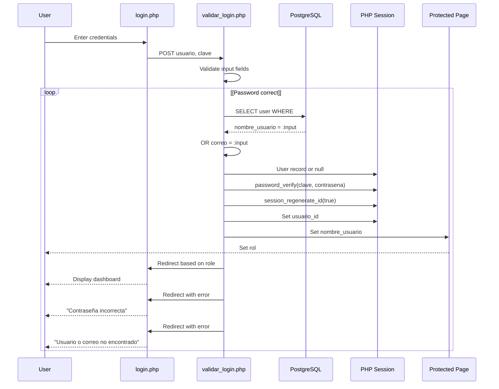
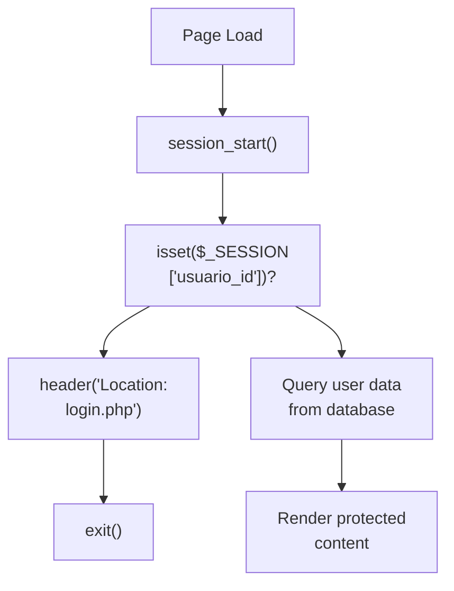
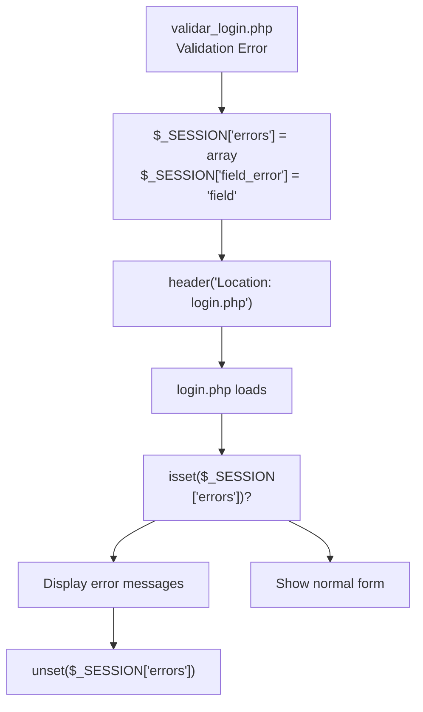
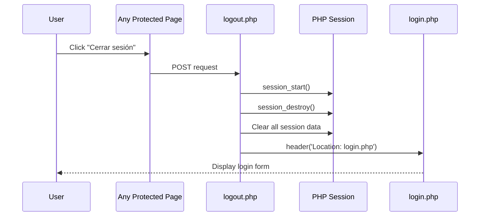

# Authentication and Authorization

> **Relevant source files**
> * [src/backend/loginValidation/validar_login.php](https://github.com/axchisan/El-rincon-de-ADSO/blob/3e310227/src/backend/loginValidation/validar_login.php)
> * [src/backend/perfil/uploads/681153ef10a8b-468520576_1147758583450948_1007574650848877107_n.jpg](https://github.com/axchisan/El-rincon-de-ADSO/blob/3e310227/src/backend/perfil/uploads/681153ef10a8b-468520576_1147758583450948_1007574650848877107_n.jpg)
> * [src/frontend/inicio/index.php](https://github.com/axchisan/El-rincon-de-ADSO/blob/3e310227/src/frontend/inicio/index.php)
> * [src/frontend/login/css/login.css](https://github.com/axchisan/El-rincon-de-ADSO/blob/3e310227/src/frontend/login/css/login.css)
> * [src/frontend/login/login.php](https://github.com/axchisan/El-rincon-de-ADSO/blob/3e310227/src/frontend/login/login.php)
> * [src/frontend/panel/panel-usuario.php](https://github.com/axchisan/El-rincon-de-ADSO/blob/3e310227/src/frontend/panel/panel-usuario.php)
> * [src/frontend/repositorio/repositorio.php](https://github.com/axchisan/El-rincon-de-ADSO/blob/3e310227/src/frontend/repositorio/repositorio.php)

## Purpose and Scope

This document describes the authentication and authorization mechanisms implemented in El Rincón de ADSO. It covers session management, login/logout flows, password security, access control patterns, and role-based authorization.

For information about user profile management after authentication, see [Profile Management](/axchisan/El-rincon-de-ADSO/4.2-profile-management). For database schema related to users, see [User and Authentication Tables](/axchisan/El-rincon-de-ADSO/10.1-user-and-authentication-tables). For security best practices including SQL injection prevention, see [Data Validation and SQL Security](/axchisan/El-rincon-de-ADSO/11.2-data-validation-and-sql-security).

---

## System Overview

The authentication system uses PHP sessions to maintain user state across requests. Upon successful login, user credentials are verified against the PostgreSQL database, and a session is created storing the user's ID, username, and role. All protected pages check for the presence of `usuario_id` in the session before granting access.

```

```

**Sources:**

* [src/frontend/login/login.php L1-L68](https://github.com/axchisan/El-rincon-de-ADSO/blob/3e310227/src/frontend/login/login.php#L1-L68)
* [src/backend/loginValidation/validar_login.php L1-L65](https://github.com/axchisan/El-rincon-de-ADSO/blob/3e310227/src/backend/loginValidation/validar_login.php#L1-L65)
* [src/frontend/panel/panel-usuario.php L1-L54](https://github.com/axchisan/El-rincon-de-ADSO/blob/3e310227/src/frontend/panel/panel-usuario.php#L1-L54)
* [src/frontend/repositorio/repositorio.php L1-L38](https://github.com/axchisan/El-rincon-de-ADSO/blob/3e310227/src/frontend/repositorio/repositorio.php#L1-L38)

---

## Authentication Flow

### Login Process

The login system follows a multi-step verification process:

1. **Form Submission**: User submits credentials via [src/frontend/login/login.php L47](https://github.com/axchisan/El-rincon-de-ADSO/blob/3e310227/src/frontend/login/login.php#L47-L47)
2. **Validation**: Backend validates input in [src/backend/loginValidation/validar_login.php L7-L64](https://github.com/axchisan/El-rincon-de-ADSO/blob/3e310227/src/backend/loginValidation/validar_login.php#L7-L64)
3. **Database Query**: User lookup by username or email
4. **Password Verification**: Using `password_verify()` against stored hash
5. **Session Creation**: Session variables set upon success
6. **Redirection**: User redirected based on role



**Sources:**

* [src/backend/loginValidation/validar_login.php L7-L64](https://github.com/axchisan/El-rincon-de-ADSO/blob/3e310227/src/backend/loginValidation/validar_login.php#L7-L64)
* [src/frontend/login/login.php L37-L46](https://github.com/axchisan/El-rincon-de-ADSO/blob/3e310227/src/frontend/login/login.php#L37-L46)

### Login Validation Details

The validation logic in `validar_login.php` implements the following checks:

| Step | Code Location | Purpose |
| --- | --- | --- |
| Session Regeneration | [validar_login.php L5](https://github.com/axchisan/El-rincon-de-ADSO/blob/3e310227/validar_login.php#L5-L5) | Prevents session fixation attacks |
| Input Sanitization | [validar_login.php L8-L9](https://github.com/axchisan/El-rincon-de-ADSO/blob/3e310227/validar_login.php#L8-L9) | `trim()` removes whitespace |
| Empty Field Check | [validar_login.php L13-L20](https://github.com/axchisan/El-rincon-de-ADSO/blob/3e310227/validar_login.php#L13-L20) | Validates required fields |
| Database Query | [validar_login.php L26-L29](https://github.com/axchisan/El-rincon-de-ADSO/blob/3e310227/validar_login.php#L26-L29) | Prepared statement prevents SQL injection |
| Password Verification | [validar_login.php L33](https://github.com/axchisan/El-rincon-de-ADSO/blob/3e310227/validar_login.php#L33-L33) | Uses secure `password_verify()` |
| Session Variable Assignment | [validar_login.php L34-L36](https://github.com/axchisan/El-rincon-de-ADSO/blob/3e310227/validar_login.php#L34-L36) | Stores user identity |
| Role-Based Redirect | [validar_login.php L42-L47](https://github.com/axchisan/El-rincon-de-ADSO/blob/3e310227/validar_login.php#L42-L47) | Routes to appropriate interface |

**Sources:**

* [src/backend/loginValidation/validar_login.php L1-L65](https://github.com/axchisan/El-rincon-de-ADSO/blob/3e310227/src/backend/loginValidation/validar_login.php#L1-L65)

---

## Session Management

### Session Initialization

Every page in the application begins with `session_start()` to access or create a session. This is consistently applied across all PHP files:

```
// Pattern used throughout the codebase
session_start();
require_once "../../database/conexionDB.php";
```

**Examples:**

* [src/frontend/panel/panel-usuario.php L2](https://github.com/axchisan/El-rincon-de-ADSO/blob/3e310227/src/frontend/panel/panel-usuario.php#L2-L2)
* [src/frontend/inicio/index.php L2](https://github.com/axchisan/El-rincon-de-ADSO/blob/3e310227/src/frontend/inicio/index.php#L2-L2)
* [src/frontend/repositorio/repositorio.php L2](https://github.com/axchisan/El-rincon-de-ADSO/blob/3e310227/src/frontend/repositorio/repositorio.php#L2-L2)
* [src/frontend/login/login.php L2](https://github.com/axchisan/El-rincon-de-ADSO/blob/3e310227/src/frontend/login/login.php#L2-L2)

### Session Variables

The system maintains three primary session variables:

| Variable | Type | Description | Set Location |
| --- | --- | --- | --- |
| `$_SESSION['usuario_id']` | int | Primary key of authenticated user | [validar_login.php L34](https://github.com/axchisan/El-rincon-de-ADSO/blob/3e310227/validar_login.php#L34-L34) |
| `$_SESSION['nombre_usuario']` | string | Display name | [validar_login.php L35](https://github.com/axchisan/El-rincon-de-ADSO/blob/3e310227/validar_login.php#L35-L35) |
| `$_SESSION['rol']` | string | User role ('user' or 'admin') | [validar_login.php L36](https://github.com/axchisan/El-rincon-de-ADSO/blob/3e310227/validar_login.php#L36-L36) |

**Sources:**

* [src/backend/loginValidation/validar_login.php L34-L36](https://github.com/axchisan/El-rincon-de-ADSO/blob/3e310227/src/backend/loginValidation/validar_login.php#L34-L36)

### Session Security

The authentication system implements session security through `session_regenerate_id(true)`:

```
session_regenerate_id(true);
```

This call at [src/backend/loginValidation/validar_login.php L5](https://github.com/axchisan/El-rincon-de-ADSO/blob/3e310227/src/backend/loginValidation/validar_login.php#L5-L5)

 regenerates the session ID immediately after starting the session and before authentication, preventing session fixation attacks. The `true` parameter ensures the old session file is deleted.

**Sources:**

* [src/backend/loginValidation/validar_login.php L5](https://github.com/axchisan/El-rincon-de-ADSO/blob/3e310227/src/backend/loginValidation/validar_login.php#L5-L5)

---

## Access Control Patterns

### Protected Page Pattern

All protected pages implement a standard access control pattern:



**Implementation Example** from `panel-usuario.php`:

```
session_start();
// Cache control headers
header("Cache-Control: no-store, no-cache, must-revalidate, max-age=0");
header("Cache-Control: post-check=0, pre-check=0", false);
header("Pragma: no-cache");

require_once "../../database/conexionDB.php";

if (!isset($_SESSION['usuario_id'])) {
    header("Location: ../login/login.php");
    exit();
}
```

**Sources:**

* [src/frontend/panel/panel-usuario.php L2-L13](https://github.com/axchisan/El-rincon-de-ADSO/blob/3e310227/src/frontend/panel/panel-usuario.php#L2-L13)
* [src/frontend/repositorio/repositorio.php L2-L13](https://github.com/axchisan/El-rincon-de-ADSO/blob/3e310227/src/frontend/repositorio/repositorio.php#L2-L13)

### Cache Control Headers

Protected pages include cache control headers to prevent unauthorized access to cached content after logout:

```
header("Cache-Control: no-store, no-cache, must-revalidate, max-age=0");
header("Cache-Control: post-check=0, pre-check=0", false);
header("Pragma: no-cache");
```

**Sources:**

* [src/frontend/panel/panel-usuario.php L3-L6](https://github.com/axchisan/El-rincon-de-ADSO/blob/3e310227/src/frontend/panel/panel-usuario.php#L3-L6)

### Session Validation with Database Check

Some pages perform additional validation by verifying the user still exists in the database:

```javascript
try {
    $db = conexionDB::getConexion();
    $user_id = $_SESSION['usuario_id'];
    
    $query = "SELECT nombre_usuario, correo, telefono, profesion, bio, 
              ultima_conexion, imagen FROM usuarios WHERE id = :id";
    $stmt = $db->prepare($query);
    $stmt->execute([':id' => $user_id]);
    $usuario = $stmt->fetch(PDO::FETCH_ASSOC);
    
    if (!$usuario) {
        session_destroy();
        header("Location: ../inicio/index.php");
        exit();
    }
} catch (PDOException $e) {
    session_destroy();
    header("Location: ../inicio/index.php");
    exit();
}
```

This pattern ensures that if a user is deleted from the database, their session is invalidated on the next request.

**Sources:**

* [src/frontend/panel/panel-usuario.php L15-L46](https://github.com/axchisan/El-rincon-de-ADSO/blob/3e310227/src/frontend/panel/panel-usuario.php#L15-L46)

---

## Role-Based Authorization

### Role Types

The system defines two user roles stored in the `usuarios.rol` column:

| Role | Value | Redirect Target | Description |
| --- | --- | --- | --- |
| User | `"user"` | `../../frontend/inicio/index.php` | Standard user access |
| Admin | `"admin"` | `../../frontend/inicio/panel-admin.php` | Administrative privileges |

**Sources:**

* [src/backend/loginValidation/validar_login.php L42-L47](https://github.com/axchisan/El-rincon-de-ADSO/blob/3e310227/src/backend/loginValidation/validar_login.php#L42-L47)

### Role-Based Redirection

After successful authentication, users are redirected based on their role:

```
// Redirigir según el rol
if ($usuario['rol'] === "user") {
    header("Location: ../../frontend/inicio/index.php");
} else if ($usuario['rol'] === "admin") {
    header("Location: ../../frontend/inicio/panel-admin.php");
}
exit();
```

**Sources:**

* [src/backend/loginValidation/validar_login.php L42-L48](https://github.com/axchisan/El-rincon-de-ADSO/blob/3e310227/src/backend/loginValidation/validar_login.php#L42-L48)

### Role Storage in Session

The user's role is stored in the session upon successful login:

```
$_SESSION['rol'] = $usuario['rol'];
```

This allows subsequent requests to check authorization without database queries.

**Sources:**

* [src/backend/loginValidation/validar_login.php L36](https://github.com/axchisan/El-rincon-de-ADSO/blob/3e310227/src/backend/loginValidation/validar_login.php#L36-L36)

---

## Password Security

### Password Verification

The system uses PHP's built-in `password_verify()` function to securely compare submitted passwords with stored hashes:

```
if (password_verify($contrasena, $usuario['contrasena'])) {
    // Authentication successful
    $_SESSION['usuario_id'] = $usuario['id'];
    // ...
}
```

This function is designed to be timing-attack safe and works with password hashes created by `password_hash()`.

**Sources:**

* [src/backend/loginValidation/validar_login.php L33](https://github.com/axchisan/El-rincon-de-ADSO/blob/3e310227/src/backend/loginValidation/validar_login.php#L33-L33)

### Password Hash Storage

The database stores password hashes in the `usuarios.contrasena` column. The actual hashing occurs during user registration (not shown in provided files, but referenced in the validation logic).

### Password Requirements

The user panel enforces password strength requirements for password changes:

**Requirements:**

* Al menos 1 letra mayúscula
* Al menos 3 números
* Al menos 1 carácter especial (@, #, $, etc.)

**Validación del lado del cliente** implementada en[src/frontend/panel/panel-usuario.php L575-L598](https://github.com/axchisan/El-rincon-de-ADSO/blob/3e310227/src/frontend/panel/panel-usuario.php#L575-L598)

:

```javascript
function validatePasswordForm() {
    const newPassword = document.getElementById('new-password').value;
    const confirmPassword = document.getElementById('confirm-password').value;
    
    if (newPassword !== confirmPassword) {
        alert('Las nuevas contraseñas no coinciden.');
        return false;
    }
    
    if (!/[A-Z]/.test(newPassword)) {
        alert('La nueva contraseña debe contener al menos 1 mayúscula.');
        return false;
    }
    if ((newPassword.match(/\d/g) || []).length < 3) {
        alert('La nueva contraseña debe contener al menos 3 números.');
        return false;
    }
    if (!/[!@#$%^&*(),.?":{}|<>]/.test(newPassword)) {
        alert('La nueva contraseña debe contener al menos 1 carácter especial.');
        return false;
    }
    
    return true;
}
```

**Fuentes:**

* [src/frontend/panel/panel-usuario.php L434-L465](https://github.com/axchisan/El-rincon-de-ADSO/blob/3e310227/src/frontend/panel/panel-usuario.php#L434-L465)
* [src/frontend/panel/panel-usuario.php L575-L598](https://github.com/axchisan/El-rincon-de-ADSO/blob/3e310227/src/frontend/panel/panel-usuario.php#L575-L598)

---

## Manejo de errores y comentarios de los usuarios

### Sistema de mensajes de error

El sistema de inicio de sesión utiliza variables de sesión para pasar mensajes de error entre solicitudes:



### Implementación de visualización de errores

El formulario de inicio de sesión muestra errores y resalta los campos problemáticos:

```php
<?php
if (isset($_SESSION['errors']) && !empty($_SESSION['errors'])) {
    echo '<div class="error-message"><ul>';
    foreach ($_SESSION['errors'] as $error) {
        echo '<li>' . htmlspecialchars($error) . '</li>';
    }
    echo '</ul></div>';
    unset($_SESSION['errors']);
}
?>
```

**Resaltado de campo:**

```php
<input type="text" name="usuario" id="usuario" required 
    class="<?php echo (isset($_SESSION['field_error']) && 
                      $_SESSION['field_error'] === 'usuario') ? 'input-error' : ''; ?>">
```

**Fuentes:**

* [src/frontend/login/login.php L37-L46](https://github.com/axchisan/El-rincon-de-ADSO/blob/3e310227/src/frontend/login/login.php#L37-L46)
* [src/frontend/login/login.php L49-L52](https://github.com/axchisan/El-rincon-de-ADSO/blob/3e310227/src/frontend/login/login.php#L49-L52)
* [src/backend/loginValidation/validar_login.php L10-L63](https://github.com/axchisan/El-rincon-de-ADSO/blob/3e310227/src/backend/loginValidation/validar_login.php#L10-L63)

### Tipos de error

| Tipo de error | Variable de sesión | Condición de activación |
| --- | --- | --- |
| Campo vacío | `$_SESSION['errors'][]` | Falta nombre de usuario o contraseña |
| Usuario no encontrado | `$_SESSION['errors'][]` | No hay nombre de usuario/correo electrónico coincidente |
| Contraseña incorrecta | `$_SESSION['errors'][]` | La verificación de contraseña falla |
| Error de base de datos | `$_SESSION['errors'][]` | PDOException durante la consulta |
| Indicador de campo | `$_SESSION['field_error']` | Identifica qué campo tiene error |

**Fuentes:**

* [src/backend/loginValidation/validar_login.php L13-L58](https://github.com/axchisan/El-rincon-de-ADSO/blob/3e310227/src/backend/loginValidation/validar_login.php#L13-L58)

---

## Proceso de cierre de sesión

### Flujo de cierre de sesión

El mecanismo de cierre de sesión destruye la sesión del usuario y redirecciona a la página de inicio de sesión:



### Enlaces para cerrar sesión

La funcionalidad de cierre de sesión se implementa como un envío de formulario en toda la aplicación:

**Navegación de escritorio:**

```xml
<li class="navbar__menu-item navbar__menu-item--button">
    <a href="../../backend/logout.php">Cerrar sesión</a>
</li>
```

**Menú de perfil:**

```xml
<form action="../../backend/logout.php" method="POST">
    <button type="submit">Cerrar Sesión</button>
</form>
```

**Fuentes:**

* [src/frontend/panel/panel-usuario.php L87](https://github.com/axchisan/El-rincon-de-ADSO/blob/3e310227/src/frontend/panel/panel-usuario.php#L87-L87)
* [src/frontend/inicio/index.php L82-L84](https://github.com/axchisan/El-rincon-de-ADSO/blob/3e310227/src/frontend/inicio/index.php#L82-L84)
* [src/frontend/repositorio/repositorio.php L146-L148](https://github.com/axchisan/El-rincon-de-ADSO/blob/3e310227/src/frontend/repositorio/repositorio.php#L146-L148)

---

## Arquitectura de componentes de autenticación

```

```

**Fuentes:**

* [src/frontend/login/login.php L1-L68](https://github.com/axchisan/El-rincon-de-ADSO/blob/3e310227/src/frontend/login/login.php#L1-L68)
* [src/backend/loginValidation/validar_login.php L1-L65](https://github.com/axchisan/El-rincon-de-ADSO/blob/3e310227/src/backend/loginValidation/validar_login.php#L1-L65)
* [src/frontend/panel/panel-usuario.php L2-L46](https://github.com/axchisan/El-rincon-de-ADSO/blob/3e310227/src/frontend/panel/panel-usuario.php#L2-L46)
* [src/base de datos/conexionDB.php](https://github.com/axchisan/El-rincon-de-ADSO/blob/3e310227/src/database/conexionDB.php) (referenciado)

---

## Mejores prácticas de seguridad implementadas

### 1. Prevención de inyección SQL

Todas las consultas de base de datos utilizan sentencias preparadas PDO con parámetros enlazados:

```javascript
$sql = "SELECT id, nombre_usuario, correo, contrasena, rol 
        FROM usuarios WHERE nombre_usuario = :input OR correo = :input";
$stmt = $db->prepare($sql);
$stmt->execute([':input' => $input_usuario]);
```

**Fuentes:**

* [src/backend/loginValidation/validar_login.php L26-L28](https://github.com/axchisan/El-rincon-de-ADSO/blob/3e310227/src/backend/loginValidation/validar_login.php#L26-L28)

### 2. Protección contra la fijación de sesiones

Los ID de sesión se regeneran después de una autenticación exitosa:

```
session_regenerate_id(true);
```

**Fuentes:**

* [src/backend/loginValidation/validar_login.php L5](https://github.com/axchisan/El-rincon-de-ADSO/blob/3e310227/src/backend/loginValidation/validar_login.php#L5-L5)

### 3. Prevención de XSS

Todo el contenido generado por el usuario se escapa antes de mostrarse:

```
$nombre_usuario = htmlspecialchars($usuario['nombre_usuario']);
```

**Fuentes:**

* [src/frontend/panel/panel-usuario.php L31](https://github.com/axchisan/El-rincon-de-ADSO/blob/3e310227/src/frontend/panel/panel-usuario.php#L31-L31)
* [src/frontend/inicio/index.php L17](https://github.com/axchisan/El-rincon-de-ADSO/blob/3e310227/src/frontend/inicio/index.php#L17-L17)

### 4. Resistencia a los ataques de tiempo

Usos `password_verify()`que implementan la comparación en tiempo constante:

```
if (password_verify($contrasena, $usuario['contrasena'])) {
    // Authentication successful
}
```

**Fuentes:**

* [src/backend/loginValidation/validar_login.php L33](https://github.com/axchisan/El-rincon-de-ADSO/blob/3e310227/src/backend/loginValidation/validar_login.php#L33-L33)

### 5. Prevención de caché en páginas protegidas

Los encabezados de control de caché evitan que el navegador almacene en caché páginas confidenciales:

```
header("Cache-Control: no-store, no-cache, must-revalidate, max-age=0");
header("Cache-Control: post-check=0, pre-check=0", false);
header("Pragma: no-cache");
```

**Fuentes:**

* [src/frontend/panel/panel-usuario.php L3-L6](https://github.com/axchisan/El-rincon-de-ADSO/blob/3e310227/src/frontend/panel/panel-usuario.php#L3-L6)

---

## Integración de bases de datos

### Gestión de conexiones

La autenticación utiliza el patrón singleton implementado en `conexionDB`la clase:

```
require_once "../../database/conexionDB.php";
$db = conexionDB::getConexion();
```

**Fuentes:**

* [src/frontend/panel/panel-usuario.php L8-L16](https://github.com/axchisan/El-rincon-de-ADSO/blob/3e310227/src/frontend/panel/panel-usuario.php#L8-L16)
* [src/backend/loginValidation/validar_login.php L3-L24](https://github.com/axchisan/El-rincon-de-ADSO/blob/3e310227/src/backend/loginValidation/validar_login.php#L3-L24)

### Patrón de consulta de usuario

Patrón de consulta estándar para recuperar información del usuario:

```javascript
$query = "SELECT id, nombre_usuario, correo, contrasena, rol 
          FROM usuarios WHERE nombre_usuario = :input OR correo = :input";
$stmt = $db->prepare($query);
$stmt->execute([':input' => $input_usuario]);
$usuario = $stmt->fetch(PDO::FETCH_ASSOC);
```

**Fuentes:**

* [src/backend/loginValidation/validar_login.php L26-L29](https://github.com/axchisan/El-rincon-de-ADSO/blob/3e310227/src/backend/loginValidation/validar_login.php#L26-L29)

### Manejo de errores

Los errores de base de datos durante la autenticación se detectan y se convierten en mensajes fáciles de usar:

```
try {
    $db = conexionDB::getConexion();
    // ... database operations
} catch (PDOException $e) {
    $errors[] = "Error al iniciar sesión: " . $e->getMessage();
}
```

**Fuentes:**

* [src/backend/loginValidation/validar_login.php L23-L59](https://github.com/axchisan/El-rincon-de-ADSO/blob/3e310227/src/backend/loginValidation/validar_login.php#L23-L59)
* [src/frontend/panel/panel-usuario.php L15-L46](https://github.com/axchisan/El-rincon-de-ADSO/blob/3e310227/src/frontend/panel/panel-usuario.php#L15-L46)

---

## Resumen

El sistema de autenticación de El Rincón de ADSO proporciona una autenticación segura basada en sesiones con las siguientes características clave:

| Característica | Implementación |
| --- | --- |
| **Gestión de sesiones** | Sesiones PHP con regeneración |
| **Seguridad de la contraseña** | Hashing de BCrypt mediante`password_verify()` |
| **Control de acceso** | Comprobaciones de sesión en todas las páginas protegidas |
| **Protección contra inyección SQL** | Declaraciones preparadas de la DOP |
| **Prevención de XSS** | `htmlspecialchars()`en la salida |
| **Autenticación basada en roles** | Separación de roles de usuario y administrador |
| **Control de caché** | Los encabezados evitan el almacenamiento en caché de datos confidenciales |
| **Manejo de errores** | Mensajería de error basada en sesión |
| **Validación de base de datos** | Comprobaciones de existencia en páginas protegidas |

El sistema sigue prácticas de codificación segura e implementa defensa en profundidad con múltiples capas de validación de seguridad.