# Backend API Reference

> **Relevant source files**
> * [src/backend/gestionRecursos/get_recent_resources.php](https://github.com/axchisan/El-rincon-de-ADSO/blob/3e310227/src/backend/gestionRecursos/get_recent_resources.php)
> * [src/backend/gestionRecursos/get_recently_viewed.php](https://github.com/axchisan/El-rincon-de-ADSO/blob/3e310227/src/backend/gestionRecursos/get_recently_viewed.php)
> * [src/backend/gestionRecursos/get_saved_resources.php](https://github.com/axchisan/El-rincon-de-ADSO/blob/3e310227/src/backend/gestionRecursos/get_saved_resources.php)
> * [src/backend/gestionRecursos/get_user_favorites.php](https://github.com/axchisan/El-rincon-de-ADSO/blob/3e310227/src/backend/gestionRecursos/get_user_favorites.php)
> * [src/backend/gestionRecursos/remove_from_favorites.php](https://github.com/axchisan/El-rincon-de-ADSO/blob/3e310227/src/backend/gestionRecursos/remove_from_favorites.php)
> * [src/backend/gestionRecursos/remove_from_saved.php](https://github.com/axchisan/El-rincon-de-ADSO/blob/3e310227/src/backend/gestionRecursos/remove_from_saved.php)
> * [src/backend/gestionRecursos/upload_resource.php](https://github.com/axchisan/El-rincon-de-ADSO/blob/3e310227/src/backend/gestionRecursos/upload_resource.php)
> * [src/frontend/friends/css/style.css](https://github.com/axchisan/El-rincon-de-ADSO/blob/3e310227/src/frontend/friends/css/style.css)

This document provides a comprehensive reference for the backend API architecture of El Rincón de ADSO. It covers the common patterns, authentication mechanisms, request/response formats, and architectural decisions shared across all API endpoints.

For detailed documentation of specific endpoint groups, see:

* Resource Management APIs: [9.1](/axchisan/El-rincon-de-ADSO/9.1-resource-management-apis)
* Social and Community APIs: [9.2](/axchisan/El-rincon-de-ADSO/9.2-social-and-community-apis)
* User Profile APIs: [9.3](/axchisan/El-rincon-de-ADSO/9.3-user-profile-apis)

For information about database schema and table structures used by these APIs, see [Database Schema](/axchisan/El-rincon-de-ADSO/10-database-schema).

## API Architecture Overview

All backend APIs in the system follow a consistent architectural pattern centered around session-based authentication, PDO database connections, and JSON responses. The APIs are organized in the `src/backend/` directory structure by functional domain.

### System Architecture Diagram

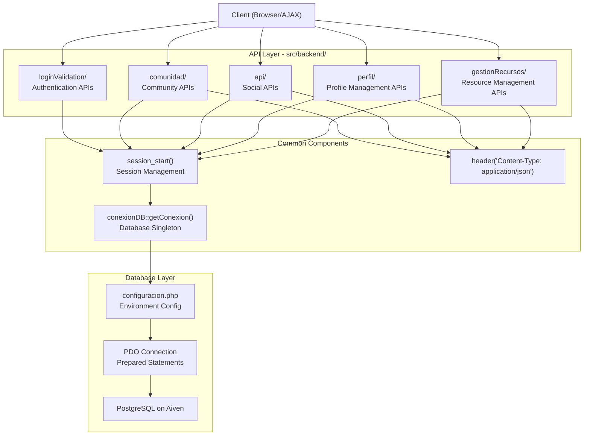

Sources: [src/backend/gestionRecursos/upload_resource.php L1-L5](https://github.com/axchisan/El-rincon-de-ADSO/blob/3e310227/src/backend/gestionRecursos/upload_resource.php#L1-L5)

 [src/backend/gestionRecursos/get_recently_viewed.php L1-L5](https://github.com/axchisan/El-rincon-de-ADSO/blob/3e310227/src/backend/gestionRecursos/get_recently_viewed.php#L1-L5)

 [src/backend/gestionRecursos/get_user_favorites.php L1-L5](https://github.com/axchisan/El-rincon-de-ADSO/blob/3e310227/src/backend/gestionRecursos/get_user_favorites.php#L1-L5)

## Common Patterns and Standards

### Session-Based Authentication

All API endpoints implement session-based authentication as the first validation step. The pattern is consistent across all APIs:

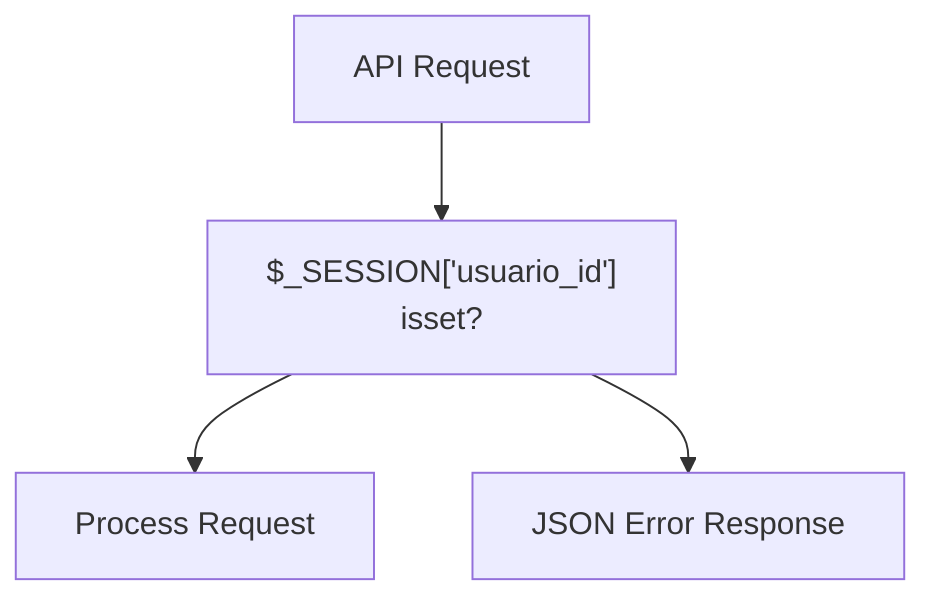

**Implementation Pattern:**

* Line 2: `session_start()` initializes or resumes session
* Line 7-10: Authentication check with immediate exit on failure
* Session variable `$_SESSION['usuario_id']` stores authenticated user ID

Sources: [src/backend/gestionRecursos/upload_resource.php L2-L10](https://github.com/axchisan/El-rincon-de-ADSO/blob/3e310227/src/backend/gestionRecursos/upload_resource.php#L2-L10)

 [src/backend/gestionRecursos/get_recently_viewed.php L2-L10](https://github.com/axchisan/El-rincon-de-ADSO/blob/3e310227/src/backend/gestionRecursos/get_recently_viewed.php#L2-L10)

 [src/backend/gestionRecursos/get_user_favorites.php L2-L10](https://github.com/axchisan/El-rincon-de-ADSO/blob/3e310227/src/backend/gestionRecursos/get_user_favorites.php#L2-L10)

### Database Connection Pattern

All APIs use the singleton `conexionDB::getConexion()` method to obtain a PDO database connection:

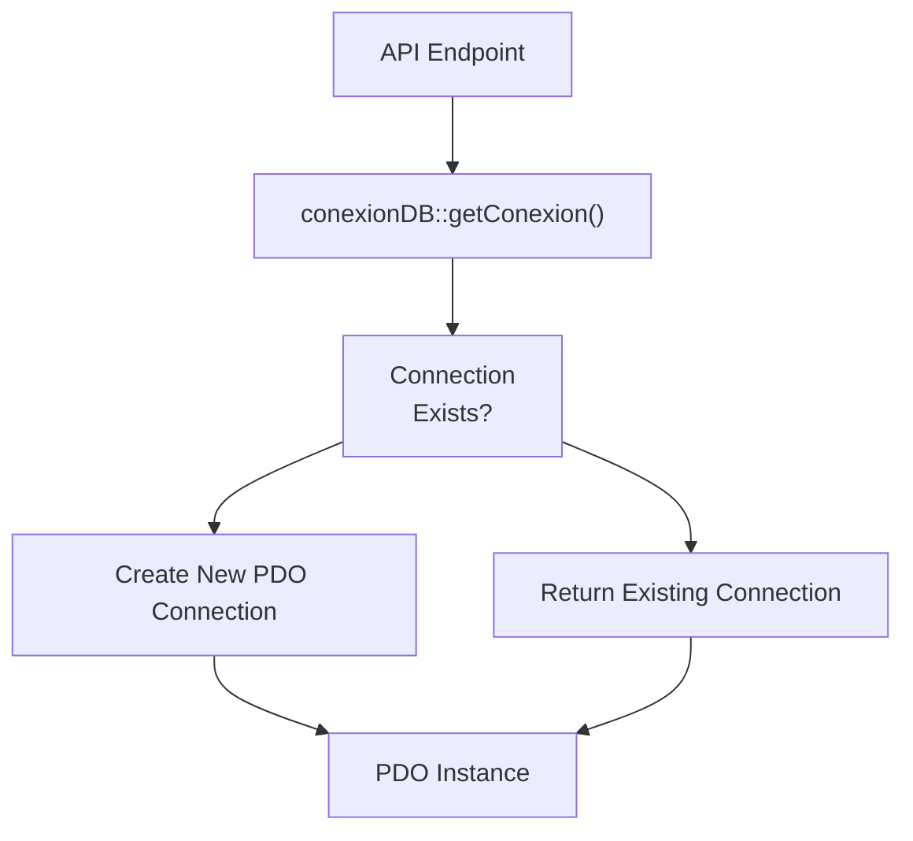

**Usage Pattern:**

```
try {
    $db = conexionDB::getConexion();
    // Use $db for queries
} catch (PDOException $e) {
    // Handle error
}
```

Sources: [src/backend/gestionRecursos/upload_resource.php L157](https://github.com/axchisan/El-rincon-de-ADSO/blob/3e310227/src/backend/gestionRecursos/upload_resource.php#L157-L157)

 [src/backend/gestionRecursos/get_recently_viewed.php L13](https://github.com/axchisan/El-rincon-de-ADSO/blob/3e310227/src/backend/gestionRecursos/get_recently_viewed.php#L13-L13)

 [src/backend/gestionRecursos/get_user_favorites.php L13](https://github.com/axchisan/El-rincon-de-ADSO/blob/3e310227/src/backend/gestionRecursos/get_user_favorites.php#L13-L13)

### Request Methods

The system uses standard HTTP methods with specific patterns:

| Method | Usage | Validation Pattern |
| --- | --- | --- |
| POST | Create, Update, Delete operations | `$_SERVER['REQUEST_METHOD'] !== 'POST'` check |
| GET | Read operations | Query parameters via `$_GET` |
| File Upload | Multipart form data | `$_FILES` array validation |

Sources: [src/backend/gestionRecursos/upload_resource.php L12-L15](https://github.com/axchisan/El-rincon-de-ADSO/blob/3e310227/src/backend/gestionRecursos/upload_resource.php#L12-L15)

### Response Format

All APIs return JSON responses with a consistent structure:

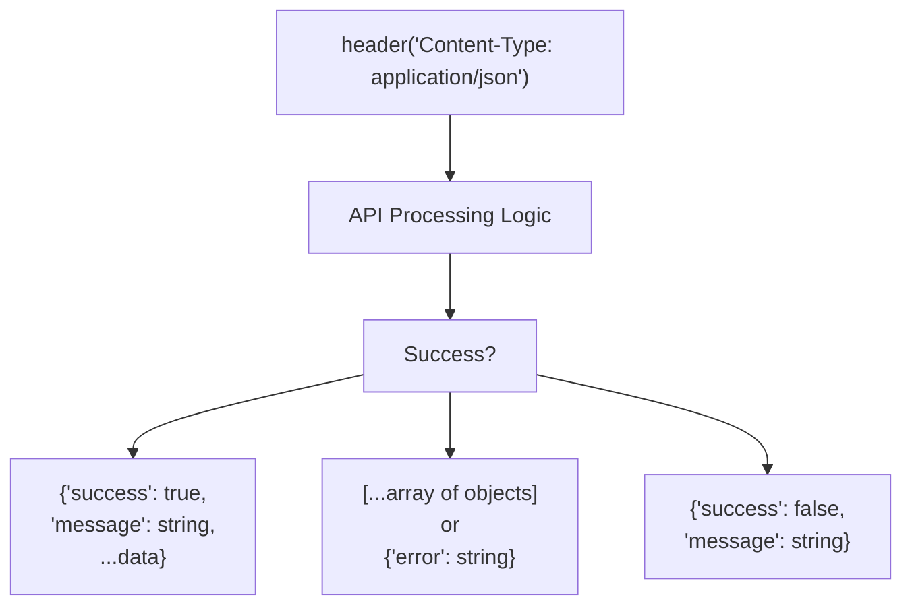

**Response Types:**

1. **Action APIs** (Create/Update/Delete): * Success: `{"success": true, "message": "..."}` * Failure: `{"success": false, "message": "..."}`
2. **Data Retrieval APIs**: * Success: Array of objects `[{}, {}, ...]` or `[]` for empty * Failure: `{"error": "..."}`

Sources: [src/backend/gestionRecursos/upload_resource.php L5-L211](https://github.com/axchisan/El-rincon-de-ADSO/blob/3e310227/src/backend/gestionRecursos/upload_resource.php#L5-L211)

 [src/backend/gestionRecursos/get_recently_viewed.php L5-L77](https://github.com/axchisan/El-rincon-de-ADSO/blob/3e310227/src/backend/gestionRecursos/get_recently_viewed.php#L5-L77)

## File Organization and Endpoint Mapping

### Backend Directory Structure

```mermaid
flowchart TD

Backend["src/backend/"]
GestionRecursos["gestionRecursos/"]
Perfil["perfil/"]
API["api/"]
Comunidad["comunidad/"]
LoginValidation["loginValidation/"]
GR1["upload_resource.php"]
GR2["get_recent_resources.php"]
GR3["get_user_favorites.php"]
GR4["get_saved_resources.php"]
GR5["get_recently_viewed.php"]
GR6["add_to_favorites.php"]
GR7["remove_from_favorites.php"]
GR8["add_to_saved.php"]
GR9["remove_from_saved.php"]
P1["update.php"]
P2["change_password.php"]
A1["friends/"]
A2["messages/"]
A3["notifications/"]
C1["add_comment.php"]
C2["get_comments.php"]
C3["toggle_like.php"]

Backend --> GestionRecursos
Backend --> Perfil
Backend --> API
Backend --> Comunidad
Backend --> LoginValidation
GestionRecursos --> GR1
GestionRecursos --> GR2
GestionRecursos --> GR3
GestionRecursos --> GR4
GestionRecursos --> GR5
GestionRecursos --> GR6
GestionRecursos --> GR7
GestionRecursos --> GR8
GestionRecursos --> GR9
Perfil --> P1
Perfil --> P2
API --> A1
API --> A2
API --> A3
Comunidad --> C1
Comunidad --> C2
Comunidad --> C3
```

Sources: [src/backend/gestionRecursos/upload_resource.php L1](https://github.com/axchisan/El-rincon-de-ADSO/blob/3e310227/src/backend/gestionRecursos/upload_resource.php#L1-L1)

 [src/backend/gestionRecursos/get_recent_resources.php L1](https://github.com/axchisan/El-rincon-de-ADSO/blob/3e310227/src/backend/gestionRecursos/get_recent_resources.php#L1-L1)

## Input Validation Patterns

### Parameter Extraction and Sanitization

APIs extract and sanitize parameters using consistent patterns:

**POST Parameters:**

```
$title = trim($_POST['title'] ?? '');
$description = trim($_POST['description'] ?? '');
$resource_type = $_POST['type'] ?? '';
```

**GET Parameters:**

```
$limit = isset($_GET['limit']) ? (int)$_GET['limit'] : 3;
$search = isset($_GET['search']) ? '%' . $_GET['search'] . '%' : null;
$category = isset($_GET['category']) ? (int)$_GET['category'] : null;
```

**JSON Parameters:**

```
$categories = json_decode($_POST['categories'] ?? '[]', true);
$tags = json_decode($_POST['tags'] ?? '[]', true);
```

Sources: [src/backend/gestionRecursos/upload_resource.php L17-L31](https://github.com/axchisan/El-rincon-de-ADSO/blob/3e310227/src/backend/gestionRecursos/upload_resource.php#L17-L31)

 [src/backend/gestionRecursos/get_recent_resources.php L19-L24](https://github.com/axchisan/El-rincon-de-ADSO/blob/3e310227/src/backend/gestionRecursos/get_recent_resources.php#L19-L24)

### Validation Patterns

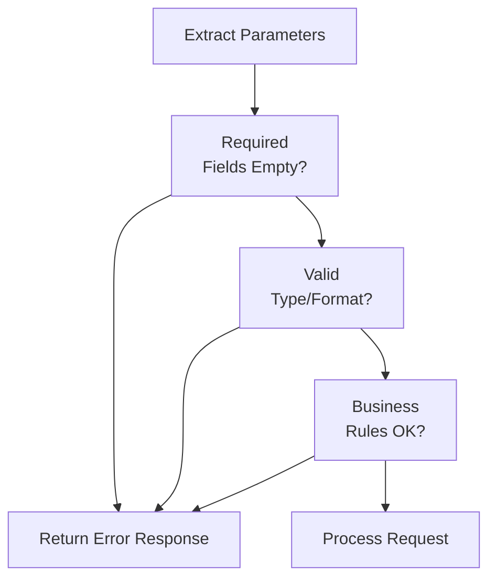

**Common Validations:**

1. **Required Field Check**: Empty string or null detection
2. **Type Validation**: Whitelisted values (e.g., status values)
3. **Format Validation**: Regex patterns (e.g., YouTube URL)
4. **Business Rules**: Context-specific (e.g., group required for Group visibility)

Sources: [src/backend/gestionRecursos/upload_resource.php L34-L59](https://github.com/axchisan/El-rincon-de-ADSO/blob/3e310227/src/backend/gestionRecursos/upload_resource.php#L34-L59)

## File Upload Handling

### Upload Validation Flow

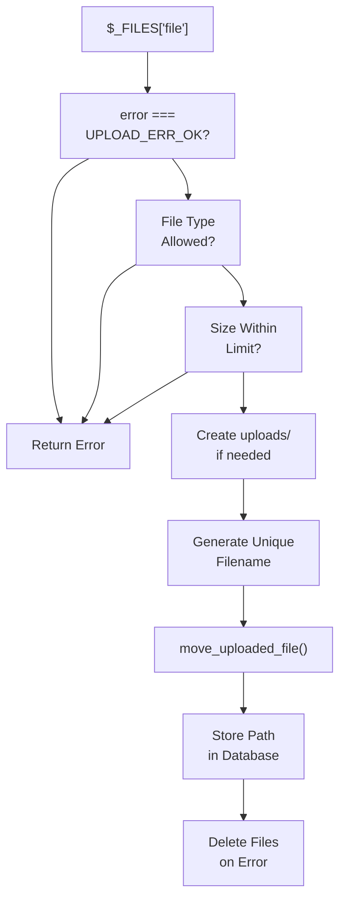

**Upload Configuration:**

| File Type | Allowed MIME Types | Max Size |
| --- | --- | --- |
| Images | `image/jpeg`, `image/png`, `image/gif` | 5 MB |
| Documents | `application/pdf`, `application/msword`, `application/vnd.openxmlformats-officedocument.wordprocessingml.document`, `application/vnd.ms-powerpoint`, `application/vnd.openxmlformats-officedocument.presentationml.presentation` | 10 MB |

**Upload Directory:** `src/uploads/` (created with 0755 permissions if not exists)

**Filename Generation:** `uniqid() . '_cover.' . $extension` for cover images, `uniqid() . '.' . $extension` for files

Sources: [src/backend/gestionRecursos/upload_resource.php L62-L154](https://github.com/axchisan/El-rincon-de-ADSO/blob/3e310227/src/backend/gestionRecursos/upload_resource.php#L62-L154)

## Database Transaction Pattern

For operations that modify multiple tables, APIs use database transactions to ensure atomicity:

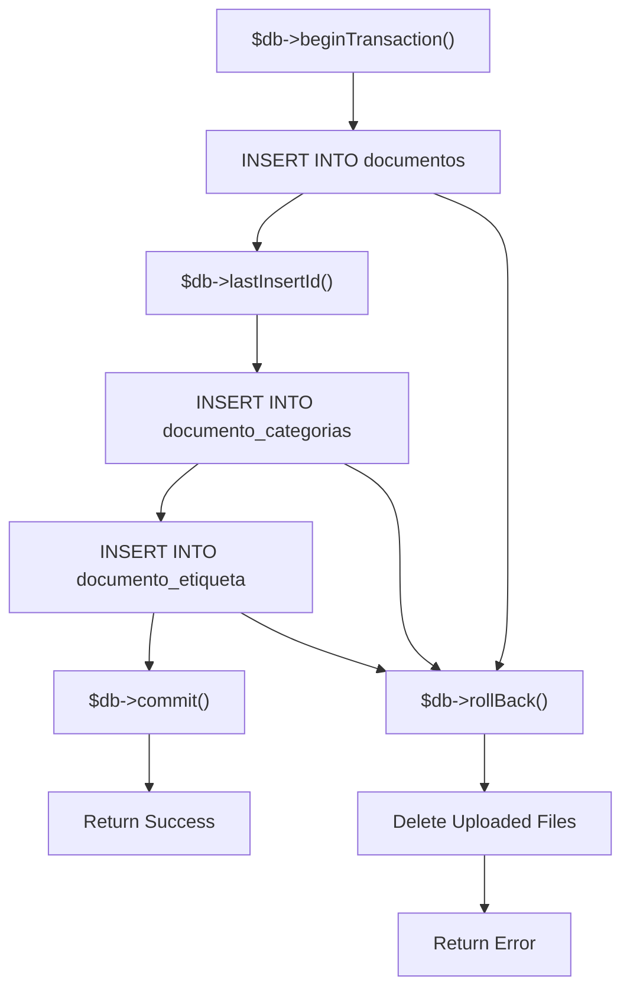

**Transaction Pattern:**

1. Begin transaction: `$db->beginTransaction()`
2. Execute multiple INSERT/UPDATE/DELETE operations
3. Commit on success: `$db->commit()`
4. Rollback on error: `$db->rollBack()` in catch block
5. Cleanup uploaded files if database operations fail

Sources: [src/backend/gestionRecursos/upload_resource.php L158-L217](https://github.com/axchisan/El-rincon-de-ADSO/blob/3e310227/src/backend/gestionRecursos/upload_resource.php#L158-L217)

## Prepared Statements

All database queries use PDO prepared statements to prevent SQL injection:

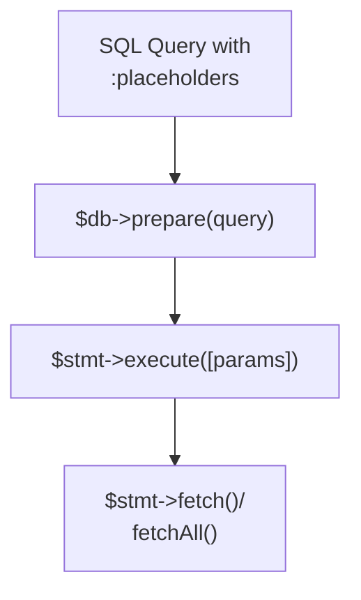

**Patterns:**

1. **Named Parameters:** `:usuario_id`, `:documento_id`, `:titulo`, etc.
2. **Array Binding:** `[':usuario_id' => $usuario_id, ':documento_id' => $documento_id]`
3. **Integer Binding:** `$stmt->bindValue(':limit', $limit, PDO::PARAM_INT)`

Sources: [src/backend/gestionRecursos/upload_resource.php L161-L180](https://github.com/axchisan/El-rincon-de-ADSO/blob/3e310227/src/backend/gestionRecursos/upload_resource.php#L161-L180)

 [src/backend/gestionRecursos/get_recently_viewed.php L17-L26](https://github.com/axchisan/El-rincon-de-ADSO/blob/3e310227/src/backend/gestionRecursos/get_recently_viewed.php#L17-L26)

## Data Enrichment Pattern

Collection APIs (favorites, recently viewed, saved resources) follow a consistent pattern for enriching resource data:

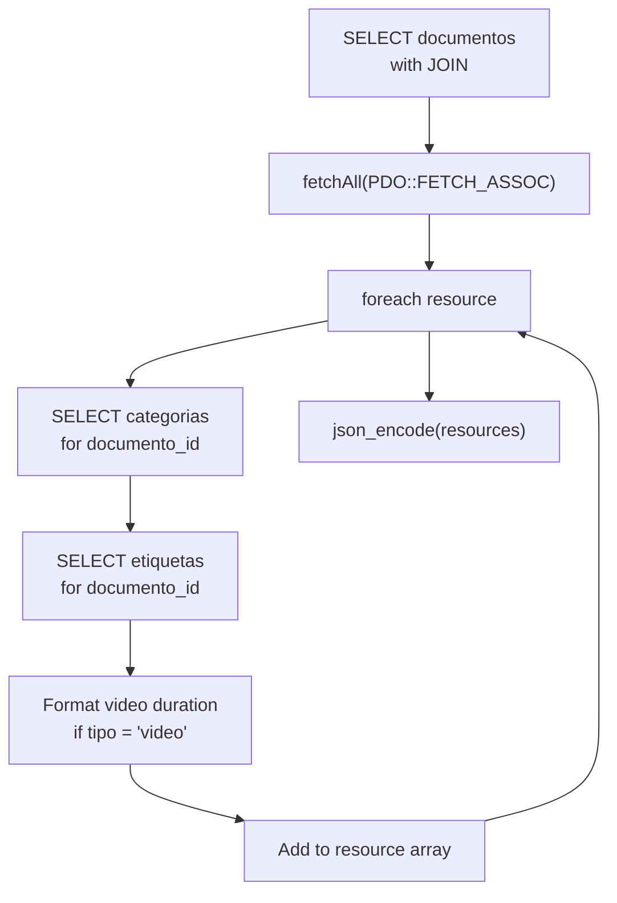

**Enrichment Steps:**

1. Fetch main resource data with JOINs
2. For each resource: * Query categories via `documento_categorias` junction table * Query tags via `documento_etiqueta` junction table * Format duration for video resources (convert PostgreSQL interval to HH:MM:SS)
3. Return enriched array

Sources: [src/backend/gestionRecursos/get_recently_viewed.php L17-L77](https://github.com/axchisan/El-rincon-de-ADSO/blob/3e310227/src/backend/gestionRecursos/get_recently_viewed.php#L17-L77)

 [src/backend/gestionRecursos/get_user_favorites.php L17-L76](https://github.com/axchisan/El-rincon-de-ADSO/blob/3e310227/src/backend/gestionRecursos/get_user_favorites.php#L17-L76)

 [src/backend/gestionRecursos/get_saved_resources.php L17-L76](https://github.com/axchisan/El-rincon-de-ADSO/blob/3e310227/src/backend/gestionRecursos/get_saved_resources.php#L17-L76)

## Error Handling Standards

### Error Response Structure

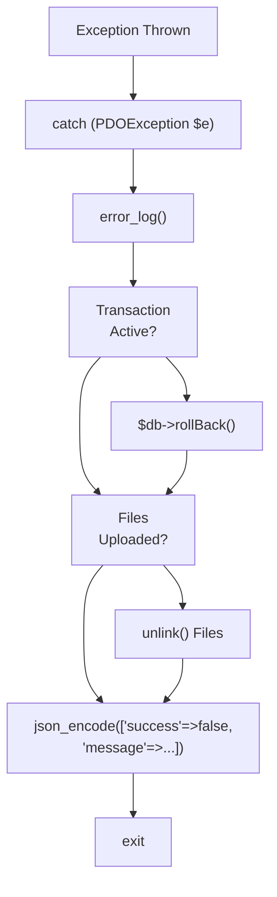

**Error Handling Patterns:**

1. **Try-Catch Blocks:** All database operations wrapped in try-catch
2. **Error Logging:** `error_log()` for server-side debugging
3. **Transaction Rollback:** Automatic rollback on exception
4. **File Cleanup:** Uploaded files deleted if database operations fail
5. **User-Friendly Messages:** Generic error messages in JSON response

Sources: [src/backend/gestionRecursos/upload_resource.php L212-L217](https://github.com/axchisan/El-rincon-de-ADSO/blob/3e310227/src/backend/gestionRecursos/upload_resource.php#L212-L217)

 [src/backend/gestionRecursos/get_recently_viewed.php L78-L81](https://github.com/axchisan/El-rincon-de-ADSO/blob/3e310227/src/backend/gestionRecursos/get_recently_viewed.php#L78-L81)

## API Quick Reference Table

| API Category | Endpoints Count | Authentication | Primary Purpose |
| --- | --- | --- | --- |
| Resource Management | 15+ | Required | CRUD operations for educational resources |
| Social Features | 10+ | Required | Friends, messaging, notifications |
| User Profile | 5+ | Required | Profile updates, password changes |
| Community | 8+ | Required | Comments, likes, forums, events |
| Authentication | 3 | Optional | Login, logout, registration |

For detailed endpoint documentation, request/response schemas, and code examples, refer to the subsections:

* [Resource Management APIs](/axchisan/El-rincon-de-ADSO/9.1-resource-management-apis)
* [Social and Community APIs](/axchisan/El-rincon-de-ADSO/9.2-social-and-community-apis)
* [User Profile APIs](/axchisan/El-rincon-de-ADSO/9.3-user-profile-apis)