# Características de la comunidad

> **Archivos fuente relevantes**
> * [LÉAME.md](https://github.com/axchisan/El-rincon-de-ADSO/blob/3e310227/README.md)
> * [src/backend/api/eventos.php](https://github.com/axchisan/El-rincon-de-ADSO/blob/3e310227/src/backend/api/eventos.php)
> * [src/backend/api/foro.php](https://github.com/axchisan/El-rincon-de-ADSO/blob/3e310227/src/backend/api/foro.php)
> * [src/frontend/eventos/css/style.css](https://github.com/axchisan/El-rincon-de-ADSO/blob/3e310227/src/frontend/eventos/css/style.css)
> * [src/frontend/eventos/eventos.php](https://github.com/axchisan/El-rincon-de-ADSO/blob/3e310227/src/frontend/eventos/eventos.php)
> * [src/frontend/foro/css/style.css](https://github.com/axchisan/El-rincon-de-ADSO/blob/3e310227/src/frontend/foro/css/style.css)
> * [src/frontend/foro/foro.php](https://github.com/axchisan/El-rincon-de-ADSO/blob/3e310227/src/frontend/foro/foro.php)
> * [src/frontend/inicio/img/icono.png](https://github.com/axchisan/El-rincon-de-ADSO/blob/3e310227/src/frontend/inicio/img/icono.png)
> * [src/frontend/inicio/img/inicio.png](https://github.com/axchisan/El-rincon-de-ADSO/blob/3e310227/src/frontend/inicio/img/inicio.png)
> * [src/frontend/inicio/index.php](https://github.com/axchisan/El-rincon-de-ADSO/blob/3e310227/src/frontend/inicio/index.php)
> * [src/frontend/login/img/slide1.jpg](https://github.com/axchisan/El-rincon-de-ADSO/blob/3e310227/src/frontend/login/img/slide1.jpg)
> * [src/frontend/login/img/slide2.jpg](https://github.com/axchisan/El-rincon-de-ADSO/blob/3e310227/src/frontend/login/img/slide2.jpg)
> * [src/frontend/login/img/slide3.jpg](https://github.com/axchisan/El-rincon-de-ADSO/blob/3e310227/src/frontend/login/img/slide3.jpg)
> * [src/frontend/notificaciones/css/style.css](https://github.com/axchisan/El-rincon-de-ADSO/blob/3e310227/src/frontend/notificaciones/css/style.css)
> * [src/frontend/panel/panel-usuario.php](https://github.com/axchisan/El-rincon-de-ADSO/blob/3e310227/src/frontend/panel/panel-usuario.php)
> * [src/frontend/repositorio/repositorio.php](https://github.com/axchisan/El-rincon-de-ADSO/blob/3e310227/src/frontend/repositorio/repositorio.php)

## Propósito y alcance

Esta página documenta los sistemas de participación comunitaria de El Rincón de ADSO, incluyendo el sistema de comentarios y calificaciones, los foros de discusión y la gestión de eventos. Estas funciones permiten a los usuarios interactuar entre sí, compartir opiniones sobre recursos educativos, participar en debates técnicos y organizar eventos comunitarios.

Para obtener información sobre los perfiles de usuario y las redes sociales, consulta [Perfiles de usuario](/axchisan/El-rincon-de-ADSO/6.4-user-profiles) . Para obtener más información sobre el sistema de mensajería entre amigos, consulta [Sistema de mensajería](/axchisan/El-rincon-de-ADSO/6.2-messaging-system) .

---

## Descripción general

El Rincón de ADSO ofrece tres mecanismos principales de participación comunitaria:

| Característica | Objetivo | Nivel de acceso |
| --- | --- | --- |
| **Comentarios y valoraciones** | Comparte opiniones y califica recursos con calificaciones de estrellas, me gusta y respuestas anidadas. | Todos los usuarios autenticados |
| **Temas del foro** | Crea hilos de discusión y participa en conversaciones técnicas. | Todos los usuarios autenticados |
| **Eventos** | Organizar y registrarse para seminarios web, talleres y reuniones comunitarias. | Todos los usuarios autenticados |

Todas las funciones de la comunidad requieren autenticación de usuario y están integradas en la estructura de navegación principal. Los sistemas funcionan de forma independiente, pero comparten patrones de interfaz de usuario y una arquitectura de base de datos comunes.

**Fuentes:** [src/frontend/inicio/index.php L254-L314](https://github.com/axchisan/El-rincon-de-ADSO/blob/3e310227/src/frontend/inicio/index.php#L254-L314)

 [src/frontend/foro/foro.php L106-L151](https://github.com/axchisan/El-rincon-de-ADSO/blob/3e310227/src/frontend/foro/foro.php#L106-L151)

 [src/frontend/eventos/eventos.php L107-L136](https://github.com/axchisan/El-rincon-de-ADSO/blob/3e310227/src/frontend/eventos/eventos.php#L107-L136)

 [README.md L45-L51](https://github.com/axchisan/El-rincon-de-ADSO/blob/3e310227/README.md#L45-L51)

---

## Arquitectura del sistema

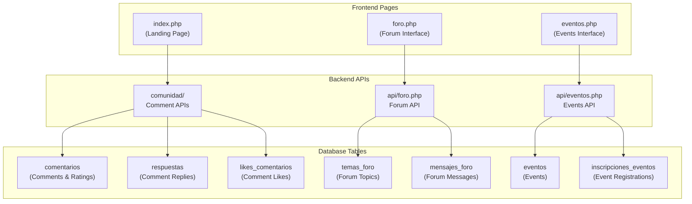

**Arquitectura de las características de la comunidad**

The community features are organized into three distinct subsystems, each with dedicated frontend pages, backend APIs, and database tables. All systems follow a consistent RESTful pattern and use PostgreSQL for data persistence.

**Sources:** [src/frontend/inicio/index.php L254-L314](https://github.com/axchisan/El-rincon-de-ADSO/blob/3e310227/src/frontend/inicio/index.php#L254-L314)

 [src/frontend/foro/foro.php L1-L377](https://github.com/axchisan/El-rincon-de-ADSO/blob/3e310227/src/frontend/foro/foro.php#L1-L377)

 [src/frontend/eventos/eventos.php L1-L277](https://github.com/axchisan/El-rincon-de-ADSO/blob/3e310227/src/frontend/eventos/eventos.php#L1-L277)

 [src/backend/api/foro.php L1-L113](https://github.com/axchisan/El-rincon-de-ADSO/blob/3e310227/src/backend/api/foro.php#L1-L113)

 [src/backend/api/eventos.php L1-L124](https://github.com/axchisan/El-rincon-de-ADSO/blob/3e310227/src/backend/api/eventos.php#L1-L124)

---

## Comments and Ratings System

### Overview

The comments system allows users to share opinions about books, resources, or topics, rate them with 1-5 star ratings, like comments from other users, and engage in nested reply conversations. Comments appear on the landing page's community section.

### Frontend Interface

The comment form is displayed on `index.php` for authenticated users:

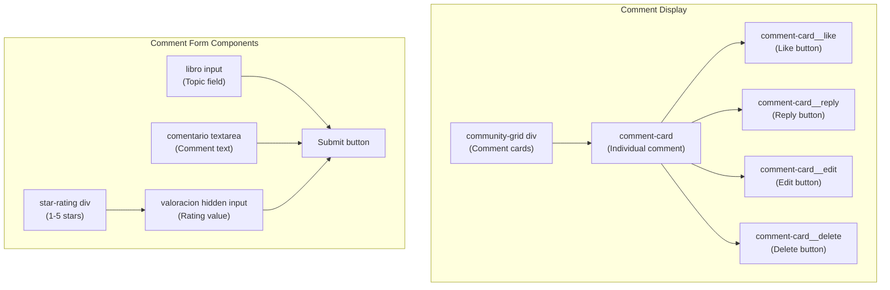

**Comment Form and Display Structure**

**Key Form Elements:**

* **Topic Field (`libro`)**: Text input for what the comment is about [line 273]
* **Comment Text (`comentario`)**: Textarea for the actual comment content [line 277]
* **Star Rating**: Interactive 5-star rating interface [lines 281-288]
* **Hidden Rating Value**: Stores selected star rating (0-5) [line 282]

**Display Features:**

* Comments are loaded dynamically via AJAX into `#community-grid` [line 296]
* Each comment card displays author, rating, content, and timestamp
* Action buttons (Like, Reply, Edit, Delete) appear for authenticated users
* Edit and Delete buttons only visible for comment owners

**Sources:** [src/frontend/inicio/index.php L266-L293](https://github.com/axchisan/El-rincon-de-ADSO/blob/3e310227/src/frontend/inicio/index.php#L266-L293)

 [src/frontend/inicio/index.php L295-L313](https://github.com/axchisan/El-rincon-de-ADSO/blob/3e310227/src/frontend/inicio/index.php#L295-L313)

### Star Rating Interaction

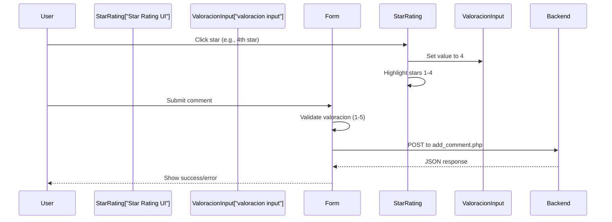

**Star Rating Interaction Flow**

The star rating system uses JavaScript event listeners to capture user interactions:

* Click handlers set the rating value and update visual state [lines 383-400]
* Hover effects preview star selection [lines 402-421]
* Form validation ensures rating is between 1-5 before submission [lines 433-436]

**Sources:** [src/frontend/inicio/index.php L377-L423](https://github.com/axchisan/El-rincon-de-ADSO/blob/3e310227/src/frontend/inicio/index.php#L377-L423)

 [src/frontend/inicio/index.php L426-L464](https://github.com/axchisan/El-rincon-de-ADSO/blob/3e310227/src/frontend/inicio/index.php#L426-L464)

### Comment Actions

| Action | Endpoint | Method | Availability |
| --- | --- | --- | --- |
| Add Comment | `comunidad/add_comment.php` | POST | All authenticated users |
| Toggle Like | `comunidad/toggle_like.php` | POST | All authenticated users |
| Add Reply | `comunidad/add_reply.php` | POST | All authenticated users |
| Edit Comment | `comunidad/edit_comment.php` | POST | Comment owner only |
| Delete Comment | `comunidad/delete_comment.php` | POST | Comment owner only |

### Like System Implementation

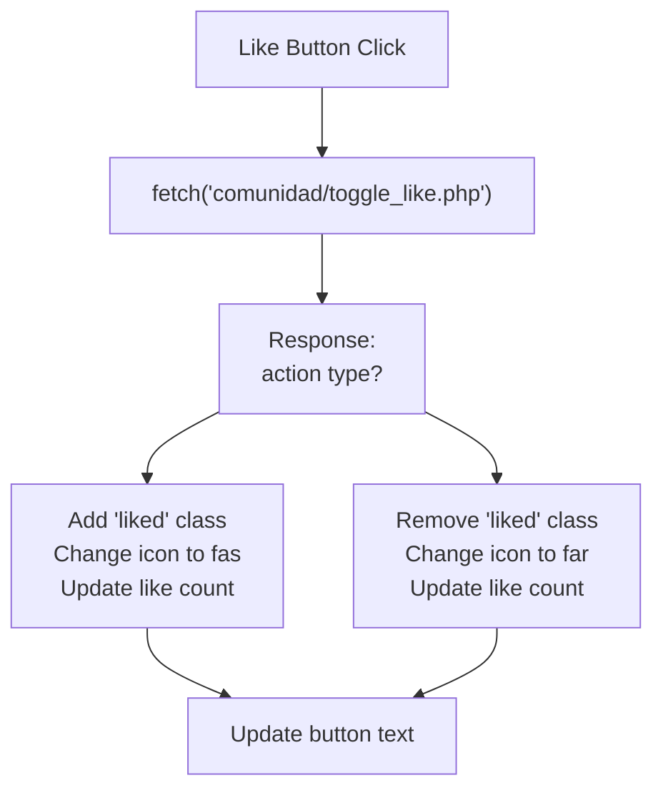

**Like Toggle Flow**

The like system toggles between liked/unliked states:

* Sends comment ID to backend [lines 475-481]
* Backend returns action type (`added` or `removed`) and new like count [lines 484-496]
* UI updates icon style and displays new count [lines 485-495]

**Sources:** [src/frontend/inicio/index.php L468-L506](https://github.com/axchisan/El-rincon-de-ADSO/blob/3e310227/src/frontend/inicio/index.php#L468-L506)

### Reply System

Comments support nested replies, creating threaded conversations:

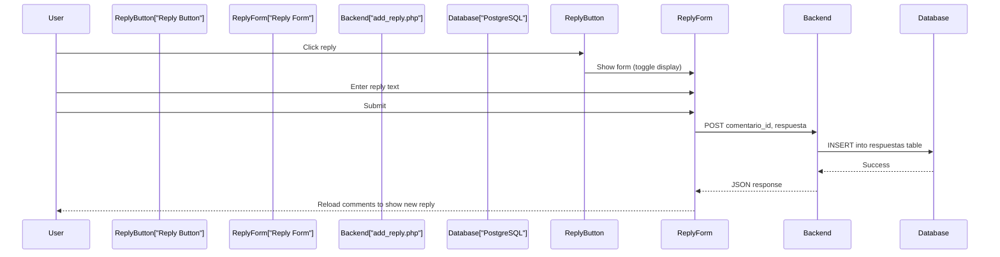

**Reply Interaction Flow**

**Reply Form Structure:**

* Each comment has a hidden reply form with ID `reply-form-{comentario_id}` [line 514]
* Reply button toggles form visibility [lines 511-518]
* Form submission sends `comentario_id` and `respuesta` text [lines 529-535]
* After successful reply, comments are reloaded to display the new reply [lines 539-543]

**Sources:** [src/frontend/inicio/index.php L509-L554](https://github.com/axchisan/El-rincon-de-ADSO/blob/3e310227/src/frontend/inicio/index.php#L509-L554)

### Edit and Delete Functionality

Comment owners can edit or delete their own comments:

**Edit Process:**

1. Edit button click retrieves comment data from DOM [lines 590-595]
2. Dynamic edit form is created with pre-filled values [lines 598-631]
3. Form includes topic, comment text, and star rating [lines 603-618]
4. Submission posts to `comunidad/edit_comment.php` [lines 639-660]

**Delete Process:**

1. Delete button displays confirmation dialog [line 562]
2. If confirmed, sends `comentario_id` to `comunidad/delete_comment.php` [lines 563-569]
3. On success, reloads comment list [lines 573-575]

Both operations are restricted to the comment owner through backend authentication checks.

**Sources:** [src/frontend/inicio/index.php L556-L685](https://github.com/axchisan/El-rincon-de-ADSO/blob/3e310227/src/frontend/inicio/index.php#L556-L685)

---

## Forum System

### Overview

The forum system enables users to create discussion topics and participate in threaded conversations. Each topic can have multiple messages, and conversations update in real-time via 5-second polling.

### Forum Interface Structure

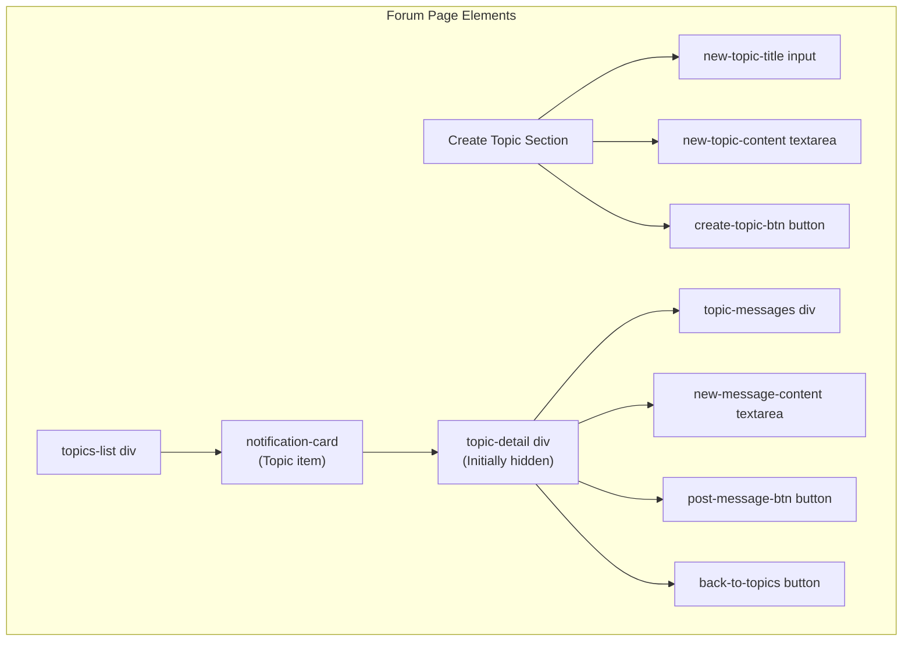

**Forum UI Components**

**Sources:** [src/frontend/foro/foro.php L115-L149](https://github.com/axchisan/El-rincon-de-ADSO/blob/3e310227/src/frontend/foro/foro.php#L115-L149)

### Topic Creation Flow

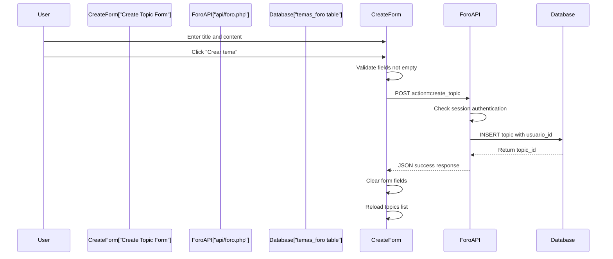

**Topic Creation Process**

The topic creation process involves:

1. Form validation ensures title and content are not empty [lines 290-293]
2. POST request to `api/foro.php` with `action: 'create_topic'` [lines 295-303]
3. Backend inserts into `temas_foro` table with current `usuario_id` [lines 38-45]
4. Frontend clears form and refreshes topic list on success [lines 307-310]

**Sources:** [src/frontend/foro/foro.php L286-L318](https://github.com/axchisan/El-rincon-de-ADSO/blob/3e310227/src/frontend/foro/foro.php#L286-L318)

 [src/backend/api/foro.php L29-L49](https://github.com/axchisan/El-rincon-de-ADSO/blob/3e310227/src/backend/api/foro.php#L29-L49)

### Forum Backend API

The forum API at `src/backend/api/foro.php` handles all forum operations:

| Operation | HTTP Method | Action Parameter | Request Data | Response |
| --- | --- | --- | --- | --- |
| Get Topics | GET | N/A | None | Array of topics with author names |
| Get Messages | GET | N/A | `topic_id` query param | Array of messages for topic |
| Create Topic | POST | `create_topic` | `title`, `content` | New `topic_id` |
| Post Message | POST | `post_message` | `topic_id`, `content` | New `message_id` |

**API Implementation Details:**

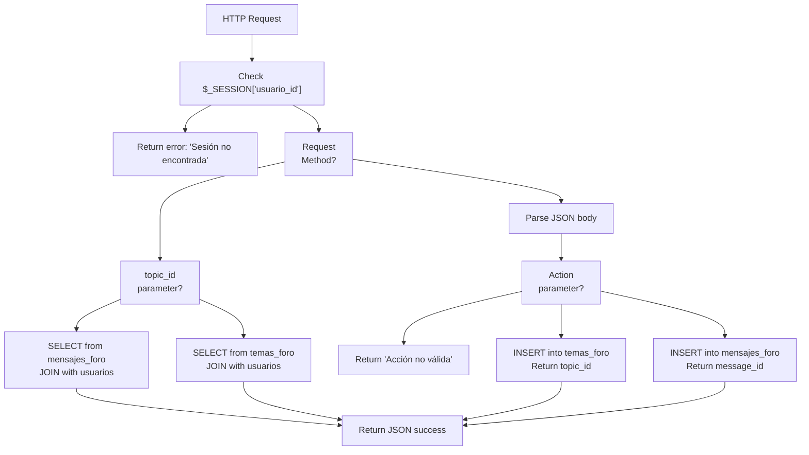

**Forum API Request Routing**

**Authentication:** All requests require an active session with `usuario_id` set [lines 15-19]

**Database Queries:**

* Topics query joins `temas_foro` with `usuarios` to get author names [lines 97-100]
* Messages query joins `mensajes_foro` with `usuarios` for message authors [lines 84-88]
* All queries order results chronologically (DESC for topics, ASC for messages)

**Sources:** [src/backend/api/foro.php L14-L113](https://github.com/axchisan/El-rincon-de-ADSO/blob/3e310227/src/backend/api/foro.php#L14-L113)

### Real-Time Updates

The forum implements pseudo real-time updates through polling:

```javascript
setInterval(() => {
  if (currentTopicId) {
    loadMessages();
  }
}, 5000);
```

This interval runs every 5 seconds and reloads messages only when viewing a topic detail [lines 364-368]. The `loadMessages()` function tracks the last message ID to append only new messages rather than reloading the entire list [lines 245-255].

**Sources:** [src/frontend/foro/foro.php L362-L368](https://github.com/axchisan/El-rincon-de-ADSO/blob/3e310227/src/frontend/foro/foro.php#L362-L368)

 [src/frontend/foro/foro.php L234-L283](https://github.com/axchisan/El-rincon-de-ADSO/blob/3e310227/src/frontend/foro/foro.php#L234-L283)

---

## Events System

### Overview

The events system allows users to create and manage community events such as webinars, workshops, and meetups. Users can register for or cancel their registration to events, and events are displayed chronologically by start date.

### Event Creation Interface

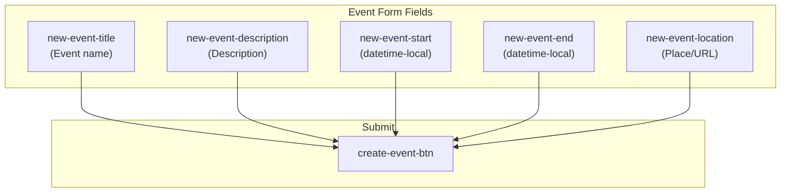

**Event Form Structure**

**Required Fields:**

* Title: Text input for event name [line 119]
* Start Date/Time: HTML5 `datetime-local` input [line 121]

**Optional Fields:**

* Description: Textarea for event details [line 120]
* End Date/Time: Event duration [line 122]
* Location: Physical location or online meeting URL [line 123]

**Sources:** [src/frontend/eventos/eventos.php L115-L128](https://github.com/axchisan/El-rincon-de-ADSO/blob/3e310227/src/frontend/eventos/eventos.php#L115-L128)

### Event Registration Flow

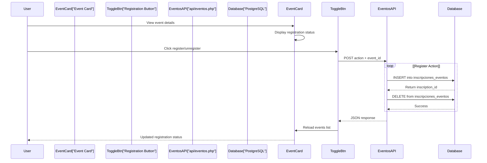

**Event Registration Process**

**Registration States:**

* Events display whether user is registered via `is_registered` flag [line 183]
* Button text changes based on state: "Inscribirse" or "Cancelar inscripción" [line 199]
* Click handler determines action from button text [line 212]

**Backend Operations:**

* Register: `INSERT INTO inscripciones_eventos (evento_id, usuario_id)` [lines 66-72]
* Unregister: `DELETE FROM inscripciones_eventos WHERE evento_id AND usuario_id` [lines 85-90]

**Sources:** [src/frontend/eventos/eventos.php L161-L236](https://github.com/axchisan/El-rincon-de-ADSO/blob/3e310227/src/frontend/eventos/eventos.php#L161-L236)

 [src/backend/api/eventos.php L58-L93](https://github.com/axchisan/El-rincon-de-ADSO/blob/3e310227/src/backend/api/eventos.php#L58-L93)

### Events Backend API

The events API at `src/backend/api/eventos.php` manages event CRUD operations and registrations:

| Operation | HTTP Method | Action Parameter | Request Data | Behavior |
| --- | --- | --- | --- | --- |
| Get Events | GET | N/A | None | Return future events with registration status |
| Create Event | POST | `create_event` | `title`, `start`, optional fields | Create new event, return event_id |
| Register | POST | `register` | `event_id` | Add user to event registrations |
| Unregister | POST | `unregister` | `event_id` | Remove user from event registrations |

**Event Query Logic:**

```sql
SELECT e.id, e.titulo, e.descripcion, e.fecha_inicio, e.fecha_fin, 
       e.lugar, e.fecha_creacion, u.nombre_usuario AS organizador,
       EXISTS (
           SELECT 1 FROM inscripciones_eventos ie 
           WHERE ie.evento_id = e.id AND ie.usuario_id = :user_id
       ) AS is_registered
FROM eventos e 
JOIN usuarios u ON e.organizador_id = u.id 
WHERE e.fecha_inicio >= CURRENT_TIMESTAMP 
ORDER BY e.fecha_inicio ASC
```

This query:

* Joins events with organizer user information [line 110]
* Filters to show only future events (`fecha_inicio >= CURRENT_TIMESTAMP`) [line 111]
* Includes registration status for current user via `EXISTS` subquery [lines 105-108]
* Orders by event start date ascending [line 112]

**Sources:** [src/backend/api/eventos.php L103-L118](https://github.com/axchisan/El-rincon-de-ADSO/blob/3e310227/src/backend/api/eventos.php#L103-L118)

### Event Creation Process

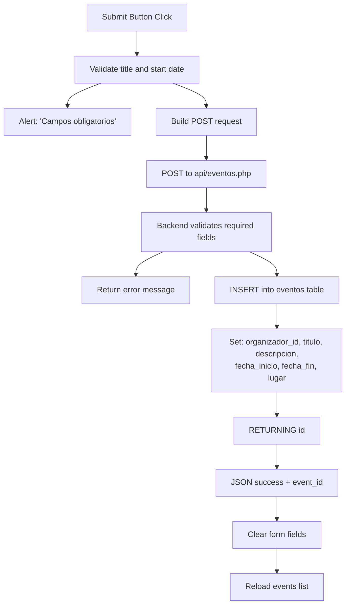

**Event Creation Flow**

**Frontend Validation:**

* Checks title and start date are not empty [lines 240-244]
* Sends all form fields including optional description, end date, and location [lines 247-253]

**Backend Processing:**

* Validates required fields (title, start) [lines 36-40]
* Inserts with `RETURNING id` clause to get new event ID [lines 42-52]
* Returns success response with event_id [lines 55-57]

**Sources:** [src/frontend/eventos/eventos.php L237-L275](https://github.com/axchisan/El-rincon-de-ADSO/blob/3e310227/src/frontend/eventos/eventos.php#L237-L275)

 [src/backend/api/eventos.php L29-L57](https://github.com/axchisan/El-rincon-de-ADSO/blob/3e310227/src/backend/api/eventos.php#L29-L57)

---

## Database Schema

### Community Tables Overview

```css
#mermaid-ie37xxe7w7e{font-family:ui-sans-serif,-apple-system,system-ui,Segoe UI,Helvetica;font-size:16px;fill:#333;}@keyframes edge-animation-frame{from{stroke-dashoffset:0;}}@keyframes dash{to{stroke-dashoffset:0;}}#mermaid-ie37xxe7w7e .edge-animation-slow{stroke-dasharray:9,5!important;stroke-dashoffset:900;animation:dash 50s linear infinite;stroke-linecap:round;}#mermaid-ie37xxe7w7e .edge-animation-fast{stroke-dasharray:9,5!important;stroke-dashoffset:900;animation:dash 20s linear infinite;stroke-linecap:round;}#mermaid-ie37xxe7w7e .error-icon{fill:#dddddd;}#mermaid-ie37xxe7w7e .error-text{fill:#222222;stroke:#222222;}#mermaid-ie37xxe7w7e .edge-thickness-normal{stroke-width:1px;}#mermaid-ie37xxe7w7e .edge-thickness-thick{stroke-width:3.5px;}#mermaid-ie37xxe7w7e .edge-pattern-solid{stroke-dasharray:0;}#mermaid-ie37xxe7w7e .edge-thickness-invisible{stroke-width:0;fill:none;}#mermaid-ie37xxe7w7e .edge-pattern-dashed{stroke-dasharray:3;}#mermaid-ie37xxe7w7e .edge-pattern-dotted{stroke-dasharray:2;}#mermaid-ie37xxe7w7e .marker{fill:#999;stroke:#999;}#mermaid-ie37xxe7w7e .marker.cross{stroke:#999;}#mermaid-ie37xxe7w7e svg{font-family:ui-sans-serif,-apple-system,system-ui,Segoe UI,Helvetica;font-size:16px;}#mermaid-ie37xxe7w7e p{margin:0;}#mermaid-ie37xxe7w7e .entityBox{fill:#ffffff;stroke:#dddddd;}#mermaid-ie37xxe7w7e .relationshipLabelBox{fill:#dddddd;opacity:0.7;background-color:#dddddd;}#mermaid-ie37xxe7w7e .relationshipLabelBox rect{opacity:0.5;}#mermaid-ie37xxe7w7e .labelBkg{background-color:rgba(221, 221, 221, 0.5);}#mermaid-ie37xxe7w7e .edgeLabel .label{fill:#dddddd;font-size:14px;}#mermaid-ie37xxe7w7e .label{font-family:ui-sans-serif,-apple-system,system-ui,Segoe UI,Helvetica;color:#333;}#mermaid-ie37xxe7w7e .edge-pattern-dashed{stroke-dasharray:8,8;}#mermaid-ie37xxe7w7e .node rect,#mermaid-ie37xxe7w7e .node circle,#mermaid-ie37xxe7w7e .node ellipse,#mermaid-ie37xxe7w7e .node polygon{fill:#ffffff;stroke:#dddddd;stroke-width:1px;}#mermaid-ie37xxe7w7e .relationshipLine{stroke:#999;stroke-width:1;fill:none;}#mermaid-ie37xxe7w7e .marker{fill:none!important;stroke:#999!important;stroke-width:1;}#mermaid-ie37xxe7w7e :root{--mermaid-font-family:"trebuchet ms",verdana,arial,sans-serif;}createscreatesgivescreatespostsorganizesregistershasreceivescontainshasusuarioscomentariosintidPKintusuario_idFKstringlibrotextcomentariointvaloraciontimestampfecha_creacionrespuestasintidPKintcomentario_idFKintusuario_idFKtextrespuestatimestampfecha_creacionlikes_comentariosintidPKintcomentario_idFKintusuario_idFKtimestampfecha_creaciontemas_forointidPKintusuario_idFKstringtitulotextcontenidotimestampfecha_creacionmensajes_forointidPKinttema_idFKintusuario_idFKtextcontenidotimestampfecha_creacioneventosintidPKintorganizador_idFKstringtitulotextdescripciontimestampfecha_iniciotimestampfecha_finstringlugartimestampfecha_creacioninscripciones_eventosintidPKintevento_idFKintusuario_idFKtimestampfecha_inscripcion
```

**Community Database Schema**

### Table Descriptions

| Table | Purpose | Key Fields |
| --- | --- | --- |
| `comentarios` | Stores user comments with star ratings | `usuario_id`, `libro`, `comentario`, `valoracion` (1-5) |
| `respuestas` | Nested replies to comments | `comentario_id`, `usuario_id`, `respuesta` |
| `likes_comentarios` | Tracks comment likes | `comentario_id`, `usuario_id` |
| `temas_foro` | Forum discussion topics | `usuario_id`, `titulo`, `contenido` |
| `mensajes_foro` | Messages within forum topics | `tema_id`, `usuario_id`, `contenido` |
| `eventos` | Community events | `organizador_id`, `titulo`, `fecha_inicio`, `lugar` |
| `inscripciones_eventos` | Event registrations | `evento_id`, `usuario_id` |

**Key Relationships:**

* All tables reference `usuarios(id)` for user association
* Comments can have multiple replies (one-to-many)
* Comments can have multiple likes (one-to-many)
* Forum topics contain multiple messages (one-to-many)
* Events can have multiple registrations (many-to-many through junction table)

**Sources:** [src/backend/api/foro.php L38-L65](https://github.com/axchisan/El-rincon-de-ADSO/blob/3e310227/src/backend/api/foro.php#L38-L65)

 [src/backend/api/eventos.php L42-L72](https://github.com/axchisan/El-rincon-de-ADSO/blob/3e310227/src/backend/api/eventos.php#L42-L72)

---

## API Endpoints Reference

### Comments System Endpoints

| Endpoint | Method | Parameters | Response | Purpose |
| --- | --- | --- | --- | --- |
| `/backend/comunidad/add_comment.php` | POST | `libro`, `comentario`, `valoracion` | JSON success/error | Create new comment |
| `/backend/comunidad/toggle_like.php` | POST | `comentario_id` | JSON with `action`, `likes` count | Add/remove like |
| `/backend/comunidad/add_reply.php` | POST | `comentario_id`, `respuesta` | JSON success/error | Add reply to comment |
| `/backend/comunidad/edit_comment.php` | POST | `comentario_id`, `libro`, `comentario`, `valoracion` | JSON success/error | Update existing comment |
| `/backend/comunidad/delete_comment.php` | POST | `comentario_id` | JSON success/error | Delete comment |

### Forum System Endpoints

**Base URL:** `/backend/api/foro.php`

| Method | Action Parameter | Query/Body Parameters | Returns |
| --- | --- | --- | --- |
| GET | N/A | None | List of all forum topics |
| GET | N/A | `topic_id` (query param) | Messages for specific topic |
| POST | `create_topic` | `title`, `content` | New `topic_id` |
| POST | `post_message` | `topic_id`, `content` | New `message_id` |

**Example Request (Create Topic):**

```json
{
  "action": "create_topic",
  "title": "How to learn PHP?",
  "content": "I'm new to PHP and looking for resources..."
}
```

**Example Response:**

```json
{
  "status": "success",
  "message": "Tema creado con éxito",
  "data": {
    "topic_id": 42
  }
}
```

### Events System Endpoints

**Base URL:** `/backend/api/eventos.php`

| Method | Action Parameter | Body Parameters | Returns |
| --- | --- | --- | --- |
| GET | N/A | None | Future events with registration status |
| POST | `create_event` | `title`, `start`, `description`, `end`, `location` | New `event_id` |
| POST | `register` | `event_id` | `inscription_id` |
| POST | `unregister` | `event_id` | Success confirmation |

**Example Request (Create Event):**

```json
{
  "action": "create_event",
  "title": "Web Development Workshop",
  "description": "Learn HTML, CSS, and JavaScript basics",
  "start": "2024-02-15T14:00:00",
  "end": "2024-02-15T17:00:00",
  "location": "Online - Zoom"
}
```

**Sources:** [src/backend/api/foro.php L24-L77](https://github.com/axchisan/El-rincon-de-ADSO/blob/3e310227/src/backend/api/foro.php#L24-L77)

 [src/backend/api/eventos.php L24-L99](https://github.com/axchisan/El-rincon-de-ADSO/blob/3e310227/src/backend/api/eventos.php#L24-L99)

---

## Authentication and Authorization

All community features require user authentication via session management:

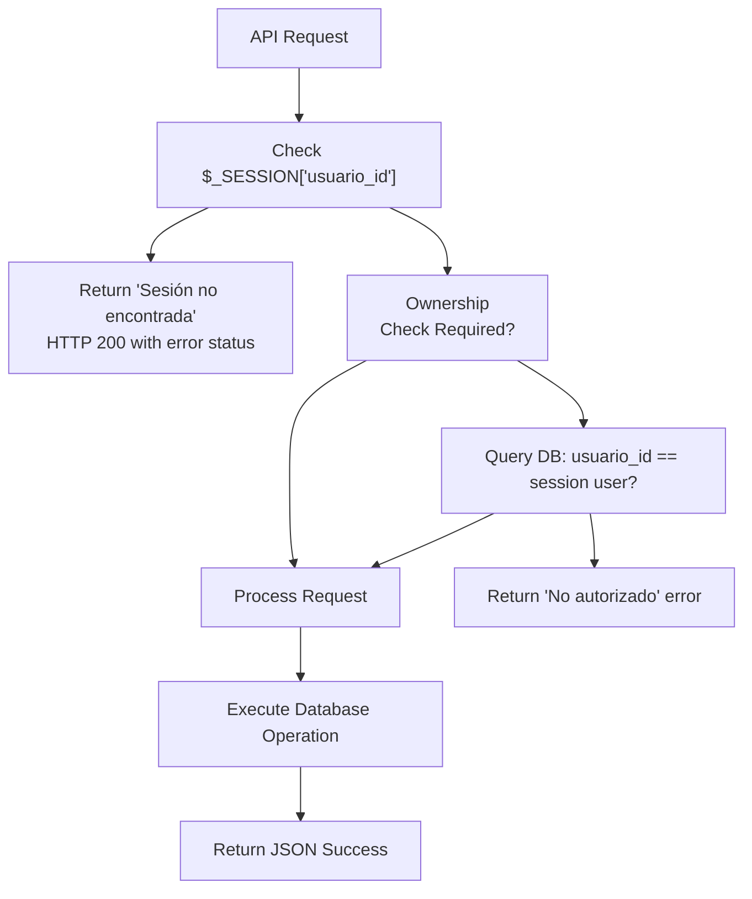

**Authentication Flow for Community Features**

**Session Requirements:**

* Todos los puntos finales se verifican `$_SESSION['usuario_id']`antes del procesamiento [foro.php:15-19, eventos.php:15-19]
* La sesión debe estar activa y contener una identificación de usuario válida
* La autenticación fallida devuelve un error JSON sin código de error HTTP

**Comprobaciones de propiedad:**

* Las operaciones de edición/eliminación verifican que el recurso pertenece al usuario actual
* Comentarios: Sólo el creador puede editar o eliminar su comentario.
* Mensajes del foro: Sólo el autor del mensaje puede modificarlo
* Eventos: Solo el organizador puede modificar los detalles del evento (no se muestra en el código proporcionado, pero está implícito)

**Fuentes:** [src/backend/api/foro.php L15-L19](https://github.com/axchisan/El-rincon-de-ADSO/blob/3e310227/src/backend/api/foro.php#L15-L19)

 [src/backend/api/eventos.php L15-L19](https://github.com/axchisan/El-rincon-de-ADSO/blob/3e310227/src/backend/api/eventos.php#L15-L19)

---

## Integración con otros sistemas

Las características de la comunidad se integran con varios otros subsistemas de la plataforma:

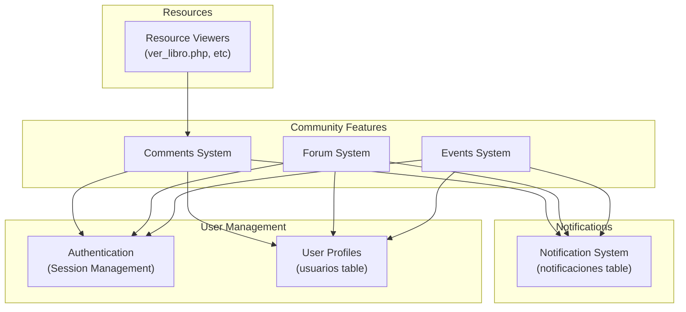

**Puntos de integración de funciones de la comunidad**

**Integraciones actuales:**

* **Autenticación:** Todas las funciones de la comunidad requieren sesiones de usuario activas
* **Perfiles de usuario:** Los comentarios, temas y eventos muestran los nombres de los autores y organizadores mediante UNIRSE con `usuarios`la tabla
* **Navegación:** Funciones de la comunidad accesibles a través de la barra de navegación principal en todas las páginas autenticadas

**Integraciones potenciales (no implementadas):**

* **Notificaciones:** Podría notificar a los usuarios cuando sus comentarios reciban respuestas o me gusta.
* **Recursos:** El sistema de comentarios se encuentra actualmente en la página de inicio y podría integrarse con páginas de recursos individuales.
* **Sistema de amigos:** Podría filtrar temas del foro o eventos de amigos.

**Fuentes:** [src/frontend/inicio/index.php L266-L314](https://github.com/axchisan/El-rincon-de-ADSO/blob/3e310227/src/frontend/inicio/index.php#L266-L314)

 [src/frontend/foro/foro.php L66-L79](https://github.com/axchisan/El-rincon-de-ADSO/blob/3e310227/src/frontend/foro/foro.php#L66-L79)

 [src/frontend/eventos/eventos.php L66-L79](https://github.com/axchisan/El-rincon-de-ADSO/blob/3e310227/src/frontend/eventos/eventos.php#L66-L79)

---

## Patrones y estilos de interfaz de usuario

Todas las características de la comunidad comparten patrones de interfaz de usuario consistentes definidos en sus archivos CSS:

### Componentes compartidos

| Clase de componente | Objetivo | Usado en |
| --- | --- | --- |
| `.friend-card` | Contenedor para formularios y tarjetas de contenido | Foros, eventos |
| `.notification-card` | Elemento de visualización para temas/eventos/comentarios | Todos los sistemas |
| `.friend-card__input` | Entradas de texto con estilo y áreas de texto | Todas las formas |
| `.friend-card__action` | Botones de acción (enviar, aceptar, rechazar) | Todos los sistemas |
| `.friends-list__empty` | Mensaje de estado vacío | Todas las listas |

### Esquema de colores

Las secciones de la comunidad utilizan una paleta de colores consistente con temática de café:

```
--color-coffee: #654321
--color-coffee-dark: #4a3219
--color-latte: #e6d9cc
--color-cappuccino: #d8ccc0
```

### Insignia de notificación

Una insignia muestra el recuento de notificaciones no leídas en la barra de navegación:

```xml
<span class="notification-badge">5</span>
```

Esta insignia aparece junto al enlace "Notificaciones" y se actualiza dinámicamente según el recuento de mensajes no leídos.

**Fuentes:** [src/frontend/foro/css/style.css L1-L52](https://github.com/axchisan/El-rincon-de-ADSO/blob/3e310227/src/frontend/foro/css/style.css#L1-L52)

 [src/frontend/eventos/css/style.css L1-L52](https://github.com/axchisan/El-rincon-de-ADSO/blob/3e310227/src/frontend/eventos/css/style.css#L1-L52)

 [src/frontend/notificaciones/css/style.css L417-L430](https://github.com/axchisan/El-rincon-de-ADSO/blob/3e310227/src/frontend/notificaciones/css/style.css#L417-L430)

---

## Capacidad de respuesta móvil

Todas las interfaces de la comunidad implementan un diseño responsivo:

**Menú móvil:** Menú hamburguesa para navegación en anchos de pantalla inferiores a 768 px [foro.php:81-103]

**Puntos de interrupción responsivos:**

```
@media (min-width: 768px) {
  .navbar__menu { display: flex; }
  .navbar__toggle { display: none; }
}
```

**Optimizaciones móviles:**

* Las acciones de formulario se apilan verticalmente en pantallas pequeñas [style.css:649-663]
* Las tarjetas de notificación se convierten en diseños de una sola columna
* Tamaños de botones táctiles
* Escala de fuente para facilitar la legibilidad

**Fuentes:** [src/frontend/foro/css/style.css L251-L264](https://github.com/axchisan/El-rincon-de-ADSO/blob/3e310227/src/frontend/foro/css/style.css#L251-L264)

 [src/frontend/foro/css/style.css L649-L663](https://github.com/axchisan/El-rincon-de-ADSO/blob/3e310227/src/frontend/foro/css/style.css#L649-L663)