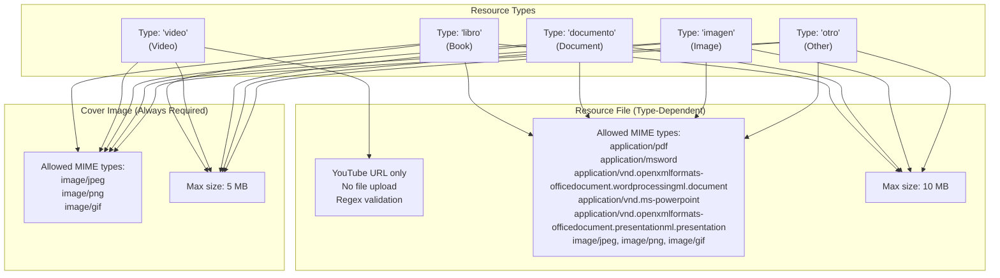
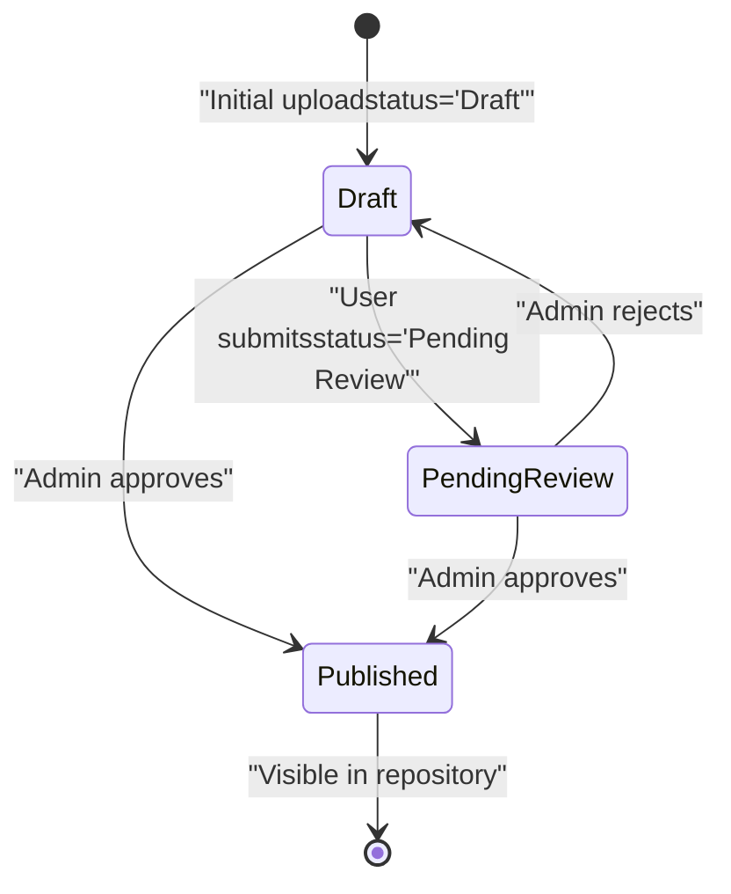
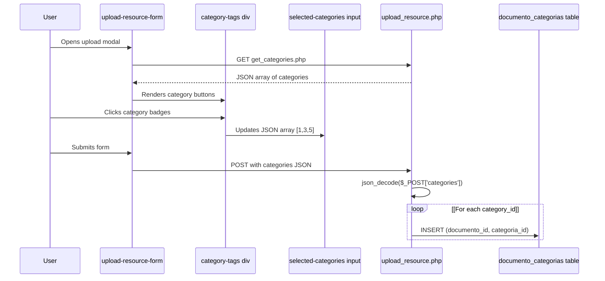
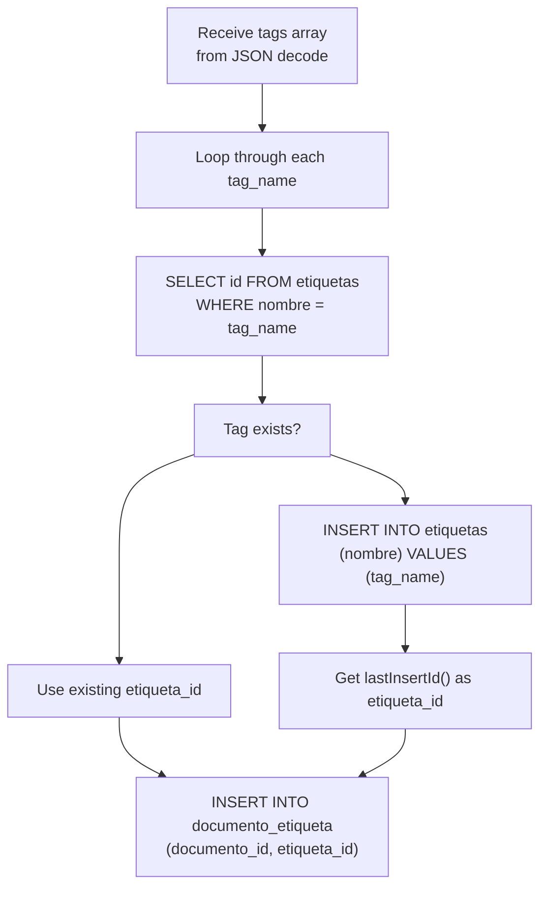
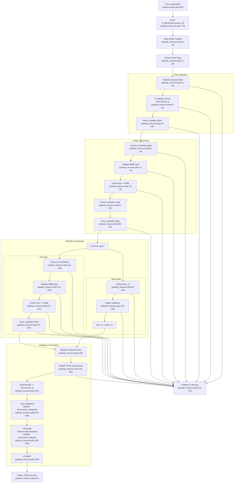
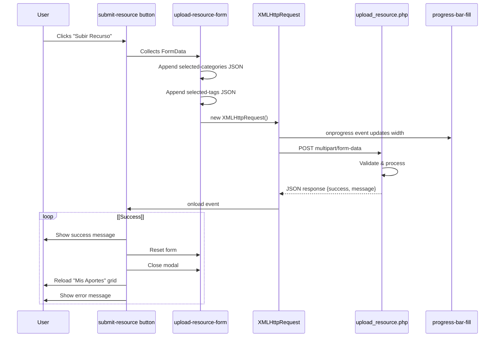

# Carga y validación de recursos

> **Archivos fuente relevantes**
> * [src/backend/gestionRecursos/get_recent_resources.php](https://github.com/axchisan/El-rincon-de-ADSO/blob/3e310227/src/backend/gestionRecursos/get_recent_resources.php)
> * [src/backend/gestionRecursos/upload_resource.php](https://github.com/axchisan/El-rincon-de-ADSO/blob/3e310227/src/backend/gestionRecursos/upload_resource.php)
> * [src/frontend/inicio/index.php](https://github.com/axchisan/El-rincon-de-ADSO/blob/3e310227/src/frontend/inicio/index.php)
> * [src/frontend/panel/panel-usuario.php](https://github.com/axchisan/El-rincon-de-ADSO/blob/3e310227/src/frontend/panel/panel-usuario.php)
> * [src/frontend/repositorio/repositorio.php](https://github.com/axchisan/El-rincon-de-ADSO/blob/3e310227/src/frontend/repositorio/repositorio.php)

Esta página documenta el sistema de carga de recursos, incluyendo la interfaz del formulario de carga, las reglas de validación de archivos, la gestión de metadatos y el procesamiento backend. Los usuarios pueden contribuir con recursos educativos (libros, vídeos, documentos e imágenes) a través del panel de usuario, con validación exhaustiva tanto a nivel de cliente como de servidor.

Para obtener información sobre cómo ver y administrar los recursos cargados después de su creación, consulte [la pestaña Repositorio - Recursos de usuario](/axchisan/El-rincon-de-ADSO/4.1-repository-tab-user-resources) . Para obtener más información sobre cómo se muestran y exploran los recursos, consulte [Visores de recursos](/axchisan/El-rincon-de-ADSO/5.2-resource-viewers) .

## Descripción general

Al sistema de carga de recursos se accede a través de la pestaña “Mis Aportes” en el panel de usuario en[src/frontend/panel/panel-usuario.php L199-L346](https://github.com/axchisan/El-rincon-de-ADSO/blob/3e310227/src/frontend/panel/panel-usuario.php#L199-L346)

Cuando los usuarios hacen clic en "Nuevo aporte", se abre un formulario modal con campos para metadatos de recursos, carga de archivos, categorización y configuración de visibilidad. El controlador de backend en[src/backend/gestionRecursos/upload_resource.php](https://github.com/axchisan/El-rincon-de-ADSO/blob/3e310227/src/backend/gestionRecursos/upload_resource.php)

Valida los envíos, procesa las cargas de archivos al `uploads/`directorio y almacena metadatos en la `documentos`tabla con relaciones con categorías y etiquetas.

## Interfaz de formulario de carga

El modal de carga presenta un formulario completo con dos entradas de archivo principales:

**Imagen de portada** (obligatoria para todos los tipos de recursos):

* Campo: `resource-image`entrada en[src/frontend/panel/panel-usuario.php L226-L229](https://github.com/axchisan/El-rincon-de-ADSO/blob/3e310227/src/frontend/panel/panel-usuario.php#L226-L229)
* Aceptar:`image/*`
* Se utiliza como miniatura/portada en los listados de recursos.

**Archivo de recursos** (condicional según el tipo):

* Campo: `resource-file`entrada en[src/frontend/panel/panel-usuario.php L250-L254](https://github.com/axchisan/El-rincon-de-ADSO/blob/3e310227/src/frontend/panel/panel-usuario.php#L250-L254)
* Aceptar:`.pdf,.doc,.docx,.ppt,.pptx,image/*`
* Oculto cuando el tipo de recurso es "video"

### Estructura del formulario de carga

```mermaid
flowchart TD

OpenModal["'Nuevo aporte' Button<br>(panel-usuario.php:205)"]
Modal["upload-modal<br>(panel-usuario.php:207)"]
Form["upload-resource-form<br>(panel-usuario.php:211)"]
Title["resource-title<br>Text Input (Required)"]
Desc["resource-description<br>Textarea"]
Author["resource-author<br>Text Input (Required)"]
Image["resource-image<br>File Input (Required)<br>Accept: image/*"]
Type["resource-type<br>Select (Required)<br>libro/video/documento/imagen/otro"]
VideoURL["resource-video-url<br>YouTube URL<br>(Shown if type=video)"]
VideoDuration["resource-video-duration<br>HH:MM:SS format"]
File["resource-file<br>File Input<br>PDF/DOCX/Images<br>(Hidden if type=video)"]
Categories["category-tags div<br>Multi-select checkboxes<br>(Loaded from get_categories.php)"]
TagInput["tag-input<br>Custom tag entry<br>(Enter/comma separated)"]
HiddenCats["selected-categories<br>Hidden JSON array"]
HiddenTags["selected-tags<br>Hidden JSON array"]
PubDate["resource-publication-date<br>Date Input"]
Relevance["resource-relevance<br>Low/Medium/High/Critical"]
Visibility["resource-visibility<br>Public/Private/Group"]
GroupSelect["resource-group<br>(Conditional on visibility)"]
Language["resource-language<br>es/en/fr/de"]
License["resource-license<br>CC BY-SA/CC BY-NC/etc"]
Status["resource-status<br>Published/Draft/Pending Review"]
Preview["resource-preview div<br>Live preview card"]
SubmitBtn["submit-resource button<br>Triggers upload"]
ProgressBar["progress-bar-fill<br>Upload progress indicator"]

OpenModal --> Modal
Modal --> Form
Form --> Title
Form --> Desc
Form --> Author
Form --> Image
Form --> Type
Form --> Categories
Form --> TagInput
Form --> PubDate
Form --> Relevance
Form --> Visibility
Form --> Language
Form --> License
Form --> Status
Form --> Preview
Form --> SubmitBtn

subgraph subGraph4 ["Preview & Submit"]
    Preview
    SubmitBtn
    ProgressBar
    SubmitBtn --> ProgressBar
end

subgraph Metadata ["Metadata"]
    PubDate
    Relevance
    Visibility
    GroupSelect
    Language
    License
    Status
    Visibility --> GroupSelect
end

subgraph Categorization ["Categorization"]
    Categories
    TagInput
    HiddenCats
    HiddenTags
    Categories --> HiddenCats
    TagInput --> HiddenTags
end

subgraph Type-Specific ["Type-Specific"]
    Type
    VideoURL
    VideoDuration
    File
    Type --> VideoURL
    Type --> VideoDuration
    Type --> File
end

subgraph subGraph0 ["Core Fields"]
    Title
    Desc
    Author
    Image
end
```



**Fuentes:** [src/frontend/panel/panel-usuario.php L207-L340](https://github.com/axchisan/El-rincon-de-ADSO/blob/3e310227/src/frontend/panel/panel-usuario.php#L207-L340)

### Comportamiento de formulario dinámico

El formulario incluye lógica JavaScript en[src/frontend/panel/panel-usuario.php L667-L854](https://github.com/axchisan/El-rincon-de-ADSO/blob/3e310227/src/frontend/panel/panel-usuario.php#L667-L854)

que muestra/oculta campos dinámicamente según las selecciones:

| Campo de activación | Condición | Muestra/Oculta |
| --- | --- | --- |
| `resource-type` | `value === 'video'` | Shows `video-url-group` and `video-duration-group` at [src/frontend/panel/panel-usuario.php L241-L249](https://github.com/axchisan/El-rincon-de-ADSO/blob/3e310227/src/frontend/panel/panel-usuario.php#L241-L249) <br>  hides `file-upload-group` |
| `resource-type` | `value !== 'video'` | Shows `file-upload-group` at [src/frontend/panel/panel-usuario.php L250-L254](https://github.com/axchisan/El-rincon-de-ADSO/blob/3e310227/src/frontend/panel/panel-usuario.php#L250-L254) <br>  hides video fields |
| `resource-visibility` | `value === 'Group'` | Shows `group-select-group` at [src/frontend/panel/panel-usuario.php L290-L293](https://github.com/axchisan/El-rincon-de-ADSO/blob/3e310227/src/frontend/panel/panel-usuario.php#L290-L293) |
| `resource-visibility` | `value !== 'Group'` | Hides group selection |

**Sources:** [src/frontend/panel/panel-usuario.php L667-L854](https://github.com/axchisan/El-rincon-de-ADSO/blob/3e310227/src/frontend/panel/panel-usuario.php#L667-L854)

## File Upload Types and Validation Rules

### Allowed File Types

The system supports four resource types with specific file requirements:



**Sources:** [src/backend/gestionRecursos/upload_resource.php L67-L79](https://github.com/axchisan/El-rincon-de-ADSO/blob/3e310227/src/backend/gestionRecursos/upload_resource.php#L67-L79)

 [src/backend/gestionRecursos/upload_resource.php L118-L141](https://github.com/axchisan/El-rincon-de-ADSO/blob/3e310227/src/backend/gestionRecursos/upload_resource.php#L118-L141)

### Server-Side Validation Logic

The backend handler at [src/backend/gestionRecursos/upload_resource.php](https://github.com/axchisan/El-rincon-de-ADSO/blob/3e310227/src/backend/gestionRecursos/upload_resource.php)

 performs comprehensive validation:

**Image Validation** (lines 62-93):

* Checks if `$_FILES['image']` exists and has `UPLOAD_ERR_OK`
* Validates MIME type against `$allowed_image_types` array: `['image/jpeg', 'image/png', 'image/gif']`
* Checks size against `$max_image_size` of 5 MB (5 * 1024 * 1024 bytes)
* Generates unique filename: `uniqid() . '_cover.' . $extension`
* Moves to `__DIR__ . '/../../uploads/'` directory
* Stores relative path as `../../uploads/{filename}` in database

**File Validation for Non-Video Resources** (lines 112-154):

* Checks if `$_FILES['file']` exists and has `UPLOAD_ERR_OK`
* Validates MIME type against `$allowed_file_types` array (PDF, DOC, DOCX, PPT, PPTX, images)
* Checks size against `$max_file_size` of 10 MB
* Generates unique filename: `uniqid() . '.' . $extension`
* Moves to same `uploads/` directory
* Stores relative path as `../../uploads/{filename}`

**Video URL Validation** (lines 98-110):

* Only for `$resource_type === 'video'`
* Validates URL against YouTube regex: `/^(https?:\/\/)?(www\.)?(youtube\.com|youtu\.be)\/(watch\?v=)?([a-zA-Z0-9_-]{11})/`
* Accepts formats: `youtube.com/watch?v=...` or `youtu.be/...`
* Stores URL directly in `url_archivo` field (no file upload)

**Sources:** [src/backend/gestionRecursos/upload_resource.php L62-L154](https://github.com/axchisan/El-rincon-de-ADSO/blob/3e310227/src/backend/gestionRecursos/upload_resource.php#L62-L154)

## Resource Metadata

### Required vs Optional Fields

The upload form enforces the following requirements at [src/backend/gestionRecursos/upload_resource.php L51-L59](https://github.com/axchisan/El-rincon-de-ADSO/blob/3e310227/src/backend/gestionRecursos/upload_resource.php#L51-L59)

:

| Field Name | Variable | Required | Validation |
| --- | --- | --- | --- |
| Title | `$title` | Yes | Must be non-empty after `trim()` |
| Author | `$author` | Yes | Must be non-empty after `trim()` |
| Resource Type | `$resource_type` | Yes | Must be one of: libro/video/documento/imagen/otro |
| Cover Image | `$_FILES['image']` | Yes | Must have valid image file |
| Categories | `$categories` | Yes | Must be non-empty array (at least 1) |
| Relevance | `$relevance` | Yes | Default: 'Medium' |
| Visibility | `$visibility` | Yes | Default: 'Public' |
| Language | `$language` | Yes | Default: 'es' |
| License | `$license` | Yes | Default: 'CC BY-SA' |
| Status | `$status` | Yes | Default: 'Draft' |
| Description | `$description` | No | Can be null in database |
| Tags | `$tags` | No | Empty array if not provided |
| Publication Date | `$publication_date` | No | Can be null |
| Video Duration | `$video_duration` | No | Only for videos, HH:MM:SS format |
| Group ID | `$group_id` | Conditional | Required if visibility = 'Group' |

**Sources:** [src/backend/gestionRecursos/upload_resource.php L17-L32](https://github.com/axchisan/El-rincon-de-ADSO/blob/3e310227/src/backend/gestionRecursos/upload_resource.php#L17-L32)

 [src/backend/gestionRecursos/upload_resource.php L51-L59](https://github.com/axchisan/El-rincon-de-ADSO/blob/3e310227/src/backend/gestionRecursos/upload_resource.php#L51-L59)

### Status Workflow

The system supports a three-stage publication workflow with status mapping at [src/backend/gestionRecursos/upload_resource.php L34-L49](https://github.com/axchisan/El-rincon-de-ADSO/blob/3e310227/src/backend/gestionRecursos/upload_resource.php#L34-L49)

:



The backend validates status values at [src/backend/gestionRecursos/upload_resource.php L34-L49](https://github.com/axchisan/El-rincon-de-ADSO/blob/3e310227/src/backend/gestionRecursos/upload_resource.php#L34-L49)

 with a status map:

* `'Borrador'` → `'Draft'`
* `'Pendiente'` → `'Pending Review'`
* `'Publicado'` → `'Published'`

Only resources with `estado = 'Published'` appear in the repository browser (see [src/backend/gestionRecursos/get_recent_resources.php L38](https://github.com/axchisan/El-rincon-de-ADSO/blob/3e310227/src/backend/gestionRecursos/get_recent_resources.php#L38-L38)

).

**Sources:** [src/backend/gestionRecursos/upload_resource.php L34-L49](https://github.com/axchisan/El-rincon-de-ADSO/blob/3e310227/src/backend/gestionRecursos/upload_resource.php#L34-L49)

 [src/backend/gestionRecursos/get_recent_resources.php L38](https://github.com/axchisan/El-rincon-de-ADSO/blob/3e310227/src/backend/gestionRecursos/get_recent_resources.php#L38-L38)

## Category and Tag Management

### Category Selection

Categories are loaded dynamically from the backend via `get_categories.php` and displayed as selectable tags in the `category-tags` div at [src/frontend/panel/panel-usuario.php L257](https://github.com/axchisan/El-rincon-de-ADSO/blob/3e310227/src/frontend/panel/panel-usuario.php#L257-L257)

The JavaScript at [src/frontend/panel/panel-usuario.php L890-L928](https://github.com/axchisan/El-rincon-de-ADSO/blob/3e310227/src/frontend/panel/panel-usuario.php#L890-L928)

 fetches categories and renders them as clickable badges:

* Each category becomes a button with `data-category-id` attribute
* Clicking toggles the `selected` class
* Selected category IDs are stored in hidden input `selected-categories` as JSON array

**Category Assignment Flow:**



**Sources:** [src/frontend/panel/panel-usuario.php L256-L259](https://github.com/axchisan/El-rincon-de-ADSO/blob/3e310227/src/frontend/panel/panel-usuario.php#L256-L259)

 [src/frontend/panel/panel-usuario.php L890-L928](https://github.com/axchisan/El-rincon-de-ADSO/blob/3e310227/src/frontend/panel/panel-usuario.php#L890-L928)

 [src/backend/gestionRecursos/upload_resource.php L184-L188](https://github.com/axchisan/El-rincon-de-ADSO/blob/3e310227/src/backend/gestionRecursos/upload_resource.php#L184-L188)

### Custom Tag Entry

Users can add custom tags through the `tag-input` field at [src/frontend/panel/panel-usuario.php L261-L267](https://github.com/axchisan/El-rincon-de-ADSO/blob/3e310227/src/frontend/panel/panel-usuario.php#L261-L267)

:

1. User types a tag name and presses Enter, comma, or clicks "Añadir"
2. JavaScript at [src/frontend/panel/panel-usuario.php L930-L1007](https://github.com/axchisan/El-rincon-de-ADSO/blob/3e310227/src/frontend/panel/panel-usuario.php#L930-L1007)  adds tag to `custom-tags` div
3. Tags are stored in hidden input `selected-tags` as JSON array
4. Backend receives tags array and processes at [src/backend/gestionRecursos/upload_resource.php L190-L208](https://github.com/axchisan/El-rincon-de-ADSO/blob/3e310227/src/backend/gestionRecursos/upload_resource.php#L190-L208)

**Tag Processing Logic:**



This approach ensures tag reusability: if a tag name already exists in the `etiquetas` table, its ID is reused rather than creating duplicates.

**Sources:** [src/backend/gestionRecursos/upload_resource.php L190-L208](https://github.com/axchisan/El-rincon-de-ADSO/blob/3e310227/src/backend/gestionRecursos/upload_resource.php#L190-L208)

## Visibility and Access Control

### Visibility Levels

The system supports three visibility levels defined in the form at [src/frontend/panel/panel-usuario.php L283-L289](https://github.com/axchisan/El-rincon-de-ADSO/blob/3e310227/src/frontend/panel/panel-usuario.php#L283-L289)

:

| Visibility Value | Meaning | Access Rules |
| --- | --- | --- |
| `Public` | Public | Visible to all users (authenticated and anonymous) |
| `Private` | Private | Only visible to the resource author (`autor_id`) |
| `Group` | Group-only | Only visible to members of specified group |

**Group Selection:**
When visibility is set to `Group`, the form shows a group selector at [src/frontend/panel/panel-usuario.php L290-L293](https://github.com/axchisan/El-rincon-de-ADSO/blob/3e310227/src/frontend/panel/panel-usuario.php#L290-L293)

 The backend validates at [src/backend/gestionRecursos/upload_resource.php L56-L59](https://github.com/axchisan/El-rincon-de-ADSO/blob/3e310227/src/backend/gestionRecursos/upload_resource.php#L56-L59)

 that `$group_id` is provided.

### Visibility Enforcement in Queries

Resource retrieval queries enforce visibility rules, as seen in [src/backend/gestionRecursos/get_recent_resources.php L44-L54](https://github.com/axchisan/El-rincon-de-ADSO/blob/3e310227/src/backend/gestionRecursos/get_recent_resources.php#L44-L54)

:

```
-- For authenticated users
WHERE d.estado = 'Published'
AND (
    d.visibilidad = 'Public'
    OR (d.visibilidad = 'Private' AND d.autor_id = :usuario_id)
    OR (d.visibilidad = 'Group' AND d.grupo_id = ANY(:grupos))
)

-- For anonymous users
WHERE d.estado = 'Published'
AND d.visibilidad = 'Public'
```

The backend first fetches user's group memberships from `usuario_grupo` table, then includes those groups in the visibility check.

**Sources:** [src/frontend/panel/panel-usuario.php L283-L293](https://github.com/axchisan/El-rincon-de-ADSO/blob/3e310227/src/frontend/panel/panel-usuario.php#L283-L293)

 [src/backend/gestionRecursos/upload_resource.php L56-L59](https://github.com/axchisan/El-rincon-de-ADSO/blob/3e310227/src/backend/gestionRecursos/upload_resource.php#L56-L59)

 [src/backend/gestionRecursos/get_recent_resources.php L11-L54](https://github.com/axchisan/El-rincon-de-ADSO/blob/3e310227/src/backend/gestionRecursos/get_recent_resources.php#L11-L54)

## Backend Processing Flow

### Complete Upload Flow



**Sources:** [src/backend/gestionRecursos/upload_resource.php L1-L217](https://github.com/axchisan/El-rincon-de-ADSO/blob/3e310227/src/backend/gestionRecursos/upload_resource.php#L1-L217)

### Database Insertion with Transactions

The backend uses PDO transactions at [src/backend/gestionRecursos/upload_resource.php L158-L217](https://github.com/axchisan/El-rincon-de-ADSO/blob/3e310227/src/backend/gestionRecursos/upload_resource.php#L158-L217)

 to ensure atomicity:

1. **Begin Transaction** (line 158): `$db->beginTransaction()`
2. **Insert Main Record** (lines 161-180): ```sql INSERT INTO documentos  (titulo, descripcion, autor, tipo, url_archivo, portada,   fecha_publicacion, relevancia, visibilidad, grupo_id,   idioma, licencia, estado, autor_id, duracion) VALUES (...) ```
3. **Get Document ID** (line 182): `$documento_id = $db->lastInsertId()`
4. **Insert Categories** (lines 184-188): ```sql INSERT INTO documento_categorias (documento_id, categoria_id) VALUES (:documento_id, :categoria_id) ```
5. **Insert Tags** (lines 190-208): * Check if tag exists: `SELECT id FROM etiquetas WHERE nombre = :nombre` * If not, create: `INSERT INTO etiquetas (nombre) VALUES (:nombre)` * Link to document: `INSERT INTO documento_etiqueta (documento_id, etiqueta_id) VALUES (...)`
6. **Commit Transaction** (line 210): `$db->commit()`

If any step fails, the transaction is rolled back at [src/backend/gestionRecursos/upload_resource.php L213](https://github.com/axchisan/El-rincon-de-ADSO/blob/3e310227/src/backend/gestionRecursos/upload_resource.php#L213-L213)

 and uploaded files are deleted at [src/backend/gestionRecursos/upload_resource.php L214-L215](https://github.com/axchisan/El-rincon-de-ADSO/blob/3e310227/src/backend/gestionRecursos/upload_resource.php#L214-L215)

 to prevent orphaned files.

**Sources:** [src/backend/gestionRecursos/upload_resource.php L156-L217](https://github.com/axchisan/El-rincon-de-ADSO/blob/3e310227/src/backend/gestionRecursos/upload_resource.php#L156-L217)

## Client-Side Upload Integration

### JavaScript Submission Handler

The form submission is handled by JavaScript at [src/frontend/panel/panel-usuario.php L1009-L1142](https://github.com/axchisan/El-rincon-de-ADSO/blob/3e310227/src/frontend/panel/panel-usuario.php#L1009-L1142)

 using AJAX with progress tracking:



**Progress Bar Implementation:**
The upload progress is tracked via `xhr.upload.onprogress` at [src/frontend/panel/panel-usuario.php L1043-L1050](https://github.com/axchisan/El-rincon-de-ADSO/blob/3e310227/src/frontend/panel/panel-usuario.php#L1043-L1050)

:

```javascript
xhr.upload.onprogress = function(e) {
    if (e.lengthComputable) {
        const percentComplete = (e.loaded / e.total) * 100;
        progressBarFill.style.width = percentComplete + '%';
    }
};
```

**Sources:** [src/frontend/panel/panel-usuario.php L1009-L1142](https://github.com/axchisan/El-rincon-de-ADSO/blob/3e310227/src/frontend/panel/panel-usuario.php#L1009-L1142)

### Preview Generation

The form includes a live preview feature at [src/frontend/panel/panel-usuario.php L321-L330](https://github.com/axchisan/El-rincon-de-ADSO/blob/3e310227/src/frontend/panel/panel-usuario.php#L321-L330)

 that updates as users fill in fields:

| Preview Element | Source Field | Update Event |
| --- | --- | --- |
| `preview-image` | `resource-image` | `onchange` with FileReader |
| `preview-title` | `resource-title` | `oninput` |
| `preview-author` | `resource-author` | `oninput` |
| `preview-description` | `resource-description` | `oninput` |
| `preview-meta` | Multiple | Combined from type, relevance, language |

The JavaScript at [src/frontend/panel/panel-usuario.php L855-L888](https://github.com/axchisan/El-rincon-de-ADSO/blob/3e310227/src/frontend/panel/panel-usuario.php#L855-L888)

 listens to input events and updates the preview card in real-time, allowing users to see how their resource will appear before submission.

**Sources:** [src/frontend/panel/panel-usuario.php L321-L330](https://github.com/axchisan/El-rincon-de-ADSO/blob/3e310227/src/frontend/panel/panel-usuario.php#L321-L330)

 [src/frontend/panel/panel-usuario.php L855-L888](https://github.com/axchisan/El-rincon-de-ADSO/blob/3e310227/src/frontend/panel/panel-usuario.php#L855-L888)

## Error Handling and User Feedback

### Server-Side Error Responses

All validation errors return JSON responses with `success: false` and descriptive `message` fields:

| Error Type | Response Message | Location |
| --- | --- | --- |
| Not authenticated | "Debes iniciar sesión para subir un recurso." | [upload_resource.php L8](https://github.com/axchisan/El-rincon-de-ADSO/blob/3e310227/upload_resource.php#L8-L8) |
| Invalid method | "Método no permitido." | [upload_resource.php L13](https://github.com/axchisan/El-rincon-de-ADSO/blob/3e310227/upload_resource.php#L13-L13) |
| Faltan campos obligatorios | "Todos los campos obligatorios deben estar completos." | [upload_resource.php L52](https://github.com/axchisan/El-rincon-de-ADSO/blob/3e310227/upload_resource.php#L52-L52) |
| Falta group_id | "Debes seleccionar un grupo para la visibilidad 'Solo para un grupo'." | [upload_resource.php L57](https://github.com/axchisan/El-rincon-de-ADSO/blob/3e310227/upload_resource.php#L57-L57) |
| Estado inválido | "Estado no válido: {status}. Los valores permitidos son: ..." | [upload_resource.php L44-L47](https://github.com/axchisan/El-rincon-de-ADSO/blob/3e310227/upload_resource.php#L44-L47) |
| Imagen faltante | "Debes subir una imagen de portada." | [upload_resource.php L63](https://github.com/axchisan/El-rincon-de-ADSO/blob/3e310227/upload_resource.php#L63-L63) |
| Tipo de imagen no válido | "Tipo de imagen no permitido. Solo se permiten JPEG, PNG y GIF." | [upload_resource.php L72](https://github.com/axchisan/El-rincon-de-ADSO/blob/3e310227/upload_resource.php#L72-L72) |
| La imagen es demasiado grande | "La imagen es demasiado grande. El tamaño máximo es 5 MB." | [upload_resource.php L77](https://github.com/axchisan/El-rincon-de-ADSO/blob/3e310227/upload_resource.php#L77-L77) |
| Error al cargar la imagen | "Error al subir la imagen de portada. Intento de nuevo." | [upload_resource.php L91](https://github.com/axchisan/El-rincon-de-ADSO/blob/3e310227/upload_resource.php#L91-L91) |
| Falta la URL del vídeo | "Debes proporcionar una URL de vídeo válida." | [upload_resource.php L101](https://github.com/axchisan/El-rincon-de-ADSO/blob/3e310227/upload_resource.php#L101-L101) |
| URL de YouTube no válida | "La URL del vídeo no es válida. Debe ser un enlace de YouTube". | [upload_resource.php L107](https://github.com/axchisan/El-rincon-de-ADSO/blob/3e310227/upload_resource.php#L107-L107) |
| Archivo faltante | "Debes subir un archivo para este tipo de recurso." | [upload_resource.php L114](https://github.com/axchisan/El-rincon-de-ADSO/blob/3e310227/upload_resource.php#L114-L114) |
| Tipo de archivo no válido | "Tipo de archivo no permitido. Solo se permiten PDF, DOC, DOCX, PPT, PPTX, JPEG, PNG y GIF". | [upload_resource.php L133](https://github.com/axchisan/El-rincon-de-ADSO/blob/3e310227/upload_resource.php#L133-L133) |
| El archivo es demasiado grande | "El archivo es demasiado grande. El tamaño máximo es 10 MB." | [upload_resource.php L139](https://github.com/axchisan/El-rincon-de-ADSO/blob/3e310227/upload_resource.php#L139-L139) |
| Error en la carga del archivo | "Error al subir el archivo. Intento de nuevo." | [upload_resource.php L149](https://github.com/axchisan/El-rincon-de-ADSO/blob/3e310227/upload_resource.php#L149-L149) |
| Error de base de datos | "Error al guardar en la base de datos: {excepción}" | [upload_resource.php L216](https://github.com/axchisan/El-rincon-de-ADSO/blob/3e310227/upload_resource.php#L216-L216) |

El lado del cliente muestra estos mensajes en el `error-message`div en[src/frontend/panel/panel-usuario.php L338](https://github.com/axchisan/El-rincon-de-ADSO/blob/3e310227/src/frontend/panel/panel-usuario.php#L338-L338)

**Fuentes:** [src/backend/gestionRecursos/upload_resource.php L7-L217](https://github.com/axchisan/El-rincon-de-ADSO/blob/3e310227/src/backend/gestionRecursos/upload_resource.php#L7-L217)

 [src/frontend/panel/panel-usuario.php L338](https://github.com/axchisan/El-rincon-de-ADSO/blob/3e310227/src/frontend/panel/panel-usuario.php#L338-L338)

### Limpieza de archivos en caso de fallo

Si ocurre algún error después de que se hayan cargado los archivos al sistema de archivos, el backend realiza una limpieza en[src/backend/gestionRecursos/upload_resource.php L214-L215](https://github.com/axchisan/El-rincon-de-ADSO/blob/3e310227/src/backend/gestionRecursos/upload_resource.php#L214-L215)

:

```
if (file_exists($image_path)) unlink($image_path);
if (isset($file_path) && file_exists($file_path)) unlink($file_path);
```

Esto evita que queden archivos huérfanos en el `uploads/`directorio cuando falla la inserción de la base de datos.

**Fuentes:** [src/backend/gestionRecursos/upload_resource.php L213-L216](https://github.com/axchisan/El-rincon-de-ADSO/blob/3e310227/src/backend/gestionRecursos/upload_resource.php#L213-L216)