# Comments and Ratings

> **Relevant source files**
> * [src/frontend/inicio/index.php](https://github.com/axchisan/El-rincon-de-ADSO/blob/3e310227/src/frontend/inicio/index.php)
> * [src/frontend/panel/panel-usuario.php](https://github.com/axchisan/El-rincon-de-ADSO/blob/3e310227/src/frontend/panel/panel-usuario.php)
> * [src/frontend/repositorio/repositorio.php](https://github.com/axchisan/El-rincon-de-ADSO/blob/3e310227/src/frontend/repositorio/repositorio.php)
> * [src/frontend/repositorio/ver_documento.php](https://github.com/axchisan/El-rincon-de-ADSO/blob/3e310227/src/frontend/repositorio/ver_documento.php)
> * [src/frontend/repositorio/ver_libro.php](https://github.com/axchisan/El-rincon-de-ADSO/blob/3e310227/src/frontend/repositorio/ver_libro.php)
> * [src/frontend/repositorio/ver_video.php](https://github.com/axchisan/El-rincon-de-ADSO/blob/3e310227/src/frontend/repositorio/ver_video.php)
> * [src/uploads/6813fb2b5aff5.pdf](https://github.com/axchisan/El-rincon-de-ADSO/blob/3e310227/src/uploads/6813fb2b5aff5.pdf)

## Purpose and Scope

This document describes the comments and ratings system in El Rincón de ADSO, which allows authenticated users to share opinions and engage with content through text comments, star ratings, likes, and nested replies. The system operates in two contexts: general community discussions on the landing page and resource-specific comments on individual educational materials.

For information about the social networking features (friends, messaging), see [6](/axchisan/El-rincon-de-ADSO/6-social-features). For information about forum and event discussions, see [7.2](/axchisan/El-rincon-de-ADSO/7.2-forums-and-events).

## System Overview

The comments and ratings system provides community engagement through two distinct comment types:

| Comment Type | Location | Features | Rating System |
| --- | --- | --- | --- |
| Community Comments | Landing page (`index.php`) | Star ratings, likes, replies, edit/delete | 1-5 star ratings required |
| Resource Comments | Resource viewer pages | Likes, replies, edit/delete | No ratings |

The system is accessible only to authenticated users and stores all interactions in the `comentarios` table with associated metadata including author information, timestamps, and optional resource associations.

**Sources:** [src/frontend/inicio/index.php L266-L313](https://github.com/axchisan/El-rincon-de-ADSO/blob/3e310227/src/frontend/inicio/index.php#L266-L313)

 [src/frontend/repositorio/ver_video.php L337-L391](https://github.com/axchisan/El-rincon-de-ADSO/blob/3e310227/src/frontend/repositorio/ver_video.php#L337-L391)

 [src/frontend/repositorio/ver_libro.php L314-L368](https://github.com/axchisan/El-rincon-de-ADSO/blob/3e310227/src/frontend/repositorio/ver_libro.php#L314-L368)

 [src/frontend/repositorio/ver_documento.php L333-L387](https://github.com/axchisan/El-rincon-de-ADSO/blob/3e310227/src/frontend/repositorio/ver_documento.php#L333-L387)

## Comment Types

### Community Comments

Community comments appear on the landing page and allow users to share general opinions about topics, books, or concepts they're learning. These comments include mandatory star ratings and are displayed in a paginated grid format.

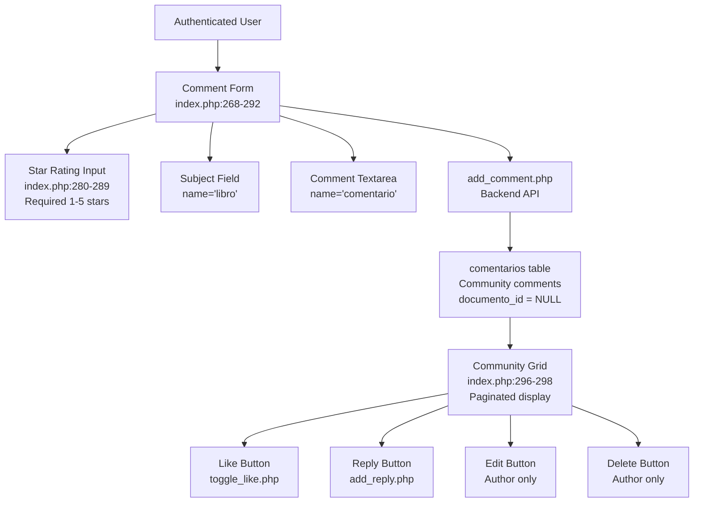

**Key characteristics:**

* **Subject field**: Users specify what they're commenting about (e.g., "Python para principiantes")
* **Star ratings**: Mandatory selection of 1-5 stars visualized with Font Awesome icons
* **Database identifier**: `documento_id` is NULL for community comments
* **Display location**: `#comunidad` section on `index.php`

**Sources:** [src/frontend/inicio/index.php L268-L292](https://github.com/axchisan/El-rincon-de-ADSO/blob/3e310227/src/frontend/inicio/index.php#L268-L292)

 [src/frontend/inicio/index.php L280-L289](https://github.com/axchisan/El-rincon-de-ADSO/blob/3e310227/src/frontend/inicio/index.php#L280-L289)

 [src/frontend/inicio/index.php L426-L465](https://github.com/axchisan/El-rincon-de-ADSO/blob/3e310227/src/frontend/inicio/index.php#L426-L465)

### Resource Comments

Resource comments are attached to specific educational resources (books, videos, documents) and appear on the resource viewer pages. These comments do not include star ratings and focus on feedback about the specific resource being viewed.

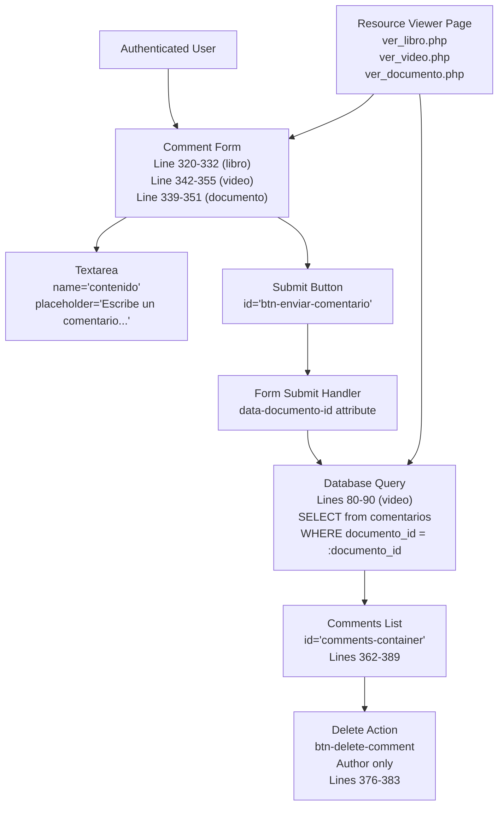

**Key characteristics:**

* **Resource association**: Each comment is linked to a specific `documento_id`
* **No ratings**: Star ratings are not used for resource comments
* **Direct display**: Comments load immediately with the resource page
* **Simple form**: Single textarea input with submit button

**Sources:** [src/frontend/repositorio/ver_video.php L80-L90](https://github.com/axchisan/El-rincon-de-ADSO/blob/3e310227/src/frontend/repositorio/ver_video.php#L80-L90)

 [src/frontend/repositorio/ver_video.php L337-L391](https://github.com/axchisan/El-rincon-de-ADSO/blob/3e310227/src/frontend/repositorio/ver_video.php#L337-L391)

 [src/frontend/repositorio/ver_libro.php L80-L90](https://github.com/axchisan/El-rincon-de-ADSO/blob/3e310227/src/frontend/repositorio/ver_libro.php#L80-L90)

 [src/frontend/repositorio/ver_documento.php L85-L95](https://github.com/axchisan/El-rincon-de-ADSO/blob/3e310227/src/frontend/repositorio/ver_documento.php#L85-L95)

## Features

### Star Ratings

Star ratings are exclusive to community comments and provide a 1-5 scale visual feedback mechanism using Font Awesome icons.

**Implementation details:**

| Component | Location | Description |
| --- | --- | --- |
| HTML Structure | [index.php L280-L289](https://github.com/axchisan/El-rincon-de-ADSO/blob/3e310227/index.php#L280-L289) | Five star spans with `data-value` attributes |
| Hidden Input | [index.php L282](https://github.com/axchisan/El-rincon-de-ADSO/blob/3e310227/index.php#L282-L282) | `<input type="hidden" name="valoracion" id="valoracion">` |
| Interactive Behavior | [index.php L377-L423](https://github.com/axchisan/El-rincon-de-ADSO/blob/3e310227/index.php#L377-L423) | Click, mouseover, and mouseout event listeners |
| Validation | [index.php L432-L436](https://github.com/axchisan/El-rincon-de-ADSO/blob/3e310227/index.php#L432-L436) | Ensures rating is between 1-5 before submission |

**Star rating interaction flow:**

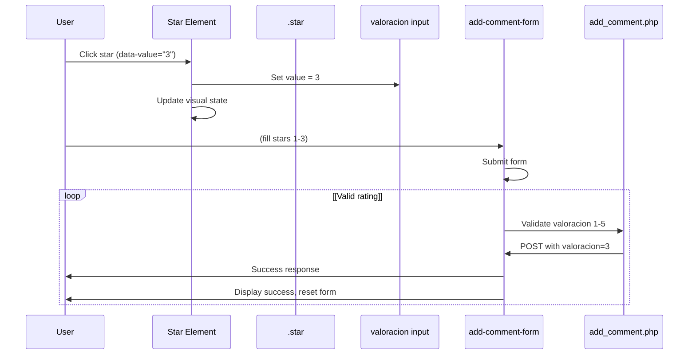

The star rating system uses CSS classes `far` (empty star) and `fas` (filled star) from Font Awesome to toggle visual states. Selected stars also receive a `.selected` class for state tracking.

**Sources:** [src/frontend/inicio/index.php L280-L289](https://github.com/axchisan/El-rincon-de-ADSO/blob/3e310227/src/frontend/inicio/index.php#L280-L289)

 [src/frontend/inicio/index.php L377-L423](https://github.com/axchisan/El-rincon-de-ADSO/blob/3e310227/src/frontend/inicio/index.php#L377-L423)

 [src/frontend/inicio/index.php L432-L436](https://github.com/axchisan/El-rincon-de-ADSO/blob/3e310227/src/frontend/inicio/index.php#L432-L436)

### Likes

The like system allows users to show appreciation for comments. Each comment displays a like count and button that toggles between liked and unliked states.

**Frontend implementation:**

```javascript
// Like button structure in comment cards
// Located in: index.php, lines 468-506
fetch('../../backend/comunidad/toggle_like.php', {
    method: 'POST',
    body: `comentario_id=${comentarioId}`
})
.then(response => response.json())
.then(data => {
    if (data.success) {
        // Update icon class: 'far' <-> 'fas'
        // Update button class: add/remove 'comment-card__like--active'
        // Update like count display
    }
})
```

**Like toggle flow:**

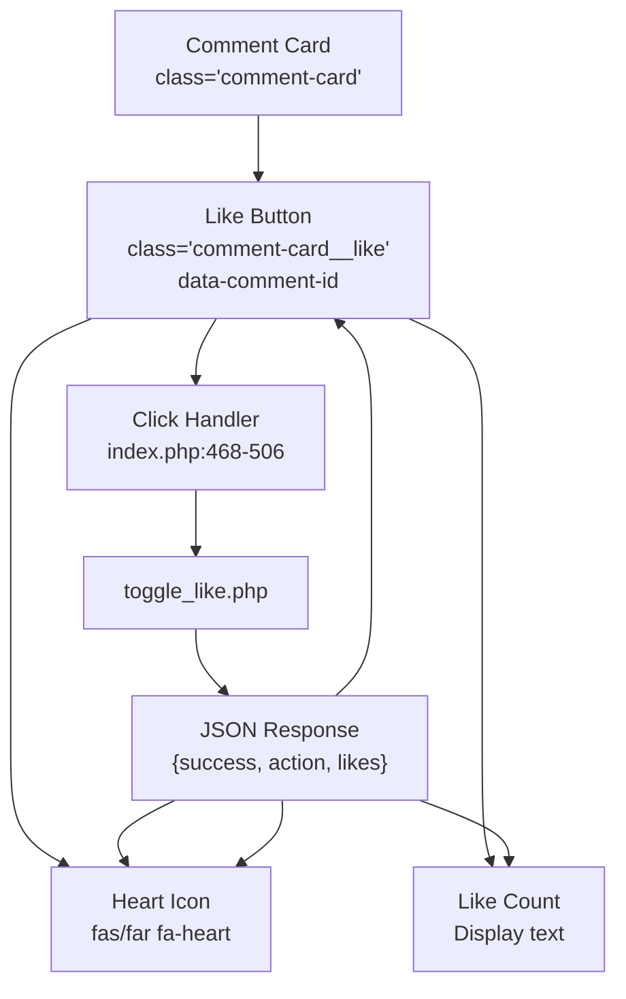

**Visual states:**

* **Unliked**: `<i class="far fa-heart"></i>` (outline heart)
* **Liked**: `<i class="fas fa-heart liked"></i>` (filled heart)
* **Active button**: `.comment-card__like--active` class added

**Sources:** [src/frontend/inicio/index.php L468-L506](https://github.com/axchisan/El-rincon-de-ADSO/blob/3e310227/src/frontend/inicio/index.php#L468-L506)

### Nested Replies

Comments support a one-level reply system where users can respond directly to existing comments. Replies are displayed beneath their parent comment.

**Reply structure:**

| Component | Purpose | Implementation |
| --- | --- | --- |
| Reply Button | Toggles reply form visibility | [index.php L509-L519](https://github.com/axchisan/El-rincon-de-ADSO/blob/3e310227/index.php#L509-L519) |
| Reply Form | Hidden form for each comment | `id="reply-form-{comment_id}"` |
| Submit Handler | Processes reply submission | [index.php L522-L554](https://github.com/axchisan/El-rincon-de-ADSO/blob/3e310227/index.php#L522-L554) |
| Backend API | `add_reply.php` | Receives `comentario_id` and `respuesta` |

**Reply interaction diagram:**

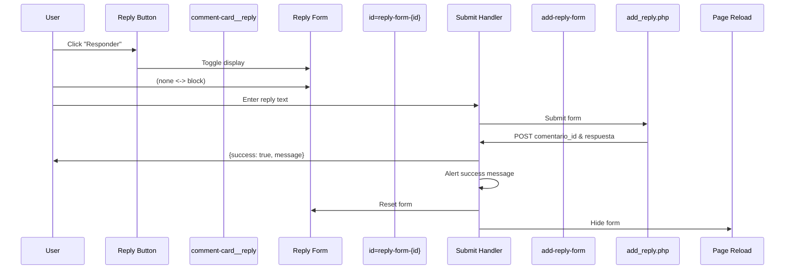

**Sources:** [src/frontend/inicio/index.php L509-L554](https://github.com/axchisan/El-rincon-de-ADSO/blob/3e310227/src/frontend/inicio/index.php#L509-L554)

### Edit and Delete

Users can edit or delete their own comments. These actions are restricted by author verification on both frontend display and backend processing.

**Access control:**

```python
// Displayed only if current user is comment author
// Example from ver_video.php:378-384
<?php if ($usuario_id == $comentario['autor_id']): ?>
<div class="comment__actions">
    <button class="btn-delete-comment" data-id="<?php echo $comentario['id']; ?>">
        <i class="fas fa-trash-alt"></i> Eliminar
    </button>
</div>
<?php endif; ?>
```

**Delete operation flow:**

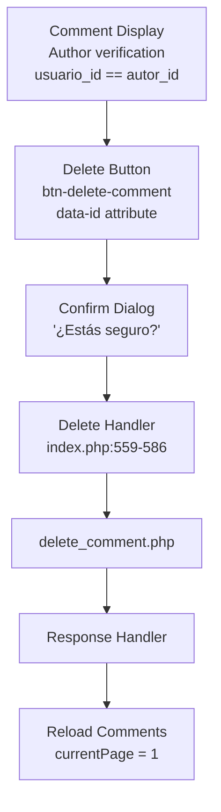

**Edit operation components:**

For community comments (index.php), the edit functionality creates an inline form:

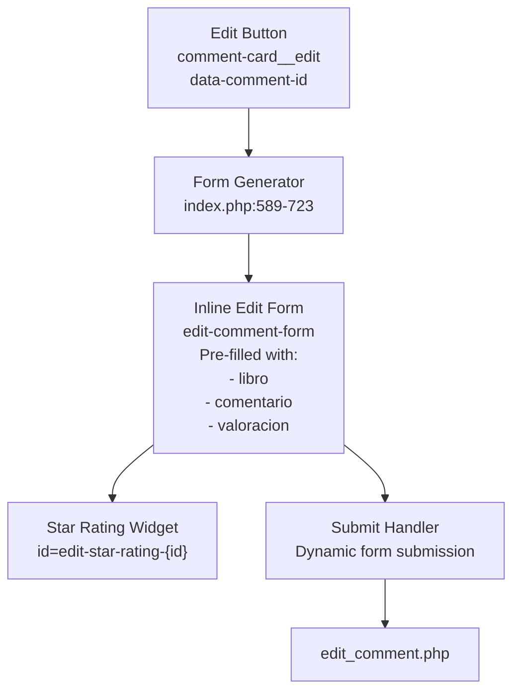

The edit form dynamically generates with pre-populated fields and includes the star rating widget for community comments.

**Sources:** [src/frontend/inicio/index.php L559-L586](https://github.com/axchisan/El-rincon-de-ADSO/blob/3e310227/src/frontend/inicio/index.php#L559-L586)

 (delete), [src/frontend/inicio/index.php L589-L723](https://github.com/axchisan/El-rincon-de-ADSO/blob/3e310227/src/frontend/inicio/index.php#L589-L723)

 (edit), [src/frontend/repositorio/ver_video.php L378-L384](https://github.com/axchisan/El-rincon-de-ADSO/blob/3e310227/src/frontend/repositorio/ver_video.php#L378-L384)

## Frontend Implementation

### Community Comments Section

The community comments section on `index.php` provides a comprehensive interface for viewing and interacting with general community discussions.

**Section structure:**

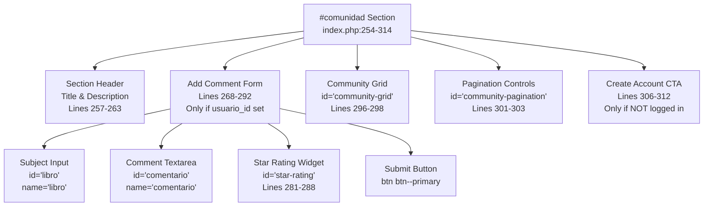

**JavaScript initialization:**

The page includes extensive JavaScript for comment functionality:

| Function | Lines | Purpose |
| --- | --- | --- |
| `attachLikeButtonListeners()` | 468-506 | Binds click handlers to like buttons |
| `attachReplyButtonListeners()` | 509-519 | Toggles reply form visibility |
| `attachReplyFormListeners()` | 522-554 | Handles reply form submission |
| `attachEditDeleteListeners()` | 557-723 | Manages edit and delete operations |
| `loadCommunityComments()` | Referenced | Fetches and renders comment data |

**Sources:** [src/frontend/inicio/index.php L254-L314](https://github.com/axchisan/El-rincon-de-ADSO/blob/3e310227/src/frontend/inicio/index.php#L254-L314)

 [src/frontend/inicio/index.php L468-L723](https://github.com/axchisan/El-rincon-de-ADSO/blob/3e310227/src/frontend/inicio/index.php#L468-L723)

### Resource Comments Section

Resource viewer pages include a simpler comments section focused on feedback about the specific resource being viewed.

**Component hierarchy:**

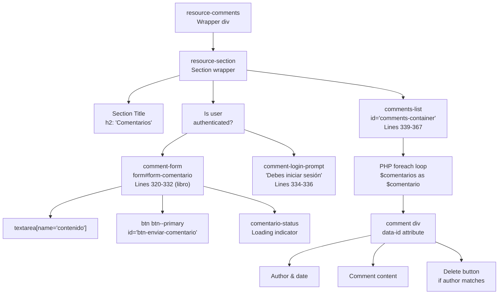

**Key differences from community comments:**

* No star rating system
* Simpler form with single textarea
* Comments loaded directly from database query (no AJAX initially)
* Only delete action available (no edit, like, or reply shown in these files)
* `data-documento-id` attribute links form to resource

**Database query for resource comments:**

```python
-- Example from ver_video.php:80-90
SELECT c.*, u.nombre_usuario
FROM comentarios c
JOIN usuarios u ON c.autor_id = u.id
WHERE c.documento_id = :documento_id
ORDER BY c.fecha_creacion DESC
```

**Sources:** [src/frontend/repositorio/ver_video.php L337-L391](https://github.com/axchisan/El-rincon-de-ADSO/blob/3e310227/src/frontend/repositorio/ver_video.php#L337-L391)

 [src/frontend/repositorio/ver_libro.php L314-L368](https://github.com/axchisan/El-rincon-de-ADSO/blob/3e310227/src/frontend/repositorio/ver_libro.php#L314-L368)

 [src/frontend/repositorio/ver_documento.php L333-L387](https://github.com/axchisan/El-rincon-de-ADSO/blob/3e310227/src/frontend/repositorio/ver_documento.php#L333-L387)

## Backend APIs

The comments system relies on several backend API endpoints located in the `src/backend/comunidad/` directory.

**API Endpoints:**

| Endpoint | Method | Parameters | Purpose | References |
| --- | --- | --- | --- | --- |
| `add_comment.php` | POST | `libro`, `comentario`, `valoracion` | Create new community comment | [index.php L438-L464](https://github.com/axchisan/El-rincon-de-ADSO/blob/3e310227/index.php#L438-L464) |
| `toggle_like.php` | POST | `comentario_id` | Toggle like on comment | [index.php L475-L503](https://github.com/axchisan/El-rincon-de-ADSO/blob/3e310227/index.php#L475-L503) |
| `add_reply.php` | POST | `comentario_id`, `respuesta` | Add reply to comment | [index.php L529-L551](https://github.com/axchisan/El-rincon-de-ADSO/blob/3e310227/index.php#L529-L551) |
| `delete_comment.php` | POST | `comentario_id` | Delete comment (author only) | [index.php L563-L583](https://github.com/axchisan/El-rincon-de-ADSO/blob/3e310227/index.php#L563-L583) |
| `edit_comment.php` | POST | `comentario_id`, `libro`, `comentario`, `valoracion` | Edit comment (author only) | [index.php L658-L705](https://github.com/axchisan/El-rincon-de-ADSO/blob/3e310227/index.php#L658-L705) |

**API Response format:**

All APIs return JSON responses with consistent structure:

```
{
  "success": true/false,
  "message": "Descriptive message",
  "data": {
    // Additional data (e.g., likes count, action type)
  }
}
```

**API interaction pattern:**

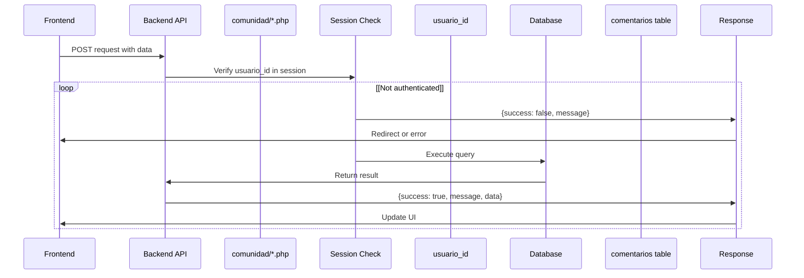

**Error handling:**

Frontend code consistently uses try-catch blocks and checks for `data.success`:

```javascript
// Pattern from index.php:438-464
fetch(endpoint, {
    method: 'POST',
    body: formData
})
.then(response => response.json())
.then(data => {
    if (data.success) {
        alert(data.message);
        // Update UI, reset form, reload comments
    } else {
        alert(data.message);
    }
})
.catch(error => {
    console.error('Error:', error);
    alert('Error message...');
});
```

**Sources:** [src/frontend/inicio/index.php L438-L464](https://github.com/axchisan/El-rincon-de-ADSO/blob/3e310227/src/frontend/inicio/index.php#L438-L464)

 [src/frontend/inicio/index.php L475-L503](https://github.com/axchisan/El-rincon-de-ADSO/blob/3e310227/src/frontend/inicio/index.php#L475-L503)

 [src/frontend/inicio/index.php L529-L551](https://github.com/axchisan/El-rincon-de-ADSO/blob/3e310227/src/frontend/inicio/index.php#L529-L551)

 [src/frontend/inicio/index.php L563-L583](https://github.com/axchisan/El-rincon-de-ADSO/blob/3e310227/src/frontend/inicio/index.php#L563-L583)

## User Permissions and Access Control

The comments system implements multiple layers of access control to ensure users can only perform authorized actions.

**Permission matrix:**

| Action | Anonymous User | Authenticated User | Comment Author |
| --- | --- | --- | --- |
| View comments | ✓ | ✓ | ✓ |
| Add comment | ✗ | ✓ | ✓ |
| Like comment | ✗ | ✓ | ✓ |
| Reply to comment | ✗ | ✓ | ✓ |
| Edit comment | ✗ | ✗ | ✓ (own only) |
| Delete comment | ✗ | ✗ | ✓ (own only) |

**Authentication checks:**

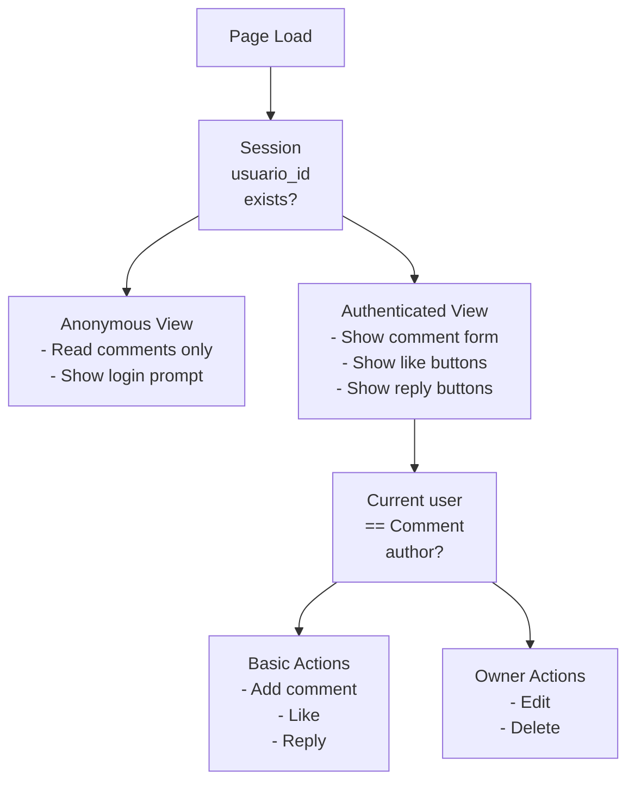

**Frontend conditional rendering:**

```php
// Authentication check - index.php:267
<?php if ($usuario_id): ?>
    <!-- Comment form displayed -->
<?php endif; ?>

// Author verification - ver_video.php:378
<?php if ($usuario_id == $comentario['autor_id']): ?>
    <!-- Edit/delete buttons displayed -->
<?php endif; ?>
```

**Backend verification (typical pattern):**

```javascript
// Session validation
session_start();
if (!isset($_SESSION['usuario_id'])) {
    echo json_encode(['success' => false, 'message' => 'Debes iniciar sesión']);
    exit();
}

// Author verification for edit/delete
$query = "SELECT autor_id FROM comentarios WHERE id = :id";
$stmt = $db->prepare($query);
$stmt->execute([':id' => $comentario_id]);
$comment = $stmt->fetch(PDO::FETCH_ASSOC);

if ($comment['autor_id'] != $_SESSION['usuario_id']) {
    echo json_encode(['success' => false, 'message' => 'No autorizado']);
    exit();
}
```

**Sources:** [src/frontend/inicio/index.php L267](https://github.com/axchisan/El-rincon-de-ADSO/blob/3e310227/src/frontend/inicio/index.php#L267-L267)

 [src/frontend/repositorio/ver_video.php L378](https://github.com/axchisan/El-rincon-de-ADSO/blob/3e310227/src/frontend/repositorio/ver_video.php#L378-L378)

 [src/frontend/repositorio/ver_video.php L342](https://github.com/axchisan/El-rincon-de-ADSO/blob/3e310227/src/frontend/repositorio/ver_video.php#L342-L342)

## Data Flow Diagrams

### Complete Comment Lifecycle

This diagram shows the full lifecycle of a comment from creation to deletion:

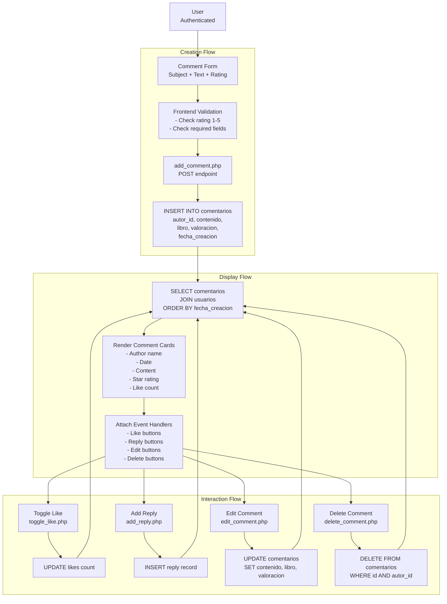

**Sources:** [src/frontend/inicio/index.php L268-L723](https://github.com/axchisan/El-rincon-de-ADSO/blob/3e310227/src/frontend/inicio/index.php#L268-L723)

 [src/frontend/repositorio/ver_video.php L80-L391](https://github.com/axchisan/El-rincon-de-ADSO/blob/3e310227/src/frontend/repositorio/ver_video.php#L80-L391)

### Resource Comment Integration

This diagram shows how comments integrate with the resource viewing system:

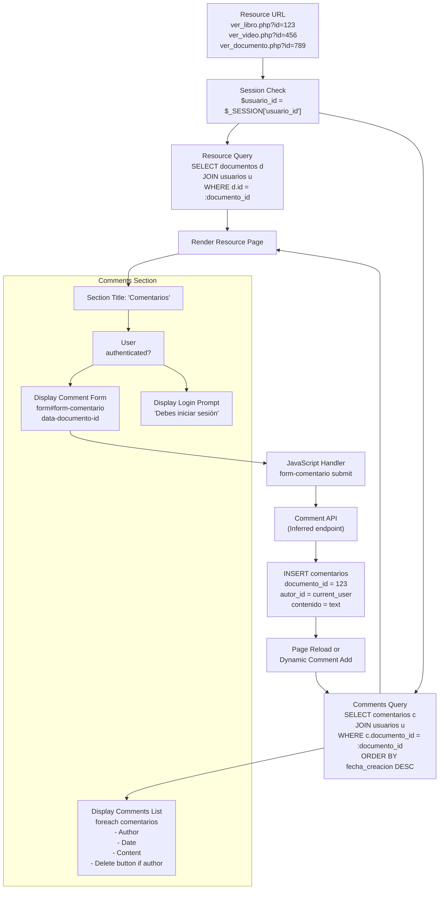

**Sources:** [src/frontend/repositorio/ver_libro.php L1-L368](https://github.com/axchisan/El-rincon-de-ADSO/blob/3e310227/src/frontend/repositorio/ver_libro.php#L1-L368)

 [src/frontend/repositorio/ver_video.php L1-L391](https://github.com/axchisan/El-rincon-de-ADSO/blob/3e310227/src/frontend/repositorio/ver_video.php#L1-L391)

 [src/frontend/repositorio/ver_documento.php L1-L387](https://github.com/axchisan/El-rincon-de-ADSO/blob/3e310227/src/frontend/repositorio/ver_documento.php#L1-L387)