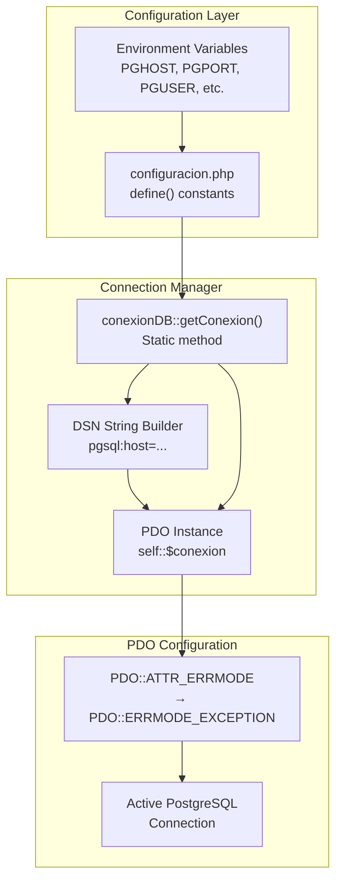
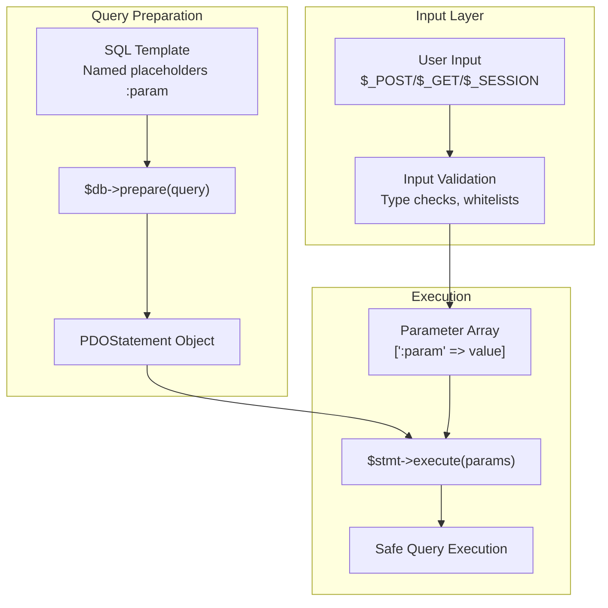
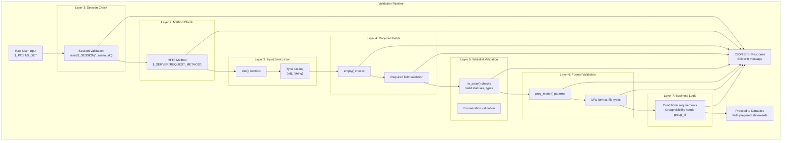
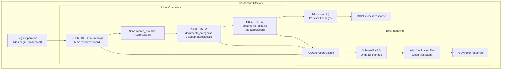
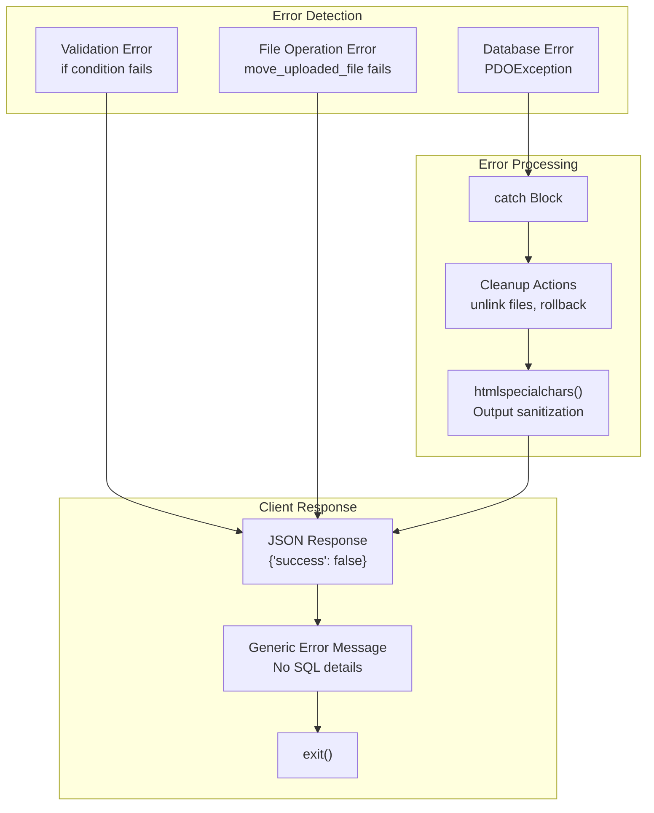
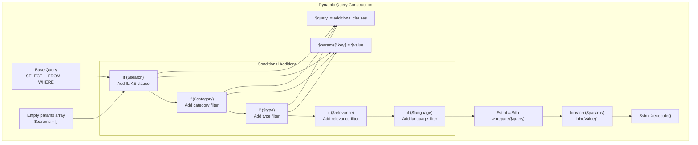

# Data Validation and SQL Security

> **Relevant source files**
> * [src/backend/gestionRecursos/get_recent_resources.php](https://github.com/axchisan/El-rincon-de-ADSO/blob/3e310227/src/backend/gestionRecursos/get_recent_resources.php)
> * [src/backend/gestionRecursos/upload_resource.php](https://github.com/axchisan/El-rincon-de-ADSO/blob/3e310227/src/backend/gestionRecursos/upload_resource.php)
> * [src/database/conexionDB.php](https://github.com/axchisan/El-rincon-de-ADSO/blob/3e310227/src/database/conexionDB.php)
> * [src/database/configuracion.php](https://github.com/axchisan/El-rincon-de-ADSO/blob/3e310227/src/database/configuracion.php)

## Purpose and Scope

This document details the security mechanisms implemented throughout the El Rincón de ADSO codebase to prevent SQL injection attacks and ensure data integrity through comprehensive input validation. The system employs PDO prepared statements as the primary defense against SQL injection, combined with multi-layered validation patterns for all user inputs.

For authentication-specific security measures including session management and password hashing, see [Authentication and Authorization](/axchisan/El-rincon-de-ADSO/11.1-authentication-and-authorization). For file upload security including type validation and size limits, see [File Upload Security](/axchisan/El-rincon-de-ADSO/11.3-file-upload-security).

---

## SQL Injection Prevention Architecture

The application uses a defense-in-depth approach to SQL security, with PDO prepared statements as the foundational layer and input validation as a complementary safeguard.

### Database Connection Layer

The `conexionDB` class implements a singleton pattern that establishes a secure PDO connection with exception mode enabled:



The connection manager [src/database/conexionDB.php L7-L26](https://github.com/axchisan/El-rincon-de-ADSO/blob/3e310227/src/database/conexionDB.php#L7-L26)

 ensures:

* Single database connection per request (singleton pattern)
* Exception-based error handling for all database errors
* Centralized connection configuration

**Sources:** [src/database/conexionDB.php L1-L28](https://github.com/axchisan/El-rincon-de-ADSO/blob/3e310227/src/database/conexionDB.php#L1-L28)

 [src/database/configuracion.php L1-L9](https://github.com/axchisan/El-rincon-de-ADSO/blob/3e310227/src/database/configuracion.php#L1-L9)

---

### Prepared Statement Implementation

All database queries in the system use PDO prepared statements with named parameter binding. This architecture completely separates SQL logic from user data:



**Key Implementation Pattern:**

The system consistently follows this pattern across all database operations:

| Step | Implementation | Example Location |
| --- | --- | --- |
| 1. SQL Template | Query with named placeholders | [src/backend/gestionRecursos/upload_resource.php L161-L162](https://github.com/axchisan/El-rincon-de-ADSO/blob/3e310227/src/backend/gestionRecursos/upload_resource.php#L161-L162) |
| 2. Prepare Statement | `$stmt = $db->prepare($query)` | [src/backend/gestionRecursos/upload_resource.php L163](https://github.com/axchisan/El-rincon-de-ADSO/blob/3e310227/src/backend/gestionRecursos/upload_resource.php#L163-L163) |
| 3. Execute with Array | `$stmt->execute([':param' => $value])` | [src/backend/gestionRecursos/upload_resource.php L164-L180](https://github.com/axchisan/El-rincon-de-ADSO/blob/3e310227/src/backend/gestionRecursos/upload_resource.php#L164-L180) |

**Sources:** [src/backend/gestionRecursos/upload_resource.php L156-L217](https://github.com/axchisan/El-rincon-de-ADSO/blob/3e310227/src/backend/gestionRecursos/upload_resource.php#L156-L217)

 [src/backend/gestionRecursos/get_recent_resources.php L26-L89](https://github.com/axchisan/El-rincon-de-ADSO/blob/3e310227/src/backend/gestionRecursos/get_recent_resources.php#L26-L89)

---

### Parameter Binding Patterns

The codebase demonstrates multiple parameter binding techniques depending on the query complexity:

#### Simple Named Parameter Binding

Used for straightforward queries with a small number of parameters [src/backend/gestionRecursos/upload_resource.php L192-L194](https://github.com/axchisan/El-rincon-de-ADSO/blob/3e310227/src/backend/gestionRecursos/upload_resource.php#L192-L194)

:

```javascript
$query = "SELECT id FROM etiquetas WHERE nombre = :nombre";
$stmt = $db->prepare($query);
$stmt->execute([':nombre' => $tag_name]);
```

#### Complex Multi-Parameter Binding

Used for INSERT operations with many fields [src/backend/gestionRecursos/upload_resource.php L161-L180](https://github.com/axchisan/El-rincon-de-ADSO/blob/3e310227/src/backend/gestionRecursos/upload_resource.php#L161-L180)

:

```javascript
$stmt->execute([
    ':titulo' => $title,
    ':descripcion' => $description ?: null,
    ':autor' => $author,
    ':tipo' => $resource_type,
    // ... 11+ more parameters
]);
```

#### Dynamic Parameter Building

Used when query conditions vary based on user input [src/backend/gestionRecursos/get_recent_resources.php L41-L80](https://github.com/axchisan/El-rincon-de-ADSO/blob/3e310227/src/backend/gestionRecursos/get_recent_resources.php#L41-L80)

:

```javascript
$params = [];

if ($search) {
    $query .= " AND (d.titulo ILIKE :search ...)";
    $params[':search'] = $search;
}

if ($category) {
    $query .= " AND dc.categoria_id = :category";
    $params[':category'] = $category;
}

// Later: bind all accumulated parameters
foreach ($params as $key => $value) {
    $stmt->bindValue($key, $value);
}
```

#### Type-Specific Binding

For integer limits and other typed parameters [src/backend/gestionRecursos/get_recent_resources.php L84](https://github.com/axchisan/El-rincon-de-ADSO/blob/3e310227/src/backend/gestionRecursos/get_recent_resources.php#L84-L84)

:

```
$stmt->bindValue(':limit', $limit, PDO::PARAM_INT);
```

**Sources:** [src/backend/gestionRecursos/upload_resource.php L161-L208](https://github.com/axchisan/El-rincon-de-ADSO/blob/3e310227/src/backend/gestionRecursos/upload_resource.php#L161-L208)

 [src/backend/gestionRecursos/get_recent_resources.php L83-L87](https://github.com/axchisan/El-rincon-de-ADSO/blob/3e310227/src/backend/gestionRecursos/get_recent_resources.php#L83-L87)

---

## Input Validation Patterns

All user input undergoes validation before being used in database operations. The system implements multiple validation layers:



**Sources:** [src/backend/gestionRecursos/upload_resource.php L1-L154](https://github.com/axchisan/El-rincon-de-ADSO/blob/3e310227/src/backend/gestionRecursos/upload_resource.php#L1-L154)

---

### Validation Layer Details

#### Layer 1: Session Validation

Ensures user authentication before processing requests [src/backend/gestionRecursos/upload_resource.php L7-L10](https://github.com/axchisan/El-rincon-de-ADSO/blob/3e310227/src/backend/gestionRecursos/upload_resource.php#L7-L10)

:

```javascript
if (!isset($_SESSION['usuario_id'])) {
    echo json_encode(['success' => false, 'message' => 'Debes iniciar sesión...']);
    exit;
}
```

#### Layer 2: HTTP Method Validation

Enforces correct HTTP verbs for operations [src/backend/gestionRecursos/upload_resource.php L12-L15](https://github.com/axchisan/El-rincon-de-ADSO/blob/3e310227/src/backend/gestionRecursos/upload_resource.php#L12-L15)

:

```javascript
if ($_SERVER['REQUEST_METHOD'] !== 'POST') {
    echo json_encode(['success' => false, 'message' => 'Método no permitido.']);
    exit;
}
```

#### Layer 3: Input Sanitization

Removes whitespace and ensures proper data types [src/backend/gestionRecursos/upload_resource.php L17-L32](https://github.com/axchisan/El-rincon-de-ADSO/blob/3e310227/src/backend/gestionRecursos/upload_resource.php#L17-L32)

:

| Input Source | Sanitization | Purpose |
| --- | --- | --- |
| `$_POST['title']` | `trim()` | Remove leading/trailing whitespace |
| `$_POST['categories']` | `json_decode(..., true)` | Parse JSON to array |
| `$_GET['limit']` | `(int)$_GET['limit']` | Type cast to integer |
| `$_POST['tags']` | `json_decode(..., true)` | Parse JSON array |

#### Layer 4: Required Field Validation

Ensures all mandatory fields are present [src/backend/gestionRecursos/upload_resource.php L51-L54](https://github.com/axchisan/El-rincon-de-ADSO/blob/3e310227/src/backend/gestionRecursos/upload_resource.php#L51-L54)

:

```javascript
if (empty($title) || empty($author) || empty($resource_type) || 
    empty($categories) || empty($relevance) || empty($visibility) || 
    empty($language) || empty($license) || empty($status)) {
    echo json_encode(['success' => false, 'message' => 'Todos los campos obligatorios...']);
    exit;
}
```

#### Layer 5: Whitelist Validation

Validates against predefined allowed values [src/backend/gestionRecursos/upload_resource.php L34-L49](https://github.com/axchisan/El-rincon-de-ADSO/blob/3e310227/src/backend/gestionRecursos/upload_resource.php#L34-L49)

:

```javascript
$valid_statuses = ['Draft', 'Pending Review', 'Published'];
$status = $status_map[$status] ?? $status;

if (!in_array($status, $valid_statuses)) {
    echo json_encode([
        'success' => false,
        'message' => 'Estado no válido: ' . htmlspecialchars($status) . '...'
    ]);
    exit;
}
```

**Whitelist Categories:**

| Field | Valid Values | Location |
| --- | --- | --- |
| `status` | Draft, Pending Review, Published | [upload_resource.php L35](https://github.com/axchisan/El-rincon-de-ADSO/blob/3e310227/upload_resource.php#L35-L35) |
| Image types | image/jpeg, image/png, image/gif | [upload_resource.php L67](https://github.com/axchisan/El-rincon-de-ADSO/blob/3e310227/upload_resource.php#L67-L67) |
| File types | PDF, DOC, DOCX, PPT, PPTX, images | [upload_resource.php L118-L127](https://github.com/axchisan/El-rincon-de-ADSO/blob/3e310227/upload_resource.php#L118-L127) |

#### Layer 6: Format Validation

Uses regular expressions for complex format validation [src/backend/gestionRecursos/upload_resource.php L104-L109](https://github.com/axchisan/El-rincon-de-ADSO/blob/3e310227/src/backend/gestionRecursos/upload_resource.php#L104-L109)

:

```javascript
$youtube_regex = '/^(https?:\/\/)?(www\.)?(youtube\.com|youtu\.be)\/(watch\?v=)?([a-zA-Z0-9_-]{11})/';
if (!preg_match($youtube_regex, $video_url)) {
    unlink($image_path);
    echo json_encode(['success' => false, 'message' => 'La URL del video no es válida...']);
    exit;
}
```

#### Layer 7: Business Logic Validation

Enforces domain-specific rules [src/backend/gestionRecursos/upload_resource.php L56-L59](https://github.com/axchisan/El-rincon-de-ADSO/blob/3e310227/src/backend/gestionRecursos/upload_resource.php#L56-L59)

:

```javascript
if ($visibility === 'Group' && empty($group_id)) {
    echo json_encode(['success' => false, 'message' => 'Debes seleccionar un grupo...']);
    exit;
}
```

**Sources:** [src/backend/gestionRecursos/upload_resource.php L7-L154](https://github.com/axchisan/El-rincon-de-ADSO/blob/3e310227/src/backend/gestionRecursos/upload_resource.php#L7-L154)

---

## Transaction Management and Rollback

The system uses PostgreSQL transactions to maintain data consistency during multi-table operations:



### Transaction Implementation

The `upload_resource.php` file demonstrates the complete transaction pattern [src/backend/gestionRecursos/upload_resource.php L156-L217](https://github.com/axchisan/El-rincon-de-ADSO/blob/3e310227/src/backend/gestionRecursos/upload_resource.php#L156-L217)

:

**Transaction Start:**

```
$db = conexionDB::getConexion();
$db->beginTransaction();
```

**Sequential Operations:**

1. **Main resource insert** [upload_resource.php L161-L180](https://github.com/axchisan/El-rincon-de-ADSO/blob/3e310227/upload_resource.php#L161-L180) : Inserts into `documentos` table
2. **Retrieve new ID** [upload_resource.php L182](https://github.com/axchisan/El-rincon-de-ADSO/blob/3e310227/upload_resource.php#L182-L182) : `$documento_id = $db->lastInsertId()`
3. **Category associations** [upload_resource.php L184-L188](https://github.com/axchisan/El-rincon-de-ADSO/blob/3e310227/upload_resource.php#L184-L188) : Loop inserting into `documento_categorias`
4. **Tag associations** [upload_resource.php L190-L208](https://github.com/axchisan/El-rincon-de-ADSO/blob/3e310227/upload_resource.php#L190-L208) : Loop with tag existence check and insert

**Transaction Commit:**

```javascript
$db->commit();
echo json_encode(['success' => true, 'message' => 'Recurso subido exitosamente.']);
```

**Rollback on Error:**

```javascript
catch (PDOException $e) {
    $db->rollBack();
    if (file_exists($image_path)) unlink($image_path);
    if (isset($file_path) && file_exists($file_path)) unlink($file_path);
    echo json_encode(['success' => false, 'message' => 'Error al guardar...']);
}
```

### Atomicity Guarantees

| Operation Type | Atomicity Guarantee |
| --- | --- |
| Resource upload with categories | All-or-nothing: document + categories + tags |
| File cleanup on error | Uploaded files deleted if database insert fails |
| Foreign key relationships | Transaction ensures referential integrity |

**Sources:** [src/backend/gestionRecursos/upload_resource.php L156-L217](https://github.com/axchisan/El-rincon-de-ADSO/blob/3e310227/src/backend/gestionRecursos/upload_resource.php#L156-L217)

---

## Error Handling and Security

The system implements defensive error handling that prevents information leakage while logging sufficient detail for debugging:

### Exception Mode Configuration

PDO is configured to throw exceptions rather than returning error codes [src/database/conexionDB.php L20](https://github.com/axchisan/El-rincon-de-ADSO/blob/3e310227/src/database/conexionDB.php#L20-L20)

:

```
self::$conexion->setAttribute(PDO::ATTR_ERRMODE, PDO::ERRMODE_EXCEPTION);
```

This ensures:

* All database errors are caught and handled explicitly
* No silent failures that could compromise security
* Consistent error handling across the application

### Error Response Pattern



### Error Response Examples

**Validation Errors:**

```json
{
    "success": false,
    "message": "Todos los campos obligatorios deben estar completos."
}
```

**Database Errors:**

```json
{
    "success": false,
    "message": "Error al guardar en la base de datos: [sanitized message]"
}
```

**Authentication Errors:**

```json
{
    "success": false,
    "message": "Debes iniciar sesión para subir un recurso."
}
```

### Security Considerations

| Security Measure | Implementation | Purpose |
| --- | --- | --- |
| Output sanitization | `htmlspecialchars($status)` [upload_resource.php L46](https://github.com/axchisan/El-rincon-de-ADSO/blob/3e310227/upload_resource.php#L46-L46) | Prevent XSS in error messages |
| Generic messages | User-friendly text, not SQL details | Prevent information disclosure |
| Exception catching | `catch (PDOException $e)` [upload_resource.php L212](https://github.com/axchisan/El-rincon-de-ADSO/blob/3e310227/upload_resource.php#L212-L212) | Prevent stack traces in production |
| Exit after error | `exit;` after all error responses | Prevent further code execution |

**Sources:** [src/database/conexionDB.php L20-L23](https://github.com/axchisan/El-rincon-de-ADSO/blob/3e310227/src/database/conexionDB.php#L20-L23)

 [src/backend/gestionRecursos/upload_resource.php L212-L217](https://github.com/axchisan/El-rincon-de-ADSO/blob/3e310227/src/backend/gestionRecursos/upload_resource.php#L212-L217)

---

## Query Security Patterns Reference

### Safe Dynamic Query Building

When building queries dynamically based on user input, the system accumulates both query fragments and parameters separately [src/backend/gestionRecursos/get_recent_resources.php L41-L80](https://github.com/axchisan/El-rincon-de-ADSO/blob/3e310227/src/backend/gestionRecursos/get_recent_resources.php#L41-L80)

:



**Key Pattern:**

1. Start with base query and empty params array
2. For each optional filter, append to query AND add to params
3. Never concatenate user input directly into SQL
4. Bind all accumulated parameters before execution

### ILIKE for Case-Insensitive Search

PostgreSQL-specific case-insensitive pattern matching [src/backend/gestionRecursos/get_recent_resources.php L58](https://github.com/axchisan/El-rincon-de-ADSO/blob/3e310227/src/backend/gestionRecursos/get_recent_resources.php#L58-L58)

:

```
if ($search) {
    $query .= " AND (d.titulo ILIKE :search OR d.descripcion ILIKE :search OR d.autor ILIKE :search)";
    $params[':search'] = $search;
}
```

The `ILIKE` operator provides case-insensitive matching while the search term is safely parameterized.

### Array Parameter Handling

For PostgreSQL array types [src/backend/gestionRecursos/get_recent_resources.php L48-L51](https://github.com/axchisan/El-rincon-de-ADSO/blob/3e310227/src/backend/gestionRecursos/get_recent_resources.php#L48-L51)

:

```
$params[':usuario_id'] = $usuario_id;
$params[':grupos'] = '{' . implode(',', $user_groups) . '}';
```

The `ANY()` operator with PostgreSQL array syntax allows checking membership in a list of group IDs while maintaining parameterization.

**Sources:** [src/backend/gestionRecursos/get_recent_resources.php L26-L89](https://github.com/axchisan/El-rincon-de-ADSO/blob/3e310227/src/backend/gestionRecursos/get_recent_resources.php#L26-L89)

---

## Validation Security Matrix

The following matrix summarizes validation rules and their security implications:

| Input Type | Validation Method | Security Benefit | Example Location |
| --- | --- | --- | --- |
| Session ID | `isset($_SESSION['usuario_id'])` | Prevents unauthorized access | [upload_resource.php L7](https://github.com/axchisan/El-rincon-de-ADSO/blob/3e310227/upload_resource.php#L7-L7) |
| HTTP Method | `$_SERVER['REQUEST_METHOD'] !== 'POST'` | Prevents CSRF via GET | [upload_resource.php L12](https://github.com/axchisan/El-rincon-de-ADSO/blob/3e310227/upload_resource.php#L12-L12) |
| String inputs | `trim()` + `empty()` | Prevents empty/whitespace attacks | [upload_resource.php L17-L19](https://github.com/axchisan/El-rincon-de-ADSO/blob/3e310227/upload_resource.php#L17-L19) |
| Enumerated values | `in_array($value, $whitelist)` | Prevents invalid state injection | [upload_resource.php L43](https://github.com/axchisan/El-rincon-de-ADSO/blob/3e310227/upload_resource.php#L43-L43) |
| Integer IDs | `(int)$_GET['limit']` | Type safety, prevents SQL type confusion | [get_recent_resources.php L19](https://github.com/axchisan/El-rincon-de-ADSO/blob/3e310227/get_recent_resources.php#L19-L19) |
| URLs | `preg_match($regex, $url)` | Prevents malicious URL injection | [upload_resource.php L104-L109](https://github.com/axchisan/El-rincon-de-ADSO/blob/3e310227/upload_resource.php#L104-L109) |
| File MIME types | `in_array($file['type'], $allowed)` | Prevents malicious file uploads | [upload_resource.php L71](https://github.com/axchisan/El-rincon-de-ADSO/blob/3e310227/upload_resource.php#L71-L71) |
| File sizes | `$file['size'] > $max_size` | Prevents DoS via large uploads | [upload_resource.php L76](https://github.com/axchisan/El-rincon-de-ADSO/blob/3e310227/upload_resource.php#L76-L76) |
| JSON arrays | `json_decode(..., true)` | Safe array parsing | [upload_resource.php L23-L24](https://github.com/axchisan/El-rincon-de-ADSO/blob/3e310227/upload_resource.php#L23-L24) |
| Output display | `htmlspecialchars()` | Prevents XSS in error messages | [upload_resource.php L46](https://github.com/axchisan/El-rincon-de-ADSO/blob/3e310227/upload_resource.php#L46-L46) |

---

## Best Practices Summary

The El Rincón de ADSO codebase demonstrates the following SQL security best practices:

### ✓ Always Used

* **Prepared Statements**: 100% of database queries use PDO prepared statements
* **Named Parameters**: All parameter binding uses named placeholders (`:param`)
* **Exception Mode**: PDO configured with `ERRMODE_EXCEPTION`
* **Singleton Pattern**: Single database connection per request
* **Transaction Management**: Multi-table operations wrapped in transactions
* **Input Validation**: Multiple validation layers before database operations
* **Whitelist Validation**: Enumerated values checked against predefined lists
* **Type Casting**: Numeric inputs explicitly cast to integers
* **Output Sanitization**: User-controlled strings sanitized with `htmlspecialchars()`

### ✓ Security Controls

| Control | Implementation | Effectiveness |
| --- | --- | --- |
| SQL Injection Prevention | PDO prepared statements | **Critical** - Complete separation of code/data |
| Session Hijacking Prevention | `session_start()` on every page | **High** - Validates user authentication |
| XSS Prevention | `htmlspecialchars()` on output | **High** - Escapes HTML entities |
| CSRF Prevention | POST method validation | **Medium** - Requires tokens for full protection |
| DoS Prevention | File size limits | **Medium** - Prevents resource exhaustion |
| Information Disclosure | Generic error messages | **High** - Prevents SQL structure leakage |

### Code Review Checklist

When adding new database operations, verify:

1. ✓ Query uses `$db->prepare()` with named placeholders
2. ✓ User input never concatenated directly into SQL
3. ✓ All parameters bound with `execute([':param' => $value])`
4. ✓ Session validation at file start
5. ✓ Input validation before database operations
6. ✓ Transactions used for multi-table operations
7. ✓ Rollback and cleanup on errors
8. ✓ Generic error messages returned to client
9. ✓ Integer parameters cast with `(int)` or `PDO::PARAM_INT`
10. ✓ Output sanitized with `htmlspecialchars()` when needed

**Sources:** [src/database/conexionDB.php L1-L28](https://github.com/axchisan/El-rincon-de-ADSO/blob/3e310227/src/database/conexionDB.php#L1-L28)

 [src/backend/gestionRecursos/upload_resource.php L1-L217](https://github.com/axchisan/El-rincon-de-ADSO/blob/3e310227/src/backend/gestionRecursos/upload_resource.php#L1-L217)

 [src/backend/gestionRecursos/get_recent_resources.php L1-L123](https://github.com/axchisan/El-rincon-de-ADSO/blob/3e310227/src/backend/gestionRecursos/get_recent_resources.php#L1-L123)