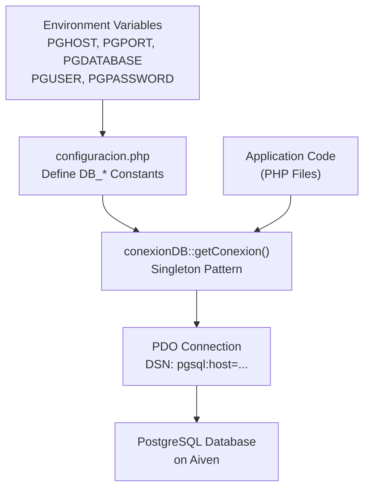

# Database Schema

> **Relevant source files**
> * [src/backend/gestionRecursos/get_recent_resources.php](https://github.com/axchisan/El-rincon-de-ADSO/blob/3e310227/src/backend/gestionRecursos/get_recent_resources.php)
> * [src/backend/gestionRecursos/upload_resource.php](https://github.com/axchisan/El-rincon-de-ADSO/blob/3e310227/src/backend/gestionRecursos/upload_resource.php)
> * [src/database/conexionDB.php](https://github.com/axchisan/El-rincon-de-ADSO/blob/3e310227/src/database/conexionDB.php)
> * [src/database/configuracion.php](https://github.com/axchisan/El-rincon-de-ADSO/blob/3e310227/src/database/configuracion.php)
> * [src/frontend/friends/amigos.php](https://github.com/axchisan/El-rincon-de-ADSO/blob/3e310227/src/frontend/friends/amigos.php)
> * [src/frontend/mensajes/mensajes.php](https://github.com/axchisan/El-rincon-de-ADSO/blob/3e310227/src/frontend/mensajes/mensajes.php)
> * [src/frontend/notificaciones/notificaciones.php](https://github.com/axchisan/El-rincon-de-ADSO/blob/3e310227/src/frontend/notificaciones/notificaciones.php)
> * [src/frontend/perfil/perfil.php](https://github.com/axchisan/El-rincon-de-ADSO/blob/3e310227/src/frontend/perfil/perfil.php)

## Purpose and Scope

This page documents the complete database schema for El Rincón de ADSO, including all tables, relationships, column definitions, and key constraints. The database uses **PostgreSQL** hosted on Aiven and is accessed through a singleton connection pattern.

For information about database configuration and connection setup, see [Database Configuration](/axchisan/El-rincon-de-ADSO/2.1-database-configuration). For specific table usage in authentication, see [User and Authentication Tables](/axchisan/El-rincon-de-ADSO/10.1-user-and-authentication-tables). For resource-related tables, see [Resource and Content Tables](/axchisan/El-rincon-de-ADSO/10.2-resource-and-content-tables). For social features, see [Social and Community Tables](/axchisan/El-rincon-de-ADSO/10.3-social-and-community-tables).

**Sources:** [src/database/configuracion.php L1-L9](https://github.com/axchisan/El-rincon-de-ADSO/blob/3e310227/src/database/configuracion.php#L1-L9)

 [src/database/conexionDB.php L1-L28](https://github.com/axchisan/El-rincon-de-ADSO/blob/3e310227/src/database/conexionDB.php#L1-L28)

---

## Database Architecture Overview

The system uses a centralized PostgreSQL database with the following characteristics:

| Component | Implementation |
| --- | --- |
| **Database Engine** | PostgreSQL (hosted on Aiven) |
| **Connection Manager** | `conexionDB` singleton class |
| **Configuration** | Environment variables (`PGHOST`, `PGPORT`, `PGDATABASE`, `PGUSER`, `PGPASSWORD`) |
| **Access Layer** | PDO with prepared statements |
| **SSL Mode** | Disabled (Railway platform) |
| **Error Handling** | `PDO::ERRMODE_EXCEPTION` |

### Connection Flow Diagram



**Sources:** [src/database/configuracion.php L1-L9](https://github.com/axchisan/El-rincon-de-ADSO/blob/3e310227/src/database/configuracion.php#L1-L9)

 [src/database/conexionDB.php L4-L26](https://github.com/axchisan/El-rincon-de-ADSO/blob/3e310227/src/database/conexionDB.php#L4-L26)

---

## Core Tables Overview

The database schema consists of **13 core tables** organized into three functional groups:

| Table Group | Tables | Primary Purpose |
| --- | --- | --- |
| **User & Auth** | `usuarios` | User accounts, authentication, profiles |
| **Resources** | `documentos`, `categorias`, `etiquetas`, `documento_categorias`, `documento_etiqueta` | Educational content management |
| **Social** | `amistades`, `mensajes`, `notificaciones`, `comentarios`, `favoritos` | Friend management, messaging, community engagement |
| **Groups** | `grupos`, `usuario_grupo` | Group-based resource visibility |
| **Tracking** | `vistos_recientemente`, `guardados` (implied) | User activity tracking |

**Sources:** [src/backend/gestionRecursos/upload_resource.php L161-L208](https://github.com/axchisan/El-rincon-de-ADSO/blob/3e310227/src/backend/gestionRecursos/upload_resource.php#L161-L208)

 [src/frontend/friends/amigos.php L18-L197](https://github.com/axchisan/El-rincon-de-ADSO/blob/3e310227/src/frontend/friends/amigos.php#L18-L197)

---

## Complete Entity-Relationship Diagram

```css
#mermaid-4l5vaxy97kc{font-family:ui-sans-serif,-apple-system,system-ui,Segoe UI,Helvetica;font-size:16px;fill:#333;}@keyframes edge-animation-frame{from{stroke-dashoffset:0;}}@keyframes dash{to{stroke-dashoffset:0;}}#mermaid-4l5vaxy97kc .edge-animation-slow{stroke-dasharray:9,5!important;stroke-dashoffset:900;animation:dash 50s linear infinite;stroke-linecap:round;}#mermaid-4l5vaxy97kc .edge-animation-fast{stroke-dasharray:9,5!important;stroke-dashoffset:900;animation:dash 20s linear infinite;stroke-linecap:round;}#mermaid-4l5vaxy97kc .error-icon{fill:#dddddd;}#mermaid-4l5vaxy97kc .error-text{fill:#222222;stroke:#222222;}#mermaid-4l5vaxy97kc .edge-thickness-normal{stroke-width:1px;}#mermaid-4l5vaxy97kc .edge-thickness-thick{stroke-width:3.5px;}#mermaid-4l5vaxy97kc .edge-pattern-solid{stroke-dasharray:0;}#mermaid-4l5vaxy97kc .edge-thickness-invisible{stroke-width:0;fill:none;}#mermaid-4l5vaxy97kc .edge-pattern-dashed{stroke-dasharray:3;}#mermaid-4l5vaxy97kc .edge-pattern-dotted{stroke-dasharray:2;}#mermaid-4l5vaxy97kc .marker{fill:#999;stroke:#999;}#mermaid-4l5vaxy97kc .marker.cross{stroke:#999;}#mermaid-4l5vaxy97kc svg{font-family:ui-sans-serif,-apple-system,system-ui,Segoe UI,Helvetica;font-size:16px;}#mermaid-4l5vaxy97kc p{margin:0;}#mermaid-4l5vaxy97kc .entityBox{fill:#ffffff;stroke:#dddddd;}#mermaid-4l5vaxy97kc .relationshipLabelBox{fill:#dddddd;opacity:0.7;background-color:#dddddd;}#mermaid-4l5vaxy97kc .relationshipLabelBox rect{opacity:0.5;}#mermaid-4l5vaxy97kc .labelBkg{background-color:rgba(221, 221, 221, 0.5);}#mermaid-4l5vaxy97kc .edgeLabel .label{fill:#dddddd;font-size:14px;}#mermaid-4l5vaxy97kc .label{font-family:ui-sans-serif,-apple-system,system-ui,Segoe UI,Helvetica;color:#333;}#mermaid-4l5vaxy97kc .edge-pattern-dashed{stroke-dasharray:8,8;}#mermaid-4l5vaxy97kc .node rect,#mermaid-4l5vaxy97kc .node circle,#mermaid-4l5vaxy97kc .node ellipse,#mermaid-4l5vaxy97kc .node polygon{fill:#ffffff;stroke:#dddddd;stroke-width:1px;}#mermaid-4l5vaxy97kc .relationshipLine{stroke:#999;stroke-width:1;fill:none;}#mermaid-4l5vaxy97kc .marker{fill:none!important;stroke:#999!important;stroke-width:1;}#mermaid-4l5vaxy97kc :root{--mermaid-font-family:"trebuchet ms",verdana,arial,sans-serif;}autor_idusuario_idamigo_idremitente_iddestinatario_idusuario_idusuario_idusuario_idusuario_idusuario_idusuario_iddocumento_iddocumento_iddocumento_iddocumento_iddocumento_iddocumento_idgrupo_idcategoria_idetiqueta_idgrupo_idusuariosintegeridPKvarcharnombre_usuariovarcharcorreovarcharcontrasenavarchartelefonovarcharprofesiontextbiovarcharimagentimestampultima_conexiontimestampfecha_registrodocumentosintegeridPKvarchartitulotextdescripcionvarcharautorvarchartipovarcharurl_archivovarcharportadadatefecha_publicacionvarcharrelevanciavarcharvisibilidadintegergrupo_idFKvarcharidiomavarcharlicenciavarcharestadointegerautor_idFKvarcharduraciontimestampfecha_creacionamistadesintegeridPKintegerusuario_idFKintegeramigo_idFKvarcharestadotimestampfecha_creacionmensajesintegeridPKintegerremitente_idFKintegerdestinatario_idFKtextcontenidotimestampfecha_enviobooleaneditadonotificacionesintegeridPKintegerusuario_idFKvarchartipointegerrelacionado_idtextmensajebooleanleidatimestampfecha_creacioncomentariosintegeridPKintegerdocumento_idFKintegerusuario_idFKtextcontenidointegerestrellasintegercomentario_padre_idFKtimestampfecha_creacionfavoritosintegerusuario_idFKintegerdocumento_idFKtimestampfecha_agregadousuario_grupointegerusuario_idFKintegergrupo_idFKvistos_recientementeintegerusuario_idFKintegerdocumento_idFKtimestampfecha_vistoguardadosintegerusuario_idFKintegerdocumento_idFKtimestampfecha_guardadodocumento_categoriasintegerdocumento_idFKintegercategoria_idFKdocumento_etiquetaintegerdocumento_idFKintegeretiqueta_idFKgruposintegeridPKvarcharnombretextdescripcioncategoriasintegeridPKvarcharnombretextdescripcionetiquetasintegeridPKvarcharnombre
```

**Sources:** [src/backend/gestionRecursos/upload_resource.php L161-L208](https://github.com/axchisan/El-rincon-de-ADSO/blob/3e310227/src/backend/gestionRecursos/upload_resource.php#L161-L208)

 [src/frontend/friends/amigos.php L42-L197](https://github.com/axchisan/El-rincon-de-ADSO/blob/3e310227/src/frontend/friends/amigos.php#L42-L197)

 [src/frontend/mensajes/mensajes.php L49-L82](https://github.com/axchisan/El-rincon-de-ADSO/blob/3e310227/src/frontend/mensajes/mensajes.php#L49-L82)

 [src/frontend/perfil/perfil.php L69-L89](https://github.com/axchisan/El-rincon-de-ADSO/blob/3e310227/src/frontend/perfil/perfil.php#L69-L89)

---

## Table Details by Functional Group

### 1. User and Authentication Tables

#### Table: usuarios

Primary table for user accounts, authentication credentials, and profile information.

| Column | Type | Constraints | Description |
| --- | --- | --- | --- |
| `id` | `SERIAL` | `PRIMARY KEY` | Unique user identifier |
| `nombre_usuario` | `VARCHAR(100)` | `UNIQUE NOT NULL` | Username for login and display |
| `correo` | `VARCHAR(255)` | `UNIQUE NOT NULL` | Email address |
| `contrasena` | `VARCHAR(255)` | `NOT NULL` | Hashed password (bcrypt/password_hash) |
| `telefono` | `VARCHAR(20)` | `NULL` | Optional phone number |
| `profesion` | `VARCHAR(100)` | `NULL` | User's profession |
| `bio` | `TEXT` | `NULL` | User biography |
| `imagen` | `VARCHAR(255)` | `NULL` | Profile image filename |
| `ultima_conexion` | `TIMESTAMP` | `NULL` | Last activity timestamp (for online status) |
| `fecha_registro` | `TIMESTAMP` | `DEFAULT CURRENT_TIMESTAMP` | Account creation timestamp |

**Key Queries:**

* Authentication: `SELECT id, nombre_usuario, correo, contrasena FROM usuarios WHERE correo = :correo`
* Profile retrieval: `SELECT nombre_usuario, correo, telefono, profesion, bio, imagen, ultima_conexion FROM usuarios WHERE id = :id`
* Online status check: Uses `ultima_conexion` with 5-minute threshold

**Indexes (Inferred):**

* Primary key index on `id`
* Unique index on `nombre_usuario`
* Unique index on `correo`
* Index on `ultima_conexion` (for online status queries)

**Sources:** [src/frontend/friends/amigos.php L18-L30](https://github.com/axchisan/El-rincon-de-ADSO/blob/3e310227/src/frontend/friends/amigos.php#L18-L30)

 [src/frontend/perfil/perfil.php L69-L88](https://github.com/axchisan/El-rincon-de-ADSO/blob/3e310227/src/frontend/perfil/perfil.php#L69-L88)

---

### 2. Resource and Content Tables

#### Table: documentos

Stores all educational resources (videos, books, documents) with metadata and visibility controls.

| Column | Type | Constraints | Description |
| --- | --- | --- | --- |
| `id` | `SERIAL` | `PRIMARY KEY` | Unique resource identifier |
| `titulo` | `VARCHAR(255)` | `NOT NULL` | Resource title |
| `descripcion` | `TEXT` | `NULL` | Resource description |
| `autor` | `VARCHAR(255)` | `NOT NULL` | Content author name |
| `tipo` | `VARCHAR(50)` | `NOT NULL` | Type: 'video', 'libro', 'documento' |
| `url_archivo` | `VARCHAR(500)` | `NULL` | File URL or YouTube link |
| `portada` | `VARCHAR(255)` | `NOT NULL` | Cover image path |
| `fecha_publicacion` | `DATE` | `NULL` | Original publication date |
| `relevancia` | `VARCHAR(50)` | `NOT NULL` | 'High', 'Medium', 'Low' |
| `visibilidad` | `VARCHAR(50)` | `NOT NULL` | 'Public', 'Private', 'Group' |
| `grupo_id` | `INTEGER` | `FOREIGN KEY` | Reference to `grupos.id` (for Group visibility) |
| `idioma` | `VARCHAR(10)` | `NOT NULL` | Language code (e.g., 'es', 'en') |
| `licencia` | `VARCHAR(100)` | `NOT NULL` | License type (e.g., 'CC BY-SA') |
| `estado` | `VARCHAR(50)` | `NOT NULL` | 'Draft', 'Pending Review', 'Published' |
| `autor_id` | `INTEGER` | `FOREIGN KEY NOT NULL` | Reference to `usuarios.id` (uploader) |
| `duracion` | `VARCHAR(20)` | `NULL` | Video duration (HH:MM:SS format) |
| `fecha_creacion` | `TIMESTAMP` | `DEFAULT CURRENT_TIMESTAMP` | Upload timestamp |

**Valid Values:**

* `tipo`: `['video', 'libro', 'documento']`
* `relevancia`: `['High', 'Medium', 'Low']`
* `visibilidad`: `['Public', 'Private', 'Group']`
* `estado`: `['Draft', 'Pending Review', 'Published']`

**Visibility Rules:**

* `Public`: Visible to all users
* `Private`: Only visible to `autor_id`
* `Group`: Only visible to members of `grupo_id`

**Sources:** [src/backend/gestionRecursos/upload_resource.php L161-L180](https://github.com/axchisan/El-rincon-de-ADSO/blob/3e310227/src/backend/gestionRecursos/upload_resource.php#L161-L180)

 [src/backend/gestionRecursos/get_recent_resources.php L26-L54](https://github.com/axchisan/El-rincon-de-ADSO/blob/3e310227/src/backend/gestionRecursos/get_recent_resources.php#L26-L54)

#### Table: categorias

Predefined categories for organizing resources.

| Column | Type | Constraints | Description |
| --- | --- | --- | --- |
| `id` | `SERIAL` | `PRIMARY KEY` | Unique category identifier |
| `nombre` | `VARCHAR(100)` | `UNIQUE NOT NULL` | Category name |
| `descripcion` | `TEXT` | `NULL` | Category description |

**Sources:** [src/backend/gestionRecursos/upload_resource.php L184-L188](https://github.com/axchisan/El-rincon-de-ADSO/blob/3e310227/src/backend/gestionRecursos/upload_resource.php#L184-L188)

#### Table: etiquetas

User-generated tags for resources (auto-created on demand).

| Column | Type | Constraints | Description |
| --- | --- | --- | --- |
| `id` | `SERIAL` | `PRIMARY KEY` | Unique tag identifier |
| `nombre` | `VARCHAR(100)` | `UNIQUE NOT NULL` | Tag name |

**Tag Creation Logic:**

```sql
-- From upload_resource.php lines 191-202
-- Tags are inserted if they don't exist, then linked to documents
SELECT id FROM etiquetas WHERE nombre = :nombre;
-- If not found:
INSERT INTO etiquetas (nombre) VALUES (:nombre);
```

**Sources:** [src/backend/gestionRecursos/upload_resource.php L190-L208](https://github.com/axchisan/El-rincon-de-ADSO/blob/3e310227/src/backend/gestionRecursos/upload_resource.php#L190-L208)

#### Table: documento_categorias

Many-to-many junction table linking resources to categories.

| Column | Type | Constraints | Description |
| --- | --- | --- | --- |
| `documento_id` | `INTEGER` | `FOREIGN KEY NOT NULL` | Reference to `documentos.id` |
| `categoria_id` | `INTEGER` | `FOREIGN KEY NOT NULL` | Reference to `categorias.id` |

**Composite Primary Key:** `(documento_id, categoria_id)`

**Cascade Behavior:** Deletes cascade when parent resource or category is deleted.

**Sources:** [src/backend/gestionRecursos/upload_resource.php L184-L188](https://github.com/axchisan/El-rincon-de-ADSO/blob/3e310227/src/backend/gestionRecursos/upload_resource.php#L184-L188)

#### Table: documento_etiqueta

Many-to-many junction table linking resources to tags.

| Column | Type | Constraints | Description |
| --- | --- | --- | --- |
| `documento_id` | `INTEGER` | `FOREIGN KEY NOT NULL` | Reference to `documentos.id` |
| `etiqueta_id` | `INTEGER` | `FOREIGN KEY NOT NULL` | Reference to `etiquetas.id` |

**Composite Primary Key:** `(documento_id, etiqueta_id)`

**Sources:** [src/backend/gestionRecursos/upload_resource.php L205-L207](https://github.com/axchisan/El-rincon-de-ADSO/blob/3e310227/src/backend/gestionRecursos/upload_resource.php#L205-L207)

---

### 3. Social and Community Tables

#### Table: amistades

Manages friend relationships between users with request/accept workflow.

| Column | Type | Constraints | Description |
| --- | --- | --- | --- |
| `id` | `SERIAL` | `PRIMARY KEY` | Unique friendship record identifier |
| `usuario_id` | `INTEGER` | `FOREIGN KEY NOT NULL` | User who sent the friend request |
| `amigo_id` | `INTEGER` | `FOREIGN KEY NOT NULL` | User who received the friend request |
| `estado` | `VARCHAR(20)` | `NOT NULL` | 'pending', 'accepted', 'rejected' |
| `fecha_creacion` | `TIMESTAMP` | `DEFAULT CURRENT_TIMESTAMP` | When request was sent or accepted |

**Valid States:**

* `pending`: Friend request awaiting response
* `accepted`: Active friendship
* `rejected`: Rejected friend request

**Bi-Directional Friendship Check:**

```sql
-- From amigos.php lines 49-64
-- Checks if friendship exists in either direction
SELECT COUNT(*) FROM amistades 
WHERE ((usuario_id = :user_id AND amigo_id = :friend_id) 
       OR (usuario_id = :friend_id AND amigo_id = :user_id)) 
AND estado = 'accepted'
```

**Sources:** [src/frontend/friends/amigos.php L80-L178](https://github.com/axchisan/El-rincon-de-ADSO/blob/3e310227/src/frontend/friends/amigos.php#L80-L178)

#### Table: mensajes

Stores private messages between friends.

| Column | Type | Constraints | Description |
| --- | --- | --- | --- |
| `id` | `SERIAL` | `PRIMARY KEY` | Unique message identifier |
| `remitente_id` | `INTEGER` | `FOREIGN KEY NOT NULL` | Sender user ID |
| `destinatario_id` | `INTEGER` | `FOREIGN KEY NOT NULL` | Recipient user ID (implied) |
| `contenido` | `TEXT` | `NOT NULL` | Message content |
| `fecha_envio` | `TIMESTAMP` | `DEFAULT CURRENT_TIMESTAMP` | When message was sent |
| `editado` | `BOOLEAN` | `DEFAULT FALSE` | Whether message was edited |

**Access Control:** Messages can only be sent/viewed between users who are friends (`amistades.estado = 'accepted'`).

**CRUD Operations:**

* Create: POST to `mensajes.php` API
* Read: GET from `mensajes.php?friend_id=X`
* Update: PUT to `mensajes.php` (only own messages)
* Delete: DELETE to `mensajes.php` (only own messages)

**Sources:** [src/frontend/mensajes/mensajes.php L49-L82](https://github.com/axchisan/El-rincon-de-ADSO/blob/3e310227/src/frontend/mensajes/mensajes.php#L49-L82)

 [src/frontend/mensajes/mensajes.php L262-L461](https://github.com/axchisan/El-rincon-de-ADSO/blob/3e310227/src/frontend/mensajes/mensajes.php#L262-L461)

#### Table: notificaciones

System-generated notifications for user activities.

| Column | Type | Constraints | Description |
| --- | --- | --- | --- |
| `id` | `SERIAL` | `PRIMARY KEY` | Unique notification identifier |
| `usuario_id` | `INTEGER` | `FOREIGN KEY NOT NULL` | User receiving the notification |
| `tipo` | `VARCHAR(50)` | `NOT NULL` | Notification type |
| `relacionado_id` | `INTEGER` | `NULL` | ID of related entity (user, resource, etc.) |
| `mensaje` | `TEXT` | `NOT NULL` | Notification message text |
| `leida` | `BOOLEAN` | `DEFAULT FALSE` | Whether notification has been read |
| `fecha_creacion` | `TIMESTAMP` | `DEFAULT CURRENT_TIMESTAMP` | When notification was created |

**Notification Types:**

* `friend_request`: New friend request received
* `friend_request_accepted`: Friend request was accepted
* `new_message`: New message received (implied)
* `comment_reply`: Reply to user's comment (implied)

**Polling:** Frontend polls every 5 seconds for unread notifications.

**Sources:** [src/frontend/friends/amigos.php L33-L36](https://github.com/axchisan/El-rincon-de-ADSO/blob/3e310227/src/frontend/friends/amigos.php#L33-L36)

 [src/frontend/friends/amigos.php L96-L103](https://github.com/axchisan/El-rincon-de-ADSO/blob/3e310227/src/frontend/friends/amigos.php#L96-L103)

 [src/frontend/notificaciones/notificaciones.php L139-L216](https://github.com/axchisan/El-rincon-de-ADSO/blob/3e310227/src/frontend/notificaciones/notificaciones.php#L139-L216)

#### Table: comentarios

User comments on resources with star ratings and nested replies.

| Column | Type | Constraints | Description |
| --- | --- | --- | --- |
| `id` | `SERIAL` | `PRIMARY KEY` | Unique comment identifier |
| `documento_id` | `INTEGER` | `FOREIGN KEY NOT NULL` | Resource being commented on |
| `usuario_id` | `INTEGER` | `FOREIGN KEY NOT NULL` | User who posted the comment |
| `contenido` | `TEXT` | `NOT NULL` | Comment text |
| `estrellas` | `INTEGER` | `CHECK (estrellas >= 1 AND estrellas <= 5)` | Star rating (1-5) |
| `comentario_padre_id` | `INTEGER` | `FOREIGN KEY NULL` | Parent comment ID for nested replies |
| `fecha_creacion` | `TIMESTAMP` | `DEFAULT CURRENT_TIMESTAMP` | When comment was posted |

**Features:**

* Star ratings (1-5 stars)
* Nested comments via `comentario_padre_id` self-reference
* Like system (separate junction table implied)
* Edit/delete own comments

**Sources:** Inferred from high-level architecture diagram (Diagram 6), mentioned in community features context.

#### Table: favoritos

Tracks user's favorite resources.

| Column | Type | Constraints | Description |
| --- | --- | --- | --- |
| `usuario_id` | `INTEGER` | `FOREIGN KEY NOT NULL` | User who favorited |
| `documento_id` | `INTEGER` | `FOREIGN KEY NOT NULL` | Resource that was favorited |
| `fecha_agregado` | `TIMESTAMP` | `DEFAULT CURRENT_TIMESTAMP` | When resource was favorited |

**Composite Primary Key:** `(usuario_id, documento_id)`

**Usage:**

```sql
-- From get_recent_resources.php lines 109-116
SELECT documento_id FROM favoritos WHERE usuario_id = :usuario_id;
-- Results marked as es_favorito = true in API response
```

**Sources:** [src/backend/gestionRecursos/get_recent_resources.php L108-L117](https://github.com/axchisan/El-rincon-de-ADSO/blob/3e310227/src/backend/gestionRecursos/get_recent_resources.php#L108-L117)

---

### 4. Group and Tracking Tables

#### Table: grupos

Groups for organizing users and controlling resource visibility.

| Column | Type | Constraints | Description |
| --- | --- | --- | --- |
| `id` | `SERIAL` | `PRIMARY KEY` | Unique group identifier |
| `nombre` | `VARCHAR(100)` | `NOT NULL` | Group name |
| `descripcion` | `TEXT` | `NULL` | Group description |

**Sources:** [src/backend/gestionRecursos/upload_resource.php L28-L58](https://github.com/axchisan/El-rincon-de-ADSO/blob/3e310227/src/backend/gestionRecursos/upload_resource.php#L28-L58)

 [src/backend/gestionRecursos/get_recent_resources.php L11-L17](https://github.com/axchisan/El-rincon-de-ADSO/blob/3e310227/src/backend/gestionRecursos/get_recent_resources.php#L11-L17)

#### Table: usuario_grupo

Many-to-many junction table for group membership.

| Column | Type | Constraints | Description |
| --- | --- | --- | --- |
| `usuario_id` | `INTEGER` | `FOREIGN KEY NOT NULL` | User in the group |
| `grupo_id` | `INTEGER` | `FOREIGN KEY NOT NULL` | Group reference |

**Composite Primary Key:** `(usuario_id, grupo_id)`

**Usage:** Controls access to resources with `visibilidad = 'Group'`.

**Sources:** [src/backend/gestionRecursos/get_recent_resources.php L11-L17](https://github.com/axchisan/El-rincon-de-ADSO/blob/3e310227/src/backend/gestionRecursos/get_recent_resources.php#L11-L17)

#### Table: vistos_recientemente

Tracks recently viewed resources for each user.

| Column | Type | Constraints | Description |
| --- | --- | --- | --- |
| `usuario_id` | `INTEGER` | `FOREIGN KEY NOT NULL` | User who viewed |
| `documento_id` | `INTEGER` | `FOREIGN KEY NOT NULL` | Resource that was viewed |
| `fecha_visto` | `TIMESTAMP` | `DEFAULT CURRENT_TIMESTAMP` | When resource was last viewed |

**Composite Primary Key:** `(usuario_id, documento_id)`

**Update Behavior:** `ON CONFLICT UPDATE` to update `fecha_visto` timestamp.

**Sources:** Inferred from architecture diagram and "Recently Viewed" feature mentioned in Diagram 3.

#### Table: guardados

Resources saved for later by users.

| Column | Type | Constraints | Description |
| --- | --- | --- | --- |
| `usuario_id` | `INTEGER` | `FOREIGN KEY NOT NULL` | User who saved |
| `documento_id` | `INTEGER` | `FOREIGN KEY NOT NULL` | Resource that was saved |
| `fecha_guardado` | `TIMESTAMP` | `DEFAULT CURRENT_TIMESTAMP` | When resource was saved |

**Composite Primary Key:** `(usuario_id, documento_id)`

**Sources:** Inferred from architecture diagram mentioning "Saved Resources" collection.

---

## Key Database Patterns and Queries

### Transaction Pattern for Resource Upload

The system uses database transactions to ensure atomicity when creating resources with multiple related records:

```sql
-- From upload_resource.php lines 158-210
BEGIN TRANSACTION;

-- 1. Insert main resource
INSERT INTO documentos (...) VALUES (...);
-- Get last insert ID: documento_id

-- 2. Link categories (loop)
INSERT INTO documento_categorias (documento_id, categoria_id) VALUES (...);

-- 3. Create or find tags, then link (loop)
SELECT id FROM etiquetas WHERE nombre = :nombre;
-- If not exists:
INSERT INTO etiquetas (nombre) VALUES (:nombre);
INSERT INTO documento_etiqueta (documento_id, etiqueta_id) VALUES (...);

COMMIT;
-- On error: ROLLBACK
```

**Sources:** [src/backend/gestionRecursos/upload_resource.php L156-L217](https://github.com/axchisan/El-rincon-de-ADSO/blob/3e310227/src/backend/gestionRecursos/upload_resource.php#L156-L217)

### Visibility Query Pattern

Resources are filtered based on visibility and user permissions:

```sql
-- From get_recent_resources.php lines 26-54
SELECT d.*, u.nombre_usuario AS autor_nombre, ...
FROM documentos d
JOIN usuarios u ON d.autor_id = u.id
WHERE d.estado = 'Published'
AND (
    d.visibilidad = 'Public'
    OR (d.visibilidad = 'Private' AND d.autor_id = :usuario_id)
    OR (d.visibilidad = 'Group' AND d.grupo_id = ANY(:grupos))
)
GROUP BY d.id, u.nombre_usuario
ORDER BY d.fecha_publicacion DESC;
```

**Sources:** [src/backend/gestionRecursos/get_recent_resources.php L26-L89](https://github.com/axchisan/El-rincon-de-ADSO/blob/3e310227/src/backend/gestionRecursos/get_recent_resources.php#L26-L89)

### Friend Search with Exclusions

When searching for users to add as friends, the query excludes existing friends and pending requests:

```sql
-- From amigos.php lines 42-65
SELECT id, nombre_usuario, correo, imagen 
FROM usuarios 
WHERE nombre_usuario ILIKE :search_term 
AND id != :current_user_id 
AND id NOT IN (
  SELECT amigo_id FROM amistades 
  WHERE usuario_id = :current_user_id AND estado = 'pending'
)
AND id NOT IN (
  SELECT usuario_id FROM amistades 
  WHERE amigo_id = :current_user_id AND estado = 'pending'
)
AND id NOT IN (
  SELECT amigo_id FROM amistades 
  WHERE usuario_id = :current_user_id AND estado = 'accepted'
)
AND id NOT IN (
  SELECT usuario_id FROM amistades 
  WHERE amigo_id = :current_user_id AND estado = 'accepted'
)
```

**Sources:** [src/frontend/friends/amigos.php L42-L72](https://github.com/axchisan/El-rincon-de-ADSO/blob/3e310227/src/frontend/friends/amigos.php#L42-L72)

### Online Status Calculation

Online status is determined by checking if `ultima_conexion` is within the last 5 minutes:

```
// From amigos.php and perfil.php lines 200-216, 91-107
$lastConnectionTime = new DateTime($ultima_conexion);
$currentTime = new DateTime();
$interval = $currentTime->diff($lastConnectionTime);
$minutes = $interval->days * 24 * 60 + $interval->h * 60 + $interval->i;

if ($minutes <= 5) {
    // User is online
} else {
    // User is offline, show last connection time
}
```

**Sources:** [src/frontend/friends/amigos.php L200-L216](https://github.com/axchisan/El-rincon-de-ADSO/blob/3e310227/src/frontend/friends/amigos.php#L200-L216)

 [src/frontend/perfil/perfil.php L91-L107](https://github.com/axchisan/El-rincon-de-ADSO/blob/3e310227/src/frontend/perfil/perfil.php#L91-L107)

---

## Database Indexes (Inferred)

Based on query patterns in the codebase, the following indexes should exist for optimal performance:

### Primary Indexes

| Table | Column(s) | Type | Purpose |
| --- | --- | --- | --- |
| All tables | `id` | Primary Key | Unique record identification |
| `documento_categorias` | `(documento_id, categoria_id)` | Composite PK | Junction table uniqueness |
| `documento_etiqueta` | `(documento_id, etiqueta_id)` | Composite PK | Junction table uniqueness |
| `favoritos` | `(usuario_id, documento_id)` | Composite PK | Prevent duplicate favorites |
| `usuario_grupo` | `(usuario_id, grupo_id)` | Composite PK | Prevent duplicate memberships |

### Foreign Key Indexes

| Table | Column | References | Purpose |
| --- | --- | --- | --- |
| `documentos` | `autor_id` | `usuarios.id` | Author lookup |
| `documentos` | `grupo_id` | `grupos.id` | Group-based visibility |
| `amistades` | `usuario_id` | `usuarios.id` | Friend relationships |
| `amistades` | `amigo_id` | `usuarios.id` | Bi-directional friendship |
| `mensajes` | `remitente_id` | `usuarios.id` | Sender lookup |
| `mensajes` | `destinatario_id` | `usuarios.id` | Recipient lookup |
| `notificaciones` | `usuario_id` | `usuarios.id` | User notifications |
| `comentarios` | `documento_id` | `documentos.id` | Resource comments |
| `comentarios` | `usuario_id` | `usuarios.id` | Comment author |

### Query Optimization Indexes

| Table | Column(s) | Purpose |
| --- | --- | --- |
| `usuarios` | `correo` | Login authentication |
| `usuarios` | `nombre_usuario` | User search (ILIKE queries) |
| `usuarios` | `ultima_conexion` | Online status queries |
| `documentos` | `estado` | Published resource filtering |
| `documentos` | `(visibilidad, autor_id)` | Private resource access |
| `documentos` | `fecha_publicacion DESC` | Recent resources ordering |
| `documentos` | `tipo` | Resource type filtering |
| `amistades` | `(usuario_id, estado)` | Friend list queries |
| `amistades` | `(amigo_id, estado)` | Reverse friend lookup |
| `notificaciones` | `(usuario_id, leida)` | Unread notification count |
| `etiquetas` | `nombre` | Tag lookup and creation |

**Sources:** Inferred from query patterns in [src/backend/gestionRecursos/get_recent_resources.php L26-L89](https://github.com/axchisan/El-rincon-de-ADSO/blob/3e310227/src/backend/gestionRecursos/get_recent_resources.php#L26-L89)

 [src/frontend/friends/amigos.php L42-L197](https://github.com/axchisan/El-rincon-de-ADSO/blob/3e310227/src/frontend/friends/amigos.php#L42-L197)

---

## Connection Management Details

### Singleton Connection Class: conexionDB

The database connection is managed through a singleton pattern to ensure only one connection exists per request:

```javascript
// From conexionDB.php lines 4-27
class conexionDB {
    private static $conexion = null;

    public static function getConexion() {
        if (self::$conexion === null) {
            // Build DSN string
            $dsn = "pgsql:host=" . DB_HOST . ";port=" . DB_PORT . ";dbname=" . DB_NAME;
            
            // Optional SSL mode (disabled on Railway)
            if (DB_SSLMODE && DB_SSLMODE !== "disable") {
                $dsn .= ";sslmode=" . DB_SSLMODE;
            }
            
            // Create PDO connection
            self::$conexion = new PDO($dsn, DB_USER, DB_PASSWORD);
            self::$conexion->setAttribute(PDO::ATTR_ERRMODE, PDO::ERRMODE_EXCEPTION);
        }
        return self::$conexion;
    }
}
```

### Usage Pattern

All database operations follow this pattern:

```javascript
$db = conexionDB::getConexion();
$query = "SELECT ... FROM ... WHERE ...";
$stmt = $db->prepare($query);
$stmt->execute([':param' => $value]);
$results = $stmt->fetchAll(PDO::FETCH_ASSOC);
```

**Security:** All queries use prepared statements with bound parameters to prevent SQL injection.

**Sources:** [src/database/conexionDB.php L4-L27](https://github.com/axchisan/El-rincon-de-ADSO/blob/3e310227/src/database/conexionDB.php#L4-L27)

 [src/backend/gestionRecursos/upload_resource.php L157-L163](https://github.com/axchisan/El-rincon-de-ADSO/blob/3e310227/src/backend/gestionRecursos/upload_resource.php#L157-L163)

---

## Data Integrity and Constraints

### Referential Integrity

Foreign key constraints ensure data consistency:

1. **Cascade Deletes:** * Deleting a user cascades to their resources, comments, messages, and friendships * Deleting a resource cascades to favorites, comments, and category/tag links
2. **Prevent Orphans:** * Cannot create a resource without a valid `autor_id` * Cannot create a friendship with non-existent users * Cannot create a message to a non-friend

### Data Validation

Application-level validation occurs before database insertion:

| Field | Validation Rules |
| --- | --- |
| `documentos.estado` | Must be 'Draft', 'Pending Review', or 'Published' |
| `documentos.tipo` | Must be 'video', 'libro', or 'documento' |
| `documentos.visibilidad` | Must be 'Public', 'Private', or 'Group' |
| `documentos.relevancia` | Must be 'High', 'Medium', or 'Low' |
| `amistades.estado` | Must be 'pending', 'accepted', or 'rejected' |
| `comentarios.estrellas` | Must be integer between 1 and 5 |

**Sources:** [src/backend/gestionRecursos/upload_resource.php L34-L49](https://github.com/axchisan/El-rincon-de-ADSO/blob/3e310227/src/backend/gestionRecursos/upload_resource.php#L34-L49)

---

## Query Performance Considerations

### Aggregation Queries

The system uses PostgreSQL array aggregation for efficient category/tag retrieval:

```
-- From get_recent_resources.php lines 30-31
COALESCE(ARRAY_AGG(c.nombre) FILTER (WHERE c.nombre IS NOT NULL), '{}') AS categorias,
COALESCE(ARRAY_AGG(e.nombre) FILTER (WHERE e.nombre IS NOT NULL), '{}') AS etiquetas
```

This reduces the number of queries from N+1 to a single query with GROUP BY.

### Polling Strategy

Real-time features use 5-second polling intervals:

* Notifications: Poll `notificaciones` table every 5 seconds
* Messages: Poll `mensajes` table every 5 seconds for new messages
* Badge counts: Recalculated on each poll

**Trade-off:** Polling increases database load but simplifies implementation without WebSocket infrastructure.

**Sources:** [src/backend/gestionRecursos/get_recent_resources.php L26-L105](https://github.com/axchisan/El-rincon-de-ADSO/blob/3e310227/src/backend/gestionRecursos/get_recent_resources.php#L26-L105)

 [src/frontend/notificaciones/notificaciones.php L280-L282](https://github.com/axchisan/El-rincon-de-ADSO/blob/3e310227/src/frontend/notificaciones/notificaciones.php#L280-L282)

 [src/frontend/mensajes/mensajes.php L463-L465](https://github.com/axchisan/El-rincon-de-ADSO/blob/3e310227/src/frontend/mensajes/mensajes.php#L463-L465)