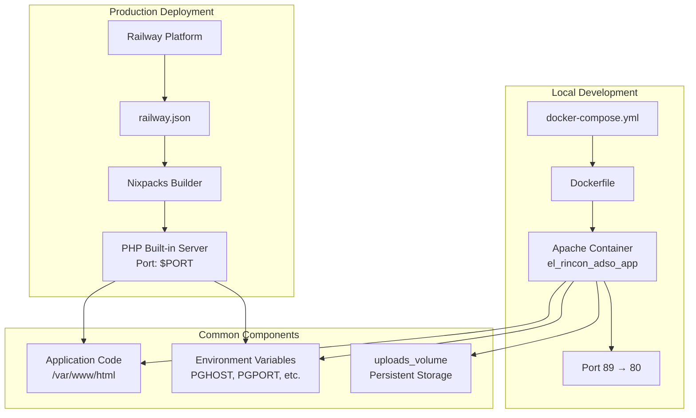
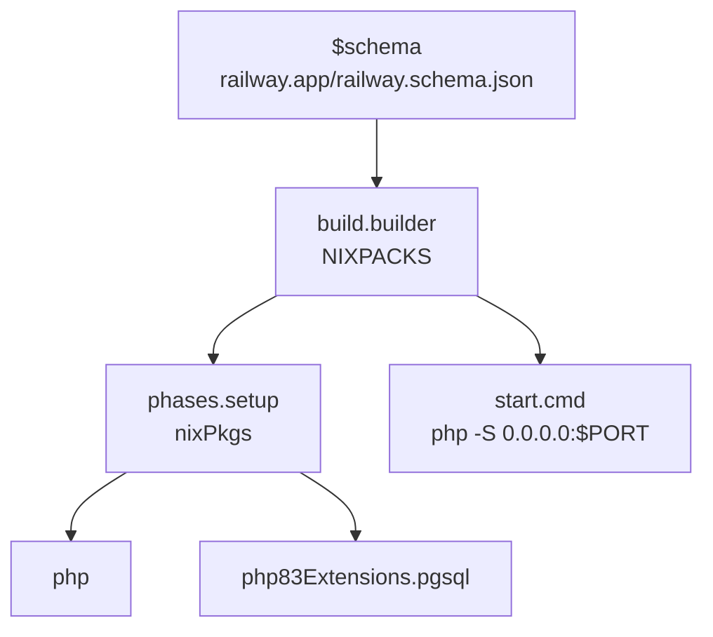
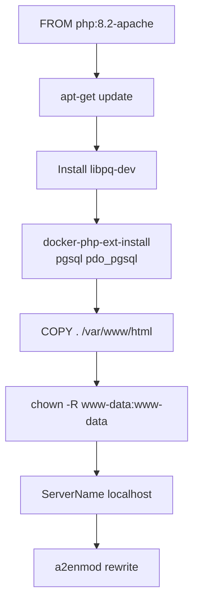
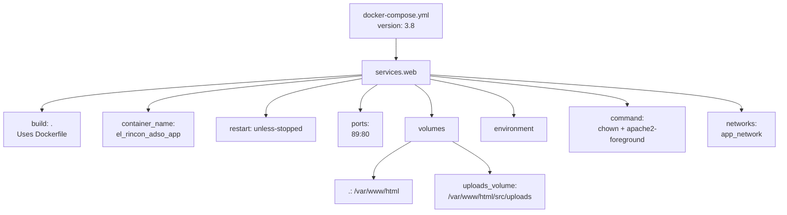
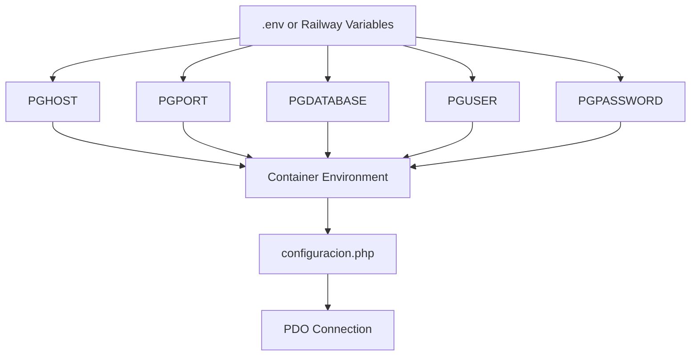
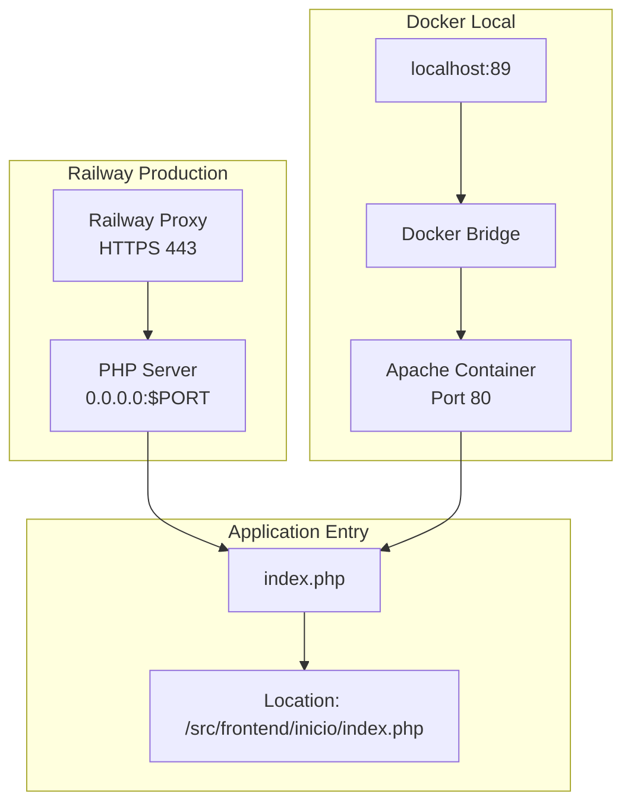
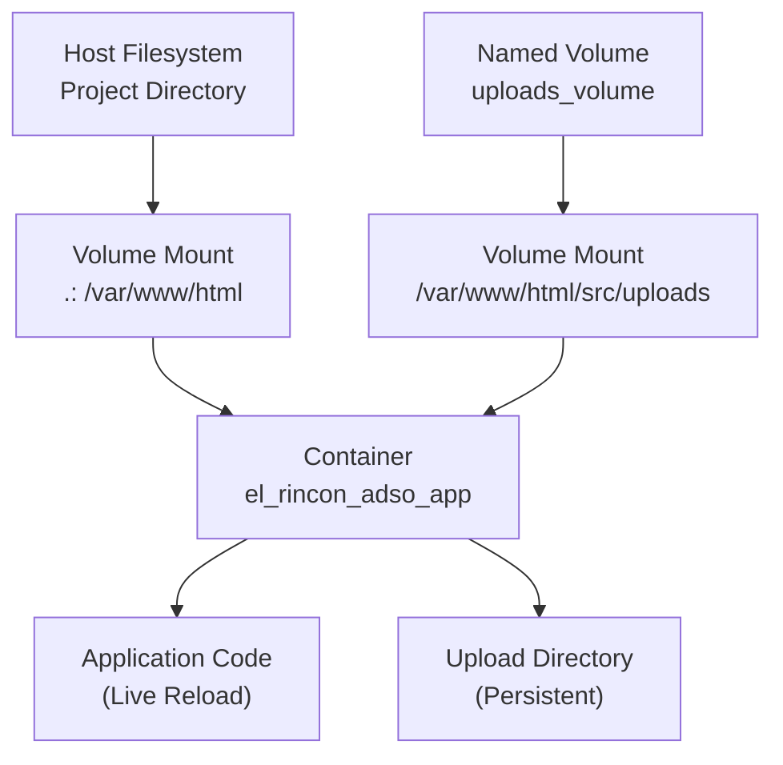
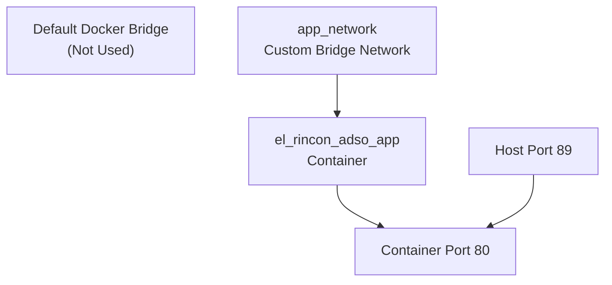
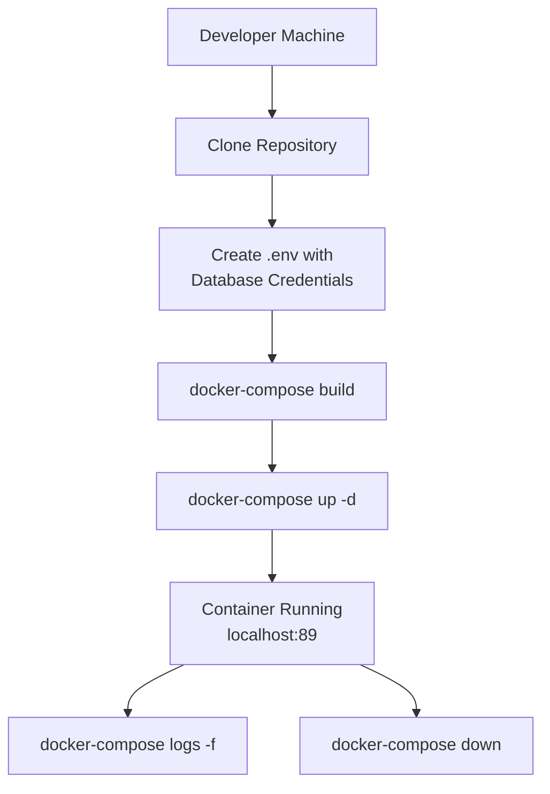
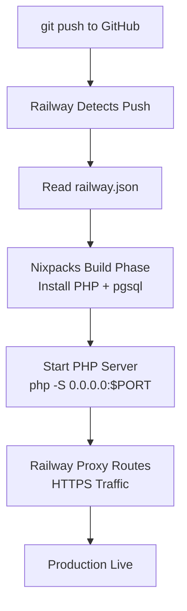

# Deployment with Railway and Docker

> **Relevant source files**
> * [Dockerfile](https://github.com/axchisan/El-rincon-de-ADSO/blob/3e310227/Dockerfile)
> * [docker-compose.yml](https://github.com/axchisan/El-rincon-de-ADSO/blob/3e310227/docker-compose.yml)
> * [index.php](https://github.com/axchisan/El-rincon-de-ADSO/blob/3e310227/index.php)
> * [railway.json](https://github.com/axchisan/El-rincon-de-ADSO/blob/3e310227/railway.json)

## Purpose and Scope

This document describes the deployment infrastructure for El Rincón de ADSO, covering both cloud deployment via Railway and local development using Docker containers. The system supports two deployment modes: Railway's cloud platform using Nixpacks for production, and Docker Compose for local development environments.

For database connection configuration details, see [Database Configuration](/axchisan/El-rincon-de-ADSO/2.1-database-configuration). For general setup instructions, see [Getting Started](/axchisan/El-rincon-de-ADSO/2-getting-started).

## Deployment Architecture Overview

El Rincón de ADSO employs a dual-deployment strategy with separate configurations for production and development environments.



**Sources:** [railway.json L1-L20](https://github.com/axchisan/El-rincon-de-ADSO/blob/3e310227/railway.json#L1-L20)

 [docker-compose.yml L1-L28](https://github.com/axchisan/El-rincon-de-ADSO/blob/3e310227/docker-compose.yml#L1-L28)

 [Dockerfile L1-L18](https://github.com/axchisan/El-rincon-de-ADSO/blob/3e310227/Dockerfile#L1-L18)

## Railway Deployment Configuration

Railway deployment is configured through `railway.json`, which defines the build process and runtime behavior using Nixpacks.

### Build Configuration

The `railway.json` file specifies the Nixpacks builder with custom phases:



| Configuration Key | Value | Purpose |
| --- | --- | --- |
| `build.builder` | `NIXPACKS` | Uses Railway's Nixpacks builder system |
| `phases.setup.nixPkgs` | `["php", "php83Extensions.pgsql"]` | Installs PHP and PostgreSQL extension |
| `start.cmd` | `php -S 0.0.0.0:$PORT` | Starts PHP built-in server on Railway's dynamic port |
| `deploy.startCommand` | `php -S 0.0.0.0:$PORT` | Redundant start command for deployment |
| `deploy.restartPolicy` | `ON_FAILURE` | Automatically restarts service on failure |

**Sources:** [railway.json L1-L20](https://github.com/axchisan/El-rincon-de-ADSO/blob/3e310227/railway.json#L1-L20)

### Runtime Behavior

Railway assigns a dynamic `$PORT` environment variable at runtime. The application listens on all interfaces (`0.0.0.0`) to accept incoming traffic routed by Railway's proxy layer.

**Sources:** [railway.json L12-L13](https://github.com/axchisan/El-rincon-de-ADSO/blob/3e310227/railway.json#L12-L13)

 [railway.json L17](https://github.com/axchisan/El-rincon-de-ADSO/blob/3e310227/railway.json#L17-L17)

## Docker Containerization

The Docker setup provides a complete Apache/PHP environment for local development with PostgreSQL extensions.

### Dockerfile Structure

The `Dockerfile` builds a PHP 8.2-Apache image with PostgreSQL support:



| Dockerfile Instruction | Line | Purpose |
| --- | --- | --- |
| `FROM php:8.2-apache` | 1 | Base image with PHP 8.2 and Apache |
| `apt-get install libpq-dev` | 4-5 | PostgreSQL development libraries |
| `docker-php-ext-install pgsql pdo_pgsql` | 6 | Enable PostgreSQL PDO driver |
| `COPY . /var/www/html` | 9 | Copy application code into container |
| `chown -R www-data:www-data` | 12 | Set correct file ownership for Apache |
| `ServerName localhost` | 15 | Suppress Apache ServerName warning |
| `a2enmod rewrite` | 18 | Enable mod_rewrite for URL routing |

**Sources:** [Dockerfile L1-L18](https://github.com/axchisan/El-rincon-de-ADSO/blob/3e310227/Dockerfile#L1-L18)

## Docker Compose Configuration

The `docker-compose.yml` orchestrates the application container with volume persistence and environment variable injection.

### Service Definition



**Sources:** [docker-compose.yml L1-L28](https://github.com/axchisan/El-rincon-de-ADSO/blob/3e310227/docker-compose.yml#L1-L28)

### Service Configuration Table

| Property | Value | Purpose |
| --- | --- | --- |
| `build` | `.` | Build from Dockerfile in root directory |
| `container_name` | `el_rincon_adso_app` | Container identifier for management |
| `restart` | `unless-stopped` | Auto-restart unless manually stopped |
| `ports` | `"89:80"` | Map host port 89 to container port 80 |
| `volumes[0]` | `.:/var/www/html` | Mount codebase for live development |
| `volumes[1]` | `uploads_volume:/var/www/html/src/uploads` | Persistent named volume for uploads |
| `networks` | `app_network` | Custom bridge network for isolation |

**Sources:** [docker-compose.yml L4-L22](https://github.com/axchisan/El-rincon-de-ADSO/blob/3e310227/docker-compose.yml#L4-L22)

## Environment Variable Configuration

Both deployment methods require PostgreSQL connection parameters passed as environment variables.

### Required Environment Variables



| Variable | Source | Usage |
| --- | --- | --- |
| `PGHOST` | Railway Variables / .env | PostgreSQL server hostname (Aiven) |
| `PGPORT` | Railway Variables / .env | PostgreSQL port (default: 5432) |
| `PGDATABASE` | Railway Variables / .env | Database name |
| `PGUSER` | Railway Variables / .env | Database username |
| `PGPASSWORD` | Railway Variables / .env | Database password |

These variables are read by `configuracion.php` to establish the database connection. See [Database Configuration](/axchisan/El-rincon-de-ADSO/2.1-database-configuration) for detailed connection logic.

**Sources:** [docker-compose.yml L13-L18](https://github.com/axchisan/El-rincon-de-ADSO/blob/3e310227/docker-compose.yml#L13-L18)

## Port Configuration and Traffic Flow

The system uses different port configurations for Railway vs Docker deployments.

### Port Mapping Architecture



### Railway Port Behavior

* Railway assigns `$PORT` dynamically (typically 8080 or similar)
* PHP built-in server binds to `0.0.0.0:$PORT` to accept all interfaces
* Railway's proxy terminates SSL and routes traffic to the container

**Sources:** [railway.json L12](https://github.com/axchisan/El-rincon-de-ADSO/blob/3e310227/railway.json#L12-L12)

 [railway.json L17](https://github.com/axchisan/El-rincon-de-ADSO/blob/3e310227/railway.json#L17-L17)

### Docker Port Mapping

* Host port 89 maps to container port 80
* Apache listens on port 80 inside the container
* Access via `http://localhost:89` on the host machine

**Sources:** [docker-compose.yml L8-L9](https://github.com/axchisan/El-rincon-de-ADSO/blob/3e310227/docker-compose.yml#L8-L9)

### Application Entry Point

The root `index.php` redirects all traffic to the main application:

```yaml
Location: /src/frontend/inicio/index.php
```

This redirect works consistently in both deployment environments.

**Sources:** [index.php L1-L4](https://github.com/axchisan/El-rincon-de-ADSO/blob/3e310227/index.php#L1-L4)

## Volume Persistence and File Storage

Docker Compose uses named volumes to persist uploaded files across container restarts.

### Volume Configuration



| Volume Type | Mount | Purpose |
| --- | --- | --- |
| Bind Mount | `.:/var/www/html` | Live code synchronization for development |
| Named Volume | `uploads_volume:/var/www/html/src/uploads` | Persistent storage for user-uploaded files |

The named volume `uploads_volume` ensures uploaded resources (profile images, documents, videos) persist even when the container is recreated.

**Sources:** [docker-compose.yml L10-L12](https://github.com/axchisan/El-rincon-de-ADSO/blob/3e310227/docker-compose.yml#L10-L12)

 [docker-compose.yml L24-L25](https://github.com/axchisan/El-rincon-de-ADSO/blob/3e310227/docker-compose.yml#L24-L25)

### File Permission Management

The `docker-compose.yml` command ensures proper file ownership:

```
sh -c "chown -R www-data:www-data /var/www/html && apache2-foreground"
```

This command:

1. Changes ownership of all files to `www-data:www-data` (Apache user)
2. Starts Apache in foreground mode

**Sources:** [docker-compose.yml L19-L20](https://github.com/axchisan/El-rincon-de-ADSO/blob/3e310227/docker-compose.yml#L19-L20)

 [Dockerfile L12](https://github.com/axchisan/El-rincon-de-ADSO/blob/3e310227/Dockerfile#L12-L12)

## Network Configuration

Docker Compose creates an isolated network for the application.



| Network Property | Value | Purpose |
| --- | --- | --- |
| Network Name | `app_network` | Custom bridge network for service isolation |
| Network Driver | bridge (default) | Standard Docker bridge networking |
| Connected Services | `web` | Only the web service is connected |

The custom network allows for future expansion (e.g., adding Redis, worker containers) while maintaining network isolation from other Docker containers.

**Sources:** [docker-compose.yml L21-L22](https://github.com/axchisan/El-rincon-de-ADSO/blob/3e310227/docker-compose.yml#L21-L22)

 [docker-compose.yml L27-L28](https://github.com/axchisan/El-rincon-de-ADSO/blob/3e310227/docker-compose.yml#L27-L28)

## Deployment Workflow

### Local Docker Development



**Commands:**

1. Build the Docker image: `docker-compose build`
2. Start the container: `docker-compose up -d`
3. View logs: `docker-compose logs -f web`
4. Stop the container: `docker-compose down`
5. Rebuild and restart: `docker-compose up -d --build`

**Sources:** [docker-compose.yml L1-L28](https://github.com/axchisan/El-rincon-de-ADSO/blob/3e310227/docker-compose.yml#L1-L28)

 [Dockerfile L1-L18](https://github.com/axchisan/El-rincon-de-ADSO/blob/3e310227/Dockerfile#L1-L18)

### Railway Production Deployment



**Workflow:**

1. Push code to GitHub repository
2. Railway automatically detects the push
3. Reads `railway.json` build configuration
4. Nixpacks installs PHP and PostgreSQL extension
5. Starts PHP built-in server with dynamic port
6. Railway proxy routes HTTPS traffic to the application

**Environment variables must be configured in Railway's dashboard before deployment.**

**Sources:** [railway.json L1-L20](https://github.com/axchisan/El-rincon-de-ADSO/blob/3e310227/railway.json#L1-L20)

## Build Comparison: Railway vs Docker

| Aspect | Railway (Nixpacks) | Docker Compose |
| --- | --- | --- |
| Builder | Nixpacks with custom phases | Docker with Dockerfile |
| Base Image | Managed by Nixpacks | `php:8.2-apache` |
| Web Server | PHP built-in server | Apache 2.4 |
| Port | Dynamic `$PORT` variable | Fixed 89→80 mapping |
| Code Mount | Immutable build artifact | Live bind mount |
| Uploads Storage | Ephemeral (requires external storage) | Persistent named volume |
| Restart Policy | `ON_FAILURE` | `unless-stopped` |
| Environment | Railway Variables | `.env` file or shell export |
| Use Case | Production deployment | Local development |

**Sources:** [railway.json L1-L20](https://github.com/axchisan/El-rincon-de-ADSO/blob/3e310227/railway.json#L1-L20)

 [docker-compose.yml L1-L28](https://github.com/axchisan/El-rincon-de-ADSO/blob/3e310227/docker-compose.yml#L1-L28)

 [Dockerfile L1-L18](https://github.com/axchisan/El-rincon-de-ADSO/blob/3e310227/Dockerfile#L1-L18)

## Configuration File Reference

### railway.json Schema

```json
{
  "$schema": "https://railway.app/railway.schema.json",
  "build": {
    "builder": "NIXPACKS",
    "nixpacksPlan": {
      "phases": {
        "setup": {
          "nixPkgs": ["php", "php83Extensions.pgsql"]
        }
      },
      "start": {
        "cmd": "php -S 0.0.0.0:$PORT"
      }
    }
  },
  "deploy": {
    "startCommand": "php -S 0.0.0.0:$PORT",
    "restartPolicy": "ON_FAILURE"
  }
}
```

**Sources:** [railway.json L1-L20](https://github.com/axchisan/El-rincon-de-ADSO/blob/3e310227/railway.json#L1-L20)

### docker-compose.yml Key Sections

| Section | Lines | Purpose |
| --- | --- | --- |
| `version` | 1 | Compose file format version 3.8 |
| `services.web` | 4-22 | Main application service definition |
| `volumes` | 24-25 | Named volume declarations |
| `networks` | 27-28 | Custom network definition |

**Sources:** [docker-compose.yml L1-L28](https://github.com/axchisan/El-rincon-de-ADSO/blob/3e310227/docker-compose.yml#L1-L28)

### Dockerfile Key Layers

| Layer | Lines | Purpose |
| --- | --- | --- |
| Base image | 1 | PHP 8.2 with Apache |
| System packages | 4-6 | PostgreSQL client libraries |
| Application code | 9 | Copy project files |
| Permissions | 12 | Set www-data ownership |
| Apache config | 15 | Configure ServerName |
| Module enable | 18 | Enable mod_rewrite |

**Sources:** [Dockerfile L1-L18](https://github.com/axchisan/El-rincon-de-ADSO/blob/3e310227/Dockerfile#L1-L18)

## Troubleshooting

### Common Issues

| Issue | Cause | Solution |
| --- | --- | --- |
| "Connection refused" | Wrong port number | Verify port 89 is accessible |
| "Permission denied" on uploads | Incorrect file ownership | Run `docker-compose down && docker-compose up -d --build` |
| "Could not find driver" | Missing pgsql extension | Rebuild image: `docker-compose build --no-cache` |
| Railway deployment fails | Missing environment variables | Configure PGHOST, PGPORT, PGDATABASE, PGUSER, PGPASSWORD in Railway |
| Files not persisting | Volume not mounted | Verify `uploads_volume` is created: `docker volume ls` |

**Sources:** [Dockerfile L4-L6](https://github.com/axchisan/El-rincon-de-ADSO/blob/3e310227/Dockerfile#L4-L6)

 [docker-compose.yml L10-L12](https://github.com/axchisan/El-rincon-de-ADSO/blob/3e310227/docker-compose.yml#L10-L12)

 [railway.json L8](https://github.com/axchisan/El-rincon-de-ADSO/blob/3e310227/railway.json#L8-L8)