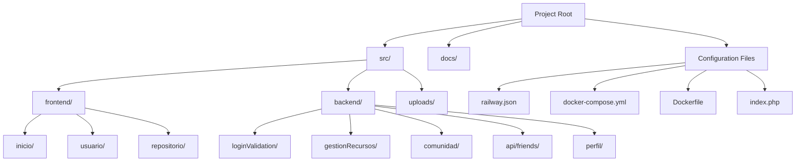
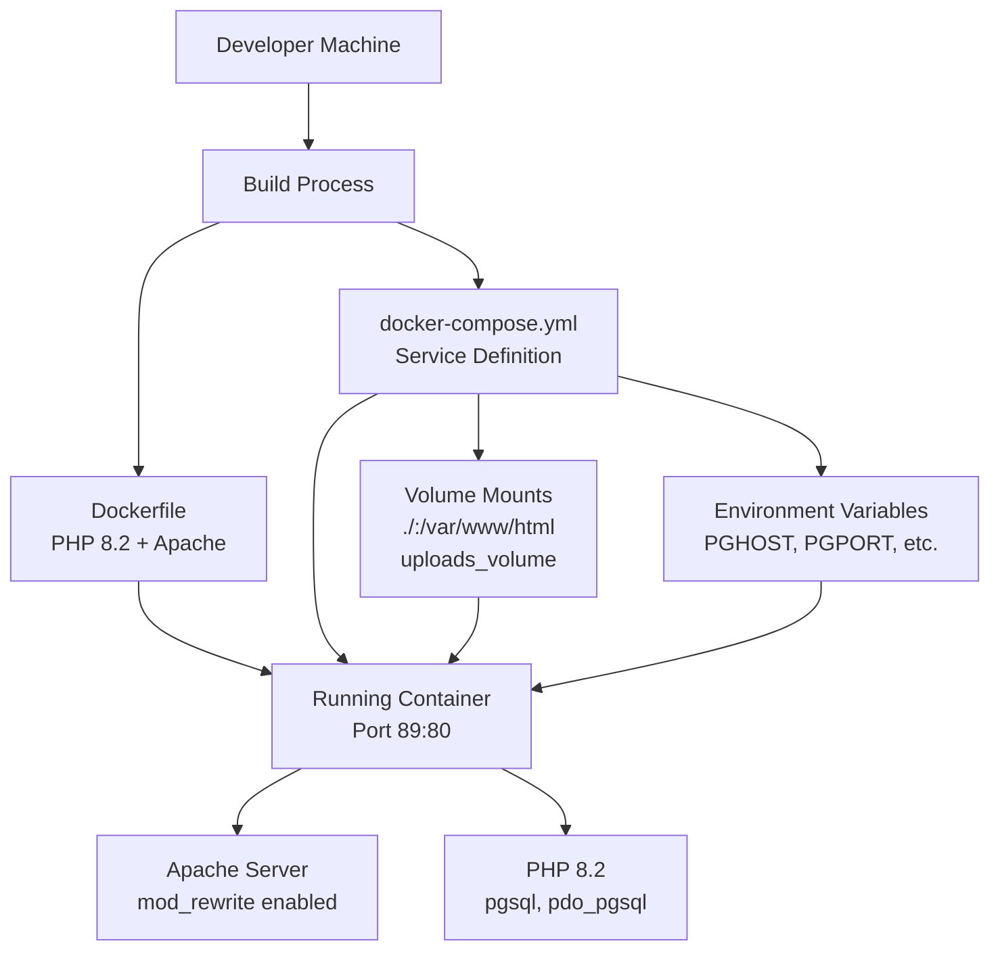
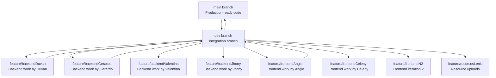
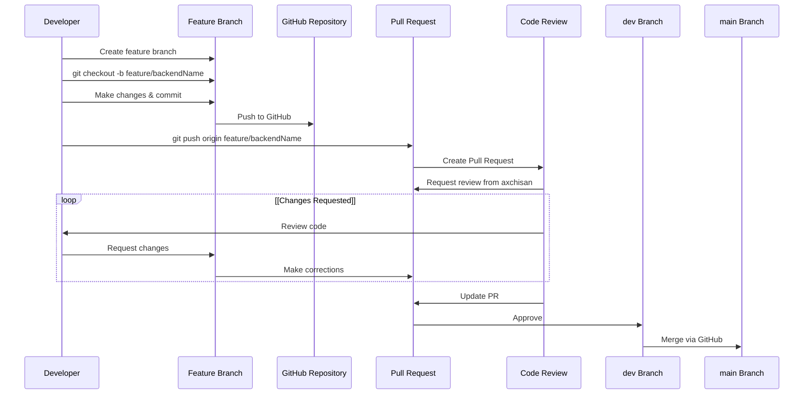
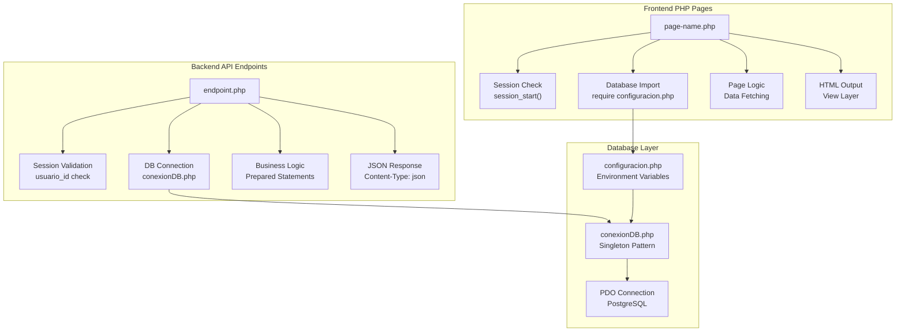
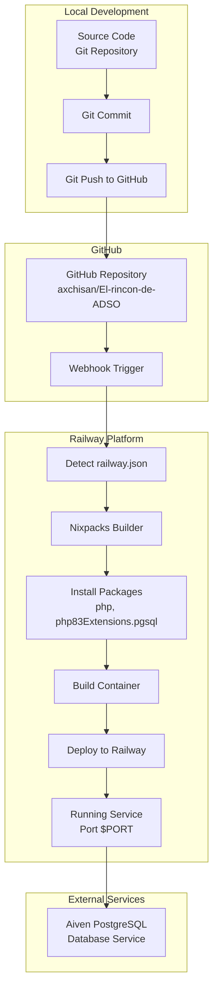
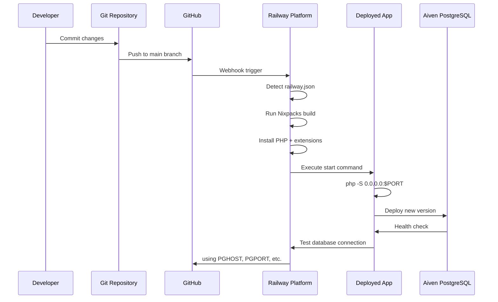
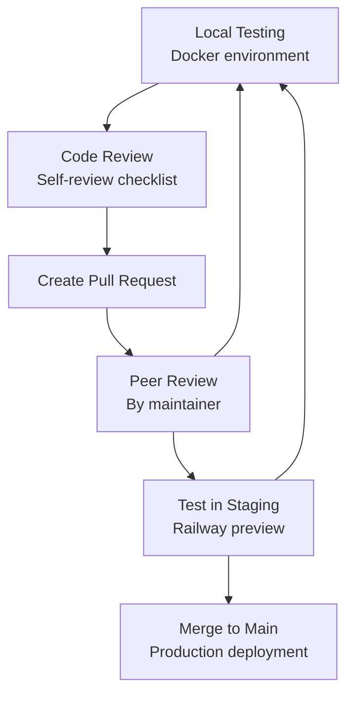
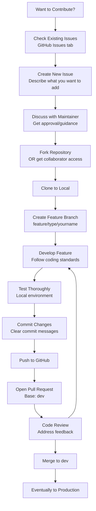
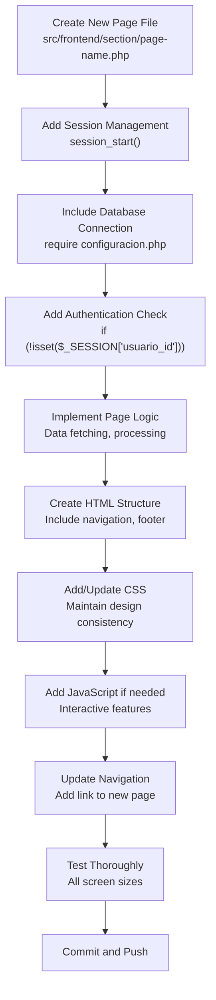

# Desarrollo y Contribución

> **Archivos fuente relevantes**
> * [Archivo Docker](https://github.com/axchisan/El-rincon-de-ADSO/blob/3e310227/Dockerfile)
> * [docker-compose.yml](https://github.com/axchisan/El-rincon-de-ADSO/blob/3e310227/docker-compose.yml)
> * [documentos/Front End por Angie.pdf](https://github.com/axchisan/El-rincon-de-ADSO/blob/3e310227/docs/Front End by-Angie.pdf)
> * [docs/informe-bitacora-de-contribuciones-duvan-250502_1414.pdf](https://github.com/axchisan/El-rincon-de-ADSO/blob/3e310227/docs/informe-bitacora-de-contribuciones-duvan-250502_1414.pdf)
> * [docs/informe-estructuracion-del-proyecto-repositorio-250502_1416.pdf](https://github.com/axchisan/El-rincon-de-ADSO/blob/3e310227/docs/informe-estructuracion-del-proyecto-repositorio-250502_1416.pdf)
> * [docs/informe-general-250502_1431.pdf](https://github.com/axchisan/El-rincon-de-ADSO/blob/3e310227/docs/informe-general-250502_1431.pdf)
> * [historial_commits.txt](https://github.com/axchisan/El-rincon-de-ADSO/blob/3e310227/historial_commits.txt)
> * [índice.php](https://github.com/axchisan/El-rincon-de-ADSO/blob/3e310227/index.php)
> * [ferrocarril.json](https://github.com/axchisan/El-rincon-de-ADSO/blob/3e310227/railway.json)

Este documento proporciona una guía completa para desarrolladores que deseen contribuir al proyecto El Rincón de ADSO. Abarca la configuración del entorno de desarrollo, el flujo de trabajo de Git, los estándares de codificación, los procedimientos de implementación y las directrices de contribución. Es una referencia técnica para la incorporación de nuevos colaboradores y para mantener la coherencia en el equipo de desarrollo.

Para obtener información sobre la arquitectura general del sistema y sus componentes, consulte [Descripción general](/axchisan/El-rincon-de-ADSO/1-overview) . Para obtener detalles de configuración específicos de la implementación, consulte [Implementación con Railway y Docker](/axchisan/El-rincon-de-ADSO/2.2-deployment-with-railway-and-docker) . Para conocer los procedimientos de configuración de la base de datos, consulte [Configuración de la base de datos](/axchisan/El-rincon-de-ADSO/2.1-database-configuration) .

## Configuración del entorno de desarrollo

### Requisitos previos para el desarrollo local

Para contribuir a este proyecto, los desarrolladores necesitan tener instaladas las siguientes herramientas:

* **PHP 8.2 o superior** con extensiones: `pgsql`,`pdo_pgsql`
* **Cliente PostgreSQL** para conectividad de bases de datos
* **Docker y Docker Compose** para el desarrollo en contenedores
* **Git** para control de versiones
* **Servidor web Apache o Nginx** (o utilice el servidor integrado de PHP)

### Descripción general de la estructura del proyecto



**Fuentes:** [railway.json L1-L20](https://github.com/axchisan/El-rincon-de-ADSO/blob/3e310227/railway.json#L1-L20)

 [docker-compose.yml L1-L28](https://github.com/axchisan/El-rincon-de-ADSO/blob/3e310227/docker-compose.yml#L1-L28)

 [Dockerfile L1-L18](https://github.com/axchisan/El-rincon-de-ADSO/blob/3e310227/Dockerfile#L1-L18)

 [index.php L1-L4](https://github.com/axchisan/El-rincon-de-ADSO/blob/3e310227/index.php#L1-L4)

### Configuración del entorno

La aplicación utiliza variables de entorno para la conectividad con la base de datos. Cree un `.env`archivo en la raíz del proyecto con las siguientes variables:

| Variable | Descripción | Ejemplo |
| --- | --- | --- |
| `PGHOST` | Dirección de host de PostgreSQL | `your-db.aivencloud.com` |
| `PGPORT` | Puerto PostgreSQL | `12345` |
| `PGDATABASE` | Nombre de la base de datos | `elrincon_adso` |
| `PGUSER` | Nombre de usuario de la base de datos | `avnadmin` |
| `PGPASSWORD` | Contraseña de la base de datos | `your_password_here` |

Estas variables de entorno se referencian en[docker-compose.yml L14-L18](https://github.com/axchisan/El-rincon-de-ADSO/blob/3e310227/docker-compose.yml#L14-L18)

 and consumed by `src/backend/conexionDB.php` for database connectivity.

**Sources:** [docker-compose.yml L13-L18](https://github.com/axchisan/El-rincon-de-ADSO/blob/3e310227/docker-compose.yml#L13-L18)

### Local Setup with Docker

The recommended development approach uses Docker Compose to ensure environment consistency:



**Setup Commands:**

```sql
# Clone the repository
git clone https://github.com/axchisan/El-rincon-de-ADSO.git
cd El-rincon-de-ADSO

# Create .env file with database credentials
cat > .env << EOF
PGHOST=your-db-host
PGPORT=your-db-port
PGDATABASE=your-db-name
PGUSER=your-db-user
PGPASSWORD=your-db-password
EOF

# Build and start containers
docker-compose up --build

# Access application at http://localhost:89
```

The Docker setup configures:

* Apache web server with `mod_rewrite` enabled [Dockerfile L18](https://github.com/axchisan/El-rincon-de-ADSO/blob/3e310227/Dockerfile#L18-L18)
* PHP-FPM for processing [Dockerfile L1](https://github.com/axchisan/El-rincon-de-ADSO/blob/3e310227/Dockerfile#L1-L1)
* Volume mounting for live code reload [docker-compose.yml L11-L12](https://github.com/axchisan/El-rincon-de-ADSO/blob/3e310227/docker-compose.yml#L11-L12)
* Persistent storage for uploads [docker-compose.yml L12](https://github.com/axchisan/El-rincon-de-ADSO/blob/3e310227/docker-compose.yml#L12-L12)
* Proper file permissions via `www-data` user [docker-compose.yml L20](https://github.com/axchisan/El-rincon-de-ADSO/blob/3e310227/docker-compose.yml#L20-L20)

**Sources:** [Dockerfile L1-L18](https://github.com/axchisan/El-rincon-de-ADSO/blob/3e310227/Dockerfile#L1-L18)

 [docker-compose.yml L1-L28](https://github.com/axchisan/El-rincon-de-ADSO/blob/3e310227/docker-compose.yml#L1-L28)

### Alternative: PHP Built-in Server

For quick testing without Docker:

```markdown
# Install PHP dependencies (Ubuntu/Debian)
sudo apt-get install php8.2 php8.2-pgsql php8.2-pdo-pgsql

# Start built-in server
php -S 0.0.0.0:8000 -t src/frontend/inicio

# Access at http://localhost:8000
```

This approach is used by Railway's deployment as configured in [railway.json L12](https://github.com/axchisan/El-rincon-de-ADSO/blob/3e310227/railway.json#L12-L12)

**Sources:** [railway.json L11-L13](https://github.com/axchisan/El-rincon-de-ADSO/blob/3e310227/railway.json#L11-L13)

## Git Workflow and Branch Strategy

### Branch Naming Conventions

The project uses a feature-branch workflow with consistent naming patterns observed in the commit history:



**Branch Naming Pattern:**

* `feature/backend[Name]` - Backend functionality
* `feature/frontend[Name]` - Frontend/UI work
* `feature/recursos[Name]` - Resource/content additions
* `dev` - Integration and testing
* `main` - Stable production code

**Sources:** [historial_commits.txt L13-L178](https://github.com/axchisan/El-rincon-de-ADSO/blob/3e310227/historial_commits.txt#L13-L178)

### Commit Message Patterns

Analysis of the commit history reveals the following patterns:

| Pattern | Example | Frequency |
| --- | --- | --- |
| Feature addition | "agregue lo del chat y notificaciones" | High |
| Bug fix | "correccion ruta database index.php" | High |
| Merge | "Merge pull request #75 from axchisan/feature/backendDuvan" | Very High |
| Configuration | "Actualizar railway.json para usar Nginx" | Medium |
| Reset/Rollback | "reset panel usuario por conflicto de ramas" | Low |
| Improvement | "mejore la interfaz de ver perfil de amigo" | Medium |

**Commit Message Guidelines:**

* Use Spanish for consistency with existing commits
* Start with action verb: "agregue", "corregi", "mejore", "elimine"
* Be specific about what changed
* Reference file or feature names
* Keep under 72 characters for subject line

**Sources:** [historial_commits.txt L1-L183](https://github.com/axchisan/El-rincon-de-ADSO/blob/3e310227/historial_commits.txt#L1-L183)

### Pull Request Workflow



**Pull Request Process:**

1. **Create Feature Branch** ``` git checkout dev git pull origin dev git checkout -b feature/backendYourName ```
2. **Make Changes and Commit** ``` git add . git commit -m "agregue funcionalidad de X" git push origin feature/backendYourName ```
3. **Open Pull Request** * Navigate to GitHub repository * Click "New Pull Request" * Base: `dev`, Compare: `feature/backendYourName` * Add description of changes * Request review from project maintainer (axchisan)
4. **Address Review Comments** * Make requested changes * Commit and push updates * PR automatically updates
5. **Merge** * Maintainer merges via GitHub interface * Delete feature branch after merge

The commit history shows 75+ pull requests merged following this pattern [historial_commits.txt L13-L178](https://github.com/axchisan/El-rincon-de-ADSO/blob/3e310227/historial_commits.txt#L13-L178)

**Sources:** [historial_commits.txt L13-L178](https://github.com/axchisan/El-rincon-de-ADSO/blob/3e310227/historial_commits.txt#L13-L178)

### Handling Merge Conflicts

Common conflict scenarios observed in the commit history:

1. **Database Configuration Conflicts**: Multiple developers modifying `configuracion.php`
2. **Panel de Usuario Conflicts**: Frequent updates to `panel-usuario.php` [historial_commits.txt L16-L24](https://github.com/axchisan/El-rincon-de-ADSO/blob/3e310227/historial_commits.txt#L16-L24)
3. **Index/Routing Conflicts**: Changes to entry points

**Conflict Resolution Steps:**

```sql
# Update your branch with latest dev
git checkout feature/yourBranch
git fetch origin
git merge origin/dev

# If conflicts occur
# 1. Open conflicted files
# 2. Resolve conflicts manually
# 3. Remove conflict markers (<<<<, ====, >>>>)
# 4. Test thoroughly

git add .
git commit -m "solucion conflicto en archivo X"
git push origin feature/yourBranch
```

**Sources:** [historial_commits.txt L16-L19](https://github.com/axchisan/El-rincon-de-ADSO/blob/3e310227/historial_commits.txt#L16-L19)

## Code Organization and Standards

### File Structure Standards



**PHP File Header Template:**

```php
<?php
// Session management
session_start();

// Authentication check
if (!isset($_SESSION['usuario_id'])) {
    header('Location: /src/frontend/inicio/login.php');
    exit();
}

// Database connection
require_once '../../backend/configuracion.php';
require_once '../../backend/conexionDB.php';

// Database instance
$db = ConexionDB::getInstance()->getConnection();

// Page logic
// ...
?>
```

**Sources:** Based on patterns in [index.php L1-L4](https://github.com/axchisan/El-rincon-de-ADSO/blob/3e310227/index.php#L1-L4)

 and database configuration patterns

### Coding Standards

#### PHP Standards

| Standard | Requirement | Example |
| --- | --- | --- |
| PHP Version | 8.2+ | [Dockerfile L1](https://github.com/axchisan/El-rincon-de-ADSO/blob/3e310227/Dockerfile#L1-L1) |
| Error Reporting | Development: E_ALL | `error_reporting(E_ALL)` |
| Session Security | Always call `session_start()` | Before accessing `$_SESSION` |
| SQL Queries | Use prepared statements | `$stmt = $pdo->prepare($sql)` |
| File Permissions | Set `www-data:www-data` | [docker-compose.yml L20](https://github.com/axchisan/El-rincon-de-ADSO/blob/3e310227/docker-compose.yml#L20-L20) |
| Character Encoding | UTF-8 | `header('Content-Type: text/html; charset=UTF-8')` |

#### Database Query Pattern

Always use PDO prepared statements to prevent SQL injection:

```sql
// CORRECT ✓
$sql = "SELECT * FROM usuarios WHERE usuario_id = :id";
$stmt = $pdo->prepare($sql);
$stmt->bindParam(':id', $usuario_id, PDO::PARAM_INT);
$stmt->execute();
$result = $stmt->fetch(PDO::FETCH_ASSOC);

// INCORRECT ✗
$sql = "SELECT * FROM usuarios WHERE usuario_id = $usuario_id";
$result = $pdo->query($sql);
```

**Sources:** Referenced in security documentation patterns

#### File Upload Handling

File uploads must follow these security practices:

```
// Validate file type
$allowed_types = ['image/jpeg', 'image/png', 'application/pdf'];
if (!in_array($_FILES['file']['type'], $allowed_types)) {
    die('Tipo de archivo no permitido');
}

// Validate file size (max 10MB)
if ($_FILES['file']['size'] > 10485760) {
    die('Archivo demasiado grande');
}

// Generate unique filename
$extension = pathinfo($_FILES['file']['name'], PATHINFO_EXTENSION);
$filename = uniqid() . '_' . time() . '.' . $extension;

// Move to uploads directory
$upload_path = __DIR__ . '/../../uploads/' . $filename;
move_uploaded_file($_FILES['file']['tmp_name'], $upload_path);
```

The uploads directory is configured in [docker-compose.yml L12](https://github.com/axchisan/El-rincon-de-ADSO/blob/3e310227/docker-compose.yml#L12-L12)

 with persistent storage.

**Sources:** [docker-compose.yml L11-L12](https://github.com/axchisan/El-rincon-de-ADSO/blob/3e310227/docker-compose.yml#L11-L12)

#### Frontend Naming Conventions

* **PHP Files**: Use kebab-case: `panel-usuario.php`, `ver-video.php`
* **CSS Classes**: Use kebab-case: `.panel-header`, `.resource-card`
* **JavaScript Functions**: Use camelCase: `loadResources()`, `updateNotifications()`
* **Database Tables**: Use lowercase: `usuarios`, `documentos`, `amistades`
* **API Endpoints**: Use descriptive names: `get_user_resources.php`, `add_to_favorites.php`

**Sources:** Patterns observed throughout codebase structure

## Deployment Process

### Railway Deployment Configuration

The application is configured for deployment on Railway using Nixpacks builder:



**Railway Configuration File:**

[railway.json L1-L20](https://github.com/axchisan/El-rincon-de-ADSO/blob/3e310227/railway.json#L1-L20)

 defines:

* **Builder**: NIXPACKS [railway.json L4](https://github.com/axchisan/El-rincon-de-ADSO/blob/3e310227/railway.json#L4-L4)
* **Setup Phase**: Install `php` and `php83Extensions.pgsql` [railway.json L8](https://github.com/axchisan/El-rincon-de-ADSO/blob/3e310227/railway.json#L8-L8)
* **Start Command**: `php -S 0.0.0.0:$PORT` [railway.json L12-L17](https://github.com/axchisan/El-rincon-de-ADSO/blob/3e310227/railway.json#L12-L17)
* **Restart Policy**: ON_FAILURE [railway.json L18](https://github.com/axchisan/El-rincon-de-ADSO/blob/3e310227/railway.json#L18-L18)

**Environment Variables in Railway:**

Set the following in Railway dashboard under your service settings:

| Variable | Source | Purpose |
| --- | --- | --- |
| `PGHOST` | Aiven dashboard | Database host |
| `PGPORT` | Aiven dashboard | Database port |
| `PGDATABASE` | Aiven dashboard | Database name |
| `PGUSER` | Aiven dashboard | Database username |
| `PGPASSWORD` | Aiven dashboard | Database password |

**Sources:** [railway.json L1-L20](https://github.com/axchisan/El-rincon-de-ADSO/blob/3e310227/railway.json#L1-L20)

### Deployment Workflow



**Deployment Steps:**

1. **Commit to Main Branch** * Ensure all changes are merged to `main` via `dev` branch * All tests pass locally
2. **Automatic Deployment** * Railway detects push to `main` * Reads [railway.json L1-L20](https://github.com/axchisan/El-rincon-de-ADSO/blob/3e310227/railway.json#L1-L20)  for build configuration * Installs dependencies via Nixpacks
3. **Health Checks** * Application starts on dynamic `$PORT` * Database connectivity verified * Application becomes available
4. **Rollback if Needed** * Railway dashboard allows one-click rollback * Previous deployments are preserved

**Sources:** [railway.json L1-L20](https://github.com/axchisan/El-rincon-de-ADSO/blob/3e310227/railway.json#L1-L20)

 [historial_commits.txt L42-L60](https://github.com/axchisan/El-rincon-de-ADSO/blob/3e310227/historial_commits.txt#L42-L60)

### Docker Deployment (Alternative)

For self-hosted deployment using Docker:

```markdown
# Build image
docker build -t el-rincon-adso:latest .

# Run with environment variables
docker run -d \
  --name el-rincon-adso \
  -p 89:80 \
  -v $(pwd)/uploads:/var/www/html/src/uploads \
  -e PGHOST=your-db-host \
  -e PGPORT=your-db-port \
  -e PGDATABASE=your-db-name \
  -e PGUSER=your-db-user \
  -e PGPASSWORD=your-db-password \
  el-rincon-adso:latest
```

The Dockerfile [Dockerfile L1-L18](https://github.com/axchisan/El-rincon-de-ADSO/blob/3e310227/Dockerfile#L1-L18)

 configures:

* Base image: `php:8.2-apache` [Dockerfile L1](https://github.com/axchisan/El-rincon-de-ADSO/blob/3e310227/Dockerfile#L1-L1)
* PostgreSQL extensions: `libpq-dev`, `pgsql`, `pdo_pgsql` [Dockerfile L4-L6](https://github.com/axchisan/El-rincon-de-ADSO/blob/3e310227/Dockerfile#L4-L6)
* Apache configuration: ServerName, mod_rewrite [Dockerfile L15-L18](https://github.com/axchisan/El-rincon-de-ADSO/blob/3e310227/Dockerfile#L15-L18)
* File permissions: `www-data:www-data` [Dockerfile L12](https://github.com/axchisan/El-rincon-de-ADSO/blob/3e310227/Dockerfile#L12-L12)

**Sources:** [Dockerfile L1-L18](https://github.com/axchisan/El-rincon-de-ADSO/blob/3e310227/Dockerfile#L1-L18)

 [docker-compose.yml L1-L28](https://github.com/axchisan/El-rincon-de-ADSO/blob/3e310227/docker-compose.yml#L1-L28)

## Testing and Quality Assurance

### Testing Checklist

Before submitting a pull request, verify:

**Functionality Tests:**

* Feature works as expected in local environment
* Database operations succeed without errors
* Session management works correctly
* File uploads store properly (if applicable)
* API endpoints return correct JSON (if applicable)

**Cross-Browser Testing:**

* Chrome/Chromium
* Firefox
* Safari (if accessible)
* Mobile browsers

**Responsive Design Testing:**

* Desktop view (1920x1080)
* Tablet view (768x1024)
* Mobile view (375x667)

**Security Checks:**

* SQL injection protection (prepared statements)
* XSS prevention (proper escaping)
* CSRF protection (session tokens)
* File upload validation
* Authentication on protected pages

### Manual Testing Workflow



**Sources:** Derived from development workflow patterns

## Contributing Guidelines

### Who Can Contribute

This project welcomes contributions from:

* ADSO program students and instructors
* Community members with relevant expertise
* Anyone interested in improving educational resource sharing

### Types of Contributions

| Contribution Type | Description | Examples |
| --- | --- | --- |
| **Bug Fixes** | Fix issues or errors | Authentication bugs, broken links, display errors |
| **New Features** | Add new functionality | Additional resource types, enhanced search, new user features |
| **Resource Content** | Upload educational materials | Books, videos, documents via `feature/recursos` branches |
| **UI/UX Improvements** | Enhance user interface | Responsive design fixes, accessibility improvements |
| **Documentation** | Improve code documentation | Inline comments, README updates, wiki pages |
| **Performance** | Optimize code performance | Query optimization, caching, asset optimization |
| **Security** | Enhance security measures | Input validation, authentication improvements |

**Sources:** [historial_commits.txt L1-L183](https://github.com/axchisan/El-rincon-de-ADSO/blob/3e310227/historial_commits.txt#L1-L183)

### Contribution Process



### Code Review Criteria

When reviewing pull requests, maintainers check:

**Code Quality:**

* Follows established coding standards
* Uses prepared statements for database queries
* Proper error handling
* No hardcoded credentials
* Appropriate comments for complex logic

**Security:**

* Input validation and sanitization
* SQL injection prevention
* XSS protection
* Authentication checks on protected resources
* Proper session management

**Functionality:**

* Feature works as described
* No breaking changes to existing features
* Database migrations included (if schema changes)
* File paths are correct

**Documentation:**

* Inline comments for complex logic
* README updated if needed
* Commit messages are clear

**Testing:**

* Changes tested locally
* No console errors
* Responsive design maintained

**Sources:** Based on project quality standards

### Getting Help

**Communication Channels:**

1. **GitHub Issues**: For bug reports and feature requests
2. **Pull Request Comments**: For code-specific questions
3. **Project Maintainer**: Contact axchisan for guidance

**Before Asking:**

* Check existing issues and pull requests
* Review this documentation
* Search commit history for similar work
* Test thoroughly in local environment

### Recognition

Contributors are recognized through:

* Git commit history preservation
* GitHub contributor list
* Acknowledgment in project documentation

The commit history shows contributions from multiple developers: axchisan, GroveLive, Danielaaa09, JHONY2909, garciam1111, Celeny1997, Angie G, and tommyXD777 [historial_commits.txt L1-L183](https://github.com/axchisan/El-rincon-de-ADSO/blob/3e310227/historial_commits.txt#L1-L183)

**Sources:** [historial_commits.txt L1-L183](https://github.com/axchisan/El-rincon-de-ADSO/blob/3e310227/historial_commits.txt#L1-L183)

## Common Development Tasks

### Adding a New Page



### Adding a New API Endpoint

```javascript
<?php
// File: src/backend/api/your-endpoint.php

// Enable error reporting for development
error_reporting(E_ALL);
ini_set('display_errors', 1);

// Start session
session_start();

// Set JSON content type
header('Content-Type: application/json');

// Check authentication
if (!isset($_SESSION['usuario_id'])) {
    http_response_code(401);
    echo json_encode(['error' => 'No autorizado']);
    exit();
}

// Database connection
require_once '../configuracion.php';
require_once '../conexionDB.php';
$db = ConexionDB::getInstance()->getConnection();

try {
    // Validate input
    $usuario_id = $_SESSION['usuario_id'];
    
    // Prepare and execute query
    $sql = "SELECT * FROM table_name WHERE usuario_id = :usuario_id";
    $stmt = $db->prepare($sql);
    $stmt->bindParam(':usuario_id', $usuario_id, PDO::PARAM_INT);
    $stmt->execute();
    
    $result = $stmt->fetchAll(PDO::FETCH_ASSOC);
    
    // Return success response
    echo json_encode([
        'success' => true,
        'data' => $result
    ]);
    
} catch (PDOException $e) {
    http_response_code(500);
    echo json_encode([
        'error' => 'Error de base de datos',
        'message' => $e->getMessage()
    ]);
}
?>
```

### Database Migration Pattern

When modifying database schema:

1. **Document Changes**: Create migration notes in commit message
2. **Test Locally**: Verify changes in local PostgreSQL
3. **Coordinate**: Notify team of schema changes
4. **Deploy**: Apply changes to production database manually
5. **Update Code**: Ensure all code reflects new schema

Example migration documentation:

```sql
-- Migration: Add profile_bio column
-- Date: 2025-01-XX
-- Author: YourName

ALTER TABLE usuarios 
ADD COLUMN profile_bio TEXT;

-- Update existing records with default value
UPDATE usuarios 
SET profile_bio = '' 
WHERE profile_bio IS NULL;
```

### Debugging Tips

**Enable PHP Error Display (Development Only):**

```
error_reporting(E_ALL);
ini_set('display_errors', 1);
```

**Database Query Debugging:**

```php
try {
    $stmt->execute();
    // Debug: Print query
    echo "Query executed: " . $stmt->queryString;
    // Debug: Print bound parameters
    print_r($stmt->debugDumpParams());
} catch (PDOException $e) {
    echo "Error: " . $e->getMessage();
}
```

**Check Docker Logs:**

```markdown
# View container logs
docker-compose logs -f web

# Check specific errors
docker-compose logs web | grep ERROR
```

**Fuentes:** Prácticas estándar de desarrollo de PHP

## Consideraciones de rendimiento

### Mejores prácticas

**Consultas de base de datos:**

* Utilice índices en columnas consultadas con frecuencia
* Limitar conjuntos de resultados con `LIMIT`cláusula
* Evite `SELECT *`, especifique las columnas necesarias
* Utilice la paginación para conjuntos de datos grandes

**Manejo de archivos:**

* Validar y optimizar las imágenes cargadas
* Utilice una estructura de almacenamiento de archivos adecuada
* Implementar CDN para activos estáticos (futuro)
* Establecer encabezados de caché adecuados

**Gestión de sesiones:**

* Configurar la recolección de basura de la sesión[historial_commits.txt L90](https://github.com/axchisan/El-rincon-de-ADSO/blob/3e310227/historial_commits.txt#L90-L90)
* Utilice configuraciones de sesión seguras
* Implementar el tiempo de espera de la sesión

**Almacenamiento en caché:**

* Considere implementar PHP OpCache
* Almacenar en caché los resultados de las consultas de la base de datos cuando sea apropiado
* Utilice el almacenamiento en caché del navegador para activos estáticos

**Fuentes:** [historial_commits.txt L90](https://github.com/axchisan/El-rincon-de-ADSO/blob/3e310227/historial_commits.txt#L90-L90)

## Mantenimiento de proyectos

### Tareas de mantenimiento regulares

| Tarea | Frecuencia | Responsabilidad |
| --- | --- | --- |
| Revisar y fusionar solicitudes de incorporación de cambios | A diario | Mantenedor (axchisan) |
| Actualizar dependencias | Mensual | Equipo de desarrollo |
| Copia de seguridad de la base de datos | A diario | Automatizado (Aiven) |
| Auditoría de seguridad | Trimestral | Equipo de desarrollo |
| Monitoreo del rendimiento | Semanalmente | Mantenedor |
| Limpiar ramas viejas | Mensual | Mantenedor |
| Actualizar la documentación | Según sea necesario | Todos los colaboradores |

### Hoja de ruta a largo plazo

Según el historial de desarrollo, posibles mejoras futuras:

1. **Marco de pruebas** : Implemente PHPUnit para pruebas automatizadas
2. **Pipeline de CI/CD** : agregar acciones de GitHub para verificaciones automatizadas
3. **Documentación de la API** : Generar documentación de OpenAPI/Swagger
4. **Monitoreo del rendimiento** : Integrar herramientas de monitoreo
5. **Accesibilidad** : mejoras de conformidad con WCAG 2.1
6. **Internacionalización** : Soporte multilingüe

**Fuentes:** Inferido de la evolución del proyecto en[historial_commits.txt L1-L183](https://github.com/axchisan/El-rincon-de-ADSO/blob/3e310227/historial_commits.txt#L1-L183)

---

**Versión del documento** : 1.0 
**Última actualización** : Basado en el historial de confirmaciones hasta el 02-05-2025 
**Mantenedor** : axchisan

**Fuentes:** [railway.json L1-L20](https://github.com/axchisan/El-rincon-de-ADSO/blob/3e310227/railway.json#L1-L20)

 [docker-compose.yml L1-L28](https://github.com/axchisan/El-rincon-de-ADSO/blob/3e310227/docker-compose.yml#L1-L28)

 [Dockerfile L1-L18](https://github.com/axchisan/El-rincon-de-ADSO/blob/3e310227/Dockerfile#L1-L18)

 [historial_commits.txt L1-L183](https://github.com/axchisan/El-rincon-de-ADSO/blob/3e310227/historial_commits.txt#L1-L183)

 [index.php L1-L4](https://github.com/axchisan/El-rincon-de-ADSO/blob/3e310227/index.php#L1-L4)