# Design System and Styling

> **Relevant source files**
> * [src/backend/gestionRecursos/get_categories.php](https://github.com/axchisan/El-rincon-de-ADSO/blob/3e310227/src/backend/gestionRecursos/get_categories.php)
> * [src/backend/gestionRecursos/get_user_groups.php](https://github.com/axchisan/El-rincon-de-ADSO/blob/3e310227/src/backend/gestionRecursos/get_user_groups.php)
> * [src/backend/perfil/uploads/profile_6814422884f7d-465971915_519394657743559_5751152004256211003_n.jpg](https://github.com/axchisan/El-rincon-de-ADSO/blob/3e310227/src/backend/perfil/uploads/profile_6814422884f7d-465971915_519394657743559_5751152004256211003_n.jpg)
> * [src/frontend/inicio/css/styles.css](https://github.com/axchisan/El-rincon-de-ADSO/blob/3e310227/src/frontend/inicio/css/styles.css)
> * [src/frontend/panel/css/styles-panel.css](https://github.com/axchisan/El-rincon-de-ADSO/blob/3e310227/src/frontend/panel/css/styles-panel.css)
> * [src/frontend/repositorio/css/repositorio.css](https://github.com/axchisan/El-rincon-de-ADSO/blob/3e310227/src/frontend/repositorio/css/repositorio.css)
> * [src/uploads/6805c8bb76358_cover.png](https://github.com/axchisan/El-rincon-de-ADSO/blob/3e310227/src/uploads/6805c8bb76358_cover.png)
> * [src/uploads/6805c8bb765ca.pdf](https://github.com/axchisan/El-rincon-de-ADSO/blob/3e310227/src/uploads/6805c8bb765ca.pdf)

This document covers the comprehensive design system and styling architecture used across the El Rincón de ADSO platform. It details the CSS custom properties, component patterns, responsive design strategy, and styling conventions implemented in the frontend layer.

For information about responsive design patterns and breakpoints specifically, see [Responsive Design](/axchisan/El-rincon-de-ADSO/8.2-responsive-design). For details about the landing page structure and hero components, see [Landing Page and Navigation](/axchisan/El-rincon-de-ADSO/8.3-landing-page-and-navigation).

---

## Purpose and Scope

The design system provides a consistent visual language across all pages of the platform through:

* **CSS Custom Properties (CSS Variables)** for theming and consistency
* **Component-based styling patterns** for reusable UI elements
* **Responsive design utilities** for mobile-first development
* **Coffee-themed color palette** aligned with the platform's branding

The system is distributed across three main stylesheets:

* [src/frontend/inicio/css/styles.css L1-L3000](https://github.com/axchisan/El-rincon-de-ADSO/blob/3e310227/src/frontend/inicio/css/styles.css#L1-L3000)  - Core design system and landing page styles
* [src/frontend/repositorio/css/repositorio.css L1-L1700](https://github.com/axchisan/El-rincon-de-ADSO/blob/3e310227/src/frontend/repositorio/css/repositorio.css#L1-L1700)  - Repository browser specific styles
* [src/frontend/panel/css/styles-panel.css L1-L2500](https://github.com/axchisan/El-rincon-de-ADSO/blob/3e310227/src/frontend/panel/css/styles-panel.css#L1-L2500)  - User dashboard specific styles

---

## CSS Architecture Overview

The styling architecture follows a modular approach where base design tokens are defined once and reused across all components. The system uses CSS custom properties (CSS variables) extensively for maintainability and theming.

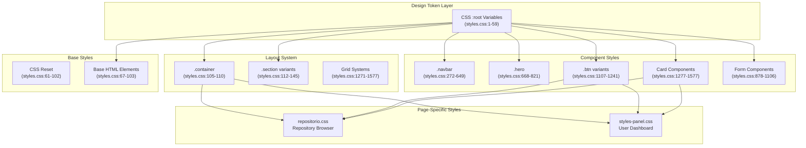

**Sources:** [src/frontend/inicio/css/styles.css L1-L3000](https://github.com/axchisan/El-rincon-de-ADSO/blob/3e310227/src/frontend/inicio/css/styles.css#L1-L3000)

 [src/frontend/repositorio/css/repositorio.css L1-L1700](https://github.com/axchisan/El-rincon-de-ADSO/blob/3e310227/src/frontend/repositorio/css/repositorio.css#L1-L1700)

 [src/frontend/panel/css/styles-panel.css L1-L2500](https://github.com/axchisan/El-rincon-de-ADSO/blob/3e310227/src/frontend/panel/css/styles-panel.css#L1-L2500)

---

## Design Tokens (CSS Custom Properties)

All design tokens are defined as CSS custom properties in the `:root` selector, making them globally accessible throughout the application.

### Color Palette

The platform uses a coffee-themed color system with warm, earthy tones:

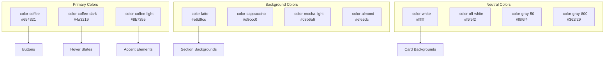

**Color Variable Definitions:**

| Variable Name | Hex Value | Usage |
| --- | --- | --- |
| `--color-coffee` | `#654321` | Primary buttons, headings, borders |
| `--color-coffee-dark` | `#4a3219` | Button hover states, dark accents |
| `--color-coffee-light` | `#8b7355` | Secondary elements, gradients |
| `--color-latte` | `#e6d9cc` | Section backgrounds, hover backgrounds |
| `--color-cappuccino` | `#d8ccc0` | Alternative backgrounds |
| `--color-mocha-light` | `#c8b6a6` | Tertiary backgrounds |
| `--color-almond` | `#efe5dc` | Body background |
| `--color-white` | `#ffffff` | Card backgrounds, text on dark |
| `--color-off-white` | `#f9f5f2` | Input backgrounds |

**Gray Scale** (warm-toned):

| Variable | Hex | Usage |
| --- | --- | --- |
| `--color-gray-50` | `#f9f6f4` | Lightest backgrounds |
| `--color-gray-100` | `#f2ede9` | Subtle backgrounds |
| `--color-gray-200` | `#e5ddd7` | Borders, dividers |
| `--color-gray-300` | `#d4c9c1` | Disabled states |
| `--color-gray-400` | `#b3a69b` | Placeholder text |
| `--color-gray-500` | `#8c7f73` | Secondary text |
| `--color-gray-600` | `#6d6258` | Body text |
| `--color-gray-700` | `#50473f` | Dark text |
| `--color-gray-800` | `#362f29` | Headings, primary text |
| `--color-gray-900` | `#211c18` | Darkest text |

**Accent Colors** (for status indicators):

| Variable | Hex | Usage |
| --- | --- | --- |
| `--color-green` | `#4caf50` | Success states, online status |
| `--color-red` | `#f44336` | Error states, notifications |
| `--color-blue` | `#2196f3` | Info states |
| `--color-amber` | `#ffc107` | Warning states |

**Sources:** [src/frontend/inicio/css/styles.css L1-L39](https://github.com/axchisan/El-rincon-de-ADSO/blob/3e310227/src/frontend/inicio/css/styles.css#L1-L39)

 [src/frontend/panel/css/styles-panel.css L1-L40](https://github.com/axchisan/El-rincon-de-ADSO/blob/3e310227/src/frontend/panel/css/styles-panel.css#L1-L40)

---

### Typography System

The typography system defines two font stacks and a comprehensive scale:

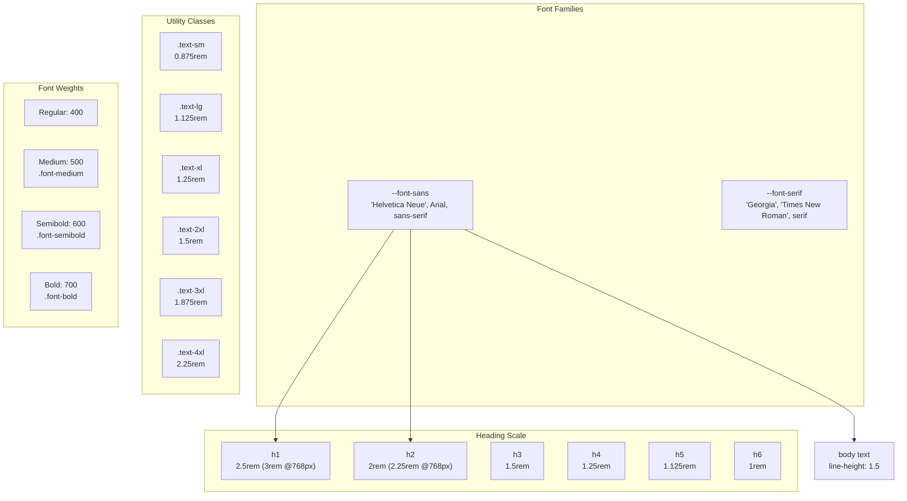

**Typography Variables:**

```
--font-serif: "Georgia", "Times New Roman", serif;
--font-sans: "Helvetica Neue", Arial, sans-serif;
```

**Base Configuration:**

* Root font size: `16px`
* Body font: `var(--font-sans)`
* Body color: `var(--color-gray-800)`
* Line height: `1.5`
* Font smoothing: Antialiased

**Heading Styles:**

| Element | Desktop Size | Mobile Size | Line Height | Weight |
| --- | --- | --- | --- | --- |
| `h1` | `3rem` (48px) | `2.5rem` (40px) | `1.2` | `700` |
| `h2` | `2.25rem` (36px) | `2rem` (32px) | `1.2` | `700` |
| `h3` | `1.5rem` (24px) | `1.5rem` (24px) | `1.2` | `700` |
| `h4` | `1.25rem` (20px) | `1.25rem` (20px) | `1.2` | `700` |
| `h5` | `1.125rem` (18px) | `1.125rem` (18px) | `1.2` | `700` |
| `h6` | `1rem` (16px) | `1rem` (16px) | `1.2` | `700` |

**Utility Classes:**

| Class | Size | Usage |
| --- | --- | --- |
| `.text-sm` | `0.875rem` (14px) | Small text, captions |
| `.text-lg` | `1.125rem` (18px) | Emphasized body text |
| `.text-xl` | `1.25rem` (20px) | Large text |
| `.text-2xl` | `1.5rem` (24px) | Extra large text |
| `.text-3xl` | `1.875rem` (30px) | Display text |
| `.text-4xl` | `2.25rem` (36px) | Hero text |

**Weight Utilities:**

* `.font-medium` - `font-weight: 500`
* `.font-semibold` - `font-weight: 600`
* `.font-bold` - `font-weight: 700`

**Color Utilities:**

* `.text-coffee` - `color: var(--color-coffee)`
* `.text-white` - `color: var(--color-white)`
* `.text-gray` - `color: var(--color-gray-600)`
* `.text-light` - `color: var(--color-gray-400)`

**Sources:** [src/frontend/inicio/css/styles.css L40-L270](https://github.com/axchisan/El-rincon-de-ADSO/blob/3e310227/src/frontend/inicio/css/styles.css#L40-L270)

 [src/frontend/panel/css/styles-panel.css L42-L43](https://github.com/axchisan/El-rincon-de-ADSO/blob/3e310227/src/frontend/panel/css/styles-panel.css#L42-L43)

---

### Shadow System

A five-level shadow system provides depth hierarchy:

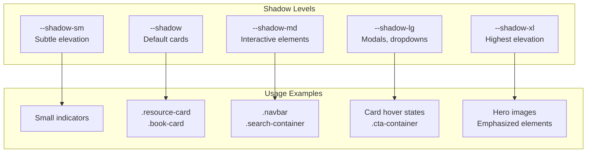

**Shadow Definitions:**

```
--shadow-sm: 0 2px 4px 0 rgba(101, 67, 33, 0.08);
--shadow: 0 2px 5px 0 rgba(101, 67, 33, 0.15), 0 1px 3px 0 rgba(101, 67, 33, 0.1);
--shadow-md: 0 5px 8px -1px rgba(101, 67, 33, 0.18), 0 3px 5px -1px rgba(101, 67, 33, 0.12);
--shadow-lg: 0 12px 18px -3px rgba(101, 67, 33, 0.2), 0 5px 8px -2px rgba(101, 67, 33, 0.15);
--shadow-xl: 0 22px 28px -5px rgba(101, 67, 33, 0.25), 0 12px 12px -5px rgba(101, 67, 33, 0.18);
```

All shadows use the coffee color (`rgba(101, 67, 33, ...)`) at varying opacities to maintain visual coherence with the color palette.

**Sources:** [src/frontend/inicio/css/styles.css L44-L49](https://github.com/axchisan/El-rincon-de-ADSO/blob/3e310227/src/frontend/inicio/css/styles.css#L44-L49)

 [src/frontend/panel/css/styles-panel.css L46-L50](https://github.com/axchisan/El-rincon-de-ADSO/blob/3e310227/src/frontend/panel/css/styles-panel.css#L46-L50)

---

### Border Radius System

A consistent border radius scale maintains visual harmony:

| Variable | Value | Usage |
| --- | --- | --- |
| `--border-radius-sm` | `0.125rem` (2px) | Small elements, toggles |
| `--border-radius` | `0.25rem` (4px) | Default radius |
| `--border-radius-md` | `0.375rem` (6px) | Buttons, inputs |
| `--border-radius-lg` | `0.5rem` (8px) | Cards, containers |
| `--border-radius-xl` | `0.75rem` (12px) | Large cards |
| `--border-radius-2xl` | `1rem` (16px) | Hero images |
| `--border-radius-full` | `9999px` | Pills, badges, avatars |

**Sources:** [src/frontend/inicio/css/styles.css L52-L58](https://github.com/axchisan/El-rincon-de-ADSO/blob/3e310227/src/frontend/inicio/css/styles.css#L52-L58)

 [src/frontend/panel/css/styles-panel.css L53-L59](https://github.com/axchisan/El-rincon-de-ADSO/blob/3e310227/src/frontend/panel/css/styles-panel.css#L53-L59)

---

## Component Library

### Button System

The button system provides multiple variants with consistent styling:

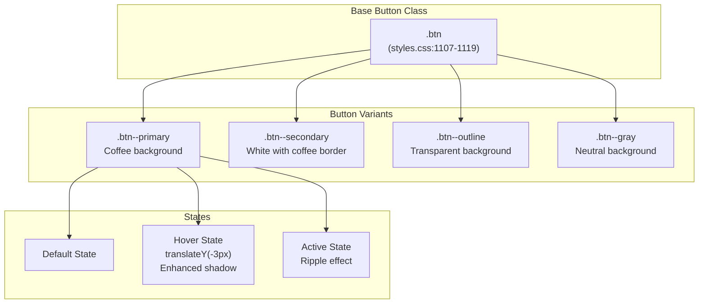

**Base Button Styles** (`.btn`):

```css
.btn {
  display: inline-block;
  padding: 0.75rem 1.5rem;
  font-weight: 500;
  text-align: center;
  border-radius: var(--border-radius-md);
  transition: all 0.3s ease;
  cursor: pointer;
  border: 2px solid transparent;
  letter-spacing: 0.5px;
  position: relative;
  overflow: hidden;
}
```

**Button Variants:**

| Class | Background | Text Color | Border | Hover Effect |
| --- | --- | --- | --- | --- |
| `.btn--primary` | `var(--color-coffee)` | White | Coffee | Darker background, lift up |
| `.btn--secondary` | White | Coffee | Coffee | Fill with coffee color |
| `.btn--outline` | Transparent | Coffee | Coffee | Light coffee background |
| `.btn--gray` | Gray-200 | Gray-800 | None | Gray-300 background |

**Interactive States:**

1. **Hover**: All buttons lift by `3px` (`translateY(-3px)`) and enhance shadows
2. **Active**: Secondary buttons show ripple animation effect
3. **Transition**: All state changes use `0.3s` ease timing

**Specialized Button Classes:**

* `.search-button` - Used in search bars, coffee-light background
* `.filter-button` - Gray background with latte hover
* `.navbar__menu-item--button` - Navigation button variant

**Sources:** [src/frontend/inicio/css/styles.css L1107-L1241](https://github.com/axchisan/El-rincon-de-ADSO/blob/3e310227/src/frontend/inicio/css/styles.css#L1107-L1241)

 [src/frontend/repositorio/css/repositorio.css L590-L657](https://github.com/axchisan/El-rincon-de-ADSO/blob/3e310227/src/frontend/repositorio/css/repositorio.css#L590-L657)

---

### Card Components

Cards are the primary content containers, with multiple specialized variants:

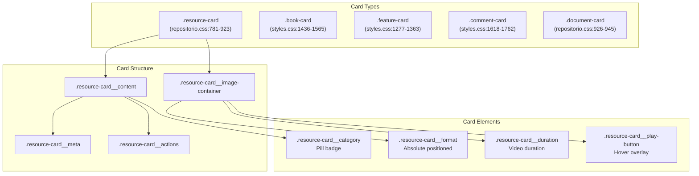

**Base Resource Card** (`.resource-card`):

```css
.resource-card {
  background-color: var(--color-white);
  border-radius: var(--border-radius-lg);
  overflow: hidden;
  box-shadow: var(--shadow-md);
  transition: all 0.3s ease;
  border: 1px solid var(--color-gray-200);
  height: 100%;
  display: flex;
  flex-direction: column;
}

.resource-card:hover {
  transform: translateY(-10px);
  box-shadow: var(--shadow-xl);
  border-color: var(--color-coffee-light);
}
```

**Card Components:**

| Component | Styles | Purpose |
| --- | --- | --- |
| `.resource-card__image-container` | `height: 200px`, `overflow: hidden` | Contains cover image |
| `.resource-card__image` | `width: 100%`, `object-fit: cover` | Cover image, scales on hover |
| `.resource-card__format` | Absolute top-right, coffee background | Shows format type (PDF, MP4, etc.) |
| `.resource-card__duration` | Absolute bottom-right, semi-transparent | Video duration display |
| `.resource-card__play-button` | Centered overlay, opacity 0 | Play button icon, visible on hover |
| `.resource-card__content` | `padding: 1.5rem`, flex column | Main content area |
| `.resource-card__category` | Pill-shaped badge, coffee background | Category indicator |
| `.resource-card__title` | `1.25rem`, coffee color | Resource title |
| `.resource-card__author` | `0.875rem`, gray-600 | Author/creator name |
| `.resource-card__meta` | Flex row, small icons + text | Views, ratings, date |
| `.resource-card__actions` | Flex column, margin-top auto | Action buttons |

**Feature Card** (`.feature-card`):

Special card variant used on landing page for feature highlights:

* Coffee top border (`4px solid`)
* Gradient background overlay on hover
* Circular icon container (`70px` diameter)
* Icon rotates `360deg` on hover

**Comment Card** (`.comment-card`):

Used for displaying user comments and feedback:

* Left coffee border (`4px`, transitions opacity)
* Avatar, username, date in header
* Star rating display
* Footer with action buttons

**Sources:** [src/frontend/repositorio/css/repositorio.css L780-L945](https://github.com/axchisan/El-rincon-de-ADSO/blob/3e310227/src/frontend/repositorio/css/repositorio.css#L780-L945)

 [src/frontend/inicio/css/styles.css L1277-L1762](https://github.com/axchisan/El-rincon-de-ADSO/blob/3e310227/src/frontend/inicio/css/styles.css#L1277-L1762)

 [src/frontend/panel/css/styles-panel.css L674-L859](https://github.com/axchisan/El-rincon-de-ADSO/blob/3e310227/src/frontend/panel/css/styles-panel.css#L674-L859)

---

### Navigation Bar

The navbar is a sticky component with responsive behavior:

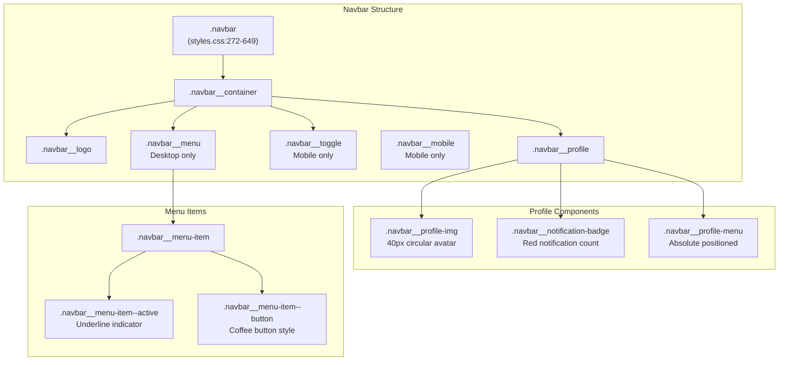

**Navbar Base Styles:**

```css
.navbar {
  position: sticky;
  top: 0;
  z-index: 100;
  background-color: var(--color-white);
  box-shadow: var(--shadow-md);
  border-bottom: 3px solid var(--color-coffee);
}
```

**Key Features:**

1. **Sticky Positioning**: Remains visible at top during scroll (`position: sticky; top: 0`)
2. **High z-index**: `z-index: 100` ensures it stays above content
3. **Coffee Border**: `3px solid` bottom border for brand consistency
4. **Responsive Toggle**: Hamburger menu appears on mobile (`< 768px`)

**Desktop Menu** (`.navbar__menu`):

* Hidden on mobile (`display: none`)
* Flex layout on desktop (`display: flex` at `768px+`)
* Horizontal menu items with hover effects

**Mobile Menu** (`.navbar__mobile`):

* Shown when toggle activated
* Full-width dropdown
* Vertical layout with left-border hover indicators

**Profile Component**:

| Element | Styles | Behavior |
| --- | --- | --- |
| `.navbar__profile-img` | `40px` circular, `border: 2px solid coffee-light` | Scales `1.1` on hover |
| `.navbar__notification-badge` | Red circle, absolute positioned top-right | Shows unread count |
| `.navbar__profile-menu` | Absolute dropdown, `display: none` by default | Toggles with `.active` class |

**Responsive Breakpoints:**

* `< 768px`: Mobile menu, toggle visible
* `>= 768px`: Desktop menu, toggle hidden
* `>= 1024px`: Larger logo and spacing

**Sources:** [src/frontend/inicio/css/styles.css L272-L649](https://github.com/axchisan/El-rincon-de-ADSO/blob/3e310227/src/frontend/inicio/css/styles.css#L272-L649)

 [src/frontend/repositorio/css/repositorio.css L96-L415](https://github.com/axchisan/El-rincon-de-ADSO/blob/3e310227/src/frontend/repositorio/css/repositorio.css#L96-L415)

 [src/frontend/panel/css/styles-panel.css L116-L272](https://github.com/axchisan/El-rincon-de-ADSO/blob/3e310227/src/frontend/panel/css/styles-panel.css#L116-L272)

---

### Form Components

Form styling focuses on accessibility and visual feedback:

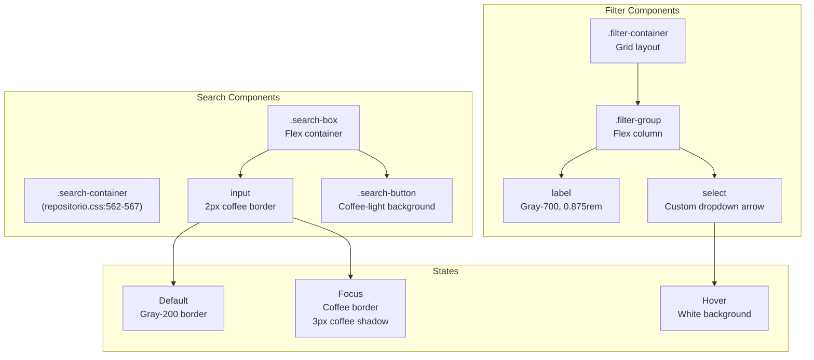

**Input Styles:**

```css
.search-box input {
  flex-grow: 1;
  padding: 0.75rem 1rem;
  border: 2px solid var(--color-gray-200);
  border-radius: var(--border-radius-md) 0 0 var(--border-radius-md);
  font-size: 1rem;
  transition: all 0.3s ease;
}

.search-box input:focus {
  outline: none;
  border-color: var(--color-coffee);
  box-shadow: 0 0 0 3px rgba(101, 67, 33, 0.1);
}
```

**Select Dropdowns:**

* Custom dropdown arrow using SVG data URI
* Background color transitions on focus
* Consistent padding: `0.75rem 1rem`
* Coffee-colored arrow icon

**Form Groups** (`.filter-group`):

* Flex column layout
* Label above input/select
* Consistent spacing with `gap` or margins

**Input States:**

| State | Border | Background | Shadow |
| --- | --- | --- | --- |
| Default | `1px solid gray-200` | `off-white` | None |
| Focus | `2px solid coffee` | `white` | `0 0 0 3px rgba(coffee, 0.1)` |
| Hover | - | `white` | - |
| Disabled | `gray-300` | `gray-100` | None |

**Sources:** [src/frontend/inicio/css/styles.css L878-L1106](https://github.com/axchisan/El-rincon-de-ADSO/blob/3e310227/src/frontend/inicio/css/styles.css#L878-L1106)

 [src/frontend/repositorio/css/repositorio.css L562-L664](https://github.com/axchisan/El-rincon-de-ADSO/blob/3e310227/src/frontend/repositorio/css/repositorio.css#L562-L664)

---

## Layout System

### Container and Section System

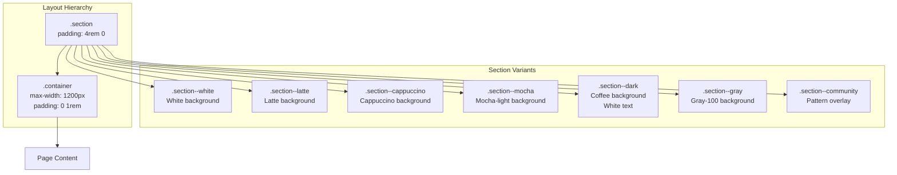

**Container Class:**

```css
.container {
  width: 100%;
  max-width: 1200px;
  margin: 0 auto;
  padding: 0 1rem;
}
```

Provides centered, constrained-width content area across all pages.

**Section System:**

Base section provides vertical spacing:

```css
.section {
  padding: 4rem 0;
}
```

**Section Background Variants:**

| Class | Background | Text Color | Use Case |
| --- | --- | --- | --- |
| `.section--white` | White | Default | Clean content areas |
| `.section--latte` | Latte (#e6d9cc) | Default | Subtle alternating sections |
| `.section--cappuccino` | Cappuccino (#d8ccc0) | Default | Warm backgrounds |
| `.section--mocha` | Mocha-light (#c8b6a6) | Default | Deeper backgrounds |
| `.section--dark` | Coffee (#654321) | White | High contrast sections |
| `.section--gray` | Gray-100 (#f2ede9) | Default | Neutral sections |
| `.section--community` | White + pattern | Default | Special decorative sections |

**Pattern Overlays:**

Several sections use SVG pattern overlays via `::before` or `::after` pseudo-elements:

```
.section--community::before {
  content: "";
  position: absolute;
  top: 0; left: 0; right: 0; bottom: 0;
  background-image: url("data:image/svg+xml,...");
  z-index: -1;
}
```

**Sources:** [src/frontend/inicio/css/styles.css L104-L156](https://github.com/axchisan/El-rincon-de-ADSO/blob/3e310227/src/frontend/inicio/css/styles.css#L104-L156)

---

### Grid Systems

Multiple grid patterns accommodate different content types:

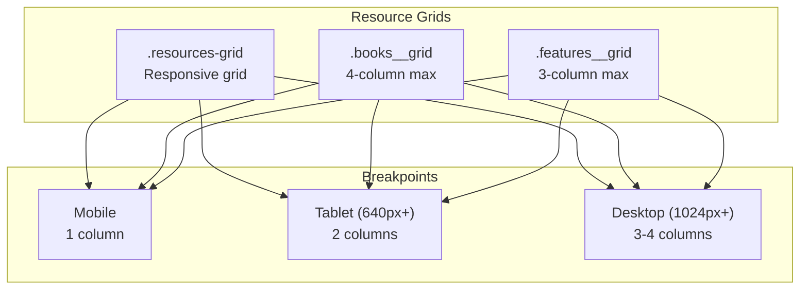

**Base Resource Grid:**

```
.resources-grid {
  display: grid;
  grid-template-columns: 1fr;
  gap: 2rem;
}

@media (min-width: 640px) {
  .resources-grid {
    grid-template-columns: repeat(2, 1fr);
  }
}

@media (min-width: 1024px) {
  .resources-grid {
    grid-template-columns: repeat(3, 1fr);
  }
}
```

**Grid Variants:**

| Grid Class | Mobile | Tablet (640px+) | Desktop (1024px+) | Gap |
| --- | --- | --- | --- | --- |
| `.resources-grid` | 1 col | 2 col | 3 col | 2rem |
| `.books__grid` | 1 col | 2 col | 4 col | 2rem |
| `.features__grid` | 1 col | 3 col | 3 col | 2rem |
| `.resources-grid--documents` | 1 col | 2 col | 3 col | 2rem |
| `.forum-topics` | 1 col | 1 col | 1 col | 1rem |

**Centering and Alignment:**

* `justify-items: center` for panel grids
* `max-width: 350px` on resource cards in panel
* `margin: 0 auto` for centered single-column layouts

**Sources:** [src/frontend/repositorio/css/repositorio.css L750-L778](https://github.com/axchisan/El-rincon-de-ADSO/blob/3e310227/src/frontend/repositorio/css/repositorio.css#L750-L778)

 [src/frontend/inicio/css/styles.css L1271-L1577](https://github.com/axchisan/El-rincon-de-ADSO/blob/3e310227/src/frontend/inicio/css/styles.css#L1271-L1577)

 [src/frontend/panel/css/styles-panel.css L655-L672](https://github.com/axchisan/El-rincon-de-ADSO/blob/3e310227/src/frontend/panel/css/styles-panel.css#L655-L672)

---

## Responsive Design Strategy

### Mobile-First Approach

The system uses a mobile-first approach where base styles target mobile devices, with progressively enhanced layouts for larger screens:

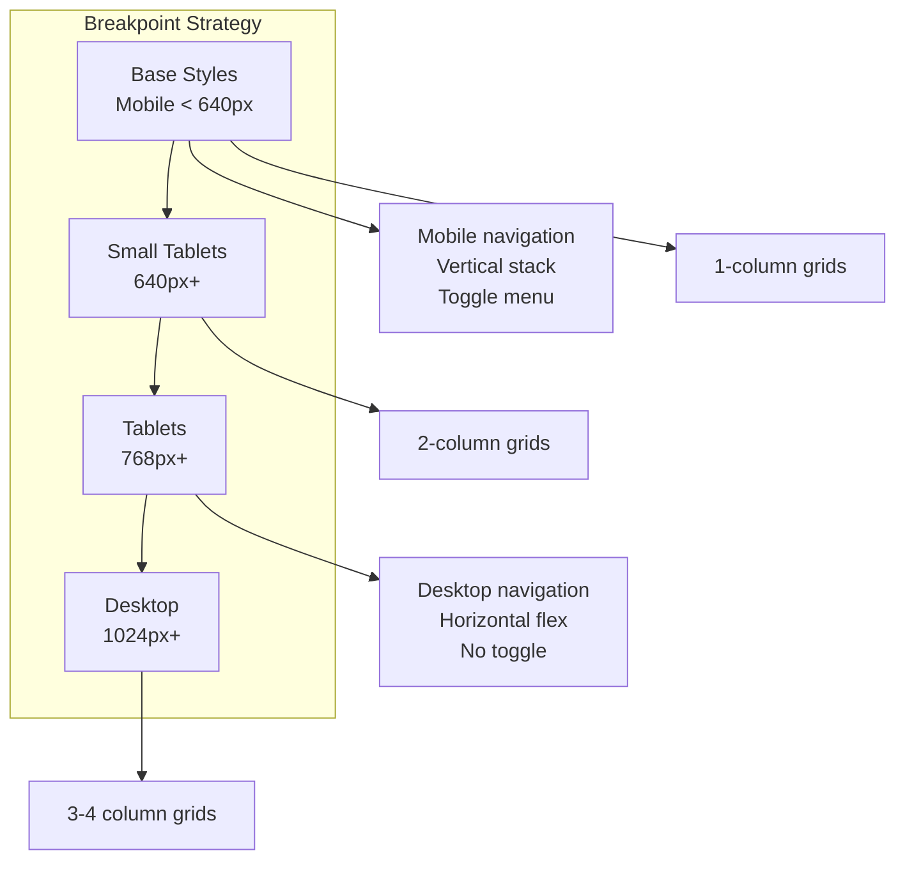

**Key Breakpoints:**

| Breakpoint | Width | Primary Changes |
| --- | --- | --- |
| Mobile Base | `< 640px` | Single column, stacked navigation, simplified layouts |
| Small | `640px+` | 2-column grids, expanded search filters |
| Medium | `768px+` | Desktop navigation, horizontal menu, hero side-by-side |
| Large | `1024px+` | 3-4 column grids, maximum spacing, largest typography |

**Component Responsiveness:**

**Navbar:**

* Mobile: Hamburger toggle, vertical dropdown menu
* Desktop (768px+): Horizontal menu, no toggle

**Hero Section:**

* Mobile: Stacked (image below text)
* Desktop (768px+): Side-by-side flex layout

**Resource Grids:**

* Mobile: 1 column
* Tablet (640px+): 2 columns
* Desktop (1024px+): 3-4 columns

**Typography:**

* `h1`: 2.5rem mobile → 3rem desktop
* `h2`: 2rem mobile → 2.25rem desktop

**Utility Classes:**

The system doesn't heavily rely on breakpoint-specific utilities, instead using responsive grid systems and component-level media queries.

**Sources:** [src/frontend/inicio/css/styles.css L197-L649](https://github.com/axchisan/El-rincon-de-ADSO/blob/3e310227/src/frontend/inicio/css/styles.css#L197-L649)

 [src/frontend/repositorio/css/repositorio.css L337-L415](https://github.com/axchisan/El-rincon-de-ADSO/blob/3e310227/src/frontend/repositorio/css/repositorio.css#L337-L415)

 [src/frontend/panel/css/styles-panel.css L259-L272](https://github.com/axchisan/El-rincon-de-ADSO/blob/3e310227/src/frontend/panel/css/styles-panel.css#L259-L272)

---

## File Organization and Usage

### Stylesheet Distribution

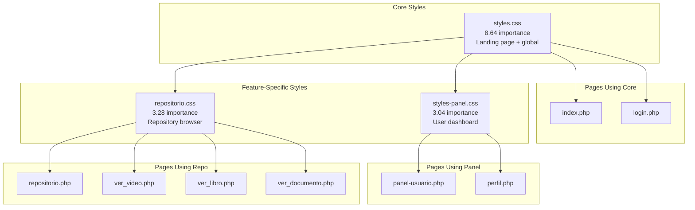

**Style Inheritance:**

1. **Core Styles** ([src/frontend/inicio/css/styles.css](https://github.com/axchisan/El-rincon-de-ADSO/blob/3e310227/src/frontend/inicio/css/styles.css) ) - Base design system * CSS variables (colors, typography, shadows, etc.) * Global resets and base element styles * Common components (navbar, buttons, cards) * Landing page specific styles (hero, features, CTA) * Footer styles
2. **Repository Styles** ([src/frontend/repositorio/css/repositorio.css](https://github.com/axchisan/El-rincon-de-ADSO/blob/3e310227/src/frontend/repositorio/css/repositorio.css) ) - Extends core * Redefines CSS variables (same values for consistency) * Repository-specific header and search components * Resource card variations * Tab navigation system * Filter components
3. **Panel Styles** ([src/frontend/panel/css/styles-panel.css](https://github.com/axchisan/El-rincon-de-ADSO/blob/3e310227/src/frontend/panel/css/styles-panel.css) ) - Extends core * Redefines CSS variables (same values) * User dashboard specific layouts * Tab navigation system (different from repo) * Empty state components * User profile header * Badge and achievement styles

**Common Pattern:**

Each stylesheet starts by redefining the CSS variables, ensuring consistency even if stylesheets are loaded independently:

```css
:root {
  --color-coffee: #654321;
  --color-coffee-dark: #4a3219;
  /* ... etc ... */
}
```

**Sources:** [src/frontend/inicio/css/styles.css L1-L3000](https://github.com/axchisan/El-rincon-de-ADSO/blob/3e310227/src/frontend/inicio/css/styles.css#L1-L3000)

 [src/frontend/repositorio/css/repositorio.css L1-L1700](https://github.com/axchisan/El-rincon-de-ADSO/blob/3e310227/src/frontend/repositorio/css/repositorio.css#L1-L1700)

 [src/frontend/panel/css/styles-panel.css L1-L2500](https://github.com/axchisan/El-rincon-de-ADSO/blob/3e310227/src/frontend/panel/css/styles-panel.css#L1-L2500)

---

## Special Effects and Animations

### Transition Patterns

Common transition patterns used throughout:

```
/* Standard interactive element */
transition: all 0.3s ease;

/* Transform-specific (better performance) */
transition: transform 0.3s ease, box-shadow 0.3s ease;

/* Smooth background changes */
transition: background-color 0.3s ease;
```

### Hover Effects

**Card Lift:**

```
.resource-card:hover {
  transform: translateY(-10px);
  box-shadow: var(--shadow-xl);
}
```

**Button Lift:**

```
.btn:hover {
  transform: translateY(-3px);
  box-shadow: 0 6px 12px rgba(101, 67, 33, 0.3);
}
```

**Image Zoom:**

```
.resource-card:hover .resource-card__image {
  transform: scale(1.1);
  filter: brightness(1.05);
}
```

**Icon Rotation:**

```
.feature-card:hover .feature-card__icon {
  transform: rotate(360deg) scale(1.1);
}
```

### Animations

**Spin Animation** (for decorative elements):

```
@keyframes spin {
  0% { transform: rotate(0deg); }
  100% { transform: rotate(360deg); }
}

.avatar-decoration {
  animation: spin 30s linear infinite;
}
```

**Ripple Effect** (for buttons):

```
@keyframes ripple {
  /* Defined in styles but not shown in provided excerpt */
}
```

**Fade In Up** (for hero sections):

```
@keyframes fadeInUp {
  0% {
    opacity: 0;
    transform: translateY(30px);
  }
  100% {
    opacity: 1;
    transform: translateY(0);
  }
}
```

**Sources:** [src/frontend/panel/css/styles-panel.css L333-L340](https://github.com/axchisan/El-rincon-de-ADSO/blob/3e310227/src/frontend/panel/css/styles-panel.css#L333-L340)

 [src/frontend/repositorio/css/repositorio.css L491-L501](https://github.com/axchisan/El-rincon-de-ADSO/blob/3e310227/src/frontend/repositorio/css/repositorio.css#L491-L501)

---

## Utility Classes

### Text Utilities

| Class | Property | Value |
| --- | --- | --- |
| `.text-center` | `text-align` | `center` |
| `.text-coffee` | `color` | `var(--color-coffee)` |
| `.text-accent` | `color` | `var(--color-coffee-light)` |
| `.text-white` | `color` | `var(--color-white)` |
| `.text-gray` | `color` | `var(--color-gray-600)` |
| `.text-light` | `color` | `var(--color-gray-400)` |
| `.uppercase` | `text-transform` | `uppercase` |

### Font Weight Utilities

| Class | Property | Value |
| --- | --- | --- |
| `.font-bold` | `font-weight` | `700` |
| `.font-semibold` | `font-weight` | `600` |
| `.font-medium` | `font-weight` | `500` |

### Display Utilities

| Class | Usage |
| --- | --- |
| `.hidden` | `display: none` - Used for mobile menu toggle |

**Sources:** [src/frontend/inicio/css/styles.css L207-L270](https://github.com/axchisan/El-rincon-de-ADSO/blob/3e310227/src/frontend/inicio/css/styles.css#L207-L270)

---

## Best Practices and Conventions

### Component Naming (BEM-like)

The codebase follows a BEM-inspired naming convention:

```
.block__element--modifier
```

Examples:

* `.navbar__logo`
* `.navbar__menu-item--active`
* `.resource-card__image-container`
* `.btn--primary`

### CSS Variable Usage

Always use CSS variables for:

* Colors (never hard-code hex values in component styles)
* Shadow levels
* Border radii
* Font families
* Common spacing values

### Hover State Patterns

Standard hover effects:

1. Lift element: `transform: translateY(-Xpx)`
2. Enhance shadow: Apply deeper shadow level
3. Color transition: Darken or lighten colors
4. Scale transforms: Usually `scale(1.05)` to `scale(1.1)`

### Z-Index Scale

Implicit z-index hierarchy:

* Navbar: `z-index: 100`
* Dropdowns/Modals: `z-index: 1000`
* Background patterns: `z-index: -1`
* Tooltips: `z-index: 1`

### Responsive Images

Images use:

```
img {
  max-width: 100%;
  height: auto;
  display: block;
}
```

### Flexbox vs Grid

* **Flexbox**: Used for component-level layouts (navbar, card content, button groups)
* **Grid**: Used for page-level layouts (resource grids, multi-column sections)

**Sources:** All CSS files referenced throughout this document