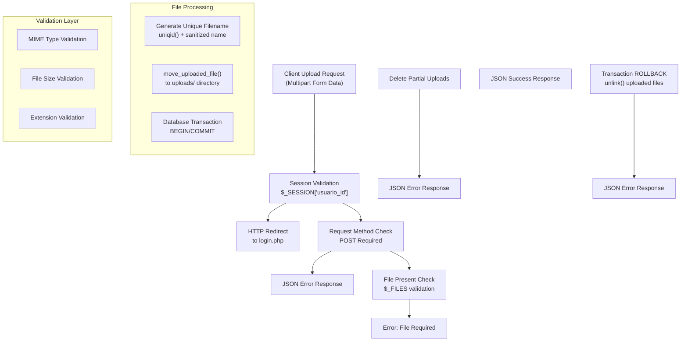
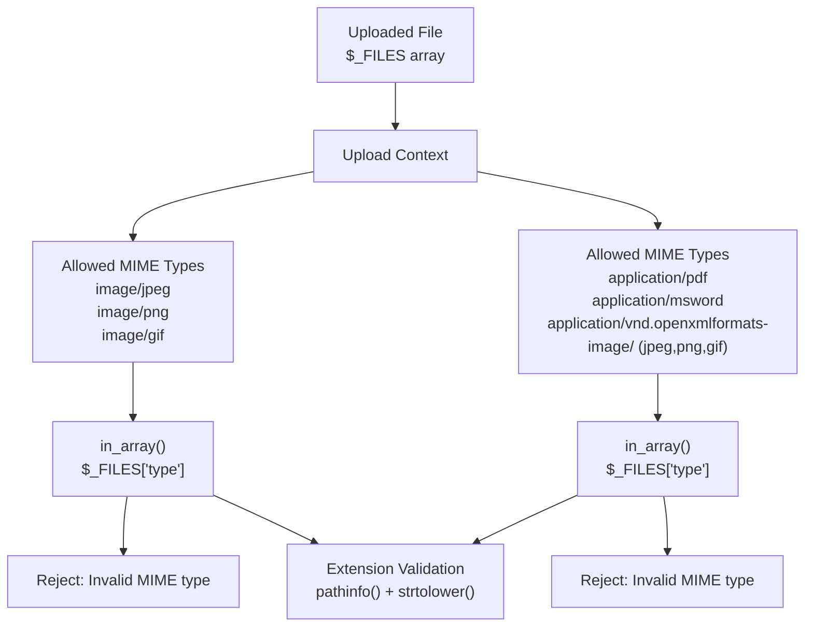
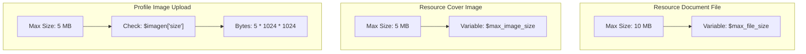
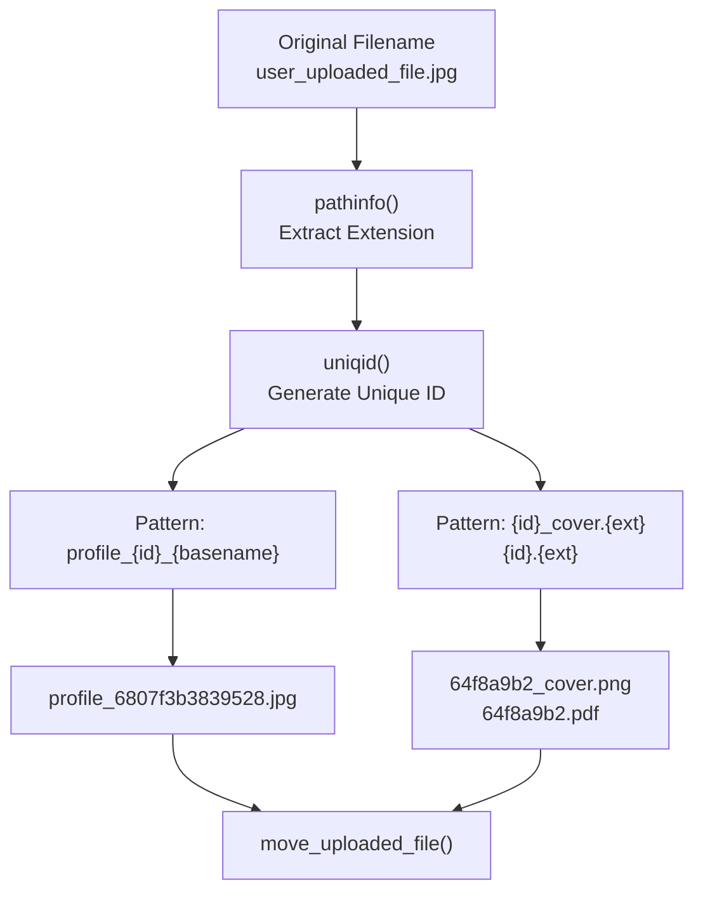
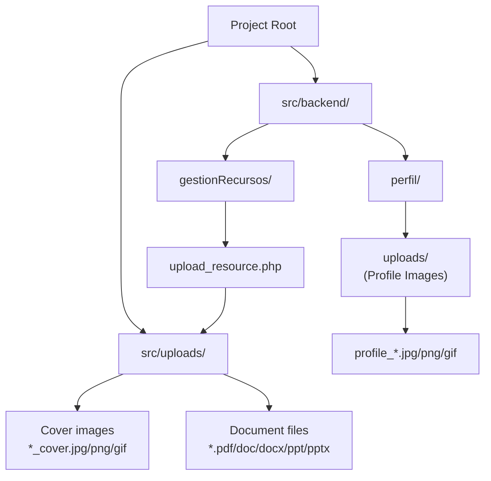
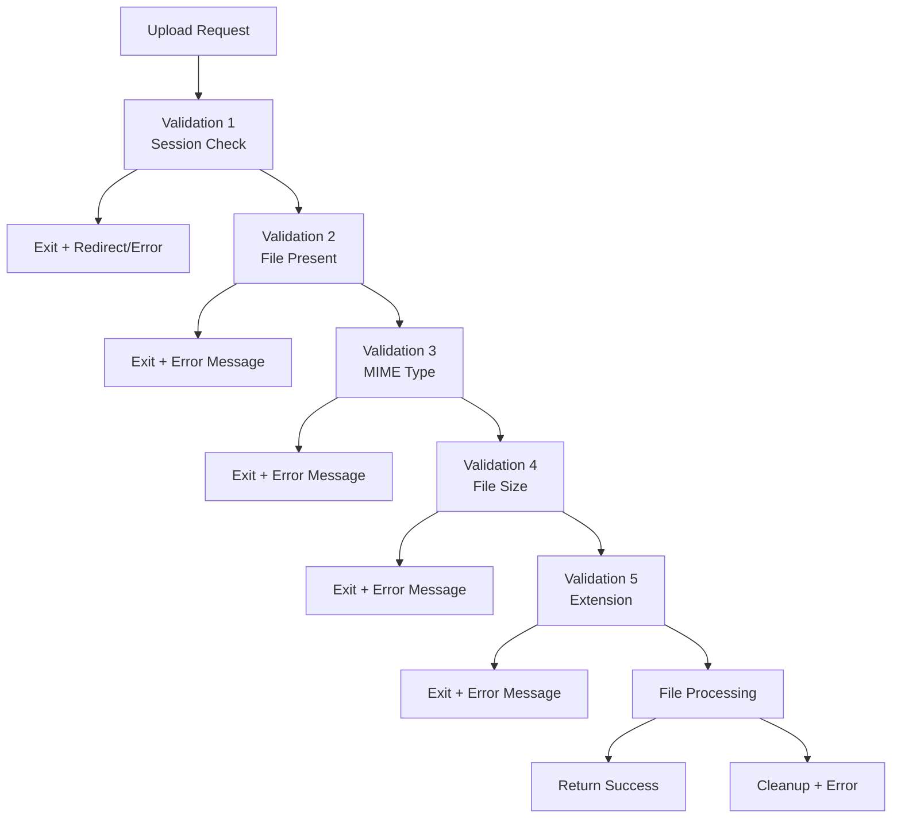
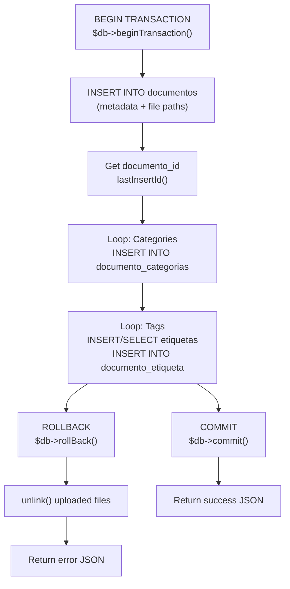
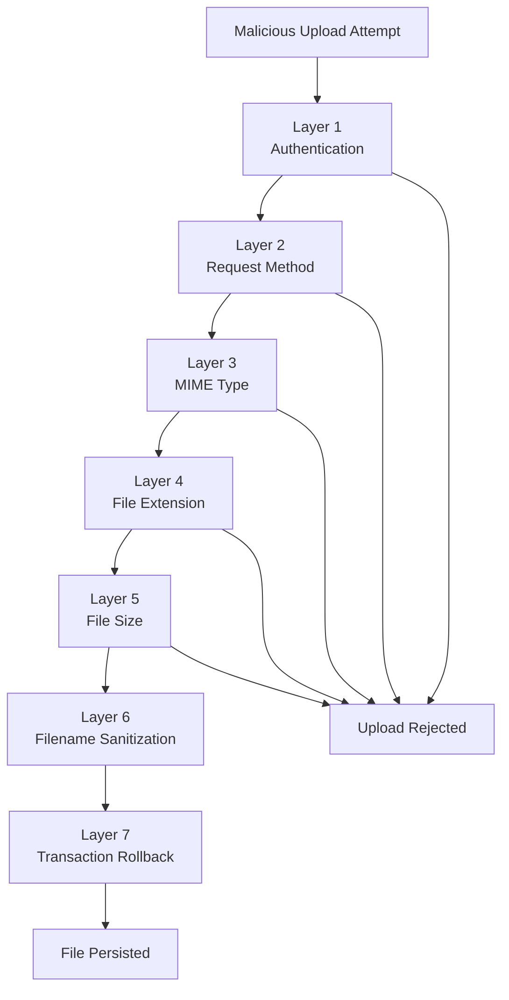

# File Upload Security

> **Relevant source files**
> * [.gitignore](https://github.com/axchisan/El-rincon-de-ADSO/blob/3e310227/.gitignore)
> * [src/backend/gestionRecursos/get_recent_resources.php](https://github.com/axchisan/El-rincon-de-ADSO/blob/3e310227/src/backend/gestionRecursos/get_recent_resources.php)
> * [src/backend/gestionRecursos/upload_resource.php](https://github.com/axchisan/El-rincon-de-ADSO/blob/3e310227/src/backend/gestionRecursos/upload_resource.php)
> * [src/backend/perfil/update.php](https://github.com/axchisan/El-rincon-de-ADSO/blob/3e310227/src/backend/perfil/update.php)
> * [src/backend/perfil/uploads/profile_6807f3b3839528.57825759.jpg](https://github.com/axchisan/El-rincon-de-ADSO/blob/3e310227/src/backend/perfil/uploads/profile_6807f3b3839528.57825759.jpg)
> * [src/backend/perfil/uploads/profile_6807f9a21b8730.38527839.jpg](https://github.com/axchisan/El-rincon-de-ADSO/blob/3e310227/src/backend/perfil/uploads/profile_6807f9a21b8730.38527839.jpg)
> * [src/backend/perfil/uploads/profile_6807f9cd029340.20664564.jpg](https://github.com/axchisan/El-rincon-de-ADSO/blob/3e310227/src/backend/perfil/uploads/profile_6807f9cd029340.20664564.jpg)

## Purpose and Scope

This document describes the security mechanisms implemented for file uploads in El Rincón de ADSO. The system supports two primary upload contexts: user profile images and educational resource files (documents, videos, images). This page focuses on security validations, file type restrictions, size limits, and safe file handling practices.

For information about the resource management workflow, see [Resource Upload and Validation](/axchisan/El-rincon-de-ADSO/5.3-resource-upload-and-validation). For profile management features, see [Profile Management](/axchisan/El-rincon-de-ADSO/4.2-profile-management).

---

## Upload Mechanisms Overview

The system implements file upload handling in two distinct backend endpoints:

| Upload Type | Handler File | Supported Formats | Max Size |
| --- | --- | --- | --- |
| Profile Images | `src/backend/perfil/update.php` | JPG, JPEG, PNG, GIF | 5 MB |
| Resource Cover Images | `src/backend/gestionRecursos/upload_resource.php` | JPEG, PNG, GIF | 5 MB |
| Resource Files | `src/backend/gestionRecursos/upload_resource.php` | PDF, DOC, DOCX, PPT, PPTX, JPEG, PNG, GIF | 10 MB |

Both endpoints implement layered security validations before persisting files to the server filesystem.

**Sources:** [src/backend/perfil/update.php L1-L173](https://github.com/axchisan/El-rincon-de-ADSO/blob/3e310227/src/backend/perfil/update.php#L1-L173)

 [src/backend/gestionRecursos/upload_resource.php L1-L218](https://github.com/axchisan/El-rincon-de-ADSO/blob/3e310227/src/backend/gestionRecursos/upload_resource.php#L1-L218)

---

## Upload Flow Architecture



**Sources:** [src/backend/perfil/update.php L11-L128](https://github.com/axchisan/El-rincon-de-ADSO/blob/3e310227/src/backend/perfil/update.php#L11-L128)

 [src/backend/gestionRecursos/upload_resource.php L7-L217](https://github.com/axchisan/El-rincon-de-ADSO/blob/3e310227/src/backend/gestionRecursos/upload_resource.php#L7-L217)

---

## Authentication and Authorization

### Session Validation

All upload endpoints enforce authentication by checking the session state before processing any file operations.

**Profile Image Upload:**

```sql
// src/backend/perfil/update.php:11-14
if (!isset($_SESSION['usuario_id'])) {
    header("Location: ../../frontend/login/login.php");
    exit();
}
```

**Resource Upload:**

```javascript
// src/backend/gestionRecursos/upload_resource.php:7-10
if (!isset($_SESSION['usuario_id'])) {
    echo json_encode(['success' => false, 'message' => 'Debes iniciar sesión...']);
    exit;
}
```

The `usuario_id` from the session is used to associate uploaded files with the authenticated user in database records [src/backend/gestionRecursos/upload_resource.php L178](https://github.com/axchisan/El-rincon-de-ADSO/blob/3e310227/src/backend/gestionRecursos/upload_resource.php#L178-L178)

### Request Method Validation

The resource upload endpoint explicitly validates that requests use the POST method [src/backend/gestionRecursos/upload_resource.php L12-L15](https://github.com/axchisan/El-rincon-de-ADSO/blob/3e310227/src/backend/gestionRecursos/upload_resource.php#L12-L15)

 rejecting all other HTTP methods to prevent CSRF-style attacks.

**Sources:** [src/backend/perfil/update.php L11-L14](https://github.com/axchisan/El-rincon-de-ADSO/blob/3e310227/src/backend/perfil/update.php#L11-L14)

 [src/backend/gestionRecursos/upload_resource.php L7-L15](https://github.com/axchisan/El-rincon-de-ADSO/blob/3e310227/src/backend/gestionRecursos/upload_resource.php#L7-L15)

---

## File Type Validation

The system implements a two-layer file type validation strategy: **MIME type checking** and **file extension validation**.

### MIME Type Validation



**Profile Image MIME Validation:**
[src/backend/perfil/update.php L109-L116](https://github.com/axchisan/El-rincon-de-ADSO/blob/3e310227/src/backend/perfil/update.php#L109-L116)

 validates extensions against `['jpg', 'jpeg', 'png', 'gif']`.

**Resource Image MIME Validation:**

```javascript
// src/backend/gestionRecursos/upload_resource.php:67-74
$allowed_image_types = ['image/jpeg', 'image/png', 'image/gif'];
if (!in_array($image['type'], $allowed_image_types)) {
    echo json_encode(['success' => false, 'message' => 'Tipo de imagen no permitido...']);
    exit;
}
```

**Resource Document MIME Validation:**
[src/backend/gestionRecursos/upload_resource.php L118-L135](https://github.com/axchisan/El-rincon-de-ADSO/blob/3e310227/src/backend/gestionRecursos/upload_resource.php#L118-L135)

 validates against:

* `application/pdf`
* `application/msword`
* `application/vnd.openxmlformats-officedocument.wordprocessingml.document`
* `application/vnd.ms-powerpoint`
* `application/vnd.openxmlformats-officedocument.presentationml.presentation`
* `image/jpeg`, `image/png`, `image/gif`

### Extension Validation

Both endpoints extract and validate file extensions using PHP's `pathinfo()` function with `PATHINFO_EXTENSION`:

```sql
// Profile uploads: src/backend/perfil/update.php:109-116
$extension = strtolower(pathinfo($imagen_nombre, PATHINFO_EXTENSION));
$extensiones_permitidas = ['jpg', 'jpeg', 'png', 'gif'];

if (!in_array($extension, $extensiones_permitidas)) {
    $_SESSION['error_message'] = "El formato de la imagen no es válido...";
    exit();
}
```

This dual validation (MIME type + extension) provides defense-in-depth against malicious file uploads that attempt to masquerade as legitimate file types.

**Sources:** [src/backend/perfil/update.php L109-L116](https://github.com/axchisan/El-rincon-de-ADSO/blob/3e310227/src/backend/perfil/update.php#L109-L116)

 [src/backend/gestionRecursos/upload_resource.php L67-L135](https://github.com/axchisan/El-rincon-de-ADSO/blob/3e310227/src/backend/gestionRecursos/upload_resource.php#L67-L135)

---

## File Size Limits



### Profile Images: 5 MB Limit

[src/backend/perfil/update.php L118-L122](https://github.com/axchisan/El-rincon-de-ADSO/blob/3e310227/src/backend/perfil/update.php#L118-L122)

 enforces a 5 MB maximum:

```
if ($imagen['size'] > 5 * 1024 * 1024) { // 5MB
    $_SESSION['error_message'] = "La imagen es demasiado grande...";
    exit();
}
```

### Resource Cover Images: 5 MB Limit

[src/backend/gestionRecursos/upload_resource.php L68-L79](https://github.com/axchisan/El-rincon-de-ADSO/blob/3e310227/src/backend/gestionRecursos/upload_resource.php#L68-L79)

 uses the same 5 MB limit:

```javascript
$max_image_size = 5 * 1024 * 1024; // 5 MB

if ($image['size'] > $max_image_size) {
    echo json_encode(['success' => false, 'message' => 'La imagen es demasiado grande...']);
    exit;
}
```

### Resource Files: 10 MB Limit

[src/backend/gestionRecursos/upload_resource.php L128-L141](https://github.com/axchisan/El-rincon-de-ADSO/blob/3e310227/src/backend/gestionRecursos/upload_resource.php#L128-L141)

 allows larger files for educational documents:

```javascript
$max_file_size = 10 * 1024 * 1024; // 10 MB

if ($file['size'] > $max_file_size) {
    unlink($image_path); // Clean up cover image
    echo json_encode(['success' => false, 'message' => 'El archivo es demasiado grande...']);
    exit;
}
```

The size validation occurs **after** MIME type validation but **before** the file is moved from the temporary upload directory, preventing large malicious files from consuming disk space.

**Sources:** [src/backend/perfil/update.php L118-L122](https://github.com/axchisan/El-rincon-de-ADSO/blob/3e310227/src/backend/perfil/update.php#L118-L122)

 [src/backend/gestionRecursos/upload_resource.php L68-L141](https://github.com/axchisan/El-rincon-de-ADSO/blob/3e310227/src/backend/gestionRecursos/upload_resource.php#L68-L141)

---

## Filename Sanitization

Both upload handlers generate unique, sanitized filenames to prevent:

* Path traversal attacks
* Filename collisions
* Information disclosure through predictable names
* Script execution via double extensions

### Unique ID Generation



### Profile Image Filename Pattern

[src/backend/perfil/update.php L106-L107](https://github.com/axchisan/El-rincon-de-ADSO/blob/3e310227/src/backend/perfil/update.php#L106-L107)

 generates:

```
$imagen_nombre = 'profile_' . uniqid() . '-' . basename($imagen['name']);
$imagen_ruta = "uploads/" . $imagen_nombre;
```

Example output: `profile_6807f3b3839528-userphoto.jpg`

### Resource File Filename Patterns

**Cover images** [src/backend/gestionRecursos/upload_resource.php L86-L88](https://github.com/axchisan/El-rincon-de-ADSO/blob/3e310227/src/backend/gestionRecursos/upload_resource.php#L86-L88)

:

```
$image_extension = pathinfo($image['name'], PATHINFO_EXTENSION);
$image_name = uniqid() . '_cover.' . $image_extension;
$image_path = $upload_dir . $image_name;
```

**Document files** [src/backend/gestionRecursos/upload_resource.php L143-L145](https://github.com/axchisan/El-rincon-de-ADSO/blob/3e310227/src/backend/gestionRecursos/upload_resource.php#L143-L145)

:

```
$file_extension = pathinfo($file['name'], PATHINFO_EXTENSION);
$file_name = uniqid() . '.' . $file_extension;
$file_path = $upload_dir . $file_name;
```

The `uniqid()` function generates a unique identifier based on the current timestamp in microseconds, making filenames unpredictable and collision-resistant.

**Sources:** [src/backend/perfil/update.php L106-L107](https://github.com/axchisan/El-rincon-de-ADSO/blob/3e310227/src/backend/perfil/update.php#L106-L107)

 [src/backend/gestionRecursos/upload_resource.php L86-L145](https://github.com/axchisan/El-rincon-de-ADSO/blob/3e310227/src/backend/gestionRecursos/upload_resource.php#L86-L145)

---

## Upload Directory Structure



### Profile Upload Directory

Profile images are stored in [src/backend/perfil/uploads/](https://github.com/axchisan/El-rincon-de-ADSO/blob/3e310227/src/backend/perfil/uploads/)

:

* Path in code: `"uploads/"` (relative to `src/backend/perfil/`)
* Full path: `src/backend/perfil/uploads/`
* Database storage: `"uploads/{filename}"` [src/backend/perfil/update.php L141](https://github.com/axchisan/El-rincon-de-ADSO/blob/3e310227/src/backend/perfil/update.php#L141-L141)

### Resource Upload Directory

Resource files are stored in a centralized uploads directory:

```
// src/backend/gestionRecursos/upload_resource.php:81-84
$upload_dir = __DIR__ . '/../../uploads/';
if (!is_dir($upload_dir)) {
    mkdir($upload_dir, 0755, true);
}
```

* Path: `src/uploads/`
* Permissions: `0755` (owner: rwx, group: r-x, world: r-x)
* Database storage: `'../../uploads/{filename}'` [src/backend/gestionRecursos/upload_resource.php L95-L153](https://github.com/axchisan/El-rincon-de-ADSO/blob/3e310227/src/backend/gestionRecursos/upload_resource.php#L95-L153)

The resource upload handler **automatically creates** the directory if it doesn't exist, with recursive directory creation (`true` flag).

**Sources:** [src/backend/perfil/update.php L107-L141](https://github.com/axchisan/El-rincon-de-ADSO/blob/3e310227/src/backend/perfil/update.php#L107-L141)

 [src/backend/gestionRecursos/upload_resource.php L81-L153](https://github.com/axchisan/El-rincon-de-ADSO/blob/3e310227/src/backend/gestionRecursos/upload_resource.php#L81-L153)

---

## Error Handling and Cleanup

### Cascading Validation with Early Exit

Both handlers implement a fail-fast approach where validation failures immediately halt processing and return error responses:



### Resource Upload Cleanup on Failure

The resource upload handler implements comprehensive cleanup when errors occur **after** files have been written to disk:

**Cover image cleanup on file validation failure** [src/backend/gestionRecursos/upload_resource.php L100-L148](https://github.com/axchisan/El-rincon-de-ADSO/blob/3e310227/src/backend/gestionRecursos/upload_resource.php#L100-L148)

:

```javascript
if (!preg_match($youtube_regex, $video_url)) {
    unlink($image_path); // Remove already-uploaded cover image
    echo json_encode(['success' => false, 'message' => '...']);
    exit;
}
```

**Database transaction rollback with file cleanup** [src/backend/gestionRecursos/upload_resource.php L213-L216](https://github.com/axchisan/El-rincon-de-ADSO/blob/3e310227/src/backend/gestionRecursos/upload_resource.php#L213-L216)

:

```javascript
} catch (PDOException $e) {
    $db->rollBack();
    if (file_exists($image_path)) unlink($image_path);
    if (isset($file_path) && file_exists($file_path)) unlink($file_path);
    echo json_encode(['success' => false, 'message' => 'Error al guardar...']);
}
```

This ensures that if the database insert fails (foreign key violations, duplicate entries, etc.), orphaned files are not left on the filesystem.

### Profile Upload Old File Deletion

The profile update handler deletes the previous profile image when a new one is uploaded [src/backend/perfil/update.php L131-L139](https://github.com/axchisan/El-rincon-de-ADSO/blob/3e310227/src/backend/perfil/update.php#L131-L139)

:

```javascript
// Obtener la imagen anterior
$query = "SELECT imagen FROM usuarios WHERE id = :id";
$stmt = $db->prepare($query);
$stmt->execute([':id' => $user_id]);
$usuario = $stmt->fetch(PDO::FETCH_ASSOC);

// Usar la ruta completa almacenada en la base de datos
if ($usuario['imagen'] && file_exists($usuario['imagen'])) {
    unlink($usuario['imagen']);
}
```

**Sources:** [src/backend/perfil/update.php L131-L139](https://github.com/axchisan/El-rincon-de-ADSO/blob/3e310227/src/backend/perfil/update.php#L131-L139)

 [src/backend/gestionRecursos/upload_resource.php L100-L216](https://github.com/axchisan/El-rincon-de-ADSO/blob/3e310227/src/backend/gestionRecursos/upload_resource.php#L100-L216)

---

## Video URL Validation

For video resources, the system accepts YouTube URLs instead of file uploads. This is validated using a regular expression pattern [src/backend/gestionRecursos/upload_resource.php L98-L109](https://github.com/axchisan/El-rincon-de-ADSO/blob/3e310227/src/backend/gestionRecursos/upload_resource.php#L98-L109)

:

```javascript
if ($resource_type === 'video') {
    if (empty($video_url)) {
        unlink($image_path);
        echo json_encode(['success' => false, 'message' => 'Debes proporcionar una URL...']);
        exit;
    }
    $youtube_regex = '/^(https?:\/\/)?(www\.)?(youtube\.com|youtu\.be)\/(watch\?v=)?([a-zA-Z0-9_-]{11})/';
    if (!preg_match($youtube_regex, $video_url)) {
        unlink($image_path);
        echo json_encode(['success' => false, 'message' => 'La URL del video no es válida...']);
        exit;
    }
    $file_url = $video_url;
}
```

The regex pattern validates:

* HTTP/HTTPS protocol
* Optional `www.` subdomain
* Domains: `youtube.com` or `youtu.be`
* Optional `watch?v=` parameter format
* 11-character video ID using alphanumeric characters, underscores, and hyphens

**Sources:** [src/backend/gestionRecursos/upload_resource.php L98-L109](https://github.com/axchisan/El-rincon-de-ADSO/blob/3e310227/src/backend/gestionRecursos/upload_resource.php#L98-L109)

---

## Transaction Safety and Atomicity

The resource upload handler wraps database operations in a transaction to ensure atomicity [src/backend/gestionRecursos/upload_resource.php L156-L217](https://github.com/axchisan/El-rincon-de-ADSO/blob/3e310227/src/backend/gestionRecursos/upload_resource.php#L156-L217)

:



**Key operations within transaction:**

1. Insert main document record [src/backend/gestionRecursos/upload_resource.php L161-L182](https://github.com/axchisan/El-rincon-de-ADSO/blob/3e310227/src/backend/gestionRecursos/upload_resource.php#L161-L182)
2. Retrieve generated `documento_id` [src/backend/gestionRecursos/upload_resource.php L182](https://github.com/axchisan/El-rincon-de-ADSO/blob/3e310227/src/backend/gestionRecursos/upload_resource.php#L182-L182)
3. Link to categories [src/backend/gestionRecursos/upload_resource.php L184-L188](https://github.com/axchisan/El-rincon-de-ADSO/blob/3e310227/src/backend/gestionRecursos/upload_resource.php#L184-L188)
4. Create or link tags [src/backend/gestionRecursos/upload_resource.php L190-L208](https://github.com/axchisan/El-rincon-de-ADSO/blob/3e310227/src/backend/gestionRecursos/upload_resource.php#L190-L208)

If any operation fails, the transaction rolls back and uploaded files are deleted to maintain consistency between the database and filesystem.

**Sources:** [src/backend/gestionRecursos/upload_resource.php L156-L217](https://github.com/axchisan/El-rincon-de-ADSO/blob/3e310227/src/backend/gestionRecursos/upload_resource.php#L156-L217)

---

## Security Best Practices Implemented

### ✅ Implemented Security Controls

| Security Control | Implementation Location | Description |
| --- | --- | --- |
| **Authentication** | All upload endpoints | Session-based user authentication required |
| **Input Validation** | Multiple validation layers | Request method, file presence, MIME type, extension, size |
| **Whitelist Approach** | MIME type and extension checks | Only explicitly allowed file types accepted |
| **Filename Sanitization** | `uniqid()` generation | Non-predictable, collision-resistant filenames |
| **File Size Limits** | Before `move_uploaded_file()` | Prevents disk exhaustion attacks |
| **Path Traversal Prevention** | `basename()` usage | Original filename not used directly |
| **Atomic Operations** | Database transactions | Rollback on failure with file cleanup |
| **Error Message Sanitization** | Generic error responses | Prevents information disclosure |
| **Old File Cleanup** | Profile updates | Prevents disk space leaks |

### Defense-in-Depth Layers



**Sources:** [src/backend/perfil/update.php L11-L172](https://github.com/axchisan/El-rincon-de-ADSO/blob/3e310227/src/backend/perfil/update.php#L11-L172)

 [src/backend/gestionRecursos/upload_resource.php L7-L217](https://github.com/axchisan/El-rincon-de-ADSO/blob/3e310227/src/backend/gestionRecursos/upload_resource.php#L7-L217)

---

## Known Limitations and Security Considerations

### 1. MIME Type Spoofing

The current implementation validates MIME types based on the `$_FILES['type']` value, which is **client-controlled** and can be spoofed. A more robust approach would use server-side detection:

```
// Not currently implemented:
$finfo = finfo_open(FILEINFO_MIME_TYPE);
$mime_type = finfo_file($finfo, $_FILES['file']['tmp_name']);
finfo_close($finfo);
```

### 2. Upload Directory Permissions

The resource upload directory is created with `0755` permissions [src/backend/gestionRecursos/upload_resource.php L83](https://github.com/axchisan/El-rincon-de-ADSO/blob/3e310227/src/backend/gestionRecursos/upload_resource.php#L83-L83)

 which makes files world-readable. Sensitive documents should use more restrictive permissions (`0750` or `0700`).

### 3. No Virus Scanning

The system does not perform antivirus scanning of uploaded files. In production, integration with ClamAV or similar tools is recommended.

### 4. Direct File Access

Uploaded files in `src/uploads/` and `src/backend/perfil/uploads/` may be directly accessible via web server if not properly configured. An `.htaccess` or nginx configuration should restrict direct access:

```xml
# .htaccess in uploads directory
<FilesMatch "\.(jpg|jpeg|png|gif|pdf|doc|docx|ppt|pptx)$">
    Require all denied
</FilesMatch>
```

### 5. No Content Security Policy

File serving does not set appropriate `Content-Type` headers or CSP directives to prevent content sniffing attacks (MIME confusion).

### 6. Cache Control Headers

Profile update endpoint sets cache control headers [src/backend/perfil/update.php L4-L7](https://github.com/axchisan/El-rincon-de-ADSO/blob/3e310227/src/backend/perfil/update.php#L4-L7)

 but uploaded file serving does not explicitly control caching behavior.

### 7. Missing Input Sanitization on Original Filenames

While original filenames are not used in stored paths, they are included in generated names for profile uploads [src/backend/perfil/update.php L106](https://github.com/axchisan/El-rincon-de-ADSO/blob/3e310227/src/backend/perfil/update.php#L106-L106)

:

```
$imagen_nombre = 'profile_' . uniqid() . '-' . basename($imagen['name']);
```

The `basename()` function provides some protection, but additional sanitization (removing special characters) would be more secure.

**Sources:** [src/backend/perfil/update.php L4-L106](https://github.com/axchisan/El-rincon-de-ADSO/blob/3e310227/src/backend/perfil/update.php#L4-L106)

 [src/backend/gestionRecursos/upload_resource.php L83](https://github.com/axchisan/El-rincon-de-ADSO/blob/3e310227/src/backend/gestionRecursos/upload_resource.php#L83-L83)

---

## File Path References in Database

### Profile Images

Stored in the `usuarios` table's `imagen` column with relative path format:

* Format: `"uploads/{filename}"`
* Example: `"uploads/profile_6807f3b3839528.jpg"`

### Resource Files

Stored in the `documentos` table:

* `portada` column: `"../../uploads/{cover_filename}"`
* `url_archivo` column: * For documents: `"../../uploads/{file_filename}"` * For videos: YouTube URL string

The relative path prefix `../../` is used because the database stores paths relative to the frontend pages that display them [src/backend/gestionRecursos/upload_resource.php L95-L153](https://github.com/axchisan/El-rincon-de-ADSO/blob/3e310227/src/backend/gestionRecursos/upload_resource.php#L95-L153)

**Sources:** [src/backend/perfil/update.php L141](https://github.com/axchisan/El-rincon-de-ADSO/blob/3e310227/src/backend/perfil/update.php#L141-L141)

 [src/backend/gestionRecursos/upload_resource.php L95-L170](https://github.com/axchisan/El-rincon-de-ADSO/blob/3e310227/src/backend/gestionRecursos/upload_resource.php#L95-L170)

---

## Summary

El Rincón de ADSO implements a multi-layered file upload security system with:

* **Strong authentication** requirements via session validation
* **Strict file type whitelisting** using MIME type and extension validation
* **Appropriate size limits** (5 MB for images, 10 MB for documents)
* **Filename sanitization** using unique IDs to prevent attacks
* **Atomic operations** with transaction rollback and file cleanup
* **Organized directory structure** with proper permission management

The implementation follows secure coding practices but has areas for improvement, particularly in MIME type detection, directory permissions, and content serving security headers.