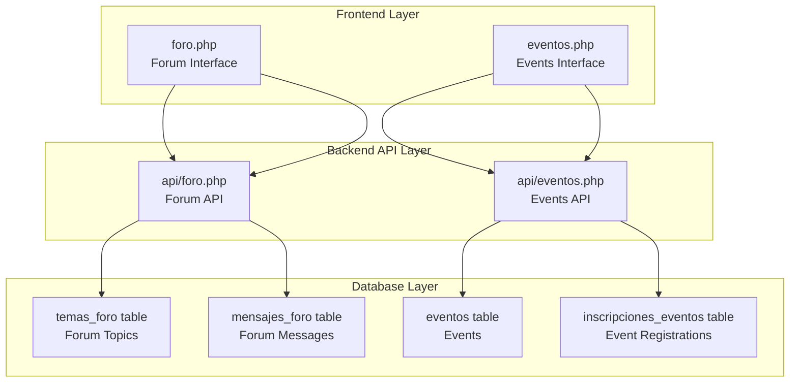
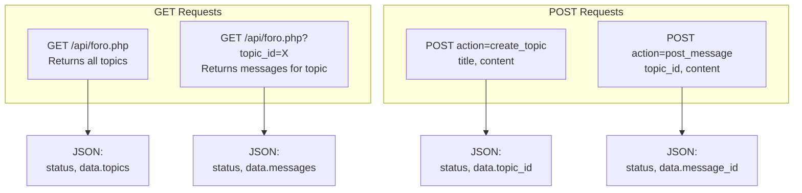
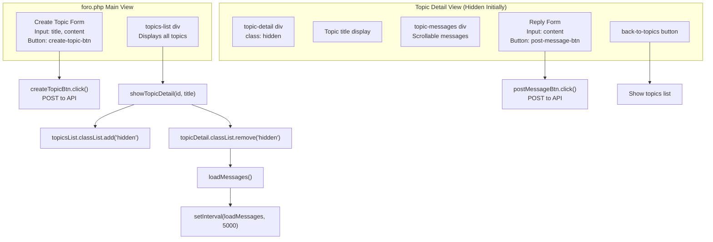
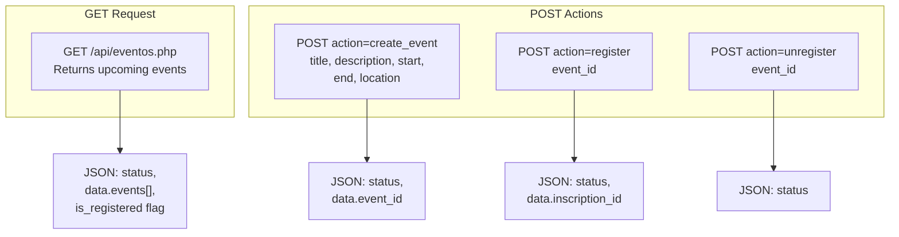
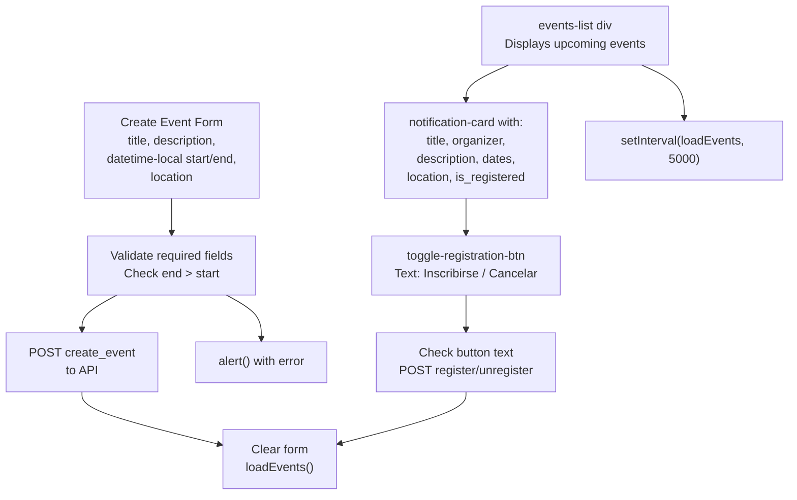
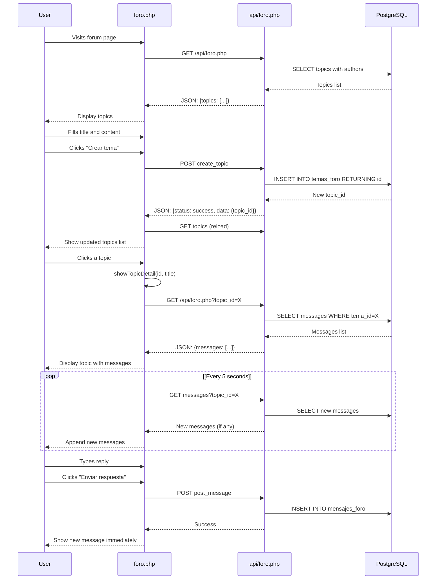
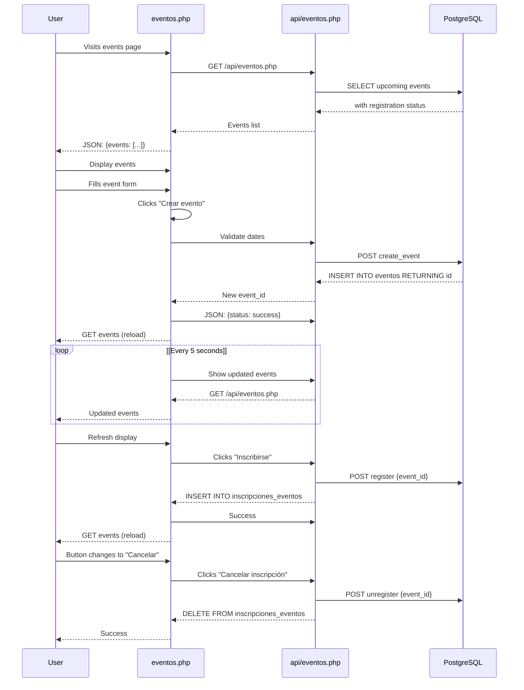

# Forums and Events

> **Relevant source files**
> * [README.md](https://github.com/axchisan/El-rincon-de-ADSO/blob/3e310227/README.md)
> * [src/backend/api/eventos.php](https://github.com/axchisan/El-rincon-de-ADSO/blob/3e310227/src/backend/api/eventos.php)
> * [src/backend/api/foro.php](https://github.com/axchisan/El-rincon-de-ADSO/blob/3e310227/src/backend/api/foro.php)
> * [src/frontend/eventos/css/style.css](https://github.com/axchisan/El-rincon-de-ADSO/blob/3e310227/src/frontend/eventos/css/style.css)
> * [src/frontend/eventos/eventos.php](https://github.com/axchisan/El-rincon-de-ADSO/blob/3e310227/src/frontend/eventos/eventos.php)
> * [src/frontend/foro/css/style.css](https://github.com/axchisan/El-rincon-de-ADSO/blob/3e310227/src/frontend/foro/css/style.css)
> * [src/frontend/foro/foro.php](https://github.com/axchisan/El-rincon-de-ADSO/blob/3e310227/src/frontend/foro/foro.php)
> * [src/frontend/inicio/img/icono.png](https://github.com/axchisan/El-rincon-de-ADSO/blob/3e310227/src/frontend/inicio/img/icono.png)
> * [src/frontend/inicio/img/inicio.png](https://github.com/axchisan/El-rincon-de-ADSO/blob/3e310227/src/frontend/inicio/img/inicio.png)
> * [src/frontend/login/img/slide1.jpg](https://github.com/axchisan/El-rincon-de-ADSO/blob/3e310227/src/frontend/login/img/slide1.jpg)
> * [src/frontend/login/img/slide2.jpg](https://github.com/axchisan/El-rincon-de-ADSO/blob/3e310227/src/frontend/login/img/slide2.jpg)
> * [src/frontend/login/img/slide3.jpg](https://github.com/axchisan/El-rincon-de-ADSO/blob/3e310227/src/frontend/login/img/slide3.jpg)
> * [src/frontend/notificaciones/css/style.css](https://github.com/axchisan/El-rincon-de-ADSO/blob/3e310227/src/frontend/notificaciones/css/style.css)

This page documents the community engagement features that allow users to create discussion topics in forums and organize/participate in events such as webinars and workshops. These features provide spaces for technical debates and community gathering.

For information about other community features like comments on resources, see [Comments and Ratings](/axchisan/El-rincon-de-ADSO/7.1-comments-and-ratings). For social features like friend management and messaging, see [Social Features](/axchisan/El-rincon-de-ADSO/6-social-features).

## Overview

The Forums and Events system consists of two independent but architecturally similar subsystems:

* **Forums (Foro)**: Discussion boards where users can create topics and post messages in threaded conversations
* **Events (Eventos)**: Event management system where users can create events and register/unregister for participation

Both subsystems use a similar architecture with dedicated frontend pages, RESTful backend APIs, PostgreSQL database tables, and real-time polling for updates.

## System Architecture



**Sources:** [src/frontend/foro/foro.php](https://github.com/axchisan/El-rincon-de-ADSO/blob/3e310227/src/frontend/foro/foro.php)

 [src/frontend/eventos/eventos.php](https://github.com/axchisan/El-rincon-de-ADSO/blob/3e310227/src/frontend/eventos/eventos.php)

 [src/backend/api/foro.php](https://github.com/axchisan/El-rincon-de-ADSO/blob/3e310227/src/backend/api/foro.php)

 [src/backend/api/eventos.php](https://github.com/axchisan/El-rincon-de-ADSO/blob/3e310227/src/backend/api/eventos.php)

## Forums System

### Database Schema

The forum system uses two primary tables:

| Table | Primary Key | Foreign Keys | Key Columns |
| --- | --- | --- | --- |
| `temas_foro` | `id` | `usuario_id` → `usuarios.id` | `titulo`, `contenido`, `fecha_creacion` |
| `mensajes_foro` | `id` | `tema_id` → `temas_foro.id``usuario_id` → `usuarios.id` | `contenido`, `fecha_creacion` |

**Sources:** [src/backend/api/foro.php L38-L44](https://github.com/axchisan/El-rincon-de-ADSO/blob/3e310227/src/backend/api/foro.php#L38-L44)

 [src/backend/api/foro.php L59-L65](https://github.com/axchisan/El-rincon-de-ADSO/blob/3e310227/src/backend/api/foro.php#L59-L65)

 [src/backend/api/foro.php L84-L100](https://github.com/axchisan/El-rincon-de-ADSO/blob/3e310227/src/backend/api/foro.php#L84-L100)

### Forum API Endpoints



**API Handler:** [src/backend/api/foro.php L24-L110](https://github.com/axchisan/El-rincon-de-ADSO/blob/3e310227/src/backend/api/foro.php#L24-L110)

#### GET: List Topics

Returns all forum topics ordered by creation date (newest first):

```sql
SELECT t.id, t.titulo, t.fecha_creacion, u.nombre_usuario AS autor 
FROM temas_foro t 
JOIN usuarios u ON t.usuario_id = u.id 
ORDER BY t.fecha_creacion DESC
```

**Sources:** [src/backend/api/foro.php L96-L103](https://github.com/axchisan/El-rincon-de-ADSO/blob/3e310227/src/backend/api/foro.php#L96-L103)

#### GET: List Messages for Topic

Returns all messages for a specific topic ordered chronologically:

```sql
SELECT m.id, m.contenido, m.fecha_creacion, u.nombre_usuario AS autor 
FROM mensajes_foro m 
JOIN usuarios u ON m.usuario_id = u.id 
WHERE m.tema_id = :tema_id 
ORDER BY m.fecha_creacion ASC
```

**Sources:** [src/backend/api/foro.php L84-L91](https://github.com/axchisan/El-rincon-de-ADSO/blob/3e310227/src/backend/api/foro.php#L84-L91)

#### POST: Create Topic

Required fields:

* `action`: "create_topic"
* `title`: Topic title
* `content`: Initial topic content

The API inserts into `temas_foro` and returns the new topic ID using PostgreSQL's `RETURNING` clause.

**Sources:** [src/backend/api/foro.php L29-L49](https://github.com/axchisan/El-rincon-de-ADSO/blob/3e310227/src/backend/api/foro.php#L29-L49)

#### POST: Post Message

Required fields:

* `action`: "post_message"
* `topic_id`: ID of the topic to post in
* `content`: Message content

**Sources:** [src/backend/api/foro.php L50-L70](https://github.com/axchisan/El-rincon-de-ADSO/blob/3e310227/src/backend/api/foro.php#L50-L70)

### Forum Frontend Implementation



**Sources:** [src/frontend/foro/foro.php L114-L149](https://github.com/axchisan/El-rincon-de-ADSO/blob/3e310227/src/frontend/foro/foro.php#L114-L149)

 [src/frontend/foro/foro.php L154-L375](https://github.com/axchisan/El-rincon-de-ADSO/blob/3e310227/src/frontend/foro/foro.php#L154-L375)

#### JavaScript Functions

The forum page implements several key JavaScript functions:

| Function | Purpose | Lines |
| --- | --- | --- |
| `formatDate()` | Formats ISO timestamps to Spanish locale | [src/frontend/foro/foro.php L169-L178](https://github.com/axchisan/El-rincon-de-ADSO/blob/3e310227/src/frontend/foro/foro.php#L169-L178) |
| `loadTopics()` | Fetches and displays forum topics | [src/frontend/foro/foro.php L181-L221](https://github.com/axchisan/El-rincon-de-ADSO/blob/3e310227/src/frontend/foro/foro.php#L181-L221) |
| `showTopicDetail()` | Switches to topic detail view | [src/frontend/foro/foro.php L224-L231](https://github.com/axchisan/El-rincon-de-ADSO/blob/3e310227/src/frontend/foro/foro.php#L224-L231) |
| `loadMessages()` | Fetches messages for current topic | [src/frontend/foro/foro.php L234-L283](https://github.com/axchisan/El-rincon-de-ADSO/blob/3e310227/src/frontend/foro/foro.php#L234-L283) |

#### Real-Time Updates

The forum implements real-time message updates using polling:

1. When viewing a topic detail, `loadMessages()` is called every 5 seconds
2. The function tracks `lastMessageId` to only append new messages
3. Messages with `id > lastMessageId` are appended to the display
4. Polling stops when user navigates back to topics list

**Sources:** [src/frontend/foro/foro.php L234-L283](https://github.com/axchisan/El-rincon-de-ADSO/blob/3e310227/src/frontend/foro/foro.php#L234-L283)

 [src/frontend/foro/foro.php L362-L368](https://github.com/axchisan/El-rincon-de-ADSO/blob/3e310227/src/frontend/foro/foro.php#L362-L368)

## Events System

### Database Schema

The events system uses two tables:

| Table | Primary Key | Foreign Keys | Key Columns |
| --- | --- | --- | --- |
| `eventos` | `id` | `organizador_id` → `usuarios.id` | `titulo`, `descripcion`, `fecha_inicio`, `fecha_fin`, `lugar`, `fecha_creacion` |
| `inscripciones_eventos` | `id` | `evento_id` → `eventos.id``usuario_id` → `usuarios.id` | Registration relationship |

**Sources:** [src/backend/api/eventos.php L42-L52](https://github.com/axchisan/El-rincon-de-ADSO/blob/3e310227/src/backend/api/eventos.php#L42-L52)

 [src/backend/api/eventos.php L66-L76](https://github.com/axchisan/El-rincon-de-ADSO/blob/3e310227/src/backend/api/eventos.php#L66-L76)

### Events API Endpoints



**Sources:** [src/backend/api/eventos.php L25-L123](https://github.com/axchisan/El-rincon-de-ADSO/blob/3e310227/src/backend/api/eventos.php#L25-L123)

#### GET: List Upcoming Events

The API returns only future events with registration status for the current user:

```sql
SELECT e.id, e.titulo, e.descripcion, e.fecha_inicio, e.fecha_fin, 
       e.lugar, e.fecha_creacion, u.nombre_usuario AS organizador,
       EXISTS (
           SELECT 1 FROM inscripciones_eventos ie 
           WHERE ie.evento_id = e.id AND ie.usuario_id = :user_id
       ) AS is_registered
FROM eventos e 
JOIN usuarios u ON e.organizador_id = u.id 
WHERE e.fecha_inicio >= CURRENT_TIMESTAMP 
ORDER BY e.fecha_inicio ASC
```

This query:

* Filters events that haven't started yet (`fecha_inicio >= CURRENT_TIMESTAMP`)
* Includes a subquery to check if the current user is registered
* Orders by start date (soonest first)

**Sources:** [src/backend/api/eventos.php L103-L115](https://github.com/axchisan/El-rincon-de-ADSO/blob/3e310227/src/backend/api/eventos.php#L103-L115)

#### POST: Create Event

Required fields:

* `action`: "create_event"
* `title`: Event title
* `start`: Start datetime

Optional fields:

* `description`: Event description
* `end`: End datetime
* `location`: Event location

**Sources:** [src/backend/api/eventos.php L29-L57](https://github.com/axchisan/El-rincon-de-ADSO/blob/3e310227/src/backend/api/eventos.php#L29-L57)

#### POST: Register for Event

Inserts a record into `inscripciones_eventos`:

```sql
INSERT INTO inscripciones_eventos (evento_id, usuario_id) 
VALUES (:evento_id, :usuario_id) RETURNING id
```

**Sources:** [src/backend/api/eventos.php L58-L76](https://github.com/axchisan/El-rincon-de-ADSO/blob/3e310227/src/backend/api/eventos.php#L58-L76)

#### POST: Unregister from Event

Deletes the user's registration:

```sql
DELETE FROM inscripciones_eventos 
WHERE evento_id = :evento_id AND usuario_id = :usuario_id
```

**Sources:** [src/backend/api/eventos.php L77-L94](https://github.com/axchisan/El-rincon-de-ADSO/blob/3e310227/src/backend/api/eventos.php#L77-L94)

### Events Frontend Implementation



**Sources:** [src/frontend/eventos/eventos.php L114-L136](https://github.com/axchisan/El-rincon-de-ADSO/blob/3e310227/src/frontend/eventos/eventos.php#L114-L136)

 [src/frontend/eventos/eventos.php L139-L300](https://github.com/axchisan/El-rincon-de-ADSO/blob/3e310227/src/frontend/eventos/eventos.php#L139-L300)

#### JavaScript Functions

| Function | Purpose | Lines |
| --- | --- | --- |
| `formatDate()` | Formats datetime to Spanish locale | [src/frontend/eventos/eventos.php L149-L158](https://github.com/axchisan/El-rincon-de-ADSO/blob/3e310227/src/frontend/eventos/eventos.php#L149-L158) |
| `loadEvents()` | Fetches and displays events | [src/frontend/eventos/eventos.php L161-L240](https://github.com/axchisan/El-rincon-de-ADSO/blob/3e310227/src/frontend/eventos/eventos.php#L161-L240) |
| Event creation handler | Validates and creates events | [src/frontend/eventos/eventos.php L243-L289](https://github.com/axchisan/El-rincon-de-ADSO/blob/3e310227/src/frontend/eventos/eventos.php#L243-L289) |
| Toggle registration handlers | Registers/unregisters from events | [src/frontend/eventos/eventos.php L208-L235](https://github.com/axchisan/El-rincon-de-ADSO/blob/3e310227/src/frontend/eventos/eventos.php#L208-L235) |

#### Event Display Logic

Each event card shows:

* Event title and organizer name
* Description (or "Sin descripción" if null)
* Start date (required)
* End date (if provided)
* Location (if provided)
* Registration button with dynamic text based on `is_registered` flag

The button appearance changes based on registration status:

* Not registered: `friend-card__action--accept` class, "Inscribirse" text
* Registered: `friend-card__action--reject` class, "Cancelar inscripción" text

**Sources:** [src/frontend/eventos/eventos.php L179-L203](https://github.com/axchisan/El-rincon-de-ADSO/blob/3e310227/src/frontend/eventos/eventos.php#L179-L203)

#### Real-Time Updates

Similar to forums, the events page polls for updates every 5 seconds to refresh the events list, ensuring users see the latest events and registration status changes.

**Sources:** [src/frontend/eventos/eventos.php L292-L293](https://github.com/axchisan/El-rincon-de-ADSO/blob/3e310227/src/frontend/eventos/eventos.php#L292-L293)

## User Flows

### Forum Topic Creation and Discussion



**Sources:** [src/frontend/foro/foro.php L181-L360](https://github.com/axchisan/El-rincon-de-ADSO/blob/3e310227/src/frontend/foro/foro.php#L181-L360)

 [src/backend/api/foro.php L24-L110](https://github.com/axchisan/El-rincon-de-ADSO/blob/3e310227/src/backend/api/foro.php#L24-L110)

### Event Creation and Registration



**Sources:** [src/frontend/eventos/eventos.php L161-L293](https://github.com/axchisan/El-rincon-de-ADSO/blob/3e310227/src/frontend/eventos/eventos.php#L161-L293)

 [src/backend/api/eventos.php L25-L123](https://github.com/axchisan/El-rincon-de-ADSO/blob/3e310227/src/backend/api/eventos.php#L25-L123)

## Authentication and Security

Both subsystems require active user sessions:

1. Session validation at page load: [src/frontend/foro/foro.php L7-L14](https://github.com/axchisan/El-rincon-de-ADSO/blob/3e310227/src/frontend/foro/foro.php#L7-L14)  [src/frontend/eventos/eventos.php L7-L14](https://github.com/axchisan/El-rincon-de-ADSO/blob/3e310227/src/frontend/eventos/eventos.php#L7-L14)
2. Session validation in API: [src/backend/api/foro.php L15-L19](https://github.com/axchisan/El-rincon-de-ADSO/blob/3e310227/src/backend/api/foro.php#L15-L19)  [src/backend/api/eventos.php L15-L19](https://github.com/axchisan/El-rincon-de-ADSO/blob/3e310227/src/backend/api/eventos.php#L15-L19)
3. User ID extracted from `$_SESSION['usuario_id']` for all operations
4. SQL injection prevention using PDO prepared statements
5. All inputs sanitized with htmlspecialchars where displayed

**Sources:** [src/backend/api/foro.php L14-L22](https://github.com/axchisan/El-rincon-de-ADSO/blob/3e310227/src/backend/api/foro.php#L14-L22)

 [src/backend/api/eventos.php L14-L22](https://github.com/axchisan/El-rincon-de-ADSO/blob/3e310227/src/backend/api/eventos.php#L14-L22)

## Styling and UI Consistency

Both forums and events pages share the same CSS design system located at:

* Forum: [src/frontend/foro/css/style.css](https://github.com/axchisan/El-rincon-de-ADSO/blob/3e310227/src/frontend/foro/css/style.css)
* Events: [src/frontend/eventos/css/style.css](https://github.com/axchisan/El-rincon-de-ADSO/blob/3e310227/src/frontend/eventos/css/style.css)

Key UI components:

* `.friend-card`: Form containers with coffee-colored theme
* `.notification-card`: Event/topic display cards
* `.friend-card__action--accept`: Primary action buttons (coffee background)
* `.friend-card__action--reject`: Secondary action buttons (white with coffee border)

The design follows the platform's coffee color scheme with:

* `--color-coffee: #654321`
* `--color-latte: #e6d9cc` for backgrounds
* Consistent hover effects and transitions

**Sources:** [src/frontend/foro/css/style.css L1-L52](https://github.com/axchisan/El-rincon-de-ADSO/blob/3e310227/src/frontend/foro/css/style.css#L1-L52)

 [src/frontend/eventos/css/style.css L1-L52](https://github.com/axchisan/El-rincon-de-ADSO/blob/3e310227/src/frontend/eventos/css/style.css#L1-L52)

## Integration with Navigation

Both pages integrate with the main navigation bar, showing:

* Active state styling for current page
* Notification badge for unread notifications
* Mobile-responsive hamburger menu
* Session-based authentication status

Navigation markup: [src/frontend/foro/foro.php L60-L104](https://github.com/axchisan/El-rincon-de-ADSO/blob/3e310227/src/frontend/foro/foro.php#L60-L104)

 [src/frontend/eventos/eventos.php L60-L104](https://github.com/axchisan/El-rincon-de-ADSO/blob/3e310227/src/frontend/eventos/eventos.php#L60-L104)