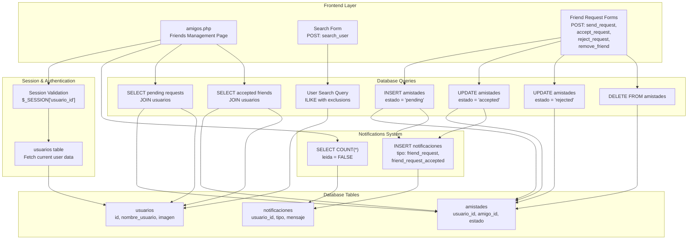
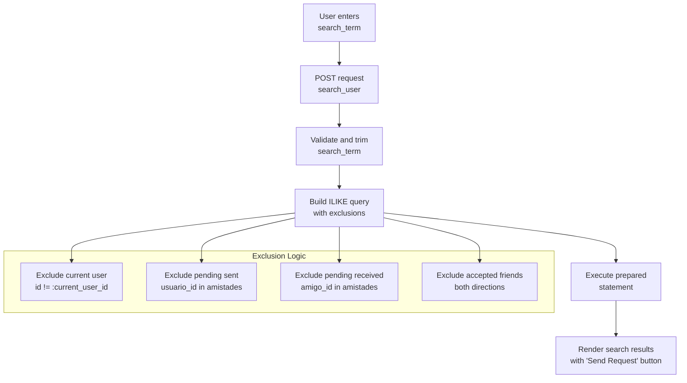
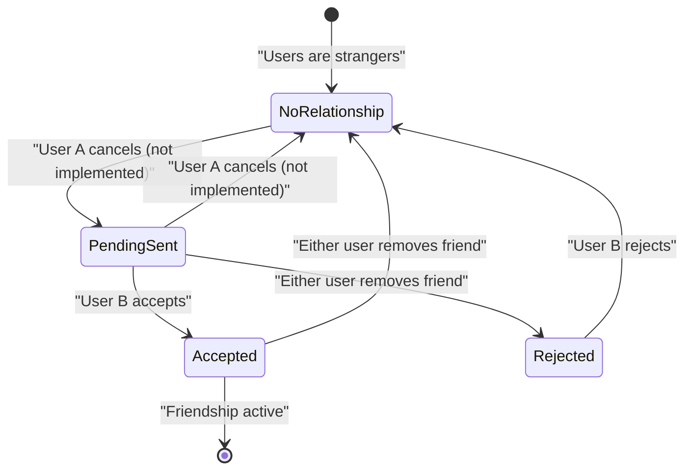
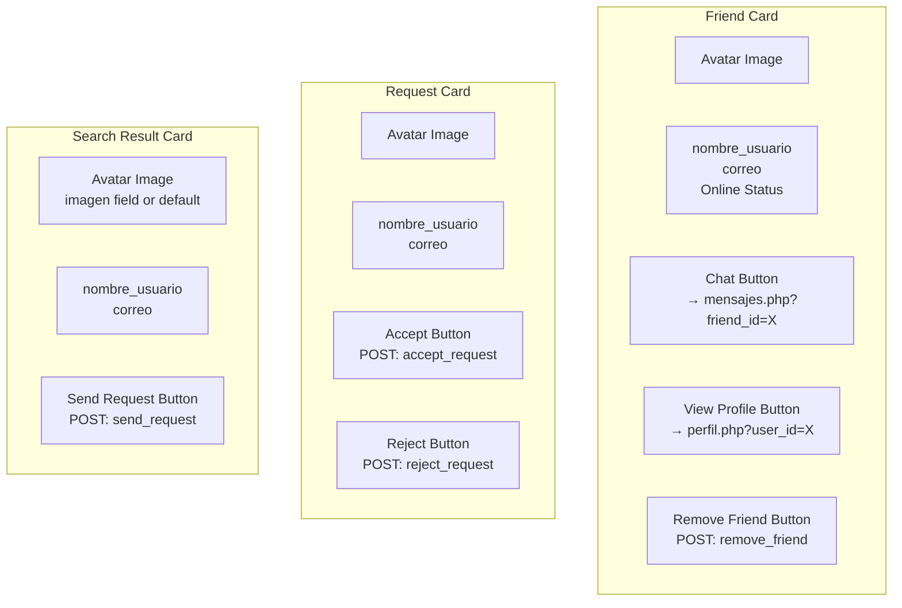

# Friends Management

> **Relevant source files**
> * [src/frontend/friends/amigos.php](https://github.com/axchisan/El-rincon-de-ADSO/blob/3e310227/src/frontend/friends/amigos.php)
> * [src/frontend/friends/css/style.css](https://github.com/axchisan/El-rincon-de-ADSO/blob/3e310227/src/frontend/friends/css/style.css)
> * [src/frontend/mensajes/mensajes.php](https://github.com/axchisan/El-rincon-de-ADSO/blob/3e310227/src/frontend/mensajes/mensajes.php)
> * [src/frontend/notificaciones/notificaciones.php](https://github.com/axchisan/El-rincon-de-ADSO/blob/3e310227/src/frontend/notificaciones/notificaciones.php)
> * [src/frontend/perfil/perfil.php](https://github.com/axchisan/El-rincon-de-ADSO/blob/3e310227/src/frontend/perfil/perfil.php)

## Purpose and Scope

This document describes the friends management system in El Rincón de ADSO, which handles user relationships and social connections. The system enables users to search for other users, send and receive friend requests, accept or reject requests, maintain a friends list, and remove friends.

For information about messaging between friends, see [Messaging System](/axchisan/El-rincon-de-ADSO/6.2-messaging-system). For details about notifications generated by friend actions, see [Notifications](/axchisan/El-rincon-de-ADSO/6.3-notifications). For profile viewing functionality, see [User Profiles](/axchisan/El-rincon-de-ADSO/6.4-user-profiles).

---

## System Overview

The friends management system is implemented primarily in `amigos.php` and uses the `amistades` database table to track friendship relationships. The system enforces a bidirectional friendship model where both users must agree to establish a connection.

### Core Components

| Component | File Path | Purpose |
| --- | --- | --- |
| Friends Interface | `src/frontend/friends/amigos.php` | Main page for managing friend relationships |
| Database Connection | `src/database/conexionDB.php` | Singleton pattern database access |
| Friendships Table | Database: `amistades` | Stores friendship state and relationships |
| Notifications Table | Database: `notificaciones` | Stores friend-related notifications |
| Styling | `src/frontend/friends/css/style.css` | CSS for friend cards and UI components |

**Sources:** [src/frontend/friends/amigos.php L1-L223](https://github.com/axchisan/El-rincon-de-ADSO/blob/3e310227/src/frontend/friends/amigos.php#L1-L223)

---

## Architecture Diagram



**Sources:** [src/frontend/friends/amigos.php L1-L223](https://github.com/axchisan/El-rincon-de-ADSO/blob/3e310227/src/frontend/friends/amigos.php#L1-L223)

---

## Session Validation and User Context

The friends management page requires an authenticated session. The system validates the user's session and retrieves user context at page load.

### Session Check

```
// Session validation
if (!isset($_SESSION['usuario_id'])) {
  error_log("Sesión no encontrada, redirigiendo a index.php");
  header("Location: ../inicio/index.php");
  exit();
}
```

**Sources:** [src/frontend/friends/amigos.php L7-L11](https://github.com/axchisan/El-rincon-de-ADSO/blob/3e310227/src/frontend/friends/amigos.php#L7-L11)

### User Data Retrieval

The system fetches the current user's information and unread notification count:

```javascript
$query = "SELECT nombre_usuario, correo FROM usuarios WHERE id = :id";
$stmt = $db->prepare($query);
$stmt->execute([':id' => $user_id]);
$usuario = $stmt->fetch(PDO::FETCH_ASSOC);

// Count unread notifications
$query = "SELECT COUNT(*) FROM notificaciones WHERE usuario_id = :user_id AND leida = FALSE";
$stmt = $db->prepare($query);
$stmt->execute([':user_id' => $user_id]);
$unread_count = $stmt->fetchColumn();
```

**Sources:** [src/frontend/friends/amigos.php L18-L36](https://github.com/axchisan/El-rincon-de-ADSO/blob/3e310227/src/frontend/friends/amigos.php#L18-L36)

---

## User Search Functionality

The search system allows users to find other users by username using case-insensitive pattern matching while excluding existing relationships.

### Search Query Flow



**Sources:** [src/frontend/friends/amigos.php L38-L73](https://github.com/axchisan/El-rincon-de-ADSO/blob/3e310227/src/frontend/friends/amigos.php#L38-L73)

### Search Query Implementation

The search query uses PostgreSQL's `ILIKE` operator for case-insensitive matching and employs multiple `NOT IN` subqueries to filter out inappropriate results:

```sql
SELECT id, nombre_usuario, correo, imagen 
FROM usuarios 
WHERE nombre_usuario ILIKE :search_term 
AND id != :current_user_id 
AND id NOT IN (SELECT amigo_id FROM amistades WHERE usuario_id = :current_user_id AND estado = 'pending')
AND id NOT IN (SELECT usuario_id FROM amistades WHERE amigo_id = :current_user_id AND estado = 'pending')
AND id NOT IN (SELECT amigo_id FROM amistades WHERE usuario_id = :current_user_id AND estado = 'accepted')
AND id NOT IN (SELECT usuario_id FROM amistades WHERE amigo_id = :current_user_id AND estado = 'accepted')
```

This ensures users cannot:

* Find themselves
* Send duplicate requests to users they've already requested
* Send requests to users who have already requested them
* Send requests to existing friends

**Sources:** [src/frontend/friends/amigos.php L42-L65](https://github.com/axchisan/El-rincon-de-ADSO/blob/3e310227/src/frontend/friends/amigos.php#L42-L65)

---

## Friend Request Workflow

### State Diagram for Friendship Relationships



**Sources:** [src/frontend/friends/amigos.php L76-L178](https://github.com/axchisan/El-rincon-de-ADSO/blob/3e310227/src/frontend/friends/amigos.php#L76-L178)

### Sending Friend Requests

When a user sends a friend request, the system:

1. Inserts a record in `amistades` with `estado = 'pending'`
2. Creates a notification for the recipient
3. Redirects to prevent form resubmission

```javascript
// Insert friendship request
$query = "INSERT INTO amistades (usuario_id, amigo_id, estado) 
          VALUES (:sender_id, :receiver_id, 'pending')";
$stmt = $db->prepare($query);
$stmt->execute([
  ':sender_id' => $user_id,
  ':receiver_id' => $receiver_id
]);

// Create notification
$query = "INSERT INTO notificaciones (usuario_id, tipo, relacionado_id, mensaje) 
          VALUES (:receiver_id, 'friend_request', :sender_id, :message)";
$stmt = $db->prepare($query);
$stmt->execute([
  ':receiver_id' => $receiver_id,
  ':sender_id' => $user_id,
  ':message' => "Tienes una nueva solicitud de amistad de $sender_name."
]);
```

**Sources:** [src/frontend/friends/amigos.php L76-L108](https://github.com/axchisan/El-rincon-de-ADSO/blob/3e310227/src/frontend/friends/amigos.php#L76-L108)

### Accepting Friend Requests

Accepting a request updates the `estado` field to `'accepted'` and generates a notification for the original sender:

```javascript
// Update friendship status
$query = "UPDATE amistades 
          SET estado = 'accepted', fecha_creacion = CURRENT_TIMESTAMP 
          WHERE usuario_id = :sender_id AND amigo_id = :receiver_id AND estado = 'pending'";
$stmt = $db->prepare($query);
$stmt->execute([
  ':sender_id' => $sender_id,
  ':receiver_id' => $user_id
]);

// Notify original sender
$query = "INSERT INTO notificaciones (usuario_id, tipo, relacionado_id, mensaje) 
          VALUES (:sender_id, 'friend_request_accepted', :receiver_id, :message)";
```

**Sources:** [src/frontend/friends/amigos.php L111-L142](https://github.com/axchisan/El-rincon-de-ADSO/blob/3e310227/src/frontend/friends/amigos.php#L111-L142)

### Rejecting Friend Requests

Rejecting a request updates the `estado` to `'rejected'` but does not create a notification:

```sql
$query = "UPDATE amistades 
          SET estado = 'rejected', fecha_creacion = CURRENT_TIMESTAMP 
          WHERE usuario_id = :sender_id AND amigo_id = :receiver_id AND estado = 'pending'";
```

**Sources:** [src/frontend/friends/amigos.php L145-L160](https://github.com/axchisan/El-rincon-de-ADSO/blob/3e310227/src/frontend/friends/amigos.php#L145-L160)

### Removing Friends

The remove friend operation deletes the relationship from the `amistades` table. The query handles both directions of the friendship:

```sql
$query = "DELETE FROM amistades 
          WHERE (usuario_id = :user_id AND amigo_id = :friend_id AND estado = 'accepted') 
             OR (usuario_id = :friend_id AND amigo_id = :user_id AND estado = 'accepted')";
```

This ensures the friendship is removed regardless of which user originally sent the request.

**Sources:** [src/frontend/friends/amigos.php L163-L178](https://github.com/axchisan/El-rincon-de-ADSO/blob/3e310227/src/frontend/friends/amigos.php#L163-L178)

---

## Data Retrieval Queries

### Pending Friend Requests

The system retrieves all pending requests where the current user is the recipient:

```sql
$query = "SELECT a.id, a.usuario_id AS sender_id, u.nombre_usuario, u.correo, u.imagen 
          FROM amistades a 
          JOIN usuarios u ON a.usuario_id = u.id 
          WHERE a.amigo_id = :user_id AND a.estado = 'pending'";
```

This query:

* Joins the `amistades` table with `usuarios` to get sender information
* Filters for records where the current user is the `amigo_id` (recipient)
* Only includes `'pending'` status requests

**Sources:** [src/frontend/friends/amigos.php L181-L187](https://github.com/axchisan/El-rincon-de-ADSO/blob/3e310227/src/frontend/friends/amigos.php#L181-L187)

### Friends List Retrieval

The friends list query handles bidirectional relationships:

```sql
$query = "SELECT u.id, u.nombre_usuario, u.correo, u.ultima_conexion, u.imagen 
          FROM amistades a 
          JOIN usuarios u ON (u.id = a.usuario_id OR u.id = a.amigo_id) 
          WHERE ((a.usuario_id = :user_id AND u.id = a.amigo_id) OR (a.amigo_id = :user_id AND u.id = a.usuario_id)) 
          AND a.estado = 'accepted'";
```

This complex query:

* Joins users where they appear in either position of the friendship
* Filters to ensure the current user is one party and the returned user is the other
* Only includes accepted friendships
* Retrieves `ultima_conexion` for online status calculation

**Sources:** [src/frontend/friends/amigos.php L190-L197](https://github.com/axchisan/El-rincon-de-ADSO/blob/3e310227/src/frontend/friends/amigos.php#L190-L197)

---

## Online Status Detection

The system determines whether a friend is online based on their last connection timestamp.

### Status Calculation Function

```javascript
function getOnlineStatus($lastConnection) {
  if (is_null($lastConnection)) {
    return ['is_online' => false, 'status_text' => 'Última conexión: Desconocida'];
  }

  $lastConnectionTime = new DateTime($lastConnection);
  $currentTime = new DateTime();
  $interval = $currentTime->diff($lastConnectionTime);
  $minutes = $interval->days * 24 * 60 + $interval->h * 60 + $interval->i;

  if ($minutes <= 5) {
    return ['is_online' => true, 'status_text' => 'En línea'];
  } else {
    $formattedTime = $lastConnectionTime->format('d/m/Y H:i');
    return ['is_online' => false, 'status_text' => "Última conexión: $formattedTime"];
  }
}
```

The function returns an array with:

* `is_online`: Boolean indicating if the user was active in the last 5 minutes
* `status_text`: Human-readable status string

**Sources:** [src/frontend/friends/amigos.php L200-L216](https://github.com/axchisan/El-rincon-de-ADSO/blob/3e310227/src/frontend/friends/amigos.php#L200-L216)

### Online Status Threshold

| Condition | Online Status | Display Text |
| --- | --- | --- |
| `$lastConnection` is `NULL` | Offline | "Última conexión: Desconocida" |
| Last activity ≤ 5 minutes | Online | "En línea" |
| Last activity > 5 minutes | Offline | "Última conexión: DD/MM/YYYY HH:MM" |

**Sources:** [src/frontend/friends/amigos.php L200-L216](https://github.com/axchisan/El-rincon-de-ADSO/blob/3e310227/src/frontend/friends/amigos.php#L200-L216)

---

## User Interface Components

### Friend Card Structure

The system renders three types of cards:

1. **Search Result Card** - Displays users found in search with "Send Request" button
2. **Request Card** - Shows pending requests with "Accept" and "Reject" buttons
3. **Friend Card** - Displays accepted friends with "Chat", "View Profile", and "Remove Friend" buttons



**Sources:** [src/frontend/friends/amigos.php L300-L393](https://github.com/axchisan/El-rincon-de-ADSO/blob/3e310227/src/frontend/friends/amigos.php#L300-L393)

### Avatar Image Resolution

Avatar images are displayed using a fallback mechanism:

```php
" alt="Avatar">
```

The system:

1. Uses the `imagen` field from `usuarios` table if available
2. Appends a cache-busting timestamp (`?v=` parameter)
3. Falls back to Pravatar service using user ID if no custom image exists

**Sources:** [src/frontend/friends/amigos.php L368](https://github.com/axchisan/El-rincon-de-ADSO/blob/3e310227/src/frontend/friends/amigos.php#L368-L368)

---

## Integration Points

### Navigation to Related Features

The friend cards provide direct navigation to integrated social features:

| Action | Target Page | Query Parameter | Purpose |
| --- | --- | --- | --- |
| Chatear | `../mensajes/mensajes.php` | `friend_id` | Opens chat conversation |
| Ver perfil | `../perfil/perfil.php` | `user_id` | Displays friend's profile |
| Notificaciones | `../notificaciones/notificaciones.php` | None | Shows notification badge |

**Sources:** [src/frontend/friends/amigos.php L378-L382](https://github.com/axchisan/El-rincon-de-ADSO/blob/3e310227/src/frontend/friends/amigos.php#L378-L382)

### Notification Badge Display

The navbar displays unread notification count across all pages:

```php
<?php if ($unread_count > 0): ?>
  <span class="notification-badge"><?php echo $unread_count; ?></span>
<?php endif; ?>
```

This badge appears in both desktop and mobile navigation menus.

**Sources:** [src/frontend/friends/amigos.php L251-L253](https://github.com/axchisan/El-rincon-de-ADSO/blob/3e310227/src/frontend/friends/amigos.php#L251-L253)

---

## Database Schema Requirements

### amistades Table Structure

The friends system requires the following schema for the `amistades` table:

| Column | Type | Constraints | Purpose |
| --- | --- | --- | --- |
| `id` | SERIAL | PRIMARY KEY | Unique identifier |
| `usuario_id` | INTEGER | FOREIGN KEY → usuarios(id) | Friend request sender |
| `amigo_id` | INTEGER | FOREIGN KEY → usuarios(id) | Friend request recipient |
| `estado` | VARCHAR | CHECK ('pending', 'accepted', 'rejected') | Friendship status |
| `fecha_creacion` | TIMESTAMP | DEFAULT CURRENT_TIMESTAMP | Request/acceptance timestamp |

### Bidirectional Relationship Model

Friendships are stored as a single directional record where:

* `usuario_id` = user who initiated the request
* `amigo_id` = user who received the request
* Queries must check both directions to retrieve all friends

**Sources:** [src/frontend/friends/amigos.php L42-L197](https://github.com/axchisan/El-rincon-de-ADSO/blob/3e310227/src/frontend/friends/amigos.php#L42-L197)

---

## Security Considerations

### SQL Injection Prevention

All database queries use PDO prepared statements with parameter binding:

```javascript
$stmt = $db->prepare($query);
$stmt->execute([':user_id' => $user_id]);
```

**Sources:** [src/frontend/friends/amigos.php L19-L20](https://github.com/axchisan/El-rincon-de-ADSO/blob/3e310227/src/frontend/friends/amigos.php#L19-L20)

### XSS Prevention

All user-generated content is escaped before rendering:

```
$nombre_usuario = htmlspecialchars($usuario['nombre_usuario']);
```

**Sources:** [src/frontend/friends/amigos.php L29](https://github.com/axchisan/El-rincon-de-ADSO/blob/3e310227/src/frontend/friends/amigos.php#L29-L29)

### Authorization Checks

The system validates session existence before allowing any operations:

* Redirects to login if `$_SESSION['usuario_id']` is not set
* Uses session user ID for all relationship queries
* Does not rely on client-provided user IDs for authorization

**Sources:** [src/frontend/friends/amigos.php L7-L11](https://github.com/axchisan/El-rincon-de-ADSO/blob/3e310227/src/frontend/friends/amigos.php#L7-L11)

---

## Form Submission Patterns

All friend management actions use POST forms with hidden fields to prevent CSRF and ensure proper action routing:

```php
<form method="POST">
  <input type="hidden" name="receiver_id" value="<?php echo $result['id']; ?>">
  <button type="submit" name="send_request" class="friend-card__action friend-card__action--accept">
    Enviar Solicitud
  </button>
</form>
```

The system uses named submit buttons (`send_request`, `accept_request`, `reject_request`, `remove_friend`) to differentiate actions in the same PHP file.

**Sources:** [src/frontend/friends/amigos.php L313-L318](https://github.com/axchisan/El-rincon-de-ADSO/blob/3e310227/src/frontend/friends/amigos.php#L313-L318)

---

## Responsive Design

The CSS implements mobile-first responsive design for friend cards:

```
@media (max-width: 640px) {
  .friend-card,
  .request-card {
    flex-direction: column;
    align-items: flex-start;
  }

  .friend-card__actions,
  .request-card__actions {
    width: 100%;
    flex-direction: column;
  }

  .friend-card__action,
  .request-card__action {
    width: 100%;
    text-align: center;
  }
}
```

On mobile devices, cards stack vertically and action buttons become full-width.

**Sources:** [src/frontend/friends/css/style.css L518-L536](https://github.com/axchisan/El-rincon-de-ADSO/blob/3e310227/src/frontend/friends/css/style.css#L518-L536)

---

## Error Handling

### Database Error Handling

The system uses a try-catch block to handle PDO exceptions:

```
try {
  $db = conexionDB::getConexion();
  // ... database operations
} catch (PDOException $e) {
  error_log("Error de base de datos: " . $e->getMessage());
  header("Location: ../inicio/index.php");
  exit();
}
```

Errors are logged and users are redirected to the home page.

**Sources:** [src/frontend/friends/amigos.php L13-L222](https://github.com/axchisan/El-rincon-de-ADSO/blob/3e310227/src/frontend/friends/amigos.php#L13-L222)

### Post-Redirect-Get Pattern

After successful form submissions, the system redirects to prevent duplicate submissions:

```
header("Location: amigos.php");
exit();
```

This ensures users can refresh the page without resubmitting forms.

**Sources:** [src/frontend/friends/amigos.php L106-L107](https://github.com/axchisan/El-rincon-de-ADSO/blob/3e310227/src/frontend/friends/amigos.php#L106-L107)