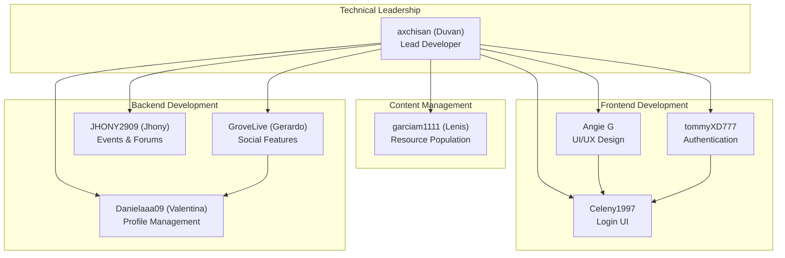
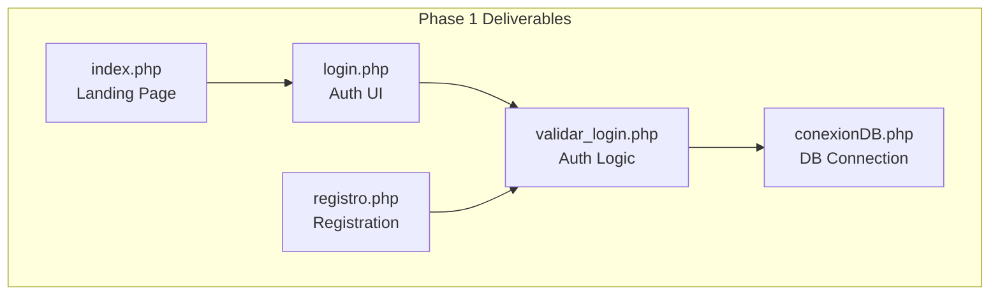
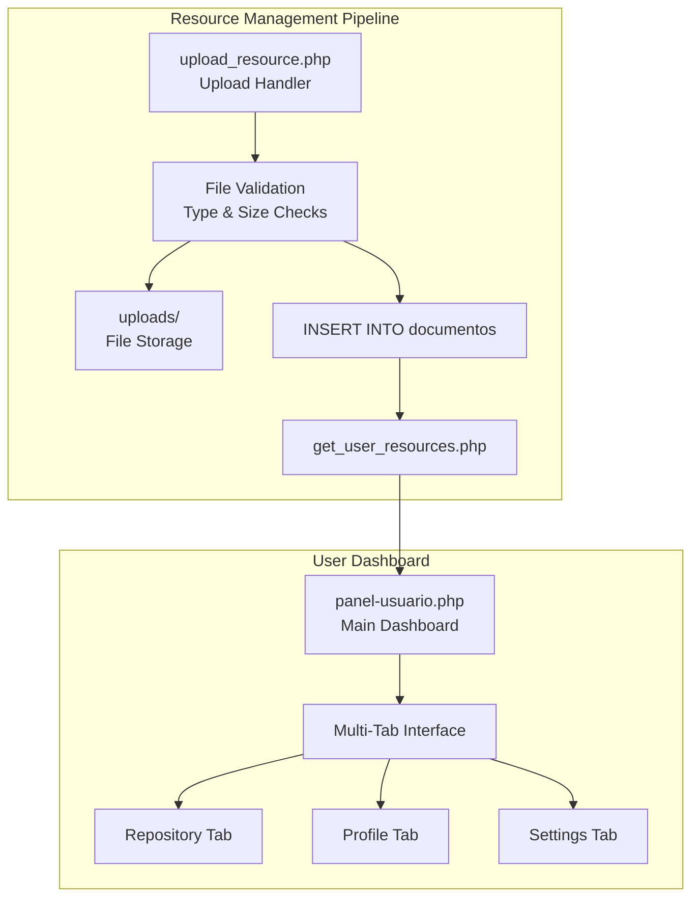
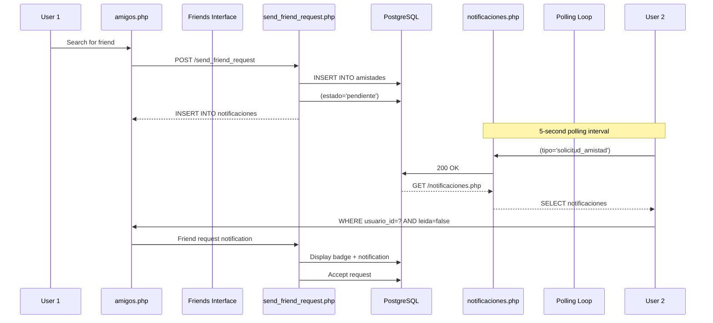
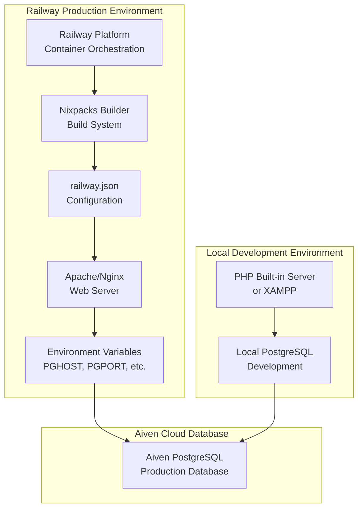
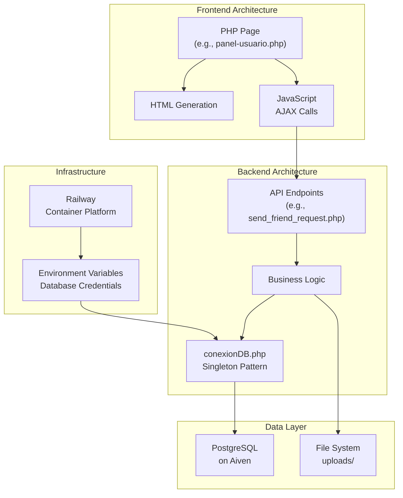

# Historia y desarrollo del proyecto

> **Archivos fuente relevantes**
> * [documentos/Front End por Angie.pdf](https://github.com/axchisan/El-rincon-de-ADSO/blob/3e310227/docs/Front End by-Angie.pdf)
> * [docs/INFORME DANIELA.pdf](https://github.com/axchisan/El-rincon-de-ADSO/blob/3e310227/docs/INFORME DANIELA.pdf)
> * [docs/Informe Gerardo.pdf](https://github.com/axchisan/El-rincon-de-ADSO/blob/3e310227/docs/Informe Gerardo.pdf)
> * [docs/informe-bitacora-de-contribuciones-duvan-250502_1414.pdf](https://github.com/axchisan/El-rincon-de-ADSO/blob/3e310227/docs/informe-bitacora-de-contribuciones-duvan-250502_1414.pdf)
> * [docs/informe-estructuracion-del-proyecto-repositorio-250502_1416.pdf](https://github.com/axchisan/El-rincon-de-ADSO/blob/3e310227/docs/informe-estructuracion-del-proyecto-repositorio-250502_1416.pdf)
> * [docs/informe-general-250502_1431.pdf](https://github.com/axchisan/El-rincon-de-ADSO/blob/3e310227/docs/informe-general-250502_1431.pdf)
> * [docs/informeJhonyProyecto (2).pdf](https://github.com/axchisan/El-rincon-de-ADSO/blob/3e310227/docs/informeJhonyProyecto (2).pdf)
> 
> pdf)
> * [historial_commits.txt](https://github.com/axchisan/El-rincon-de-ADSO/blob/3e310227/historial_commits.txt)

## Propósito y alcance

Este documento describe el desarrollo de **El Rincón de ADSO** , desde su confirmación inicial el 10 de abril de 2025 hasta su implementación en producción en Railway aproximadamente tres semanas después. Abarca la cronología de las principales características, los roles de los colaboradores, la evolución de la implementación y las decisiones arquitectónicas clave tomadas durante el proceso de desarrollo.

Para obtener información sobre la arquitectura y los componentes actuales del sistema, consulte [Descripción general](/axchisan/El-rincon-de-ADSO/1-overview) . Para obtener instrucciones de implementación, consulte [Introducción](/axchisan/El-rincon-de-ADSO/2-getting-started) .

---

## Descripción general del cronograma del proyecto

El Rincón de ADSO se desarrolló durante un período concentrado de 22 días, del 10 de abril al 2 de mayo de 2025, con la participación de 7 colaboradores principales y 183 confirmaciones. El proyecto siguió un enfoque de desarrollo ágil con múltiples ramas de características paralelas fusionadas en el código base principal.

```css
#mermaid-osgxfyfmut{font-family:ui-sans-serif,-apple-system,system-ui,Segoe UI,Helvetica;font-size:16px;fill:#333;}@keyframes edge-animation-frame{from{stroke-dashoffset:0;}}@keyframes dash{to{stroke-dashoffset:0;}}#mermaid-osgxfyfmut .edge-animation-slow{stroke-dasharray:9,5!important;stroke-dashoffset:900;animation:dash 50s linear infinite;stroke-linecap:round;}#mermaid-osgxfyfmut .edge-animation-fast{stroke-dasharray:9,5!important;stroke-dashoffset:900;animation:dash 20s linear infinite;stroke-linecap:round;}#mermaid-osgxfyfmut .error-icon{fill:#dddddd;}#mermaid-osgxfyfmut .error-text{fill:#222222;stroke:#222222;}#mermaid-osgxfyfmut .edge-thickness-normal{stroke-width:1px;}#mermaid-osgxfyfmut .edge-thickness-thick{stroke-width:3.5px;}#mermaid-osgxfyfmut .edge-pattern-solid{stroke-dasharray:0;}#mermaid-osgxfyfmut .edge-thickness-invisible{stroke-width:0;fill:none;}#mermaid-osgxfyfmut .edge-pattern-dashed{stroke-dasharray:3;}#mermaid-osgxfyfmut .edge-pattern-dotted{stroke-dasharray:2;}#mermaid-osgxfyfmut .marker{fill:#999;stroke:#999;}#mermaid-osgxfyfmut .marker.cross{stroke:#999;}#mermaid-osgxfyfmut svg{font-family:ui-sans-serif,-apple-system,system-ui,Segoe UI,Helvetica;font-size:16px;}#mermaid-osgxfyfmut p{margin:0;}#mermaid-osgxfyfmut .mermaid-main-font{font-family:ui-sans-serif,-apple-system,system-ui,Segoe UI,Helvetica;}#mermaid-osgxfyfmut .exclude-range{fill:#eeeeee;}#mermaid-osgxfyfmut .section{stroke:none;opacity:0.2;}#mermaid-osgxfyfmut .section0{fill:#dddddd;}#mermaid-osgxfyfmut .section2{fill:#eaeaea;}#mermaid-osgxfyfmut .section1,#mermaid-osgxfyfmut .section3{fill:white;opacity:0.2;}#mermaid-osgxfyfmut .sectionTitle0{fill:#444;}#mermaid-osgxfyfmut .sectionTitle1{fill:#444;}#mermaid-osgxfyfmut .sectionTitle2{fill:#444;}#mermaid-osgxfyfmut .sectionTitle3{fill:#444;}#mermaid-osgxfyfmut .sectionTitle{text-anchor:start;font-family:ui-sans-serif,-apple-system,system-ui,Segoe UI,Helvetica;}#mermaid-osgxfyfmut .grid .tick{stroke:lightgrey;opacity:0.8;shape-rendering:crispEdges;}#mermaid-osgxfyfmut .grid .tick text{font-family:ui-sans-serif,-apple-system,system-ui,Segoe UI,Helvetica;fill:#333;}#mermaid-osgxfyfmut .grid path{stroke-width:0;}#mermaid-osgxfyfmut .today{fill:none;stroke:red;stroke-width:2px;}#mermaid-osgxfyfmut .task{stroke-width:2;}#mermaid-osgxfyfmut .taskText{text-anchor:middle;font-family:ui-sans-serif,-apple-system,system-ui,Segoe UI,Helvetica;}#mermaid-osgxfyfmut .taskTextOutsideRight{fill:#333;text-anchor:start;font-family:ui-sans-serif,-apple-system,system-ui,Segoe UI,Helvetica;}#mermaid-osgxfyfmut .taskTextOutsideLeft{fill:#333;text-anchor:end;}#mermaid-osgxfyfmut .task.clickable{cursor:pointer;}#mermaid-osgxfyfmut .taskText.clickable{cursor:pointer;fill:#003163!important;font-weight:bold;}#mermaid-osgxfyfmut .taskTextOutsideLeft.clickable{cursor:pointer;fill:#003163!important;font-weight:bold;}#mermaid-osgxfyfmut .taskTextOutsideRight.clickable{cursor:pointer;fill:#003163!important;font-weight:bold;}#mermaid-osgxfyfmut .taskText0,#mermaid-osgxfyfmut .taskText1,#mermaid-osgxfyfmut .taskText2,#mermaid-osgxfyfmut .taskText3{fill:#333;}#mermaid-osgxfyfmut .task0,#mermaid-osgxfyfmut .task1,#mermaid-osgxfyfmut .task2,#mermaid-osgxfyfmut .task3{fill:#eaeaea;stroke:#ccc;}#mermaid-osgxfyfmut .taskTextOutside0,#mermaid-osgxfyfmut .taskTextOutside2{fill:#333;}#mermaid-osgxfyfmut .taskTextOutside1,#mermaid-osgxfyfmut .taskTextOutside3{fill:#333;}#mermaid-osgxfyfmut .active0,#mermaid-osgxfyfmut .active1,#mermaid-osgxfyfmut .active2,#mermaid-osgxfyfmut .active3{fill:hsl(0, 0%, 100%);stroke:#eaeaea;}#mermaid-osgxfyfmut .activeText0,#mermaid-osgxfyfmut .activeText1,#mermaid-osgxfyfmut .activeText2,#mermaid-osgxfyfmut .activeText3{fill:#333!important;}#mermaid-osgxfyfmut .done0,#mermaid-osgxfyfmut .done1,#mermaid-osgxfyfmut .done2,#mermaid-osgxfyfmut .done3{stroke:grey;fill:lightgrey;stroke-width:2;}#mermaid-osgxfyfmut .doneText0,#mermaid-osgxfyfmut .doneText1,#mermaid-osgxfyfmut .doneText2,#mermaid-osgxfyfmut .doneText3{fill:#333!important;}#mermaid-osgxfyfmut .crit0,#mermaid-osgxfyfmut .crit1,#mermaid-osgxfyfmut .crit2,#mermaid-osgxfyfmut .crit3{stroke:#ff8888;fill:red;stroke-width:2;}#mermaid-osgxfyfmut .activeCrit0,#mermaid-osgxfyfmut .activeCrit1,#mermaid-osgxfyfmut .activeCrit2,#mermaid-osgxfyfmut .activeCrit3{stroke:#ff8888;fill:hsl(0, 0%, 100%);stroke-width:2;}#mermaid-osgxfyfmut .doneCrit0,#mermaid-osgxfyfmut .doneCrit1,#mermaid-osgxfyfmut .doneCrit2,#mermaid-osgxfyfmut .doneCrit3{stroke:#ff8888;fill:lightgrey;stroke-width:2;cursor:pointer;shape-rendering:crispEdges;}#mermaid-osgxfyfmut .milestone{transform:rotate(45deg) scale(0.8,0.8);}#mermaid-osgxfyfmut .milestoneText{font-style:italic;}#mermaid-osgxfyfmut .doneCritText0,#mermaid-osgxfyfmut .doneCritText1,#mermaid-osgxfyfmut .doneCritText2,#mermaid-osgxfyfmut .doneCritText3{fill:#333!important;}#mermaid-osgxfyfmut .activeCritText0,#mermaid-osgxfyfmut .activeCritText1,#mermaid-osgxfyfmut .activeCritText2,#mermaid-osgxfyfmut .activeCritText3{fill:#333!important;}#mermaid-osgxfyfmut .titleText{text-anchor:middle;font-size:18px;fill:#444;font-family:ui-sans-serif,-apple-system,system-ui,Segoe UI,Helvetica;}#mermaid-osgxfyfmut :root{--mermaid-font-family:"trebuchet ms",verdana,arial,sans-serif;}04/1104/1304/1504/1704/1904/2104/2304/2504/2704/2905/0105/0305/0505/07Initial Repository Setup           Basic Frontend Structure          Database Configuration            Authentication System             Repository Browser                Resource Management System        Friends Management                Messaging System                  User Dashboard (Panel Usuario)    Comments & Community              Notifications                     Events & Forums                   Aiven Database Migration          Railway Configuration             Production Polish                 Production Deployment             FoundationCore FeaturesSocial FeaturesDeploymentDevelopment Timeline - El Rincón de ADSO
```

**Fuentes:** [historial_commits.txt L1-L183](https://github.com/axchisan/El-rincon-de-ADSO/blob/3e310227/historial_commits.txt#L1-L183)

---

## Colaboradores y responsabilidades

El proyecto contó con la participación de siete colaboradores principales, cada uno centrado en subsistemas específicos. La siguiente tabla resume el equipo principal y sus principales contribuciones:

| Contribuyente | Nombre de usuario de GitHub | Áreas de enfoque principales | Se compromete |
| --- | --- | --- | --- |
| Duván | axquisán | Líder de proyecto, arquitectura backend, gestión de recursos, implementación | ~80 |
| Gerardo | GroveLive | Funciones sociales, amigos, notificaciones, chat | ~25 |
| Valentina | Danielaaa09 | Gestión de perfiles, cambios de contraseñas, IU pulida | ~15 |
| Jhony | JHONY2909 | Filtrado de repositorios, eventos y foros | ~12 |
| Angie | Angie G | Diseño de frontend, visores de documentos, estilo | ~15 |
| Lenis | garciam1111 | Carga de contenido, población de recursos | ~10 |
| Tommy | tommyXD777 | Authentication, Registration | ~8 |
| Celeny | Celeny1997 | Login UI, Registration | ~5 |



**Sources:** [historial_commits.txt L1-L183](https://github.com/axchisan/El-rincon-de-ADSO/blob/3e310227/historial_commits.txt#L1-L183)

 [docs/INFORME DANIELA.pdf](https://github.com/axchisan/El-rincon-de-ADSO/blob/3e310227/docs/INFORME DANIELA.pdf)

 [docs/Informe Gerardo.pdf](https://github.com/axchisan/El-rincon-de-ADSO/blob/3e310227/docs/Informe Gerardo.pdf)

 [docs/informeJhonyProyecto (2).pdf](https://github.com/axchisan/El-rincon-de-ADSO/blob/3e310227/docs/informeJhonyProyecto (2).pdf)

 [docs/Front End by-Angie.pdf](https://github.com/axchisan/El-rincon-de-ADSO/blob/3e310227/docs/Front End by-Angie.pdf)

---

## Development Phases

### Phase 1: Foundation (April 10-18, 2025)

**Objective:** Establish project structure, authentication, and database connectivity.

The initial phase focused on setting up the repository structure and implementing core authentication functionality. The project began with commit `27ade65` on April 10, 2025, labeled "subida principal" (main upload).

**Key Milestones:**

* **April 10:** Initial project structure created with basic HTML/CSS landing page
* **April 11-14:** Login and registration pages developed by tommyXD777 and Celeny1997
* **April 16:** CNAME file added, indicating plans for custom domain hosting
* **April 17-18:** Frontend structure expanded by Angie G with community sections
* **April 18:** Backend database connection implemented by GroveLive in `conexionDB.php`

**Code Entities Created:**

* `index.php` - Landing page entry point
* `login.php` - Authentication interface
* `src/backend/conexionDB.php` - Database singleton connection manager
* `src/backend/loginValidation/validar_login.php` - Login validation logic



**Sources:** [historial_commits.txt L174-L183](https://github.com/axchisan/El-rincon-de-ADSO/blob/3e310227/historial_commits.txt#L174-L183)

---

### Phase 2: Core Features (April 19-26, 2025)

**Objective:** Implement resource management, user dashboard, and repository browsing.

This phase saw the most intensive development activity, with parallel work streams on resource management and the user dashboard (`panel-usuario.php`), which would become the highest-importance component in the system (importance score: 61.49).

**Key Milestones:**

* **April 19:** Login validation completed with enhanced error handling (commits `f78d298`, `f712849`)
* **April 20-21:** User profile update system implemented with file upload capabilities
* **April 21:** Resource repository viewer with filters and categories
* **April 22:** Friend system foundation and user profile viewing
* **April 23:** File upload system for resources, chat and notification systems initiated
* **April 26:** Community comment system with nested replies and likes

**Major Code Entities:**

* `panel-usuario.php` - Central user dashboard (highest importance: 61.49)
* `repositorio.php` - Resource browsing interface
* `src/backend/gestionRecursos/upload_resource.php` - File upload handler
* `src/backend/comunidad/add_comment.php` - Comment creation
* `src/backend/api/friends/` - Friend management APIs
* `amigos.php`, `mensajes.php` - Social feature UIs



**Sources:** [historial_commits.txt L104-L173](https://github.com/axchisan/El-rincon-de-ADSO/blob/3e310227/historial_commits.txt#L104-L173)

 [src/frontend/panel-usuario.php](https://github.com/axchisan/El-rincon-de-ADSO/blob/3e310227/src/frontend/panel-usuario.php)

 [src/backend/gestionRecursos/upload_resource.php](https://github.com/axchisan/El-rincon-de-ADSO/blob/3e310227/src/backend/gestionRecursos/upload_resource.php)

---

### Phase 3: Social Features & Polish (April 26-29, 2025)

**Objective:** Complete social networking features and refine user experience.

The final development phase focused on social features and community engagement tools, led primarily by GroveLive (Gerardo).

**Key Milestones:**

* **April 26-28:** Friends management with request/accept/reject flows
* **April 28:** Real-time messaging system with friend-only restrictions
* **April 29:** Notification system with 5-second polling implemented
* **April 29:** Events and forums modules added by JHONY2909
* **April 29:** Comment pagination and edit/delete functionality
* **April 29:** Password change functionality completed by Danielaaa09

**Code Entities:**

* `amigos.php` - Friends management interface (importance: 10.94)
* `mensajes.php` - Real-time chat system
* `notificaciones.php` - Notification hub with polling
* `src/backend/api/friends/send_friend_request.php` - Friend request handling
* `src/backend/perfil/update.php` - Profile update logic (importance: 6.01)
* `eventos.php`, `foro.php` - Community engagement modules



**Sources:** [historial_commits.txt L70-L103](https://github.com/axchisan/El-rincon-de-ADSO/blob/3e310227/historial_commits.txt#L70-L103)

 [amigos.php](https://github.com/axchisan/El-rincon-de-ADSO/blob/3e310227/amigos.php)

 [mensajes.php](https://github.com/axchisan/El-rincon-de-ADSO/blob/3e310227/mensajes.php)

 [notificaciones.php](https://github.com/axchisan/El-rincon-de-ADSO/blob/3e310227/notificaciones.php)

---

## Deployment Evolution

### Local Development to Production

The deployment strategy evolved significantly during the final days of development, transitioning from local database development to cloud infrastructure on Railway with Aiven PostgreSQL.

**Deployment Timeline:**

| Date | Event | Description | Commits |
| --- | --- | --- | --- |
| April 10-29 | Local Development | Development with local PostgreSQL database | - |
| April 30 (AM) | Railway Investigation | Initial attempt to deploy with Nixpacks | `c4f40dc`, `4e3ef1d` |
| April 30 (PM) | Configuration Iterations | Multiple attempts with `railway.json` and Nginx setup | `cf78831` - `78bc3e4` |
| April 30 (Late) | Environment Variables | Migration to Aiven PostgreSQL using env vars | `1e6b0c5` |
| May 1 | Database Switch | Active work to connect to Aiven instead of local DB | `8ee5d6a`, `2a48bdb` |
| May 2 | Production Ready | Final error handling and responsive fixes | `95b76b0` - `51aeeb6` |



**Key Configuration Files:**

1. **`railway.json`** - Railway platform configuration * Defines build and start commands * Specifies root directory as `src/frontend/inicio` * Configures nixpacks for PHP 8.2
2. **`src/backend/configuracion.php`** - Environment-based database configuration * Reads `PGHOST`, `PGPORT`, `PGDATABASE`, `PGUSER`, `PGPASSWORD` from environment * Falls back to local configuration for development
3. **`src/backend/conexionDB.php`** - Singleton database connection * Uses PDO with prepared statements * Implements singleton pattern for connection reuse * Importance score: 23.17 (critical infrastructure)

**Sources:** [historial_commits.txt L41-L60](https://github.com/axchisan/El-rincon-de-ADSO/blob/3e310227/historial_commits.txt#L41-L60)

 [railway.json](https://github.com/axchisan/El-rincon-de-ADSO/blob/3e310227/railway.json)

 [src/backend/configuracion.php](https://github.com/axchisan/El-rincon-de-ADSO/blob/3e310227/src/backend/configuracion.php)

 [src/backend/conexionDB.php](https://github.com/axchisan/El-rincon-de-ADSO/blob/3e310227/src/backend/conexionDB.php)

---

## Database Schema Evolution

The PostgreSQL database schema evolved organically throughout development, with tables added as features were implemented. The database uses a relational model with referential integrity constraints.

**Core Database Tables (in order of creation):**

| Table | Purpose | Created During | Key Fields |
| --- | --- | --- | --- |
| `usuarios` | User accounts and authentication | Phase 1 (April 14-18) | `usuario_id`, `correo`, `contrasena`, `nombre_usuario` |
| `documentos` | Educational resources (books, videos, docs) | Phase 2 (April 20-21) | `documento_id`, `usuario_id`, `titulo`, `tipo`, `ruta_archivo` |
| `categorias` | Resource categories | Phase 2 (April 21) | `categoria_id`, `nombre` |
| `documento_categoria` | Many-to-many junction table | Phase 2 (April 21) | `documento_id`, `categoria_id` |
| `etiquetas` | Custom tags for resources | Phase 2 (April 21) | `etiqueta_id`, `nombre` |
| `documento_etiqueta` | Many-to-many junction table | Phase 2 (April 21) | `documento_id`, `etiqueta_id` |
| `favoritos` | User favorite resources | Phase 2 (April 22) | `favorito_id`, `usuario_id`, `documento_id` |
| `guardados` | User saved resources | Phase 2 (April 22) | `guardado_id`, `usuario_id`, `documento_id` |
| `recientemente_vistos` | View history tracking | Phase 2 (April 22) | `vista_id`, `usuario_id`, `documento_id`, `fecha_vista` |
| `amistades` | Friend relationships | Phase 3 (April 23) | `amistad_id`, `usuario_id1`, `usuario_id2`, `estado` |
| `mensajes` | Chat messages | Phase 3 (April 23) | `mensaje_id`, `remitente_id`, `destinatario_id`, `contenido` |
| `notificaciones` | System notifications | Phase 3 (April 28-29) | `notificacion_id`, `usuario_id`, `tipo`, `leida` |
| `comentarios` | Resource comments and ratings | Phase 3 (April 26-29) | `comentario_id`, `usuario_id`, `documento_id`, `comentario`, `calificacion` |
| `eventos` | Community events | Phase 3 (April 29) | `evento_id`, `titulo`, `descripcion`, `fecha` |
| `foros` | Discussion forums | Phase 3 (April 29) | `foro_id`, `titulo`, `contenido`, `usuario_id` |

```css
#mermaid-p3j409k0kj{font-family:ui-sans-serif,-apple-system,system-ui,Segoe UI,Helvetica;font-size:16px;fill:#333;}@keyframes edge-animation-frame{from{stroke-dashoffset:0;}}@keyframes dash{to{stroke-dashoffset:0;}}#mermaid-p3j409k0kj .edge-animation-slow{stroke-dasharray:9,5!important;stroke-dashoffset:900;animation:dash 50s linear infinite;stroke-linecap:round;}#mermaid-p3j409k0kj .edge-animation-fast{stroke-dasharray:9,5!important;stroke-dashoffset:900;animation:dash 20s linear infinite;stroke-linecap:round;}#mermaid-p3j409k0kj .error-icon{fill:#dddddd;}#mermaid-p3j409k0kj .error-text{fill:#222222;stroke:#222222;}#mermaid-p3j409k0kj .edge-thickness-normal{stroke-width:1px;}#mermaid-p3j409k0kj .edge-thickness-thick{stroke-width:3.5px;}#mermaid-p3j409k0kj .edge-pattern-solid{stroke-dasharray:0;}#mermaid-p3j409k0kj .edge-thickness-invisible{stroke-width:0;fill:none;}#mermaid-p3j409k0kj .edge-pattern-dashed{stroke-dasharray:3;}#mermaid-p3j409k0kj .edge-pattern-dotted{stroke-dasharray:2;}#mermaid-p3j409k0kj .marker{fill:#999;stroke:#999;}#mermaid-p3j409k0kj .marker.cross{stroke:#999;}#mermaid-p3j409k0kj svg{font-family:ui-sans-serif,-apple-system,system-ui,Segoe UI,Helvetica;font-size:16px;}#mermaid-p3j409k0kj p{margin:0;}#mermaid-p3j409k0kj .entityBox{fill:#ffffff;stroke:#dddddd;}#mermaid-p3j409k0kj .relationshipLabelBox{fill:#dddddd;opacity:0.7;background-color:#dddddd;}#mermaid-p3j409k0kj .relationshipLabelBox rect{opacity:0.5;}#mermaid-p3j409k0kj .labelBkg{background-color:rgba(221, 221, 221, 0.5);}#mermaid-p3j409k0kj .edgeLabel .label{fill:#dddddd;font-size:14px;}#mermaid-p3j409k0kj .label{font-family:ui-sans-serif,-apple-system,system-ui,Segoe UI,Helvetica;color:#333;}#mermaid-p3j409k0kj .edge-pattern-dashed{stroke-dasharray:8,8;}#mermaid-p3j409k0kj .node rect,#mermaid-p3j409k0kj .node circle,#mermaid-p3j409k0kj .node ellipse,#mermaid-p3j409k0kj .node polygon{fill:#ffffff;stroke:#dddddd;stroke-width:1px;}#mermaid-p3j409k0kj .relationshipLine{stroke:#999;stroke-width:1;fill:none;}#mermaid-p3j409k0kj .marker{fill:none!important;stroke:#999!important;stroke-width:1;}#mermaid-p3j409k0kj :root{--mermaid-font-family:"trebuchet ms",verdana,arial,sans-serif;}createsmarkssavesviewswritessendsreceivesreceiveshascreatespostsfavorited_bysaved_byviewed_byhascategorizedtaggedapplies_toapplies_tousuariosintusuario_idPKstringcorreoUNIQUEstringcontrasenaHASHEDstringnombre_usuariostringnombre_completostringfoto_perfiltimestampultima_conexiondocumentosintdocumento_idPKintusuario_idFKstringtitulostringdescripcionstringtipostringruta_archivostringportadatimestampfecha_subidastringvisibilidadfavoritosguardadosrecientemente_vistoscomentariosintcomentario_idPKintusuario_idFKintdocumento_idFKtextcomentariointcalificacionintcomentario_padre_idFKtimestampfecha_comentariomensajesintmensaje_idPKintremitente_idFKintdestinatario_idFKtextcontenidotimestampfecha_enviobooleanleidonotificacionesintnotificacion_idPKintusuario_idFKstringtipotextcontenidobooleanleidatimestampfecha_creacionamistadesintamistad_idPKintusuario_id1FKintusuario_id2FKstringestadotimestampfecha_solicitudeventosforosdocumento_categoriadocumento_etiquetacategoriasetiquetas
```

**Sources:** [historial_commits.txt L1-L183](https://github.com/axchisan/El-rincon-de-ADSO/blob/3e310227/historial_commits.txt#L1-L183)

 Database table references from various commit messages

---

## Architecture Decisions

### Key Technical Choices

**1. Monolithic PHP Architecture**

The project uses a traditional PHP monolithic architecture with clear separation between frontend (presentation) and backend (business logic):

* **Frontend:** PHP pages in `src/frontend/` directory generate HTML with embedded PHP logic
* **Backend:** Separate PHP scripts in `src/backend/` handle data processing and API endpoints
* **Rationale:** Simple deployment, familiar to team, suitable for project scope

**2. PostgreSQL over MySQL**

Decision made early (April 14-18) to use PostgreSQL:

* Better support for complex queries and JSON data types
* Chosen provider: Aiven (managed PostgreSQL service)
* Connection managed through singleton pattern in `conexionDB.php` (importance: 23.17)

**3. Session-Based Authentication**

Uses PHP sessions for authentication state management:

* `$_SESSION['usuario_id']` stores authenticated user ID
* Session validation on every protected page
* 1-hour session timeout configured
* No JWT or token-based auth (simpler for project scale)

**4. File-Based Resource Storage**

Resources stored in filesystem rather than database:

* Upload directory: `uploads/`
* Database stores file paths, not binary data
* Rationale: Better performance, easier to serve static files

**5. Real-Time Features via Polling**

Notifications and messages use 5-second polling instead of WebSockets:

* JavaScript `setInterval()` calls backend every 5 seconds
* Simpler to implement than WebSocket infrastructure
* Sufficient for project requirements
* Implemented in `notificaciones.php` and `mensajes.php`



**Sources:** [src/backend/conexionDB.php](https://github.com/axchisan/El-rincon-de-ADSO/blob/3e310227/src/backend/conexionDB.php)

 [src/backend/configuracion.php](https://github.com/axchisan/El-rincon-de-ADSO/blob/3e310227/src/backend/configuracion.php)

 [notificaciones.php](https://github.com/axchisan/El-rincon-de-ADSO/blob/3e310227/notificaciones.php)

 [historial_commits.txt L1-L183](https://github.com/axchisan/El-rincon-de-ADSO/blob/3e310227/historial_commits.txt#L1-L183)

---

## Challenges and Solutions

### Challenge 1: Deployment Configuration (April 30, 2025)

**Problem:** Multiple failed attempts to configure Railway deployment correctly.

**Timeline:**

* Commits `4e3ef1d` through `78bc3e4` show 9 different attempts at configuration
* Issues with root directory, Nixpacks setup, PHP-FPM configuration, and Nginx setup

**Solution:**

* Created `railway.json` with explicit configuration
* Set root directory to project root (not `src/frontend/inicio`)
* Used environment variables for database connection
* Final working configuration in commit `78bc3e4`

**Sources:** [historial_commits.txt L43-L56](https://github.com/axchisan/El-rincon-de-ADSO/blob/3e310227/historial_commits.txt#L43-L56)

---

### Challenge 2: Database Connection Transitions (April 30 - May 1, 2025)

**Problem:** Multiple issues switching between local and production databases.

**Evidence:**

* Commit `2a48bdb`: "habia olvidado cambiar la database de aiven por la database del proyecto"
* Commit `19040d1`: "puse nuevamente la conexion a la base de datos online xdd"
* Commit `8ee5d6a`: "ruta de la database en el index"

**Solution:**

* Implemented environment-based configuration in `configuracion.php`
* Used Railway's environment variables for production
* Local development uses fallback hardcoded values

**Sources:** [historial_commits.txt L4-L8](https://github.com/axchisan/El-rincon-de-ADSO/blob/3e310227/historial_commits.txt#L4-L8)

 [src/backend/configuracion.php](https://github.com/axchisan/El-rincon-de-ADSO/blob/3e310227/src/backend/configuracion.php)

---

### Challenge 3: Responsive Design Issues (May 1-2, 2025)

**Problem:** Mobile and tablet views broken for resource viewers and navigation.

**Evidence:**

* Commit `51aeeb6`: "corregida la responsividad en el ver_libro, ver_video y ver_documento, ya que estaba hecha un caos en la vista teléfono y tablet"
* Commit `a7f496c`: "corrección de responsabilidad en la barra de navegación del index y del repositorio"

**Solución:** correcciones de consultas de medios CSS y ajustes de diseño en la producción final.

**Fuentes:** [historial_commits.txt L5-L9](https://github.com/axchisan/El-rincon-de-ADSO/blob/3e310227/historial_commits.txt#L5-L9)

---

## Lecciones aprendidas

Basado en el historial de confirmaciones y patrones de desarrollo:

1. **La estrategia de ramas de funciones funcionó bien:** varios colaboradores trabajaron en ramas de funciones separadas ( `feature/backendDuvan`, `feature/frontendAngie`, `feature/backendGerardo`, etc.) y se fusionaron mediante solicitudes de extracción, visibles en los mensajes de confirmación de fusión.
2. **Período de desarrollo concentrado:** 22 días desde el inicio hasta la producción demuestran un desarrollo enfocado e intensivo adecuado para un cronograma de proyecto académico.
3. **Implementar con anticipación y frecuencia:** Esperar hasta el 30 de abril para configurar la implementación generó problemas de configuración de último minuto. Una implementación más temprana habría sido beneficiosa.
4. **Complejidad de la migración de la base de datos:** La transición de una base de datos local a la nube generó confusión (varias confirmaciones para solucionar problemas de conexión). Usar una base de datos en la nube desde el principio podría haber evitado esto.
5. **El diseño responsivo debe ser concurrente:** la solución de los problemas de respuesta al final (del 1 al 2 de mayo) sugiere que no se le dio prioridad al diseño responsivo durante el desarrollo de funciones.

**Fuentes:** [historial_commits.txt L1-L183](https://github.com/axchisan/El-rincon-de-ADSO/blob/3e310227/historial_commits.txt#L1-L183)

---

## Hoja de ruta para el desarrollo futuro

Basado en características incompletas visibles en los mensajes de confirmación y la estructura del código:

**Posibles mejoras:**

* Implementación de WebSocket para mensajería en tiempo real (actualmente utiliza sondeo de 5 segundos)
* Tipos de notificaciones más sofisticados más allá de los tres actuales (solicitudes de amistad, aceptaciones, mensajes)
* Funciones de foro mejoradas con temas, respuestas y moderación
* Registro de eventos y seguimiento de asistencia
* Búsqueda avanzada con Elasticsearch o similar
* Documentación de API y posible API REST para aplicaciones móviles

**Fuentes:** Análisis de[historial_commits.txt L1-L183](https://github.com/axchisan/El-rincon-de-ADSO/blob/3e310227/historial_commits.txt#L1-L183)

y diagramas de arquitectura del sistema