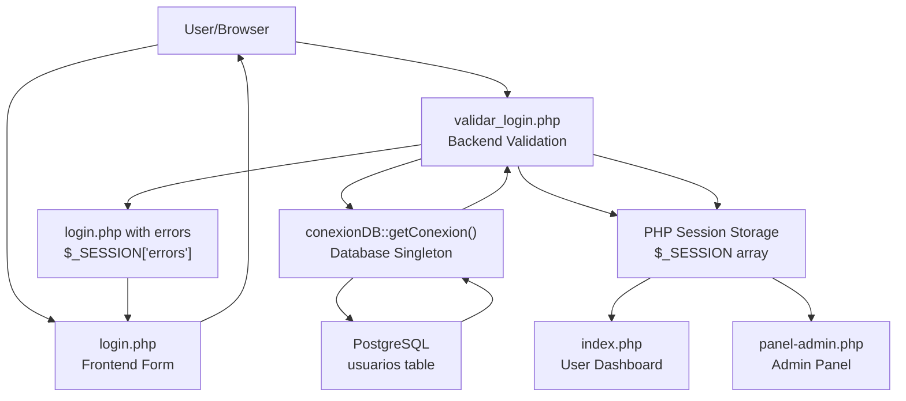
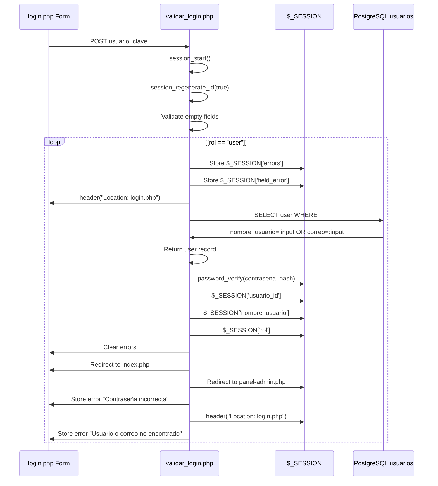
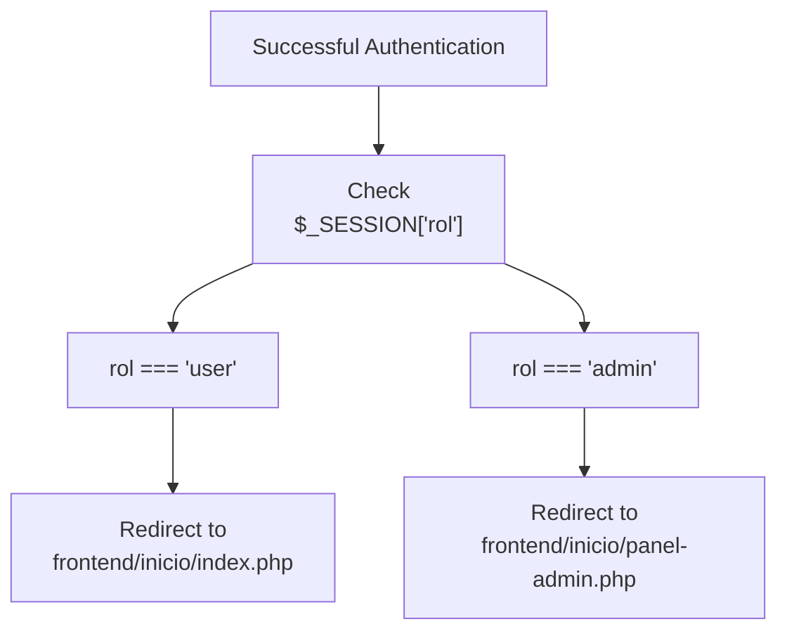
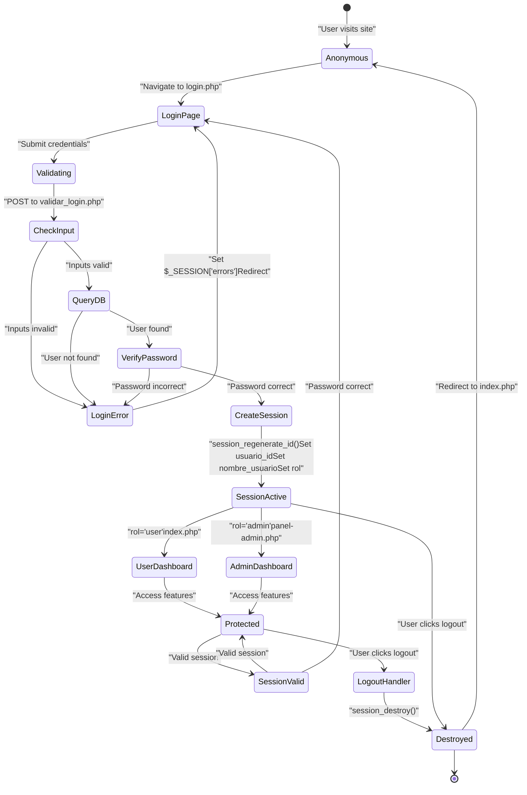

# Inicio de sesión y gestión de sesiones

> **Archivos fuente relevantes**
> * [src/backend/loginValidation/validar_login.php](https://github.com/axchisan/El-rincon-de-ADSO/blob/3e310227/src/backend/loginValidation/validar_login.php)
> * [src/backend/logout.php](https://github.com/axchisan/El-rincon-de-ADSO/blob/3e310227/src/backend/logout.php)
> * [src/backend/perfil/uploads/681153ef10a8b-468520576_1147758583450948_1007574650848877107_n.jpg](https://github.com/axchisan/El-rincon-de-ADSO/blob/3e310227/src/backend/perfil/uploads/681153ef10a8b-468520576_1147758583450948_1007574650848877107_n.jpg)
> * [src/frontend/login/css/login.css](https://github.com/axchisan/El-rincon-de-ADSO/blob/3e310227/src/frontend/login/css/login.css)
> * [src/frontend/login/login.php](https://github.com/axchisan/El-rincon-de-ADSO/blob/3e310227/src/frontend/login/login.php)

Este documento describe los mecanismos de autenticación para el inicio de sesión y la gestión de sesiones en El Rincón de ADSO. Abarca la interfaz del formulario de inicio de sesión, la validación de credenciales, la creación y el ciclo de vida de las sesiones, el control de acceso basado en roles y los procedimientos de cierre de sesión.

Para obtener información sobre el registro de usuarios, consulte [Registro de usuarios](/axchisan/El-rincon-de-ADSO/3.2-user-registration) . Para la validación de sesión utilizada en páginas protegidas, consulte [Autenticación y autorización](/axchisan/El-rincon-de-ADSO/11.1-authentication-and-authorization) .

---

## Descripción general del sistema

El sistema de inicio de sesión implementa un flujo de autenticación tradicional basado en formularios con validación del lado del servidor, verificación de contraseñas y gestión de sesiones PHP. Tras una autenticación exitosa, el sistema crea una sesión persistente con las credenciales del usuario y la información del rol, y luego redirige a los usuarios a las interfaces correspondientes.

**Componentes clave:**

* Formulario de inicio de sesión:`src/frontend/login/login.php`
* Validación backend:`src/backend/loginValidation/validar_login.php`
* Terminación de sesión:`src/backend/logout.php`
* Conexión a la base de datos:`src/database/conexionDB.php`

---

## Arquitectura del flujo de inicio de sesión



**Fuentes:** [src/frontend/login/login.php L1-L68](https://github.com/axchisan/El-rincon-de-ADSO/blob/3e310227/src/frontend/login/login.php#L1-L68)

 [src/backend/loginValidation/validar_login.php L1-L65](https://github.com/axchisan/El-rincon-de-ADSO/blob/3e310227/src/backend/loginValidation/validar_login.php#L1-L65)

---

## Interfaz de inicio de sesión de frontend

El formulario de inicio de sesión se presenta `login.php`y acepta un nombre de usuario o una dirección de correo electrónico junto con una contraseña.

### Estructura del formulario

La interfaz de inicio de sesión incluye:

* Campo de entrada de nombre de usuario/correo electrónico:`<input name="usuario">`
* Campo de entrada de contraseña:`<input name="clave">`
* Envío de formulario a`../../backend/loginValidation/validar_login.php` [src/frontend/login/login.php L47](https://github.com/axchisan/El-rincon-de-ADSO/blob/3e310227/src/frontend/login/login.php#L47-L47)
* Área de visualización de mensajes de error
* Enlace a la página de registro
* Botón de regreso a la página de inicio

### Inicialización de sesión

La gestión de la sesión comienza inmediatamente:[src/frontend/login/login.php L2](https://github.com/axchisan/El-rincon-de-ADSO/blob/3e310227/src/frontend/login/login.php#L2-L2)

```
session_start();
```

Esto debe ocurrir antes de cualquier salida para habilitar el acceso a la variable de sesión durante todo el flujo de autenticación.

### Mecanismo de visualización de errores

La página comprueba si hay errores de validación almacenados en la sesión:[src/frontend/login/login.php L38-L45](https://github.com/axchisan/El-rincon-de-ADSO/blob/3e310227/src/frontend/login/login.php#L38-L45)

| Variable de sesión | Objetivo |
| --- | --- |
| `$_SESSION['errors']` | Matriz de mensajes de error de validación |
| `$_SESSION['field_error']` | Identifies which input field caused the error ('usuario' or 'clave') |

Error messages are displayed in a styled container and then cleared from the session to prevent persistence across page loads.

**Sources:** [src/frontend/login/login.php L1-L68](https://github.com/axchisan/El-rincon-de-ADSO/blob/3e310227/src/frontend/login/login.php#L1-L68)

 [src/frontend/login/css/login.css L196-L213](https://github.com/axchisan/El-rincon-de-ADSO/blob/3e310227/src/frontend/login/css/login.css#L196-L213)

---

## Backend Validation Process

The validation script `validar_login.php` performs credential verification and session establishment.

### Request Processing Flow



**Sources:** [src/backend/loginValidation/validar_login.php L1-L65](https://github.com/axchisan/El-rincon-de-ADSO/blob/3e310227/src/backend/loginValidation/validar_login.php#L1-L65)

### Input Validation

The system validates two fields: [src/backend/loginValidation/validar_login.php L8-L20](https://github.com/axchisan/El-rincon-de-ADSO/blob/3e310227/src/backend/loginValidation/validar_login.php#L8-L20)

```
$input_usuario = trim($_POST['usuario'] ?? '');
$contrasena = trim($_POST['clave'] ?? '');
```

Validation checks:

1. Username/email field is not empty
2. Password field is not empty
3. If either fails, corresponding `field_error` is set

### Database Query

User lookup supports both username and email: [src/backend/loginValidation/validar_login.php L26-L29](https://github.com/axchisan/El-rincon-de-ADSO/blob/3e310227/src/backend/loginValidation/validar_login.php#L26-L29)

```sql
SELECT id, nombre_usuario, correo, contrasena, rol 
FROM usuarios 
WHERE nombre_usuario = :input OR correo = :input
```

The query uses PDO prepared statements via the `conexionDB::getConexion()` singleton.

### Password Verification

Password hashing uses PHP's built-in functions: [src/backend/loginValidation/validar_login.php L33](https://github.com/axchisan/El-rincon-de-ADSO/blob/3e310227/src/backend/loginValidation/validar_login.php#L33-L33)

```
if (password_verify($contrasena, $usuario['contrasena']))
```

This verifies the plaintext password against the stored bcrypt hash.

**Sources:** [src/backend/loginValidation/validar_login.php L1-L65](https://github.com/axchisan/El-rincon-de-ADSO/blob/3e310227/src/backend/loginValidation/validar_login.php#L1-L65)

---

## Session Management

### Session Creation

Upon successful authentication, three session variables are established: [src/backend/loginValidation/validar_login.php L34-L36](https://github.com/axchisan/El-rincon-de-ADSO/blob/3e310227/src/backend/loginValidation/validar_login.php#L34-L36)

| Session Variable | Data Type | Purpose |
| --- | --- | --- |
| `$_SESSION['usuario_id']` | Integer | User's unique identifier from `usuarios.id` |
| `$_SESSION['nombre_usuario']` | String | User's username |
| `$_SESSION['rol']` | String | User's role ('user' or 'admin') |

### Session Security

The validation script implements session fixation protection: [src/backend/loginValidation/validar_login.php L5](https://github.com/axchisan/El-rincon-de-ADSO/blob/3e310227/src/backend/loginValidation/validar_login.php#L5-L5)

```
session_regenerate_id(true);
```

This generates a new session ID after starting the session, preventing session fixation attacks. The `true` parameter deletes the old session file.

### Session Validation Pattern

Protected pages throughout the application check session state:

```
if (!isset($_SESSION['usuario_id'])) {
    header("Location: ../login/login.php");
    exit();
}
```

This pattern appears in all authenticated pages to ensure only logged-in users can access protected resources.

**Sources:** [src/backend/loginValidation/validar_login.php L2-L5](https://github.com/axchisan/El-rincon-de-ADSO/blob/3e310227/src/backend/loginValidation/validar_login.php#L2-L5)

 [src/backend/loginValidation/validar_login.php L34-L36](https://github.com/axchisan/El-rincon-de-ADSO/blob/3e310227/src/backend/loginValidation/validar_login.php#L34-L36)

---

## Role-Based Access Control

### Role Determination and Routing

The system implements a two-tier role system: [src/backend/loginValidation/validar_login.php L42-L48](https://github.com/axchisan/El-rincon-de-ADSO/blob/3e310227/src/backend/loginValidation/validar_login.php#L42-L48)



**Role Definitions:**

| Role | Database Value | Redirect Target | Access Level |
| --- | --- | --- | --- |
| User | `"user"` | `index.php` | Standard user features (resources, friends, messaging) |
| Admin | `"admin"` | `panel-admin.php` | Administrative features + all user features |

The role is retrieved from the `usuarios.rol` column during authentication and stored in `$_SESSION['rol']`.

**Sources:** [src/backend/loginValidation/validar_login.php L42-L48](https://github.com/axchisan/El-rincon-de-ADSO/blob/3e310227/src/backend/loginValidation/validar_login.php#L42-L48)

---

## Error Handling and User Feedback

### Error Types and Messages

The validation system generates specific error messages: [src/backend/loginValidation/validar_login.php L10-L62](https://github.com/axchisan/El-rincon-de-ADSO/blob/3e310227/src/backend/loginValidation/validar_login.php#L10-L62)

| Error Condition | Error Message | Field Highlighted |
| --- | --- | --- |
| Empty username/email | "El campo usuario o correo es obligatorio." | `usuario` |
| Empty password | "El campo contraseña es obligatorio." | `clave` |
| User not found | "Usuario o correo no encontrado." | `usuario` |
| Incorrect password | "Contraseña incorrecta." | `clave` |
| Database error | "Error al iniciar sesión: [exception message]" | None |

### Visual Error Feedback

The login form applies error styling to problematic fields: [src/frontend/login/login.php L49-L52](https://github.com/axchisan/El-rincon-de-ADSO/blob/3e310227/src/frontend/login/login.php#L49-L52)

```php
class="<?php echo (isset($_SESSION['field_error']) && 
                   $_SESSION['field_error'] === 'usuario') ? 'input-error' : ''; ?>"
```

The `.input-error` class applies red border and shadow: [src/frontend/login/css/login.css L210-L213](https://github.com/axchisan/El-rincon-de-ADSO/blob/3e310227/src/frontend/login/css/login.css#L210-L213)

```css
.input-error {
    border-color: #dc3545;
    box-shadow: 0 0 5px rgba(220, 53, 69, 0.3);
}
```

### Error Session Cleanup

After successful authentication, error variables are cleared: [src/backend/loginValidation/validar_login.php L38-L40](https://github.com/axchisan/El-rincon-de-ADSO/blob/3e310227/src/backend/loginValidation/validar_login.php#L38-L40)

```
unset($_SESSION['errors']);
unset($_SESSION['field_error']);
```

After displaying errors on the login page, they are also cleared: [src/frontend/login/login.php L44](https://github.com/axchisan/El-rincon-de-ADSO/blob/3e310227/src/frontend/login/login.php#L44-L44)

```
unset($_SESSION['errors']);
```

**Sources:** [src/frontend/login/login.php L38-L52](https://github.com/axchisan/El-rincon-de-ADSO/blob/3e310227/src/frontend/login/login.php#L38-L52)

 [src/backend/loginValidation/validar_login.php L10-L62](https://github.com/axchisan/El-rincon-de-ADSO/blob/3e310227/src/backend/loginValidation/validar_login.php#L10-L62)

 [src/frontend/login/css/login.css L196-L213](https://github.com/axchisan/El-rincon-de-ADSO/blob/3e310227/src/frontend/login/css/login.css#L196-L213)

---

## Session Lifecycle



**Sources:** [src/frontend/login/login.php L1-L68](https://github.com/axchisan/El-rincon-de-ADSO/blob/3e310227/src/frontend/login/login.php#L1-L68)

 [src/backend/loginValidation/validar_login.php L1-L65](https://github.com/axchisan/El-rincon-de-ADSO/blob/3e310227/src/backend/loginValidation/validar_login.php#L1-L65)

 [src/backend/logout.php L1-L6](https://github.com/axchisan/El-rincon-de-ADSO/blob/3e310227/src/backend/logout.php#L1-L6)

---

## Logout Process

The logout mechanism terminates user sessions completely.

### Implementation

El script de cierre de sesión realiza dos operaciones:[src/backend/logout.php L2-L4](https://github.com/axchisan/El-rincon-de-ADSO/blob/3e310227/src/backend/logout.php#L2-L4)

```
session_start();
session_destroy();
header("Location: ../frontend/inicio/index.php");
```

**Pasos para cerrar sesión:**

1. **Inicializar sesión** : `session_start()`carga la sesión existente
2. **Destruir datos de sesión** : `session_destroy()`elimina todos los datos de sesión del servidor
3. **Redirección** : el usuario es enviado a la página de destino pública.

### Efectos de destrucción de sesión

Cuando `session_destroy()`se ejecuta:

* `$_SESSION`Se borran todas las variables
* Se elimina el archivo de sesión en el servidor
* El usuario pierde el estado de autenticación
* Cualquier página protegida redireccionará al inicio de sesión.

### Patrón de acceso

Los enlaces de cierre de sesión en toda la aplicación hacen referencia a este script:

```xml
<a href="../../backend/logout.php">Cerrar Sesión</a>
```

**Fuentes:** [src/backend/logout.php L1-L6](https://github.com/axchisan/El-rincon-de-ADSO/blob/3e310227/src/backend/logout.php#L1-L6)

---

## Resumen de la implementación de seguridad

| Medida de seguridad | Implementación | Ubicación |
| --- | --- | --- |
| **Prevención de la fijación de sesiones** | `session_regenerate_id(true)` | [validar_login.php L5](https://github.com/axchisan/El-rincon-de-ADSO/blob/3e310227/validar_login.php#L5-L5) |
| **Hashing de contraseñas** | `password_verify()`con bcrypt | [validar_login.php L33](https://github.com/axchisan/El-rincon-de-ADSO/blob/3e310227/validar_login.php#L33-L33) |
| **Prevención de inyección SQL** | Declaraciones preparadas de la DOP | [validar_login.php L26-L28](https://github.com/axchisan/El-rincon-de-ADSO/blob/3e310227/validar_login.php#L26-L28) |
| **Sanitización de entrada** | `trim()`en las entradas del usuario | [validar_login.php L8-L9](https://github.com/axchisan/El-rincon-de-ADSO/blob/3e310227/validar_login.php#L8-L9) |
| **Mensaje de error de seguridad** | Mensajes genéricos para errores de usuario/contraseña | [validar_login.php L50-L55](https://github.com/axchisan/El-rincon-de-ADSO/blob/3e310227/validar_login.php#L50-L55) |
| **Escape de salida** | `htmlspecialchars()`en la pantalla de error | [login.php L41](https://github.com/axchisan/El-rincon-de-ADSO/blob/3e310227/login.php#L41-L41) |
| **Almacenamiento de errores solo de sesión** | Los errores se almacenan en `$_SESSION`, no en la URL | [validar_login.php L62](https://github.com/axchisan/El-rincon-de-ADSO/blob/3e310227/validar_login.php#L62-L62) |

**Fuentes:** [src/backend/loginValidation/validar_login.php L1-L65](https://github.com/axchisan/El-rincon-de-ADSO/blob/3e310227/src/backend/loginValidation/validar_login.php#L1-L65)

 [src/frontend/login/login.php L38-L45](https://github.com/axchisan/El-rincon-de-ADSO/blob/3e310227/src/frontend/login/login.php#L38-L45)