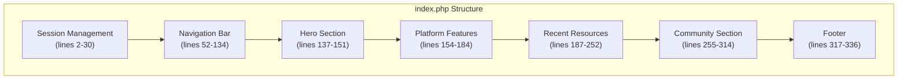
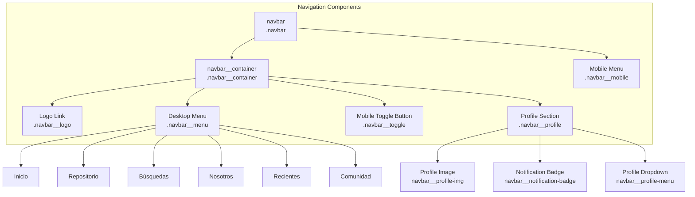
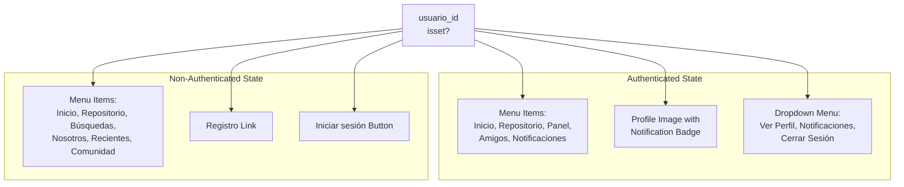
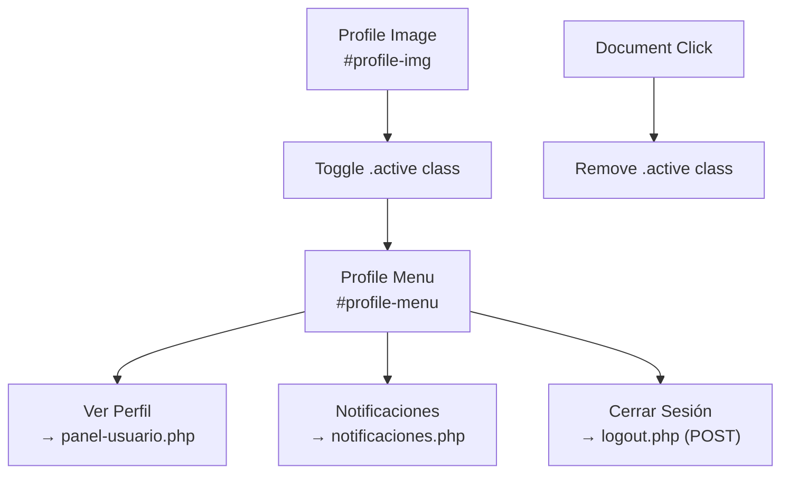
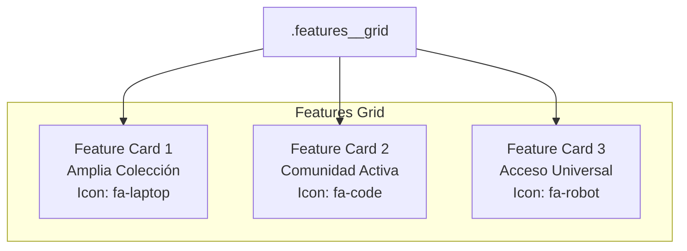
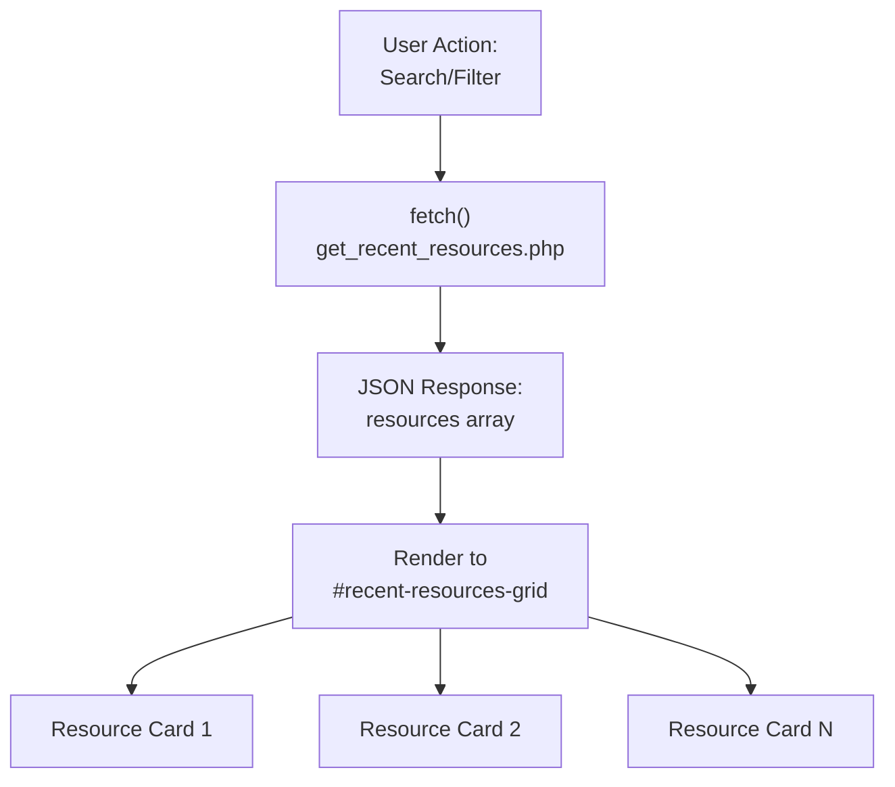
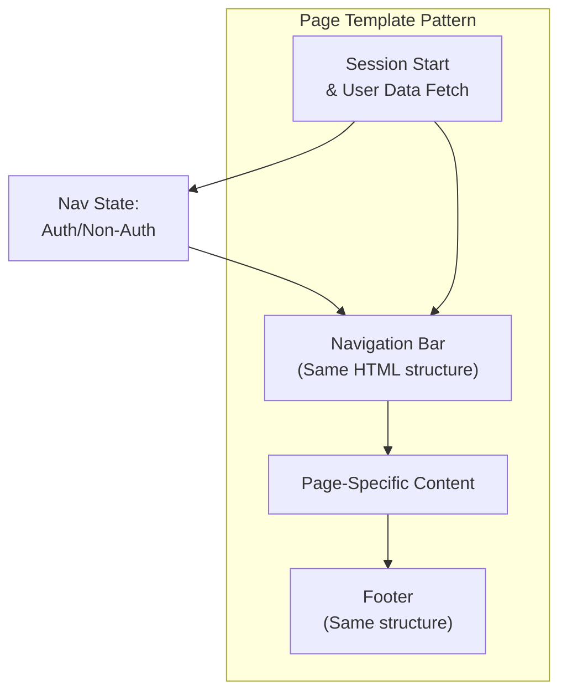

# Landing Page and Navigation

> **Relevant source files**
> * [src/backend/perfil/uploads/profile_6814422884f7d-465971915_519394657743559_5751152004256211003_n.jpg](https://github.com/axchisan/El-rincon-de-ADSO/blob/3e310227/src/backend/perfil/uploads/profile_6814422884f7d-465971915_519394657743559_5751152004256211003_n.jpg)
> * [src/frontend/inicio/css/styles.css](https://github.com/axchisan/El-rincon-de-ADSO/blob/3e310227/src/frontend/inicio/css/styles.css)
> * [src/frontend/inicio/index.php](https://github.com/axchisan/El-rincon-de-ADSO/blob/3e310227/src/frontend/inicio/index.php)
> * [src/frontend/panel/panel-usuario.php](https://github.com/axchisan/El-rincon-de-ADSO/blob/3e310227/src/frontend/panel/panel-usuario.php)
> * [src/frontend/repositorio/css/repositorio.css](https://github.com/axchisan/El-rincon-de-ADSO/blob/3e310227/src/frontend/repositorio/css/repositorio.css)
> * [src/frontend/repositorio/repositorio.php](https://github.com/axchisan/El-rincon-de-ADSO/blob/3e310227/src/frontend/repositorio/repositorio.php)

This document describes the structure and implementation of the landing page (`index.php`) and the navigation system used throughout El Rincón de ADSO. The landing page serves as the public entry point for the platform, while the navigation system provides consistent access to all major features across authenticated and non-authenticated sessions.

For information about user authentication flows, see [Authentication System](/axchisan/El-rincon-de-ADSO/3-authentication-system). For details on the main user dashboard accessed after login, see [User Dashboard (Panel Usuario)](/axchisan/El-rincon-de-ADSO/4-user-dashboard-(panel-usuario)).

---

## Landing Page Structure

The landing page is implemented in [src/frontend/inicio/index.php L1-L1018](https://github.com/axchisan/El-rincon-de-ADSO/blob/3e310227/src/frontend/inicio/index.php#L1-L1018)

 and consists of several main sections that introduce the platform and provide immediate access to key features.

### Overall Page Layout



**Diagram: Landing Page Component Hierarchy**

Sources: [src/frontend/inicio/index.php L1-L336](https://github.com/axchisan/El-rincon-de-ADSO/blob/3e310227/src/frontend/inicio/index.php#L1-L336)

### Session and User State Management

The landing page begins by establishing the user's session state, which determines what content and navigation options are displayed:

[src/frontend/inicio/index.php L1-L31](https://github.com/axchisan/El-rincon-de-ADSO/blob/3e310227/src/frontend/inicio/index.php#L1-L31)

| Variable | Purpose | Type |
| --- | --- | --- |
| `$usuario_id` | Current user's ID if logged in, null otherwise | int or null |
| `$nombre_usuario` | Display name of authenticated user | string |
| `$usuario_imagen` | Path to user's profile image | string |
| `$unread_count` | Number of unread notifications | int |

If a user is authenticated (`$usuario_id` is set), the system:

1. Fetches user data from the `usuarios` table
2. Constructs the profile image path from `../../backend/perfil/` directory
3. Counts unread notifications from the `notificaciones` table

Sources: [src/frontend/inicio/index.php L1-L31](https://github.com/axchisan/El-rincon-de-ADSO/blob/3e310227/src/frontend/inicio/index.php#L1-L31)

---

## Navigation System Architecture

The navigation system is implemented consistently across all pages in the application. It adapts based on authentication state and viewport size.

### Navigation Component Structure



**Diagram: Navigation Component Tree**

Sources: [src/frontend/inicio/index.php L52-L134](https://github.com/axchisan/El-rincon-de-ADSO/blob/3e310227/src/frontend/inicio/index.php#L52-L134)

 [src/frontend/inicio/css/styles.css L273-L649](https://github.com/axchisan/El-rincon-de-ADSO/blob/3e310227/src/frontend/inicio/css/styles.css#L273-L649)

### Desktop vs Mobile Navigation

The navigation system uses CSS media queries and JavaScript to provide different experiences on desktop and mobile devices:

#### Desktop Navigation (≥768px)

[src/frontend/inicio/index.php L60-L90](https://github.com/axchisan/El-rincon-de-ADSO/blob/3e310227/src/frontend/inicio/index.php#L60-L90)

* Horizontal menu bar (`.navbar__menu`) displayed with `display: flex`
* Menu items arranged in a row with spacing
* Profile dropdown positioned absolutely
* Mobile toggle button hidden via CSS

#### Mobile Navigation (<768px)

[src/frontend/inicio/index.php L99-L133](https://github.com/axchisan/El-rincon-de-ADSO/blob/3e310227/src/frontend/inicio/index.php#L99-L133)

* Desktop menu hidden
* Hamburger toggle button (`.navbar__toggle`) visible
* Collapsible mobile menu (`.navbar__mobile`) with vertical layout
* Controlled by JavaScript toggle on `#mobile-menu-button` click

Sources: [src/frontend/inicio/index.php L52-L134](https://github.com/axchisan/El-rincon-de-ADSO/blob/3e310227/src/frontend/inicio/index.php#L52-L134)

 [src/frontend/inicio/css/styles.css L600-L624](https://github.com/axchisan/El-rincon-de-ADSO/blob/3e310227/src/frontend/inicio/css/styles.css#L600-L624)

### Authentication-Based Navigation States

The navigation dynamically renders different content based on whether a user is authenticated:



**Diagram: Navigation State Based on Authentication**

#### Non-Authenticated Users

[src/frontend/inicio/index.php L67-L89](https://github.com/axchisan/El-rincon-de-ADSO/blob/3e310227/src/frontend/inicio/index.php#L67-L89)

Key elements:

* **Registro** link to registration page
* **Iniciar sesión** button to login page
* No profile section
* Full access to public sections

#### Authenticated Users

[src/frontend/inicio/index.php L70-L86](https://github.com/axchisan/El-rincon-de-ADSO/blob/3e310227/src/frontend/inicio/index.php#L70-L86)

Key elements:

* Profile image with notification badge
* Dropdown menu with: * Ver Perfil → `panel-usuario.php` * Notificaciones → `notificaciones.php` * Cerrar Sesión → `logout.php`
* Additional menu item: **Panel** (user dashboard)
* Notification count badge displayed if `$unread_count > 0`

Sources: [src/frontend/inicio/index.php L67-L132](https://github.com/axchisan/El-rincon-de-ADSO/blob/3e310227/src/frontend/inicio/index.php#L67-L132)

### Navigation Menu Items and Active States

The navigation uses the `.navbar__menu-item--active` class to highlight the current page:

| Menu Item | Link Target | Active On |
| --- | --- | --- |
| Inicio | `#` (current page) | Landing page |
| Repositorio | `../repositorio/repositorio.php` | Repository page |
| Búsquedas | `#buscar` | Anchor to search section |
| Nosotros | `#nosotros` | Anchor to about section |
| Recientes | `#recientes` | Anchor to recent resources |
| Comunidad | `#comunidad` | Anchor to community section |

[src/frontend/inicio/index.php L61-L66](https://github.com/axchisan/El-rincon-de-ADSO/blob/3e310227/src/frontend/inicio/index.php#L61-L66)

The active state styling is defined in [src/frontend/inicio/css/styles.css L328-L346](https://github.com/axchisan/El-rincon-de-ADSO/blob/3e310227/src/frontend/inicio/css/styles.css#L328-L346)

 which adds an underline effect using a CSS `::after` pseudo-element.

Sources: [src/frontend/inicio/index.php L60-L90](https://github.com/axchisan/El-rincon-de-ADSO/blob/3e310227/src/frontend/inicio/index.php#L60-L90)

 [src/frontend/inicio/css/styles.css L311-L346](https://github.com/axchisan/El-rincon-de-ADSO/blob/3e310227/src/frontend/inicio/css/styles.css#L311-L346)

### Profile Menu Dropdown

The profile dropdown menu is implemented with JavaScript-controlled visibility:



**Diagram: Profile Dropdown Interaction Flow**

The dropdown implementation:

1. **HTML Structure**: [src/frontend/inicio/index.php L72-L86](https://github.com/axchisan/El-rincon-de-ADSO/blob/3e310227/src/frontend/inicio/index.php#L72-L86)
2. **CSS Styling**: [src/frontend/inicio/css/styles.css L469-L504](https://github.com/axchisan/El-rincon-de-ADSO/blob/3e310227/src/frontend/inicio/css/styles.css#L469-L504)
3. **JavaScript Toggle**: [src/frontend/inicio/index.php L358-L376](https://github.com/axchisan/El-rincon-de-ADSO/blob/3e310227/src/frontend/inicio/index.php#L358-L376)

The JavaScript adds event listeners:

* Click on profile image toggles `.active` class
* Click outside profile area removes `.active` class
* Prevents event bubbling on profile image click

Sources: [src/frontend/inicio/index.php L72-L376](https://github.com/axchisan/El-rincon-de-ADSO/blob/3e310227/src/frontend/inicio/index.php#L72-L376)

 [src/frontend/inicio/css/styles.css L469-L504](https://github.com/axchisan/El-rincon-de-ADSO/blob/3e310227/src/frontend/inicio/css/styles.css#L469-L504)

### Notification Badge System

The notification badge displays the count of unread notifications:

[src/frontend/inicio/index.php L75-L77](https://github.com/axchisan/El-rincon-de-ADSO/blob/3e310227/src/frontend/inicio/index.php#L75-L77)

Badge behavior:

* Hidden when `$unread_count == 0` via `.hidden` class
* Positioned absolutely on top-right of profile image
* Styled with red background (`#e74c3c`) for visibility
* Updated dynamically from `notificaciones` table query

CSS implementation: [src/frontend/inicio/css/styles.css L448-L467](https://github.com/axchisan/El-rincon-de-ADSO/blob/3e310227/src/frontend/inicio/css/styles.css#L448-L467)

Sources: [src/frontend/inicio/index.php L22-L77](https://github.com/axchisan/El-rincon-de-ADSO/blob/3e310227/src/frontend/inicio/index.php#L22-L77)

 [src/frontend/inicio/css/styles.css L448-L467](https://github.com/axchisan/El-rincon-de-ADSO/blob/3e310227/src/frontend/inicio/css/styles.css#L448-L467)

---

## Hero Section

The hero section is the primary visual element on the landing page, presenting the platform's value proposition:

[src/frontend/inicio/index.php L137-L151](https://github.com/axchisan/El-rincon-de-ADSO/blob/3e310227/src/frontend/inicio/index.php#L137-L151)

### Hero Content Structure

| Element | Class | Content |
| --- | --- | --- |
| Title | `.hero__title` | "Tu biblioteca digital al alcance de todos" |
| Description | `.hero__description` | Platform mission statement |
| CTA Button | `.btn--secondary` | "Explorar Repositorio" |
| Image | `.hero__image` | Visual representation |

### Hero Wave Effect

The hero section includes a decorative wave SVG at the bottom for visual separation:

[src/frontend/inicio/css/styles.css L703-L713](https://github.com/axchisan/El-rincon-de-ADSO/blob/3e310227/src/frontend/inicio/css/styles.css#L703-L713)

This creates a smooth transition between the hero background and the following white sections.

Sources: [src/frontend/inicio/index.php L137-L151](https://github.com/axchisan/El-rincon-de-ADSO/blob/3e310227/src/frontend/inicio/index.php#L137-L151)

 [src/frontend/inicio/css/styles.css L668-L821](https://github.com/axchisan/El-rincon-de-ADSO/blob/3e310227/src/frontend/inicio/css/styles.css#L668-L821)

---

## Platform Features Section

The features section showcases three key platform attributes using a card-based layout:

[src/frontend/inicio/index.php L154-L184](https://github.com/axchisan/El-rincon-de-ADSO/blob/3e310227/src/frontend/inicio/index.php#L154-L184)



**Diagram: Features Section Layout**

Each feature card (`.feature-card`) contains:

1. **Icon** (`.feature-card__icon`) - Font Awesome icon in circular background
2. **Title** (`.feature-card__title`) - Feature name
3. **Description** (`.feature-card__description`) - Brief explanation

The grid is responsive:

* 1 column on mobile
* 3 columns on desktop (≥768px)

Sources: [src/frontend/inicio/index.php L154-L184](https://github.com/axchisan/El-rincon-de-ADSO/blob/3e310227/src/frontend/inicio/index.php#L154-L184)

 [src/frontend/inicio/css/styles.css L1243-L1369](https://github.com/axchisan/El-rincon-de-ADSO/blob/3e310227/src/frontend/inicio/css/styles.css#L1243-L1369)

---

## Recent Resources Section

This section displays the latest resources added to the platform with search and filtering capabilities:

[src/frontend/inicio/index.php L187-L252](https://github.com/axchisan/El-rincon-de-ADSO/blob/3e310227/src/frontend/inicio/index.php#L187-L252)

### Search and Filter Interface

The section includes:

1. **Search Box** (`#recent-search-input`) - Text input for keyword search
2. **Filter Dropdowns**: * Resource Type (`#recent-filter-type`) * Category (`#recent-filter-category`) * Relevance (`#recent-filter-relevance`) * Language (`#recent-filter-language`)

[src/frontend/inicio/index.php L193-L242](https://github.com/axchisan/El-rincon-de-ADSO/blob/3e310227/src/frontend/inicio/index.php#L193-L242)

### Dynamic Resource Loading

Resources are loaded dynamically via JavaScript from `../../backend/gestionRecursos/get_recent_resources.php`:



**Diagram: Recent Resources Loading Flow**

The grid container `#recent-resources-grid` is populated with resource cards dynamically. Each card contains resource metadata, images, and action buttons.

Sources: [src/frontend/inicio/index.php L187-L252](https://github.com/axchisan/El-rincon-de-ADSO/blob/3e310227/src/frontend/inicio/index.php#L187-L252)

---

## Community Section

The community section showcases user comments and provides social engagement features:

[src/frontend/inicio/index.php L255-L314](https://github.com/axchisan/El-rincon-de-ADSO/blob/3e310227/src/frontend/inicio/index.php#L255-L314)

### Comment Submission Form (Authenticated Users Only)

For authenticated users, a comment form is displayed:

[src/frontend/inicio/index.php L267-L293](https://github.com/axchisan/El-rincon-de-ADSO/blob/3e310227/src/frontend/inicio/index.php#L267-L293)

Form fields:

* **libro** - Topic/subject of comment
* **comentario** - Comment text
* **valoracion** - Star rating (1-5)

Form submission handled by `../../backend/comunidad/add_comment.php`

### Star Rating System

Interactive star rating implementation:

[src/frontend/inicio/index.php L377-L423](https://github.com/axchisan/El-rincon-de-ADSO/blob/3e310227/src/frontend/inicio/index.php#L377-L423)

JavaScript features:

* Click to select rating (1-5 stars)
* Hover effects on stars
* Visual feedback with filled/unfilled icons
* Hidden input field stores rating value

### Community Comments Display

Comments are loaded dynamically into `#community-grid` with pagination support:

[src/frontend/inicio/index.php L296-L303](https://github.com/axchisan/El-rincon-de-ADSO/blob/3e310227/src/frontend/inicio/index.php#L296-L303)

Each comment card displays:

* User avatar and username
* Date posted
* Star rating
* Comment text
* Like button with count
* Reply button

Sources: [src/frontend/inicio/index.php L255-L555](https://github.com/axchisan/El-rincon-de-ADSO/blob/3e310227/src/frontend/inicio/index.php#L255-L555)

---

## Footer

The footer provides site information and branding:

[src/frontend/inicio/index.php L317-L336](https://github.com/axchisan/El-rincon-de-ADSO/blob/3e310227/src/frontend/inicio/index.php#L317-L336)

Footer sections:

1. **Logo and Description** - Platform branding
2. **Philosophy Section** - Mission statement
3. **Copyright** - Dynamic year display

The footer uses a decorative wave effect at the top (CSS) to create visual continuity.

Sources: [src/frontend/inicio/index.php L317-L336](https://github.com/axchisan/El-rincon-de-ADSO/blob/3e310227/src/frontend/inicio/index.php#L317-L336)

 [src/frontend/inicio/css/styles.css L1792-L2046](https://github.com/axchisan/El-rincon-de-ADSO/blob/3e310227/src/frontend/inicio/css/styles.css#L1792-L2046)

---

## Mobile Navigation Implementation

Mobile navigation is controlled via JavaScript toggle functionality:

### Toggle Button Handler

[src/frontend/inicio/index.php L351-L356](https://github.com/axchisan/El-rincon-de-ADSO/blob/3e310227/src/frontend/inicio/index.php#L351-L356)

```javascript
const mobileMenuButton = document.getElementById('mobile-menu-button');
const mobileMenu = document.getElementById('mobile-menu');
mobileMenuButton.addEventListener('click', function() {
    mobileMenu.classList.toggle('hidden');
});
```

The hamburger icon (`#mobile-menu-button`) toggles the `.hidden` class on `#mobile-menu`, controlling visibility.

### Mobile Menu Structure

The mobile menu replicates desktop menu items in a vertical layout:

[src/frontend/inicio/index.php L99-L133](https://github.com/axchisan/El-rincon-de-ADSO/blob/3e310227/src/frontend/inicio/index.php#L99-L133)

Mobile-specific features:

* Full-width menu items
* Profile section with name display (authenticated users)
* Notification badge display
* Vertical spacing optimized for touch

CSS media query ensures proper display:

[src/frontend/inicio/css/styles.css L541-L598](https://github.com/axchisan/El-rincon-de-ADSO/blob/3e310227/src/frontend/inicio/css/styles.css#L541-L598)

Sources: [src/frontend/inicio/index.php L99-L356](https://github.com/axchisan/El-rincon-de-ADSO/blob/3e310227/src/frontend/inicio/index.php#L99-L356)

 [src/frontend/inicio/css/styles.css L386-L598](https://github.com/axchisan/El-rincon-de-ADSO/blob/3e310227/src/frontend/inicio/css/styles.css#L386-L598)

---

## Navigation Consistency Across Pages

The navigation system is implemented consistently across all major pages:

| Page | File | Navigation Type |
| --- | --- | --- |
| Landing | `src/frontend/inicio/index.php` | Full navigation with anchors |
| Repository | `src/frontend/repositorio/repositorio.php` | Same structure, Repositorio active |
| User Panel | `src/frontend/panel/panel-usuario.php` | Same structure, Panel active |

### Code Reuse Pattern

Each page implements the same navigation structure with minor variations:



**Diagram: Page Template Consistency**

Key consistency elements:

1. Session handling at top of file
2. Same navbar HTML structure
3. Same mobile menu structure
4. Same CSS classes and styling
5. Same JavaScript event handlers

Sources: [src/frontend/inicio/index.php L1-L134](https://github.com/axchisan/El-rincon-de-ADSO/blob/3e310227/src/frontend/inicio/index.php#L1-L134)

 [src/frontend/panel/panel-usuario.php L1-L108](https://github.com/axchisan/El-rincon-de-ADSO/blob/3e310227/src/frontend/panel/panel-usuario.php#L1-L108)

 [src/frontend/repositorio/repositorio.php L1-L189](https://github.com/axchisan/El-rincon-de-ADSO/blob/3e310227/src/frontend/repositorio/repositorio.php#L1-L189)

---

## Responsive Design Breakpoints

The navigation system uses these CSS breakpoints:

| Breakpoint | Target | Changes |
| --- | --- | --- |
| < 768px | Mobile | Desktop menu hidden, toggle visible |
| ≥ 768px | Tablet | Desktop menu visible, toggle hidden |
| ≥ 1024px | Desktop | Increased spacing, larger icons |

Implementation in CSS:

[src/frontend/inicio/css/styles.css L600-L649](https://github.com/axchisan/El-rincon-de-ADSO/blob/3e310227/src/frontend/inicio/css/styles.css#L600-L649)

Sources: [src/frontend/inicio/css/styles.css L541-L649](https://github.com/axchisan/El-rincon-de-ADSO/blob/3e310227/src/frontend/inicio/css/styles.css#L541-L649)

---

## Navigation Event Handlers

### Profile Menu Toggle

[src/frontend/inicio/index.php L358-L376](https://github.com/axchisan/El-rincon-de-ADSO/blob/3e310227/src/frontend/inicio/index.php#L358-L376)

Handles:

* Click on profile image → toggle dropdown
* Click outside → close dropdown
* Prevents event propagation

### Mobile Menu Toggle

[src/frontend/inicio/index.php L351-L356](https://github.com/axchisan/El-rincon-de-ADSO/blob/3e310227/src/frontend/inicio/index.php#L351-L356)

Simple toggle of `.hidden` class on mobile menu container.

### Star Rating Interaction

[src/frontend/inicio/index.php L377-L423](https://github.com/axchisan/El-rincon-de-ADSO/blob/3e310227/src/frontend/inicio/index.php#L377-L423)

Handles:

* Click → select rating
* Hover → preview rating
* Mouse out → restore selected rating

Sources: [src/frontend/inicio/index.php L340-L555](https://github.com/axchisan/El-rincon-de-ADSO/blob/3e310227/src/frontend/inicio/index.php#L340-L555)

---

## CSS Architecture for Navigation

The navigation styling is organized hierarchically:

### Base Navigation Styles

[src/frontend/inicio/css/styles.css L273-L305](https://github.com/axchisan/El-rincon-de-ADSO/blob/3e310227/src/frontend/inicio/css/styles.css#L273-L305)

* Sticky positioning
* Box shadow for depth
* White background with coffee-colored border

### Menu Item Styles

[src/frontend/inicio/css/styles.css L311-L363](https://github.com/axchisan/El-rincon-de-ADSO/blob/3e310227/src/frontend/inicio/css/styles.css#L311-L363)

* Hover effects
* Active state underlines
* Button styling for login/register

### Mobile Navigation Styles

[src/frontend/inicio/css/styles.css L386-L419](https://github.com/axchisan/El-rincon-de-ADSO/blob/3e310227/src/frontend/inicio/css/styles.css#L386-L419)

* Vertical layout
* Border-left hover effects
* Background color transitions

### Profile Section Styles

[src/frontend/inicio/css/styles.css L422-L505](https://github.com/axchisan/El-rincon-de-ADSO/blob/3e310227/src/frontend/inicio/css/styles.css#L422-L505)

* Circular profile image
* Notification badge positioning
* Dropdown menu styling

Sources: [src/frontend/inicio/css/styles.css L273-L649](https://github.com/axchisan/El-rincon-de-ADSO/blob/3e310227/src/frontend/inicio/css/styles.css#L273-L649)

---

## Summary

The landing page and navigation system provide:

1. **Consistent User Experience** - Same navigation across all pages
2. **Responsive Design** - Adapts to mobile and desktop
3. **Authentication-Aware** - Different states for logged in/out users
4. **Accessible Navigation** - Clear hierarchy and visual feedback
5. **Dynamic Content** - JavaScript-enhanced interactions
6. **Professional Appearance** - Cohesive styling with coffee-themed color scheme

The system successfully balances functionality with aesthetics, providing an intuitive entry point to the platform while maintaining consistency throughout the user journey.

Sources: [src/frontend/inicio/index.php L1-L1018](https://github.com/axchisan/El-rincon-de-ADSO/blob/3e310227/src/frontend/inicio/index.php#L1-L1018)

 [src/frontend/inicio/css/styles.css L1-L2046](https://github.com/axchisan/El-rincon-de-ADSO/blob/3e310227/src/frontend/inicio/css/styles.css#L1-L2046)

 [src/frontend/panel/panel-usuario.php L70-L108](https://github.com/axchisan/El-rincon-de-ADSO/blob/3e310227/src/frontend/panel/panel-usuario.php#L70-L108)

 [src/frontend/repositorio/repositorio.php L124-L189](https://github.com/axchisan/El-rincon-de-ADSO/blob/3e310227/src/frontend/repositorio/repositorio.php#L124-L189)