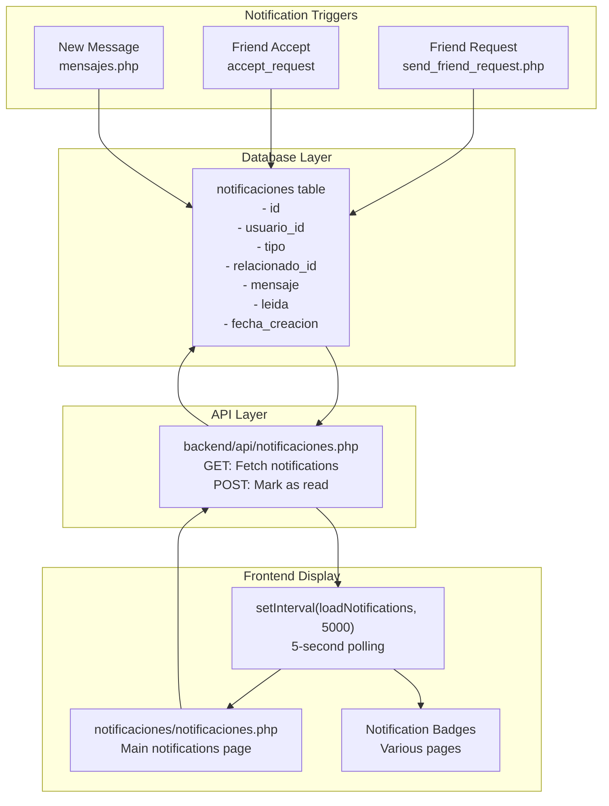
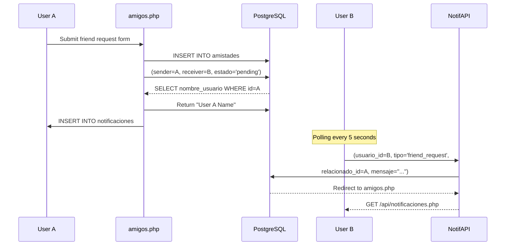
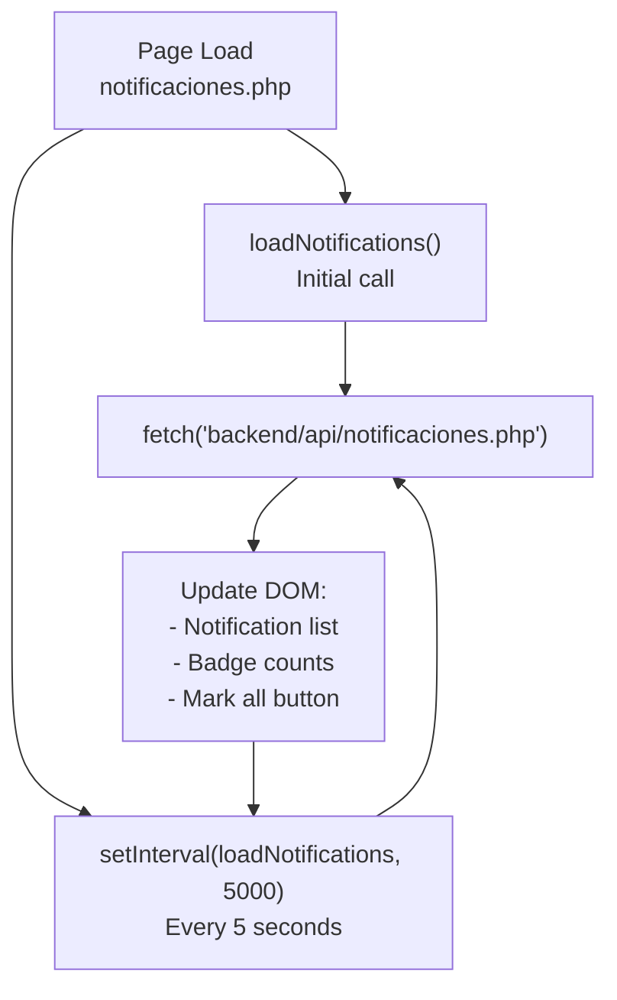
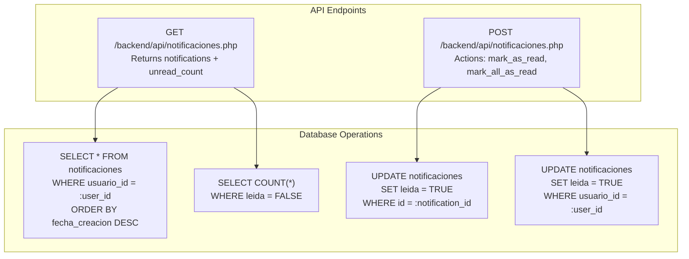

# Notificaciones

> **Archivos fuente relevantes**
> * [src/frontend/amigos/amigos.php](https://github.com/axchisan/El-rincon-de-ADSO/blob/3e310227/src/frontend/friends/amigos.php)
> * [src/frontend/inicio/index.php](https://github.com/axchisan/El-rincon-de-ADSO/blob/3e310227/src/frontend/inicio/index.php)
> * [src/frontend/mensajes/mensajes.php](https://github.com/axchisan/El-rincon-de-ADSO/blob/3e310227/src/frontend/mensajes/mensajes.php)
> * [src/frontend/notificaciones/notificaciones.php](https://github.com/axchisan/El-rincon-de-ADSO/blob/3e310227/src/frontend/notificaciones/notificaciones.php)
> * [src/frontend/panel/panel-usuario.php](https://github.com/axchisan/El-rincon-de-ADSO/blob/3e310227/src/frontend/panel/panel-usuario.php)
> * [src/frontend/perfil/perfil.php](https://github.com/axchisan/El-rincon-de-ADSO/blob/3e310227/src/frontend/perfil/perfil.php)
> * [src/frontend/repositorio/repositorio.php](https://github.com/axchisan/El-rincon-de-ADSO/blob/3e310227/src/frontend/repositorio/repositorio.php)

## Propósito y alcance

El sistema de notificaciones proporciona alertas en tiempo real a los usuarios sobre eventos y actividades sociales dentro de la plataforma. Este documento abarca el modelo de datos de notificaciones, los desencadenadores de creación, el mecanismo de sondeo, la visualización de insignias y la gestión del estado de lectura/no lectura.

Para obtener información sobre el flujo de trabajo de solicitudes de amistad que activa las notificaciones, consulta [Administración de amigos](/axchisan/El-rincon-de-ADSO/6.1-friends-management) . Para el sistema de mensajería, consulta [Sistema de mensajería](/axchisan/El-rincon-de-ADSO/6.2-messaging-system) .

---

## Arquitectura del sistema

### Diagrama de flujo de notificación



**Fuentes:** [src/frontend/notificaciones/notificaciones.php L117-L282](https://github.com/axchisan/El-rincon-de-ADSO/blob/3e310227/src/frontend/notificaciones/notificaciones.php#L117-L282)

 [amigos.php L76-L108](https://github.com/axchisan/El-rincon-de-ADSO/blob/3e310227/src/frontend/friends/amigos.php#L76-L108)

 [amigos.php L110-L142](https://github.com/axchisan/El-rincon-de-ADSO/blob/3e310227/src/frontend/friends/amigos.php#L110-L142)

---

## Esquema de base de datos

### Tabla de notificaciones

La `notificaciones`tabla almacena todas las notificaciones de usuario con la siguiente estructura:

| Columna | Tipo | Descripción |
| --- | --- | --- |
| `id` | Serie/Entero | Clave principal |
| `usuario_id` | Entero | ID de usuario del destinatario (clave externa para `usuarios.id`) |
| `tipo` | Cadena | Tipo de notificación (por ejemplo, 'solicitud_de_amistad', 'solicitud_de_amistad_aceptada') |
| `relacionado_id` | Entero | ID del usuario o entidad relacionada |
| `mensaje` | Texto | Mensaje de notificación legible para humanos |
| `leida` | Booleano | Estado de lectura (FALSO = no leído, VERDADERO = leído) |
| `fecha_creacion` | Marca de tiempo | Marca de tiempo de creación |

**Fuentes:** [amigos.php L96-L103](https://github.com/axchisan/El-rincon-de-ADSO/blob/3e310227/src/frontend/friends/amigos.php#L96-L103)

 [amigos.php L131-L138](https://github.com/axchisan/El-rincon-de-ADSO/blob/3e310227/src/frontend/friends/amigos.php#L131-L138)

---

## Tipos de notificación

### Tipos de notificaciones compatibles

El sistema actualmente admite los siguientes tipos de notificación:

#### 1. solicitud de amistad

Se activa cuando un usuario envía una solicitud de amistad a otro usuario.

**Lógica de la creación:**

```yaml
Location: src/frontend/friends/amigos.php:76-108
```

Cuando se envía una solicitud de amistad:

1. Insertar una nueva fila en `amistades`la tabla con`estado='pending'`
2. Consultar el nombre de usuario del remitente
3. Insertar notificación para el destinatario: * `tipo`: 'solicitud de amistad' * `relacionado_id`: ID de usuario del remitente * `mensaje`: "Tienes una nueva solicitud de amistad de {sender_name}."

**Fuentes:** [amigos.php L76-L108](https://github.com/axchisan/El-rincon-de-ADSO/blob/3e310227/src/frontend/friends/amigos.php#L76-L108)

#### 2. solicitud de amistad aceptada

Se activa cuando un usuario acepta una solicitud de amistad.

**Lógica de la creación:**

```yaml
Location: src/frontend/friends/amigos.php:110-142
```

When a friend request is accepted:

1. Update `amistades` table: set `estado='accepted'`
2. Query the acceptor's username
3. Insert notification for the original sender: * `tipo`: 'friend_request_accepted' * `relacionado_id`: acceptor's user ID * `mensaje`: "{acceptor_name} ha aceptado tu solicitud de amistad."

**Sources:** [src/frontend/friends/amigos.php L110-L142](https://github.com/axchisan/El-rincon-de-ADSO/blob/3e310227/src/frontend/friends/amigos.php#L110-L142)

---

## Notification Creation Flow



**Sources:** [src/frontend/friends/amigos.php L76-L108](https://github.com/axchisan/El-rincon-de-ADSO/blob/3e310227/src/frontend/friends/amigos.php#L76-L108)

 [src/frontend/notificaciones/notificaciones.php L139-L216](https://github.com/axchisan/El-rincon-de-ADSO/blob/3e310227/src/frontend/notificaciones/notificaciones.php#L139-L216)

---

## Notification Display System

### Unread Count Badge

The unread notification count is displayed as a badge in the navigation bar across multiple pages.

**Badge Query Pattern:**

```sql
Location: Multiple files (index.php, panel-usuario.php, repositorio.php, etc.)
SQL: SELECT COUNT(*) FROM notificaciones WHERE usuario_id = :user_id AND leida = FALSE
```

**Pages with Badge Display:**

* [src/frontend/panel/panel-usuario.php L37-L41](https://github.com/axchisan/El-rincon-de-ADSO/blob/3e310227/src/frontend/panel/panel-usuario.php#L37-L41)  - User panel
* [src/frontend/inicio/index.php L22-L26](https://github.com/axchisan/El-rincon-de-ADSO/blob/3e310227/src/frontend/inicio/index.php#L22-L26)  - Landing page
* [src/frontend/repositorio/repositorio.php L29-L33](https://github.com/axchisan/El-rincon-de-ADSO/blob/3e310227/src/frontend/repositorio/repositorio.php#L29-L33)  - Repository page
* [src/frontend/friends/amigos.php L33-L36](https://github.com/axchisan/El-rincon-de-ADSO/blob/3e310227/src/frontend/friends/amigos.php#L33-L36)  - Friends page
* [src/frontend/mensajes/mensajes.php L34-L37](https://github.com/axchisan/El-rincon-de-ADSO/blob/3e310227/src/frontend/mensajes/mensajes.php#L34-L37)  - Messages page
* [src/frontend/perfil/perfil.php L35-L38](https://github.com/axchisan/El-rincon-de-ADSO/blob/3e310227/src/frontend/perfil/perfil.php#L35-L38)  - Profile page

**Badge HTML Structure:**

```php
<span class="notification-badge"><?php echo $unread_count; ?></span>
```

The badge is conditionally hidden when count is 0:

```php
<span class="navbar__notification-badge <?php echo $unread_count == 0 ? 'hidden' : ''; ?>">
    <?php echo $unread_count; ?>
</span>
```

**Sources:** [src/frontend/panel/panel-usuario.php L81-L86](https://github.com/axchisan/El-rincon-de-ADSO/blob/3e310227/src/frontend/panel/panel-usuario.php#L81-L86)

 [src/frontend/inicio/index.php L70-L78](https://github.com/axchisan/El-rincon-de-ADSO/blob/3e310227/src/frontend/inicio/index.php#L70-L78)

---

## Real-Time Polling Mechanism

### JavaScript Polling Architecture



**Sources:** [src/frontend/notificaciones/notificaciones.php L280-L282](https://github.com/axchisan/El-rincon-de-ADSO/blob/3e310227/src/frontend/notificaciones/notificaciones.php#L280-L282)

### Polling Implementation Details

**Polling Configuration:**

```yaml
Location: src/frontend/notificaciones/notificaciones.php:280-282

// Initial load
loadNotifications();

// Poll every 5 seconds
setInterval(loadNotifications, 5000);
```

**Load Notifications Function:**

```javascript
Location: src/frontend/notificaciones/notificaciones.php:139-216

async function loadNotifications() {
    const response = await fetch('../../backend/api/notificaciones.php');
    const result = await response.json();
    
    // Extract data
    const { notifications, unread_count } = result.data;
    
    // Update badges
    // Update notification list
    // Filter only new notifications (lastNotificationId tracking)
}
```

**Incremental Update Strategy:**

The system uses `lastNotificationId` to track which notifications have already been loaded, preventing duplicate rendering:

[src/frontend/notificaciones/notificaciones.php L124](https://github.com/axchisan/El-rincon-de-ADSO/blob/3e310227/src/frontend/notificaciones/notificaciones.php#L124-L124)

```javascript
let lastNotificationId = 0;
```

[src/frontend/notificaciones/notificaciones.php L171-L174](https://github.com/axchisan/El-rincon-de-ADSO/blob/3e310227/src/frontend/notificaciones/notificaciones.php#L171-L174)

```javascript
const newNotifications = notifications.filter(notif => notif.id > lastNotificationId);
if (newNotifications.length === 0 && lastNotificationId !== 0) {
    return; // No hay nuevas notificaciones
}
```

**Sources:** [src/frontend/notificaciones/notificaciones.php L117-L216](https://github.com/axchisan/El-rincon-de-ADSO/blob/3e310227/src/frontend/notificaciones/notificaciones.php#L117-L216)

---

## Notification Display Components

### Main Notifications Page

**File:** `src/frontend/notificaciones/notificaciones.php`

The notifications page displays a list of all notifications with:

* Unread notifications highlighted with `notification-unread` class
* Read notifications with `notification-read` class
* Icon based on notification type (fa-user-plus for friend_request, fa-check-circle for acceptance)
* Formatted date using `formatDate()` function
* "Mark as read" button for unread notifications

**Notification Card Structure:**

```html
<div class="notification-card notification-unread" data-notification-id="{id}">
    <div class="notification-card__info">
        <p class="notification-card__message">
            <i class="fas fa-user-plus"></i>
            {mensaje}
        </p>
        <p class="notification-card__date">
            {formatted_date}
        </p>
    </div>
    <div class="notification-card__actions">
        <button class="notification-card__action mark-as-read-btn">Marcar como leída</button>
    </div>
</div>
```

**Sources:** [src/frontend/notificaciones/notificaciones.php L182-L202](https://github.com/axchisan/El-rincon-de-ADSO/blob/3e310227/src/frontend/notificaciones/notificaciones.php#L182-L202)

### Badge Update Logic

When notifications are loaded, badges are updated in both desktop and mobile navigation:

[src/frontend/notificaciones/notificaciones.php L152-L162](https://github.com/axchisan/El-rincon-de-ADSO/blob/3e310227/src/frontend/notificaciones/notificaciones.php#L152-L162)

```
if (unread_count > 0) {
    notificationBadge.textContent = unread_count;
    notificationBadge.style.display = 'inline';
    mobileNotificationBadge.textContent = unread_count;
    mobileNotificationBadge.style.display = 'inline';
    markAllContainer.style.display = 'block';
} else {
    notificationBadge.style.display = 'none';
    mobileNotificationBadge.style.display = 'none';
    markAllContainer.style.display = 'none';
}
```

**Sources:** [src/frontend/notificaciones/notificaciones.php L149-L162](https://github.com/axchisan/El-rincon-de-ADSO/blob/3e310227/src/frontend/notificaciones/notificaciones.php#L149-L162)

---

## Marking Notifications as Read

### Individual Mark as Read

**API Endpoint:** `POST /backend/api/notificaciones.php`

**Request Body:**

```json
{
    "action": "mark_as_read",
    "notification_id": "{notification_id}"
}
```

**Client-Side Implementation:**

[src/frontend/notificaciones/notificaciones.php L218-L251](https://github.com/axchisan/El-rincon-de-ADSO/blob/3e310227/src/frontend/notificaciones/notificaciones.php#L218-L251)

When a user clicks "Marcar como leída" button:

1. Extract notification ID from `data-notification-id` attribute
2. Send POST request to API with action and notification ID
3. On success, reset `lastNotificationId` to 0
4. Reload all notifications to refresh the display

**Sources:** [src/frontend/notificaciones/notificaciones.php L218-L251](https://github.com/axchisan/El-rincon-de-ADSO/blob/3e310227/src/frontend/notificaciones/notificaciones.php#L218-L251)

### Mark All as Read

**API Endpoint:** `POST /backend/api/notificaciones.php`

**Request Body:**

```json
{
    "action": "mark_all_as_read"
}
```

**Client-Side Implementation:**

[src/frontend/notificaciones/notificaciones.php L254-L278](https://github.com/axchisan/El-rincon-de-ADSO/blob/3e310227/src/frontend/notificaciones/notificaciones.php#L254-L278)

The "Marcar todas como leídas" button is only displayed when there are unread notifications. When clicked:

1. Send POST request with `mark_all_as_read` action
2. Reset `lastNotificationId` to 0
3. Reload all notifications

**Button Visibility:**

```
if (unread_count > 0) {
    markAllContainer.style.display = 'block';
} else {
    markAllContainer.style.display = 'none';
}
```

**Sources:** [src/frontend/notificaciones/notificaciones.php L254-L278](https://github.com/axchisan/El-rincon-de-ADSO/blob/3e310227/src/frontend/notificaciones/notificaciones.php#L254-L278)

 [src/frontend/notificaciones/notificaciones.php L103-L107](https://github.com/axchisan/El-rincon-de-ADSO/blob/3e310227/src/frontend/notificaciones/notificaciones.php#L103-L107)

---

## API Backend Integration

### Notification API Structure



**Expected API Response Format (GET):**

```json
{
    "status": "success",
    "data": {
        "notifications": [
            {
                "id": 123,
                "tipo": "friend_request",
                "mensaje": "Tienes una nueva solicitud de amistad de Juan.",
                "leida": false,
                "fecha_creacion": "2024-01-15 14:30:00"
            }
        ],
        "unread_count": 5
    }
}
```

**Sources:** [src/frontend/notificaciones/notificaciones.php L139-L148](https://github.com/axchisan/El-rincon-de-ADSO/blob/3e310227/src/frontend/notificaciones/notificaciones.php#L139-L148)

---

## Date Formatting

The system formats notification dates using JavaScript's `toLocaleString` with Spanish locale:

[src/frontend/notificaciones/notificaciones.php L127-L136](https://github.com/axchisan/El-rincon-de-ADSO/blob/3e310227/src/frontend/notificaciones/notificaciones.php#L127-L136)

```javascript
function formatDate(dateString) {
    const date = new Date(dateString);
    return date.toLocaleString('es-ES', {
        day: '2-digit',
        month: '2-digit',
        year: 'numeric',
        hour: '2-digit',
        minute: '2-digit'
    });
}
```

**Output Format:** `DD/MM/YYYY HH:MM` (e.g., "15/01/2024 14:30")

**Sources:** [src/frontend/notificaciones/notificaciones.php L127-L136](https://github.com/axchisan/El-rincon-de-ADSO/blob/3e310227/src/frontend/notificaciones/notificaciones.php#L127-L136)

---

## Integration Points

### Navigation Integration

The notification badge appears in the navigation menu across all major pages:

**Desktop Navigation:**
[src/frontend/panel/panel-usuario.php L81-L86](https://github.com/axchisan/El-rincon-de-ADSO/blob/3e310227/src/frontend/panel/panel-usuario.php#L81-L86)

```php
<li class="navbar__menu-item">
    <a href="../notificaciones/notificaciones.php">
        Notificaciones
        <?php if ($unread_count > 0): ?>
            <span class="notification-badge"><?php echo $unread_count; ?></span>
        <?php endif; ?>
    </a>
</li>
```

**Mobile Navigation:**
[src/frontend/panel/panel-usuario.php L99-L104](https://github.com/axchisan/El-rincon-de-ADSO/blob/3e310227/src/frontend/panel/panel-usuario.php#L99-L104)

Estructura similar con visualización de insignia condicional.

**Fuentes:** [src/frontend/panel/panel-usuario.php L76-L107](https://github.com/axchisan/El-rincon-de-ADSO/blob/3e310227/src/frontend/panel/panel-usuario.php#L76-L107)

### Requisitos de la sesión

Todas las funciones de notificación requieren una sesión de usuario activa:

[src/frontend/notificaciones/notificaciones.php L10-L14](https://github.com/axchisan/El-rincon-de-ADSO/blob/3e310227/src/frontend/notificaciones/notificaciones.php#L10-L14)

```
if (!isset($_SESSION['usuario_id'])) {
    error_log("Sesión no encontrada, redirigiendo a index.php");
    header("Location: ../inicio/index.php");
    exit();
}
```

**Fuentes:** [src/frontend/notificaciones/notificaciones.php L10-L14](https://github.com/axchisan/El-rincon-de-ADSO/blob/3e310227/src/frontend/notificaciones/notificaciones.php#L10-L14)

---

## Clases de estilo CSS

| Clase | Objetivo |
| --- | --- |
| `.notification-badge` | Insignia que muestra el recuento de no leídos en la navegación |
| `.notification-card` | Contenedor para notificaciones individuales |
| `.notification-unread` | Estilo para notificaciones no leídas |
| `.notification-read` | Estilo para notificaciones de lectura |
| `.notification-card__info` | Contenedor para mensaje de notificación y fecha |
| `.notification-card__message` | Texto de notificación con icono |
| `.notification-card__date` | Marca de tiempo formateada |
| `.notification-card__actions` | Contenedor para botones de acción |
| `.notification-card__action` | Botón de acción individual (por ejemplo, "Marcar como leído") |
| `.mark-as-read-btn` | Clase específica para botones de marcar como leídos |
| `.friends-list__empty` | Estilo de mensaje de estado vacío |

**Fuentes:** [src/frontend/notificaciones/notificaciones.php L42-L114](https://github.com/axchisan/El-rincon-de-ADSO/blob/3e310227/src/frontend/notificaciones/notificaciones.php#L42-L114)

---

## Manejo de errores

El sistema de notificación implementa el manejo de errores en múltiples niveles:

**Errores de obtención de API:**
[src/frontend/notificaciones/notificaciones.php L212-L215](https://github.com/axchisan/El-rincon-de-ADSO/blob/3e310227/src/frontend/notificaciones/notificaciones.php#L212-L215)

```html
catch (error) {
    console.error('Error al cargar notificaciones:', error);
    notificationsList.innerHTML = '<p class="friends-list__empty">Error al cargar notificaciones.</p>';
}
```

**Marcar como leído errores:**
[src/frontend/notificaciones/notificaciones.php L242-L248](https://github.com/axchisan/El-rincon-de-ADSO/blob/3e310227/src/frontend/notificaciones/notificaciones.php#L242-L248)

```
if (result.status === 'success') {
    // Reload notifications
} else {
    alert('Error al marcar como leída: ' + result.message);
}
```

**Errores de conexión a la base de datos:**
[src/frontend/notificaciones/notificaciones.php L35-L39](https://github.com/axchisan/El-rincon-de-ADSO/blob/3e310227/src/frontend/notificaciones/notificaciones.php#L35-L39)

```
catch (PDOException $e) {
    error_log("Error de base de datos: " . $e->getMessage());
    header("Location: ../inicio/index.php");
    exit();
}
```

**Fuentes:** [src/frontend/notificaciones/notificaciones.php L35-L39](https://github.com/axchisan/El-rincon-de-ADSO/blob/3e310227/src/frontend/notificaciones/notificaciones.php#L35-L39)

 [src/frontend/notificaciones/notificaciones.php L212-L215](https://github.com/axchisan/El-rincon-de-ADSO/blob/3e310227/src/frontend/notificaciones/notificaciones.php#L212-L215)

 [src/frontend/notificaciones/notificaciones.php L242-L248](https://github.com/axchisan/El-rincon-de-ADSO/blob/3e310227/src/frontend/notificaciones/notificaciones.php#L242-L248)

---

## Mejoras futuras

Según la estructura del código base, los posibles tipos de notificación futuros podrían incluir:

1. **Notificaciones de mensajes** : actualmente el sistema de mensajería existe pero no crea notificaciones
2. **Notificaciones de comentarios** : cuando los usuarios comentan sobre los recursos
3. **Aceptación de recursos** : cuando se aprueban los recursos cargados
4. **Recordatorios de eventos** : para próximos eventos del sistema de eventos

La infraestructura de notificación está diseñada para acomodar fácilmente tipos de notificación adicionales agregando nuevos `tipo`valores y la lógica de creación correspondiente.

**Fuentes:** Inferido de la arquitectura del sistema en[Diagrama 4](https://github.com/axchisan/El-rincon-de-ADSO/blob/3e310227/Diagram 4#LNaN-LNaN)