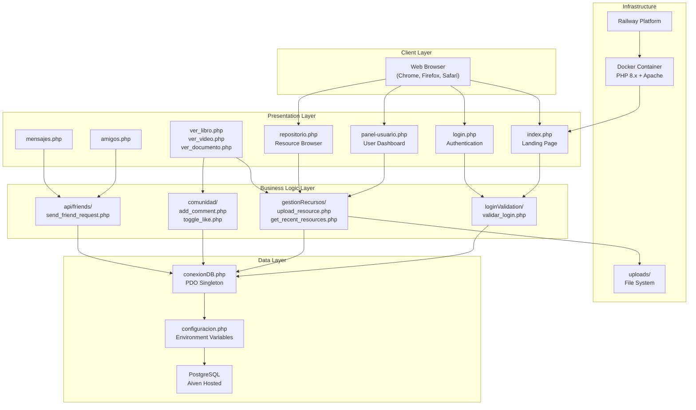
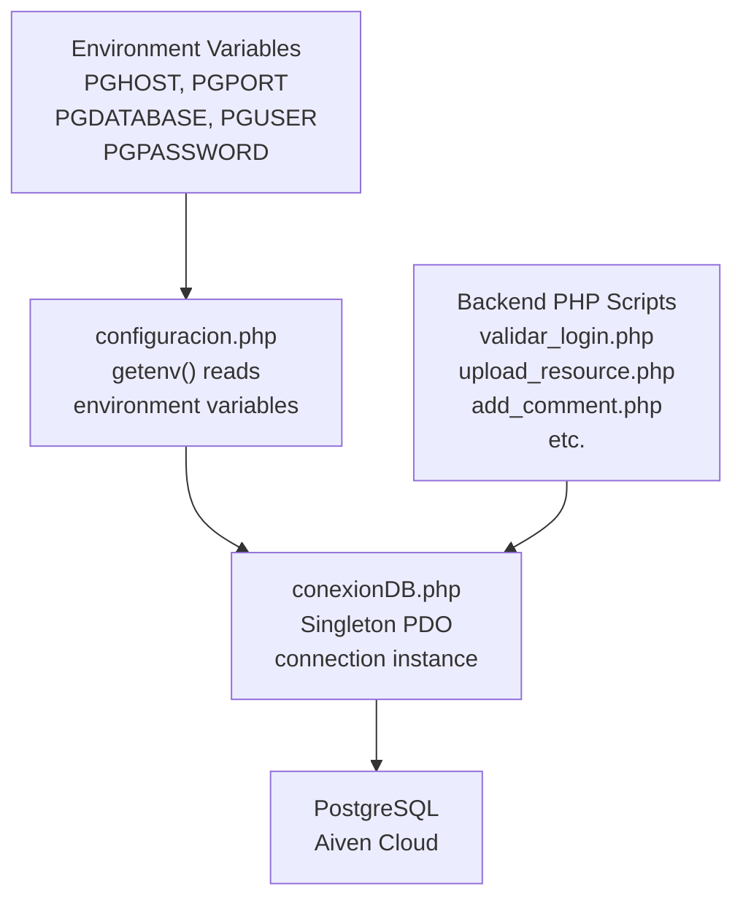
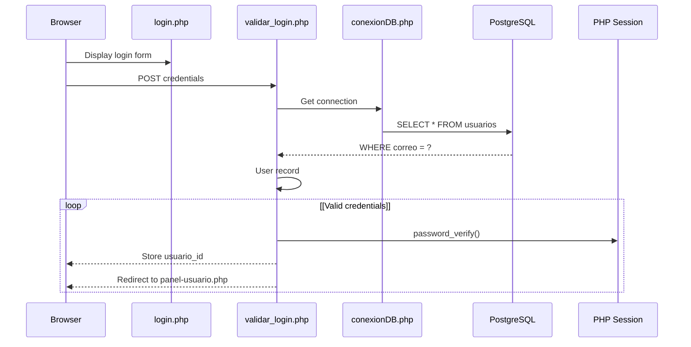

# Overview

> **Relevant source files**
> * [README.md](https://github.com/axchisan/El-rincon-de-ADSO/blob/3e310227/README.md)
> * [docs/Front End by-Angie.pdf](https://github.com/axchisan/El-rincon-de-ADSO/blob/3e310227/docs/Front End by-Angie.pdf)
> * [docs/informe-bitacora-de-contribuciones-duvan-250502_1414.pdf](https://github.com/axchisan/El-rincon-de-ADSO/blob/3e310227/docs/informe-bitacora-de-contribuciones-duvan-250502_1414.pdf)
> * [docs/informe-estructuracion-del-proyecto-repositorio-250502_1416.pdf](https://github.com/axchisan/El-rincon-de-ADSO/blob/3e310227/docs/informe-estructuracion-del-proyecto-repositorio-250502_1416.pdf)
> * [docs/informe-general-250502_1431.pdf](https://github.com/axchisan/El-rincon-de-ADSO/blob/3e310227/docs/informe-general-250502_1431.pdf)
> * [historial_commits.txt](https://github.com/axchisan/El-rincon-de-ADSO/blob/3e310227/historial_commits.txt)
> * [src/frontend/inicio/img/icono.png](https://github.com/axchisan/El-rincon-de-ADSO/blob/3e310227/src/frontend/inicio/img/icono.png)
> * [src/frontend/inicio/img/inicio.png](https://github.com/axchisan/El-rincon-de-ADSO/blob/3e310227/src/frontend/inicio/img/inicio.png)
> * [src/frontend/login/img/slide1.jpg](https://github.com/axchisan/El-rincon-de-ADSO/blob/3e310227/src/frontend/login/img/slide1.jpg)
> * [src/frontend/login/img/slide2.jpg](https://github.com/axchisan/El-rincon-de-ADSO/blob/3e310227/src/frontend/login/img/slide2.jpg)
> * [src/frontend/login/img/slide3.jpg](https://github.com/axchisan/El-rincon-de-ADSO/blob/3e310227/src/frontend/login/img/slide3.jpg)

## Purpose and Scope

El Rincón de ADSO is a web-based educational resource management platform designed for students and instructors in the SENA's Análisis y Desarrollo de Software (ADSO) program. The system provides centralized access to programming and computer science learning materials, including books, videos, documents, and interactive community features.

This document provides a high-level architectural overview of the platform, including its technology stack, deployment infrastructure, and core subsystems. For detailed information on specific subsystems, see:

* User authentication and session management: [Authentication System](/axchisan/El-rincon-de-ADSO/3-authentication-system)
* Resource browsing and viewing: [Resource Management System](/axchisan/El-rincon-de-ADSO/5-resource-management-system)
* Social networking features: [Social Features](/axchisan/El-rincon-de-ADSO/6-social-features)
* Database schema and tables: [Database Schema](/axchisan/El-rincon-de-ADSO/10-database-schema)
* Deployment procedures: [Getting Started](/axchisan/El-rincon-de-ADSO/2-getting-started)

**Sources:** [README.md L1-L311](https://github.com/axchisan/El-rincon-de-ADSO/blob/3e310227/README.md#L1-L311)

---

## System Architecture

El Rincón de ADSO follows a traditional three-tier web application architecture with clear separation between presentation, business logic, and data persistence layers.

### High-Level Architecture



The architecture separates concerns into distinct layers:

* **Client Layer**: Web browsers accessing the application via HTTP/HTTPS
* **Presentation Layer**: PHP pages located in `src/frontend/` that render HTML and handle user interactions
* **Business Logic Layer**: PHP scripts in `src/backend/` that process requests, validate data, and coordinate operations
* **Data Layer**: Database connection management and PostgreSQL database hosted on Aiven
* **Infrastructure**: Docker containerization deployed on Railway platform

**Sources:** [README.md L162-L204](https://github.com/axchisan/El-rincon-de-ADSO/blob/3e310227/README.md#L162-L204)

 Diagram 1 from high-level architecture

---

## Technology Stack

### Backend Technologies

| Technology | Version | Purpose |
| --- | --- | --- |
| PHP | 8.x | Server-side scripting language |
| PostgreSQL | Latest | Relational database management system |
| PDO | Built-in | Database abstraction layer with prepared statements |
| Apache/Nginx | Latest | Web server |

The backend uses PHP 8.x as the primary server-side language, with PostgreSQL hosted on Aiven providing data persistence. All database access uses PDO with prepared statements for SQL injection prevention.

### Frontend Technologies

| Technology | Purpose |
| --- | --- |
| HTML5 | Semantic markup structure |
| CSS3 | Responsive styling and layouts |
| JavaScript (ES6+) | Client-side interactivity and AJAX |
| Font Awesome | Icon library |
| AOS | Animation library for scroll effects |

The frontend implements a responsive design that adapts to mobile, tablet, and desktop viewports.

### DevOps and Infrastructure

| Technology | Purpose |
| --- | --- |
| Docker | Application containerization |
| Docker Compose | Multi-container orchestration |
| Railway | Cloud platform for deployment |
| Git | Version control |

**Sources:** [README.md L77-L96](https://github.com/axchisan/El-rincon-de-ADSO/blob/3e310227/README.md#L77-L96)

 [docker-compose.yml](https://github.com/axchisan/El-rincon-de-ADSO/blob/3e310227/docker-compose.yml)

 [Dockerfile](https://github.com/axchisan/El-rincon-de-ADSO/blob/3e310227/Dockerfile)

 [railway.json](https://github.com/axchisan/El-rincon-de-ADSO/blob/3e310227/railway.json)

---

## Core Subsystems

### 1. Authentication System

The authentication system manages user login, session management, and access control.

**Key Files:**

* [src/frontend/login/login.php](https://github.com/axchisan/El-rincon-de-ADSO/blob/3e310227/src/frontend/login/login.php)  - Login page interface
* [src/backend/loginValidation/validar_login.php](https://github.com/axchisan/El-rincon-de-ADSO/blob/3e310227/src/backend/loginValidation/validar_login.php)  - Credential verification
* [src/backend/register/register.php](https://github.com/axchisan/El-rincon-de-ADSO/blob/3e310227/src/backend/register/register.php)  - New user registration

Sessions are managed using PHP's native `session_start()` with a `usuario_id` stored in `$_SESSION` for authenticated users.

### 2. Resource Management System

The highest-importance component (`panel-usuario.php` with importance score 61.49) provides comprehensive resource management.

**Key Files:**

* [src/frontend/panel/panel-usuario.php 1](https://github.com/axchisan/El-rincon-de-ADSO/blob/3e310227/src/frontend/panel/panel-usuario.php#L1-LNaN)  - Main user dashboard
* [src/frontend/repositorio/repositorio.php](https://github.com/axchisan/El-rincon-de-ADSO/blob/3e310227/src/frontend/repositorio/repositorio.php)  - Public resource browser
* [src/backend/gestionRecursos/upload_resource.php](https://github.com/axchisan/El-rincon-de-ADSO/blob/3e310227/src/backend/gestionRecursos/upload_resource.php)  - File upload handler
* [src/backend/gestionRecursos/get_recent_resources.php](https://github.com/axchisan/El-rincon-de-ADSO/blob/3e310227/src/backend/gestionRecursos/get_recent_resources.php)  - Resource retrieval API

Resources support multiple formats (books, videos, documents) with categories, tags, and visibility controls (public/private/group).

### 3. Social Features

Social networking capabilities include friend management, messaging, and notifications.

**Key Files:**

* [src/frontend/friends/amigos.php](https://github.com/axchisan/El-rincon-de-ADSO/blob/3e310227/src/frontend/friends/amigos.php)  - Friend management interface
* [src/frontend/mensajes/mensajes.php](https://github.com/axchisan/El-rincon-de-ADSO/blob/3e310227/src/frontend/mensajes/mensajes.php)  - Real-time messaging system
* [src/frontend/notificaciones/notificaciones.php](https://github.com/axchisan/El-rincon-de-ADSO/blob/3e310227/src/frontend/notificaciones/notificaciones.php)  - Notification center
* [src/backend/api/friends/send_friend_request.php](https://github.com/axchisan/El-rincon-de-ADSO/blob/3e310227/src/backend/api/friends/send_friend_request.php)  - Friend request API

The notification system polls every 5 seconds for updates on friend requests, acceptances, and new messages.

### 4. Community Engagement

Users can comment, rate, and discuss resources.

**Key Files:**

* [src/backend/comunidad/add_comment.php](https://github.com/axchisan/El-rincon-de-ADSO/blob/3e310227/src/backend/comunidad/add_comment.php)  - Comment creation
* [src/backend/comunidad/add_reply.php](https://github.com/axchisan/El-rincon-de-ADSO/blob/3e310227/src/backend/comunidad/add_reply.php)  - Nested replies
* [src/backend/comunidad/toggle_like.php](https://github.com/axchisan/El-rincon-de-ADSO/blob/3e310227/src/backend/comunidad/toggle_like.php)  - Comment liking

Comments support nested replies, star ratings (1-5), and like/unlike functionality.

**Sources:** [README.md L36-L74](https://github.com/axchisan/El-rincon-de-ADSO/blob/3e310227/README.md#L36-L74)

 Diagram 2 and Diagram 3 from high-level architecture

---

## Database Architecture

### Connection Management



The database connection follows a singleton pattern implemented in `conexionDB.php`. Configuration is loaded from environment variables by `configuracion.php`, supporting both local development and cloud deployment scenarios.

### Core Database Tables

| Table | Purpose | Key Columns |
| --- | --- | --- |
| `usuarios` | User accounts and profiles | `usuario_id`, `correo`, `contrasena`, `nombre_usuario` |
| `documentos` | Educational resources | `documento_id`, `titulo`, `tipo`, `ruta_archivo`, `visibilidad` |
| `amistades` | Friend relationships | `amistad_id`, `usuario1_id`, `usuario2_id`, `estado` |
| `mensajes` | Chat messages | `mensaje_id`, `emisor_id`, `receptor_id`, `contenido` |
| `notificaciones` | System notifications | `notificacion_id`, `usuario_id`, `tipo`, `leido` |
| `comentarios` | Resource comments and ratings | `comentario_id`, `documento_id`, `usuario_id`, `calificacion` |
| `favoritos` | User favorites | `favorito_id`, `usuario_id`, `documento_id` |

All database operations use PDO prepared statements to prevent SQL injection attacks.

**Sources:** [src/database/configuracion.php](https://github.com/axchisan/El-rincon-de-ADSO/blob/3e310227/src/database/configuracion.php)

 [src/database/conexionDB.php](https://github.com/axchisan/El-rincon-de-ADSO/blob/3e310227/src/database/conexionDB.php)

 Diagram 5 from high-level architecture

---

## Request Flow

### Typical Authenticated Request Flow

```mermaid
sequenceDiagram
  participant Browser
  participant index.php or
  participant panel-usuario.php
  participant session_start()
  participant $_SESSION validation
  participant Backend API
  participant (gestionRecursos/
  participant or api/)
  participant conexionDB.php
  participant PDO Singleton
  participant PostgreSQL
  participant Aiven

  Browser->>index.php or: HTTP GET/POST Request
  index.php or->>session_start(): Check session
  loop [No valid session]
    session_start()-->>Browser: Redirect to login.php
  end
  index.php or->>Backend API: API call with parameters
  Backend API->>conexionDB.php: Get database connection
  conexionDB.php->>PostgreSQL: Execute prepared statement
  PostgreSQL-->>conexionDB.php: Query results
  conexionDB.php-->>Backend API: Data returned
  Backend API-->>index.php or: JSON or HTML response
  index.php or-->>Browser: Rendered page or JSON
```

### Authentication Flow



**Sources:** [src/frontend/login/login.php](https://github.com/axchisan/El-rincon-de-ADSO/blob/3e310227/src/frontend/login/login.php)

 [src/backend/loginValidation/validar_login.php](https://github.com/axchisan/El-rincon-de-ADSO/blob/3e310227/src/backend/loginValidation/validar_login.php)

 [src/frontend/panel/panel-usuario.php](https://github.com/axchisan/El-rincon-de-ADSO/blob/3e310227/src/frontend/panel/panel-usuario.php)

---

## Deployment Infrastructure

### Docker Configuration

The application is containerized using Docker with the following structure:

**Dockerfile** defines:

* Base image: PHP 8.2 with Apache
* PHP extensions: `pdo`, `pdo_pgsql`, `mbstring`, `gd`
* Document root: `/var/www/html`
* Exposed port: 80 (mapped to 89 externally)

**docker-compose.yml** orchestrates:

* Web service container
* Port mapping: `89:80`
* Volume mounts for persistent storage
* Environment variable injection

**railway.json** configures Railway deployment:

* Build settings
* Start command
* Environment variables
* Port configuration

### Environment Variables

Required environment variables for database connection:

| Variable | Description |
| --- | --- |
| `PGHOST` | PostgreSQL host address (Aiven) |
| `PGPORT` | Database port (default: 5432) |
| `PGDATABASE` | Database name |
| `PGUSER` | Database username |
| `PGPASSWORD` | Database password |

These variables are read by `configuracion.php` using `getenv()` and used to establish the PDO connection.

**Sources:** [README.md L99-L139](https://github.com/axchisan/El-rincon-de-ADSO/blob/3e310227/README.md#L99-L139)

 [docker-compose.yml](https://github.com/axchisan/El-rincon-de-ADSO/blob/3e310227/docker-compose.yml)

 [Dockerfile](https://github.com/axchisan/El-rincon-de-ADSO/blob/3e310227/Dockerfile)

 [railway.json](https://github.com/axchisan/El-rincon-de-ADSO/blob/3e310227/railway.json)

 [src/database/configuracion.php](https://github.com/axchisan/El-rincon-de-ADSO/blob/3e310227/src/database/configuracion.php)

---

## File Organization

```mermaid
flowchart TD

Root["El_Rincon_de_ADSO/"]
Src["src/"]
Docs["docs/"]
DockerCompose["docker-compose.yml"]
DockerFile["Dockerfile"]
Railway["railway.json"]
Readme["README.md"]
Backend["backend/"]
Frontend["frontend/"]
Database["database/"]
API["api/<br>eventos.php<br>foro.php<br>mensajes.php<br>notificaciones.php"]
Comunidad["comunidad/<br>add_comment.php<br>toggle_like.php"]
GestionRecursos["gestionRecursos/<br>upload_resource.php<br>get_recent_resources.php<br>get_user_favorites.php"]
LoginValidation["loginValidation/<br>validar_login.php"]
Register["register/"]
Perfil["perfil/<br>update.php"]
Inicio["inicio/<br>index.php"]
Login["login/<br>login.php"]
Panel["panel/<br>panel-usuario.php"]
Repositorio["repositorio/<br>repositorio.php"]
Friends["friends/<br>amigos.php"]
Mensajes["mensajes/<br>mensajes.php"]
Notificaciones["notificaciones/<br>notificaciones.php"]
Foro["foro/"]
Eventos["eventos/"]
Configuracion["configuracion.php"]
ConexionDB["conexionDB.php"]

Root --> Src
Root --> Docs
Root --> DockerCompose
Root --> DockerFile
Root --> Railway
Root --> Readme
Src --> Backend
Src --> Frontend
Src --> Database
Backend --> API
Backend --> Comunidad
Backend --> GestionRecursos
Backend --> LoginValidation
Backend --> Register
Backend --> Perfil
Frontend --> Inicio
Frontend --> Login
Frontend --> Panel
Frontend --> Repositorio
Frontend --> Friends
Frontend --> Mensajes
Frontend --> Notificaciones
Frontend --> Foro
Frontend --> Eventos
Database --> Configuracion
Database --> ConexionDB
```



The codebase is organized into three primary directories under `src/`:

* **backend/**: Contains all server-side business logic organized by feature (authentication, resource management, community, etc.)
* **frontend/**: Contains all PHP pages that generate HTML for the user interface
* **database/**: Contains database configuration and connection management

Additional directories:

* **docs/**: Project documentation and reports
* **uploads/**: File storage for user-uploaded resources and profile images (not in repository)

**Sources:** [README.md L162-L204](https://github.com/axchisan/El-rincon-de-ADSO/blob/3e310227/README.md#L162-L204)

---

## Security Measures

### SQL Injection Prevention

All database queries use PDO prepared statements with parameter binding. Example pattern from backend files:

```sql
$stmt = $conn->prepare("SELECT * FROM usuarios WHERE correo = :correo");
$stmt->bindParam(':correo', $correo);
$stmt->execute();
```

### Password Security

User passwords are hashed using PHP's `password_hash()` function with `PASSWORD_DEFAULT` algorithm and verified using `password_verify()`.

### Session Management

* Sessions are initiated with `session_start()` on protected pages
* User identity stored as `$_SESSION['usuario_id']`
* Session validation occurs at the start of each protected page
* Invalid sessions redirect to login page

### File Upload Validation

File uploads are validated for:

* File type (MIME type checking)
* File size limits
* Allowed extensions
* Secure storage paths outside web root

### Access Control

* Friendship verification for profile viewing and messaging
* Resource visibility rules (public/private/group)
* User ownership checks for edit/delete operations

**Sources:** [src/backend/loginValidation/validar_login.php](https://github.com/axchisan/El-rincon-de-ADSO/blob/3e310227/src/backend/loginValidation/validar_login.php)

 [src/backend/gestionRecursos/upload_resource.php](https://github.com/axchisan/El-rincon-de-ADSO/blob/3e310227/src/backend/gestionRecursos/upload_resource.php)

 [src/database/conexionDB.php](https://github.com/axchisan/El-rincon-de-ADSO/blob/3e310227/src/database/conexionDB.php)

---

## Key Features Summary

| Feature Category | Capabilities |
| --- | --- |
| **Resource Management** | Multiple format support (books, videos, documents), categories and tags, cover images, public/private/group visibility |
| **User Management** | Registration, login, profile editing, avatar upload, password change |
| **Social Features** | Friend requests, friend lists, real-time messaging, notifications (5s polling), user search |
| **Community** | Comments on resources, nested replies, star ratings (1-5), like system, forums, events |
| **Search** | Multi-criteria filtering (type, category, language, relevance), pagination, sorting options |
| **Content Discovery** | Recently viewed tracking, favorites, saved for later, user contributions, trending resources |

**Sources:** [README.md L36-L74](https://github.com/axchisan/El-rincon-de-ADSO/blob/3e310227/README.md#L36-L74)

---

## Development Team

El Rincón de ADSO was developed by nine SENA ADSO program students:

* Duvan Arciniegas (Team Lead and Full-Stack Development)
* Gerardo Ardila (Backend Development)
* Daniela Pardo (Backend Development)
* Jhony Saavedra (Development and Testing)
* Daniela Gomez (Frontend Development)
* Nelson Arias (Frontend Development)
* Disler Celeny (Frontend Development)
* Lenis García (Documentation and Resource Management)
* Julian Jaramillo (Resource Management)

**Sources:** [README.md L269-L282](https://github.com/axchisan/El-rincon-de-ADSO/blob/3e310227/README.md#L269-L282)